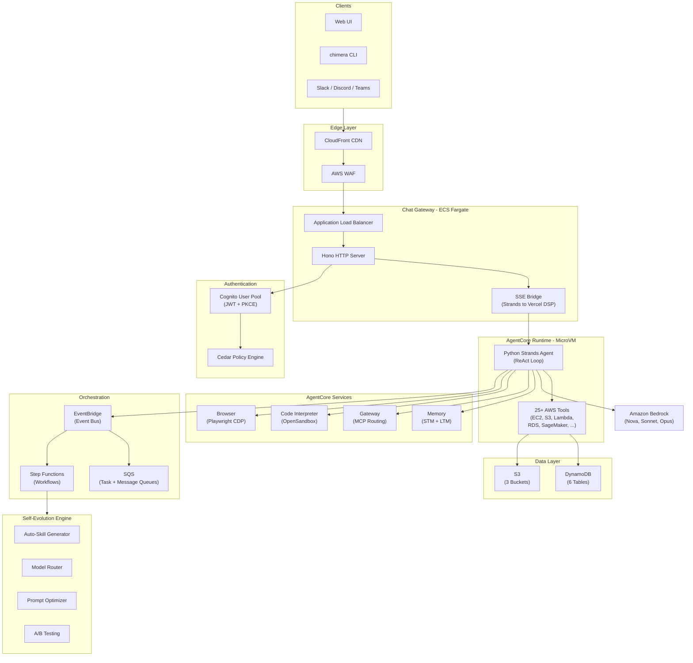
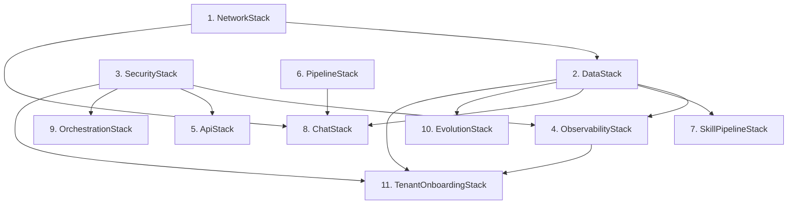
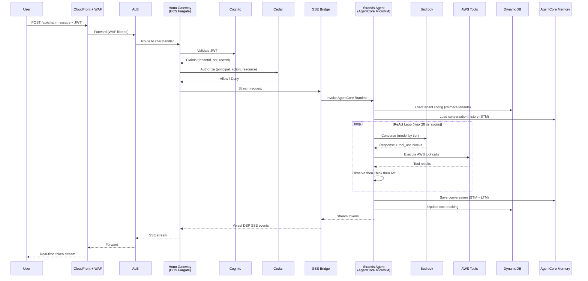

# Chimera Architecture Reference

## 1. System Overview

Chimera is a **self-evolving, multi-tenant, Agent-as-a-Service platform** built entirely on AWS managed services. Tenants deploy AI agents that have first-class access to their AWS accounts through 25+ tools spanning compute, storage, analytics, AI/ML, and CI/CD. The platform uses Bedrock AgentCore for MicroVM-isolated agent execution, Strands SDK for the ReAct agent loop, and a Hono + Vercel AI SDK chat gateway for SSE-streamed responses. Multi-tenancy is enforced through Cognito JWT routing, Cedar authorization policies, per-tenant KMS encryption, and DynamoDB partition isolation. The platform self-evolves through 7 evolution modules that auto-generate skills, optimize model routing, A/B test prompts, and modify its own infrastructure under Cedar-bounded safety constraints.

---

## 2. Architecture Diagram



### Request Flow (Simplified)

```
User message
  -> CloudFront -> WAF
  -> ALB -> Hono chat-gateway (ECS Fargate)
  -> JWT validation (Cognito) -> Cedar authorization
  -> SSE Bridge -> AgentCore Runtime (MicroVM)
  -> Strands Agent (ReAct loop)
  -> Bedrock model inference + AWS tool execution
  -> SSE-streamed response back to client
```

---

## 3. Deployment Flow

```mermaid
flowchart LR
    Dev["Developer\nchimera deploy"]
    CC["CodeCommit\n(Git Repository)"]
    CP["CodePipeline\n(CI/CD)"]
    CB["CodeBuild\n(Build + Test)"]
    CDK["CDK Synth\n(11 Stacks)"]
    CFN["CloudFormation\n(Deploy)"]
    Canary["Canary\nDeployment"]
    Prod["Production\n(Progressive Rollout)"]

    Dev -->|"CreateCommit API\n(batched 5MB)"| CC
    CC --> CP
    CP --> CB
    CB --> CDK
    CDK --> CFN
    CFN --> Canary
    Canary -->|"Auto-rollback\non alarm"| Prod
```



### CLI Deploy Pipeline

1. **chimera deploy** - CLI collects project files, detects binaries, batches into 5MB chunks
2. **CodeCommit** - Files pushed via CreateCommit API (not shell git)
3. **CodePipeline** - Triggered on commit to configured branch
4. **CodeBuild** - Runs bun install, bun test, npx cdk synth
5. **CloudFormation** - Deploys 11 CDK stacks with dependency ordering
6. **Canary** - Progressive rollout with CloudWatch alarm-based auto-rollback

---

## 4. Stack Map

Chimera deploys **11 CDK stacks** in dependency order. All stacks use the naming convention Chimera-{env}-{StackName}.

| # | Stack | CloudFormation Name | What It Deploys | Dependencies |
|---|-------|-------------------|-----------------|--------------|
| 1 | **NetworkStack** | Chimera-{env}-Network | VPC, subnets, NAT gateways, VPC endpoints, security groups | None |
| 2 | **DataStack** | Chimera-{env}-Data | 6 DynamoDB tables (tenants, sessions, skills, rate-limits, cost-tracking, audit), 3 S3 buckets (tenant data, skills, artifacts) | Network |
| 3 | **SecurityStack** | Chimera-{env}-Security | Cognito user pool, WAF WebACL, KMS platform key | None |
| 4 | **ObservabilityStack** | Chimera-{env}-Observability | CloudWatch dashboards, SNS alarm topic, X-Ray config, DynamoDB throttle alarms | Data, Security |
| 5 | **ApiStack** | Chimera-{env}-Api | REST API v1 (JWT authorizer), WebSocket API, webhook routes, OpenAI-compatible endpoint | Security |
| 6 | **PipelineStack** | Chimera-{env}-Pipeline | CodePipeline (canary deployment), CodeCommit repository, ECR repositories (agent + chat-gateway) | None |
| 7 | **SkillPipelineStack** | Chimera-{env}-SkillPipeline | 7-stage Step Functions security scanning workflow for marketplace skills | Data |
| 8 | **ChatStack** | Chimera-{env}-Chat | ECS Fargate service, ALB, Hono chat-gateway, SSE streaming, platform adapters | Network, Data, Pipeline |
| 9 | **OrchestrationStack** | Chimera-{env}-Orchestration | EventBridge event bus, SQS queues (task distribution + A2A messaging) | Security |
| 10 | **EvolutionStack** | Chimera-{env}-Evolution | Prompt A/B testing, auto-skill generation, model routing optimization, memory GC, cron self-scheduling | Data |
| 11 | **TenantOnboardingStack** | Chimera-{env}-TenantOnboarding | Cedar policy store, Step Functions provisioning workflow (DDB records, Cognito groups, IAM roles, S3 prefixes, Cedar policies, cost tracking) | Data, Security, Observability |

### Stack Dependency Graph



---

## 5. Package Map

Chimera is a **monorepo** with 6 packages spanning TypeScript and Python.

| Package | Language | Description | Key Dependencies |
|---------|----------|-------------|-----------------|
| **@chimera/core** | TypeScript | Agent runtime wrapper - Strands agent definitions, AgentCore Runtime integration, universal skill loading, 21 core modules (activity, auth, billing, discovery, evolution, gateway, infra-builder, media, memory, multi-account, orchestration, skills, swarm, tenant, tools, well-architected) | strands, @aws-sdk/* |
| **chimera-agents** | Python | Production agent runtime deployed to AgentCore - Strands SDK ReAct loop, 25+ AWS service tools, multi-tenant context via JWT claims, tier-based model selection, AgentCore Memory integration | strands-agents, bedrock-agentcore-sdk, boto3 |
| **@chimera/sse-bridge** | TypeScript | SSE bridge translating Strands AgentCore streaming events to Vercel AI SDK Data Stream Protocol - enables real-time token-by-token streaming to web clients | ai (Vercel AI SDK) |
| **@chimera/chat-gateway** | TypeScript | Hono HTTP server on ECS Fargate - JWT authentication, tenant routing, SSE streaming endpoint, multi-platform chat adapter stubs (Slack, Discord, Teams, Telegram) | hono, @chimera/core, @chimera/sse-bridge, aws-jwt-verify |
| **@chimera/cli** | TypeScript | chimera CLI tool - deploy (CodeCommit push), tenant (CRUD), session (management), skill (registry), connect (live chat), status (health check) commands | commander, @aws-sdk/* |
| **@chimera/shared** | TypeScript | Shared types and utilities - TypeScript interfaces, schemas, and helpers consumed by all other packages | None (leaf dependency) |

### Package Dependency Graph

```
@chimera/shared (leaf)
    ^
@chimera/core --> @chimera/shared
    ^
@chimera/sse-bridge --> @chimera/core
    ^
@chimera/chat-gateway --> @chimera/core + @chimera/sse-bridge + @chimera/shared
    ^
@chimera/cli --> @chimera/shared

chimera-agents (Python, standalone - deployed to AgentCore Runtime)
```

---

## 6. ADR Index

Architecture Decision Records are in docs/architecture/decisions/.

### Core Architecture

| ADR | Title | Summary |
|-----|-------|---------|
| [ADR-001](./decisions/ADR-001-six-table-dynamodb.md) | 6-Table DynamoDB Design | 6 purpose-specific tables over single-table design for clarity and independent scaling |
| [ADR-002](./decisions/ADR-002-cedar-policy-engine.md) | Cedar Policy Engine | Cedar over OPA for fine-grained authorization with AWS-native integration |
| [ADR-003](./decisions/ADR-003-strands-agent-framework.md) | Strands Agent Framework | Strands over LangChain/CrewAI for transparent ReAct loop and AWS integration |
| [ADR-004](./decisions/ADR-004-vercel-ai-sdk-chat.md) | Vercel AI SDK Chat Layer | Vercel AI SDK + SSE Bridge for real-time streaming chat |
| [ADR-005](./decisions/ADR-005-aws-cdk-iac.md) | AWS CDK for IaC | CDK over OpenTofu/Pulumi for type-safe infrastructure |

### Storage and Isolation

| ADR | Title | Summary |
|-----|-------|---------|
| [ADR-006](./decisions/ADR-006-monorepo-structure.md) | Monorepo Structure | Monorepo over polyrepo for shared types and atomic changes |
| [ADR-007](./decisions/ADR-007-agentcore-microvm.md) | AgentCore MicroVM Isolation | AgentCore MicroVM over ECS/Lambda for per-tenant agent isolation |
| [ADR-008](./decisions/ADR-008-eventbridge-nervous-system.md) | EventBridge Nervous System | EventBridge as central event bus for all inter-service communication |
| [ADR-010](./decisions/ADR-010-s3-efs-hybrid-storage.md) | S3 + EFS Hybrid Storage | Hybrid storage: S3 for durable artifacts, EFS for ephemeral agent workspaces |

### Data and Skills

| ADR | Title | Summary |
|-----|-------|---------|
| [ADR-009](./decisions/ADR-009-universal-skill-adapter.md) | Universal Skill Adapter | Adapter pattern for loading skills from SKILL.md, MCP, and native formats |
| [ADR-011](./decisions/ADR-011-self-modifying-iac.md) | Self-Modifying IaC | DynamoDB-driven CDK synthesis enables agent-autonomous infrastructure changes |
| [ADR-016](./decisions/ADR-016-agentcore-memory-strategy.md) | AgentCore Memory Strategy | Tier-based STM + LTM memory with namespace isolation per tenant/user |

### Operational Excellence

| ADR | Title | Summary |
|-----|-------|---------|
| [ADR-012](./decisions/ADR-012-well-architected-framework.md) | Well-Architected Framework | 6-pillar review tool for agent-driven architecture assessments |
| [ADR-013](./decisions/ADR-013-codecommit-codepipeline.md) | CodeCommit + CodePipeline | Git-backed workspaces and CI/CD for infrastructure-as-capability |

### Tech Stack

| ADR | Title | Summary |
|-----|-------|---------|
| [ADR-014](./decisions/ADR-014-token-bucket-rate-limiting.md) | Token Bucket Rate Limiting | Token bucket over sliding window for DynamoDB-native rate limiting |
| [ADR-015](./decisions/ADR-015-bun-mise-toolchain.md) | Bun + Mise Toolchain | Bun for package management and scripts, Mise for runtime version management |
| [ADR-017](./decisions/ADR-017-multi-provider-llm.md) | Multi-Provider LLM Support | Dynamic model routing across Bedrock foundation models by tier |
| [ADR-018](./decisions/ADR-018-skill-md-v2.md) | SKILL.md v2 Format | Extended skill manifest format with security metadata and trust levels |

> **Note**: ADRs 019+ may be added by concurrent documentation agents. See the decisions README for the latest index.

---

## 7. Communication Patterns

### SSE Streaming (Client-Agent)

```
Client (browser)
  -> HTTP POST /api/chat (Hono)
  -> Cognito JWT validation
  -> Cedar authorization check
  -> AgentCore Runtime invocation
  -> Strands ReAct loop (model + tools)
  -> SSE Bridge translates to Vercel Data Stream Protocol
  -> Server-Sent Events stream back to client
```

The SSE bridge (@chimera/sse-bridge) converts Strands streaming output into Vercel AI SDK Data Stream Protocol, enabling useChat() React hooks on the client side to render token-by-token responses.

### EventBridge Events (Inter-Service)

EventBridge is the **central nervous system** for asynchronous communication between stacks. Events use the chimera source namespace.

| Event Pattern | Producer | Consumer | Purpose |
|---------------|----------|----------|---------|
| chimera.task.created | API Gateway | OrchestrationStack | New agent task queued |
| chimera.task.completed | AgentCore Runtime | ObservabilityStack | Task completion metrics |
| chimera.skill.submitted | Skill Registry | SkillPipelineStack | Trigger security scan |
| chimera.tenant.created | TenantOnboardingStack | ObservabilityStack | Onboarding metrics |
| chimera.evolution.* | EvolutionStack | ObservabilityStack | A/B test results, model routing changes |
| chimera.cost.threshold | Cost Tracker | ObservabilityStack + SNS | Budget alerts |

### SQS Task Distribution (Agent-to-Agent)

Two SQS queues in OrchestrationStack enable multi-agent workflows:

- **Task Queue** - Distributes work items to agent MicroVMs (fan-out pattern)
- **Message Queue** - Agent-to-agent communication for swarm coordination (point-to-point)

Both queues use KMS encryption via the platform key and have dead-letter queues for failed messages.

### Memory Tiers (Agent State)

AgentCore Memory provides namespace-isolated state per tenant/user:

| Tier | Strategies | STM Window | LTM Retention |
|------|-----------|------------|---------------|
| **Basic** | SUMMARY | 10 messages | 7 days |
| **Advanced** | SUMMARY + USER_PREFERENCE | 50 messages | 30 days |
| **Premium** | SUMMARY + USER_PREFERENCE + SEMANTIC_MEMORY | 200 messages | 365 days |

Memory namespaces follow the pattern tenant-{tenantId}-user-{userId} for complete isolation.

---

## 8. Data Flow

### User Message to Agent Response



### Multi-Agent Workflow (Swarm)

```
Task submitted via API
  -> EventBridge (chimera.task.created)
  -> Step Functions orchestration workflow
  -> Task Decomposer (splits into subtasks)
  -> Role Assigner (maps subtasks to agent types)
  -> SQS Task Queue (fan-out to MicroVMs)
  -> Agent MicroVMs execute in parallel
  -> Progressive Refiner (merges results)
  -> Blocker Resolver (handles failures)
  -> HITL Gateway (human-in-the-loop if needed)
  -> Final result -> EventBridge (chimera.task.completed)
```

### Tenant Onboarding Flow

```
Admin creates tenant via API
  -> TenantOnboarding Step Functions workflow
  -> Create DynamoDB records (tenants, rate-limits, cost-tracking)
  -> Create Cognito user group
  -> Create IAM execution role
  -> Create S3 tenant prefix
  -> Create Cedar authorization policies
  -> Initialize cost tracking
  -> Send welcome notification
```

---

*Chimera - where agents are forged.*
