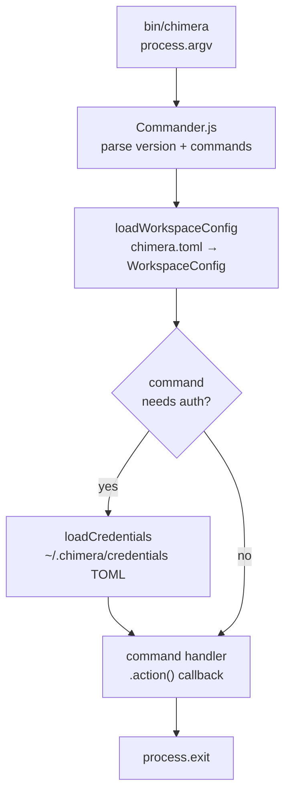
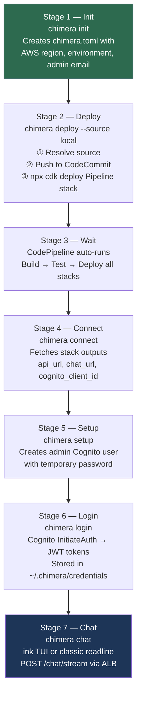
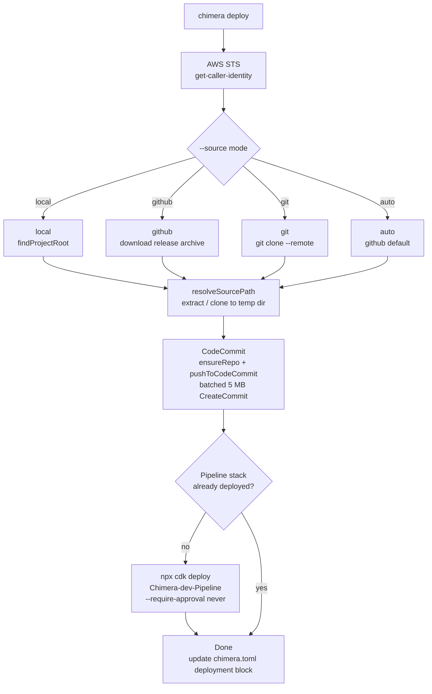
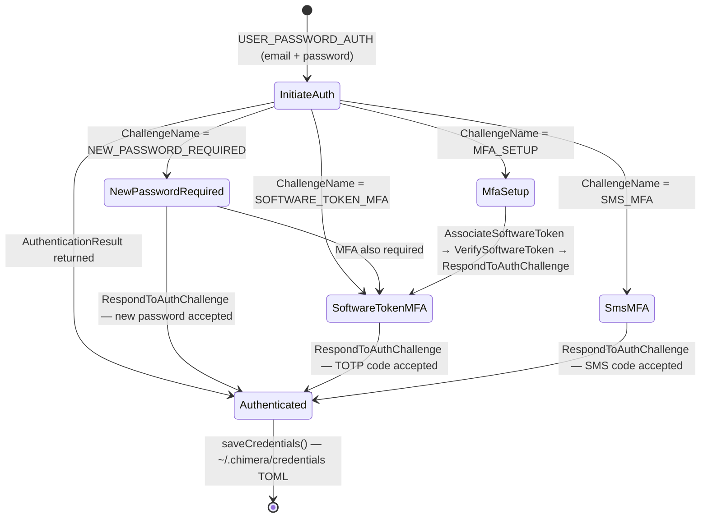
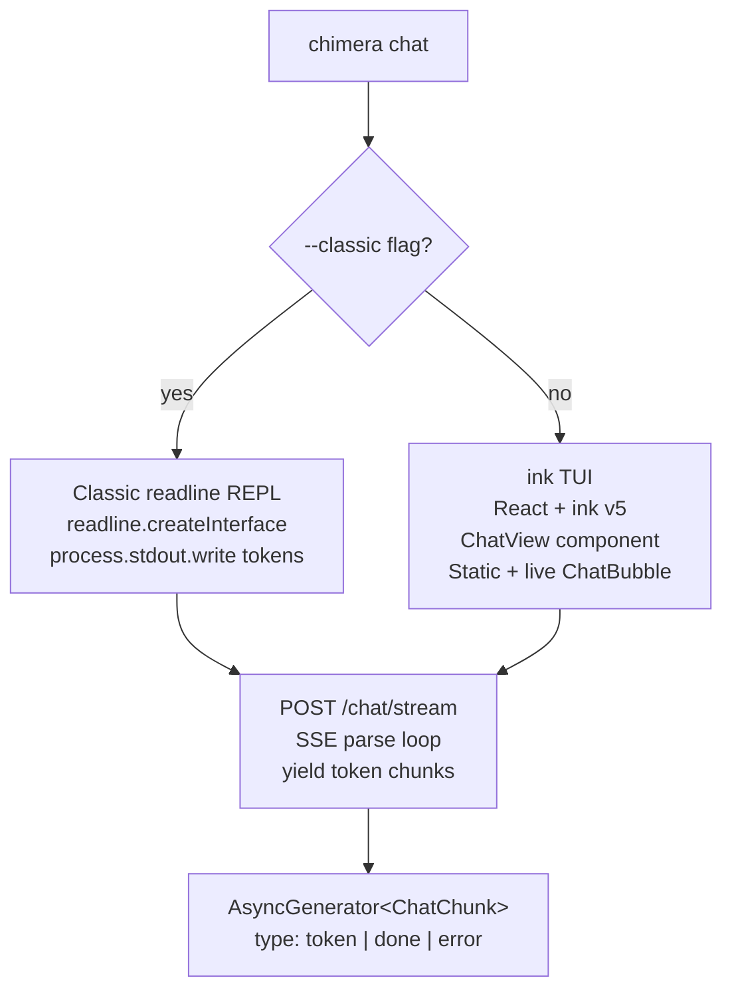
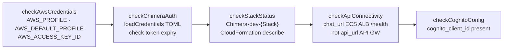

# Chimera CLI Lifecycle

Detailed breakdown of the `chimera` CLI — its command registry, internal lifecycle stages, and the canonical operator workflow from first run to active chat.

---

## Command Registry

The CLI is implemented with [Commander.js](https://github.com/tj/commander.js) and registers 14 commands at startup. Each command lives in `packages/cli/src/commands/<name>.ts`.

| Command | Description | Key Interactions |
|---------|-------------|-----------------|
| `init` | Scaffold `chimera.toml` with AWS config and admin email | Writes `~/.chimera/chimera.toml` |
| `deploy` | Push source to CodeCommit + deploy Pipeline CDK stack | CodeCommit · CodePipeline · `npx cdk` |
| `setup` | Provision admin Cognito user post-deploy | Cognito AdminCreateUser |
| `connect` | Fetch stack outputs → endpoints in `chimera.toml` | CloudFormation DescribeStacks |
| `login` | Authenticate via Cognito, persist tokens | Cognito InitiateAuth → `~/.chimera/credentials` |
| `chat` | Interactive chat session (ink TUI or readline) | POST `/chat/stream` → SSE |
| `doctor` | Health check all platform components | AWS STS · Cognito · ALB · CFN |
| `tenant` | Manage tenant records (list, create, update) | DynamoDB `chimera-tenants` |
| `session` | View and manage agent sessions | DynamoDB `chimera-sessions` |
| `skill` | Install, list, remove skills | SkillPipeline Step Functions |
| `status` | Show deployment status from `chimera.toml` | CloudFormation stack statuses |
| `sync` | Sync local workspace config with deployed state | CloudFormation stack outputs |
| `upgrade` | Download and install a new CLI binary | GitHub Releases |
| `destroy` | Tear down all CDK stacks for an environment | `npx cdk destroy --all` |

---

## CLI Startup Lifecycle

Every invocation goes through these stages before a command handler runs:



Config resolution order for `chimera.toml`:
1. `--config <path>` flag (if supported by command)
2. Current directory (`./chimera.toml`)
3. `~/.chimera/chimera.toml` (global config)

---

## Canonical Operator Workflow

The 7-stage lifecycle for taking a blank AWS account to a working Chimera deployment.



---

## Deploy Command Internals

`chimera deploy` has four source modes and two execution paths depending on whether the Pipeline stack already exists.



After the first deploy, subsequent `chimera deploy` calls only push source to CodeCommit. CodePipeline detects the change and re-deploys all stacks automatically.

---

## Login Command — Challenge Loop

Cognito can require multiple challenge responses before issuing tokens. The CLI handles the full chain.



The loop condition: `while (!authResult && challengeName)` — continues until Cognito returns `AuthenticationResult` with `AccessToken`.

---

## Chat Command — Rendering Paths

The `chat` command has two rendering modes, selected at runtime:



**ink module resolution:** ink v5 requires `moduleResolution: 'bundler'` (or `node16/nodenext`) in `tsconfig.json`. When compiling with `bun build --compile`, use `--external react-devtools-core` to avoid bundling errors.

---

## Doctor Command — Health Checks

`chimera doctor` validates every platform component in sequence.



**Key convention:** `checkApiConnectivity` must use `chat_url` (ECS ALB endpoint), not `api_url` (API Gateway). The ALB exposes `/health`; API Gateway does not.

---

## Configuration Files

| File | Format | Purpose |
|------|--------|---------|
| `./chimera.toml` (or `~/.chimera/chimera.toml`) | TOML | Workspace config: AWS region, environment, endpoints, deployment state |
| `~/.chimera/credentials` | TOML | Auth tokens: `access_token`, `id_token`, `refresh_token`, `expires_at` |

`chimera.toml` sections:

```toml
[aws]
region = "us-west-2"
profile = "default"

[workspace]
environment = "dev"
repository = "chimera"

[auth]
admin_email = "admin@example.com"   # non-sensitive, stored here

[endpoints]
api_url = "https://..."
chat_url = "https://..."            # ECS ALB — used by chat + doctor
cognito_client_id = "..."

[deployment]
account_id = "123456789012"
status = "deployed"
last_deployed = "2026-03-30T00:00:00.000Z"
```

---

## Source Code Map

```
packages/cli/src/
├── cli.ts                  # Commander.js setup, 14 command registrations
├── commands/
│   ├── chat.ts             # ink TUI + readline REPL, SSE parsing
│   ├── deploy.ts           # CodeCommit push, npx cdk deploy Pipeline
│   ├── doctor.ts           # 5 health checks, TOML credentials parsing
│   ├── init.ts             # chimera.toml scaffold
│   ├── login.ts            # Cognito challenge loop, credentials persistence
│   ├── setup.ts            # Cognito AdminCreateUser
│   ├── connect.ts          # CloudFormation stack outputs → chimera.toml
│   └── ...                 # tenant, session, skill, status, sync, upgrade, destroy
├── auth/
│   └── browser-server.ts   # Bun.serve localhost:9999, PKCE OAuth callback
├── lib/
│   ├── api-client.ts       # fetch wrapper, Bearer token injection
│   └── color.ts            # terminal color helpers
├── tui/
│   └── chat/
│       └── ChatView.tsx    # ink Static + live ChatBubble streaming
└── utils/
    ├── workspace.ts        # loadWorkspaceConfig, loadCredentials, saveCredentials
    ├── project.ts          # findProjectRoot() — walks up to package.json
    ├── source.ts           # resolveSourcePath (local / github / git-clone)
    └── codecommit.ts       # pushToCodeCommit batched 5 MB CreateCommit
```

---

*Author: builder-arch-docs | Task: chimera-17ef | Status: Canonical*
