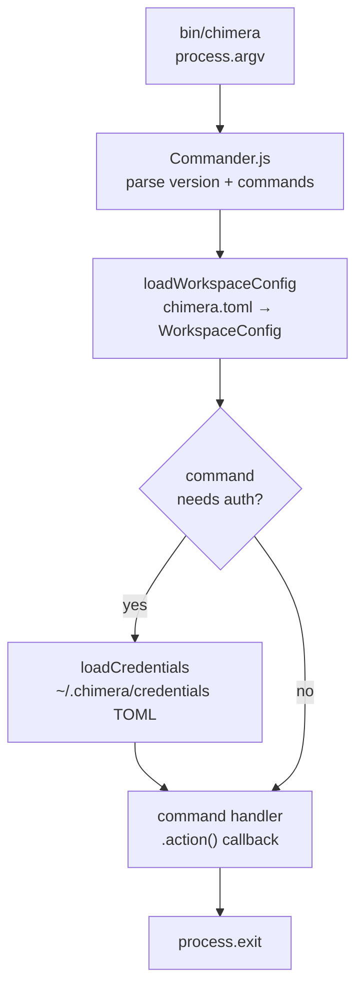
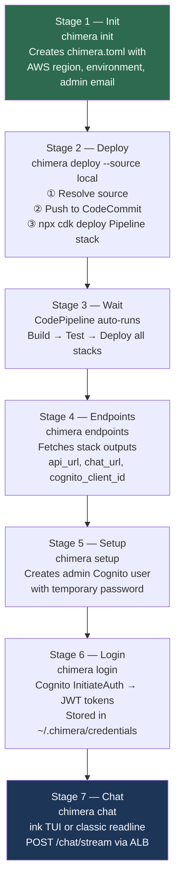
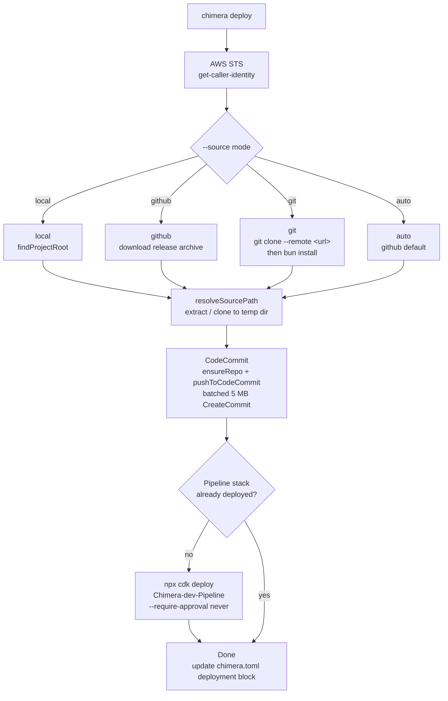
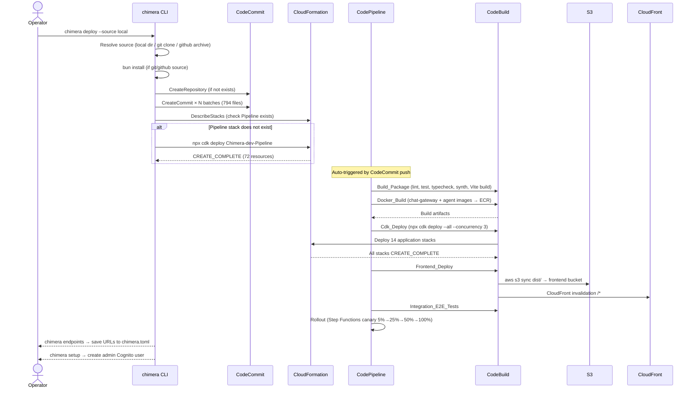
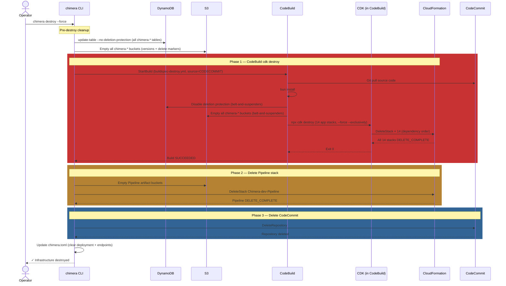
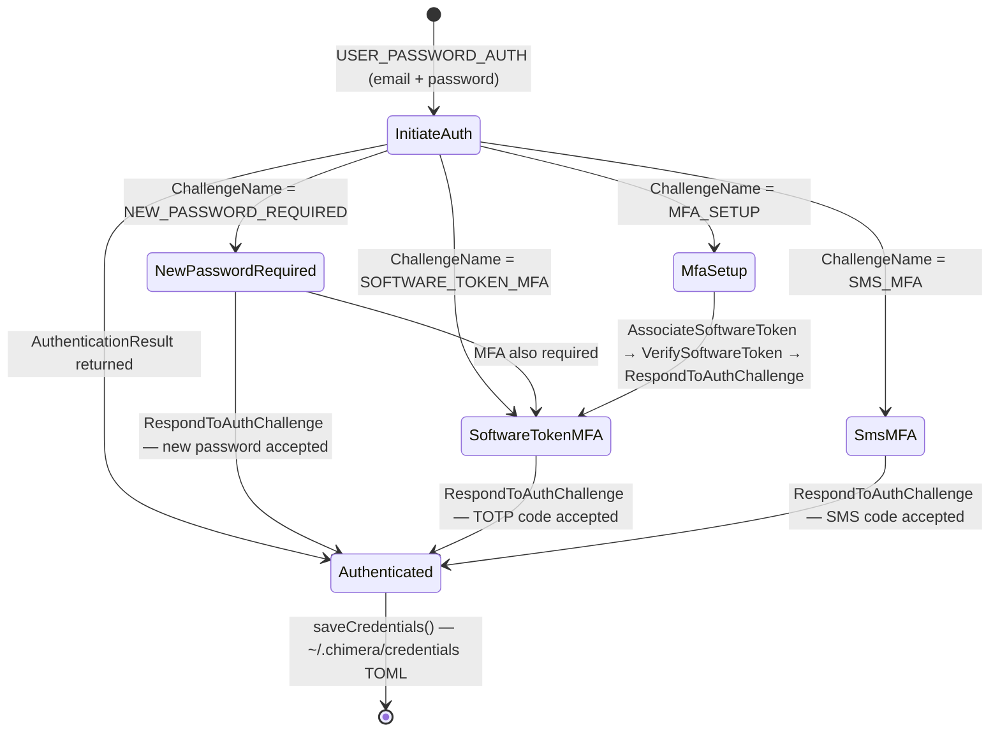
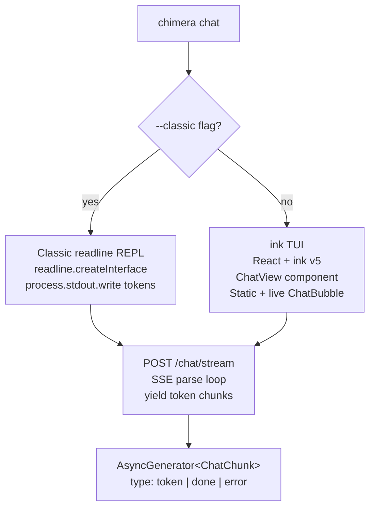

# Chimera CLI Lifecycle

Detailed breakdown of the `chimera` CLI — its command registry, internal lifecycle stages, and the canonical operator workflow from first run to active chat.

---

## Command Registry

The CLI is implemented with [Commander.js](https://github.com/tj/commander.js) and registers 20 commands at startup. Each command lives in `packages/cli/src/commands/<name>.ts`.

| Command      | Description                                                                                             | Key Interactions                                               |
| ------------ | ------------------------------------------------------------------------------------------------------- | -------------------------------------------------------------- |
| `init`       | Scaffold `chimera.toml` with AWS config and admin email                                                 | Writes `~/.chimera/chimera.toml`                               |
| `deploy`     | Push source to CodeCommit + deploy Pipeline CDK stack                                                   | CodeCommit · CodePipeline · `npx cdk`                          |
| `setup`      | Provision admin Cognito user post-deploy                                                                | Cognito AdminCreateUser                                        |
| `endpoints`  | Fetch deployed stack output URLs and save to `chimera.toml`                                             | CloudFormation DescribeStacks                                  |
| `login`      | Authenticate via Cognito, persist tokens                                                                | Cognito InitiateAuth → `~/.chimera/credentials`                |
| `chat`       | Interactive chat session (ink TUI or readline)                                                          | POST `/chat/stream` → SSE                                      |
| `doctor`     | Health check all platform components                                                                    | AWS STS · Cognito · ALB · CFN                                  |
| `tenant`     | Manage tenant records (list, create, update)                                                            | DynamoDB `chimera-tenants`                                     |
| `session`    | View and manage agent sessions                                                                          | DynamoDB `chimera-sessions`                                    |
| `skill`      | Install, list, remove skills                                                                            | SkillPipeline Step Functions                                   |
| `status`     | Show deployment status from `chimera.toml`                                                              | CloudFormation stack statuses                                  |
| `sync`       | Sync local workspace config with deployed state                                                         | CloudFormation stack outputs                                   |
| `upgrade`    | Download and install a new CLI binary                                                                   | GitHub Releases                                                |
| `diff`       | Show differences between local workspace and CodeCommit                                                 | CodeCommit GetFile · GetFolder                                 |
| `trigger`    | Manually start a CodePipeline execution                                                                 | CodePipeline StartPipelineExecution                            |
| `monitor`    | Watch CodePipeline execution in real-time (or CloudFormation stack events with `--stack`)               | CodePipeline GetPipelineState · ListPipelineExecutions         |
| `destroy`    | Tear down all Chimera infrastructure (3-phase: CodeBuild destroy → Pipeline delete → CodeCommit delete) | CodeBuild StartBuild · CloudFormation DeleteStack · CodeCommit |
| `cleanup`    | Delete Chimera stacks stuck in ROLLBACK_COMPLETE state                                                  | CloudFormation ListStacks · DeleteStack                        |
| `redeploy`   | Clean up failed stacks then retry CDK deployment                                                        | CloudFormation · `npx cdk deploy --all`                        |
| `completion` | Generate shell completion scripts (bash/zsh/fish)                                                       | stdout                                                         |

> **Note:** `connect` is a hidden deprecated alias for `endpoints`.

---

## CLI Startup Lifecycle

Every invocation goes through these stages before a command handler runs:



Config resolution order for `chimera.toml`:

1. `--config <path>` flag (if supported by command)
2. Current directory (`./chimera.toml`)
3. `~/.chimera/chimera.toml` (global config)

---

## Canonical Operator Workflow

The 7-stage lifecycle for taking a blank AWS account to a working Chimera deployment.



---

## Deploy Command Internals

`chimera deploy` creates the bootstrap infrastructure (CodeCommit repo + Pipeline CDK stack) and pushes the application source code. CodePipeline then takes over and deploys all application stacks.

### Source modes

The deploy command has four source modes and two execution paths depending on whether the Pipeline stack already exists.



After the first deploy, subsequent `chimera deploy` calls only push source to CodeCommit. CodePipeline detects the change and re-deploys all stacks automatically.

### Deploy sequence diagram



### CodePipeline stages

When the Pipeline stack is deployed (or when new source is pushed), CodePipeline auto-triggers and runs through these stages:

1. **Source** — Pull from CodeCommit
2. **Build** — Lint, test, typecheck, `npx cdk synth`, Vite frontend build, Docker build
3. **Deploy** — `npx cdk deploy --all` for all application stacks + S3 sync for frontend assets
4. **Test** — Integration/e2e tests against deployed stacks
5. **Rollout** — Canary deployment promotion

### Post-deploy setup

After the pipeline completes:

- `chimera endpoints` — Fetches CloudFormation stack outputs (API URL, Chat ALB DNS, CloudFront URL, Cognito IDs) and saves them to `chimera.toml`
- `chimera setup` — Provisions the initial admin Cognito user via `AdminCreateUser`

---

## Destroy Command Internals

`chimera destroy` tears down all Chimera infrastructure using a **3-phase CodeBuild-delegated approach** (see [ADR-032](decisions/ADR-032-codebuild-delegated-destroy.md)).

The key principle: **the CLI only manages what it creates** (CodeCommit repo + Pipeline stack). The Pipeline's CodeBuild project handles destroying everything it deployed — including any stacks the agent may have added via self-evolution.

### 3-Phase destroy lifecycle

```mermaid
flowchart TD
    START["chimera destroy"]
    CONFIRM{"--force?"}
    PROMPT["Interactive confirmation<br/>'This will delete all Chimera infrastructure'"]
    EXPORT{"--retain-data?"}
    ARCHIVE["exportDataArchive<br/>Scan all DynamoDB tables<br/>Write JSON to ~/.chimera/archives/"]
    PRE["Pre-destroy cleanup<br/>Disable DDB deletion protection<br/>Empty S3 buckets (all Chimera stacks)"]

    P1_LABEL["Phase 1: CodeBuild cdk destroy"]
    P1_START["startDestroyBuild<br/>CodeBuild StartBuild<br/>buildspec-destroy.yml<br/>sourceOverride=CODECOMMIT<br/>artifactsOverride=NO_ARTIFACTS"]
    P1_POLL["waitForBuild<br/>Poll BatchGetBuilds every 15s<br/>Optional: --monitor streams phase/status"]
    P1_OK{"Build<br/>succeeded?"}
    P1_FALLBACK["Fallback: direct DeleteStack<br/>on remaining app stacks"]

    P2_LABEL["Phase 2: Delete Pipeline stack"]
    P2_EMPTY["Empty Pipeline S3 buckets<br/>(artifact bucket)"]
    P2_DELETE["CloudFormation DeleteStack<br/>Chimera-{env}-Pipeline"]
    P2_WAIT["waitForStackDelete<br/>Poll every 15s, 20min timeout"]

    P3_LABEL["Phase 3: Delete CodeCommit"]
    P3_CHECK{"--keep-repo?"}
    P3_DELETE["CodeCommit DeleteRepository"]
    P3_SKIP["Preserve repository"]

    CLEANUP["Update chimera.toml<br/>Clear deployment + endpoints sections"]
    DONE["✓ Infrastructure destroyed"]

    START --> CONFIRM
    CONFIRM -- no --> PROMPT --> EXPORT
    CONFIRM -- yes --> EXPORT
    EXPORT -- yes --> ARCHIVE --> PRE
    EXPORT -- no --> PRE

    PRE --> P1_LABEL
    P1_LABEL --> P1_START --> P1_POLL --> P1_OK
    P1_OK -- yes --> P2_LABEL
    P1_OK -- no --> P1_FALLBACK --> P2_LABEL

    P2_LABEL --> P2_EMPTY --> P2_DELETE --> P2_WAIT

    P2_WAIT --> P3_LABEL
    P3_LABEL --> P3_CHECK
    P3_CHECK -- no --> P3_DELETE --> CLEANUP
    P3_CHECK -- yes --> P3_SKIP --> CLEANUP

    CLEANUP --> DONE

    style P1_LABEL fill:#c9184a,color:#fff
    style P2_LABEL fill:#d4a373,color:#000
    style P3_LABEL fill:#457b9d,color:#fff
```



### Destroy sequence diagram



### Phase details

**Phase 1 — CodeBuild `cdk destroy`**

The CLI triggers a standalone CodeBuild build on the Pipeline stack's Deploy project:

- Uses `StartBuild` with `buildspecOverride: 'buildspec-destroy.yml'`
- Source override: `CODECOMMIT` (pulls from the Chimera repo)
- Artifacts override: `NO_ARTIFACTS` (destroy produces no output)
- Environment variable: `ENV_NAME` set to the target environment
- The Deploy project's IAM role already has `sts:AssumeRole` on `cdk-*` roles, granting full CDK destroy permissions
- Polls `BatchGetBuilds` every 15 seconds until the build completes
- If the build fails, falls back to direct `DeleteStack` API calls on remaining application stacks

**Phase 2 — Delete Pipeline stack**

- Empties the Pipeline stack's S3 artifact bucket (including versioned objects)
- Calls `CloudFormation DeleteStack` on `Chimera-{env}-Pipeline`
- Waits up to 20 minutes for deletion to complete

**Phase 3 — Delete CodeCommit repository**

- Calls `CodeCommit DeleteRepository` to remove the SDK-created repo
- Skipped if `--keep-repo` is passed
- Gracefully handles `RepositoryDoesNotExistException`

### Destroy options

| Flag            | Description                                                                   |
| --------------- | ----------------------------------------------------------------------------- |
| `--force`       | Skip interactive confirmation prompt                                          |
| `--retain-data` | Export all DynamoDB table data to JSON archive before destroying              |
| `--export-path` | Custom path for the `--retain-data` archive (default: `~/.chimera/archives/`) |
| `--keep-repo`   | Preserve the CodeCommit repository (skip Phase 3)                             |
| `--monitor`     | Stream CodeBuild phase/status updates in real-time during Phase 1             |
| `--json`        | Output result as JSON (suppresses spinners and interactive prompts)           |

---

## buildspec-destroy.yml

The `buildspec-destroy.yml` file at the repository root is the buildspec used by Phase 1 of `chimera destroy`. It runs inside the Pipeline stack's Deploy CodeBuild project with the same IAM permissions used during deployment.

**Location:** `./buildspec-destroy.yml`

### What it does

1. **Install phase** — Installs Bun (Node.js 20 runtime is provided by CodeBuild)
2. **Pre-build phase** — Runs `bun install --frozen-lockfile`
3. **Build phase** — Three sequential steps:
   - **Disable DynamoDB deletion protection** — Iterates all `chimera-*` tables via `aws dynamodb list-tables` and calls `update-table --no-deletion-protection-enabled`
   - **Empty S3 buckets** — Iterates all `chimera-*` buckets and removes all objects, versions, and delete markers
   - **CDK destroy** — Runs `npx cdk destroy` on 14 explicit application stack names with `--force --exclusively`, excluding the Pipeline stack (which owns the running CodeBuild project)

### Stack list (14 stacks)

The buildspec explicitly names all application stacks to avoid destroying the Pipeline stack:

```
Discovery, Frontend, GatewayRegistration, Evolution, SkillPipeline, Email,
TenantOnboarding, Chat, Orchestration, Observability, Api, Security, Data, Network
```

The `--exclusively` flag prevents CDK from pulling in dependency stacks that have already been destroyed.

> **Why not `--all`?** Using `cdk destroy --all` would also target the Pipeline stack, which owns the CodeBuild project running the destroy — creating a chicken-and-egg problem.

---

## Login Command — Challenge Loop

Cognito can require multiple challenge responses before issuing tokens. The CLI handles the full chain.



The loop condition: `while (!authResult && challengeName)` — continues until Cognito returns `AuthenticationResult` with `AccessToken`.

---

## Chat Command — Rendering Paths

The `chat` command has two rendering modes, selected at runtime:



**ink module resolution:** ink v5 requires `moduleResolution: 'bundler'` (or `node16/nodenext`) in `tsconfig.json`. When compiling with `bun build --compile`, use `--external react-devtools-core` to avoid bundling errors.

---

## Doctor Command — Health Checks

`chimera doctor` validates every platform component in sequence.

```mermaid
flowchart LR
    D1["checkAwsCredentials<br/>STS GetCallerIdentity<br/>credential validation"]
    D2["checkChimeraAuth<br/>loadCredentials TOML<br/>check token expiry"]
    D3["checkStackStatus<br/>Chimera-dev-{Stack}<br/>CloudFormation describe"]
    D4["checkApiConnectivity<br/>chat_url ECS ALB /health<br/>not api_url API GW"]
    D5["checkCognitoConfig<br/>cognito_client_id present"]
    D6["checkCdkBootstrap<br/>CDKToolkit stack<br/>CloudFormation describe"]
    D7["checkToolchain<br/>node version<br/>cdk version"]
    D8["checkCodeCommitRepo<br/>repository exists<br/>CodeCommit GetRepository"]

    D1 --> D2 --> D3 --> D4 --> D5 --> D6 --> D7 --> D8
```



**Key conventions:**

- `checkAwsCredentials` performs STS `GetCallerIdentity` validation (not just presence check of env vars).
- `checkApiConnectivity` must use `chat_url` (ECS ALB endpoint), not `api_url` (API Gateway). The ALB exposes `/health`; API Gateway does not.

---

## Configuration Files

| File                                            | Format | Purpose                                                                |
| ----------------------------------------------- | ------ | ---------------------------------------------------------------------- |
| `./chimera.toml` (or `~/.chimera/chimera.toml`) | TOML   | Workspace config: AWS region, environment, endpoints, deployment state |
| `~/.chimera/credentials`                        | TOML   | Auth tokens: `access_token`, `id_token`, `refresh_token`, `expires_at` |

`chimera.toml` sections:

```toml
[aws]
region = "us-west-2"
profile = "default"

[workspace]
environment = "dev"
repository = "chimera"

[auth]
admin_email = "admin@example.com"   # non-sensitive, stored here

[endpoints]
api_url = "https://..."
chat_url = "https://..."            # ECS ALB — used by chat + doctor
cognito_client_id = "..."

[deployment]
account_id = "123456789012"
status = "deployed"
last_deployed = "2026-03-30T00:00:00.000Z"
```

---

## Source Code Map

```
packages/cli/src/
├── cli.ts                  # Commander.js setup, 20 command registrations
├── commands/
│   ├── chat.ts             # ink TUI + readline REPL, SSE parsing
│   ├── completion.ts       # Shell completion scripts (bash/zsh/fish)
│   ├── connect.ts          # endpoints command + deprecated connect alias
│   ├── deploy.ts           # CodeCommit push, npx cdk deploy Pipeline
│   ├── destroy.ts          # 3-phase destroy, cleanup, redeploy commands
│   ├── diff.ts             # CodeCommit GetFile/GetFolder, local vs remote diff
│   ├── doctor.ts           # 8 health checks, STS validation, TOML credentials parsing
│   ├── init.ts             # chimera.toml scaffold
│   ├── login.ts            # Cognito challenge loop, credentials persistence
│   ├── monitor.ts          # CodePipeline real-time watcher (+ CFN stack fallback)
│   ├── setup.ts            # Cognito AdminCreateUser
│   ├── trigger.ts          # CodePipeline StartPipelineExecution
│   └── ...                 # tenant, session, skill, status, sync, upgrade
├── auth/
│   └── browser-server.ts   # Bun.serve localhost:9999, PKCE OAuth callback
├── lib/
│   ├── api-client.ts       # fetch wrapper, Bearer token injection
│   └── color.ts            # terminal color helpers
├── tui/
│   └── chat/
│       └── ChatView.tsx    # ink Static + live ChatBubble streaming
└── utils/
    ├── workspace.ts        # loadWorkspaceConfig, loadCredentials, saveCredentials
    ├── project.ts          # findProjectRoot() — walks up to package.json
    ├── source.ts           # resolveSourcePath (local / github / git-clone)
    ├── codecommit.ts       # pushToCodeCommit batched 5 MB CreateCommit
    └── cf-monitor.ts       # CloudFormation event monitoring utility
```

---

## ADR References

| ADR                                                         | Title                                   | Relevance                                                                                                                                               |
| ----------------------------------------------------------- | --------------------------------------- | ------------------------------------------------------------------------------------------------------------------------------------------------------- |
| [ADR-032](decisions/ADR-032-codebuild-delegated-destroy.md) | Delegate Stack Destruction to CodeBuild | Describes the rationale for the 3-phase destroy lifecycle, why `cdk destroy` runs in CodeBuild instead of locally, and the buildspec-destroy.yml design |

---

_Author: builder-arch-docs | Task: chimera-17ef | Status: Canonical_
