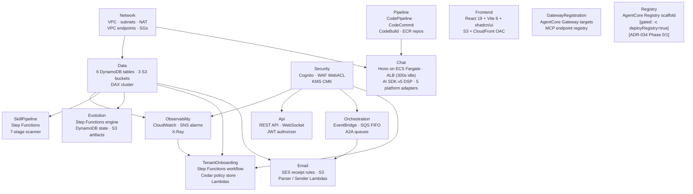
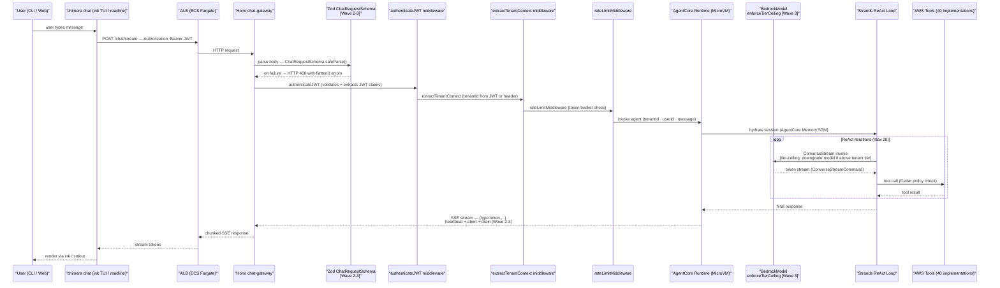
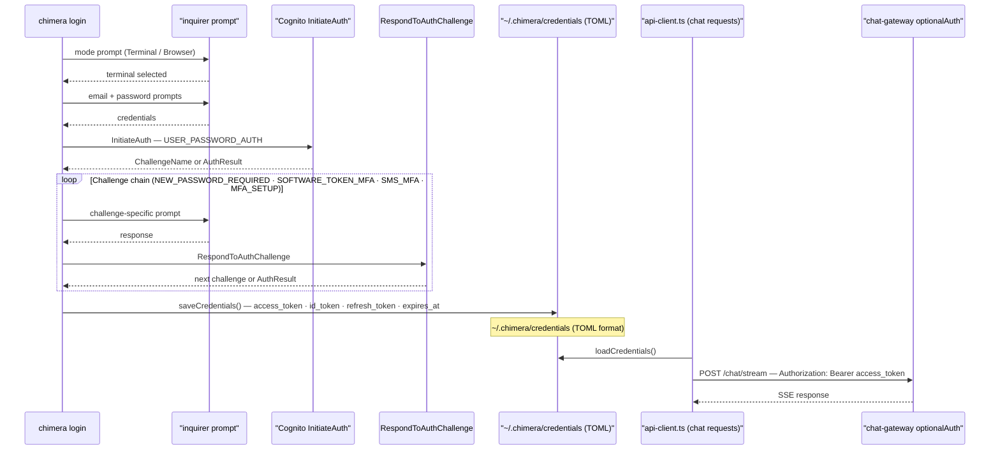
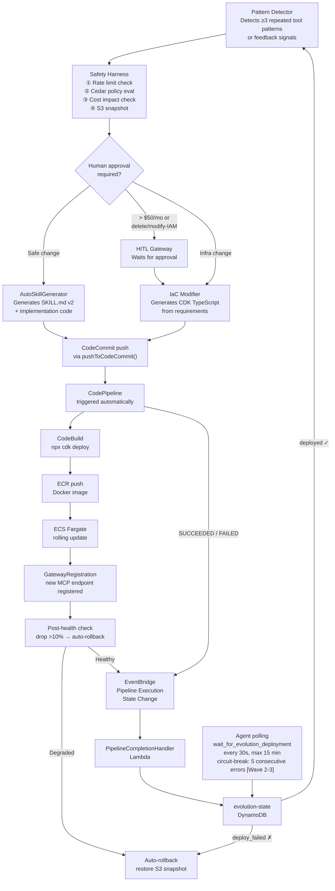
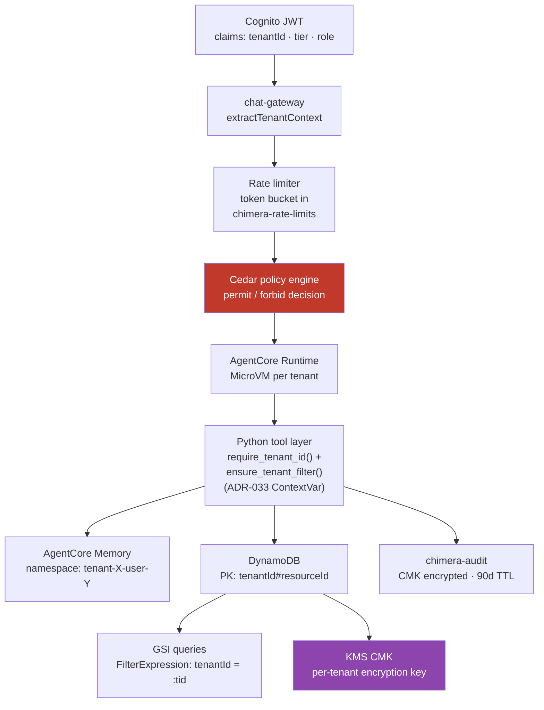
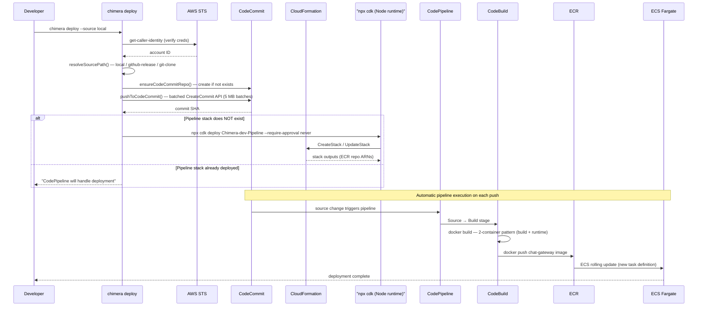
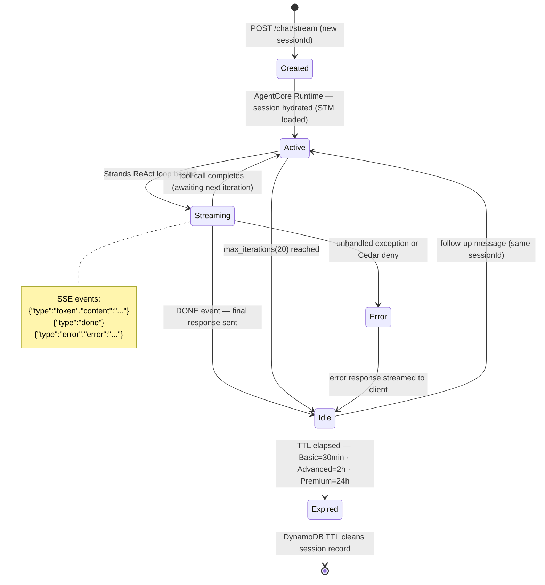

# Chimera System Architecture

Comprehensive architecture diagrams for the AWS Chimera multi-tenant agent platform. Covers CDK stack topology, runtime request flows, authentication, self-evolution, multi-tenant data isolation, skill lifecycle, deployment pipeline, and agent session state.

---

## 1. System Overview — 14 CDK Stacks (+ optional Registry)

The default synthesis produces **14** CloudFormation stacks under the `Chimera-{env}` prefix. A 15th stack — `Registry` — is context-gated and only synthesized when `npx cdk synth -c deployRegistry=true` is passed (ADR-034 Phase 0/1 scaffolding). Arrows represent explicit `addDependency()` edges.

<!-- TODO(wave7+): this diagram shows 13 nodes but the current stack set is 14 + gated Registry + Frontend + Discovery consolidation. Full rework tracked in docs/reviews/archive/wave7-doc-drift-audit.md §system-architecture.md — deeper restructure still pending. -->



**Stack responsibilities at a glance:**

| Stack               | Key Resources                                                                                                                                                                                                                                                                                                                                                                                                                                                                      |
| ------------------- | ---------------------------------------------------------------------------------------------------------------------------------------------------------------------------------------------------------------------------------------------------------------------------------------------------------------------------------------------------------------------------------------------------------------------------------------------------------------------------------- |
| Network             | VPC, public/private subnets, NAT gateways, VPC endpoints, security groups                                                                                                                                                                                                                                                                                                                                                                                                          |
| Data                | 6 DynamoDB tables, 3 S3 buckets, optional DAX cluster                                                                                                                                                                                                                                                                                                                                                                                                                              |
| Security            | Cognito user pool + app client, WAF WebACL, KMS CMK                                                                                                                                                                                                                                                                                                                                                                                                                                |
| Observability       | CloudWatch dashboards, SNS alarm topic, DDB throttle alarms                                                                                                                                                                                                                                                                                                                                                                                                                        |
| Api                 | REST API (v1 + WebSocket), JWT authorizer, webhook routes                                                                                                                                                                                                                                                                                                                                                                                                                          |
| Pipeline            | CodePipeline, CodeCommit repo, CodeBuild project, ECR repositories                                                                                                                                                                                                                                                                                                                                                                                                                 |
| SkillPipeline       | Step Functions 7-stage skill security scanner                                                                                                                                                                                                                                                                                                                                                                                                                                      |
| Chat                | Hono server on ECS Fargate, ALB (idleTimeout: 300s), AI SDK v5 Vercel Data Stream Protocol, 5 platform adapters (Web, Slack, Discord, Teams, Telegram), token-level streaming via ConverseStreamCommand, session persistence in DynamoDB, reconnection endpoint `GET /chat/stream/:messageId`                                                                                                                                                                                      |
| Orchestration       | EventBridge bus, SQS FIFO task queues, agent-to-agent queues                                                                                                                                                                                                                                                                                                                                                                                                                       |
| Evolution           | Step Functions evolution engine, DynamoDB state table, S3 artifacts                                                                                                                                                                                                                                                                                                                                                                                                                |
| TenantOnboarding    | Step Functions provisioning workflow, Cedar policy store, Lambda functions                                                                                                                                                                                                                                                                                                                                                                                                         |
| Email               | SES receipt rules, S3 inbound bucket, parser/sender Lambdas, SQS queue                                                                                                                                                                                                                                                                                                                                                                                                             |
| Frontend            | React 19 + Vite 6 + shadcn/ui (14 components), @ai-sdk/react v2 useChat with DefaultChatTransport, AWS Amplify v6 Cognito auth, 5 pages (Login, Dashboard, Chat, Admin, Settings), model selector in Settings (Converse + Mantle backends), S3 + CloudFront OAC hosting                                                                                                                                                                                                            |
| GatewayRegistration | 4-tier Lambda tool targets: **Tier 1** (Lambda, EC2, S3, CloudWatch, SQS — all tenants), **Tier 2** (RDS, Redshift, Athena, Glue, OpenSearch — advanced+), **Tier 3** (StepFunctions, Bedrock, SageMaker, Rekognition, Textract, Transcribe, CodeBuild, CodeCommit, CodePipeline — premium), **Discovery** (Config, Cost Explorer, Tags, Resource Explorer, CloudFormation — all tenants). SSM Parameter Store for runtime ARN discovery                                           |
| Discovery           | Cloud Map HTTP namespace + service registrations, 6 discovery tools: **config-scanner** (AWS Config SDK — advanced query, history, compliance), **resource-explorer** (Resource Explorer 2 SDK — search, index), **stack-inventory** (CloudFormation SDK — list/describe, drift detection), **tag-organizer** (Tagging API SDK — search, compliance, tag/untag), **cost-analyzer** (Cost Explorer SDK — cost by service, forecast), **resource-index** (in-memory cross-reference) |
| Registry _(gated)_  | AgentCore Registry scaffold (ADR-034). **Context-gated: synthesized only when `-c deployRegistry=true`.** Phase 0/1 adapter + feature flags landed (`REGISTRY_ENABLED`, `REGISTRY_PRIMARY_READ`, `REGISTRY_ID`), Phase 2+ blocked on multi-tenancy spike. See `docs/MIGRATION-registry.md`.                                                                                                                                                                                                                                          |

---

## 2. CLI Command Lifecycle

The primary happy path from a fresh machine to active chat session.

```mermaid
flowchart LR
    A([chimera init]) -->|chimera.toml created<br/>admin email stored| B([chimera deploy])
    B -->|source → CodeCommit<br/>npx cdk deploy Pipeline| C([chimera setup])
    C -->|provisions admin<br/>Cognito user| D([chimera connect])
    D -->|fetches endpoints<br/>into chimera.toml| E([chimera login])
    E -->|Cognito tokens<br/>→ ~/.chimera/credentials| F([chimera chat])
    F -->|SSE stream<br/>via ALB /chat/stream| G([agent response])

    style A fill:#2d6a4f,color:#fff
    style G fill:#1d3557,color:#fff
```



**Command registry (16 commands):**
`chat` · `connect` (deprecated) · `deploy` · `destroy` · `diff` · `doctor` · `init` · `login` · `session` · `setup` · `skill` · `status` · `sync` · `tenant` · `trigger` · `upgrade`

---

## 3. Chat Request Flow

From user keystroke to streamed token, showing every hop across components.



**Wave 2-3 hardening** (see `packages/chat-gateway/src/types.ts`, `packages/chat-gateway/src/routes/chat.ts`): route entry validates the request body with `ChatRequestSchema.safeParse()` and returns HTTP 400 with `flatten()` errors on malformed input; the SSE response side adds a periodic heartbeat, a client-disconnect abort path, and a `finally` drain that closes the heartbeat timer and tees the upstream stream cleanly.

**Wave 3 tier-ceiling enforcement** (see `packages/core/src/agent/bedrock-model.ts` → `enforceTierCeiling`): the `BedrockModel` is configured with the tenant `tier`; the LAST gate before `ConverseCommand` / `ConverseStreamCommand` downgrades any requested model that exceeds the tenant's tier ceiling. This runs after Cedar and rate-limit checks and cannot be bypassed by a misbehaving agent choosing a larger model ID.

**Wave 3 ConverseStream race fix:** the streaming path handles an edge case where `ConverseStreamCommand` can emit its first event before the downstream SSE writer is attached; the gateway now serializes writer attachment before pulling the first chunk from the Bedrock stream.

---

## 3a. Model Backends

Chimera supports two model backends, selectable per-tenant via the Settings UI.

| Backend          | Protocol                           | Endpoint                                                             | Streaming                                        |
| ---------------- | ---------------------------------- | -------------------------------------------------------------------- | ------------------------------------------------ |
| **BedrockModel** | AWS Converse API                   | `ConverseCommand` (sync) / `ConverseStreamCommand` (token streaming) | True token-level SSE via `ConverseStreamCommand` |
| **MantleModel**  | OpenAI-compatible Chat Completions | `https://bedrock-mantle.{region}.api.aws/v1/chat/completions`        | SSE in OpenAI delta format                       |

**BedrockModel** (`packages/core/src/agent/bedrock-model.ts`): Wraps AWS SDK `@aws-sdk/client-bedrock-runtime`. Supports sync (`ConverseCommand`) and streaming (`ConverseStreamCommand`) modes with module-level singleton client cache per region.

**MantleModel** (`packages/core/src/agent/mantle-model.ts`): Uses Bedrock's distributed inference engine (Mantle) via OpenAI-compatible endpoints. Supports Chat Completions API (`/v1/chat/completions`) and Responses API (`/v1/responses`). Auth via Bedrock API key or SigV4 bearer token.

Per-tenant model configuration is stored in the `chimera-tenants` DynamoDB table and editable from the web Settings page model selector.

---

## 4. Authentication Flow

Terminal login path: `chimera login` → Cognito challenge loop → credentials file → API calls.



**Key convention:** Cognito MFA must be set to `OPTIONAL` (not `REQUIRED`) so admin CLI users without a registered MFA device can still authenticate. The challenge loop handles MFA gracefully when present.

---

## 5. Self-Evolution Flow

How the evolution engine detects patterns, generates infrastructure, and deploys it safely.



**Safety limits:** 10 evolutions/day total · 3 infra changes/day · 3 prompt A/B tests/week

**Wave 2-3 polling circuit breaker** (see `packages/agents/tools/evolution_tools.py::wait_for_evolution_deployment`): the agent poll loop aborts if it sees 5 consecutive DDB `get_item` errors, returning an explicit `ABORTED` message instead of silently retrying for the full 15-minute timeout. Successful polls reset the error counter. This prevents a broken IAM grant or DDB outage from eating the agent's entire evolution budget.

---

## 5a. Evolution Feedback Loop

How the agent knows when its self-evolution deployment completes.

```mermaid
sequenceDiagram
    participant AGENT as Agent Runtime
    participant CC as CodeCommit
    participant PIPE as CodePipeline
    participant EB_DEFAULT as "Default EventBridge"
    participant LAMBDA as "PipelineCompletionHandler"
    participant DDB as "evolution-state DynamoDB"
    participant EB_CUSTOM as "chimera-agents EventBridge"

    AGENT->>CC: create_commit (CDK stack code)
    CC->>PIPE: EventBridge trigger (push to main)
    PIPE->>PIPE: Build → Deploy → Test → Canary
    PIPE->>EB_DEFAULT: Pipeline Execution State Change (SUCCEEDED/FAILED)
    EB_DEFAULT->>LAMBDA: PipelineCompletionRule trigger
    LAMBDA->>DDB: Update status: deploying → deployed/deploy_failed
    LAMBDA->>EB_CUSTOM: Publish "Evolution Deployment Complete"

    loop Polling (every 30s, max 15 min; abort after 5 consecutive errors [Wave 2-3])
        AGENT->>DDB: wait_for_evolution_deployment (check status)
    end

    DDB-->>AGENT: status = deployed ✓ (or deploy_failed ✗)
    AGENT->>AGENT: Verify, register capability, report to user
```

---

## 6. Multi-Tenant Data Flow

How tenant isolation is enforced from JWT extraction through to memory namespacing.



**Critical convention:** All DynamoDB GSI queries MUST include `FilterExpression: 'tenantId = :tid'`. GSI keys do not enforce partition isolation — without the filter, a query on a shared status GSI could return rows from other tenants.

---

## 7. Skill Lifecycle

From skill upload to agent discovery and execution.

```mermaid
flowchart LR
    UPLOAD["S3 upload<br/>skill bundle<br/>SKILL.md v2 + code"]
    P1["Stage 1<br/>Static analysis<br/>code scanning"]
    P2["Stage 2<br/>Dependency audit<br/>vulnerability check"]
    P3["Stage 3<br/>Cedar policy<br/>compliance"]
    P4["Stage 4<br/>Sandbox test<br/>Code Interpreter"]
    P5["Stage 5<br/>Resource limits<br/>cost estimation"]
    P6["Stage 6<br/>Cost ceiling<br/>check"]
    P7["Stage 7<br/>Manual review<br/>for trust &lt; 2"]
    REGISTRY["chimera-skills<br/>DynamoDB registry"]
    GW["AgentCore Gateway<br/>MCP endpoint target"]
    DISCO["Skill discovery<br/>load for session"]
    EXEC["Agent execution<br/>@tool or Sandbox<br/>or Lambda"]

    UPLOAD --> P1 --> P2 --> P3 --> P4 --> P5 --> P6 --> P7
    P7 --> REGISTRY
    REGISTRY --> GW
    GW --> DISCO
    DISCO --> EXEC
```



**Trust tiers:** Platform (0) · Verified (1) · Community (2) · Private (3) · Experimental (4). Manual review (Stage 7) is triggered for trust levels 3 and 4.

**Execution modes:** `inline` (@tool decorated, trusted) · `sandbox` (Code Interpreter, untrusted) · `mcp` (AgentCore Gateway) · `lambda` (compute-intensive)

**AgentCore Registry scaffolding [Phase 0/1 flag-gated]** (ADR-034): the Stage 7 "publish" step additionally calls `CreateRegistryRecord` + `SubmitRegistryRecordForApproval` when `REGISTRY_ENABLED=true`, dual-writing to the AgentCore Registry alongside the `chimera-skills` DDB table. Discovery reads from Registry when `REGISTRY_PRIMARY_READ=true` with automatic DDB fallback. Both flags default to off — DDB remains the source of truth until the multi-tenancy spike closes. See `docs/MIGRATION-registry.md` for the operator runbook and `docs/architecture/decisions/ADR-034-agentcore-registry-adoption.md` for the decision record.

---

## 8. Deploy Pipeline

`chimera deploy` orchestrates source resolution, CodeCommit push, and CDK synthesis.



**Pipeline stages (5):**

1. **Source** — CodeCommit push triggers pipeline automatically
2. **Build** — CodeBuild runs lint, typecheck, `bun test`, `npx cdk synth --all`, Vite build + Docker build (parallel)
3. **Deploy** — `npx cdk deploy --all` + Frontend S3 sync + CloudFront invalidation
4. **Test** — Canary bake period (30 min) with CloudWatch alarm monitoring
5. **Rollout** — Progressive traffic shift: 5% → 25% → 50% → 100% with validation gates

**Destroy:** CodeBuild-delegated via `buildspec-destroy.yml` (see ADR-032).

**CDK runtime note:** All CDK commands use `npx cdk` (Node.js runtime). `bunx cdk` breaks CDK `instanceof` checks, causing `TypeError: peer.canInlineRule is not a function` in security group rules.

---

## 8a. Testing Architecture

**GitHub Actions CI** (`.github/workflows/ci.yml`): 3 parallel jobs after the test gate:

| Job                        | Steps                                                                                                                                                |
| -------------------------- | ---------------------------------------------------------------------------------------------------------------------------------------------------- |
| **Test, Lint & Typecheck** | `bun test` (shared, core, sse-bridge, chat-gateway, cli, infra, unit tests), `vitest` (web), Python agent tests, `bun run lint`, `bun run typecheck` |
| **Build Docker Images**    | Monorepo tsc build → Bun bundle → `docker build` chat-gateway + agents images                                                                        |
| **Build CLI Binary**       | `bun build --compile` for standalone CLI binary                                                                                                      |

**CodeBuild** (`buildspec.yml`): lint, typecheck, unit tests (shared, core, sse-bridge, infra), CDK synth, Vite build with Cognito/API config from CloudFormation outputs.

**Playwright E2E** (`tests/e2e/`): 3 spec files — smoke (3 tests), chat (4 tests), settings (4 tests) — 11 spec tests total.

**Total test count:** ~2,500 tests across unit, integration, e2e, and Python agent test suites.

---

## 9. Agent Session State

State machine for a single agent session from creation to expiry.



**Session ID format:** `tenant-{tenantId}-user-{userId}-{uuid}`

**Memory window by tier:**

- Basic: STM 10 turns
- Advanced: STM 50 turns
- Premium: STM 200 turns

LTM compression strategy: SUMMARY (all tiers), USER_PREFERENCE (Advanced+), SEMANTIC_MEMORY (Premium)

---

## Cross-Reference

| Diagram                    | Related Docs                                                                          |
| -------------------------- | ------------------------------------------------------------------------------------- |
| CDK Stacks (§1)            | [deployment-architecture.md](deployment-architecture.md)                              |
| CLI Lifecycle (§2)         | [cli-lifecycle.md](cli-lifecycle.md)                                                  |
| Request Flow (§3)          | [agent-architecture.md](agent-architecture.md) §1                                     |
| Model Backends (§3a)       | `packages/core/src/agent/bedrock-model.ts`, `packages/core/src/agent/mantle-model.ts` |
| Auth Flow (§4)             | `packages/cli/src/commands/login.ts`, `packages/cli/src/auth/`                        |
| Self-Evolution (§5)        | [agent-architecture.md](agent-architecture.md) §4                                     |
| Evolution Feedback (§5a)   | `infra/lib/evolution-stack.ts`, `packages/agents/`                                    |
| Multi-Tenant (§6)          | [canonical-data-model.md](canonical-data-model.md)                                    |
| Skill Lifecycle (§7)       | [agent-architecture.md](agent-architecture.md) §3                                     |
| Deploy Pipeline (§8)       | `packages/cli/src/commands/deploy.ts`, `buildspec.yml`                                |
| Testing Architecture (§8a) | `.github/workflows/ci.yml`, `tests/e2e/`                                              |
| Session State (§9)         | [agent-architecture.md](agent-architecture.md) §1, §7                                 |

---

_Author: builder-arch-docs | Task: chimera-17ef | Status: Canonical_
