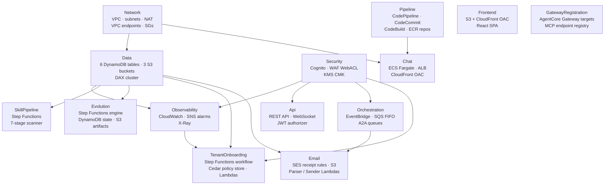
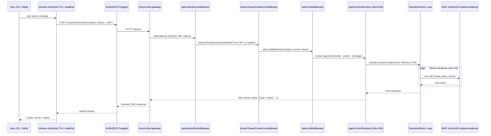
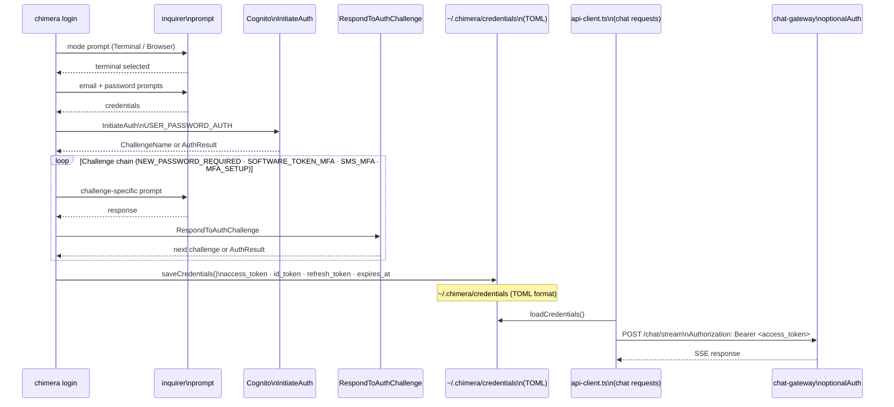
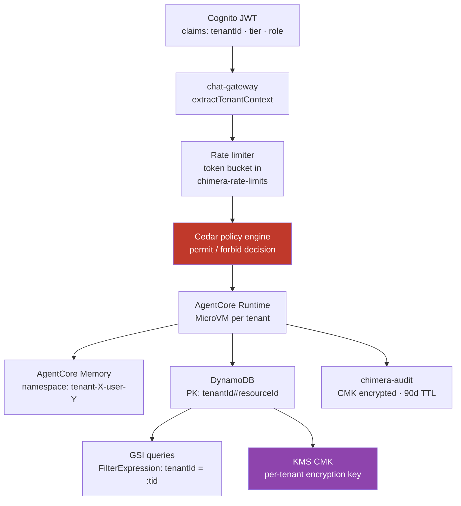
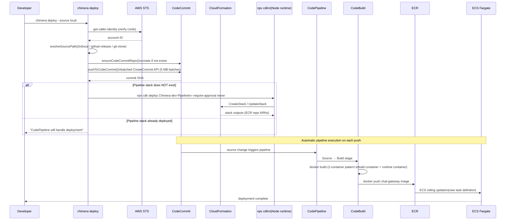
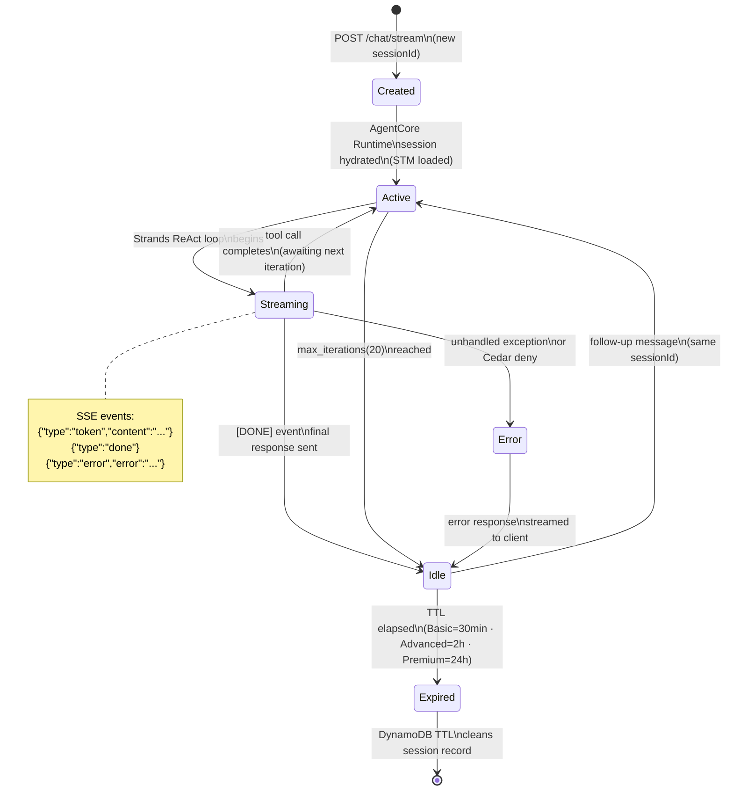

# Chimera System Architecture

Comprehensive architecture diagrams for the AWS Chimera multi-tenant agent platform. Covers CDK stack topology, runtime request flows, authentication, self-evolution, multi-tenant data isolation, skill lifecycle, deployment pipeline, and agent session state.

---

## 1. System Overview — 14 CDK Stacks

The full infrastructure is expressed as 14 CloudFormation stacks synthesized under the `Chimera-{env}` prefix. Arrows represent explicit `addDependency()` edges.



**Stack responsibilities at a glance:**

| Stack | Key Resources |
|-------|---------------|
| Network | VPC, public/private subnets, NAT gateways, VPC endpoints, security groups |
| Data | 6 DynamoDB tables, 3 S3 buckets, optional DAX cluster |
| Security | Cognito user pool + app client, WAF WebACL, KMS CMK |
| Observability | CloudWatch dashboards, SNS alarm topic, DDB throttle alarms |
| Api | REST API (v1 + WebSocket), JWT authorizer, webhook routes |
| Pipeline | CodePipeline, CodeCommit repo, CodeBuild project, ECR repositories |
| SkillPipeline | Step Functions 7-stage skill security scanner |
| Chat | ECS Fargate cluster + service, ALB, CloudFront OAC distribution |
| Orchestration | EventBridge bus, SQS FIFO task queues, agent-to-agent queues |
| Evolution | Step Functions evolution engine, DynamoDB state table, S3 artifacts |
| TenantOnboarding | Step Functions provisioning workflow, Cedar policy store, Lambda functions |
| Email | SES receipt rules, S3 inbound bucket, parser/sender Lambdas, SQS queue |
| Frontend | S3 bucket + CloudFront OAC, React SPA hosting |
| GatewayRegistration | AgentCore Gateway targets, MCP endpoint registry |

---

## 2. CLI Command Lifecycle

The primary happy path from a fresh machine to active chat session.


**Command registry (14 commands):**
`chat` · `connect` (deprecated) · `deploy` · `destroy` · `doctor` · `init` · `login` · `session` · `setup` · `skill` · `status` · `sync` · `tenant` · `upgrade`

---

## 3. Chat Request Flow

From user keystroke to streamed token, showing every hop across components.



---

## 4. Authentication Flow

Terminal login path: `chimera login` → Cognito challenge loop → credentials file → API calls.



**Key convention:** Cognito MFA must be set to `OPTIONAL` (not `REQUIRED`) so admin CLI users without a registered MFA device can still authenticate. The challenge loop handles MFA gracefully when present.

---

## 5. Self-Evolution Flow

How the evolution engine detects patterns, generates infrastructure, and deploys it safely.

```mermaid
flowchart TD
    DETECT[Pattern Detector\nDetects ≥3 repeated tool patterns\nor feedback signals]
    HARNESS[Safety Harness\n① Rate limit check\n② Cedar policy eval\n③ Cost impact check\n④ S3 snapshot]
    HUMAN{Human approval\nrequired?}
    HITL[HITL Gateway\nWaits for approval]
    AUTOSKILL[AutoSkillGenerator\nGenerates SKILL.md v2\n+ implementation code]
    IACMOD[IaC Modifier\nGenerates CDK TypeScript\nfrom requirements]
    COMMIT[CodeCommit push\nvia pushToCodeCommit()]
    PIPELINE[CodePipeline\ntriggered automatically]
    BUILD[CodeBuild\nnpx cdk deploy]
    ECR[ECR push\n Docker image]
    ECS[ECS Fargate\nrolling update]
    REGISTER[GatewayRegistration\nnew MCP endpoint registered]
    MONITOR[Post-health check\ndrop >10% → auto-rollback]

    DETECT --> HARNESS
    HARNESS --> HUMAN
    HUMAN -- "> $50/mo or\ndelete/modify-IAM" --> HITL
    HITL --> IACMOD
    HUMAN -- "Safe change" --> AUTOSKILL
    HUMAN -- "Infra change" --> IACMOD
    AUTOSKILL --> COMMIT
    IACMOD --> COMMIT
    COMMIT --> PIPELINE
    PIPELINE --> BUILD
    BUILD --> ECR
    ECR --> ECS
    ECS --> REGISTER
    REGISTER --> MONITOR
    MONITOR -- "Healthy" --> DETECT
    MONITOR -- "Degraded" --> ROLLBACK[Auto-rollback\nrestore S3 snapshot]
```

**Safety limits:** 10 evolutions/day total · 3 infra changes/day · 3 prompt A/B tests/week

---

## 6. Multi-Tenant Data Flow

How tenant isolation is enforced from JWT extraction through to memory namespacing.



**Critical convention:** All DynamoDB GSI queries MUST include `FilterExpression: 'tenantId = :tid'`. GSI keys do not enforce partition isolation — without the filter, a query on a shared status GSI could return rows from other tenants.

---

## 7. Skill Lifecycle

From skill upload to agent discovery and execution.

```mermaid
flowchart LR
    UPLOAD["S3 upload<br/>skill bundle<br/>SKILL.md v2 + code"]
    P1["Stage 1<br/>Static analysis<br/>code scanning"]
    P2["Stage 2<br/>Dependency audit<br/>vulnerability check"]
    P3["Stage 3<br/>Cedar policy<br/>compliance"]
    P4["Stage 4<br/>Sandbox test<br/>Code Interpreter"]
    P5["Stage 5<br/>Resource limits<br/>cost estimation"]
    P6["Stage 6<br/>Cost ceiling<br/>check"]
    P7["Stage 7<br/>Manual review<br/>for trust &lt; 2"]
    REGISTRY["chimera-skills<br/>DynamoDB registry"]
    GW["AgentCore Gateway<br/>MCP endpoint target"]
    DISCO["Skill discovery<br/>load for session"]
    EXEC["Agent execution<br/>@tool or Sandbox<br/>or Lambda"]

    UPLOAD --> P1 --> P2 --> P3 --> P4 --> P5 --> P6 --> P7
    P7 --> REGISTRY
    REGISTRY --> GW
    GW --> DISCO
    DISCO --> EXEC
```



**Trust tiers:** Platform (0) · Verified (1) · Community (2) · Private (3) · Experimental (4). Manual review (Stage 7) is triggered for trust levels 3 and 4.

**Execution modes:** `inline` (@tool decorated, trusted) · `sandbox` (Code Interpreter, untrusted) · `mcp` (AgentCore Gateway) · `lambda` (compute-intensive)

---

## 8. Deploy Pipeline

`chimera deploy` orchestrates source resolution, CodeCommit push, and CDK synthesis.



**CDK runtime note:** All CDK commands use `npx cdk` (Node.js runtime). `bunx cdk` breaks CDK `instanceof` checks, causing `TypeError: peer.canInlineRule is not a function` in security group rules.

---

## 9. Agent Session State

State machine for a single agent session from creation to expiry.



**Session ID format:** `tenant-{tenantId}-user-{userId}-{uuid}`

**Memory window by tier:**
- Basic: STM 10 turns
- Advanced: STM 50 turns
- Premium: STM 200 turns

LTM compression strategy: SUMMARY (all tiers), USER_PREFERENCE (Advanced+), SEMANTIC_MEMORY (Premium)

---

## Cross-Reference

| Diagram | Related Docs |
|---------|-------------|
| CDK Stacks (§1) | [deployment-architecture.md](deployment-architecture.md) |
| CLI Lifecycle (§2) | [cli-lifecycle.md](cli-lifecycle.md) |
| Request Flow (§3) | [agent-architecture.md](agent-architecture.md) §1 |
| Auth Flow (§4) | `packages/cli/src/commands/login.ts`, `packages/cli/src/auth/` |
| Self-Evolution (§5) | [agent-architecture.md](agent-architecture.md) §4 |
| Multi-Tenant (§6) | [canonical-data-model.md](canonical-data-model.md) |
| Skill Lifecycle (§7) | [agent-architecture.md](agent-architecture.md) §3 |
| Deploy Pipeline (§8) | `packages/cli/src/commands/deploy.ts` |
| Session State (§9) | [agent-architecture.md](agent-architecture.md) §1, §7 |

---

*Author: builder-arch-docs | Task: chimera-17ef | Status: Canonical*
