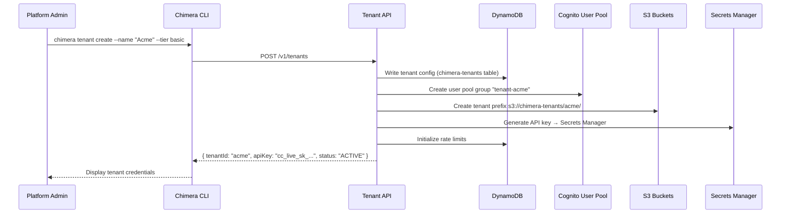
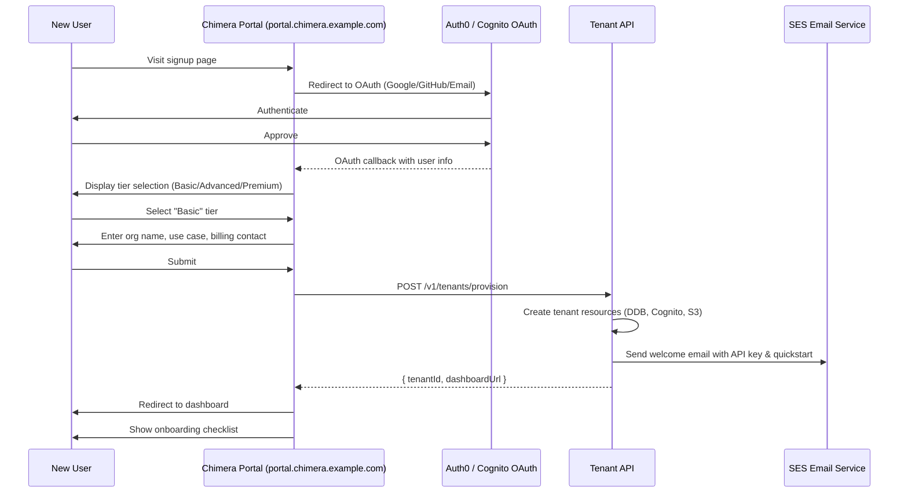
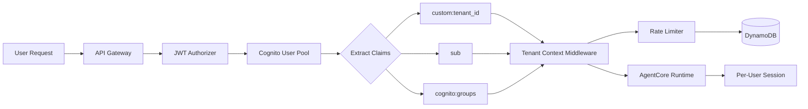
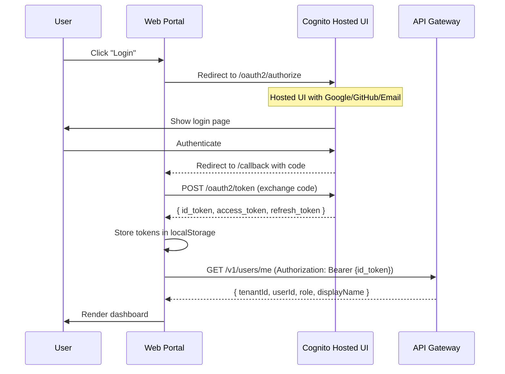
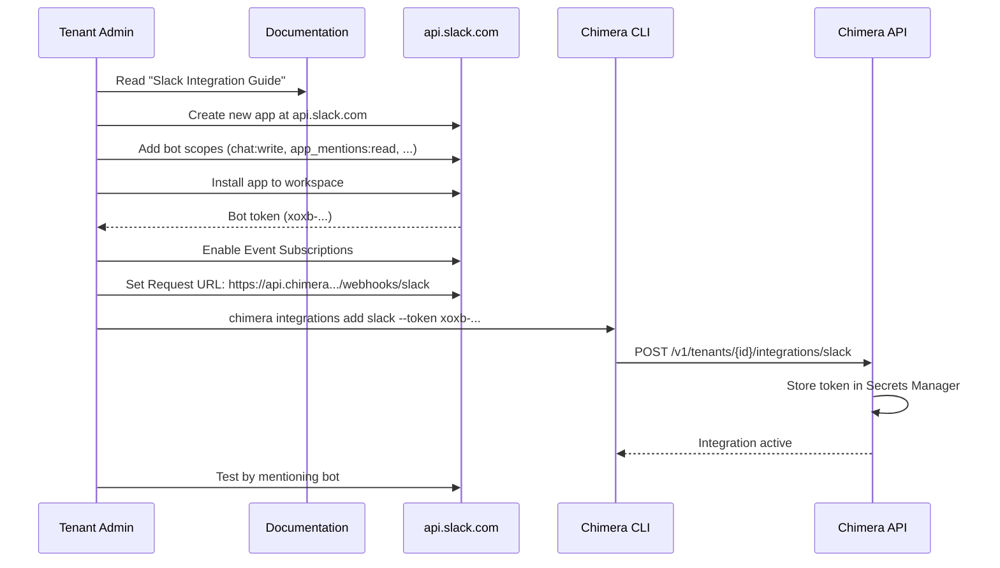
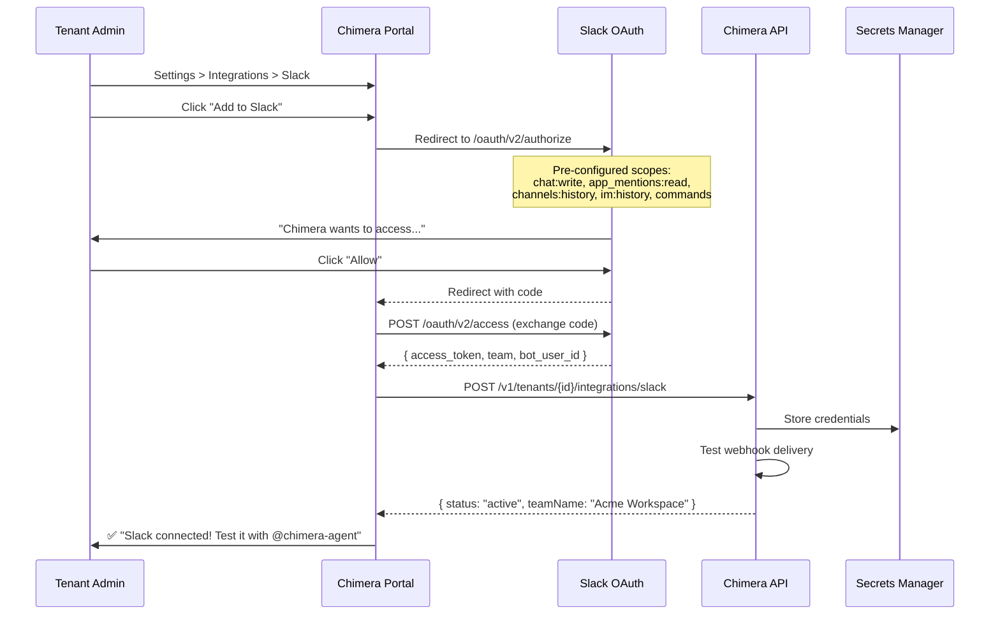
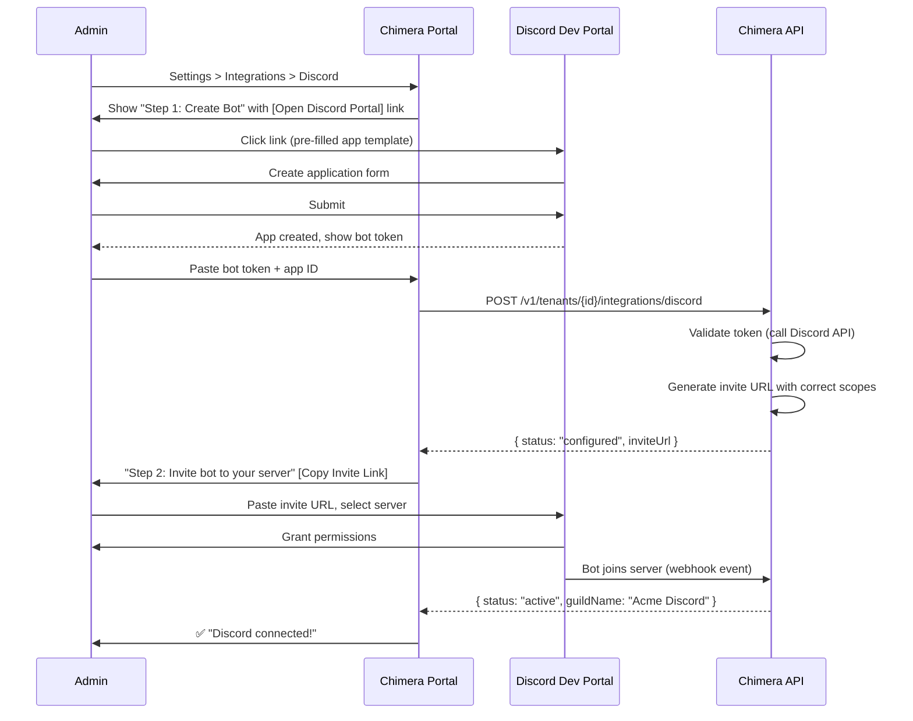
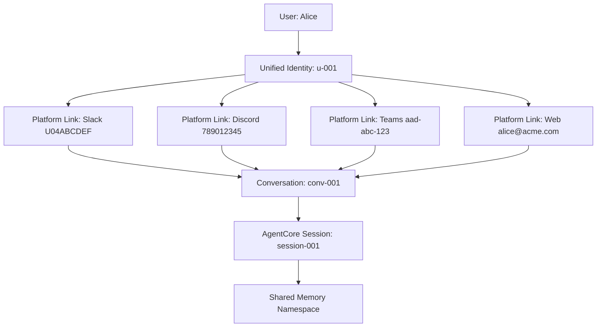
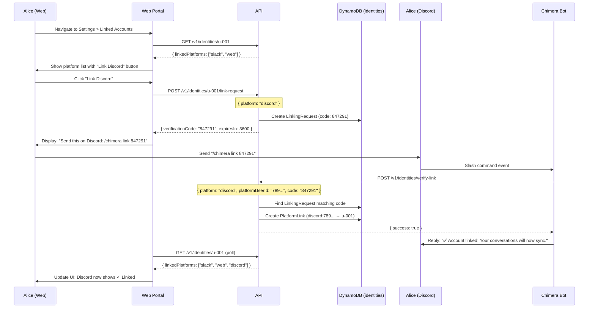
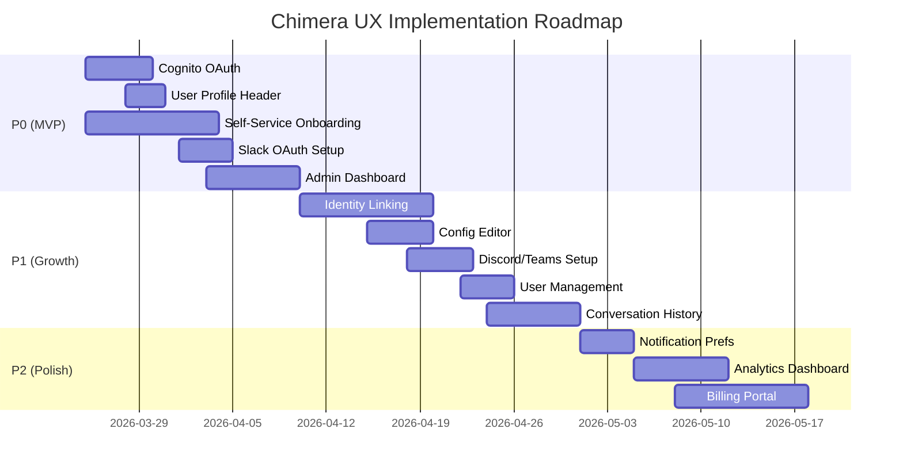

# UX Review: Chimera Setup & User Onboarding

> **Purpose:** Comprehensive UX review of Chimera's end-to-end setup experience, covering tenant provisioning, per-user access, web portal, and multi-platform chat onboarding.
>
> **Status:** Research complete. This document identifies current state, UX gaps, and recommended improvements for production readiness.

---

## Table of Contents

1. [Executive Summary](#executive-summary)
2. [UTO (User/Team/Org) Setup Experience](#1-uto-userteamorg-setup-experience)
3. [Configuration Management UX](#2-configuration-management-ux)
4. [Per-User Access Control](#3-per-user-access-control)
5. [Web Portal Experience](#4-web-portal-experience)
6. [Chat Platform Onboarding](#5-chat-platform-onboarding)
7. [Cross-Platform Identity Management](#6-cross-platform-identity-management)
8. [Recommendations & Priority](#7-recommendations--priority)

---

## Executive Summary

### Current State

Chimera has implemented core multi-tenant infrastructure with robust backend isolation, but **user-facing experiences require significant polish for production readiness**. The platform excels at technical architecture (DynamoDB isolation, Cedar policies, AgentCore integration) but lacks cohesive onboarding flows and user management interfaces.

### Key Findings

| Area | Status | Gaps Identified |
|------|--------|----------------|
| **Tenant Provisioning** | ✅ Functional (CLI/API) | ❌ No self-service portal, manual admin approval required |
| **Per-User Access** | ✅ Architecture complete | ❌ No Cognito OAuth flow, no user profile UI, no tenant switching |
| **Configuration** | ✅ DynamoDB-backed | ❌ Config only via API/CLI, no admin dashboard |
| **Web Portal** | ⚠️ POC exists | ❌ Hardcoded demo tenant, no authentication, no multi-tenant routing |
| **Chat Onboarding** | ✅ Multi-platform support | ⚠️ Manual webhook setup, no guided OAuth flows |
| **Identity Linking** | ✅ Designed | ❌ Not implemented (manual code-based flow exists in design docs only) |

### Priority Gaps for Production

**Critical (P0):**
1. Cognito OAuth integration for web portal
2. User profile header with tenant switcher
3. Self-service tenant onboarding portal

**Important (P1):**
4. Guided chat platform OAuth flows (Slack, Teams, Discord)
5. Admin dashboard for tenant configuration
6. Cross-platform identity linking UI

**Nice-to-Have (P2):**
7. User preference management (notification routing, quiet hours)
8. Analytics dashboard per tenant
9. Tenant usage billing portal

---

## 1. UTO (User/Team/Org) Setup Experience

### 1.1 Current Flow (CLI-Based)

The current tenant provisioning flow requires admin-level access and CLI tools:



**Duration:** ~30 seconds for Basic tier, 5-10 minutes for Premium (dedicated resources).

### 1.2 User Experience Assessment

#### ✅ Strengths

- **Fast programmatic provisioning:** API-driven, automatable via GitOps
- **Comprehensive setup:** All required resources created atomically
- **Clear separation of concerns:** Tenant/user/resource isolation enforced at infrastructure level

#### ❌ UX Gaps

| Gap | Impact | Severity |
|-----|--------|----------|
| **No self-service portal** | Requires admin intervention for every tenant onboard | Critical |
| **API key manual distribution** | Admin must securely share keys (email, Slack) — error-prone | High |
| **No onboarding wizard** | Users must understand DynamoDB, Cognito, S3 concepts | High |
| **No tier upgrade flow** | Changing tier requires manual CLI commands and potential downtime | Medium |
| **No billing integration** | No Stripe/payment UI, manual invoicing only | Medium |

###  1.3 Recommended Self-Service Portal Flow



**Benefits:**
- **Zero admin intervention** for Basic/Advanced tiers
- **Guided experience** with tier comparison, use case templates
- **Instant activation** (<1 min for Basic tier)
- **Secure credential delivery** via encrypted email + dashboard download

### 1.4 Tenant Tier Selection UX

Proposed tier comparison page:

| Feature | **Basic** ($50/mo) | **Advanced** ($500/mo) | **Premium** (custom) |
|---------|-------------------|----------------------|---------------------|
| Monthly budget | $50 | $500 | $10,000+ |
| Concurrent sessions | 2 | 10 | 100+ |
| Models | Nova Lite, Haiku | +Sonnet, Nova Pro | +Opus, fine-tuned |
| Chat platforms | 2 platforms | All platforms | All + custom adapters |
| Memory storage | 100 MB | 1 GB | 10 GB |
| Cron jobs | 5 max | 20 max | Unlimited |
| Support | Community | Business hours | 24/7 dedicated |
| **Setup time** | <1 minute | 1-2 minutes | 5-10 minutes |
| **Approval** | Automatic | Automatic | Manual review |

**Conversion optimization:**
- **Free trial:** 7-day Basic tier trial (credit card not required)
- **Upgrade prompts:** "Upgrade to Advanced for 10x more sessions" when hitting limits
- **Usage visualization:** Real-time charts showing budget consumption

---

## 2. Configuration Management UX

### 2.1 Current State: API/CLI Only

Tenant configuration is managed via DynamoDB with API/CLI access:

```bash
# Example: Update model preferences
chimera tenant update-config acme-corp \
  --set models.default=us.anthropic.claude-sonnet-4-6-v1:0

# Enable feature flag
chimera tenant update-config acme-corp \
  --set features.codeInterpreter=true

# Adjust budget limit
chimera tenant update-config acme-corp \
  --set budgetLimitMonthlyUsd=1000
```

**Configuration stored in:**
```typescript
// DynamoDB: chimera-tenants table
{
  "PK": "TENANT#acme-corp",
  "SK": "CONFIG",
  "models": {
    "default": "us.anthropic.claude-sonnet-4-6-v1:0",
    "complex": "us.anthropic.claude-opus-4-6-v1:0",
    "fast": "us.amazon.nova-lite-v1:0"
  },
  "channels": ["slack", "web", "api"],
  "features": {
    "codeInterpreter": true,
    "browser": false,
    "cronJobs": true
  }
}
```

### 2.2 UX Gaps

| Gap | User Impact |
|-----|-------------|
| **No visual editor** | Users must learn CLI syntax, error-prone YAML/JSON editing |
| **No validation** | Invalid configs accepted (e.g., non-existent model IDs) |
| **No change history** | Can't see who changed what, when |
| **No preview mode** | Can't test config changes before applying |
| **No bulk operations** | Can't copy config between tenants |

### 2.3 Recommended Admin Dashboard

**URL:** `https://portal.chimera.example.com/tenants/{tenantId}/settings`

**Features:**

#### Model Configuration
- **Visual selector:** Dropdown with model cards showing:
  - Model name (e.g., "Claude Sonnet 4.6")
  - Speed rating (⚡⚡⚡⚡)
  - Cost per 1M tokens
  - Use case recommendation
- **A/B testing toggle:** "Enable model routing for 10% of sessions"
- **Real-time preview:** "Your current config costs ~$0.02/request"

#### Feature Flags
- **Toggle switches** with descriptions:
  - ✅ Code Interpreter: "Execute Python code in sandboxed environment"
  - ❌ Web Browser: "Browse websites and extract content"
  - ✅ Cron Jobs: "Schedule agent tasks on recurring basis"
- **Dependency warnings:** "Enabling Browser requires Advanced tier"

#### Budget & Limits
- **Slider UI** for budget limits:
  - Current spend: $127 / $500 (25%)
  - Projected month-end: $480 (96%) ⚠️
- **Rate limit configuration:**
  - API requests: 100 req/min
  - Concurrent sessions: 10
  - Custom rules per platform

#### Change Management
- **Audit log:** "alice@acme.com changed models.default at 2026-03-21 14:30"
- **Rollback button:** "Restore config from 2 hours ago"
- **Export/Import:** Download config as YAML, apply to another tenant

---

## 3. Per-User Access Control

### 3.1 Architecture (Implemented)

The backend infrastructure for per-user access is **complete and robust**:



**Security layers:**
1. **JWT validation:** API Gateway verifies Cognito-signed JWTs
2. **Tenant context injection:** Middleware attaches `tenantId` to every request
3. **Rate limiting:** Token bucket per user+tenant (fail-closed on errors)
4. **DynamoDB isolation:** GSI queries always filter by `tenantId`
5. **AgentCore session binding:** Sessions scoped to `tenant-{id}-user-{id}`

### 3.2 UX Gaps (Critical)

#### ❌ No Cognito OAuth Flow

**Current state:** API keys only. No browser-based login.

**Impact:**
- Web portal cannot authenticate users
- No SSO integration (Google, GitHub, Azure AD)
- Can't differentiate between users within a tenant

**Recommended flow:**



#### ❌ No User Profile Header

**Gap:** No UI shows current user, tenant, or logout option.

**Recommended header:**
```
┌────────────────────────────────────────────────────────────┐
│ Chimera                          [Notifications ▼] [👤 Alice ▼] │
└────────────────────────────────────────────────────────────┘
  Dropdown menu:
  - Alice Chen (alice@acme.com)
  - Tenant: Acme Corp
  - Role: Admin
  ─────────────────
  - Account Settings
  - Billing
  - API Keys
  - Logout
```

#### ❌ No Tenant Switcher

**Gap:** Users in multiple tenants must use different browser profiles.

**Recommended:**
```
Current tenant: Acme Corp ▼

  Dropdown:
  ✓ Acme Corp (Owner)
    Beta Corp (Admin)
    Demo Sandbox (Member)
  ──────────────
  + Join a tenant
```

**Backend support needed:**
- User-to-tenant mapping table: `chimera-user-tenants`
- Tenant role resolution: `getTenantsForUser(userId)`
- JWT with tenant claim: `custom:tenant_id`

### 3.3 Role-Based Access Control (RBAC)

**Roles implemented in Cognito groups:**
- `tenant-{id}-owner` — Full admin, billing, delete tenant
- `tenant-{id}-admin` — Manage users, config, skills
- `tenant-{id}-member` — Use agents, view dashboards

**Missing UX:**
- **No user management page:** Can't add/remove users to tenant
- **No invite flow:** Admin must manually create Cognito users
- **No permission matrix:** Users don't know what they can/can't do

**Recommended user management page:**
```
Users & Permissions — Acme Corp

┌───────────────────────────────────────────────────────┐
│ alice@acme.com        Owner       [Edit] [Remove]     │
│ bob@acme.com          Admin       [Edit] [Remove]     │
│ carol@acme.com        Member      [Edit] [Remove]     │
│                                                         │
│ [+ Invite User]                                        │
└───────────────────────────────────────────────────────┘

Invite dialog:
  Email: ___________________
  Role:  [Admin ▼]
  Message: "Join our Chimera tenant..."
  [Send Invitation]
```

---

## 4. Web Portal Experience

### 4.1 Current State: POC with Hardcoded Tenant

**What exists:**
- Proof-of-concept React app
- Basic chat interface
- Hardcoded demo tenant credentials
- No authentication

**File structure:**
```
packages/web-portal/
  src/
    pages/
      chat.tsx          # Chat UI (SSE streaming works)
      dashboard.tsx     # Empty placeholder
    components/
      ChatMessage.tsx   # Message rendering
      AgentResponse.tsx # Tool results, cards
    config.ts           # DEMO_TENANT_ID = "demo-sandbox" (hardcoded)
```

### 4.2 UX Gaps (Critical for Production)

| Component | Status | Gap Description |
|-----------|--------|----------------|
| **Authentication** | ❌ Missing | No Cognito integration, no login page |
| **Routing** | ❌ Broken | All routes serve demo tenant, no `/tenants/{id}` paths |
| **Dashboard** | ❌ Stub only | No metrics, no agent status, no recent conversations |
| **Chat UI** | ⚠️ Functional | Works for demo, but no conversation history, no tenant context |
| **Settings** | ❌ Missing | No config editor, no user profile, no API key management |
| **Navigation** | ❌ Minimal | Sidebar with placeholders only |

### 4.3 Recommended Portal Information Architecture

```
┌─────────────────────────────────────────────────────┐
│ [Logo] Chimera          [Search] [🔔] [👤 Alice ▼] │
├─────────────────────────────────────────────────────┤
│ SIDEBAR         │  MAIN CONTENT                     │
│                 │                                    │
│ 📊 Dashboard    │  ┌──────────────────────────────┐ │
│ 💬 Chat         │  │  Dashboard for Acme Corp     │ │
│ 📁 Conversations│  │  ─────────────────────────────│ │
│ 🤖 Agents       │  │  [Usage Chart]               │ │
│ 🛠️ Skills       │  │  [Active Sessions: 3]        │ │
│ ⚙️ Settings     │  │  [Budget: $127 / $500]       │ │
│ 📈 Analytics    │  │  [Recent Activity]           │ │
│ 💳 Billing      │  └──────────────────────────────┘ │
│ 📚 Docs         │                                    │
└─────────────────────────────────────────────────────┘
```

### 4.4 Priority Pages for MVP

#### 1. Login/Signup (`/login`, `/signup`)
- Cognito Hosted UI redirect
- Social login (Google, GitHub, Azure AD)
- Email magic link option

#### 2. Dashboard (`/`)
- Quick stats: sessions today, budget spent, active users
- Recent conversations list
- Agent health indicators
- Quick actions: "Start Chat", "Create Cron Job"

#### 3. Chat Interface (`/chat`)
- Conversation history sidebar
- New conversation button
- SSE streaming (already works)
- Attachment upload
- Tool approval cards

#### 4. Settings (`/settings`)
- **General:** Tenant name, logo upload
- **Models:** Model selector with cost estimates
- **Features:** Feature flag toggles
- **Users:** User management (invite, roles, remove)
- **API Keys:** Generate, rotate, revoke keys
- **Integrations:** Chat platforms (Slack, Discord, Teams)

#### 5. Conversations (`/conversations`)
- Searchable conversation history
- Filter by date, user, platform
- Export conversation transcripts
- Delete conversations

### 4.5 Visual Design Recommendations

**Design system:**
- Component library: Radix UI + Tailwind CSS
- Color palette: Neutral grays + brand accent (purple/blue)
- Typography: Inter (sans-serif), Fira Code (monospace)
- Dark mode support

**Accessibility:**
- WCAG 2.1 AA compliance
- Keyboard navigation
- Screen reader support
- Color contrast ratios >4.5:1

---

## 5. Chat Platform Onboarding

### 5.1 Current State: Manual Webhook Setup

**Platforms supported (backend):**
- ✅ Slack (OAuth + Events API)
- ✅ Discord (Bot token + Interactions endpoint)
- ✅ Microsoft Teams (Bot Framework)
- ✅ Telegram (Bot API)
- ⚠️ WhatsApp (not implemented)
- ⚠️ GitHub (partially implemented)

**Current onboarding flow (Slack example):**



**Problems:**
- **15+ manual steps** with screenshots needed
- **Error-prone:** Wrong scopes, wrong URLs, expired tokens
- **No validation:** Admin doesn't know if it worked until testing
- **No debugging:** If webhook fails, admin sees generic "500 error"

### 5.2 Recommended Guided OAuth Flows

#### Slack OAuth (Recommended)



**Benefits:**
- **1-click setup:** OAuth handles all complexity
- **Automatic scope configuration:** No manual checkbox selection
- **Validation:** Test webhook before confirming
- **Error handling:** "Webhook unreachable" with debug URL

#### Discord Bot Registration



### 5.3 Integration Status Dashboard

**Recommended UI:**

```
Integrations — Acme Corp

Connected Platforms:
┌────────────────────────────────────────────────────────┐
│ ✅ Slack         Acme Workspace         [Configure] [Test] [Remove]   │
│    └─ Webhook status: ✓ Healthy (last: 2 min ago)                     │
│    └─ Messages today: 47                                              │
│                                                                        │
│ ✅ Discord       Acme Discord           [Configure] [Test] [Remove]   │
│    └─ Webhook status: ✓ Healthy (last: 5 min ago)                     │
│    └─ Messages today: 23                                              │
└────────────────────────────────────────────────────────┘

Available Platforms:
┌────────────────────────────────────────────────────────┐
│ ⚪ Microsoft Teams                      [Connect]       │
│ ⚪ Telegram                             [Connect]       │
│ ⚪ WhatsApp Business   (Coming Soon)                   │
│ ⚪ GitHub                               [Connect]       │
└────────────────────────────────────────────────────────┘

[View Webhook Logs] [Test All Integrations]
```

**Webhook health monitoring:**
- **Last successful event:** "2 minutes ago"
- **Failed deliveries:** "3 failures in last 24h" with debug logs
- **Test button:** Send synthetic message to verify end-to-end

### 5.4 Platform-Specific Onboarding Considerations

| Platform | Complexity | Recommended Flow | Estimated Setup Time |
|----------|-----------|-----------------|---------------------|
| **Slack** | Low | OAuth "Add to Slack" button | 30 seconds |
| **Discord** | Medium | Copy bot token + invite URL | 2 minutes |
| **Teams** | High | Azure AD app registration | 5-10 minutes |
| **Telegram** | Low | BotFather conversation + token paste | 1 minute |
| **WhatsApp** | Very High | Business API approval (days) | N/A (future) |
| **GitHub** | Medium | GitHub App installation | 3 minutes |

**Priority:**
1. **P0:** Slack (most enterprise demand)
2. **P1:** Discord, Teams
3. **P2:** Telegram, GitHub
4. **P3:** WhatsApp (requires Meta business verification)

---

## 6. Cross-Platform Identity Management

### 6.1 Architecture (Designed, Not Implemented)

The **identity linking system** is fully designed in research docs but **not yet implemented**. It enables users to link multiple chat platform accounts to one Chimera identity for seamless conversation continuity.

**Design from research:**



**Key capabilities (designed):**
1. **Auto-linking via email:** If Slack user `alice@acme.com` messages bot, and Cognito user `alice@acme.com` exists, auto-link
2. **Manual linking via code:** User generates 6-digit code on web, enters it on Slack to link accounts
3. **Cross-platform conversation continuity:** Start chat on Slack, continue on Discord with full context
4. **Unified notification routing:** User sets preference (e.g., "notify me on Discord for urgent, Slack for everything else")

### 6.2 UX Gaps (Not Implemented)

| Feature | Design Status | Implementation Status |
|---------|--------------|---------------------|
| Identity resolution algorithm | ✅ Complete | ❌ Not implemented |
| DynamoDB schema (`chimera-identities`) | ✅ Defined | ❌ Table not created |
| Auto-linking via email | ✅ Designed | ❌ Not implemented |
| Manual linking via verification code | ✅ Designed | ❌ Not implemented |
| Linking UI (web portal) | ⚠️ Mockups only | ❌ Not implemented |
| Cross-platform conversation routing | ✅ Designed | ❌ Not implemented |
| Notification preferences UI | ⚠️ Mockups only | ❌ Not implemented |

### 6.3 Recommended Identity Linking Flow

#### Scenario: Alice wants to link her Discord account



### 6.4 Recommended Linked Accounts UI

**Web Portal: Settings > Linked Accounts**

```
Linked Accounts — Alice Chen

┌──────────────────────────────────────────────────────┐
│ ✅ Slack          @alice                 [Unlink]    │
│    └─ Acme Workspace                                 │
│    └─ Linked: 2026-03-15 (auto-linked via email)    │
│                                                       │
│ ✅ Discord        alice#1234             [Unlink]    │
│    └─ Acme Discord                                   │
│    └─ Linked: 2026-03-18 (manual verification)      │
│                                                       │
│ ✅ Web Portal     alice@acme.com         [Primary]   │
│    └─ Linked: 2026-03-10 (OAuth signup)             │
└──────────────────────────────────────────────────────┘

Link More Platforms:
┌──────────────────────────────────────────────────────┐
│ ⚪ Microsoft Teams                       [Link]       │
│ ⚪ Telegram                              [Link]       │
│ ⚪ GitHub                                [Link]       │
└──────────────────────────────────────────────────────┘

Notification Preferences:
┌──────────────────────────────────────────────────────┐
│ Primary platform:        Discord ▼                   │
│ Fallback platforms:      Slack, Web                  │
│                                                       │
│ Quiet hours:             ✅ Enabled                   │
│   Timezone:              America/Los_Angeles          │
│   Schedule:              22:00 - 08:00               │
│   Defer notifications:   ✅ Yes                       │
└──────────────────────────────────────────────────────┘
```

### 6.5 Cross-Platform Conversation Continuity

**User story:**
> Alice starts analyzing Q4 revenue on Slack during work. On her commute home, she switches to Discord on her phone. She types "@bot continue Q4 analysis" and the agent picks up exactly where she left off, with full conversation context.

**How it works (from research design):**

1. **Slack conversation:**
   - Alice: "@chimera-agent analyze Q4 revenue trends"
   - Agent responds with charts, stores in AgentCore session `session-001`
   - Conversation `conv-001` created, linked to Slack thread

2. **Discord continuation:**
   - Alice: "@bot continue Q4 analysis"
   - Bot resolves Alice's Discord ID → identity `u-001` (same as Slack)
   - Finds active conversation `conv-001` via keyword match ("Q4")
   - Attaches Discord thread to `conv-001`
   - Invokes AgentCore with **same session** `session-001`
   - Agent has full Slack conversation history in memory
   - Responds with context: "Continuing from our Slack conversation..."

**Required implementation:**
- Conversation routing logic (keyword search, recency scoring)
- DynamoDB `chimera-conversations` table with `platformThreads` array
- AgentCore session persistence across platforms
- UI indicator: "This conversation started on Slack (5 messages)"

---

## 7. Recommendations & Priority

### 7.1 P0 (Critical for Production Launch)

**Target:** MVP within 4-6 weeks

| # | Recommendation | Effort | Impact | Owner |
|---|---------------|--------|--------|-------|
| 1 | **Implement Cognito OAuth flow** | 3-5 days | Critical | @builder-auth |
| | - Hosted UI integration<br/>- Social login (Google, GitHub)<br/>- JWT validation in portal | | Unlocks per-user access | |
| 2 | **User profile header + tenant switcher** | 2-3 days | High | @builder-ux-portal |
| | - Show current user/tenant<br/>- Dropdown with logout<br/>- Tenant switcher for multi-tenant users | | Basic UX hygiene | |
| 3 | **Self-service tenant onboarding portal** | 1-2 weeks | Critical | @builder-onboarding |
| | - Signup flow with tier selection<br/>- Payment integration (Stripe)<br/>- Welcome email with credentials | | Remove admin bottleneck | |
| 4 | **Guided Slack OAuth setup** | 3-5 days | High | @builder-integrations |
| | - "Add to Slack" button<br/>- Automatic scope configuration<br/>- Webhook health validation | | #1 integration demand | |
| 5 | **Basic admin dashboard** | 1 week | High | @builder-ux-portal |
| | - Usage charts (sessions, budget)<br/>- Recent activity feed<br/>- Quick actions (start chat, settings) | | Core admin UX | |

**Total effort:** 3-4 weeks with 3-4 engineers

### 7.2 P1 (Important for Growth)

**Target:** 2-4 weeks post-MVP

| # | Recommendation | Effort | Impact |
|---|---------------|--------|--------|
| 6 | **Identity linking implementation** | 1-2 weeks | High |
| | - DynamoDB `chimera-identities` table<br/>- Auto-linking via email<br/>- Manual code-based linking<br/>- Linked accounts UI | | Differentiator feature |
| 7 | **Config editor dashboard** | 1 week | Medium |
| | - Visual model selector<br/>- Feature flag toggles<br/>- Budget sliders<br/>- Audit log | | Reduce CLI dependency |
| 8 | **Guided Discord + Teams setup** | 1 week | Medium |
| | - Discord: bot token + invite URL generator<br/>- Teams: Azure AD app wizard | | Expand platform coverage |
| 9 | **User management page** | 3-5 days | Medium |
| | - Invite users via email<br/>- Assign roles (Owner/Admin/Member)<br/>- Remove users | | Multi-user tenant UX |
| 10 | **Conversation history UI** | 1 week | Medium |
| | - Searchable list<br/>- Filter by date/platform<br/>- Export transcripts | | Agent usage visibility |

**Total effort:** 4-6 weeks with 2-3 engineers

### 7.3 P2 (Nice-to-Have Enhancements)

**Target:** Post-launch iterations

| # | Recommendation | Effort | Impact |
|---|---------------|--------|--------|
| 11 | **Notification preference management** | 3-5 days | Low |
| | - Primary/fallback platform selection<br/>- Quiet hours configuration<br/>- Per-notification-type routing | | Power user feature |
| 12 | **Tenant usage analytics** | 1 week | Low |
| | - Model usage breakdown<br/>- Cost attribution by user<br/>- Token consumption trends | | Billing transparency |
| 13 | **Billing portal** | 1-2 weeks | Medium |
| | - Stripe customer portal embed<br/>- Invoice history<br/>- Upgrade/downgrade tier | | Reduce support burden |
| 14 | **API key management** | 3-5 days | Low |
| | - Generate multiple keys<br/>- Rotate keys<br/>- Revoke keys<br/>- Audit log | | Security best practice |
| 15 | **Cross-platform conversation UI** | 1 week | Low |
| | - Visual indicator of platform threads<br/>- Jump to original message<br/>- Platform-specific metadata | | Advanced feature |

### 7.4 Implementation Roadmap



### 7.5 Success Metrics

**P0 Launch Criteria:**
- ✅ New tenant can sign up and activate within 2 minutes (no admin intervention)
- ✅ User can login via Cognito OAuth (Google/GitHub)
- ✅ User can see profile, tenant, and logout
- ✅ Admin can connect Slack with 1-click OAuth
- ✅ Admin dashboard shows basic metrics (sessions, budget, activity)

**P1 Growth Metrics:**
- ✅ 80% of tenants complete Slack setup within first session
- ✅ 50% of users link 2+ platforms within first week
- ✅ <5% of users contact support for configuration help
- ✅ Tenant onboarding completion rate >90%

**P2 Engagement Metrics:**
- ✅ Average session duration >10 minutes
- ✅ User returns to portal 3+ times per week
- ✅ Cross-platform conversations used by 40% of multi-platform users

---

## Appendix A: Research Sources

This review synthesizes findings from:

1. **Gap Analysis Report** (`docs/research/enhancement/00-Gap-Analysis-Report.md`)
   - Identified critical gaps: SSE bridge, formal API spec, testing strategy
   - Noted contradictions in DynamoDB schema, cost models, Cedar entity models

2. **Cross-Platform Identity & Chat Routing** (`docs/research/enhancement/03-Cross-Platform-Identity-Chat-Routing.md`)
   - Complete identity linking design (not implemented)
   - DynamoDB schema for `chimera-identities` table
   - Platform adapter architecture with Vercel Chat SDK
   - Notification routing and preference management

3. **Scout Exploration** (chimera-765a task notes)
   - Per-user access architecture verified (Cognito JWT + middleware)
   - Chat gateway functional (Express + ECS Fargate + SSE)
   - Web portal POC exists (hardcoded demo tenant)
   - Identified UX gaps: no OAuth, no user profile UI, no tenant switching

4. **Architecture Reviews** (`docs/research/architecture-reviews/`)
   - Multi-tenant isolation patterns (DynamoDB, IAM, Cedar)
   - Security architecture (JWT validation, rate limiting)
   - Cost and scaling considerations

---

## Appendix B: Quick Wins for Next Sprint

**Low-effort, high-impact improvements (1-2 days each):**

1. **Add loading states to web portal**
   - Current: Silent failures, no feedback
   - Fix: Loading spinners, success/error toasts

2. **Implement "Copy API Key" button**
   - Current: Users must select and copy manually
   - Fix: One-click copy with confirmation

3. **Add webhook test button to integrations page**
   - Current: No way to verify webhook without sending real message
   - Fix: "Test Connection" sends synthetic event

4. **Show recent conversations in dashboard**
   - Current: Dashboard is empty placeholder
   - Fix: List 5 most recent conversations with timestamps

5. **Add search to conversation history**
   - Current: Must scroll through all conversations
   - Fix: Simple text search by message content

6. **Implement dark mode toggle**
   - Current: Light mode only
   - Fix: Dark mode with system preference detection

---

**End of UX Review**

*For questions or feedback, contact:*
- Lead: lead-review-ux
- Builders: @builder-ux-portal, @builder-auth, @builder-integrations
- Slack: #chimera-ux-feedback
