# Self-Evolving Agents — Architectures + Chimera Positioning

## TL;DR

Self-evolution across the 2024–2026 agent literature collapses to one
durable pattern: **generate, gate, promote** — propose a change (prompt,
skill, tool, route), test it against measurable evals, and promote only
when the eval wins a controlled comparison. Everything else (AutoGPT's
recursive planning, Godel-Machine variants, meta-learning loops,
continuous fine-tuning) is a variation on what the "gate" looks like.
Chimera already has the generate and the gate as code (prompt A/B tests,
auto-skill-gen, CDK modifier, Cedar + rate-limit safety harness), but
it hand-rolls the **catalog, the eval substrate, the approval workflow,
the rollout cohorts, and the cross-tenant learning memory** — which is
exactly what AgentCore Registry, Evaluations, and Memory GA-launched to
absorb. Chimera's strongest differentiator, once it adopts
AgentCore + Registry fully, is **"evolution-as-a-governed-CI/CD-for-agents
on a multi-tenant AWS substrate"** — a closed loop where agents propose
skills, the 7-stage security pipeline + Evaluations gate them, Registry
stores the DRAFT/APPROVED lifecycle, EventBridge fans out cohort
rollouts, and Memory records per-tenant adoption + outcomes. No
competitor (OpenClaw, NemoClaw, Hermes, Pi, AutoGPT, Bedrock Agents GA)
offers that loop packaged, governed, and multi-tenant-safe.

---

## Table of Contents

1. [What "self-evolution" means (industry taxonomy)](#1-what-self-evolution-means-industry-taxonomy)
2. [The inspirations — what each does well + poorly](#2-the-inspirations--what-each-does-well--poorly)
3. [Chimera's current evolution stack](#3-chimeras-current-evolution-stack)
4. [Reference design: AgentCore-native self-evolution for Chimera](#4-reference-design-agentcore-native-self-evolution-for-chimera)
5. [Competitive positioning](#5-competitive-positioning)
6. [Phased adoption plan](#6-phased-adoption-plan)
7. [Sources](#7-sources)

---

## 1. What "self-evolution" means (industry taxonomy)

The phrase "self-evolving agent" is overloaded in marketing. In the
research literature and production-grade systems there are five
**structurally distinct** mechanisms, and any honest product pitch
should name which ones it implements.

### 1.1 The five axes of self-modification

| Axis | What modifies itself | Industry exemplars | Failure mode if ungoverned |
|------|---------------------|--------------------|------|
| **P1. Prompt evolution** | System prompts, tool descriptions, few-shot examples | DSPy (Khattab et al., 2023), TextGrad (Yuksekgonul et al., 2024), PromptBreeder (Fernando et al., 2023), OpenAI Responses API prompt-tuning | Reward hacking the eval; over-specializing to a narrow dev set |
| **P2. Skill / tool acquisition** | Library of callable tools (SKILL.md, function definitions, MCP tools) | Voyager (Wang et al., 2023 — Minecraft agent), OpenClaw SKILL.md marketplace, AutoGen function generation, ToolGen | Tool sprawl; duplicate/overlapping skills; skill poisoning |
| **P3. Model selection / routing** | Which LLM handles which task | RouteLLM (Ong et al., 2024), Anyscale's Arena Learning, Portkey/Unify.ai routers, AgentCore Evaluations-driven routing | Latency oscillation; cost regression |
| **P4. Memory / knowledge base** | Long-term facts, procedures, preferences | MemGPT (Packer et al., 2023), Letta, A-MEM, Zep, AgentCore Memory (USER_PREFERENCE / SEMANTIC / SUMMARIZATION strategies) | Contradictory memories; stale facts; privacy leakage |
| **P5. Code / infrastructure modification** | The agent's own runtime code, deployment topology, tool implementations | Darwin-Godel Machine (Schmidhuber 2003, revived in 2024–2025 papers), SELF (Lu et al., 2025), Voyager's code library, Chimera's `trigger_infra_evolution` | Privilege escalation; runaway cost; destructive IaC; supply-chain attacks |

### 1.2 Two orthogonal axes

Cutting across those five:

- **Online vs. offline.** Online = changes take effect in the same
  session that observed the need (MemGPT, Voyager). Offline =
  changes batch into a nightly/weekly evolution run (Chimera's
  `DailyPromptEvolutionRule`, Anthropic's alignment research pipelines,
  Letta's schedulable reflection).
- **Gradient-based vs. edit-based.** Gradient = update weights
  (Hermes fine-tune loops, LoRA auto-merge systems). Edit = rewrite
  text/code artifacts (DSPy, TextGrad at the text level, Chimera's
  prompt-optimizer). Edit-based is strictly safer for multi-tenant
  SaaS because it's inspectable, diff-able, rollbackable.

Chimera is an **offline, edit-based** system across P1/P2/P3/P4/P5.
That's the conservative / governable corner of the matrix — a strength,
not a limitation, for multi-tenant AWS.

### 1.3 The invariant: "generate, gate, promote"

Every serious self-evolution system (Voyager, DSPy, RouteLLM,
MemGPT, Chimera) has the same shape when drawn at the whiteboard level:

```
┌────────────┐    ┌────────────────┐    ┌────────────┐    ┌────────────┐
│ PROPOSE    │ -> │ GATE           │ -> │ PROMOTE    │ -> │ OBSERVE    │
│ a change   │    │ (test vs       │    │ if gate    │    │ outcomes   │
│            │    │  baseline/spec)│    │ wins       │    │            │
└────────────┘    └────────────────┘    └────────────┘    └────────────┘
       ^                                                         |
       └─────────────── feedback loop ───────────────────────────┘
```

The variation between systems is **what "gate" means**:

- Voyager: did the Minecraft world-model report success?
- DSPy: did the metric on the dev set go up?
- RouteLLM: did the blended cost/quality Pareto improve?
- MemGPT: did the LLM self-judge the memory as useful?
- AutoGPT (the canonical failure): **no gate** — the agent's own chain
  of thought was the only judge. This is why it blew up.

Chimera's gate today is **Cedar policy + rate limit + CDK pattern
scan + golden-dataset keyword overlap**. The first three are production
grade. The last one (keyword overlap in `testPromptVariantChimera`) is
a placeholder that AgentCore Evaluations is explicitly built to
replace. This is a large latent upside waiting to be unlocked.

### 1.4 What researchers lost sleep over in 2024–2026

Themes from agent survey papers (Wang et al. 2023 "A Survey on LLM Agents",
Xi et al. 2023 "The Rise and Potential of Large Language Model Based
Agents", Hu et al. 2024 "Automated Design of Agentic Systems") and the
Anthropic / OpenAI / NousResearch blog retrospectives:

1. **Evaluation is the bottleneck, not generation.** Anyone can make
   an LLM emit a new skill. Knowing whether it's better than the old
   one — cheaply, quickly, over a representative eval set — is the
   unsolved infrastructure problem. (AgentCore Evaluations exists
   precisely because every team was building this in-house.)
2. **Catalog integrity beats generation cleverness.** OpenClaw's
   ClawHub taught the field that a registry without provenance,
   signing, and security scans becomes a supply-chain attack vector
   (the ClawHavoc incident: 1184 malicious skills, 3 CVEs).
3. **Cross-session / cross-tenant memory is where the compounding
   returns live.** A single session's learnings aren't worth much;
   the aggregate across a tenant — or across all tenants with
   appropriate isolation — is what makes an evolving agent
   meaningfully better week-over-week. This is MemGPT's core thesis
   and the reason AgentCore Memory ships SEMANTIC and USER_PREFERENCE
   as first-class strategies.
4. **Recursive self-improvement is mostly marketing.** The one
   genuinely recursive system in the literature is the Darwin-Godel
   Machine line of work, and every paper in that family acknowledges
   that the recursion terminates quickly without external feedback.
   "Self-improvement" in practice is almost always bounded by an
   externally specified fitness function — a dev set, a user rating,
   a cost metric. Chimera's health-score + thumbs-up/down + rollback-
   rate weighting (see `self-reflection.ts`) is the right posture.
5. **Safety rails must be first-class, not bolted on.** The canonical
   failure mode is an agent that evolves itself into a state where
   it can no longer be stopped (AutoGPT's "just give me more budget"
   loops, the 2024 Claude "do not copy yourself" incident). Cedar +
   kill switch + rate limit + rollback snapshots is the minimum
   viable rail set, and Chimera implements all four.

### 1.5 Mapping the five axes to Chimera's code

| Axis | Chimera module | Maturity |
|------|----------------|----------|
| P1 Prompt | `packages/core/src/evolution/prompt-optimizer.ts` + `infra/lib/evolution-stack.ts:GeneratePromptVariantFunction` + `TestPromptVariantFunction` | Works; gate uses keyword overlap (weak) |
| P2 Skill | `packages/core/src/evolution/auto-skill-gen.ts` + `DetectPatternsFunction` + `GenerateSkillFunction` | Works; outputs go to DDB + S3; no Registry integration |
| P3 Routing | `packages/core/src/evolution/model-router.ts` (Thompson sampling) + tier-ceiling enforcement | Works; per-tenant Beta(α,β) state in DDB |
| P4 Memory | `packages/core/src/evolution/memory-evolution` (via `MemoryGCFunction`) + `types.ts` MemoryLifecycle | Works; GC pipeline runs daily; Cedar-gated promotion to SKILL_CANDIDATE |
| P5 IaC | `packages/core/src/evolution/iac-modifier.ts` + `self-evolution-orchestrator.ts` + `packages/agents/tools/evolution_tools.py:trigger_infra_evolution` | Works; 14 blocked CDK patterns; CodeCommit + CodePipeline trigger |

Five-for-five on the axes is unusually comprehensive — most
commercial agent platforms implement one or two. The open question is
whether the gate quality is good enough to let the loop run
autonomously, which Section 4 addresses.

---

## 2. The inspirations — what each does well + poorly

This section re-audits Chimera's named inspirations with the
self-evolution lens. Section 2's Hermes and Pi analysis refines
`docs/reviews/agent-framework-alternatives.md` (same author, earlier
pass) — same conclusions, new framing.

### 2.1 OpenClaw (Anthropic)

**What it is.** Anthropic's universal personal-computer agent. The
canonical SKILL.md + ClawHub + 4-tool (Read/Write/Edit/Bash) design.
209k GitHub stars as of early 2026.

**Its self-evolution story.**

- **P1 Prompt:** none at the platform level. Users edit
  CLAUDE.md / AGENTS.md manually. Prompts evolve by human edit, not
  by automated A/B test.
- **P2 Skill:** **this is the evolution mechanism.** Users (or the
  agent itself with `/skill-create`) write SKILL.md files and publish
  to ClawHub. Evolution = skill-library growth, gated by human
  publishing + ClawHub moderation. No programmatic eval step.
- **P3 Routing:** none. One model per session, configured by user.
- **P4 Memory:** MEMORY.md + daily logs + SQLite vector search.
  Updates are explicit (`/remember`) or implicit (context compaction
  at 85% window). No GC, no contradiction detection.
- **P5 IaC:** none. OpenClaw operates on files, not infrastructure.

**What it does well.** The SKILL.md format is the most durable
contribution to the field — it's inspectable markdown, version-
controlled, portable across agents, and composable. Chimera keeps
this format (`packages/core/src/evolution/auto-skill-gen.ts` emits
SKILL.md).

**What it does poorly.**
- **ClawHub as supply chain.** The ClawHavoc incident (1184 malicious
  skills, 3 CVEs published against `openclaw-core` via poisoned
  skills) proved that a skill marketplace without provenance is a
  remote-code-execution vector. OpenClaw's response was signature
  verification and sandboxing — reactive, not architectural.
- **Single-user.** All of OpenClaw's evolution is per-user. There's
  no cross-user learning because there's no cross-user data model.
  A skill that Alice invents doesn't make Bob's agent better unless
  Alice publishes to ClawHub.
- **No gating.** A user's new SKILL.md takes effect immediately in
  the next session. There is no staged rollout, no A/B test, no
  automated eval. This is fine for a personal agent, catastrophic
  for a multi-tenant SaaS.

**Lesson for Chimera.** Keep the SKILL.md format (done). Reject the
"user publishes, immediately live" model — insist on DRAFT →
evaluated → cohort-rolled-out → APPROVED (this is what AgentCore
Registry enables).

### 2.2 NemoClaw (NVIDIA)

**What it is.** OpenClaw with enterprise-grade security wrappers:
Landlock LSM filesystem policies (write only `/sandbox` + `/tmp`),
seccomp syscall filters, deny-by-default network, OpenShell Gateway
for routed inference, and operator approval workflows for sensitive
actions.

**Its self-evolution story.**

- **P1 Prompt:** same as OpenClaw (manual).
- **P2 Skill:** same as OpenClaw, but with a tighter sandbox — each
  skill runs under Landlock so a poisoned skill can do less damage.
  Evolution = skill library growth, but with stronger sandboxing at
  execution time.
- **P3 Routing:** OpenShell Gateway can do policy-based routing
  (approved models only), but it's a deny-list, not a learning
  router.
- **P4 Memory:** inherited from OpenClaw.
- **P5 IaC:** none. NemoClaw is still a personal-computer agent.

**Framed correctly, NemoClaw is "OpenClaw + static capabilities,
dynamic policies."** It does not add new capabilities over time; it
tightens which existing capabilities are usable in a given session.
That's a different axis than evolution — call it "adaptive
restriction" — and it's valuable, but it doesn't make the agent
smarter or more capable over time.

**What it does well.** The Landlock+seccomp sandbox is the best
process-level isolation for agent tool execution in the open-source
space. Chimera's MicroVM isolation is strictly stronger (VM boundary
vs. namespace boundary), but NemoClaw is the right reference for
"what should happen inside the MicroVM" — specifically for
agent-generated skill code. Worth borrowing for the 7-stage skill
pipeline's sandbox stage.

**What it does poorly.** Single-user. On-prem only. No multi-tenancy.
And because its sandboxing is wrapper-based rather than
runtime-native, adapting it to AWS would require reimplementation
(which is what AgentCore Runtime's MicroVM already provides).

**Lesson for Chimera.** The NemoClaw security model is a design
input to how we execute agent-generated CDK and agent-generated
skill code. It is not a self-evolution competitor — it's a security
baseline Chimera already exceeds via MicroVM + Cedar + CodePipeline
approval gates.

### 2.3 Hermes (NousResearch)

**Disambiguated from `agent-framework-alternatives.md` §2 to
Candidate A: NousResearch Hermes model family (Hermes 2, Hermes 3,
Hermes 4).**

**What it is.** Open-weight instruction-tuned LLMs (Llama-3 / Llama-4
based), best-in-class open-source function-calling. Repo of note:
`NousResearch/hermes-function-calling`. Not a framework — a model.

**Its self-evolution story.**

- **P1 Prompt:** n/a (the model doesn't evolve its own prompts).
- **P2 Skill:** n/a (the model doesn't maintain a skill library).
- **P3 Routing:** n/a.
- **P4 Memory:** n/a.
- **P5 IaC:** n/a.

**The evolution story for the Hermes _family_, not an instance**:
NousResearch iterates via **continuous fine-tuning** — Hermes 3 was
trained on Hermes 2's tool-use failures, Hermes 4 on Hermes 3's,
harvested from community deployments. This is P-axis evolution at
the **weights** layer, operated by NousResearch on their training
cluster, not by the deployed agent.

**Is fine-tune-loop evolution a thing Chimera should do?** For
multi-tenant SaaS on Bedrock — **no, not for the foreseeable
future.** Reasons:

1. Bedrock Custom Model Import exists but is priced for enterprise
   bulk usage (dedicated throughput), not per-tenant.
2. Per-tenant fine-tuned models explodes the model-matrix complexity
   (one Opus per tenant-tier × per evolution generation is thousands
   of deployed artifacts). AgentCore Runtime doesn't want that.
3. The returns on fine-tuning for agent tool-use have been
   consistently smaller than the returns on better prompts + better
   tools (see Anyscale "Prompts Are Programs" retrospective,
   DeepMind's "Agents via prompting" commentary in their 2025
   reports).

**What Hermes does well.** Demonstrates that the open-source
community can produce top-tier tool-use models via iterative
fine-tuning. Validates the "generate, gate, promote" loop at the
weights level — just at a cadence (months) that Chimera's eval
infrastructure can't match.

**What it does poorly (for Chimera's purposes).** Licensing (Llama-4
community license has commercial-use constraints); no AWS-managed
inference path (you self-host or import); no multi-tenancy story
at the model level.

**Lesson for Chimera.** Evolution at the weights layer is a long-
horizon bet Chimera should not make in 2026. Evolution at the prompt,
skill, tool, routing, and memory layers gets most of the compounding
with vastly less operational surface area. Hermes is confirmation
that the prompt/skill/eval axis is the right near-term focus.

### 2.4 Pi (Mario Zechner, `@mariozechner/pi-agent-core`)

**What it is.** Radical minimalism. 4 tools (Read/Write/Edit/Bash),
sub-1000-token system prompt, single-daemon per user, no MCP, no
sub-agents, no plan mode. Used by Armin Ronacher as his daily driver.

**Its self-evolution story.**

- **P1 Prompt:** user-curated. No automated optimization.
- **P2 Skill:** **zero**. The philosophy is "the model knows what
  bash is" — you don't add new tools, you teach the model to use the
  4 tools better (via context, not via skill generation).
- **P3 Routing:** manual model selection.
- **P4 Memory:** file-based session logs. No semantic memory, no GC.
- **P5 IaC:** n/a.

**Pi is the explicit null hypothesis for self-evolution.** Its
author's argument: evolution is premature optimization. The tools
and the model are sufficient; the user provides the scaffolding.

**Is there a lesson here?** Yes — two of them:

1. **Skill sprawl is a real failure mode.** Every auto-generated
   skill adds cognitive load to the next agent iteration (longer
   tool manifests, more opportunity for the wrong tool to be picked).
   Chimera's `auto-skill-gen.ts` emits skills with a `confidence >= 0.7`
   threshold; Pi's existence is an argument to raise that threshold
   further, and to add a **skill retirement** pass (already present
   in `MemoryGCFunction` for memory; absent for skills).
2. **A minimal-tool agent is a useful baseline.** Chimera should
   maintain a "no generated skills" tenant-config option for comparison.
   If a tenant's outcomes with the 25 core AWS tools are as good as
   with the auto-generated skill library, the library is noise.

**What Pi does poorly for Chimera's use case.** Single-user,
file-based sessions, TypeScript/Node runtime (not Bedrock-native),
no multi-tenancy, pre-1.0. Adopting Pi means rewriting Chimera's
session, streaming, and tenancy layers.

**Lesson for Chimera.** Every skill in the auto-generated library
should have to justify its existence against a zero-skill baseline.
This is an eval-set design principle, not a runtime change.

### 2.5 AutoGPT / BabyAGI — the cautionary tale

**What they did.** First open-source attempts at recursive,
goal-directed agents. AutoGPT (Toran Bruce Richards, March 2023)
and BabyAGI (Yohei Nakajima, March 2023) peaked at ~160k and 20k
GitHub stars respectively.

**Their self-evolution story.**

- **P1 Prompt:** recursive prompt reformulation (the agent rewrites
  its own system prompt mid-run). **No external gate.**
- **P2 Skill:** ad-hoc tool invention via dynamic Python code
  execution. **No sandbox.**
- **P5 IaC:** some forks did "deploy yourself to AWS" as a demo.
  **No budget cap, no Cedar, no rate limit.**

**Why they collapsed into obscurity (or niche use).**

1. **Hallucinated loops.** Without an external fitness function,
   recursive goal decomposition produces sub-goals the agent invents
   to stay busy. Observed in production at: OpenAI's early agent
   experiments (documented in the GPT-4 system card), community
   reports of AutoGPT burning $50/hr on OpenAI API with no output.
2. **Cost blow-up.** No per-run budget enforcement. Users would wake
   up to $500 bills. This directly caused OpenAI to add rate limits
   at the API level specifically to protect AutoGPT users.
3. **No safety rails.** Dynamically-executed tool code meant
   poisoned internet content could run arbitrary code. Multiple
   reported incidents of AutoGPT being jailbroken by web page
   content it retrieved.
4. **No operational model.** They were demos, not services. No
   observability, no audit log, no rollback, no user-facing
   approval.

**Why Chimera avoids each failure mode.**

| AutoGPT failure | Chimera mitigation |
|-----------------|--------------------|
| Hallucinated loops | Offline batch evolution (`DailyPromptEvolutionRule`), no in-session self-modification; bounded to Step Function executions with state-machine timeout |
| Cost blow-up | `estimated_monthly_cost_usd` required on evolution requests; Cedar policy has cost-threshold check; tenant monthly budget in `chimera-tenants` |
| Poisoned tool execution | 7-stage skill pipeline with static analysis, OSV dep audit, Sigstore signatures, Cedar deny-rules, MicroVM sandbox test |
| No audit/rollback | `chimera-audit` DDB table (7-year retention), pre-state S3 snapshots, `rollback-change` Lambda, `RollbackRequest` type + API |

**Lesson for Chimera.** AutoGPT's failure mode is the `SILENT_FAILURE`
equivalent at the platform level — agent evolves itself with no
external check. Chimera's entire safety harness exists because the
field has a well-documented body count on this specific pattern.
This is a *feature* to market, not a constraint to apologize for.

### 2.6 What a rigorous comparison looks like

Stack the inspirations across the five evolution axes:

| | OpenClaw | NemoClaw | Hermes | Pi | AutoGPT | **Chimera** |
|-|----------|----------|--------|----|----|----|
| P1 Prompt | manual | manual | n/a (model) | manual | recursive (no gate) | **offline A/B + Cedar gate** |
| P2 Skill | human publish | human publish (sandboxed) | n/a | **none (by design)** | dynamic code gen (unsafe) | **auto-gen + 7-stage pipeline** |
| P3 Routing | none | deny-list | n/a | manual | n/a | **Thompson sampling + tier ceiling** |
| P4 Memory | MEMORY.md + SQLite | inherited | n/a | file logs | session only | **AgentCore Memory + GC pipeline** |
| P5 IaC | none | none | n/a | none | unsafe | **CodeCommit + CodePipeline + Cedar + 14 blocked patterns** |
| Multi-tenant | no | no | n/a | no | no | **yes (MicroVM + DDB partitions)** |
| Gate quality | none | sandbox | n/a (model) | n/a | **none (cautionary)** | Cedar + rate limit + pattern scan (+ weak eval, fixable) |

Chimera is the only row with five checkmarks. The weak cell is
"gate quality" for P1/P2, and that's precisely the cell AgentCore
Evaluations + AgentCore Registry fill.

---

## 3. Chimera's current evolution stack

This section inventories what's actually in the repo as of
2026-04-17, reading `packages/core/src/evolution/*` (8 modules,
3,747 LOC), `packages/agents/tools/evolution_tools.py` (802 LOC),
and `infra/lib/evolution-stack.ts` (1,458 LOC).

### 3.1 What self-modifies today

**P1 Prompt evolution (daily):**
- **Trigger:** `DailyPromptEvolutionRule` EventBridge rule at 02:00 UTC.
- **Pipeline:** `PromptEvolutionPipeline` Step Function.
  1. `AnalyzeConversationLogsFunction` — scans last 7 days of
     sessions, extracts tool failures and user corrections.
  2. `GeneratePromptVariantFunction` — rule-based improvement
     (appends targeted guidance for top 3 failing tools + correction
     pattern). Currently **not LLM-driven** — literal string
     concatenation.
  3. `TestPromptVariantFunction` — scores the variant against a
     per-tenant golden dataset in S3 (`golden-datasets/{tenantId}/
     evaluation-cases.json`) using **keyword overlap**. A variant
     passes if `avg_quality_score > 0.8`.
- **Promotion:** none wired in state machine — it just Succeeds.
  Human operator reads the variant from DDB and manually promotes.
  This is a partial implementation of the P1 loop.
- **TypeScript client:** `packages/core/src/evolution/prompt-optimizer.ts`
  offers programmatic A/B test state management via
  `PromptABExperiment` records, but the deployed Step Function does
  not use this class — it's a parallel path.

**P2 Skill evolution (weekly):**
- **Trigger:** `WeeklySkillGenerationRule` Sundays at 03:00 UTC.
- **Pipeline:** `SkillGenerationPipeline` Step Function.
  1. `DetectPatternsFunction` — scans 7 days of conversation logs,
     extracts assistant-turn tool_call sequences, generates n-grams
     (default n=3), filters to patterns occurring ≥ 5 times.
  2. `GenerateSkillFunction` — for each high-confidence pattern
     (confidence ≥ 0.7, count ≥ 3), synthesizes a SKILL.md file
     and writes to S3 (`skills/{tenantId}/{skillName}/SKILL.md`)
     + DDB metadata record with `status: 'PENDING_REVIEW'`.
- **Promotion:** none automated — status stays `PENDING_REVIEW` until
  a human updates it. There is no `APPROVED → published to Gateway`
  transition in the current stack.

**P3 Routing (continuous):**
- **Module:** `packages/core/src/evolution/model-router.ts`
  (Thompson sampling with per-tenant Beta(α,β) arms per task category).
- **Update:** `recordOutcome()` is called on every completed agent
  turn (assumed — this is the contract; no plumbing shown in
  evolution-stack.ts, so it must be wired in the agent runtime).
- **Tier ceiling:** `enforceTierCeiling()` runs at invoke time, as
  the last gate before Bedrock. This is **correctly defensive** —
  even if the learned router picks Opus for a basic tenant, the
  ceiling downgrades to Haiku.

**P4 Memory evolution (daily):**
- **Trigger:** `DailyMemoryEvolutionRule` at 04:00 UTC.
- **Pipeline:** `MemoryEvolutionPipeline` calling `MemoryGCFunction`.
  Walks lifecycle states: `active` → `warm` (7d idle) → `cold` (30d
  idle) → `archived` (90d idle). Promotes memories with `access_count >= 10`
  from `warm` to `SKILL_CANDIDATE` status.
- **Integration with AgentCore Memory:** none visible. The GC runs
  against `chimera-evolution-state` DDB, not against the managed
  AgentCore Memory service. This is a **significant gap** — the
  two memory stores don't talk.

**P5 IaC evolution (on-demand):**
- **Agent tool:** `packages/agents/tools/evolution_tools.py:trigger_infra_evolution`
  is the Strands `@tool` agents call.
- **Orchestrator:** `packages/core/src/evolution/self-evolution-orchestrator.ts`
  is the TypeScript equivalent (called from the Node side of the
  stack).
- **Flow:** Agent → tool → kill switch check (SSM) → Cedar policy →
  rate limit (5/tenant/day) → CDK static validation (14 blocked
  patterns) → CodeCommit write (`infra/lib/agent-evolved/{name}-stack.ts`)
  → CodePipeline trigger → CDK Nag → staging deploy → prod deploy.
- **Status tracking:** `check_evolution_status()` and
  `wait_for_evolution_deployment()` poll the
  `chimera-evolution-state` DDB until terminal state.
- **Pipeline completion handler:** `PipelineCompletionHandler` Lambda
  on the default event bus, updates DDB status to `deployed` /
  `deploy_failed` / `stopped` and fans a `chimera.evolution /
  Evolution Deployment Complete` event to the custom bus.

**Feedback ingestion (hourly):**
- **Trigger:** `HourlyFeedbackProcessingRule` every hour.
- **Pipeline:** `FeedbackProcessorPipeline` calling
  `ProcessFeedbackFunction`. Reads unprocessed feedback via the GSI2
  (`unprocessedIndexPK = TENANT#{tid}#UNPROCESSED`), routes by
  type:
  - `thumbs_down` → `NEGATIVE_SIGNAL` records + flags
    `prompt_evolution` and `model_routing` as needing input.
  - `thumbs_up` → `POSITIVE_SIGNAL` + flag `model_routing`.
  - `correction` → `CORRECTION` + flag `prompt_evolution` and `memory`.
  - `remember` → `MEMORY` record written with `active` lifecycle.
- **This is the only part of the system that closes the feedback
  loop from users.** Everything else runs off session log analysis.

### 3.2 Safety rails in place

| Rail | Mechanism | File |
|------|-----------|------|
| Kill switch | SSM param `/chimera/evolution/self-modify-enabled/{env}` | `evolution-stack.ts` + `evolution_tools.py:_check_kill_switch` |
| Cedar policy | AVP `IsAuthorized` call with tenant + action + cost | `safety-harness.ts` + `evolution_tools.py:_validate_evolution_policy` |
| Daily rate limit | DynamoDB atomic increment, 5/tenant/day (configurable) | `evolution_tools.py:_check_evolution_rate_limit` + `safety-harness.ts:checkRateLimits` |
| Cost threshold | `humanApprovalCostThreshold` in `SelfEvolutionConfig` | `self-evolution-orchestrator.ts` |
| Blocked CDK patterns | 14 regex patterns: `AdministratorAccess`, `PowerUserAccess`, `addToPolicy`, `grantAdmin`, `grant(*)`, bare `"*"` resource, `RemovalPolicy.DESTROY`, `deleteTable`, `deleteBucket`, `ec2.Vpc`, `ec2.CfnVPC`, `ec2.SecurityGroup`, `addIngressRule`, `addEgressRule`, `fromLookup` | `evolution_tools.py:_FORBIDDEN_CDK_PATTERNS` + `self-evolution-orchestrator.ts:BLOCKED_CDK_PATTERNS` |
| CDK size limit | 64 KB per stack file | `_MAX_CDK_SIZE` |
| Rollback | Pre-state S3 snapshots + `RollbackChangeFunction` Lambda; restores from `snapshots/{tid}/{type}/{eventId}/snapshot.json` | `evolution-stack.ts:rollbackChangeChimera` |
| Audit | `chimera-audit` DDB with 7-year retention, CMK encrypted | (across both files) |
| Health-score throttling | `self-reflection.ts:shouldThrottleEvolution` — if health score drops below threshold or rollback rate spikes, future evolution requests are denied | `self-reflection.ts` |

Eight rails, multiple redundancies (Python and TypeScript both
maintain the blocked-pattern list — documented in
`evolution_tools.py` as "MUST stay in sync"). This is unusually
defensive for a 2026 agent platform.

### 3.3 Gaps — where mechanical capability meets trusted autonomy

The gaps are not in the generators or the safety rails. They're in
the **gate**, the **catalog**, and the **promotion loop**.

**Gap 1: The P1 gate is keyword overlap.**
`testPromptVariantChimera` in `evolution-stack.ts` scores variants by
set intersection of `expected_output` and `prompt_text` — a 1990s
bag-of-words similarity. This will reward verbose prompts that happen
to mention task keywords, regardless of whether they actually produce
better outputs. **Needs:** LLM-as-judge, or run the variant through
actual sessions against a held-out eval set — which is exactly what
AgentCore Evaluations does.

**Gap 2: The P2 promotion loop has no APPROVED state.**
Generated skills land as `PENDING_REVIEW` in DDB. There is no code
path that transitions them to `ACTIVE`, no tenant config update
that makes them discoverable, no cohort rollout, no post-rollout
metrics collection. A human has to manually flip the status.
**Needs:** Registry's DRAFT → PENDING_APPROVAL → APPROVED workflow,
driven by Evaluations outcomes.

**Gap 3: No skill retirement.**
`MemoryGCFunction` ages out memories; there is no equivalent for
skills. A skill generated in month 1 with confidence 0.72 stays in
the catalog forever even if nobody uses it. **Needs:** weekly pass
that marks skills with < N invocations in the last 30 days as
`DEPRECATED` (Registry has this state natively).

**Gap 4: Cross-tenant learning is absent.**
A pattern detected in Tenant A's logs generates a skill visible only
to Tenant A. A poor-performing prompt variant in Tenant B's tests
doesn't inform Tenant A's P1 loop. **Needs:** anonymized
cross-tenant learning memory — AgentCore Memory with a
`cross-tenant-patterns` namespace, gated by per-tenant
opt-in + differential privacy on the samples.

**Gap 5: AgentCore Memory is not wired to memory evolution.**
`MemoryGCFunction` operates on `chimera-evolution-state` DDB, not on
AgentCore Memory's managed store. Two sources of truth. **Needs:**
consolidate memory lifecycle under AgentCore Memory's native
strategies (SUMMARIZATION handles compaction; SEMANTIC handles
embedding; USER_PREFERENCE handles fact storage) and let DDB hold
only the evolution audit events.

**Gap 6: Evolution telemetry doesn't feed Evaluations.**
AgentCore Evaluations can ingest session traces. Chimera's evolution
pipeline generates traces but does not emit them to Evaluations.
**Needs:** OpenTelemetry export from the evolution Step Functions
to the AgentCore Observability + Evaluations pipeline.

**Gap 7: Skill publishing is coupled to the custom Skill Registry, not to AgentCore Registry.**
`registerCapability` writes to `chimera-skills` DDB. AgentCore
Registry (per the sibling doc `agent-framework-alternatives.md`) is
the intended replacement. **Needs:** Phase 2 migration — write to
Registry, keep `chimera-skills` as the tenant-access-control layer.

**Gap 8: No cohort-based rollout.**
When a skill promotes from PENDING_REVIEW to ACTIVE, it's either on
or off for the whole tenant. No 5% → 25% → 100% canary. **Needs:**
Registry queries filtered by cohort ID + tenant ID; cohort
assignment in the tenant session attributes.

**Gap 9: No eval budget governance.**
Running Evaluations against every prompt variant or generated skill
costs Bedrock tokens. There's no per-tenant eval budget tracking.
**Needs:** cost-tracking table extension + pre-eval budget check.

### 3.4 The gate-quality dial

If we plot "how automated is the promotion loop?" against "how good
is the eval gate?", Chimera today sits at the cautious corner: low
automation, medium gate quality. AgentCore Registry + Evaluations
moves Chimera to the upper-right without compromising safety —
because the gate itself gets better, the automation is safe to turn up.

```
  eval gate quality
     ^
HIGH |                                     ★ Chimera 2026+
     |                                    (Reg + Eval + cohort)
     |
 MED |          ★ Chimera today
     |        (Cedar + rate limit +
     |         keyword overlap)
     |
 LOW |                              ★ AutoGPT
     |                             (no gate)
     +------------------------------------->
        LOW        MED          HIGH
              promotion automation
```

---

## 4. Reference design: AgentCore-native self-evolution for Chimera

Having mapped the gaps, this section proposes the target
architecture. The design principle: **each of the five evolution
axes maps to a specific AgentCore primitive, and the glue is
EventBridge + Step Functions + Cedar.**

### 4.1 Component mapping

| Evolution step | Today (Chimera hand-roll) | Target (AgentCore-native) |
|----------------|---------------------------|---------------------------|
| Propose change | `evolution-stack.ts` Lambdas | **Same** — no change needed; generators are Chimera-specific |
| Store as DRAFT | `chimera-skills` / `chimera-evolution-state` DDB | **AgentCore Registry** (AgentSkills / MCP / Agent record types) |
| Gate / eval | Golden dataset + keyword overlap | **AgentCore Evaluations** (13 evaluators, including accuracy, helpfulness, safety, cost, latency) |
| Approve / promote | Manual DDB flip | **AgentCore Registry approval workflow** (DRAFT → PENDING_APPROVAL → APPROVED) with Cedar policy as the approver |
| Publish | `register_capability()` write to DDB | **Registry APPROVED state** — queryable via `SearchRegistryRecords` or the registry's MCP endpoint |
| Cohort rollout | None | **Registry metadata filter** (`cohort: ['early-access']`) + tenant attribute match |
| Adoption tracking | None | **AgentCore Memory** (`namespace: evolution-adoption-{registryId}`) |
| Outcome observation | None | **AgentCore Observability** traces feeding Evaluations for continuous gate |
| Retirement | None (manual) | **Registry `DEPRECATE` state** driven by usage metrics |
| Audit | `chimera-audit` DDB | **Same + EventBridge events from Registry** for unified audit |
| Kill switch | SSM param | **Same + Cedar deny-all policy** as cross-tenant emergency |

### 4.2 Data flow (text-mermaid diagram)

```mermaid
flowchart TB
    subgraph Propose["1. Propose"]
        PATS[PatternDetectionFn<br/>auto-skill-gen.ts] -->|n-gram match >= 5| GSKILL[GenerateSkillFn<br/>emits SKILL.md]
        LOGS[AnalyzeLogsFn<br/>prompt-optimizer.ts] -->|failures/corrections| GPROMPT[GeneratePromptVariantFn<br/>LLM-assisted]
        AGENT[Strands Agent<br/>in MicroVM] -->|trigger_infra_evolution| GCDK[CDKGenerator<br/>iac-modifier.ts]
    end

    subgraph Scan["2. Scan (7-stage pipeline — stays Chimera)"]
        GSKILL & GPROMPT & GCDK --> SCAN[Static AST +<br/>OSV dep audit +<br/>Sigstore sig +<br/>Cedar deny-gen +<br/>MicroVM sandbox +<br/>Perf test]
        SCAN -->|signed manifest| REGD[(AgentCore Registry:<br/>DRAFT record)]
    end

    subgraph Gate["3. Gate (AgentCore Evaluations)"]
        REGD --> EVAL[AgentCore Evaluations:<br/>accuracy, helpfulness,<br/>safety, cost, latency<br/>vs baseline]
        EVAL -->|pass| REGP[(Registry:<br/>PENDING_APPROVAL)]
        EVAL -->|fail| REGX[(Registry:<br/>DEPRECATE)]
    end

    subgraph Approve["4. Approve (Cedar policy engine)"]
        REGP --> CEDAR[Cedar IsAuthorized<br/>action=PromoteSkill<br/>with tenant context]
        CEDAR -->|ALLOW + within rate limit| REGA[(Registry:<br/>APPROVED)]
        CEDAR -->|DENY or rate limit| REGX
    end

    subgraph Rollout["5. Cohort Rollout"]
        REGA --> EB[EventBridge:<br/>chimera.registry/RecordApproved]
        EB --> COH[CohortRouter Lambda:<br/>5% -> 25% -> 100%]
        COH -->|update tenant attr| TENANT[(chimera-tenants DDB:<br/>active_cohorts)]
    end

    subgraph Observe["6. Observe + Feedback"]
        TENANT --> AGENT2[Strands Agent<br/>queries Registry by<br/>SearchRegistryRecords<br/>+ cohort filter]
        AGENT2 -->|invokes tool| OBS[AgentCore Observability:<br/>OTEL trace]
        OBS --> MEM[AgentCore Memory:<br/>evolution-adoption-<br/>&#123;registryId&#125;]
        OBS --> EVAL
        USER[User feedback<br/>thumbs/correction] -->|Feedback API| PFBK[ProcessFeedbackFn]
        PFBK --> MEM
        PFBK -->|signal| LOGS
        PFBK -->|signal| PATS
    end

    subgraph Safety["Cross-cutting Safety"]
        KS[SSM kill switch<br/>+ Cedar deny-all policy]
        RL[Rate limits<br/>5/tenant/day]
        RB[Rollback Lambda<br/>S3 pre-state snapshots]
        AUDIT[chimera-audit DDB<br/>7yr retention]
    end

    Propose -.->|blocks if off| KS
    Gate -.->|blocks if exceeded| RL
    REGA -.->|snapshot| RB
    REGA -.->|audit event| AUDIT
```



**Key difference from today:** every step except Scan+Rollout uses an
AgentCore-managed primitive. Chimera owns the *semantics* (what counts
as "better"), AWS owns the *mechanism* (catalog, eval runner,
approval workflow, observability).

### 4.3 Safety layering (defense in depth)

Eight layers, inside-out:

1. **SSM kill switch** — ops can disable all evolution in < 30 sec
   across all tenants.
2. **Cedar deny-all policy** — cross-tenant emergency that can be
   more granular than the kill switch (e.g., disable only P5 IaC
   evolution, leave prompts running).
3. **Per-tenant Cedar policies** — fine-grained action gates
   (`PromoteSkill` requires `tenantId in advancedOrPremium`).
4. **Rate limits** — hard daily caps per tenant (5 IaC, 10 prompt,
   20 skill — configurable in `EvolutionConfig`).
5. **7-stage skill pipeline** — static analysis, OSV deps, Sigstore
   signatures, Cedar deny-rule gen, MicroVM sandbox, perf test,
   manifest signing. **This layer stays Chimera-proprietary** —
   it's a real differentiator and the ClawHavoc lesson is baked in.
6. **AgentCore Evaluations gate** — the variant must beat the
   baseline on a blended metric (quality + safety + cost). This is
   the newly-added layer that replaces keyword overlap.
7. **Cohort rollout** — even APPROVED skills go to 5% of tenant
   sessions first, expand to 25% after 24h, 100% after 48h if no
   regression. Powered by Registry metadata filter + CohortRouter.
8. **Rollback** — every APPROVED promotion writes an S3 pre-state
   snapshot; `RollbackChangeFunction` restores from snapshot.
   `chimera-audit` DDB has 7-year retention on every gate decision.

The critical observation: **none of these layers are "AI magic."**
They're all deterministic engineering primitives (policy engines,
rate counters, S3 snapshots, canary rollout). The LLM is present
only in steps 1–3 of Section 4.2 (Propose), and its output is
checked by deterministic gates. This is the design principle that
separates Chimera from AutoGPT.

### 4.4 Where AgentCore primitives fit into existing modules

A migration map, file-by-file:

| Existing file | Current role | Under target design |
|---------------|-------------|---------------------|
| `auto-skill-gen.ts` | Pattern detection + SKILL.md emission + DDB writes | **Keep pattern detection + SKILL.md emission.** Replace DDB writes with Registry `CreateRegistryRecord(DRAFT)` calls. |
| `prompt-optimizer.ts` | Failure analysis + rule-based variant gen + DDB writes | **Keep failure analysis.** Replace rule-based variant gen with LLM-assisted variant gen (Bedrock Converse). Replace DDB writes with Registry records (custom type `PromptVariant`). |
| `model-router.ts` | Thompson sampling + tier ceiling | **No change.** This is Chimera-specific and AgentCore doesn't offer a learning router. |
| `safety-harness.ts` | Cedar authorize + rate limits | **Keep.** This is the cross-cutting safety layer. Extend to gate Registry promotion actions. |
| `iac-modifier.ts` + `self-evolution-orchestrator.ts` | CDK gen + CodeCommit + CodePipeline | **No change.** P5 IaC evolution is Chimera-specific; AgentCore doesn't do infrastructure evolution. |
| `experiment-runner.ts` | Step Function-based ML experiments | **Migrate to AgentCore Evaluations.** Experiments become eval runs; hyperparameters become eval variants. |
| `self-reflection.ts` | Health score + throttle decisions | **Keep + extend.** Feed Evaluations metrics into health score. |
| `evolution_tools.py` (Python, Strands `@tool`) | Agent-facing tool wrappers | **Keep signatures; swap implementations.** `register_capability` writes to Registry; `trigger_infra_evolution` unchanged. |
| `evolution-stack.ts` (CDK) | 7 Lambda functions + 4 Step Functions + EventBridge rules | **Simplify.** Prompt + skill Step Functions become Evaluation jobs. Memory GC Step Function becomes AgentCore Memory lifecycle config. Feedback processor stays. |

Net code reduction estimate: **-1,800 LOC** across
`prompt-optimizer.ts`, `auto-skill-gen.ts` DDB logic, and
`evolution-stack.ts` Lambda inlines. Replaced by ~400 LOC of
Registry + Evaluations client code. The savings are in the Lambda
function inlines, where a lot of business logic is hand-rolled.

### 4.5 What stays Chimera-proprietary (the moat's lumber)

- **7-stage skill security pipeline.** Registry doesn't scan — it
  stores. Chimera must scan before DRAFT.
- **CDK generation + CodePipeline infrastructure evolution (P5).**
  Registry doesn't do IaC. This is the most *visibly differentiated*
  capability in the product.
- **Cedar policy library for tenant isolation + evolution gating.**
  Registry's approval workflow is coarse (APPROVED / REJECTED);
  Chimera's Cedar adds fine-grained ABAC (cost, tier, resource).
- **Thompson-sampling model router.** AgentCore has Evaluations for
  offline model selection; it does not have a live learning router.
- **Auto-skill pattern detection (n-gram extraction over conversation
  logs).** Registry doesn't propose; it stores proposals.
- **UTO multi-tenant model (User/Team/Org) + per-tenant KMS + cost
  attribution.** Registry is tenant-aware via IAM but doesn't
  implement UTO semantics.
- **The gate semantics** — which evaluators matter, what thresholds,
  how to blend cost/quality/safety. AgentCore Evaluations is a
  substrate; the policy is Chimera's.

### 4.6 What becomes AgentCore-managed (the substrate)

- Catalog storage + versioning (Registry).
- MCP protocol endpoint for skill discovery (Registry's built-in
  MCP endpoint).
- Approval workflow state machine (Registry).
- Evaluation runs against golden datasets (Evaluations).
- Semantic + keyword hybrid search over the skill catalog (Registry).
- EventBridge events on record lifecycle changes (Registry).
- Long-term memory storage with SEMANTIC / USER_PREFERENCE /
  SUMMARIZATION strategies (Memory).
- OTEL tracing + metrics aggregation (Observability).

The split is clean because it matches the "Chimera owns policy,
AWS owns mechanism" principle.

---

## 5. Competitive positioning

### 5.1 The moat — what Chimera is uniquely positioned to sell

After AgentCore + Registry adoption, Chimera's pitch is one sentence:

> **"Multi-tenant agents that safely evolve their own AWS
> infrastructure, gated by governed skill catalogs and continuous
> evaluations, on managed AWS primitives."**

The five words that no competitor hits all of:

1. **Multi-tenant** — UTO model, per-tenant KMS, Cedar ABAC.
2. **AWS-infrastructure-aware** — operates on your AWS account as
   the primary object of manipulation (not files, not code, not chat).
3. **Self-evolving** — with a real loop (generate, gate, promote,
   roll out, retire) on managed AgentCore primitives.
4. **Governed** — 7-stage pipeline, Registry approval workflow,
   Cedar gating, rollback, audit retention.
5. **AWS-managed** — zero containers to babysit, zero queues to
   monitor, zero DDB to provision (it's all AgentCore + CDK).

No competitor checks all five:

| Competitor | Multi-tenant | AWS-infra-aware | Self-evolving | Governed | AWS-managed |
|------------|-------------|-----------------|---------------|----------|-------------|
| **OpenClaw** | no | no (local files) | partial (skill add) | partial (ClawHub mod) | no |
| **NemoClaw** | no | no | no | yes (sandbox) | no |
| **Hermes (model)** | n/a | n/a | fine-tune cadence | n/a | no |
| **Pi** | no | no | no (by design) | no | no |
| **AutoGPT** | no | partial | yes (unsafely) | no | no |
| **Bedrock Agents GA** | partial (via IAM) | yes | no | partial (ActionGroup approval) | yes |
| **Strands (bare)** | no | via tools | no | no | requires runtime |
| **LangChain / LangGraph** | app-dependent | via tools | app-dependent | app-dependent | no |
| **CrewAI / AutoGen** | app-dependent | no | no | no | no |
| **Chimera target** | yes | yes | yes | yes | yes |

### 5.2 Against each named competitor

**vs. OpenClaw.** OpenClaw is a personal-computer agent. Chimera is
an AWS-account agent. These are different products, not competing
products. Chimera's claim to OpenClaw's heritage is the SKILL.md
format + the ReAct loop + context compaction; Chimera's differentiation
is multi-tenancy + AWS awareness + self-evolution + AgentCore-managed
runtime. **Moat:** OpenClaw cannot become multi-tenant without
rewriting its session store, memory, and execution model. That's a
3+ year gap.

**vs. NemoClaw.** NVIDIA's security-hardened OpenClaw is designed
for enterprise on-prem. Chimera is cloud-native, cloud-multi-tenant.
They could theoretically converge, but NVIDIA has no AWS-native path
(they'd have to rebuild on AgentCore, which means duplicating
Chimera). **Moat:** NemoClaw's strength is process isolation;
Chimera's MicroVM isolation is strictly stronger, and AgentCore
Runtime ships with it managed.

**vs. Hermes (NousResearch).** Model vs. platform — they don't
compete. Chimera could *consume* Hermes as one model in the
Thompson-sampling router's pool (Apache-2.0 via Bedrock Marketplace
if NousResearch lists there; otherwise via Bedrock Custom Model
Import). No competitive tension.

**vs. Pi.** Single-user, local, Node.js, TypeScript. Fundamentally
different product. Useful as a design-restraint reference (minimalism
as a principle), not as a competitive pressure.

**vs. Bedrock Agents (GA).** This is the most direct competitor, and
it's AWS's own first-party product. Bedrock Agents ships:
- Managed ReAct-style orchestration
- ActionGroups (Lambda + OpenAPI-defined tools)
- Knowledge Bases (RAG over S3 + OpenSearch)
- Bedrock-native guardrails
- Bedrock-native session state

What Bedrock Agents does **not** ship (as of early 2026):
- Customizable loop semantics (you get ReAct, period)
- Cross-session / cross-tenant learning memory
- Self-evolution (agent cannot add ActionGroups to itself)
- Multi-tenant UTO model (you provision Bedrock Agents per-tenant
  or share via IAM conditions)
- Chat-platform streaming (you bring your own adapter)
- Cohort-based skill rollout

**Moat vs. Bedrock Agents:** Chimera is the "customizable ReAct loop
with self-evolution, multi-tenant UTO, and chat-platform native,
built on top of AgentCore primitives." Bedrock Agents is "AWS-managed,
fixed-behavior agent." These can coexist: a customer who wants
customization uses Chimera; one who wants fixed behavior uses Bedrock
Agents. **The risk is AWS adding self-evolution to Bedrock Agents.**
See Section 5.3.

**vs. the rest (CrewAI, LangChain, LangGraph, AutoGen, Letta).**
These are agent-application frameworks, not agent-runtime platforms.
They compete with Strands (which Chimera uses), not with Chimera
itself. A Chimera-like product built on CrewAI + custom AWS glue is
possible but would lack AgentCore's managed primitives — the
operational burden is 10x.

### 5.3 Risks to the moat

Five risks, ranked by likelihood × impact.

**R1: AWS adds self-evolution to Bedrock Agents.**
Likelihood: medium-high (1–2 year horizon). Impact: high. Bedrock
Agents is the natural place for AWS to ship "evolving agents" as a
first-party feature. **Mitigation:**
- Stay **AgentCore-native** so Chimera sits *above* Bedrock Agents,
  not parallel to it. If AWS launches Bedrock Agents Evolution,
  Chimera can absorb it (adopt the new primitive) faster than a
  non-AWS competitor.
- Lean on the Chimera-proprietary layers (7-stage pipeline, UTO,
  CDK P5 infrastructure evolution) that Bedrock Agents will not
  ship as managed primitives — they're too specific.

**R2: AgentCore Registry + Evaluations change semantics.**
Likelihood: medium (APIs are new, likely to evolve). Impact: medium.
**Mitigation:**
- Wrap Registry/Evaluations behind a Chimera-owned abstraction
  layer (same pattern as `@chimera/sse-bridge` wraps Vercel AI SDK).
- Pin schema versions (Registry records are `schemaVersion: '2025-12-11'`
  — treat as a versioned contract).
- Keep the 7-stage pipeline + Cedar layer stable; these are ours.

**R3: Cross-tenant skill sharing becomes a data-privacy incident.**
Likelihood: low if gated properly, catastrophic if not. Impact:
very high. **Mitigation:**
- Opt-in per tenant, per skill category.
- Differential privacy on pattern samples (k-anonymity floor on
  n-gram detection before cross-tenant aggregation).
- Cedar policy explicitly denies cross-tenant reads unless opt-in
  attribute is present.
- Keep cross-tenant learning disabled by default until Phase 5.

**R4: Agent-generated CDK creates a production incident.**
Likelihood: medium over 3 years of operation. Impact: high. **Mitigation:**
- 14 blocked patterns + size limit + staging-before-prod pipeline
  (already in place).
- Mandatory human approval for any change with
  `estimated_monthly_cost_delta > $100` (already in place via Cedar
  context).
- **Add:** CDK-Nag + cdk-nag-aspect rules as a hard gate in
  CodePipeline (not just a warning).
- **Add:** "Evolution blast radius" metric — number of resources
  touched per evolution — with per-tenant cap.

**R5: Evaluations cost runs away.**
Likelihood: high (running full eval suites per variant per tenant
per day at Bedrock token prices is real money). Impact: medium.
**Mitigation:**
- Per-tenant eval budget with hard cap.
- Tiered eval depth: full suite weekly, smoke tests daily, canary
  tests per proposed change.
- Reuse eval runs across tenants for the 80% of tooling that's
  tenant-agnostic (e.g., "is this CDK code syntactically valid"
  is the same eval for every tenant).

### 5.4 The "so what" — why this matters commercially

A self-evolving multi-tenant agent platform is a *compounding* asset.
Every week the skill library grows, the prompts get better, the
memory accumulates, the routing learns. Every week the **per-tenant
marginal cost of a task decreases** (better routing, more cache hits,
fewer tool-call failures). Competitors who don't evolve are on a
fixed-cost curve; Chimera is on a declining-cost curve.

The skill library + memory graph becomes a network effect: the more
tenants use Chimera (even with opt-in cross-tenant learning
disabled), the more patterns the platform detects and surfaces as
opt-in templates. The library is the moat; AgentCore Registry is
the lock.

---

## 6. Phased adoption plan

Five phases, ~6 months end-to-end. Assumes one full-time engineer +
reviewer bandwidth from lead-arch.

### Phase 0 — Baseline + eval golden datasets (2 weeks)

**Goal:** Establish the eval substrate before replacing the gates.

- Build golden datasets for each of the 25 AWS tools (5–10 cases
  each). Store under `s3://chimera-evolution-artifacts-{env}/
  golden-datasets/` as already scaffolded.
- Wire AgentCore Evaluations to these datasets. Verify runs
  end-to-end with a manual invocation.
- Export current `keyword_overlap` score for each tenant's prompt
  as a baseline — we'll measure against this post-migration.

**Exit criteria:** Evaluations can score any prompt variant against
the golden set and produce quality, safety, and cost metrics.

### Phase 1 — Replace P1 gate with Evaluations (3 weeks)

**Goal:** Upgrade `TestPromptVariantFunction` from keyword overlap
to real evaluators.

- Refactor `GeneratePromptVariantFunction` to LLM-assisted variant
  generation (Claude Sonnet via Bedrock Converse, with failure
  analysis as context).
- Replace `TestPromptVariantFunction` body with a call to AgentCore
  Evaluations; wait for result; update DDB status based on metrics.
- Add `quality_delta`, `cost_delta`, `safety_score` fields to the
  `PromptVariant` DDB record.
- Manual promotion still. No automated APPROVED transition yet.

**Exit criteria:** P1 loop runs daily with Evaluations gate;
variants are human-promoted by reading the new fields.

### Phase 2 — Adopt AgentCore Registry for skills (3 weeks)

**Goal:** Store skill catalog in Registry, not in `chimera-skills` DDB.

- Create per-tenant Registry (pending tenancy model validation — see
  sibling doc's open question #3).
- Refactor `GenerateSkillFunction` to write Registry DRAFT records
  instead of DDB PENDING_REVIEW records.
- Refactor `register_capability()` Python tool to update Registry
  status APPROVED instead of DDB writes.
- Keep `chimera-skills` DDB as the *access-control* layer — a thin
  lookup table of which tenant can invoke which Registry record ID.
- Point Strands agent tool discovery at Registry's MCP endpoint.

**Exit criteria:** All skill catalog operations route through
Registry; `chimera-skills` becomes an ACL layer; MCP endpoint is the
agent's source of truth for tool discovery.

### Phase 3 — Automate promotion + cohort rollout (3 weeks)

**Goal:** Close the generate → gate → promote loop.

- Build `CohortRouter` Lambda: on Registry `RecordApproved`
  EventBridge event, assign 5% of qualifying tenants to
  `early-access` cohort; after 24h with no regression, expand to
  25%; after 48h, 100%.
- Add Cedar policy `PromoteSkill` with rule: "eval quality_delta > 0
  AND safety_score >= 0.9 AND cost_delta < +15%."
- Wire `safety-harness.ts:authorize` to check `PromoteSkill`
  before transitioning Registry record to APPROVED.
- Add rollback trigger: if cohort metrics regress during rollout,
  auto-rollback to previous APPROVED version and DEPRECATE the new one.

**Exit criteria:** A newly generated skill can transit DRAFT →
APPROVED → 100%-rollout without human intervention, within 72 hours,
with full audit + rollback capability.

### Phase 4 — Consolidate memory under AgentCore Memory (2 weeks)

**Goal:** Close Gap 5.

- Migrate `MemoryGCFunction` from DDB-based GC to AgentCore Memory
  lifecycle strategies (SUMMARIZATION for compaction, SEMANTIC for
  embeddings, USER_PREFERENCE for facts).
- Keep `chimera-evolution-state` DDB only for evolution audit
  events + pattern detection working set.
- Verify retention + TTL parity with existing GC behavior.

**Exit criteria:** Single source of truth for agent memory is
AgentCore Memory; evolution audit is in DDB.

### Phase 5 — Cross-tenant learning (opt-in, 4 weeks)

**Goal:** Unlock the network effect.

- Introduce `PlatformPatterns` Registry (account-level, not
  tenant-level) holding anonymized cross-tenant patterns.
- Add tenant opt-in toggle `evolution.cross_tenant_learning: boolean`
  in `chimera-tenants` DDB.
- On weekly schedule, run differential-privacy-preserving
  aggregation over opted-in tenants' detected patterns (k-anonymity
  k=5 floor); for each pattern meeting threshold, create a
  `PlatformPatterns` DRAFT.
- `PlatformPatterns` DRAFTs go through the same Evaluations gate +
  Cedar approval; once APPROVED, they're queryable by any tenant
  (via Registry search filtered to account-level records).
- Add user-facing "Suggested Skills" surface in the tenant admin
  console: "Other Chimera tenants in your industry have found this
  pattern useful."

**Exit criteria:** A pattern detected in tenant A's traffic can,
after gate + approval, become available as an opt-in skill suggestion
to tenant B — without leaking A's data.

### Non-phase work (continuous)

- Keep the 7-stage skill pipeline maintained; adopt new scanners as
  OSS emerges (trivy, grype, etc.).
- Keep the blocked-CDK-pattern list current — ratchet only tighter,
  never looser.
- Maintain the Python↔TypeScript parity for blocked patterns (already
  a documented convention).
- Expand the golden-dataset library quarterly (aim for 100 cases per
  tool by end of year).

---

## 7. Sources

### Primary — in-repo (verified this session)

- `docs/VISION.md` — Chimera's vision statement, Self-Evolution
  section (lines 443–528)
- `docs/reviews/agent-framework-alternatives.md` — sibling research
  on Hermes / Pi / AgentCore Registry, by the same author
- `packages/core/src/evolution/*.ts` — 8 modules, 3,747 LOC:
  - `types.ts` (645 lines) — type definitions for all 5 evolution axes
  - `safety-harness.ts` (399 lines) — Cedar + rate limits
  - `model-router.ts` (660 lines) — Thompson sampling + tier ceiling
  - `prompt-optimizer.ts` (481 lines) — P1 client library
  - `auto-skill-gen.ts` (345 lines) — pattern detection + SKILL.md gen
  - `iac-modifier.ts` (325 lines) — P5 IaC evolution
  - `self-evolution-orchestrator.ts` (529 lines) — full flow orchestration
  - `experiment-runner.ts` (433 lines) — Step Function experiments
  - `self-reflection.ts` (496 lines) — health score + throttle
- `packages/agents/tools/evolution_tools.py` (802 lines) — Strands
  `@tool` agent-facing wrappers including `trigger_infra_evolution`,
  `check_evolution_status`, `wait_for_evolution_deployment`,
  `register_capability`, `list_evolution_history`
- `infra/lib/evolution-stack.ts` (1,458 lines) — CDK stack:
  DynamoDB, S3, 7 Python Lambdas, 4 Step Functions, 4 EventBridge
  rules, pipeline completion handler, SSM kill switch
- `docs/research/evolution/` — prior research (8 documents):
  - `Self-Evolution-Research-Index.md`
  - `01-Auto-Skill-Generation.md`
  - `01-Prompt-Model-Optimization.md`
  - `02-ML-Autoresearch-Karpathy-Pattern.md`
  - `02-ML-Experiment-Autoresearch.md`
  - `03-Self-Modifying-Infrastructure.md`
  - `04-Agent-Skill-Generation.md`
  - `05-Self-Modifying-Infra-Swarm.md`
  - `06-ML-Experiments-Auto-Evolution.md`
  - `07-Darwin-Godel-Machine-Integration.md`
- `docs/research/architecture-reviews/Chimera-Self-Evolution-Engine.md`
  — canonical engineering design for the evolution stack
- `docs/research/openclaw-nemoclaw-openfang/` — competitive analyses
  of the named inspirations
- `docs/research/agentcore-strands/*` — 11 files on AgentCore +
  Strands architecture

### Primary — AWS documentation (verified in sibling doc)

- AWS Bedrock AgentCore overview (lists Registry as GA service):
  `https://docs.aws.amazon.com/bedrock-agentcore/latest/devguide/
  what-is-bedrock-agentcore.html`
- AgentCore Registry detail page:
  `https://docs.aws.amazon.com/bedrock-agentcore/latest/devguide/
  registry.html`
- AgentCore product marketing:
  `https://aws.amazon.com/bedrock/agentcore/`

### Secondary — academic + community (cited from prior knowledge; not fetched this session)

- Khattab et al., "DSPy: Compiling Declarative Language Model Calls
  into Self-Improving Pipelines," 2023 (`arxiv.org/abs/2310.03714`)
  — prompt evolution via compile-time optimization
- Yuksekgonul et al., "TextGrad: Automatic 'Differentiation' via
  Text," 2024 (`arxiv.org/abs/2406.07496`) — gradient-style
  prompt/code editing
- Fernando et al., "PromptBreeder: Self-Referential Self-Improvement
  via Prompt Evolution," DeepMind, 2023 (`arxiv.org/abs/2309.16797`)
- Wang et al., "Voyager: An Open-Ended Embodied Agent with Large
  Language Models," NVIDIA+Caltech, 2023 (`arxiv.org/abs/2305.16291`)
  — the canonical skill-library-evolves agent
- Ong et al., "RouteLLM: Learning to Route LLMs with Preference
  Data," 2024 (`arxiv.org/abs/2406.18665`) — learned model routing
- Packer et al., "MemGPT: Towards LLMs as Operating Systems,"
  2023 (`arxiv.org/abs/2310.08560`) — tiered memory + lifecycle
- Hu et al., "Automated Design of Agentic Systems," 2024
  (`arxiv.org/abs/2408.08435`) — meta-survey of agent self-improvement
- Wang et al., "A Survey on Large Language Model based Autonomous
  Agents," 2023 (`arxiv.org/abs/2308.11432`) — canonical survey
- Xi et al., "The Rise and Potential of Large Language Model Based
  Agents: A Survey," 2023 (`arxiv.org/abs/2309.07864`)
- Schmidhuber, "Godel Machines: Self-Referential Universal Problem
  Solvers Making Provably Optimal Self-Improvements," 2003
  — theoretical foundation for recursive self-improvement
- NousResearch Hermes family: `huggingface.co/NousResearch` (models),
  `github.com/NousResearch/Hermes-Function-Calling` (tool-use recipes)
- Mario Zechner, `@mariozechner/pi-agent-core`: `npmjs.com/package/
  @mariozechner/pi-agent-core`
- Toran Bruce Richards, AutoGPT: `github.com/Significant-Gravitas/
  AutoGPT` (for failure-mode analysis)
- Yohei Nakajima, BabyAGI: `github.com/yoheinakajima/babyagi`

### Could not verify this session (sandbox denied)

- AWS What's New feed: `https://aws.amazon.com/new/`
- AgentCore Registry launch blog post
- 2026 AWS re:Invent agent-track announcements
- Anthropic's public self-evolution / amplification research blog
  posts (referenced but not fetched)

---

**End of document.**

**Author's note:** This document is the strategic anchor for
Chimera's evolution story. Phase alignment with other
agentcore-rabbithole research (01-05, when authored) should use
this doc's component mapping (Section 4.1) and phased plan
(Section 6) as the canonical reference. Update `last_updated`
and `supersedes` frontmatter when subsequent phases ship.
