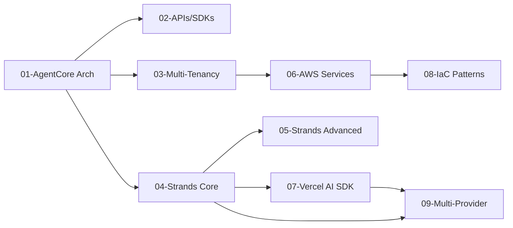

---
tags:
  - research-rabbithole
  - aws
  - bedrock
  - agentcore
  - strands-agents
  - vercel-ai-sdk
  - iac
  - multi-tenant
date: 2026-03-19
topic: AWS Bedrock AgentCore and Strands Agents Framework
status: complete
---

# AWS Bedrock AgentCore & Strands Agents Research Index

## TL;DR

AWS has built a comprehensive managed agent platform:

- **Bedrock AgentCore** — 9 managed services (Runtime, Memory, Gateway, Identity, Observability, Policy, Evaluations, Browser, Code Interpreter). Framework-agnostic, MicroVM isolation, active-consumption billing (I/O wait is free). Supports Strands, LangGraph, CrewAI, LlamaIndex, Google ADK, OpenAI Agents SDK. 5 protocols: HTTP, MCP, A2A, AG-UI, WebSocket.
- **Strands Agents** — AWS's open-source agent framework. Model-driven approach, 13+ official model providers, 14M+ downloads. 4 multi-agent patterns: Agents-as-Tools, Swarm, Graph, Workflow. Originated from Q Developer team.
- **Vercel AI SDK** — Universal chat layer with Chat SDK (Feb 2026) supporting Slack, Teams, Discord, Telegram, WhatsApp + 10 more platforms. JSX cards render natively per platform. Data Stream Protocol for backend-agnostic streaming.

## Key Highlights

> [!tip] AgentCore = OpenClaw Infrastructure as Managed Services
> Gateway → AgentCore Gateway (MCP + A2A + AG-UI), Pi Runtime → AgentCore Runtime (MicroVM), Memory → AgentCore Memory, Auth → AgentCore Identity, Tool execution → Code Interpreter + Browser. Active-consumption billing means tenants only pay when agents think, not wait.

> [!info] CDK Alpha Constructs Available
> `@aws-cdk/aws-bedrock-agentcore-alpha` provides L2 constructs for AgentCore deployment with three options: ECR, local asset, S3.

> [!warning] Self-Modifying IaC Requires Policy Guardrails
> Agents editing their own infrastructure is powerful but dangerous. Use OPA/Cedar policies to constrain what agents can modify. Three patterns: GitOps propose (safest), policy-bounded auto-apply, runtime-only (riskiest).

## Research Documents

| # | Document | Lines | Description |
|---|----------|------:|-------------|
| 1 | [[01-AgentCore-Architecture-Runtime]] | 969 | 9 managed services, MicroVM isolation, framework-agnostic runtime |
| 2 | [[02-AgentCore-APIs-SDKs-MCP]] | 1,707 | 60+ API actions, Python/TS SDKs, 4 MCP integration patterns |
| 3 | [[03-AgentCore-Multi-Tenancy-Deployment]] | 1,223 | Silo/Pool/Hybrid, MicroVM isolation, Cedar policies, cost attribution |
| 4 | [[04-Strands-Agents-Core]] | 1,351 | Agent loop, tool system, 13+ providers, hooks/plugins |
| 5 | [[05-Strands-Advanced-Memory-MultiAgent]] | 1,745 | 4 multi-agent patterns, A2A protocol, interrupts, streaming |
| 6 | [[06-AWS-Services-Agent-Infrastructure]] | 658 | 15 AWS services for agent platforms with patterns and costs |
| 7 | [[07-Vercel-AI-SDK-Chat-Layer]] | 1,760 | Chat SDK multi-platform, Data Stream Protocol, ToolLoopAgent |
| 8 | [[08-IaC-Patterns-Agent-Platforms]] | 749 | CDK/OpenTofu/Pulumi, self-modifying IaC, per-tenant patterns |
| 9 | [[09-Multi-Provider-LLM-Support]] | 686 | 17 providers in Strands, LiteLLM, cross-region inference |
| **Total** | | **10,848** | |

## Suggested Reading Order

1. **Start here:** [[01-AgentCore-Architecture-Runtime]] — understand the platform
2. **APIs:** [[02-AgentCore-APIs-SDKs-MCP]] — how to build with it
3. **Framework:** [[04-Strands-Agents-Core]] → [[05-Strands-Advanced-Memory-MultiAgent]]
4. **Multi-tenancy:** [[03-AgentCore-Multi-Tenancy-Deployment]] → [[06-AWS-Services-Agent-Infrastructure]]
5. **Communication:** [[07-Vercel-AI-SDK-Chat-Layer]] → [[09-Multi-Provider-LLM-Support]]
6. **Infrastructure:** [[08-IaC-Patterns-Agent-Platforms]]

## Key Links

| Resource | URL |
|----------|-----|
| AgentCore Docs | docs.aws.amazon.com/bedrock/latest/userguide/agents-agentcore.html |
| Strands Agents | github.com/strands-agents/sdk-python |
| Strands TS SDK | github.com/strands-agents/sdk-typescript |
| AgentCore Python SDK | pypi.org/project/bedrock-agentcore |
| Vercel AI SDK | github.com/vercel/ai |
| Chat SDK | npmjs.com/package/chat |
| CDK AgentCore Alpha | npmjs.com/package/@aws-cdk/aws-bedrock-agentcore-alpha |
| AgentCore Starter | github.com/awslabs/bedrock-agentcore-starter-toolkit |

## Document Relationship Graph

## Research Metadata

- **Date:** 2026-03-19
- **Agents:** 9 research agents (first wave) + 3 replacement agents (second wave)
- **Total lines:** 10,848
- **Documents:** 9
- **Duration:** ~60 minutes
- **Team:** agent-platform-research
