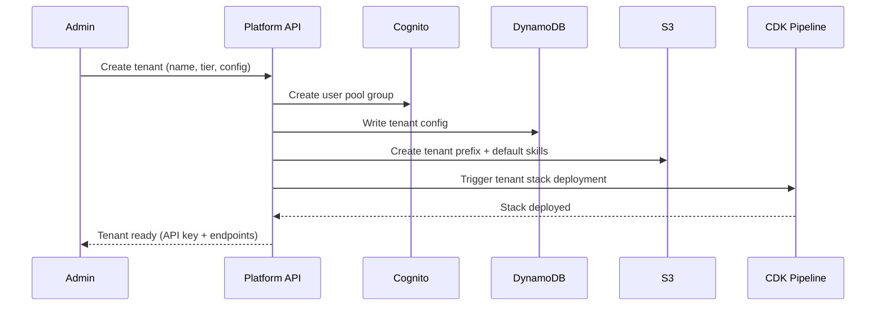

---
tags:
  - research-rabbithole
  - architecture
  - openclaw
  - aws
  - bedrock
  - agentcore
  - strands-agents
  - multi-tenant
  - synthesis
date: 2026-03-19
topic: AWS-Native OpenClaw Architecture Synthesis
status: complete
---

# AWS-Native OpenClaw Architecture Synthesis

> Rebuilding OpenClaw/NemoClaw as an AWS-native multi-tenant agent platform with skills,
> cron jobs, subagents, multi-platform chat, self-improving infrastructure, and
> persistent memory.

## Executive Summary

This document synthesizes 17 research documents (17,839 lines) across two research
rabbitholes to architect **Chimera** — an AWS-native multi-tenant agent platform
that preserves OpenClaw's philosophy while leveraging managed AWS services for
security, scale, and self-improvement.

### The Core Insight

OpenClaw built custom infrastructure for every layer. AWS now offers managed
equivalents for nearly all of them:

| OpenClaw Component | AWS-Native Replacement |
|--------------------|------------------------|
| Gateway daemon (Node.js, port 18789) | AgentCore Gateway + Vercel Chat SDK |
| Pi Agent Runtime (4 tools) | AgentCore Runtime (MicroVM isolation) |
| ClawHub skill registry | S3 + DynamoDB + AgentCore Gateway (MCP targets) |
| Memory (MEMORY.md + memorySearch) | AgentCore Memory (STM + LTM) + S3 |
| Multi-agent (Lane Queue) | Strands multi-agent (Swarm/Graph/Workflow) + A2A |
| Auth (config-based) | AgentCore Identity (OAuth + API keys) + Cognito |
| Code execution (Docker sandbox) | AgentCore Code Interpreter (OpenSandbox) |
| Observability (custom logging) | AgentCore Observability + CloudWatch + X-Ray |
| Chat channels (23+ adapters) | Vercel Chat SDK (Slack/Teams/Discord/Telegram/WhatsApp) |
| Model routing (config) | Strands 13+ providers + Bedrock cross-region inference |

### Design Principles (inherited from OpenClaw)

1. **Local-first, own-your-data** — tenants own their memory, skills, and config
2. **Model-agnostic** — Bedrock as default, but any provider via Strands/LiteLLM
3. **Skills-as-markdown** — preserve the SKILL.md format with YAML frontmatter
4. **Embrace code execution** — OpenSandbox for safe execution
5. **Channels-as-interface** — Chat SDK for multi-platform delivery
6. **The LLM is not the hard part — infrastructure is** — hence AWS managed services

---

## Architecture Overview

```
                            +------------------+
                            |   Vercel Chat    |
                            |   SDK Gateway    |
                            | (Slack/Teams/    |
                            |  Discord/Web/    |
                            |  Telegram/WA)    |
                            +--------+---------+
                                     |
                              Data Stream Protocol
                                     |
                            +--------v---------+
                            |  API Gateway     |
                            |  (WebSocket +    |
                            |   REST + SSE)    |
                            +--------+---------+
                                     |
                    +----------------+----------------+
                    |                                  |
           +--------v---------+              +--------v---------+
           | Tenant Router    |              | Cron Scheduler   |
           | (Cognito JWT +   |              | (EventBridge +   |
           |  DynamoDB lookup)|              |  Step Functions) |
           +--------+---------+              +--------+---------+
                    |                                  |
           +--------v------------------------------------v---------+
           |              AgentCore Runtime                         |
           |  +------------+  +------------+  +------------+       |
           |  | Tenant A   |  | Tenant B   |  | Cron Agent |       |
           |  | MicroVM    |  | MicroVM    |  | MicroVM    |       |
           |  | (Strands)  |  | (Strands)  |  | (Strands)  |       |
           |  +------+-----+  +------+-----+  +------+-----+       |
           +---------+----------------+----------------+-----------+
                     |                |                |
        +------------+----+   +------+------+   +-----+-----+
        |                 |   |             |   |           |
   +----v----+    +-------v---v--+    +-----v---v-+   +----v----+
   |AgentCore|    |AgentCore     |    |AgentCore  |   |AgentCore|
   |Memory   |    |Gateway       |    |Code       |   |Browser  |
   |Service  |    |(MCP targets) |    |Interpreter|   |Service  |
   +---------+    +--------------+    +-----------+   +---------+
                         |
              +----------+----------+
              |          |          |
         +----v---+ +---v----+ +---v----+
         |Skills  | |Tools   | |External|
         |(S3+DDB)| |(MCP    | |APIs    |
         |        | |servers)| |        |
         +--------+ +--------+ +--------+
```

---

## Component Deep Dive

### 1. Multi-Platform Chat Layer

**Technology:** Vercel Chat SDK + AI SDK Data Stream Protocol

**Why Chat SDK over OpenClaw Gateway:**
- OpenClaw Gateway: custom Node.js daemon, 23+ hand-written channel adapters, ~5000 LOC per adapter
- Chat SDK: `npm i chat`, JSX cards render natively per platform, event-driven architecture
- Same multi-platform coverage with 10x less code

**Architecture:**
```typescript
// Chat SDK bot — single entry point for all platforms
import { Bot } from 'chat';
import { SlackAdapter } from 'chat/slack';
import { TeamsAdapter } from 'chat/teams';
import { DiscordAdapter } from 'chat/discord';

const bot = new Bot({
  adapters: [
    new SlackAdapter({ token: process.env.SLACK_TOKEN }),
    new TeamsAdapter({ appId: process.env.TEAMS_APP_ID }),
    new DiscordAdapter({ token: process.env.DISCORD_TOKEN }),
  ],
});

bot.on('message', async (thread) => {
  // Route to AgentCore Runtime via API Gateway WebSocket
  const response = await invokeAgent(thread.tenantId, thread.text);
  // Stream response back natively to whichever platform
  await thread.post(response.textStream);
});
```

**Deployment:** ECS Fargate service behind ALB. One deployment serves all tenants
and all platforms. Per-tenant configuration in DynamoDB (which channels are enabled,
bot tokens, etc.).

**Cross-platform identity:** DynamoDB table linking platform user IDs to tenant
identities. User can start conversation on Slack, continue on web, pick up on Discord.

See: [[OpenClaw NemoClaw OpenFang/07-Chat-Interface-Multi-Platform|07-Chat-Interface-Multi-Platform]], [[AWS Bedrock AgentCore and Strands Agents/07-Vercel-AI-SDK-Chat-Layer|07-Vercel-AI-SDK-Chat-Layer]]

### 2. Agent Runtime

**Technology:** Bedrock AgentCore Runtime + Strands Agents

**Why AgentCore Runtime:**
- MicroVM isolation per session (no container escape risk)
- Active-consumption billing (I/O wait is free — perfect for multi-tenant)
- Framework-agnostic (Strands today, swap tomorrow)
- Built-in observability via OpenTelemetry

**Why Strands as the agent framework:**
- Model-driven approach matches OpenClaw's Pi minimalism
- 13+ model providers (Bedrock default, but supports OpenAI, Anthropic direct, Mistral, etc.)
- 4 multi-agent patterns built-in (Agents-as-Tools, Swarm, Graph, Workflow)
- Native MCP tool support
- A2A protocol for cross-service agent communication
- Session persistence to S3/DynamoDB

**Agent definition (preserving OpenClaw's 4-tool minimalism):**
```python
from strands import Agent
from strands.tools import tool
from strands_tools import read_file, write_file, edit_file, shell

# Core agent — OpenClaw Pi equivalent
agent = Agent(
    model="us.anthropic.claude-sonnet-4-6-v1:0",
    system_prompt=load_tenant_system_prompt(tenant_id),
    tools=[read_file, write_file, edit_file, shell,
           *load_tenant_skills(tenant_id),      # Dynamic skill loading
           *load_tenant_mcp_tools(tenant_id)],   # MCP tools from tenant config
    conversation_manager=SlidingWindowConversationManager(window_size=100_000),
)
```

**Per-tenant customization:**
- System prompt loaded from S3 (`s3://chimera-tenants/{tenant_id}/system-prompt.md`)
- Skills loaded from tenant's skill registry (DynamoDB + S3)
- MCP tools from tenant's tool configuration
- Model selection per tenant (some use Claude, some use Llama, some use Nova)

See: [[AWS Bedrock AgentCore and Strands Agents/01-AgentCore-Architecture-Runtime|01-AgentCore-Architecture-Runtime]], [[AWS Bedrock AgentCore and Strands Agents/04-Strands-Agents-Core|04-Strands-Agents-Core]]

### 3. Skill System

**Technology:** S3 + DynamoDB + AgentCore Gateway (MCP targets)

**Preserving OpenClaw's SKILL.md format:**
```yaml
---
name: code-review
description: Review code for bugs, security issues, and style
version: 1.2.0
author: tenant-acme
tags: [code-quality, security]
mcp_server: true
tools:
  - review_file
  - suggest_fix
---

# Code Review Skill

When asked to review code, analyze for:
1. Security vulnerabilities (OWASP Top 10)
2. Logic errors and edge cases
3. Style consistency with project conventions
...
```

**Skill storage architecture:**
```
S3: s3://chimera-skills/
  ├── global/              # Platform-provided skills (curated, audited)
  │   ├── code-review/
  │   │   ├── SKILL.md
  │   │   └── mcp-server/  # MCP server code if skill provides tools
  │   └── web-search/
  ├── marketplace/         # Community skills (verified, sandboxed)
  │   └── {skill-id}/
  └── tenants/            # Per-tenant custom skills
      └── {tenant-id}/
          └── {skill-name}/

DynamoDB: chimera-skill-metadata
  PK: TENANT#{tenant_id}  SK: SKILL#{skill_name}
  Fields: version, author, tags, mcp_endpoint, trust_level, download_count
```

**Skill-as-MCP-server (preserving OpenClaw's pattern):**
Skills that provide tools are deployed as AgentCore Gateway MCP targets:
```python
# Register skill's MCP server as a Gateway target
gateway_client.create_gateway(
    name=f"skill-{skill_name}",
    target_type="MCP_SERVER",
    target_config={
        "uri": f"s3://chimera-skills/tenants/{tenant_id}/{skill_name}/mcp-server",
        "transport": "STREAMABLE_HTTP"
    }
)
```

**Security (lessons from ClawHavoc):**
- All marketplace skills run in OpenSandbox (AgentCore Code Interpreter)
- WASM isolation for untrusted skill code (inspired by OpenFang)
- Cedar policies restrict what skills can access per tenant
- Skill signing with tenant keys (Ed25519, inspired by OpenFang)
- Automated security scanning before marketplace publication

See: [[OpenClaw NemoClaw OpenFang/04-Skill-System-Tool-Creation|04-Skill-System-Tool-Creation]], [[AWS Bedrock AgentCore and Strands Agents/02-AgentCore-APIs-SDKs-MCP|02-AgentCore-APIs-SDKs-MCP]]

### 4. Cron Jobs & Scheduled Agents

**Technology:** EventBridge Scheduler + Step Functions + AgentCore Runtime

**Pattern:** Each tenant can define scheduled agent runs (like ADMINISTRIVIA's
email-digest and extract-tasks jobs):

```python
# Tenant cron job definition (stored in DynamoDB)
{
    "tenant_id": "acme",
    "job_name": "daily-digest",
    "schedule": "cron(0 8 ? * MON-FRI *)",  # Weekdays at 8am
    "agent_config": {
        "system_prompt_key": "s3://chimera-tenants/acme/prompts/digest.md",
        "skills": ["email-reader", "summarizer"],
        "mcp_tools": ["outlook", "slack"],
        "model": "us.anthropic.claude-sonnet-4-6-v1:0",
        "max_budget_usd": 2.0
    },
    "output": {
        "type": "s3",
        "path": "s3://chimera-tenants/acme/outputs/digests/{date}.md"
    },
    "notifications": {
        "slack_channel": "#daily-digest",
        "on_failure": "slack_dm:admin"
    }
}
```

**Execution flow:**
1. EventBridge fires on schedule
2. Step Function orchestrates: load config → invoke AgentCore Runtime → capture output → notify
3. Agent runs in isolated MicroVM with tenant's skills and tools
4. Output written to tenant's S3 prefix
5. Notification sent via Chat SDK to tenant's configured channel

**Self-scheduling:** Agents can create/modify their own cron jobs via a
`manage_schedule` tool, subject to Cedar policy limits per tenant.

### 5. Subagents & Multi-Agent Orchestration

**Technology:** Strands multi-agent patterns + A2A protocol

**Mapping OpenClaw's Lane Queue to Strands:**

| OpenClaw Lane | Strands Equivalent |
|---------------|--------------------|
| main | Primary agent |
| subagent | Agents-as-Tools pattern |
| cron | Scheduled agent (EventBridge) |
| nested | Graph pattern with cycles |

**Subagent spawning:**
```python
from strands import Agent
from strands.multiagent import AgentsAsTool

# Specialist subagents
code_reviewer = Agent(
    model="us.anthropic.claude-sonnet-4-6-v1:0",
    system_prompt="You are a code review specialist...",
    tools=[read_file, analyze_code],
)

security_scanner = Agent(
    model="us.anthropic.claude-sonnet-4-6-v1:0",
    system_prompt="You are a security analyst...",
    tools=[read_file, check_vulnerabilities],
)

# Coordinator agent with subagents as tools
coordinator = Agent(
    model="us.anthropic.claude-opus-4-6-v1:0",
    system_prompt="You coordinate code reviews...",
    tools=[
        AgentsAsTool("review", code_reviewer, "Review code quality"),
        AgentsAsTool("security", security_scanner, "Check security"),
    ],
)
```

**Cross-service agents (A2A):**
For multi-tenant scenarios where agents need to communicate across isolation boundaries:
```python
from strands.multiagent.a2a import A2AServer, A2AAgent

# Expose agent as A2A service
server = A2AServer(agent=my_agent, port=8080)

# Connect to remote agent
remote = A2AAgent(url="https://agent-b.internal:8080")
```

**Swarm pattern for handoffs:**
```python
from strands.multiagent.swarm import Swarm

swarm = Swarm(
    agents={
        "triage": triage_agent,
        "billing": billing_agent,
        "technical": technical_agent,
    },
    initial_agent="triage",
)
# Triage agent hands off to billing or technical based on intent
```

See: [[OpenClaw NemoClaw OpenFang/06-Multi-Agent-Orchestration|06-Multi-Agent-Orchestration]], [[AWS Bedrock AgentCore and Strands Agents/05-Strands-Advanced-Memory-MultiAgent|05-Strands-Advanced-Memory-MultiAgent]]

### 6. Memory & Persistence

**Technology:** AgentCore Memory (STM + LTM) + S3 + DynamoDB

**Three-tier memory (inspired by OpenClaw + OpenFang):**

| Tier | OpenClaw Equivalent | AWS Implementation |
|------|--------------------|--------------------|
| Ephemeral (session) | Conversation history | AgentCore Memory STM (session manager) |
| Durable (cross-session) | MEMORY.md | AgentCore Memory LTM (summary, semantic facts, preferences) |
| Knowledge base (tenant) | Skills + docs | S3 + Bedrock Knowledge Bases (RAG) |

**AgentCore Memory integration with Strands:**
```python
from strands import Agent
from bedrock_agentcore.memory import MemorySessionManager

memory = MemorySessionManager(
    memory_id="tenant-acme-memory",
    namespace="acme",
    strategies=["SUMMARY", "SEMANTIC_MEMORY", "USER_PREFERENCE"],
)

agent = Agent(
    model="us.anthropic.claude-sonnet-4-6-v1:0",
    session_manager=memory,
    # LTM automatically persists insights across sessions
)
```

**Self-improvement loop (OpenClaw's self-editing pattern, made safe):**
1. Agent identifies a pattern/preference during conversation
2. Writes to LTM via AgentCore Memory (semantic facts)
3. Next session: LTM context automatically injected
4. Agent behaves differently based on learned context
5. Guardrail: Cedar policy limits what memory categories agent can write

**Tenant memory isolation:**
- Each tenant gets a separate AgentCore Memory namespace
- S3 prefix isolation: `s3://chimera-tenants/{tenant_id}/memory/`
- DynamoDB partition: `PK: TENANT#{tenant_id} SK: MEMORY#{key}`
- No cross-tenant memory access (enforced by IAM + Cedar)

See: [[OpenClaw NemoClaw OpenFang/05-Memory-Persistence-Self-Improvement|05-Memory-Persistence-Self-Improvement]], [[AWS Bedrock AgentCore and Strands Agents/05-Strands-Advanced-Memory-MultiAgent|05-Strands-Advanced-Memory-MultiAgent]]

### 7. Multi-Provider LLM Support

**Technology:** Strands model providers + Bedrock cross-region inference

**Default: Bedrock (17+ models):**
- Anthropic Claude (Sonnet 4.6, Opus 4.6, Haiku 4.5)
- Meta Llama 4 (Scout, Maverick)
- Mistral (Large, Small)
- Amazon Nova (Pro, Lite, Micro)
- DeepSeek R1
- Cross-region inference profiles: `us.*`, `eu.*`, `global.*`

**Per-tenant model configuration:**
```python
# Tenant config in DynamoDB
{
    "tenant_id": "acme",
    "models": {
        "default": "us.anthropic.claude-sonnet-4-6-v1:0",
        "complex": "us.anthropic.claude-opus-4-6-v1:0",
        "fast": "us.amazon.nova-lite-v1:0",
        "code": "us.anthropic.claude-sonnet-4-6-v1:0",
        "local": "ollama:llama3.2"  # Via LiteLLM proxy
    },
    "routing": "cost_optimized",  # or "quality_first", "latency_first"
    "fallback_chain": ["default", "fast"],
    "budget_limit_monthly_usd": 500
}
```

**Multi-provider via Strands:**
```python
from strands.models.bedrock import BedrockModel
from strands.models.openai import OpenAIModel
from strands.models.ollama import OllamaModel

# Tenant A uses Bedrock Claude
agent_a = Agent(model=BedrockModel("us.anthropic.claude-sonnet-4-6-v1:0"))

# Tenant B uses OpenAI
agent_b = Agent(model=OpenAIModel("gpt-4o"))

# Tenant C uses local Ollama
agent_c = Agent(model=OllamaModel("llama3.2"))
```

**LiteLLM as universal proxy (for providers not in Strands):**
Deploy LiteLLM as an ECS service for tenants needing access to 100+ providers
through a single OpenAI-compatible endpoint.

See: [[AWS Bedrock AgentCore and Strands Agents/09-Multi-Provider-LLM-Support|09-Multi-Provider-LLM-Support]]

### 8. Security Model (Lessons from NemoClaw + ClawHavoc)

**Defense-in-depth architecture:**

| Layer | Technology | Protects Against |
|-------|-----------|-----------------|
| 1. Tenant isolation | Cognito + IAM + DynamoDB | Cross-tenant access |
| 2. Agent sandbox | AgentCore MicroVM | Container escape |
| 3. Code execution | AgentCore Code Interpreter (OpenSandbox) | Malicious code |
| 4. Skill verification | Ed25519 signing + automated scanning | ClawHavoc-style attacks |
| 5. Policy enforcement | Cedar policies | Privilege escalation |
| 6. Memory protection | Namespace isolation + encryption | Data leakage |
| 7. Model routing | Bedrock Guardrails | Prompt injection, PII leakage |
| 8. Network | VPC + Security Groups + WAF | Network attacks |

**Cedar policy example (per-tenant skill restrictions):**
```cedar
// Tenant can only invoke skills they've installed
permit(
    principal in Tenant::"acme",
    action == Action::"invoke_skill",
    resource in SkillNamespace::"acme"
);

// Deny access to filesystem outside tenant workspace
forbid(
    principal in Tenant::"acme",
    action == Action::"file_access",
    resource
) unless {
    resource.path.startsWith("/workspace/acme/")
};
```

### 9. Self-Editing Infrastructure (IaC)

**Technology:** AWS CDK (platform) + CDK per-tenant stacks + GitOps

**Two-layer IaC separation:**

```
Platform IaC (CDK TypeScript):
  ├── lib/
  │   ├── platform-stack.ts      # AgentCore, API Gateway, DynamoDB, S3
  │   ├── chat-stack.ts          # Chat SDK deployment, ALB
  │   ├── observability-stack.ts # CloudWatch, X-Ray, dashboards
  │   └── security-stack.ts      # Cognito, WAF, Cedar policies
  └── cdk.json

Tenant IaC (CDK TypeScript, generated per tenant):
  ├── lib/
  │   ├── tenant-stack.ts        # Tenant-specific resources
  │   ├── tenant-skills.ts       # Skill deployments (MCP targets)
  │   └── tenant-cron.ts         # EventBridge rules for cron jobs
  └── cdk.json
```

**Self-modifying IaC (agent edits infrastructure):**

The agent can modify its own tenant infrastructure via a `manage_infrastructure` tool:

```python
@tool
def manage_infrastructure(action: str, resource_type: str, config: dict) -> str:
    """
    Modify tenant infrastructure. Subject to Cedar policy limits.
    Allowed actions: add_skill, remove_skill, update_cron, scale_concurrency.
    """
    # Validate against Cedar policy
    if not cedar_authorize(tenant_id, action, resource_type):
        return "Action denied by policy"

    # Generate CDK diff
    cdk_diff = generate_tenant_cdk_change(tenant_id, action, resource_type, config)

    # GitOps: commit to tenant branch, trigger CI/CD
    commit_to_gitops(tenant_id, cdk_diff)

    return f"Infrastructure change proposed. PR: {pr_url}"
```

**Safety guardrails for self-modifying IaC:**
1. All changes go through GitOps (PR + review)
2. Cedar policies limit what agents can modify
3. Budget limits prevent runaway infrastructure
4. Rollback via CDK stack history
5. Drift detection alerts on unexpected changes

**CDK constructs for AgentCore:**
```typescript
import { AgentCoreRuntime } from '@aws-cdk/aws-bedrock-agentcore-alpha';

const runtime = new AgentCoreRuntime(this, 'Runtime', {
  deploymentType: 'LOCAL_ASSET',
  assetPath: './agent-code',
  memoryConfig: {
    strategies: ['SUMMARY', 'SEMANTIC_MEMORY'],
  },
  identityConfig: {
    inboundAuth: 'IAM',
    outboundAuth: ['OAUTH2', 'API_KEY'],
  },
});
```

See: [[AWS Bedrock AgentCore and Strands Agents/08-IaC-Patterns-Agent-Platforms|08-IaC-Patterns-Agent-Platforms]], [[OpenClaw NemoClaw OpenFang/08-Deployment-Infrastructure-Self-Editing|08-Deployment-Infrastructure-Self-Editing]]

---

## Multi-Tenant Architecture

### Tenant Isolation Model

**Hybrid approach (Silo + Pool):**
- **Silo** (premium): dedicated AgentCore Runtime endpoint, dedicated DynamoDB table, dedicated S3 prefix
- **Pool** (standard): shared AgentCore Runtime with MicroVM isolation, shared DynamoDB with partition isolation, shared S3 with prefix isolation
- **Tier routing:** Cognito JWT → tenant metadata → route to silo or pool

### Tenant Onboarding Flow



### Cost Attribution

- AgentCore active-consumption billing → per-tenant cost via CloudWatch Logs Insights
- DynamoDB on-demand → per-tenant item-level costing via tags
- S3 → per-tenant prefix-level storage metrics
- Model invocation → per-tenant token tracking via session metadata

See: [[AWS Bedrock AgentCore and Strands Agents/03-AgentCore-Multi-Tenancy-Deployment|03-AgentCore-Multi-Tenancy-Deployment]]

---

## Technology Stack Summary

| Layer | Technology | Purpose |
|-------|-----------|---------|
| Chat | Vercel Chat SDK | Multi-platform delivery (Slack, Teams, Discord, etc.) |
| API | API Gateway (WebSocket + REST) | Client connections, streaming |
| Auth | Cognito + AgentCore Identity | Tenant auth, OAuth, API keys |
| Runtime | AgentCore Runtime (MicroVM) | Isolated agent execution |
| Framework | Strands Agents | Agent loop, tools, multi-agent |
| Memory | AgentCore Memory + S3 | STM + LTM + knowledge base |
| Skills | S3 + DynamoDB + Gateway MCP | Skill storage, discovery, execution |
| Code Exec | AgentCore Code Interpreter | Safe code execution (OpenSandbox) |
| Browser | AgentCore Browser | Web browsing (Playwright CDP) |
| Scheduling | EventBridge + Step Functions | Cron jobs, workflows |
| State | DynamoDB | Tenant config, session state, metadata |
| Storage | S3 + EFS | Artifacts, skills, workspaces |
| Messaging | SQS + EventBridge | Agent coordination, events |
| Observability | CloudWatch + X-Ray + OTel | Metrics, logs, traces |
| Security | Cedar + WAF + Guardrails | Policy, network, content safety |
| Models | Bedrock + Strands providers | Multi-model, multi-provider |
| IaC | CDK (platform) + CDK (tenant) | Infrastructure management |
| CI/CD | CodePipeline + GitOps | Deployment automation |

---

## Open Source Components

| Component | Purpose | License |
|-----------|---------|---------|
| Strands Agents SDK | Agent framework | Apache 2.0 |
| Vercel AI SDK | Provider abstraction | Apache 2.0 |
| Vercel Chat SDK | Multi-platform chat | MIT |
| LiteLLM | Universal LLM proxy | MIT |
| Cedar | Policy language | Apache 2.0 |
| OpenTelemetry | Observability | Apache 2.0 |

---

## IaC Quick Start

```bash
# Platform deployment
npx cdk deploy ChimeraPlatformStack \
  --context environment=prod \
  --context region=us-west-2

# Tenant onboarding
npx cdk deploy ChimeraTenantStack \
  --context tenantId=acme \
  --context tier=premium \
  --context models=claude-sonnet,nova-lite

# Or via OpenTofu
tofu apply -var="tenant_id=acme" -var="tier=premium"

# Or via Pulumi
pulumi up --stack acme-tenant
```

---

## What This Architecture Preserves from OpenClaw

| OpenClaw Feature | Chimera Equivalent | Fidelity |
|-----------------|---------------------|----------|
| Pi's 4-tool minimalism | Strands agent with read/write/edit/shell | High |
| SKILL.md format | Same format, stored in S3 | Exact |
| MEMORY.md persistence | AgentCore LTM + S3 snapshots | High |
| ClawHub marketplace | S3 + DynamoDB skill registry | High |
| Gateway multi-channel | Chat SDK multi-platform | High |
| Lane Queue concurrency | Strands Swarm + Graph patterns | Medium |
| Self-editing config | Self-modifying IaC via GitOps | Enhanced |
| Docker sandbox | AgentCore Code Interpreter (MicroVM) | Enhanced |
| Model agnostic | Strands 13+ providers + LiteLLM | Enhanced |

## What This Architecture Adds Beyond OpenClaw

| Capability | How |
|-----------|-----|
| Multi-tenant isolation | MicroVM + Cognito + Cedar policies |
| Per-tenant billing | CloudWatch cost attribution |
| Enterprise security | Bedrock Guardrails + Cedar + WAF |
| Managed infrastructure | AgentCore 9 services vs self-hosted |
| Self-modifying IaC | Agent can propose infrastructure changes via GitOps |
| Cross-platform identity | DynamoDB identity linking |
| Scheduled agents | EventBridge + Step Functions |
| Agent-to-Agent protocol | A2A for distributed multi-agent |
| Browser automation | AgentCore Browser (managed Playwright) |
| Observability | OpenTelemetry + CloudWatch + X-Ray |

---

## Next Steps

1. **Prototype:** Build a single-tenant proof of concept with Strands + AgentCore Runtime
2. **Chat layer:** Deploy Chat SDK with 2-3 platforms (Slack + Web + Discord)
3. **Skill system:** Implement SKILL.md loader + S3 registry + MCP target deployment
4. **Memory:** Wire up AgentCore Memory with Strands session manager
5. **Multi-tenant:** Add Cognito + tenant router + DynamoDB config
6. **Cron:** EventBridge scheduler for tenant cron jobs
7. **IaC:** CDK stacks for platform + tenant separation
8. **Self-editing:** `manage_infrastructure` tool with Cedar guardrails
9. **Security audit:** ClawHavoc-informed skill verification pipeline
10. **Scale testing:** Multi-tenant load testing with concurrent agents

---

## Related Research

- [[OpenClaw NemoClaw OpenFang/OpenClaw NemoClaw OpenFang Research Index|OpenClaw Research Index]] — 8 documents, 6,991 lines
- [[AWS Bedrock AgentCore and Strands Agents/AgentCore and Strands Research Index|AgentCore Research Index]] — 9 documents, 10,848 lines
- Total research: **17 documents, 17,839 lines**

---

*Research conducted 2026-03-19 by 17+ parallel research agents on team agent-platform-research.*
