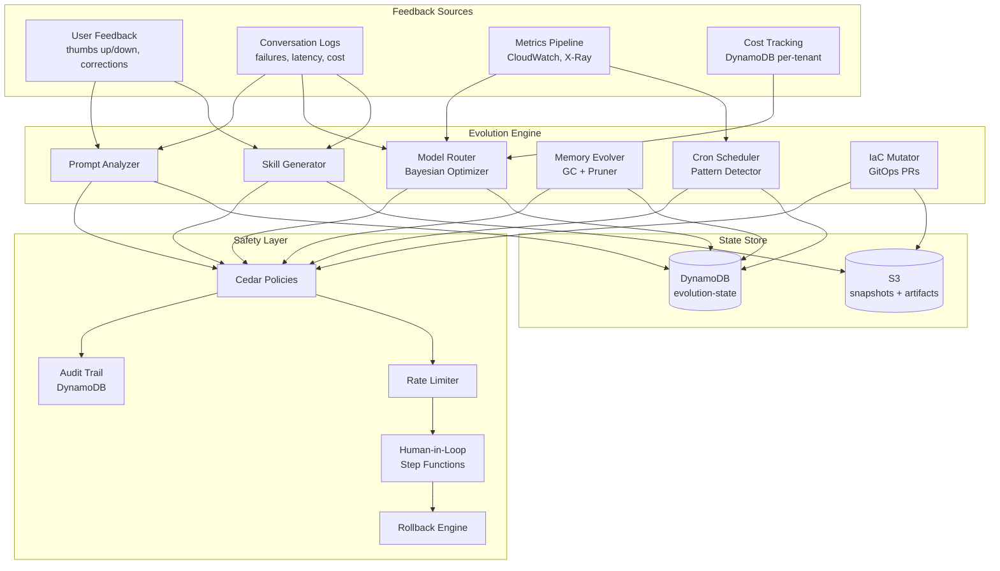
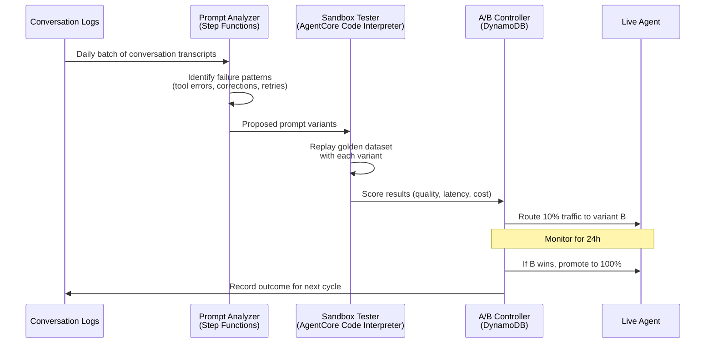
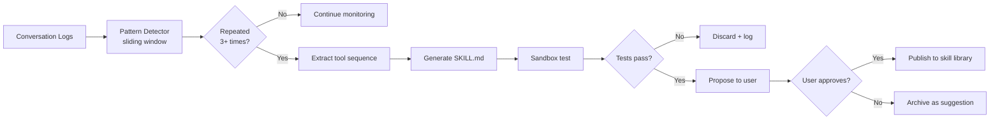
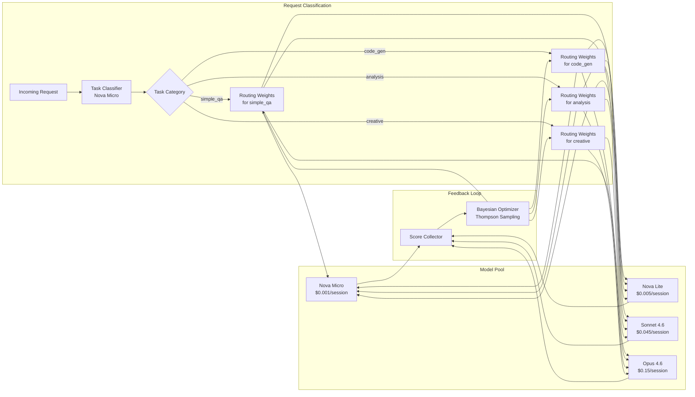
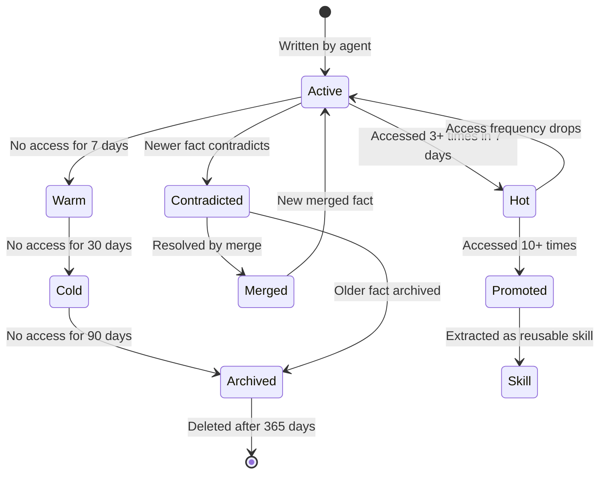
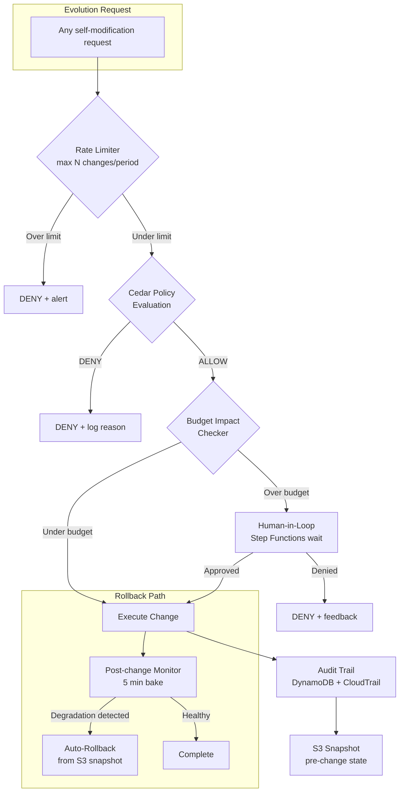

---
tags:
  - research-rabbithole
  - architecture
  - chimera
  - self-evolution
  - aws
  - implementation-plan
date: 2026-03-19
topic: Chimera Self-Evolution Engine
status: complete
---

# Chimera Self-Evolution Engine

> What makes Chimera not just an agent platform, but one that **improves itself over time**.
> This document designs the mechanisms by which agents learn from failures, generate new
> skills, modify their own infrastructure, optimize model routing, evolve their memory,
> and schedule their own work -- all within auditable, policy-bounded guardrails.

Built on: [[Chimera-Final-Architecture-Plan]]
Memory foundations: [[OpenClaw NemoClaw OpenFang/05-Memory-Persistence-Self-Improvement]]
IaC patterns: [[AWS Bedrock AgentCore and Strands Agents/08-IaC-Patterns-Agent-Platforms]]

---

## Architecture Overview



---

## 1. Self-Improving Prompts

Agents analyze their own conversation logs, identify failures and inefficiencies, propose prompt improvements, test them in sandbox, and promote winners through an A/B testing framework.

### How It Works

1. **Log Analysis** -- A background Step Functions workflow runs daily, scanning conversation logs for patterns: tool call failures, user corrections, repeated clarification requests, high-latency exchanges
2. **Improvement Proposal** -- A meta-agent (running on Nova Micro for cost efficiency) generates prompt diffs based on observed failures
3. **Sandbox Testing** -- Proposed prompts are tested against a golden dataset of representative conversations stored in S3
4. **A/B Promotion** -- Winning prompts are promoted via weighted traffic splitting on AgentCore endpoints

### Prompt Evolution Pipeline



### Strands Agent: Prompt Analyzer

```python
import json
from datetime import datetime, timedelta
from strands import Agent, tool
from strands.models import BedrockModel

@tool
def analyze_conversation_logs(
    tenant_id: str,
    days_back: int = 7
) -> dict:
    """Analyze recent conversation logs for failure patterns."""
    import boto3
    dynamodb = boto3.resource("dynamodb")
    table = dynamodb.Table("chimera-sessions")

    # Query recent sessions for this tenant
    cutoff = (datetime.utcnow() - timedelta(days=days_back)).isoformat()
    response = table.query(
        KeyConditionExpression="PK = :pk AND SK > :cutoff",
        ExpressionAttributeValues={
            ":pk": f"TENANT#{tenant_id}",
            ":cutoff": f"SESSION#{cutoff}",
        },
    )

    failures = []
    corrections = []
    retries = []

    for session in response["Items"]:
        log = json.loads(session.get("conversation_log", "[]"))
        for i, turn in enumerate(log):
            # Detect tool call failures
            if turn.get("role") == "tool" and turn.get("status") == "error":
                failures.append({
                    "session_id": session["SK"],
                    "turn": i,
                    "tool": turn.get("tool_name"),
                    "error": turn.get("content", "")[:200],
                })
            # Detect user corrections ("no, I meant...", "that's wrong")
            if turn.get("role") == "user":
                content = turn.get("content", "").lower()
                correction_signals = [
                    "no,", "that's wrong", "i meant", "not what i asked",
                    "try again", "incorrect", "please fix",
                ]
                if any(sig in content for sig in correction_signals):
                    corrections.append({
                        "session_id": session["SK"],
                        "turn": i,
                        "user_message": turn.get("content", "")[:300],
                        "prior_assistant": log[i-1].get("content", "")[:300] if i > 0 else "",
                    })

    return {
        "tenant_id": tenant_id,
        "period_days": days_back,
        "total_sessions": len(response["Items"]),
        "failure_count": len(failures),
        "correction_count": len(corrections),
        "top_failures": failures[:10],
        "top_corrections": corrections[:10],
    }


@tool
def propose_prompt_improvement(
    current_prompt: str,
    failure_analysis: dict
) -> dict:
    """Generate a prompt improvement based on failure analysis."""
    # This tool delegates to a meta-agent that rewrites the prompt
    meta_agent = Agent(
        model=BedrockModel(model_id="us.amazon.nova-micro-v1:0"),
        system_prompt="""You are a prompt engineer. Given a system prompt and
        an analysis of its failures, produce an improved version.

        Rules:
        - Only modify sections relevant to the failures
        - Keep the prompt's overall structure and tone
        - Add specific examples for failure cases
        - Never remove safety instructions
        - Output JSON: {"improved_prompt": "...", "changes": ["..."]}""",
    )
    result = meta_agent(
        f"Current prompt:\n{current_prompt}\n\n"
        f"Failure analysis:\n{json.dumps(failure_analysis, indent=2)}"
    )
    return json.loads(result.message["content"][0]["text"])


@tool
def test_prompt_variant(
    tenant_id: str,
    variant_prompt: str,
    golden_dataset_s3_key: str
) -> dict:
    """Test a prompt variant against a golden dataset in sandbox."""
    import boto3
    s3 = boto3.client("s3")

    # Load golden dataset
    obj = s3.get_object(
        Bucket="chimera-evolution-artifacts",
        Key=golden_dataset_s3_key,
    )
    golden = json.loads(obj["Body"].read())

    scores = []
    for test_case in golden["cases"]:
        test_agent = Agent(
            model=BedrockModel(model_id="us.anthropic.claude-sonnet-4-6-v1:0"),
            system_prompt=variant_prompt,
        )
        result = test_agent(test_case["user_input"])
        response_text = result.message["content"][0]["text"]

        # Score against expected output (cosine similarity via Bedrock embeddings)
        score = _compute_similarity(response_text, test_case["expected_output"])
        scores.append({
            "case_id": test_case["id"],
            "score": score,
            "latency_ms": result.metrics.get("latency_ms", 0),
            "tokens_used": result.metrics.get("total_tokens", 0),
        })

    avg_score = sum(s["score"] for s in scores) / len(scores)
    avg_cost = sum(s["tokens_used"] for s in scores) / len(scores)

    return {
        "variant_id": f"v-{datetime.utcnow().strftime('%Y%m%d%H%M')}",
        "avg_quality_score": round(avg_score, 4),
        "avg_tokens_per_case": round(avg_cost),
        "pass_rate": sum(1 for s in scores if s["score"] > 0.8) / len(scores),
        "details": scores,
    }


# The prompt evolution agent orchestrates the full pipeline
prompt_evolution_agent = Agent(
    model=BedrockModel(model_id="us.anthropic.claude-sonnet-4-6-v1:0"),
    system_prompt="""You are the Prompt Evolution Engine for Chimera.
    Your job is to analyze conversation logs, identify failure patterns,
    propose prompt improvements, test them, and recommend promotion.

    Workflow:
    1. Call analyze_conversation_logs to find failures
    2. Call propose_prompt_improvement with the current prompt + failures
    3. Call test_prompt_variant to validate the improvement
    4. If the variant scores higher, recommend promotion
    5. Always explain your reasoning""",
    tools=[analyze_conversation_logs, propose_prompt_improvement, test_prompt_variant],
)
```

### A/B Testing DynamoDB Schema

```
Table: chimera-evolution-state
PK: TENANT#{tenant_id}
SK: PROMPT_AB#{experiment_id}

Attributes:
  variant_a_prompt_s3:  str   # S3 key for control prompt
  variant_b_prompt_s3:  str   # S3 key for challenger prompt
  traffic_split:        num   # 0.0-1.0, fraction routed to B
  started_at:           str   # ISO timestamp
  expires_at:           str   # Auto-expire after max duration
  variant_a_scores:     map   # {quality: 0.85, cost: 1200, n: 450}
  variant_b_scores:     map   # {quality: 0.89, cost: 1100, n: 50}
  status:               str   # running | completed | rolled_back
  promoted_variant:     str   # a | b | null
  cedar_approval:       str   # policy evaluation result
```

---

## 2. Auto-Skill Generation

When an agent repeatedly performs a multi-step task, the system automatically extracts that pattern into a new `SKILL.md`, tests it in sandbox, and optionally publishes it to the tenant's skill library.

### Detection: Identifying Repetitive Patterns



### Pattern Detection Algorithm

The detector uses a sliding window over tool call sequences, comparing them with Levenshtein distance on the tool-name sequence:

```python
from collections import Counter
from strands import Agent, tool
import json

@tool
def detect_repeated_patterns(
    tenant_id: str,
    min_occurrences: int = 3,
    min_steps: int = 2,
    window_days: int = 14
) -> dict:
    """Detect repeated multi-step tool sequences in conversation logs."""
    import boto3
    from datetime import datetime, timedelta

    dynamodb = boto3.resource("dynamodb")
    table = dynamodb.Table("chimera-sessions")

    cutoff = (datetime.utcnow() - timedelta(days=window_days)).isoformat()
    response = table.query(
        KeyConditionExpression="PK = :pk AND SK > :cutoff",
        ExpressionAttributeValues={
            ":pk": f"TENANT#{tenant_id}",
            ":cutoff": f"SESSION#{cutoff}",
        },
    )

    # Extract tool call sequences from each session
    sequences = []
    for session in response["Items"]:
        log = json.loads(session.get("conversation_log", "[]"))
        tool_seq = []
        for turn in log:
            if turn.get("role") == "assistant" and turn.get("tool_calls"):
                for tc in turn["tool_calls"]:
                    tool_seq.append(tc["name"])
        if len(tool_seq) >= min_steps:
            sequences.append(tool_seq)

    # Find repeated subsequences using n-gram extraction
    pattern_counts = Counter()
    pattern_examples = {}

    for seq in sequences:
        for length in range(min_steps, min(len(seq) + 1, 8)):  # max 7 steps
            for start in range(len(seq) - length + 1):
                subseq = tuple(seq[start:start + length])
                pattern_counts[subseq] += 1
                if subseq not in pattern_examples:
                    pattern_examples[subseq] = seq

    # Filter to patterns that appear >= min_occurrences
    repeated = [
        {
            "pattern": list(p),
            "occurrences": count,
            "steps": len(p),
            "example_full_sequence": pattern_examples[p],
        }
        for p, count in pattern_counts.most_common(20)
        if count >= min_occurrences
    ]

    return {
        "tenant_id": tenant_id,
        "sessions_analyzed": len(response["Items"]),
        "patterns_found": len(repeated),
        "top_patterns": repeated[:10],
    }


@tool
def generate_skill_from_pattern(
    pattern: list,
    example_conversations: list,
    tenant_id: str
) -> dict:
    """Generate a SKILL.md from a detected repeated pattern."""
    skill_name = _derive_skill_name(pattern)

    # Build the SKILL.md content
    tool_descriptions = "\n".join(f"  {i+1}. `{t}`" for i, t in enumerate(pattern))

    skill_md = f"""# {skill_name}

> Auto-generated skill from {len(example_conversations)} observed repetitions.
> Pattern detected: {' -> '.join(pattern)}

## When to Use

Use this skill when the user asks you to perform a task that involves:
{tool_descriptions}

## Steps

{_generate_steps_from_examples(pattern, example_conversations)}

## Notes

- This skill was auto-generated by Chimera's evolution engine
- Generated: {{date}}
- Tenant: {tenant_id}
- Review and customize before publishing to the marketplace
"""

    # Also generate a Strands tool wrapper
    tool_code = _generate_tool_wrapper(skill_name, pattern, example_conversations)

    return {
        "skill_name": skill_name,
        "skill_md": skill_md,
        "tool_code": tool_code,
        "pattern": pattern,
        "confidence": _compute_pattern_confidence(example_conversations),
    }


@tool
def test_skill_in_sandbox(
    skill_md: str,
    tool_code: str,
    test_inputs: list
) -> dict:
    """Test a generated skill in AgentCore Code Interpreter sandbox."""
    import boto3

    # Submit to Code Interpreter for isolated execution
    bedrock = boto3.client("bedrock-agentcore-runtime")

    results = []
    for test_input in test_inputs:
        response = bedrock.invoke_code_interpreter(
            sandboxId="chimera-skill-test",
            code=tool_code,
            input=json.dumps(test_input),
            timeout=30,
            networkAccess=False,  # Fully isolated
        )
        results.append({
            "input": test_input,
            "output": response.get("result"),
            "error": response.get("error"),
            "execution_ms": response.get("executionTimeMs"),
        })

    passed = sum(1 for r in results if not r["error"])
    return {
        "total_tests": len(results),
        "passed": passed,
        "failed": len(results) - passed,
        "pass_rate": passed / len(results) if results else 0,
        "results": results,
    }
```

### Skill Publishing Flow

Once a skill passes sandbox testing:

1. **S3 Upload** -- `SKILL.md` and tool code uploaded to `s3://chimera-skills/{tenant_id}/{skill_name}/`
2. **DynamoDB Registration** -- Metadata written to `chimera-skills` table
3. **Security Scan** -- AST analysis + dependency audit (same as marketplace pipeline)
4. **Ed25519 Signing** -- Platform signs the skill with `trust_level: "auto-generated"`
5. **User Notification** -- Agent notifies user: "I noticed you do X repeatedly. I created a skill for it."

---

## 3. Self-Modifying IaC

Agents can propose infrastructure changes via GitOps PRs, with three escalation modes bounded by Cedar policies.

### Three Modes of Infrastructure Self-Modification

```mermaid
graph TD
    subgraph "Mode A: Suggest-Only"
        A1[Agent detects need] --> A2[Generates CDK/IaC diff]
        A2 --> A3[Creates PR in CodeCommit]
        A3 --> A4[Human reviews + approves]
        A4 --> A5[CodePipeline deploys]
    end

    subgraph "Mode B: Auto-Apply Within Policy"
        B1[Agent detects need] --> B2[Generates IaC diff]
        B2 --> B3[Cedar policy evaluation]
        B3 -->|Allowed| B4[Auto-merge + deploy]
        B3 -->|Denied| B5[Escalate to human]
        B4 --> B6[Post-deploy validation]
        B6 -->|Failed| B7[Auto-rollback]
    end

    subgraph "Mode C: Emergency Self-Heal"
        C1[Health check failure] --> C2[Predefined runbook]
        C2 --> C3[Execute recovery action]
        C3 --> C4[Notify + audit log]
    end
```



### Cedar Policies for IaC Self-Modification

```cedar
// Mode A: Any agent can PROPOSE infrastructure changes (creates PR)
permit(
    principal in Chimera::Role::"agent",
    action == Chimera::Action::"propose_infra_change",
    resource
)
when {
    resource.change_type in ["scale_up", "scale_down", "add_tool", "update_config"]
};

// Mode B: Auto-apply allowed for specific, low-risk changes
permit(
    principal in Chimera::Role::"agent",
    action == Chimera::Action::"apply_infra_change",
    resource
)
when {
    // Only modify resources tagged as agent-managed
    resource.tags.contains({"managed-by": principal.agent_id}) &&
    // Only allowed change types
    resource.change_type in ["scale_horizontal", "update_env_var", "rotate_secret"] &&
    // Cost impact under $50/month
    resource.estimated_monthly_cost_delta < 50 &&
    // Not more than 3 changes in 24h
    principal.infra_changes_last_24h < 3
};

// Mode B: DENY dangerous operations unconditionally
forbid(
    principal in Chimera::Role::"agent",
    action == Chimera::Action::"apply_infra_change",
    resource
)
when {
    resource.change_type in [
        "delete_table", "delete_bucket", "modify_iam",
        "modify_vpc", "modify_security_group", "delete_runtime"
    ]
};

// Mode C: Emergency self-heal -- tightly scoped
permit(
    principal in Chimera::Role::"agent",
    action == Chimera::Action::"emergency_heal",
    resource
)
when {
    // Only for the agent's own runtime
    resource.runtime_id == principal.runtime_id &&
    // Only predefined actions
    resource.heal_action in ["restart_runtime", "clear_cache", "reset_session"] &&
    // Health check must actually be failing
    resource.health_status == "unhealthy" &&
    // Max 1 self-heal per hour
    principal.heals_last_hour < 1
};
```

### Strands Tool: Infrastructure Proposer

```python
@tool
def propose_infrastructure_change(
    tenant_id: str,
    change_description: str,
    change_type: str,
    parameters: dict
) -> dict:
    """Propose an infrastructure change via GitOps PR.

    Args:
        tenant_id: The tenant requesting the change
        change_description: Human-readable description
        change_type: One of: scale_horizontal, update_env_var, add_tool,
                     update_config, rotate_secret
        parameters: Change-specific parameters
    """
    import boto3

    # Step 1: Generate the IaC diff
    iac_diff = _generate_cdk_diff(tenant_id, change_type, parameters)

    # Step 2: Evaluate Cedar policy
    avp = boto3.client("verifiedpermissions")
    auth_result = avp.is_authorized(
        policyStoreId="chimera-policies",
        principal={"entityType": "Chimera::Agent", "entityId": tenant_id},
        action={"actionType": "Chimera::Action", "actionId": "apply_infra_change"},
        resource={
            "entityType": "Chimera::Infrastructure",
            "entityId": f"{tenant_id}/infra",
        },
        context={
            "contextMap": {
                "change_type": {"string": change_type},
                "estimated_monthly_cost_delta": {"long": parameters.get("cost_delta", 0)},
            }
        },
    )

    can_auto_apply = auth_result["decision"] == "ALLOW"

    # Step 3: Create PR or auto-apply
    codecommit = boto3.client("codecommit")
    branch_name = f"evolution/{tenant_id}/{change_type}-{datetime.utcnow().strftime('%Y%m%d%H%M')}"

    codecommit.create_branch(
        repositoryName="chimera-infra",
        branchName=branch_name,
        commitId=_get_main_head("chimera-infra"),
    )

    codecommit.put_file(
        repositoryName="chimera-infra",
        branchName=branch_name,
        fileContent=iac_diff.encode(),
        filePath=f"tenants/{tenant_id}/config.ts",
        commitMessage=f"[evolution] {change_description}",
    )

    if can_auto_apply:
        # Auto-merge and trigger pipeline
        codecommit.merge_branches_by_fast_forward(
            repositoryName="chimera-infra",
            sourceCommitSpecifier=branch_name,
            destinationCommitSpecifier="main",
        )
        return {
            "status": "auto_applied",
            "branch": branch_name,
            "cedar_decision": "ALLOW",
            "change_type": change_type,
        }
    else:
        # Create PR for human review
        pr = codecommit.create_pull_request(
            title=f"[Evolution] {change_description}",
            description=f"Auto-generated by evolution engine.\n\n"
                       f"Tenant: {tenant_id}\n"
                       f"Change type: {change_type}\n"
                       f"Cedar decision: DENY (requires human approval)\n\n"
                       f"```diff\n{iac_diff}\n```",
            targets=[{
                "repositoryName": "chimera-infra",
                "sourceReference": branch_name,
                "destinationReference": "main",
            }],
        )
        return {
            "status": "pr_created",
            "pr_id": pr["pullRequest"]["pullRequestId"],
            "cedar_decision": "DENY",
            "reason": "Change requires human approval",
        }
```

---

## 4. Model Routing Evolution

The system tracks which model produces the best results for which task types per tenant and automatically adjusts routing weights using Bayesian optimization.

### Architecture



### Bayesian Optimization Algorithm

Each (task_category, model) pair maintains a Beta distribution `Beta(alpha, beta)` representing the probability that the model produces a satisfactory result for that task type. Thompson sampling selects the model for each request.

```python
import random
import math
from dataclasses import dataclass
from strands import tool

@dataclass
class ModelArm:
    model_id: str
    cost_per_1k_tokens: float
    alpha: float = 1.0  # successes + prior
    beta: float = 1.0   # failures + prior

    def sample(self) -> float:
        """Thompson sampling: draw from Beta distribution."""
        return random.betavariate(self.alpha, self.beta)

    def update(self, reward: float):
        """Update Beta distribution with observed reward."""
        self.alpha += reward
        self.beta += (1.0 - reward)

    @property
    def mean_quality(self) -> float:
        return self.alpha / (self.alpha + self.beta)

    @property
    def cost_adjusted_score(self) -> float:
        """Quality per dollar -- higher is better."""
        return self.mean_quality / self.cost_per_1k_tokens


class ModelRouter:
    """Bayesian model router with cost-quality tradeoff."""

    MODELS = {
        "us.amazon.nova-micro-v1:0": 0.000088,
        "us.amazon.nova-lite-v1:0": 0.00024,
        "us.anthropic.claude-sonnet-4-6-v1:0": 0.009,
        "us.anthropic.claude-opus-4-6-v1:0": 0.045,
    }

    def __init__(self, cost_sensitivity: float = 0.3):
        """
        Args:
            cost_sensitivity: 0.0 = quality only, 1.0 = cost only
        """
        self.cost_sensitivity = cost_sensitivity
        self.arms: dict[str, dict[str, ModelArm]] = {}

    def select_model(self, task_category: str) -> str:
        """Select a model using Thompson Sampling with cost adjustment."""
        if task_category not in self.arms:
            self.arms[task_category] = {
                mid: ModelArm(model_id=mid, cost_per_1k_tokens=cost)
                for mid, cost in self.MODELS.items()
            }

        arms = self.arms[task_category]
        best_model = None
        best_score = -1.0

        for model_id, arm in arms.items():
            quality_sample = arm.sample()
            # Blend quality with cost efficiency
            cost_factor = 1.0 / (arm.cost_per_1k_tokens + 1e-9)
            normalized_cost = cost_factor / max(
                1.0 / (a.cost_per_1k_tokens + 1e-9) for a in arms.values()
            )
            score = (
                (1 - self.cost_sensitivity) * quality_sample
                + self.cost_sensitivity * normalized_cost
            )
            if score > best_score:
                best_score = score
                best_model = model_id

        return best_model

    def record_outcome(
        self, task_category: str, model_id: str, quality_score: float
    ):
        """Record the outcome of a model selection."""
        if task_category in self.arms and model_id in self.arms[task_category]:
            self.arms[task_category][model_id].update(quality_score)

    def get_routing_weights(self, task_category: str) -> dict:
        """Get current routing distribution for a task category."""
        if task_category not in self.arms:
            return {}
        arms = self.arms[task_category]
        return {
            mid: {
                "mean_quality": round(arm.mean_quality, 4),
                "observations": int(arm.alpha + arm.beta - 2),
                "cost_per_1k": arm.cost_per_1k_tokens,
                "cost_adjusted_score": round(arm.cost_adjusted_score, 4),
            }
            for mid, arm in arms.items()
        }

    def serialize(self) -> dict:
        """Serialize state for DynamoDB persistence."""
        return {
            cat: {
                mid: {"alpha": arm.alpha, "beta": arm.beta}
                for mid, arm in arms.items()
            }
            for cat, arms in self.arms.items()
        }

    @classmethod
    def deserialize(cls, data: dict, cost_sensitivity: float = 0.3) -> "ModelRouter":
        """Restore from DynamoDB state."""
        router = cls(cost_sensitivity=cost_sensitivity)
        for cat, models in data.items():
            router.arms[cat] = {
                mid: ModelArm(
                    model_id=mid,
                    cost_per_1k_tokens=cls.MODELS.get(mid, 0.01),
                    alpha=params["alpha"],
                    beta=params["beta"],
                )
                for mid, params in models.items()
            }
        return router


@tool
def route_to_model(
    tenant_id: str,
    task_category: str,
    user_message: str
) -> dict:
    """Select the optimal model for a request using Bayesian routing."""
    import boto3
    dynamodb = boto3.resource("dynamodb")
    table = dynamodb.Table("chimera-evolution-state")

    # Load routing state
    item = table.get_item(
        Key={"PK": f"TENANT#{tenant_id}", "SK": "MODEL_ROUTING"}
    ).get("Item", {})

    router = ModelRouter.deserialize(
        item.get("routing_state", {}),
        cost_sensitivity=item.get("cost_sensitivity", 0.3),
    )

    selected = router.select_model(task_category)

    return {
        "selected_model": selected,
        "task_category": task_category,
        "routing_weights": router.get_routing_weights(task_category),
    }
```

### DynamoDB Schema for Routing State

```
Table: chimera-evolution-state
PK: TENANT#{tenant_id}
SK: MODEL_ROUTING

Attributes:
  routing_state:     map   # {task_category: {model_id: {alpha, beta}}}
  cost_sensitivity:  num   # 0.0-1.0 tenant preference
  last_updated:      str   # ISO timestamp
  total_requests:    num   # Total routed requests
  cost_saved:        num   # Estimated $ saved vs always-Opus
```

---

## 5. Memory Evolution

Long-term memory grows over time. The system prunes stale memories, promotes frequently-accessed ones, identifies contradictions, merges related facts, and runs garbage collection -- inspired by OpenClaw's `memorySearch` with BM25+vector hybrid.

### Memory Lifecycle



### Memory GC Algorithm

```python
from datetime import datetime, timedelta
from strands import tool
import json

@tool
def evolve_memory(
    tenant_id: str,
    agent_id: str,
    dry_run: bool = True
) -> dict:
    """Run memory evolution: prune, merge, promote, archive."""
    import boto3

    dynamodb = boto3.resource("dynamodb")
    s3 = boto3.client("s3")

    # Load all memory entries for this agent
    table = dynamodb.Table("chimera-evolution-state")
    memories = table.query(
        KeyConditionExpression="PK = :pk AND begins_with(SK, :prefix)",
        ExpressionAttributeValues={
            ":pk": f"TENANT#{tenant_id}",
            ":prefix": f"MEMORY#{agent_id}#",
        },
    )["Items"]

    now = datetime.utcnow()
    actions = {
        "pruned": [],
        "promoted": [],
        "merged": [],
        "archived": [],
        "contradictions": [],
    }

    # Phase 1: Temporal decay -- archive stale memories
    for mem in memories:
        last_accessed = datetime.fromisoformat(mem.get("last_accessed", mem["created_at"]))
        access_count = mem.get("access_count", 0)
        age_days = (now - last_accessed).days

        if age_days > 90 and access_count < 3:
            actions["archived"].append({
                "memory_id": mem["SK"],
                "reason": f"Stale: {age_days} days, {access_count} accesses",
            })
        elif age_days > 30 and access_count == 0:
            actions["pruned"].append({
                "memory_id": mem["SK"],
                "reason": f"Never accessed after {age_days} days",
            })

    # Phase 2: Promotion -- frequently accessed memories become skills
    for mem in memories:
        if mem.get("access_count", 0) >= 10 and mem.get("type") == "procedure":
            actions["promoted"].append({
                "memory_id": mem["SK"],
                "content_preview": mem.get("content", "")[:100],
                "recommendation": "Extract as SKILL.md",
            })

    # Phase 3: Contradiction detection via embedding similarity
    # Compare each memory against newer entries on the same topic
    embeddings = _batch_embed([m.get("content", "") for m in memories])
    for i, mem_a in enumerate(memories):
        for j, mem_b in enumerate(memories):
            if i >= j:
                continue
            similarity = _cosine_similarity(embeddings[i], embeddings[j])
            if similarity > 0.85:  # Very similar content
                # Check if they actually contradict (use LLM)
                if _content_contradicts(mem_a["content"], mem_b["content"]):
                    actions["contradictions"].append({
                        "memory_a": mem_a["SK"],
                        "memory_b": mem_b["SK"],
                        "similarity": round(similarity, 3),
                        "recommendation": "Merge or archive older entry",
                    })
                elif similarity > 0.95:  # Near-duplicate
                    # Keep the one with more accesses
                    if mem_a.get("access_count", 0) < mem_b.get("access_count", 0):
                        actions["merged"].append({
                            "keep": mem_b["SK"],
                            "remove": mem_a["SK"],
                            "reason": "Near-duplicate, keeping more accessed version",
                        })

    # Phase 4: Execute (unless dry run)
    if not dry_run:
        _execute_memory_actions(table, tenant_id, actions)

    return {
        "tenant_id": tenant_id,
        "agent_id": agent_id,
        "total_memories": len(memories),
        "dry_run": dry_run,
        "actions": {k: len(v) for k, v in actions.items()},
        "details": actions,
    }
```

### Memory Entry DynamoDB Schema

```
Table: chimera-evolution-state
PK: TENANT#{tenant_id}
SK: MEMORY#{agent_id}#{memory_id}

Attributes:
  content:         str   # The memory content (max 2000 chars)
  content_hash:    str   # SHA-256 for dedup
  embedding:       bin   # 1536-dim vector (binary)
  type:            str   # fact | procedure | preference | decision
  source:          str   # user_stated | agent_inferred | tool_output
  created_at:      str   # ISO timestamp
  last_accessed:   str   # ISO timestamp
  access_count:    num   # Times retrieved into context
  lifecycle:       str   # active | hot | warm | cold | archived
  related_memories: list # Links to related memory IDs
  tags:            list  # Searchable tags

GSI: lifecycle-index
  PK: TENANT#{tenant_id}#LIFECYCLE#{lifecycle}
  SK: last_accessed
  (Efficient queries: "all cold memories for tenant X, sorted by staleness")
```

---

## 6. Cron Job Self-Scheduling

Agents can propose, create, modify, and delete their own cron jobs based on observed patterns. "I notice you ask for email digests every morning -- should I schedule that?"

### Pattern Detection for Scheduling

```python
@tool
def detect_scheduling_opportunities(
    tenant_id: str,
    analysis_days: int = 30
) -> dict:
    """Analyze user interaction patterns to suggest cron jobs."""
    import boto3
    from collections import defaultdict

    dynamodb = boto3.resource("dynamodb")
    table = dynamodb.Table("chimera-sessions")

    cutoff = (datetime.utcnow() - timedelta(days=analysis_days)).isoformat()
    sessions = table.query(
        KeyConditionExpression="PK = :pk AND SK > :cutoff",
        ExpressionAttributeValues={
            ":pk": f"TENANT#{tenant_id}",
            ":cutoff": f"SESSION#{cutoff}",
        },
    )["Items"]

    # Analyze temporal patterns
    hour_day_counts = defaultdict(lambda: defaultdict(int))
    repeated_prompts = defaultdict(list)

    for session in sessions:
        ts = datetime.fromisoformat(session.get("started_at", ""))
        day_of_week = ts.strftime("%A")
        hour = ts.hour
        hour_day_counts[day_of_week][hour] += 1

        # Track first user message for pattern matching
        log = json.loads(session.get("conversation_log", "[]"))
        for turn in log:
            if turn.get("role") == "user":
                repeated_prompts[turn["content"][:100]].append({
                    "day": day_of_week,
                    "hour": hour,
                    "date": ts.isoformat(),
                })
                break

    # Find consistent temporal patterns
    suggestions = []

    for prompt_prefix, occurrences in repeated_prompts.items():
        if len(occurrences) < 3:
            continue

        # Check if occurrences cluster at a specific time
        hours = [o["hour"] for o in occurrences]
        days = [o["day"] for o in occurrences]

        hour_mode = max(set(hours), key=hours.count)
        hour_consistency = hours.count(hour_mode) / len(hours)

        day_mode = max(set(days), key=days.count)
        day_consistency = days.count(day_mode) / len(days)

        if hour_consistency > 0.6:  # 60%+ at same hour
            # Build cron expression
            if day_consistency > 0.6:
                cron = f"0 {hour_mode} * * {_day_to_cron(day_mode)}"
                schedule_desc = f"Every {day_mode} at {hour_mode}:00"
            else:
                # Check if weekdays only
                weekday_count = sum(1 for d in days if d not in ["Saturday", "Sunday"])
                if weekday_count / len(days) > 0.8:
                    cron = f"0 {hour_mode} * * MON-FRI"
                    schedule_desc = f"Weekdays at {hour_mode}:00"
                else:
                    cron = f"0 {hour_mode} * * *"
                    schedule_desc = f"Daily at {hour_mode}:00"

            suggestions.append({
                "prompt_pattern": prompt_prefix,
                "suggested_schedule": cron,
                "schedule_description": schedule_desc,
                "confidence": round(hour_consistency, 2),
                "occurrences": len(occurrences),
                "sample_dates": [o["date"] for o in occurrences[:5]],
            })

    return {
        "tenant_id": tenant_id,
        "analysis_period_days": analysis_days,
        "sessions_analyzed": len(sessions),
        "suggestions": sorted(suggestions, key=lambda s: -s["confidence"]),
    }


@tool
def create_self_scheduled_cron(
    tenant_id: str,
    job_name: str,
    schedule_expression: str,
    prompt: str,
    output_path: str
) -> dict:
    """Create a new cron job via EventBridge Scheduler."""
    import boto3

    # Cedar policy check first
    avp = boto3.client("verifiedpermissions")
    auth = avp.is_authorized(
        policyStoreId="chimera-policies",
        principal={"entityType": "Chimera::Agent", "entityId": tenant_id},
        action={"actionType": "Chimera::Action", "actionId": "create_cron"},
        resource={
            "entityType": "Chimera::CronJob",
            "entityId": f"{tenant_id}/{job_name}",
        },
        context={
            "contextMap": {
                "schedule": {"string": schedule_expression},
                "existing_cron_count": {"long": _count_tenant_crons(tenant_id)},
            }
        },
    )

    if auth["decision"] != "ALLOW":
        return {
            "status": "denied",
            "reason": "Cedar policy denied cron creation",
            "policy_errors": auth.get("errors", []),
        }

    scheduler = boto3.client("scheduler")
    scheduler.create_schedule(
        Name=f"chimera-{tenant_id}-{job_name}",
        ScheduleExpression=f"cron({schedule_expression})",
        FlexibleTimeWindow={"Mode": "OFF"},
        Target={
            "Arn": "arn:aws:states:us-east-1:ACCOUNT:stateMachine:chimera-cron-executor",
            "RoleArn": "arn:aws:iam::ACCOUNT:role/chimera-scheduler-role",
            "Input": json.dumps({
                "tenant_id": tenant_id,
                "job_name": job_name,
                "prompt": prompt,
                "output_path": output_path,
            }),
        },
    )

    return {
        "status": "created",
        "job_name": job_name,
        "schedule": schedule_expression,
        "tenant_id": tenant_id,
    }
```

### Cedar Policy for Cron Self-Scheduling

```cedar
// Agents can create cron jobs within limits
permit(
    principal in Chimera::Role::"agent",
    action == Chimera::Action::"create_cron",
    resource is Chimera::CronJob
)
when {
    // Max 10 cron jobs per tenant
    context.existing_cron_count < 10 &&
    // Only standard cron patterns (no every-minute)
    context.schedule != "* * * * *" &&
    // Job must belong to the agent's tenant
    resource.tenant_id == principal.tenant_id
};

// Agents can modify/delete only their own cron jobs
permit(
    principal in Chimera::Role::"agent",
    action in [Chimera::Action::"modify_cron", Chimera::Action::"delete_cron"],
    resource is Chimera::CronJob
)
when {
    resource.created_by == principal.agent_id
};
```

---

## 7. Feedback Loops

User feedback (thumbs up/down, corrections, "remember this") feeds back into prompt evolution, skill creation, and model routing -- creating a closed-loop improvement cycle.

### Feedback Flow

```mermaid
graph TD
    subgraph "User Signals"
        TD[Thumbs Down] --> FP[Feedback Processor]
        TU[Thumbs Up] --> FP
        CO[Correction<br/>"No, I meant..."] --> FP
        RM[Remember This<br/>"Always do X"] --> FP
        EX[Explicit Rating<br/>1-5 stars] --> FP
    end

    FP --> DDB[(DynamoDB<br/>feedback-events)]

    subgraph "Consumers"
        DDB --> PE[Prompt Evolution<br/>failures drive rewrites]
        DDB --> SG[Skill Generation<br/>corrections become skills]
        DDB --> MR[Model Routing<br/>quality scores update Beta]
        DDB --> ME[Memory Evolution<br/>"remember this" persisted]
        DDB --> CS[Cron Scheduling<br/>repeated requests detected]
    end

    subgraph "Outcomes"
        PE --> BP[Better Prompts]
        SG --> NS[New Skills]
        MR --> BR[Better Routing]
        ME --> SM[Stronger Memory]
        CS --> NJ[New Cron Jobs]
    end

    BP & NS & BR & SM & NJ --> BX[Better User Experience]
    BX --> |More engagement| TD & TU & CO & RM & EX
```

### Feedback Event Schema

```
Table: chimera-evolution-state
PK: TENANT#{tenant_id}
SK: FEEDBACK#{timestamp}#{uuid}

Attributes:
  session_id:      str   # Which session
  turn_index:      num   # Which turn in conversation
  feedback_type:   str   # thumbs_up | thumbs_down | correction | remember | rating
  feedback_value:  str   # The correction text, rating value, or memory to store
  model_used:      str   # Which model was routing selected
  task_category:   str   # Classified task type
  agent_response:  str   # The response that was rated (truncated)
  user_message:    str   # The prompt that produced it (truncated)
  processed:       bool  # Has this been consumed by evolution engine
  consumed_by:     list  # Which subsystems consumed it

GSI: unprocessed-feedback
  PK: TENANT#{tenant_id}#UNPROCESSED
  SK: feedback_type#timestamp
  (Efficient query: "all unprocessed thumbs_down for tenant X")
```

### Feedback Processing Agent

```python
@tool
def process_feedback_batch(
    tenant_id: str,
    feedback_type: str,
    batch_size: int = 50
) -> dict:
    """Process a batch of unprocessed feedback events."""
    import boto3

    dynamodb = boto3.resource("dynamodb")
    table = dynamodb.Table("chimera-evolution-state")

    # Query unprocessed feedback
    response = table.query(
        IndexName="unprocessed-feedback",
        KeyConditionExpression="PK = :pk AND begins_with(SK, :prefix)",
        ExpressionAttributeValues={
            ":pk": f"TENANT#{tenant_id}#UNPROCESSED",
            ":prefix": f"{feedback_type}#",
        },
        Limit=batch_size,
    )

    events = response["Items"]
    results = {"routed_to": [], "total": len(events)}

    for event in events:
        # Route to appropriate evolution subsystem
        if feedback_type == "thumbs_down":
            # Feed into prompt evolution (failure signal)
            results["routed_to"].append("prompt_evolution")
            # Also update model routing (negative reward)
            _update_model_reward(
                tenant_id,
                event["task_category"],
                event["model_used"],
                reward=0.0,
            )
            results["routed_to"].append("model_routing")

        elif feedback_type == "thumbs_up":
            # Positive reward for model routing
            _update_model_reward(
                tenant_id,
                event["task_category"],
                event["model_used"],
                reward=1.0,
            )
            results["routed_to"].append("model_routing")

        elif feedback_type == "correction":
            # Feed into both prompt evolution and memory
            results["routed_to"].append("prompt_evolution")
            _store_memory(
                tenant_id,
                content=f"User correction: {event['feedback_value']}",
                memory_type="preference",
                source="user_stated",
            )
            results["routed_to"].append("memory_evolution")

        elif feedback_type == "remember":
            # Direct memory storage
            _store_memory(
                tenant_id,
                content=event["feedback_value"],
                memory_type="preference",
                source="user_stated",
            )
            results["routed_to"].append("memory_evolution")

        # Mark as processed
        table.update_item(
            Key={"PK": event["PK"], "SK": event["SK"]},
            UpdateExpression="SET processed = :t, consumed_by = :c",
            ExpressionAttributeValues={
                ":t": True,
                ":c": results["routed_to"],
            },
        )

    return results
```

---

## 8. Safety Guardrails for Self-Evolution

Cedar policies limit what the platform can modify about itself. Rate limits prevent runaway self-modification. Every self-change is audited and reversible.

### Guardrail Architecture



### Master Cedar Policy for Self-Evolution

```cedar
// ============================================================
// GLOBAL RATE LIMITS ON SELF-EVOLUTION
// ============================================================

// No more than 20 self-modifications per tenant per day
forbid(
    principal in Chimera::Role::"agent",
    action in Chimera::ActionGroup::"self_evolution",
    resource
)
when {
    principal.evolution_changes_today >= 20
};

// No more than 3 infrastructure changes per day
forbid(
    principal in Chimera::Role::"agent",
    action == Chimera::Action::"apply_infra_change",
    resource
)
when {
    principal.infra_changes_today >= 3
};

// No more than 5 prompt changes per week
forbid(
    principal in Chimera::Role::"agent",
    action == Chimera::Action::"promote_prompt_variant",
    resource
)
when {
    principal.prompt_changes_this_week >= 5
};

// ============================================================
// IMMUTABLE SAFETY BOUNDARIES
// ============================================================

// NEVER allow modifying safety instructions in system prompts
forbid(
    principal,
    action == Chimera::Action::"modify_system_prompt",
    resource
)
when {
    resource.section in ["safety_instructions", "content_policy", "guardrails"]
};

// NEVER allow disabling audit logging
forbid(
    principal,
    action == Chimera::Action::"modify_config",
    resource
)
when {
    resource.config_key in [
        "audit.enabled", "audit.trail", "guardrails.enabled",
        "cedar.policy_store", "evolution.safety_limits"
    ]
};

// NEVER allow self-evolution to modify Cedar policies themselves
forbid(
    principal in Chimera::Role::"agent",
    action in [
        Chimera::Action::"create_policy",
        Chimera::Action::"update_policy",
        Chimera::Action::"delete_policy"
    ],
    resource is Chimera::CedarPolicy
);

// ============================================================
// BUDGET GUARDRAILS
// ============================================================

// Require human approval for changes > $100/month impact
forbid(
    principal in Chimera::Role::"agent",
    action in Chimera::ActionGroup::"self_evolution",
    resource
)
unless {
    resource.estimated_monthly_cost_delta < 100 ||
    context.human_approved == true
};
```

### Audit Trail Schema

```
Table: chimera-audit
PK: TENANT#{tenant_id}
SK: EVENT#{timestamp}#{uuid}

Attributes:
  event_type:        str   # evolution_prompt | evolution_skill | evolution_infra |
                           # evolution_routing | evolution_memory | evolution_cron
  action:            str   # create | update | delete | promote | rollback
  actor:             str   # agent_id or "system"
  cedar_decision:    str   # ALLOW | DENY
  cedar_policy_ids:  list  # Which policies evaluated
  pre_state_s3:      str   # S3 key for pre-change snapshot
  post_state_s3:     str   # S3 key for post-change snapshot
  change_summary:    str   # Human-readable description
  cost_impact:       num   # Estimated monthly cost delta
  rollback_available: bool # Can this change be rolled back
  rolled_back:       bool  # Was it rolled back
  rolled_back_at:    str   # When it was rolled back
  ttl:               num   # Auto-expire after retention period (epoch seconds)

GSI: event-type-index
  PK: TENANT#{tenant_id}#TYPE#{event_type}
  SK: timestamp
  (Query: "all prompt evolution events for tenant X")
```

### Rollback Engine

```python
@tool
def rollback_evolution_change(
    tenant_id: str,
    event_id: str,
    reason: str
) -> dict:
    """Roll back a self-evolution change using the pre-state snapshot."""
    import boto3

    dynamodb = boto3.resource("dynamodb")
    s3 = boto3.client("s3")
    audit_table = dynamodb.Table("chimera-audit")

    # Load the audit event
    event = audit_table.get_item(
        Key={"PK": f"TENANT#{tenant_id}", "SK": event_id}
    )["Item"]

    if not event.get("rollback_available"):
        return {"status": "error", "reason": "This change cannot be rolled back"}

    if event.get("rolled_back"):
        return {"status": "error", "reason": "Already rolled back"}

    # Load pre-change state from S3
    pre_state = json.loads(
        s3.get_object(
            Bucket="chimera-evolution-artifacts",
            Key=event["pre_state_s3"],
        )["Body"].read()
    )

    # Restore based on event type
    event_type = event["event_type"]

    if event_type == "evolution_prompt":
        _restore_prompt(tenant_id, pre_state)
    elif event_type == "evolution_skill":
        _restore_skill(tenant_id, pre_state)
    elif event_type == "evolution_routing":
        _restore_routing_weights(tenant_id, pre_state)
    elif event_type == "evolution_memory":
        _restore_memory_state(tenant_id, pre_state)
    elif event_type == "evolution_cron":
        _restore_cron_schedule(tenant_id, pre_state)
    elif event_type == "evolution_infra":
        # Infrastructure rollback via CodePipeline revert
        _trigger_infra_rollback(tenant_id, pre_state)

    # Mark as rolled back in audit trail
    audit_table.update_item(
        Key={"PK": f"TENANT#{tenant_id}", "SK": event_id},
        UpdateExpression="SET rolled_back = :t, rolled_back_at = :ts, rollback_reason = :r",
        ExpressionAttributeValues={
            ":t": True,
            ":ts": datetime.utcnow().isoformat(),
            ":r": reason,
        },
    )

    return {
        "status": "rolled_back",
        "event_id": event_id,
        "event_type": event_type,
        "reason": reason,
    }
```

---

## 9. Evolution Metrics

How to measure whether the platform is actually improving over time.

### Metrics Framework

| Metric | Source | Granularity | Target | Dashboard |
|--------|--------|-------------|--------|-----------|
| **Response Quality Score** | User feedback (thumbs up/down ratio) | Per-tenant, per-task-category | >85% positive | CloudWatch custom metric |
| **Task Completion Rate** | Tool call success/failure | Per-tenant, per-agent | >90% | CloudWatch custom metric |
| **Cost per Successful Interaction** | Cost tracking + quality | Per-tenant, per-model | Decreasing trend | CloudWatch + QuickSight |
| **User Correction Rate** | Feedback pipeline | Per-tenant | <10% of responses | CloudWatch custom metric |
| **Skill Reuse Rate** | Skill access logs | Per-tenant, per-skill | >5 uses/week for auto-gen skills | DynamoDB analytics |
| **Prompt Evolution Win Rate** | A/B test outcomes | Per-tenant | >60% of variants win | DynamoDB + dashboard |
| **Model Routing Efficiency** | Bayesian arm convergence | Per-tenant, per-category | Converge within 100 requests | DynamoDB + dashboard |
| **Memory Hit Rate** | Memory search vs miss | Per-agent | >70% queries return useful results | CloudWatch |
| **Self-Heal Success Rate** | Emergency heal outcomes | Platform-wide | >95% successful heals | CloudWatch alarm |
| **Evolution Rollback Rate** | Audit trail | Platform-wide | <5% of changes rolled back | CloudWatch alarm |

### CloudWatch Dashboard Definition

```python
import aws_cdk as cdk
from aws_cdk import aws_cloudwatch as cw

class EvolutionDashboard(cdk.Stack):
    def __init__(self, scope, id, *, tenant_id: str, **kwargs):
        super().__init__(scope, id, **kwargs)

        dashboard = cw.Dashboard(
            self, "EvolutionDashboard",
            dashboard_name=f"chimera-evolution-{tenant_id}",
        )

        # Row 1: Quality metrics
        dashboard.add_widgets(
            cw.GraphWidget(
                title="Response Quality Score (7-day rolling)",
                left=[cw.Metric(
                    namespace="Chimera/Evolution",
                    metric_name="ResponseQualityScore",
                    dimensions_map={"TenantId": tenant_id},
                    statistic="Average",
                    period=cdk.Duration.days(1),
                )],
            ),
            cw.GraphWidget(
                title="User Correction Rate",
                left=[cw.Metric(
                    namespace="Chimera/Evolution",
                    metric_name="CorrectionRate",
                    dimensions_map={"TenantId": tenant_id},
                    statistic="Average",
                    period=cdk.Duration.days(1),
                )],
            ),
            cw.SingleValueWidget(
                title="Cost per Successful Interaction",
                metrics=[cw.Metric(
                    namespace="Chimera/Evolution",
                    metric_name="CostPerSuccess",
                    dimensions_map={"TenantId": tenant_id},
                    statistic="Average",
                    period=cdk.Duration.days(7),
                )],
            ),
        )

        # Row 2: Evolution activity
        dashboard.add_widgets(
            cw.GraphWidget(
                title="Model Routing Distribution",
                left=[
                    cw.Metric(
                        namespace="Chimera/Evolution",
                        metric_name="ModelSelections",
                        dimensions_map={"TenantId": tenant_id, "Model": model},
                        statistic="Sum",
                        period=cdk.Duration.hours(1),
                    )
                    for model in ["nova-micro", "nova-lite", "sonnet-4.6", "opus-4.6"]
                ],
            ),
            cw.GraphWidget(
                title="Self-Evolution Events",
                left=[
                    cw.Metric(
                        namespace="Chimera/Evolution",
                        metric_name="EvolutionEvents",
                        dimensions_map={"TenantId": tenant_id, "Type": etype},
                        statistic="Sum",
                        period=cdk.Duration.days(1),
                    )
                    for etype in ["prompt", "skill", "routing", "memory", "cron", "infra"]
                ],
            ),
            cw.SingleValueWidget(
                title="Rollback Rate (30d)",
                metrics=[cw.Metric(
                    namespace="Chimera/Evolution",
                    metric_name="RollbackRate",
                    dimensions_map={"TenantId": tenant_id},
                    statistic="Average",
                    period=cdk.Duration.days(30),
                )],
            ),
        )

        # Alarms
        cw.Alarm(
            self, "HighRollbackRate",
            metric=cw.Metric(
                namespace="Chimera/Evolution",
                metric_name="RollbackRate",
                dimensions_map={"TenantId": tenant_id},
                statistic="Average",
                period=cdk.Duration.days(1),
            ),
            threshold=0.1,  # >10% rollback rate
            evaluation_periods=1,
            comparison_operator=cw.ComparisonOperator.GREATER_THAN_THRESHOLD,
            alarm_description="Evolution rollback rate exceeds 10% -- self-improvement may be degrading quality",
        )
```

### Composite Health Score

The platform computes a single **Evolution Health Score** (0-100) per tenant:

```python
def compute_evolution_health(tenant_metrics: dict) -> float:
    """Weighted composite of all evolution metrics."""
    weights = {
        "response_quality": 0.25,      # Most important
        "task_completion": 0.20,
        "cost_efficiency": 0.15,
        "correction_rate_inv": 0.15,   # Inverted: lower is better
        "skill_reuse": 0.10,
        "memory_hit_rate": 0.10,
        "rollback_rate_inv": 0.05,     # Inverted: lower is better
    }

    scores = {
        "response_quality": tenant_metrics["thumbs_up_ratio"],
        "task_completion": tenant_metrics["tool_success_rate"],
        "cost_efficiency": min(1.0, tenant_metrics["baseline_cost"] / max(tenant_metrics["current_cost"], 0.01)),
        "correction_rate_inv": 1.0 - tenant_metrics["correction_rate"],
        "skill_reuse": min(1.0, tenant_metrics["skill_uses_per_week"] / 20),
        "memory_hit_rate": tenant_metrics["memory_hit_rate"],
        "rollback_rate_inv": 1.0 - tenant_metrics["rollback_rate"],
    }

    health = sum(weights[k] * scores[k] for k in weights) * 100
    return round(health, 1)
```

---

## DynamoDB Schema Summary: Evolution Tables

The self-evolution engine adds one new table and extends the existing audit table:

### New: `chimera-evolution-state`

| PK | SK Pattern | Content |
|----|-----------|---------|
| `TENANT#{id}` | `PROMPT_AB#{experiment_id}` | A/B test state for prompt variants |
| `TENANT#{id}` | `MODEL_ROUTING` | Bayesian routing weights per task category |
| `TENANT#{id}` | `MEMORY#{agent_id}#{memory_id}` | Individual memory entries with lifecycle |
| `TENANT#{id}` | `SKILL_PATTERN#{pattern_hash}` | Detected repeated patterns for skill generation |
| `TENANT#{id}` | `CRON_SUGGESTION#{suggestion_id}` | Proposed cron job from pattern detection |
| `TENANT#{id}` | `HEALTH#{date}` | Daily evolution health score snapshot |

### Extended: `chimera-audit` (existing)

Evolution events are written to the existing audit table with `event_type` prefixed by `evolution_`. No schema change needed -- the audit table already supports arbitrary event types.

---

## Implementation Priority

| Component | Phase | Complexity | Impact | Dependencies |
|-----------|-------|-----------|--------|--------------|
| Feedback Loops | Phase 5 | Low | High | Sessions, DynamoDB |
| Model Routing Evolution | Phase 5 | Medium | High | Feedback loops |
| Memory Evolution | Phase 5 | Medium | High | AgentCore Memory |
| Cron Self-Scheduling | Phase 5 | Medium | Medium | EventBridge, Cedar |
| Self-Improving Prompts | Phase 6 | High | High | Feedback, sandbox |
| Auto-Skill Generation | Phase 6 | High | Medium | Pattern detection, sandbox |
| Self-Modifying IaC | Phase 6 | High | Medium | GitOps pipeline, Cedar |
| Safety Guardrails | Phase 5-6 | Medium | Critical | Cedar, audit trail |
| Evolution Metrics | Phase 5 | Low | Medium | CloudWatch |

Phases reference: [[Chimera-Final-Architecture-Plan#8. Implementation Phases]]

---

## Related Documents

- [[Chimera-Final-Architecture-Plan]] -- Overall architecture and implementation phases
- [[OpenClaw NemoClaw OpenFang/05-Memory-Persistence-Self-Improvement]] -- OpenClaw memory patterns inspiring memory evolution
- [[AWS Bedrock AgentCore and Strands Agents/08-IaC-Patterns-Agent-Platforms]] -- IaC patterns for self-modifying infrastructure
- [[Chimera-Architecture-Review-Security]] -- STRIDE threat model and Cedar policy design
- [[Chimera-Architecture-Review-Cost-Scale]] -- Cost model informing model routing optimization

---

*Self-evolution engine designed 2026-03-19. Incorporates patterns from OpenClaw memory architecture,
AgentCore IaC patterns, and Bayesian optimization research. All code examples use Strands Agents
(Python) with Bedrock models and DynamoDB state storage.*
