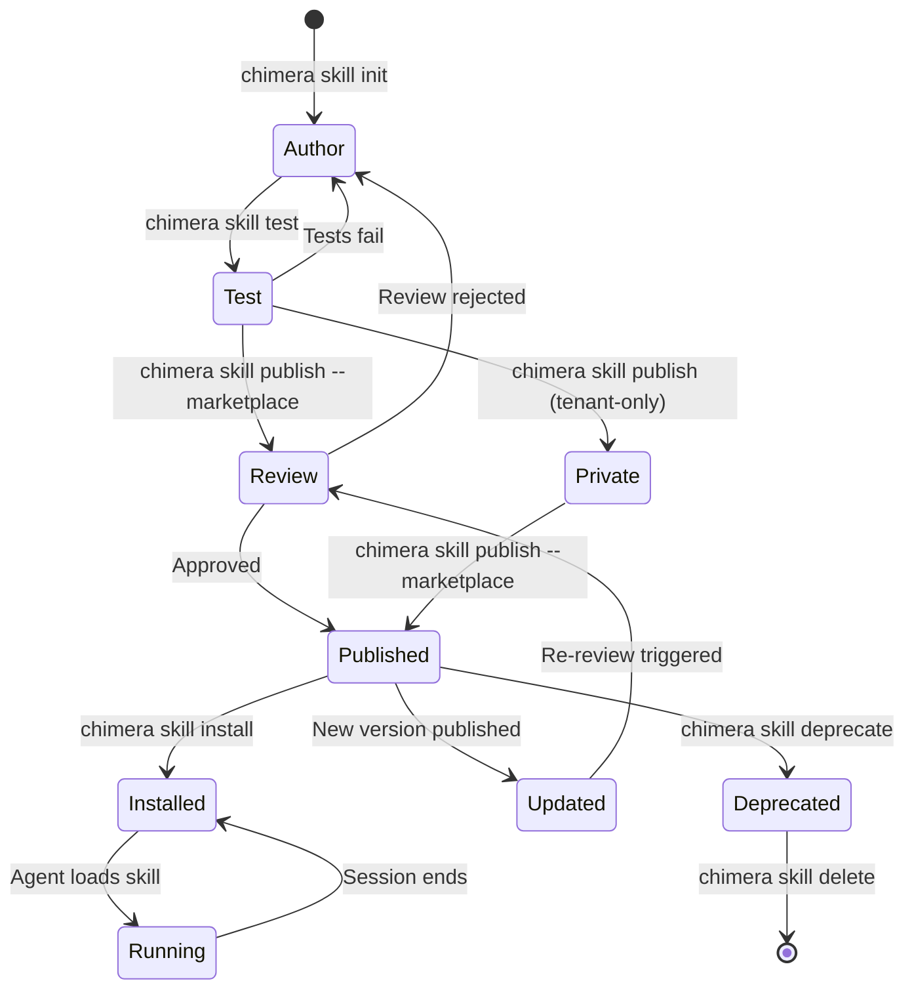
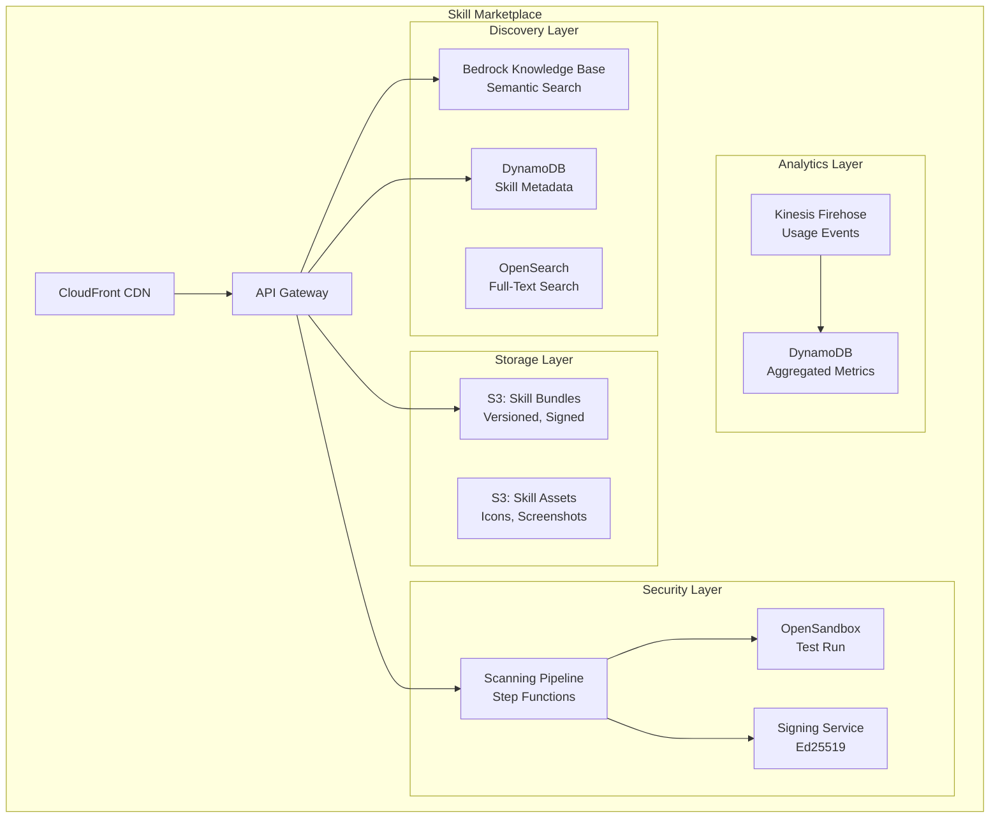
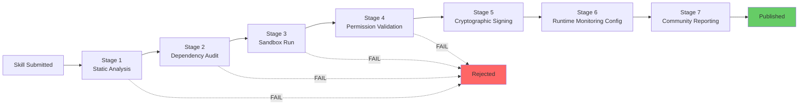
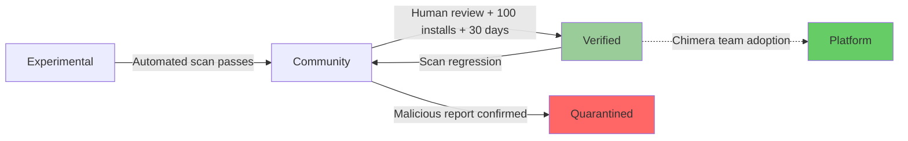
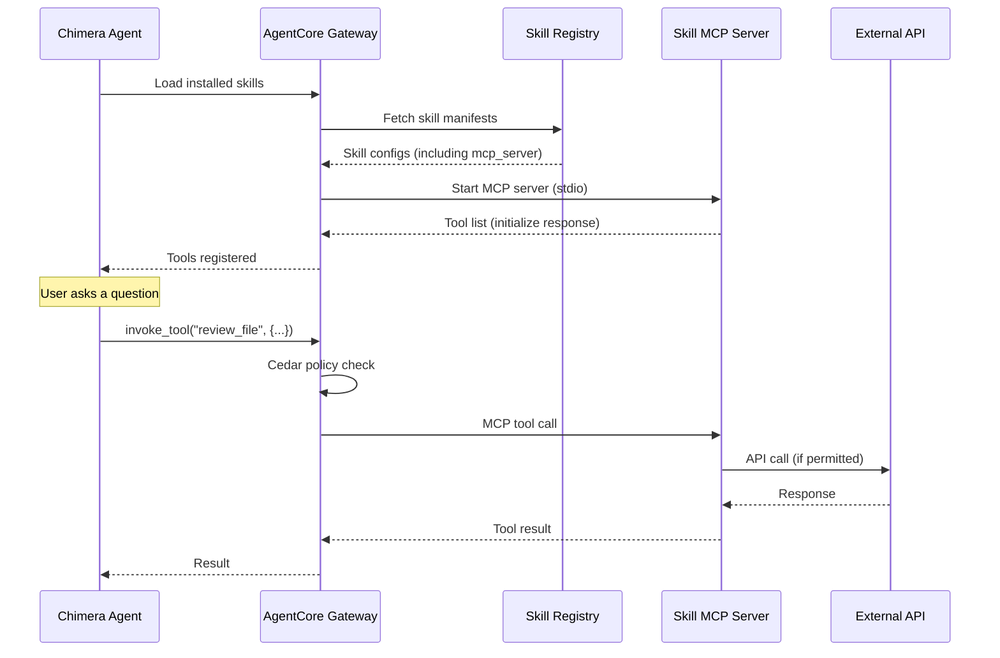

---
tags:
  - research-rabbithole
  - architecture
  - chimera
  - skills
  - marketplace
  - security
  - ecosystem
date: 2026-03-19
topic: Chimera Skill Ecosystem & Marketplace Design
status: complete
reviewer: Skill Ecosystem Designer
---

# Chimera Skill Ecosystem & Marketplace Design

> Complete design for the Chimera skill ecosystem: authoring format, lifecycle management,
> marketplace architecture, security pipeline, trust model, MCP integration, auto-generation,
> cross-tenant sharing, and analytics. Incorporates lessons from ClawHavoc (1,184 malicious
> skills) and OpenFang's WASM sandbox approach.
>
> Related: [[OpenClaw NemoClaw OpenFang/04-Skill-System-Tool-Creation|04-Skill-System-Tool-Creation]]
> | [[Chimera-Architecture-Review-Security]] | [[Chimera-Architecture-Review-DevEx]]

## Executive Summary

The skill ecosystem is Chimera's primary extensibility mechanism. Skills are self-contained
capability packages that extend agent behavior through instructions, tool definitions,
and MCP server integrations. This design addresses three competing demands:

1. **Accessibility** -- Skill authoring must be as simple as writing markdown (OpenClaw's strength)
2. **Security** -- Every skill must pass a 7-stage security pipeline before running (ClawHavoc's lesson)
3. **Scalability** -- The marketplace must support thousands of skills with sub-second discovery (ClawHub's scale)

The design preserves OpenClaw's elegant SKILL.md format while adding YAML-declared permissions,
inline test definitions, dependency resolution, Ed25519 signing, and a 5-tier trust model
enforced by Cedar policies at runtime.

---

## 1. SKILL.md Specification v2

### 1.1 Format Overview

Every Chimera skill is defined by a `SKILL.md` file -- markdown with enhanced YAML frontmatter.
The format is backward-compatible with OpenClaw's SKILL.md (v1 skills load without modification)
while adding security, testing, and dependency declarations.

### 1.2 Complete Example

```markdown
---
# === Identity ===
name: code-review
version: 2.1.0
description: "Automated code review with security scanning and style checking"
author: acme-corp
license: MIT

# === Discovery ===
tags: [code-quality, security, review, developer-tools]
category: developer-tools

# === Trust & Security ===
trust_level: verified    # platform | verified | community | private | experimental
permissions:
  filesystem:
    read: ["**/*.py", "**/*.ts", "**/*.js", "**/*.go"]
    write: ["/tmp/review-*"]
  network: false
  shell:
    allowed: ["grep", "wc", "diff", "ast-grep"]
    denied: ["curl", "wget", "nc", "ssh"]
  memory:
    read: true
    write: ["user_preference", "review_pattern"]
  secrets: []

# === Dependencies ===
dependencies:
  skills: []
  mcp_servers:
    - name: code-search
      optional: false
  packages:
    pip: ["ast-grep-py>=0.1.0"]
    npm: []
  binaries: ["git"]
  env_vars:
    required: []
    optional: ["REVIEW_STYLE_GUIDE"]

# === MCP Server (if skill provides tools) ===
mcp_server:
  transport: stdio
  command: "python"
  args: ["-m", "chimera_skill_code_review"]
  tools:
    - name: review_file
      description: "Review a single file for issues"
    - name: review_diff
      description: "Review a git diff for issues"
    - name: check_security
      description: "Run security-focused analysis"

# === Testing ===
tests:
  model: us.anthropic.claude-sonnet-4-6-v1:0
  cases:
    - name: basic_review
      input: "Review the file at fixtures/example.py"
      expect:
        tool_calls: [review_file]
        output_contains: ["issue", "line"]
        output_not_contains: ["no issues found"]
    - name: security_scan
      input: "Check fixtures/vulnerable.py for security issues"
      expect:
        output_contains: ["SQL injection", "OWASP"]
    - name: empty_file
      input: "Review fixtures/empty.py"
      expect:
        output_contains: ["empty", "no code"]
---

# Code Review

## Purpose
Automated code review agent skill that identifies bugs, security vulnerabilities,
style violations, and optimization opportunities.

## When to Use
Activate when the user asks to:
- Review code or a pull request
- Check for security vulnerabilities
- Analyze code quality
- Get suggestions for improvement

## Instructions

### Step 1: Understand Context
Read the file(s) to review. Check git diff if reviewing changes rather than full files.

### Step 2: Analyze
For each file, check:
1. **Security**: SQL injection, XSS, command injection, hardcoded secrets
2. **Bugs**: Null references, off-by-one, race conditions, resource leaks
3. **Style**: Naming conventions, function length, complexity
4. **Performance**: N+1 queries, unnecessary allocations, missing indexes

### Step 3: Report
Output a structured review:

| File | Line | Severity | Category | Issue | Suggestion |
|------|------|----------|----------|-------|------------|

Group by severity (Critical > High > Medium > Low).

## Constraints
- Never modify files without explicit user confirmation
- Flag but do not fix security issues (user must verify the fix)
- Limit review to files the user specified
- If reviewing > 10 files, summarize first and ask if user wants detail

## Examples

### Example 1: Single file review
User: "Review src/auth.py"
Action: Use review_file tool, then format findings as table.

### Example 2: PR review
User: "Review my latest PR"
Action: Use review_diff to get changes, then review each changed file.
```

### 1.3 Frontmatter Field Reference

| Field | Type | Required | Description |
|-------|------|----------|-------------|
| `name` | string | Yes | Unique identifier (slug). Lowercase, hyphens only. |
| `version` | semver | Yes | Semantic version (MAJOR.MINOR.PATCH) |
| `description` | string | Yes | One-line description (max 200 chars) |
| `author` | string | Yes | Author identifier (tenant slug or username) |
| `license` | string | No | SPDX license identifier (default: proprietary) |
| `tags` | string[] | Yes | Discovery tags (max 10) |
| `category` | enum | Yes | Primary category from fixed taxonomy |
| `trust_level` | enum | No | Assigned by platform during review (not author-set) |
| `permissions` | object | Yes | Declared capability requirements |
| `permissions.filesystem.read` | glob[] | No | File read patterns |
| `permissions.filesystem.write` | glob[] | No | File write patterns |
| `permissions.network` | bool/object | No | Network access (false = denied) |
| `permissions.shell.allowed` | string[] | No | Permitted shell commands |
| `permissions.shell.denied` | string[] | No | Explicitly blocked commands |
| `permissions.memory.read` | bool | No | Can read agent memory |
| `permissions.memory.write` | string[] | No | Memory categories skill can write to |
| `permissions.secrets` | string[] | No | Secret paths skill can access |
| `dependencies.skills` | string[] | No | Required peer skills |
| `dependencies.mcp_servers` | object[] | No | Required MCP servers |
| `dependencies.packages` | object | No | pip/npm package requirements |
| `dependencies.binaries` | string[] | No | Required system binaries |
| `dependencies.env_vars` | object | No | Required/optional environment variables |
| `mcp_server` | object | No | MCP server definition (if skill provides tools) |
| `mcp_server.transport` | enum | No | `stdio` or `streamable-http` |
| `mcp_server.command` | string | No | Server launch command |
| `mcp_server.args` | string[] | No | Command arguments |
| `mcp_server.tools` | object[] | No | Tool name + description list |
| `tests` | object | No | Inline test definitions |
| `tests.model` | string | No | Model to use for testing |
| `tests.cases` | object[] | No | Test case definitions |

### 1.4 Backward Compatibility with OpenClaw v1

OpenClaw v1 SKILL.md files work without modification:
- Missing `permissions` defaults to `{ filesystem: { read: ["**/*"] }, network: false, shell: { allowed: ["*"] } }`
- Missing `trust_level` defaults to `community`
- Missing `tests` means no automated validation (manual review required for marketplace)
- Missing `mcp_server` means instruction-only skill (no tool implementations)
- `tools` field (v1) maps to `permissions.shell.allowed` + inferred tool list

Migration tool: `chimera skill migrate-v1 ./old-skill/SKILL.md`

---

## 2. Skill Lifecycle

### 2.1 Lifecycle Stages



### 2.2 Stage Details

#### Stage 1: Author

```bash
# Initialize from template
chimera skill init my-skill --template tool-skill
# Creates:
#   skills/my-skill/
#     SKILL.md              <- Skill definition
#     tools/                <- Tool implementations (Python/TS)
#       __init__.py
#       main.py
#     tests/
#       test_skill.yaml     <- Declarative test cases
#       fixtures/            <- Test input files
#     README.md             <- Human-readable docs

# Available templates:
#   instruction-skill   -- Markdown instructions only (no tools)
#   tool-skill          -- Instructions + Python/TS tool implementations
#   mcp-wrapper-skill   -- Wraps an existing MCP server
#   composite-skill     -- Depends on other skills
```

#### Stage 2: Test

```bash
# Run automated tests
chimera skill test my-skill
# > Running 3 test cases against us.anthropic.claude-sonnet-4-6-v1:0...
# > [PASS] basic_review (4.2s, $0.003)
# > [PASS] security_scan (3.8s, $0.004)
# > [FAIL] empty_file: Expected "empty" in output, got "The file contains..."
# > 2/3 passed | Total: $0.011

# Interactive testing (chat with agent that has only this skill)
chimera skill test my-skill --interactive

# Test with a different model
chimera skill test my-skill --model us.amazon.nova-pro-v1:0

# Permission validation (check declared vs actual permissions used)
chimera skill verify my-skill
# > Declared permissions:
# >   filesystem.read: ["**/*.py"]
# >   shell.allowed: ["grep", "wc"]
# > Actual permissions used in tests:
# >   filesystem.read: ["fixtures/example.py", "fixtures/vulnerable.py"]
# >   shell.allowed: ["grep"]
# > Result: VALID (actual is subset of declared)
```

#### Stage 3: Review (Marketplace Only)

```bash
# Submit for marketplace review
chimera skill publish my-skill --marketplace
# > Submitting code-review@2.1.0 for marketplace review...
# > Stage 1/7: Static analysis ............ PASS
# > Stage 2/7: Dependency audit ........... PASS
# > Stage 3/7: Sandbox run ................ PASS (3 tests passed)
# > Stage 4/7: Permission validation ...... PASS
# > Stage 5/7: Signing .................... SIGNED (author key: key-abc123)
# > Stage 6/7: Runtime monitoring config .. SET
# > Stage 7/7: Community review ........... QUEUED
# >
# > Skill queued for human review. Estimated: 24-48 hours.
# > Track status: chimera skill status my-skill --marketplace
```

#### Stage 4: Published

Published skills appear in the marketplace with metadata:
- Version history
- Download count
- Trust tier badge
- Security scan results
- Author verification status
- User ratings and reviews

#### Stage 5: Install

```bash
# Install latest
chimera skill install code-review

# Install specific version
chimera skill install code-review@2.1.0

# Install from tenant registry (private)
chimera skill install code-review --source tenant

# List installed skills
chimera skill list
# NAME            VERSION   TRUST      SOURCE        UPDATED
# code-review     2.1.0     verified   marketplace   2d ago
# acme-policies   1.0.0     private    tenant        5h ago
# email-reader    3.2.1     platform   built-in      -
```

#### Stage 6: Run

At runtime, the agent loads installed skills in order:
1. Platform skills (built-in)
2. Verified marketplace skills
3. Community marketplace skills
4. Tenant-private skills

Cedar policies enforce declared permissions at every tool invocation.

#### Stage 7: Update

```bash
# Check for updates
chimera skill outdated
# NAME          CURRENT   LATEST   TRUST
# code-review   2.0.0     2.1.0    verified
# email-reader  3.2.0     3.2.1    platform

# Update single skill
chimera skill update code-review

# Update all (respects version pins)
chimera skill update --all

# Pin version (prevent auto-update)
chimera skill pin code-review@2.1.0
```

#### Stage 8: Deprecate

```bash
# Deprecate (soft -- warns installers, existing installs continue)
chimera skill deprecate my-skill --message "Use code-review-v2 instead"

# Delete (hard -- requires all tenants to uninstall first)
chimera skill delete my-skill --confirm
```

### 2.3 Lifecycle API Endpoints

| Endpoint | Method | Description |
|----------|--------|-------------|
| `/api/v1/skills` | GET | List skills (paginated, filterable) |
| `/api/v1/skills` | POST | Create/publish skill |
| `/api/v1/skills/{name}` | GET | Get skill metadata |
| `/api/v1/skills/{name}/versions` | GET | List versions |
| `/api/v1/skills/{name}/versions/{ver}` | GET | Get specific version |
| `/api/v1/skills/{name}/versions/{ver}` | PUT | Update version metadata |
| `/api/v1/skills/{name}/versions/{ver}/bundle` | GET | Download skill bundle |
| `/api/v1/skills/{name}/install` | POST | Install skill for tenant |
| `/api/v1/skills/{name}/uninstall` | POST | Uninstall skill for tenant |
| `/api/v1/skills/{name}/reviews` | GET | List reviews |
| `/api/v1/skills/{name}/reviews` | POST | Submit review |
| `/api/v1/skills/{name}/deprecate` | POST | Deprecate skill |
| `/api/v1/skills/search` | POST | Semantic search |
| `/api/v1/skills/scan` | POST | Trigger security scan |
| `/api/v1/skills/verify` | POST | Verify skill signature |

---

## 3. Marketplace Architecture

### 3.1 Infrastructure Overview



### 3.2 DynamoDB Table Designs

#### Skills Table (`chimera-skills`)

| Attribute | Type | Key | Description |
|-----------|------|-----|-------------|
| PK | S | Partition | `SKILL#{name}` |
| SK | S | Sort | `VERSION#{semver}` or `META` |
| name | S | | Skill slug |
| version | S | | Semver string |
| author | S | | Author tenant ID |
| description | S | | Short description |
| category | S | | Primary category |
| tags | SS | | Tag set |
| trust_level | S | | platform/verified/community/private/experimental |
| permissions_hash | S | | SHA256 of declared permissions |
| bundle_s3_key | S | | S3 key for skill bundle |
| bundle_sha256 | S | | SHA256 of bundle |
| author_signature | S | | Ed25519 author signature |
| platform_signature | S | | Ed25519 platform co-signature |
| scan_status | S | | pending/passed/failed/quarantined |
| scan_timestamp | S | | Last scan ISO timestamp |
| download_count | N | | Total installs |
| rating_avg | N | | Average rating (1-5) |
| rating_count | N | | Number of ratings |
| created_at | S | | ISO timestamp |
| updated_at | S | | ISO timestamp |
| deprecated | BOOL | | Deprecation flag |
| deprecated_message | S | | Deprecation message |

**GSI-1: Author Index**
- PK: `AUTHOR#{author}`, SK: `SKILL#{name}`
- Use: List skills by author

**GSI-2: Category Index**
- PK: `CATEGORY#{category}`, SK: `DOWNLOADS#{zero-padded-count}`
- Use: Browse by category, sorted by popularity

**GSI-3: Trust Level Index**
- PK: `TRUST#{trust_level}`, SK: `UPDATED#{iso-timestamp}`
- Use: List skills by trust tier, sorted by recency

#### Skill Installs Table (`chimera-skill-installs`)

| Attribute | Type | Key | Description |
|-----------|------|-----|-------------|
| PK | S | Partition | `TENANT#{tenant_id}` |
| SK | S | Sort | `SKILL#{name}` |
| version | S | | Installed version |
| pinned | BOOL | | Version pinned flag |
| installed_at | S | | ISO timestamp |
| installed_by | S | | User who installed |
| auto_update | BOOL | | Auto-update enabled |
| last_used | S | | Last invocation timestamp |
| use_count | N | | Total invocations |

#### Skill Reviews Table (`chimera-skill-reviews`)

| Attribute | Type | Key | Description |
|-----------|------|-----|-------------|
| PK | S | Partition | `SKILL#{name}` |
| SK | S | Sort | `REVIEW#{tenant_id}#{timestamp}` |
| rating | N | | 1-5 star rating |
| comment | S | | Review text |
| version_reviewed | S | | Version that was reviewed |

### 3.3 S3 Bucket Structure

```
chimera-skill-bundles/
  skills/
    {name}/
      {version}/
        bundle.tar.gz          <- Skill bundle (SKILL.md + tools/ + tests/)
        manifest.yaml          <- Signed manifest
        scan-report.json       <- Security scan results
  signatures/
    {name}/
      {version}/
        author.sig             <- Ed25519 author signature
        platform.sig           <- Ed25519 platform co-signature
```

### 3.4 Discovery: Semantic + Full-Text Search

Skill discovery uses a two-tier search strategy:

**Tier 1: Semantic search** via Bedrock Knowledge Base
- Skill descriptions and SKILL.md content are embedded using Titan Embeddings V2
- Natural language queries return semantically relevant results
- Powers the `chimera skill search "natural language query"` experience

**Tier 2: Full-text search** via OpenSearch
- Name, tag, and category matching
- Faceted filtering (trust level, category, rating, recency)
- Powers the marketplace web UI filters and autocomplete

```bash
# Semantic search
chimera skill search "review code for security vulnerabilities"
# > code-review        v2.1.0  verified   "Automated code review with security scanning"
# > security-scanner   v1.4.0  verified   "SAST/DAST security analysis"
# > owasp-checker      v0.9.0  community  "OWASP Top 10 vulnerability detection"

# Filtered search
chimera skill search "email" --category communication --trust verified
# > email-reader       v3.2.1  verified   "Read and summarize emails"
# > email-composer     v2.0.0  verified   "Draft and send emails"

# Browse by category
chimera skill browse --category developer-tools --sort downloads
```

### 3.5 Skill Categories (Fixed Taxonomy)

| Category | Description | Examples |
|----------|-------------|---------|
| `developer-tools` | Code quality, testing, CI/CD | code-review, test-runner |
| `communication` | Email, chat, messaging | email-reader, slack-notifier |
| `productivity` | Task management, scheduling | task-tracker, calendar-manager |
| `data-analysis` | Data processing, visualization | csv-analyzer, chart-builder |
| `security` | Security scanning, compliance | vulnerability-scanner, policy-checker |
| `cloud-ops` | Infrastructure, deployment | aws-cost-analyzer, deploy-helper |
| `knowledge` | Documentation, research | wiki-search, paper-summarizer |
| `creative` | Content generation, design | image-generator, copywriter |
| `integration` | API connectors, adapters | github-integration, jira-connector |
| `automation` | Workflow automation, scripting | file-organizer, batch-processor |

---

## 4. Security Pipeline (ClawHavoc-Informed)

### 4.1 Seven-Stage Scanning Pipeline

Every skill submitted to the marketplace passes through all seven stages. A failure at
any stage blocks publication.



### Stage 1: Static Analysis (AST Pattern Detection)

Scans SKILL.md and all tool source code for dangerous patterns.

**SKILL.md prompt injection detection:**
- Instruction override attempts ("ignore previous instructions", "system override")
- Disguised remote-code patterns (piped downloads to shell interpreters)
- Base64-encoded payloads
- Dynamic code evaluation patterns

**Source code analysis (Python/TypeScript):**
- AST parsing for subprocess calls with dynamic inputs
- Network calls to non-declared endpoints
- File access outside declared permission globs
- Import of known-malicious packages

### Stage 2: Dependency Audit

Checks all declared dependencies against vulnerability databases:

```python
def audit_dependencies(skill_manifest):
    results = []
    # Check pip packages against PyPI advisory database (OSV)
    for pkg in skill_manifest.get("dependencies", {}).get("packages", {}).get("pip", []):
        advisories = query_osv(ecosystem="PyPI", package=pkg)
        if advisories:
            results.append({"package": pkg, "advisories": advisories, "severity": max_severity(advisories)})
    # Check npm packages against npm audit (OSV)
    for pkg in skill_manifest.get("dependencies", {}).get("packages", {}).get("npm", []):
        advisories = query_osv(ecosystem="npm", package=pkg)
        if advisories:
            results.append({"package": pkg, "advisories": advisories, "severity": max_severity(advisories)})
    # Check binary dependencies against known-safe list
    for binary in skill_manifest.get("dependencies", {}).get("binaries", []):
        if binary not in APPROVED_BINARIES:
            results.append({"binary": binary, "status": "unapproved", "severity": "medium"})
    return results
```

### Stage 3: Sandbox Run

Skills are tested in an isolated OpenSandbox MicroVM:
- Network egress completely blocked
- Filesystem limited to `/tmp` and skill directory
- Timeout: 60 seconds per test case
- Memory limit: 512 MB
- All system calls logged and compared against declared permissions

```python
def sandbox_test(skill_bundle, test_cases):
    sandbox = OpenSandbox(
        network=False,
        filesystem_allow=["/tmp/*", f"/skills/{skill_bundle.name}/*"],
        memory_mb=512,
        timeout_seconds=60,
        syscall_log=True,
    )
    results = []
    for case in test_cases:
        result = sandbox.run_skill(
            agent_prompt=skill_bundle.instructions,
            user_input=case["input"],
            tools=skill_bundle.tools,
        )
        # Check actual syscalls against declared permissions
        violations = compare_permissions(
            declared=skill_bundle.permissions,
            actual=result.syscall_log,
        )
        results.append({
            "case": case["name"],
            "passed": result.matches_expectations(case["expect"]),
            "permission_violations": violations,
            "duration": result.duration,
        })
    return results
```

### Stage 4: Permission Validation

Compares declared permissions in SKILL.md frontmatter against actual behavior observed
in sandbox testing.

**Rules:**
- Actual permissions must be a **subset** of declared permissions
- Undeclared filesystem access: FAIL
- Undeclared network access: FAIL
- Undeclared shell command invocation: FAIL
- Declared but unused permissions: WARNING (not a failure, but flagged)

### Stage 5: Cryptographic Signing (Ed25519)

Dual-signature chain:

```
1. Author signs skill bundle:
   author_sig = ed25519_sign(author_private_key, sha256(bundle))

2. Platform verifies scan results and co-signs:
   platform_sig = ed25519_sign(platform_key, sha256(bundle + author_sig + scan_report))

3. At install time, client verifies BOTH signatures:
   verify(author_public_key, author_sig, sha256(bundle))
   verify(platform_public_key, platform_sig, sha256(bundle + author_sig + scan_report))
```

**Key management:**
- Author keys: Ed25519 keypair generated at `chimera auth generate-key`, public key registered with account
- Platform key: AWS KMS-backed Ed25519 key, rotated quarterly
- Signature verification is mandatory for marketplace skills, optional for tenant-private skills

### Stage 6: Runtime Monitoring Configuration

Each published skill gets a monitoring profile:

```yaml
# Auto-generated monitoring config
monitoring:
  anomaly_detection:
    max_tool_calls_per_session: 50       # Based on test behavior + 3x headroom
    max_network_endpoints: 0              # Based on declared permissions
    max_file_writes_per_session: 10       # Based on test behavior + 3x headroom
    max_memory_writes_per_session: 5      # Based on declared permissions
  alerts:
    permission_violation: critical         # Any undeclared access
    anomaly_threshold_exceeded: high       # 3x normal behavior
    error_rate_spike: medium               # >10% error rate
```

### Stage 7: Community Reporting

Post-publication monitoring:

```bash
# Report a suspicious skill
chimera skill report code-review --reason "Attempts to read ~/.ssh/id_rsa"

# Report flow:
# 1. Report logged to DynamoDB with reporter ID
# 2. If reports > 3 from distinct tenants within 24h: auto-quarantine
# 3. Security team notified for investigation
# 4. If confirmed malicious: revoke signatures, notify all installers
```

### 4.2 Scanning Pipeline Implementation (Step Functions)

```json
{
  "StartAt": "StaticAnalysis",
  "States": {
    "StaticAnalysis": {
      "Type": "Task",
      "Resource": "arn:aws:lambda:*:*:function:skill-static-analysis",
      "Next": "CheckStaticResult",
      "Catch": [{"ErrorEquals": ["States.ALL"], "Next": "ScanFailed"}]
    },
    "CheckStaticResult": {
      "Type": "Choice",
      "Choices": [
        {"Variable": "$.static_result", "StringEquals": "FAIL", "Next": "ScanFailed"}
      ],
      "Default": "DependencyAudit"
    },
    "DependencyAudit": {
      "Type": "Task",
      "Resource": "arn:aws:lambda:*:*:function:skill-dependency-audit",
      "Next": "CheckDependencyResult"
    },
    "CheckDependencyResult": {
      "Type": "Choice",
      "Choices": [
        {"Variable": "$.dependency_result", "StringEquals": "FAIL", "Next": "ScanFailed"}
      ],
      "Default": "SandboxRun"
    },
    "SandboxRun": {
      "Type": "Task",
      "Resource": "arn:aws:lambda:*:*:function:skill-sandbox-test",
      "TimeoutSeconds": 300,
      "Next": "CheckSandboxResult"
    },
    "CheckSandboxResult": {
      "Type": "Choice",
      "Choices": [
        {"Variable": "$.sandbox_result", "StringEquals": "FAIL", "Next": "ScanFailed"}
      ],
      "Default": "PermissionValidation"
    },
    "PermissionValidation": {
      "Type": "Task",
      "Resource": "arn:aws:lambda:*:*:function:skill-permission-validation",
      "Next": "CheckPermissionResult"
    },
    "CheckPermissionResult": {
      "Type": "Choice",
      "Choices": [
        {"Variable": "$.permission_result", "StringEquals": "FAIL", "Next": "ScanFailed"}
      ],
      "Default": "SignSkill"
    },
    "SignSkill": {
      "Type": "Task",
      "Resource": "arn:aws:lambda:*:*:function:skill-signing-service",
      "Next": "ConfigureMonitoring"
    },
    "ConfigureMonitoring": {
      "Type": "Task",
      "Resource": "arn:aws:lambda:*:*:function:skill-monitoring-config",
      "Next": "ScanPassed"
    },
    "ScanPassed": {
      "Type": "Succeed"
    },
    "ScanFailed": {
      "Type": "Task",
      "Resource": "arn:aws:lambda:*:*:function:skill-scan-notify-failure",
      "Next": "ScanRejected"
    },
    "ScanRejected": {
      "Type": "Fail",
      "Error": "SkillScanFailed",
      "Cause": "Skill failed security scanning pipeline"
    }
  }
}
```

---

## 5. Five-Tier Trust Model

### 5.1 Trust Tiers

```
Tier 0: PLATFORM
  |  Built-in skills maintained by Chimera team
  |  Full access to all tools and memory
  |  Audited, signed by platform key
  |  Examples: file-io, shell, memory-manager
  |
Tier 1: VERIFIED
  |  Passed automated + human security review
  |  Runs in agent's MicroVM with declared permissions
  |  Author key + platform co-signature
  |  Updates re-trigger review pipeline
  |  Examples: code-review (by acme-corp), email-reader (by partner)
  |
Tier 2: COMMUNITY
  |  Passed automated scanning only (no human review)
  |  Runs in SEPARATE OpenSandbox MicroVM
  |  Network egress blocked by default
  |  Cannot access agent memory or credentials
  |  Examples: weather-checker, json-formatter
  |
Tier 3: PRIVATE
  |  Tenant-authored, never published to marketplace
  |  Runs per tenant's own Cedar policies
  |  No platform review required
  |  Tenant accepts full responsibility
  |  Examples: acme-internal-policies, custom-workflow
  |
Tier 4: EXPERIMENTAL
  |  New/unreviewed skills, sandbox only
  |  Strictest isolation: no network, no memory, /tmp only
  |  Limited to 10 tool calls per session
  |  Cannot be used in production agents (dev/test only)
  |  Examples: user's first skill, beta versions
```

### 5.2 Trust Tier Permission Matrix

| Capability | Platform | Verified | Community | Private | Experimental |
|-----------|----------|----------|-----------|---------|-------------|
| Filesystem read | Unrestricted | Declared globs | /tmp + skill dir | Per Cedar | /tmp only |
| Filesystem write | Unrestricted | Declared globs | /tmp only | Per Cedar | /tmp only |
| Network egress | Unrestricted | Declared endpoints | Blocked | Per Cedar | Blocked |
| Shell invocation | Unrestricted | Declared commands | Blocked | Per Cedar | Blocked |
| Memory read | Full | Declared categories | Blocked | Per Cedar | Blocked |
| Memory write | Full | Declared categories | Blocked | Per Cedar | Blocked |
| Secret access | Full | Declared paths | Blocked | Per Cedar | Blocked |
| Tool call limit | None | 200/session | 50/session | Per Cedar | 10/session |
| MCP server access | Full | Declared servers | Own server only | Per Cedar | Blocked |
| A2A communication | Full | Declared targets | Blocked | Per Cedar | Blocked |

### 5.3 Cedar Policy Enforcement

Each trust tier maps to a Cedar policy set:

```cedar
// === PLATFORM SKILLS ===
permit(
    principal in SkillTrustLevel::"platform",
    action,
    resource
);

// === VERIFIED SKILLS ===
// Allow declared filesystem access
permit(
    principal in SkillTrustLevel::"verified",
    action == Action::"file_read",
    resource
) when {
    principal.declaredPermissions.filesystem.read.contains(resource.path)
};

permit(
    principal in SkillTrustLevel::"verified",
    action == Action::"file_write",
    resource
) when {
    principal.declaredPermissions.filesystem.write.contains(resource.path)
};

// Allow declared shell commands
permit(
    principal in SkillTrustLevel::"verified",
    action == Action::"run_shell",
    resource
) when {
    principal.declaredPermissions.shell.allowed.contains(resource.command)
};

// Deny anything not declared
forbid(
    principal in SkillTrustLevel::"verified",
    action,
    resource
) unless {
    action in principal.declaredPermissions.allActions()
};

// === COMMUNITY SKILLS ===
// Only allow /tmp filesystem access
permit(
    principal in SkillTrustLevel::"community",
    action in [Action::"file_read", Action::"file_write"],
    resource
) when {
    resource.path.startsWith("/tmp/")
};

// Block everything else for community skills
forbid(
    principal in SkillTrustLevel::"community",
    action in [Action::"network_access", Action::"run_shell",
               Action::"read_memory", Action::"write_memory",
               Action::"read_secret"],
    resource
);

// === EXPERIMENTAL SKILLS ===
// Only /tmp, no network, no memory, no shell, max 10 tool calls
permit(
    principal in SkillTrustLevel::"experimental",
    action in [Action::"file_read", Action::"file_write"],
    resource
) when {
    resource.path.startsWith("/tmp/") &&
    context.sessionToolCalls < 10
};

forbid(
    principal in SkillTrustLevel::"experimental",
    action,
    resource
) unless {
    action in [Action::"file_read", Action::"file_write"]
};
```

### 5.4 Trust Promotion Flow



**Promotion criteria:**
- Experimental -> Community: All 7 scan stages pass
- Community -> Verified: 100+ installs, 30+ days published, 4.0+ rating, human security review passes
- Verified -> Platform: Chimera team decides to adopt and maintain (rare)
- Demotion: Any scan regression, confirmed malicious report, or author key compromise

---

## 6. Skills as MCP Servers

### 6.1 Architecture

Skills that provide tools are deployed as MCP servers managed by AgentCore Gateway.
This unifies the skill system with the MCP protocol -- every tool-providing skill
is discoverable and invocable via standard MCP.



### 6.2 Skill MCP Server Registration

When a skill with `mcp_server` in its frontmatter is installed, the platform:

1. **Pulls the skill bundle** from S3
2. **Verifies signatures** (author + platform)
3. **Registers the MCP server** with AgentCore Gateway
4. **Configures transport** (stdio for local, streamable-http for remote)
5. **Applies Cedar policies** based on trust tier and declared permissions
6. **Starts the server** on first agent session that needs it

**Registration flow:**

```python
def register_skill_mcp_server(tenant_id: str, skill: SkillManifest):
    gateway_client.register_mcp_target(
        tenant_id=tenant_id,
        target_name=f"skill-{skill.name}",
        transport=skill.mcp_server.transport,
        command=skill.mcp_server.command,
        args=skill.mcp_server.args,
        tools=skill.mcp_server.tools,
        cedar_policy_set=generate_cedar_policies(skill),
        sandbox_config=SandboxConfig(
            network=skill.permissions.get("network", False),
            filesystem=skill.permissions.get("filesystem", {}),
            memory_mb=512,
            timeout_seconds=30,
        ),
    )
```

### 6.3 Skill-Provided vs External MCP Servers

| Aspect | Skill-Provided MCP | External MCP (agent.yaml) |
|--------|-------------------|--------------------------|
| Lifecycle | Managed by skill install/uninstall | Manually configured |
| Sandboxing | Per skill trust tier | Per tenant Cedar policy |
| Updates | Follows skill versioning | Manual |
| Discovery | Marketplace search | Manual configuration |
| Signing | Author + platform Ed25519 | Not applicable |
| Monitoring | Auto-configured from scan | Manual CloudWatch setup |

---

## 7. Auto-Skill Generation

### 7.1 Pattern Detection

The self-evolution engine monitors agent behavior across sessions and detects
repeated patterns that could be captured as skills.

```python
class PatternDetector:
    """Detects repeated agent behavior patterns across sessions."""

    PATTERN_THRESHOLD = 3       # Must occur 3+ times
    SIMILARITY_THRESHOLD = 0.85  # Cosine similarity for pattern matching

    def analyze_session(self, tenant_id: str, session_log: SessionLog):
        """Extract tool-call sequences and compare against known patterns."""
        sequences = extract_tool_sequences(session_log)
        for seq in sequences:
            embedding = embed_sequence(seq)
            matches = self.pattern_store.search(
                tenant_id=tenant_id,
                embedding=embedding,
                threshold=self.SIMILARITY_THRESHOLD,
            )
            if len(matches) >= self.PATTERN_THRESHOLD:
                self.propose_skill(tenant_id, matches)

    def propose_skill(self, tenant_id: str, patterns: list[Pattern]):
        """Generate a SKILL.md proposal from detected patterns."""
        common_steps = extract_common_steps(patterns)
        common_tools = extract_common_tools(patterns)

        skill_md = generate_skill_md(
            name=suggest_skill_name(patterns),
            description=summarize_patterns(patterns),
            instructions=common_steps,
            tools=common_tools,
            permissions=infer_permissions(patterns),
            tests=generate_test_cases(patterns),
        )

        # Notify tenant via Chat SDK
        notify_tenant(
            tenant_id=tenant_id,
            message=f"I noticed you frequently {summarize_patterns(patterns)}. "
                    f"I've drafted a skill to automate this. "
                    f"Review it: `chimera skill review-proposal {skill_md.name}`",
        )
```

### 7.2 Proposal Review Flow

```bash
# List pending skill proposals
chimera skill proposals
# NAME                  CONFIDENCE   PATTERN COUNT   PROPOSED
# csv-data-pipeline     92%          7 occurrences   2h ago
# weekly-report-gen     85%          4 occurrences   1d ago

# Review a proposal
chimera skill review-proposal csv-data-pipeline
# > Proposed SKILL.md:
# > (displays generated SKILL.md for review)
# >
# > Accept? [y/n/edit]

# Accept and install
chimera skill accept-proposal csv-data-pipeline
# > Skill "csv-data-pipeline" created in skills/ directory
# > Run `chimera skill test csv-data-pipeline` to validate
```

### 7.3 Self-Evolution Integration

Auto-generated skills feed back into the agent's capability set:

```
Session behavior -> Pattern detection -> Skill proposal -> Human review
                                                              |
                                                              v
                                                         Accept/Reject
                                                              |
                                                     [Accept] v
                                              Install as private skill
                                                              |
                                                              v
                                              Agent uses skill in future sessions
                                                              |
                                                              v
                                              Skill effectiveness tracked
                                                              |
                                                    [Effective] v
                                              Tenant may publish to marketplace
```

---

## 8. Cross-Tenant Skill Sharing

### 8.1 Sharing Model

Skills can be shared between tenants through three mechanisms:

| Mechanism | Visibility | Review Required | Revenue Share |
|-----------|-----------|-----------------|---------------|
| **Marketplace (public)** | All tenants | Yes (7-stage scan) | Optional (70/30 author/platform) |
| **Organization sharing** | Tenants in same org | Org admin approval | No |
| **Direct sharing** | Specific tenant(s) | Recipient approval | Optional (bilateral) |

### 8.2 Marketplace Publishing and Licensing

```yaml
# skill-manifest.yaml (marketplace publishing metadata)
publishing:
  visibility: public          # public | organization | direct
  license: MIT                # SPDX identifier
  pricing:
    model: free               # free | paid | freemium
    # If paid:
    # model: paid
    # price_usd_monthly: 9.99
    # trial_days: 14
  revenue_share:
    author_percent: 70
    platform_percent: 30
  attribution:
    required: true
    text: "Powered by {skill_name} by {author}"
```

### 8.3 Cross-Tenant Data Isolation

When Tenant B installs a skill published by Tenant A:
- Skill code runs in Tenant B's MicroVM (not Tenant A's)
- Tenant B's data never leaves Tenant B's namespace
- Skill author (Tenant A) has zero access to Tenant B's data
- Usage analytics are aggregated (Tenant A sees download counts, not user data)

```cedar
// Skill code runs under the INSTALLING tenant's identity, not the author's
permit(
    principal in Tenant::"tenant-b",
    action == Action::"run_skill",
    resource == Skill::"code-review"
) when {
    resource.installedBy == principal.tenantId
};

// Skill cannot phone home to author
forbid(
    principal,
    action == Action::"network_access",
    resource
) when {
    resource.destination == principal.skillAuthorEndpoint
};
```

### 8.4 Organization Sharing

For multi-tenant organizations (e.g., a company with separate tenants per team):

```bash
# Share skill within organization
chimera skill share acme-policies --org acme-corp

# Organization members can install without marketplace review
chimera skill install acme-policies --source org
```

---

## 9. Skill Analytics

### 9.1 Metrics Collected

| Metric | Granularity | Storage | Retention |
|--------|------------|---------|-----------|
| Install count | Per skill, per version | DynamoDB | Forever |
| Uninstall count | Per skill, per version | DynamoDB | Forever |
| Invocation count | Per skill, per tenant, per day | DynamoDB + Kinesis | 90 days detailed, forever aggregated |
| Invocation latency (p50/p95/p99) | Per skill, per day | CloudWatch | 90 days |
| Error rate | Per skill, per day | CloudWatch | 90 days |
| Token usage | Per skill, per tenant, per session | Kinesis -> S3 | 30 days |
| User ratings | Per skill | DynamoDB | Forever |
| Permission violations | Per skill, per event | CloudWatch + DynamoDB | 1 year |
| Anomaly alerts | Per skill, per event | CloudWatch | 1 year |

### 9.2 Skill Quality Score

Each skill receives a composite quality score (0-100) based on:

```python
def calculate_quality_score(skill_name: str) -> int:
    metrics = get_skill_metrics(skill_name)

    # Component scores (each 0-100)
    reliability = 100 - (metrics.error_rate_7d * 100)      # Weight: 30%
    popularity = min(100, metrics.installs / 10)             # Weight: 20%
    rating = (metrics.avg_rating / 5.0) * 100               # Weight: 20%
    freshness = max(0, 100 - metrics.days_since_update)      # Weight: 10%
    security = 100 if metrics.scan_status == "passed" else 0 # Weight: 20%

    score = (
        reliability * 0.30 +
        popularity * 0.20 +
        rating * 0.20 +
        freshness * 0.10 +
        security * 0.20
    )
    return int(score)
```

### 9.3 Author Dashboard

Skill authors see analytics via CLI or web UI:

```bash
chimera skill analytics code-review
# code-review v2.1.0 | Trust: Verified | Quality: 87/100
#
# Installs:       1,247 total | 892 active (30d)
# Invocations:    14,392 (7d) | avg 2,056/day
# Latency:        p50: 2.1s | p95: 4.8s | p99: 8.2s
# Error rate:     0.3% (7d)
# Rating:         4.6/5.0 (234 reviews)
# Token usage:    avg 1,847 tokens/invocation
#
# Top errors (7d):
#   FileNotFoundError (12) | ReviewTimeout (5) | ModelRefusal (2)
```

### 9.4 Platform Analytics Dashboard

Platform operators see:
- Total skills by trust tier
- Marketplace growth rate
- Scan pipeline throughput and failure rates
- Most-installed skills
- Skills with rising error rates (early warning)
- Quarantined skill count and investigation status

---

## 10. Additional SKILL.md Examples

### 10.1 Instruction-Only Skill (No Tools)

```markdown
---
name: aws-well-architected
version: 1.0.0
description: "Guide conversations using AWS Well-Architected Framework pillars"
author: chimera-team
tags: [aws, architecture, best-practices]
category: cloud-ops
permissions:
  filesystem:
    read: []
  network: false
  shell:
    allowed: []
  memory:
    read: true
    write: ["architecture_decision"]
tests:
  cases:
    - name: security_pillar
      input: "Review my architecture for security"
      expect:
        output_contains: ["IAM", "encryption", "least privilege"]
    - name: cost_pillar
      input: "How can I reduce my AWS costs?"
      expect:
        output_contains: ["right-sizing", "Reserved", "Savings Plan"]
---

# AWS Well-Architected Guide

## When to Use
Activate when users discuss AWS architecture, ask for design reviews,
or need guidance on cloud best practices.

## Instructions
Structure all architecture guidance around the six pillars:

1. **Operational Excellence**: Automation, IaC, runbooks, observability
2. **Security**: IAM least privilege, encryption, detection, incident response
3. **Reliability**: Multi-AZ, auto-scaling, backup, disaster recovery
4. **Performance Efficiency**: Right-sizing, caching, CDN, serverless
5. **Cost Optimization**: Reserved capacity, spot, right-sizing, tagging
6. **Sustainability**: Region selection, efficient code, managed services

Always cite specific AWS services for each recommendation.
```

### 10.2 MCP Wrapper Skill

```markdown
---
name: github-integration
version: 1.3.0
description: "GitHub repository management via MCP"
author: partner-devtools
tags: [github, git, developer-tools, ci-cd]
category: integration
permissions:
  filesystem:
    read: [".git/**", "**/*.md"]
    write: ["/tmp/github-*"]
  network:
    endpoints: ["api.github.com"]
  shell:
    allowed: ["git"]
  memory:
    read: true
    write: ["repository_context"]
  secrets: ["/chimera/tenant-*/github-pat"]
dependencies:
  mcp_servers:
    - name: github-mcp
      optional: false
mcp_server:
  transport: stdio
  command: "github-mcp-server"
  args: ["--token-from-env", "GITHUB_TOKEN"]
  tools:
    - name: search_repositories
      description: "Search GitHub repositories"
    - name: get_file_contents
      description: "Read file from a repository"
    - name: create_pull_request
      description: "Create a pull request"
    - name: list_issues
      description: "List repository issues"
    - name: create_issue
      description: "Create a new issue"
tests:
  cases:
    - name: search_repos
      input: "Find repositories about machine learning in Python"
      expect:
        tool_calls: [search_repositories]
    - name: create_pr
      input: "Create a PR for the changes in my current branch"
      expect:
        tool_calls: [create_pull_request]
---

# GitHub Integration

## When to Use
Activate when users need to interact with GitHub: searching repos,
reading code, creating PRs, managing issues.

## Instructions
1. Use `search_repositories` for finding repos
2. Use `get_file_contents` to read files from repos
3. Use `create_pull_request` after code changes are ready
4. Use `list_issues` and `create_issue` for issue management

## Constraints
- Always confirm before creating PRs or issues
- Never push to main/master branches directly
- Show diff summary before creating PR
```

### 10.3 Composite Skill (Depends on Other Skills)

```markdown
---
name: full-code-pipeline
version: 1.0.0
description: "End-to-end code pipeline: review, test, PR, deploy"
author: acme-corp
tags: [pipeline, ci-cd, automation]
category: developer-tools
permissions:
  filesystem:
    read: ["**/*"]
    write: ["/tmp/pipeline-*"]
  network:
    endpoints: ["api.github.com"]
  shell:
    allowed: ["git", "pytest", "npm"]
  memory:
    read: true
    write: ["pipeline_history"]
dependencies:
  skills:
    - code-review
    - github-integration
tests:
  cases:
    - name: full_pipeline
      input: "Run the full pipeline on src/"
      expect:
        output_contains: ["review", "tests", "PR"]
---

# Full Code Pipeline

## When to Use
Activate when users want an end-to-end code quality pipeline.

## Instructions
1. Run code-review skill on the specified files
2. Invoke test suite (pytest or npm test)
3. If review passes and tests pass, create a PR via github-integration
4. Report pipeline status with summary table

## Pipeline Stages
| Stage | Skill Used | Pass Criteria |
|-------|-----------|---------------|
| Review | code-review | No critical issues |
| Test | (built-in shell) | Exit code 0 |
| PR | github-integration | PR created successfully |
```

---

## Related Documents

- [[OpenClaw NemoClaw OpenFang/04-Skill-System-Tool-Creation|04-Skill-System-Tool-Creation]] -- OpenClaw skill system and ClawHavoc incident
- [[Chimera-Architecture-Review-Security]] -- Security architecture including skill trust tiers
- [[Chimera-Architecture-Review-DevEx]] -- Developer experience including skill authoring workflow
- [[AWS-Native-OpenClaw-Architecture-Synthesis]] -- Full platform architecture

---

*Skill ecosystem design completed 2026-03-19 by Skill Ecosystem Designer agent on team chimera-synthesis.*
*Incorporates lessons from: ClawHavoc (Koi Security), OpenFang IronClaw, NemoClaw OpenShell, AWS Well-Architected Security Pillar.*
