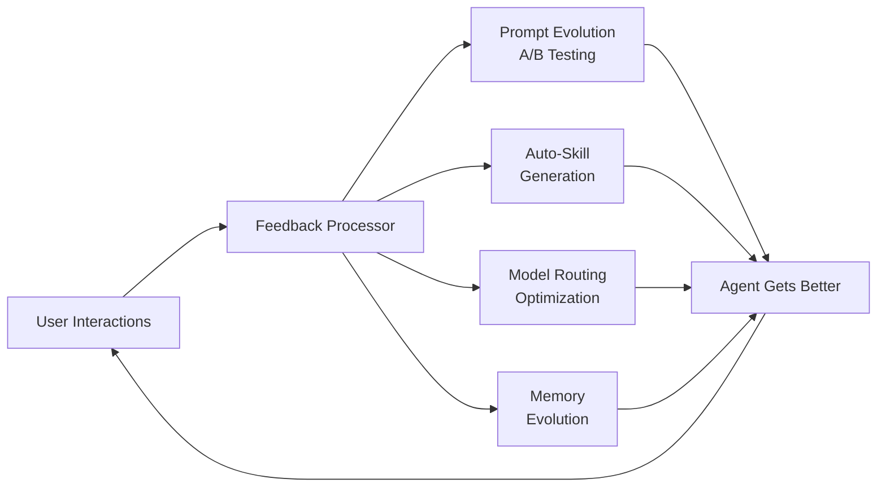

---
tags:
  - research-rabbithole
  - architecture
  - clawcore
  - aws
  - definitive
  - openclaw
  - nemoclaw
  - self-evolution
  - multi-tenant
date: 2026-03-19
topic: ClawCore Definitive Architecture
status: complete
---

# ClawCore — Definitive Architecture

> **The one document.** An AWS-native, multi-tenant, self-evolutionary agent platform
> that reproduces the full capabilities of OpenClaw and NemoClaw using managed AWS
> services, open-source components, and a self-improving feedback loop.

**Research basis:** 17 deep-dive documents (17,839 lines), 6 architecture reviews, 4 synthesis
designs, 2 research indexes — produced by 30+ parallel agents across 3 team sessions.

---

## What Is ClawCore?

ClawCore is an **Agent-as-a-Service platform** where:

- **Tenants** deploy AI agents that can chat across Slack/Teams/Discord/Telegram/WhatsApp/Web
- **Agents** use skills, tools, memory, and subagents to accomplish tasks autonomously
- **The platform** improves itself: auto-generates skills, optimizes model routing, evolves prompts, self-modifies infrastructure
- **Everything** runs on AWS managed services with MicroVM tenant isolation

### What It Preserves from OpenClaw

| Capability | OpenClaw | ClawCore |
|-----------|---------|---------|
| 4-tool minimalism | Pi runtime (read/write/edit/bash) | Strands agent (same 4 tools) |
| Skills as markdown | SKILL.md with YAML frontmatter | SKILL.md v2 (same format, enhanced) |
| Every skill is MCP | ClawHub skills = MCP servers | AgentCore Gateway MCP targets |
| 23+ chat channels | Custom Gateway daemon | Vercel Chat SDK (native multi-platform) |
| Persistent memory | MEMORY.md + memorySearch | AgentCore Memory (STM+LTM) |
| Self-editing | Config/prompt modification | Self-modifying IaC via GitOps |
| Multi-agent | Lane Queue concurrency | Strands Swarm/Graph/Workflow + A2A |

### What It Adds Beyond OpenClaw

| Capability | How |
|-----------|-----|
| Multi-tenant isolation | MicroVM per session, Cedar policies, DDB partition isolation |
| Self-evolution | Auto-skill generation, prompt A/B testing, model routing optimization |
| Enterprise security | 8-layer defense-in-depth, ClawHavoc-informed skill scanning |
| Per-tenant billing | Active-consumption billing + CloudWatch cost attribution |
| Infrastructure as Code | CDK with self-modifying IaC capability |
| Managed everything | 9 AgentCore services replace custom infrastructure |

---

## Architecture at a Glance

```
Users (Slack/Teams/Discord/Telegram/WhatsApp/Web)
         │
    Vercel Chat SDK (ECS Fargate)
         │ Data Stream Protocol
    API Gateway (HTTP API, WebSocket)
         │
    Tenant Router (Cognito JWT → DynamoDB)
         │
    ┌────┴────────────────────────────────┐
    │       AgentCore Runtime             │
    │  ┌─────────┐ ┌─────────┐ ┌───────┐ │
    │  │Tenant A │ │Tenant B │ │ Cron  │ │
    │  │MicroVM  │ │MicroVM  │ │MicroVM│ │
    │  │(Strands)│ │(Strands)│ │       │ │
    │  └────┬────┘ └────┬────┘ └───┬───┘ │
    └───────┼────────────┼─────────┼─────┘
            │            │         │
     ┌──────┴──────┬─────┴───┬─────┴──────┐
     │             │         │            │
  AgentCore    AgentCore  AgentCore    AgentCore
  Memory       Gateway    Code Interp  Browser
  (STM+LTM)   (MCP)      (Sandbox)    (CDP)
     │             │
  ┌──┴──┐    ┌────┴────┐
  │ S3  │    │ Skills  │
  │ DDB │    │(S3+DDB) │
  └─────┘    └─────────┘
```

---

## The Five Pillars

### Pillar 1: Agent Runtime

**Stack:** AgentCore Runtime + Strands Agents

```python
from strands import Agent
from strands.models.bedrock import BedrockModel
from bedrock_agentcore.runtime import BedrockAgentCoreApp, entrypoint
from bedrock_agentcore.memory import MemorySessionManager

app = BedrockAgentCoreApp()

@entrypoint
async def handle(context):
    tenant = context.session.attributes["tenant_id"]

    agent = Agent(
        model=BedrockModel(load_tenant_model(tenant)),
        system_prompt=load_tenant_prompt(tenant),
        tools=[read_file, write_file, edit_file, shell,
               *load_skills(tenant), *load_mcp_tools(tenant)],
        session_manager=MemorySessionManager(
            namespace=tenant,
            strategies=["SUMMARY", "SEMANTIC_MEMORY", "USER_PREFERENCE"]
        ),
    )

    return agent(context.input_text)
```

**Key properties:**
- MicroVM isolation per session (no container escape)
- Active-consumption billing (I/O wait is free)
- Framework-agnostic (Strands today, swap tomorrow)

### Pillar 2: Multi-Platform Chat

**Stack:** Vercel Chat SDK + SSE Bridge Service

```typescript
import { Bot } from 'chat';
import { SlackAdapter, TeamsAdapter, DiscordAdapter } from 'chat/adapters';

const bot = new Bot({
  adapters: [
    new SlackAdapter({ token: process.env.SLACK_TOKEN }),
    new TeamsAdapter({ appId: process.env.TEAMS_APP_ID }),
    new DiscordAdapter({ token: process.env.DISCORD_TOKEN }),
  ],
});

bot.on('message', async (thread) => {
  const tenant = await resolveTenant(thread.platformUserId);
  const stream = await invokeAgent(tenant.id, thread.text);
  await thread.post(stream); // Renders natively per platform
});
```

**Key properties:**
- JSX cards render natively on each platform
- Cross-platform identity linking (Slack user = Discord user = web user)
- SSE Bridge translates AgentCore streaming → Data Stream Protocol

### Pillar 3: Skill Ecosystem

**Stack:** S3 + DynamoDB + AgentCore Gateway + OpenSandbox

```yaml
# SKILL.md v2 format
---
name: code-review
version: 2.1.0
description: Review code for bugs, security, and style
author: platform
tags: [code-quality, security]
trust_level: platform
permissions:
  files: read
  network: none
  tools: [read_file, analyze_code]
dependencies:
  skills: [syntax-checker]
mcp_server: true
tests:
  - input: "Review this Python function"
    expect_tools: [read_file]
---

# Code Review Skill
When asked to review code...
```

**5-tier trust model:** Platform → Verified Publisher → Community → Private → Experimental

**7-stage security pipeline (ClawHavoc-informed):**
Static analysis → Dependency audit → Sandbox execution → Permission validation → Ed25519 signing → Runtime monitoring → Community reporting

### Pillar 4: Self-Evolution Engine

The defining feature — ClawCore improves itself:



| Evolution System | Mechanism | Guardrail |
|-----------------|-----------|-----------|
| Prompt evolution | Thompson sampling A/B tests | Max 5 experiments/week/tenant |
| Auto-skill generation | N-gram pattern detection over tool sequences | Sandbox test + security scan before publish |
| Model routing | Bayesian optimization (cost vs quality) | Budget ceiling per tenant |
| Memory evolution | Lifecycle (active→hot→warm→cold→archived) | Contradiction detection, max 10K facts/tenant |
| Cron self-scheduling | Temporal pattern detection | Cedar policy limits, max 20 cron jobs/tenant |
| Self-modifying IaC | GitOps PR → review → deploy | Cedar bounds, $50/mo infra budget limit |

**Safety:** Master Cedar policy with immutable boundaries. All self-modifications audited to DynamoDB. Rollback via S3 snapshots. Rate limits on every evolution channel.

### Pillar 5: Multi-Tenant Isolation

**Stack:** Cognito + Cedar + MicroVM + DynamoDB partitions + S3 prefixes

| Layer | Isolation Mechanism |
|-------|-------------------|
| Compute | MicroVM per session (AgentCore Runtime) |
| State | DynamoDB partition key = `TENANT#{id}` |
| Storage | S3 prefix = `tenants/{id}/` |
| Memory | AgentCore Memory namespace = tenant ID |
| Policy | Cedar policies scoped to tenant |
| Network | Security groups per tier (silo tenants get dedicated VPC) |
| Auth | Cognito user pool groups per tenant |
| Billing | CloudWatch Logs Insights per-tenant cost queries |

**Tier model:**
- **Pool** (standard): shared compute, partition-isolated data — $16/mo
- **Hybrid** (pro): dedicated AgentCore endpoint, shared data plane — $82/mo
- **Silo** (enterprise): dedicated everything — $326/mo

---

## AWS Services Map

| Service | Role | Config |
|---------|------|--------|
| **AgentCore Runtime** | Agent execution | MicroVM, Strands, per-tenant endpoints |
| **AgentCore Memory** | Session + long-term memory | 3 strategies, tenant namespaces |
| **AgentCore Gateway** | MCP tool routing | 5 target types (Lambda, MCP, OpenAPI, APIGW, Smithy) |
| **AgentCore Identity** | Auth (inbound + outbound) | Cognito JWT inbound, OAuth/API key outbound |
| **AgentCore Code Interpreter** | Safe code execution | OpenSandbox MicroVM, 300s timeout |
| **AgentCore Browser** | Web browsing | Playwright CDP, session recording |
| **AgentCore Observability** | Tracing + metrics | OpenTelemetry → CloudWatch + X-Ray |
| **DynamoDB** | State (6 tables) | On-demand (<100 tenants), provisioned (>100) |
| **S3** | Storage (3 buckets) | Skills, tenant data, artifacts |
| **Cognito** | Tenant auth | User pool groups per tenant |
| **API Gateway** | API layer | HTTP API (not REST), WebSocket |
| **ECS Fargate** | Chat gateway + SSE bridge | 2 services, ALB, auto-scaling |
| **EventBridge** | Cron scheduling | Per-tenant scheduler rules |
| **Step Functions** | Workflows | Cron orchestration, tenant onboarding |
| **CloudWatch** | Observability | Per-tenant dashboards, alarms |
| **Cedar** | Policy engine | S3 policy store, ElastiCache (5min TTL) |
| **WAF** | Network security | Rate limiting, SQL injection, XSS |
| **KMS** | Encryption | Per-tenant keys (silo), shared key (pool) |

---

## CDK Stack Structure

```
ClawCore/
├── lib/
│   ├── network-stack.ts          # VPC, 3 subnet tiers, 9 endpoints
│   ├── data-stack.ts             # 6 DynamoDB tables, 3 S3 buckets
│   ├── security-stack.ts         # Cognito, WAF, Cedar, KMS
│   ├── observability-stack.ts    # CloudWatch dashboards, X-Ray
│   ├── platform-runtime-stack.ts # 9 AgentCore services
│   ├── chat-stack.ts             # Chat SDK + SSE bridge on Fargate
│   ├── pipeline-stack.ts         # 5-stage CodePipeline
│   └── tenant-stack.ts           # Per-tenant (parameterized)
├── constructs/
│   ├── tenant-agent.ts           # L3: full tenant agent stack
│   └── agent-observability.ts    # L3: per-tenant monitoring
├── packages/
│   ├── core/                     # Strands agent definitions
│   ├── chat-gateway/             # Chat SDK + SSE bridge
│   ├── cli/                      # clawcore CLI
│   ├── sdk-python/               # Skill author SDK (Python)
│   ├── sdk-typescript/           # Skill author SDK (TS)
│   └── shared/                   # Types, utils
└── skills/                       # Built-in platform skills
```

---

## Cost Summary (100 tenants)

| Category | Monthly Cost |
|----------|-------------|
| Platform fixed (VPC, NAT, Fargate, DDB base) | $343 |
| AgentCore Runtime (100 tenants) | $150 |
| LLM tokens (mixed models) | $1,350 |
| DynamoDB (on-demand, 100 tenants) | $250 |
| S3 + CloudWatch + misc | $89 |
| **Total** | **~$2,582** |
| **Per tenant average** | **~$25.82** |
| **With optimizations** (caching, model routing) | **~$1,200** (~$12/tenant) |

---

## Developer Experience

```bash
# Zero to first agent in 5 minutes
clawcore auth login
clawcore agent init my-bot --template=chatbot
clawcore agent run                         # Local dev, hot reload
clawcore channel add slack --token=$TOKEN  # Add Slack
clawcore agent deploy                      # Ship to AgentCore

# Migrate from OpenClaw (92% compatibility)
clawcore migrate --from=openclaw --path=~/.openclaw
```

---

## Implementation Roadmap

| Phase | Weeks | Deliverable |
|-------|-------|-------------|
| 0. Foundation | 1-2 | CDK scaffold, DynamoDB, S3, Cognito, VPC |
| 1. Single Agent | 3-4 | AgentCore Runtime + Strands + Memory + Skills |
| 2. Chat Gateway | 5-6 | Chat SDK on Fargate, SSE bridge, Slack + Web |
| 3. Skill Ecosystem | 7-8 | Registry, MCP targets, security pipeline, 10 built-in skills |
| 4. Multi-Tenant | 9-10 | Tenant router, Cedar policies, rate limiting, cost tracking |
| 5. Cron & Orchestration | 11-12 | EventBridge scheduler, multi-agent patterns |
| 6. Self-Evolution | 13-14 | Prompt A/B testing, auto-skills, model routing optimization |
| 7. Production | 15-16 | CI/CD pipeline, monitoring, DR, load testing |
| 8. Ecosystem | 17+ | Marketplace, migration tools, docs, community |

---

## Document Index

### Research Rabbitholes

| Document | Lines | Topic |
|----------|------:|-------|
| [[OpenClaw NemoClaw OpenFang/01-OpenClaw-Core-Architecture\|OpenClaw Core]] | 1,014 | Architecture, Pi runtime, agent loop |
| [[OpenClaw NemoClaw OpenFang/02-NemoClaw-NVIDIA-Fork\|NemoClaw]] | 988 | NVIDIA OpenShell, privacy router |
| [[OpenClaw NemoClaw OpenFang/03-OpenFang-Community-Fork\|OpenFang]] | 1,018 | Rust reimplementation, Agent OS |
| [[OpenClaw NemoClaw OpenFang/04-Skill-System-Tool-Creation\|Skills]] | 603 | ClawHub, SKILL.md, ClawHavoc |
| [[OpenClaw NemoClaw OpenFang/05-Memory-Persistence-Self-Improvement\|Memory]] | 700 | memorySearch, self-improvement |
| [[OpenClaw NemoClaw OpenFang/06-Multi-Agent-Orchestration\|Orchestration]] | 572 | Lane Queue, subagents |
| [[OpenClaw NemoClaw OpenFang/07-Chat-Interface-Multi-Platform\|Chat]] | 1,483 | Gateway, 23+ channels |
| [[OpenClaw NemoClaw OpenFang/08-Deployment-Infrastructure-Self-Editing\|Deployment]] | 613 | Docker, self-hosting, self-editing |
| [[AWS Bedrock AgentCore and Strands Agents/01-AgentCore-Architecture-Runtime\|AgentCore Arch]] | 969 | 9 services, MicroVM, pricing |
| [[AWS Bedrock AgentCore and Strands Agents/02-AgentCore-APIs-SDKs-MCP\|AgentCore APIs]] | 1,707 | 60+ actions, SDKs, MCP |
| [[AWS Bedrock AgentCore and Strands Agents/03-AgentCore-Multi-Tenancy-Deployment\|Multi-Tenancy]] | 1,223 | Silo/Pool, Cedar, isolation |
| [[AWS Bedrock AgentCore and Strands Agents/04-Strands-Agents-Core\|Strands Core]] | 1,351 | Agent loop, tools, providers |
| [[AWS Bedrock AgentCore and Strands Agents/05-Strands-Advanced-Memory-MultiAgent\|Strands Advanced]] | 1,745 | 4 patterns, A2A, streaming |
| [[AWS Bedrock AgentCore and Strands Agents/06-AWS-Services-Agent-Infrastructure\|AWS Services]] | 658 | 15 services for agents |
| [[AWS Bedrock AgentCore and Strands Agents/07-Vercel-AI-SDK-Chat-Layer\|Vercel AI SDK]] | 1,760 | Chat SDK, DSP, multi-platform |
| [[AWS Bedrock AgentCore and Strands Agents/08-IaC-Patterns-Agent-Platforms\|IaC Patterns]] | 749 | CDK, OpenTofu, Pulumi |
| [[AWS Bedrock AgentCore and Strands Agents/09-Multi-Provider-LLM-Support\|Multi-Provider]] | 686 | 17 providers, LiteLLM, routing |

### Architecture Reviews & Designs

| Document | Lines | Topic |
|----------|------:|-------|
| [[AWS-Native-OpenClaw-Architecture-Synthesis\|Synthesis]] | ~500 | Initial component mapping |
| [[ClawCore-Architecture-Review-Security\|Security]] | 1,185 | STRIDE, 8-layer defense, Cedar |
| [[ClawCore-Architecture-Review-Cost-Scale\|Cost]] | 731 | Pricing at 10/100/1000 tenants |
| [[ClawCore-Architecture-Review-Integration\|Integration]] | 1,203 | Chat SDK, MCP, A2A, streaming |
| [[ClawCore-Architecture-Review-Platform-IaC\|Platform]] | 1,307 | 8-stack CDK, GitOps, CI/CD |
| [[ClawCore-Architecture-Review-Multi-Tenant\|Multi-Tenant]] | 1,258 | DDB schemas, GDPR, SLA |
| [[ClawCore-Architecture-Review-DevEx\|DevEx]] | 1,111 | CLI, SDK, migration tools |
| [[ClawCore-Self-Evolution-Engine\|Self-Evolution]] | 1,834 | Prompt/skill/model/memory evolution |
| [[ClawCore-AWS-Component-Blueprint\|AWS Blueprint]] | 1,511 | Exact service configs, CDK code |
| [[ClawCore-OpenSource-Module-Architecture\|OSS Modules]] | 1,119 | Strands/ChatSDK/Cedar composition |
| [[ClawCore-Skill-Ecosystem-Design\|Skill Ecosystem]] | 1,516 | SKILL.md v2, marketplace, security |

**Total corpus: ~31,000 lines across 28+ documents.**

---

*Architecture designed 2026-03-19 through collaborative multi-agent research and review.
30+ agents across 3 team sessions. Built on 17,839 lines of primary research.*
