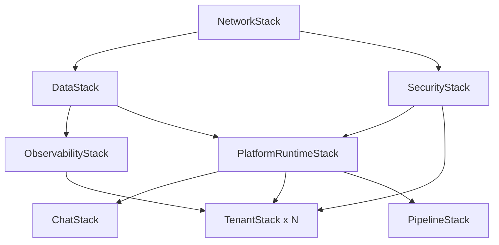

---
tags:
  - research-rabbithole
  - architecture
  - clawcore
  - aws
  - implementation-plan
  - openclaw
  - bedrock
  - agentcore
date: 2026-03-19
topic: ClawCore Final Architecture Plan
status: complete
---

# ClawCore — Final Architecture Plan

> The definitive plan for building an AWS-native multi-tenant agent platform
> that reproduces OpenClaw/NemoClaw capabilities using managed AWS services
> and open-source components.

This plan incorporates feedback from 6 specialist architecture reviews:
- [[ClawCore-Architecture-Review-Security|Security Review]] — STRIDE threat model, 8-layer defense-in-depth
- [[ClawCore-Architecture-Review-Cost-Scale|Cost & Scale Review]] — Pricing at 10/100/1000 tenants
- [[ClawCore-Architecture-Review-Integration|Integration Review]] — Chat SDK, MCP, A2A, streaming
- [[ClawCore-Architecture-Review-Platform-IaC|Platform & IaC Review]] — 8-stack CDK, GitOps, CI/CD
- [[ClawCore-Architecture-Review-Multi-Tenant|Multi-Tenant Review]] — Silo/Pool/Hybrid, DynamoDB schemas
- [[ClawCore-Architecture-Review-DevEx|Developer Experience Review]] — CLI, SDK, migration tools

Based on research across:
- [[OpenClaw NemoClaw OpenFang/OpenClaw NemoClaw OpenFang Research Index|OpenClaw Research]] (8 docs, 6,991 lines)
- [[AWS Bedrock AgentCore and Strands Agents/AgentCore and Strands Research Index|AgentCore Research]] (9 docs, 10,848 lines)
- [[AWS-Native-OpenClaw-Architecture-Synthesis|Architecture Synthesis]]

---

## 1. Technology Decisions (Final)

| Decision | Choice | Rationale |
|----------|--------|-----------|
| Agent Runtime | Bedrock AgentCore Runtime | MicroVM isolation, active-consumption billing, framework-agnostic |
| Agent Framework | Strands Agents (Python primary, TS secondary) | 13+ providers, 4 multi-agent patterns, A2A, native MCP |
| Chat Gateway | Vercel Chat SDK + SSE Bridge Service | Multi-platform (Slack/Teams/Discord/Telegram/WhatsApp/Web), JSX cards |
| API Layer | API Gateway (HTTP API, not REST) | Lower cost, native WebSocket, better streaming |
| Auth | Cognito + AgentCore Identity | Tenant pools + OAuth/API key for agent outbound |
| State | DynamoDB (single-table + per-concern tables) | On-demand for <100 tenants, provisioned above |
| Memory | AgentCore Memory (STM+LTM) + S3 snapshots | Managed session + long-term with 3 strategies |
| Skill Storage | S3 + DynamoDB metadata + Gateway MCP targets | Preserves SKILL.md format, skills-as-MCP-servers |
| Code Execution | AgentCore Code Interpreter (OpenSandbox) | MicroVM sandbox, no container escape risk |
| Scheduling | EventBridge Scheduler + Step Functions | Cron jobs, workflow orchestration, human-in-loop |
| Observability | CloudWatch + X-Ray + OpenTelemetry | Per-tenant dashboards, cost attribution |
| Security Policy | Cedar | Fine-grained, per-tenant, auditable |
| Content Safety | Bedrock Guardrails | PII filtering, prompt injection defense |
| IaC | CDK (TypeScript) | L2/L3 constructs, alpha AgentCore support |
| CI/CD | CodePipeline + GitOps | Canary deploys, PR-based tenant changes |
| LLM Routing | Strands providers + LiteLLM (optional) | Bedrock default, any provider supported |

---

## 2. CDK Stack Architecture (from Platform Review)

```
ClawCore/
├── lib/
│   ├── network-stack.ts          # VPC, subnets, NAT, VPC endpoints
│   ├── data-stack.ts             # DynamoDB tables (6), S3 buckets, ElastiCache
│   ├── security-stack.ts         # Cognito, WAF, Cedar policies, KMS keys
│   ├── observability-stack.ts    # CloudWatch dashboards, alarms, X-Ray groups
│   ├── platform-runtime-stack.ts # AgentCore Runtime, Memory, Gateway, Identity
│   ├── chat-stack.ts             # ECS Fargate (Chat SDK), ALB, SSE Bridge
│   ├── pipeline-stack.ts         # CodePipeline, CodeBuild, approval gates
│   └── tenant-stack.ts           # Per-tenant resources (parameterized)
├── constructs/
│   ├── tenant-agent.ts           # L3: AgentCore + skills + cron + memory
│   └── agent-observability.ts    # L3: per-tenant dashboards + alarms
├── bin/
│   └── clawcore.ts               # App entry point
└── cdk.json
```

### Stack Dependency Graph


---

## 3. DynamoDB Schema (from Multi-Tenant Review)

### 6 Tables

| Table | PK | SK | Purpose |
|-------|----|----|---------|
| `clawcore-tenants` | `TENANT#{id}` | `META` | Tenant config, tier, feature flags |
| `clawcore-sessions` | `TENANT#{id}` | `SESSION#{id}` | Active sessions, last activity |
| `clawcore-skills` | `TENANT#{id}` | `SKILL#{name}` | Installed skills, versions, MCP endpoints |
| `clawcore-rate-limits` | `TENANT#{id}` | `WINDOW#{timestamp}` | Token bucket state, request counts |
| `clawcore-cost-tracking` | `TENANT#{id}` | `PERIOD#{yyyy-mm}` | Monthly cost accumulation per tenant |
| `clawcore-audit` | `TENANT#{id}` | `EVENT#{timestamp}` | Security events, compliance audit trail |

### Global Secondary Indexes
- `clawcore-tenants` GSI1: `tier` → `tenantId` (query tenants by tier)
- `clawcore-sessions` GSI1: `agentId` → `lastActivity` (find active agents)
- `clawcore-skills` GSI1: `skillName` → `tenantId` (find skill usage across tenants)

---

## 4. Security Architecture (from Security Review)

### STRIDE Threat Mitigations

| Threat | Attack Vector | Mitigation |
|--------|--------------|------------|
| Spoofing | Tenant impersonation | Cognito JWT + tenant context in every request |
| Tampering | Skill code modification | Ed25519 signed manifests, S3 versioning |
| Repudiation | Agent actions without trace | CloudTrail + DynamoDB audit table + OTel traces |
| Info Disclosure | Cross-tenant data leak | MicroVM isolation + S3 prefix policies + DDB partition |
| DoS | Noisy neighbor | 5-layer throttling: WAF → API GW → Cedar → AgentCore → DDB |
| Elevation | Agent sandbox escape | OpenSandbox MicroVM + Cedar tool restrictions + budget limits |

### Skill Marketplace Pipeline (ClawHavoc Lessons)

```
Author submits skill
    → Static analysis (AST scan for dangerous patterns)
    → Dependency audit (known vulnerable packages)
    → Sandbox execution test (OpenSandbox, network-isolated)
    → Ed25519 signature by platform
    → Published with trust_level: "verified"
    → Runtime: WASM isolation for community skills
```

---

## 5. Cost Model (from Cost Review)

### Per-Tenant Monthly Cost (Moderate Usage)

| Component | Free Tier | Standard | Premium | Enterprise |
|-----------|-----------|----------|---------|------------|
| AgentCore Runtime | $0.15 | $1.50 | $7.50 | $30 |
| LLM Tokens (Sonnet) | $1.35 | $13.50 | $67.50 | $270 |
| DynamoDB | $0.05 | $0.50 | $2.50 | $10 |
| S3 | $0.01 | $0.05 | $0.25 | $1 |
| Chat SDK (shared) | $0.10 | $0.50 | $2.50 | $10 |
| CloudWatch | $0.05 | $0.25 | $1.25 | $5 |
| **Total** | **~$1.70** | **~$16** | **~$82** | **~$326** |

### Top 3 Cost Optimizations
1. **Prompt caching** — 67% savings on input tokens (Bedrock native)
2. **Model routing classifier** — route simple queries to Nova Micro ($0.001/session vs $0.045 Sonnet)
3. **DynamoDB provisioned** at 100+ tenants — 60-70% savings over on-demand

---

## 6. Developer Experience (from DevEx Review)

### CLI: `clawcore`

```bash
# Getting started (zero to first agent in 5 min)
clawcore auth login
clawcore agent init my-agent --template=chatbot
clawcore agent run                    # Local dev with hot reload
clawcore agent deploy --env=staging   # Deploy to AgentCore

# Skills
clawcore skill create my-skill
clawcore skill test                   # Run in sandbox
clawcore skill publish --marketplace  # Publish to marketplace

# Cron jobs
clawcore cron create daily-digest --schedule="0 8 * * MON-FRI"
clawcore cron list
clawcore cron logs daily-digest

# Channels
clawcore channel add slack --token=$SLACK_TOKEN
clawcore channel add discord --token=$DISCORD_TOKEN
clawcore channel list

# Tenant management (admin)
clawcore tenant create acme --tier=standard
clawcore tenant config acme --model=claude-sonnet-4.6
clawcore tenant usage acme
```

### Agent Definition (YAML-first, code escape hatch)

```yaml
# agent.yaml — config-driven for 80% of use cases
name: my-agent
model: us.anthropic.claude-sonnet-4-6-v1:0
system_prompt: ./prompts/system.md

skills:
  - code-review
  - web-search
  - custom:./skills/my-skill

tools:
  mcp_servers:
    - outlook-mcp
    - slack-mcp

memory:
  strategies: [summary, semantic_memory, user_preference]
  session_manager: s3

channels:
  - slack:
      channel: "#my-agent"
  - web:
      path: /chat

cron:
  - name: daily-digest
    schedule: "0 8 * * MON-FRI"
    prompt: ./prompts/digest.md
    output: s3://outputs/digests/{date}.md
```

### Migration from OpenClaw

```bash
# One-command migration (92% compatibility)
clawcore migrate --from=openclaw --path=~/.openclaw

# Converts:
# - openclaw.json → agent.yaml
# - SKILL.md files → ClawCore skill format (identical)
# - MEMORY.md → AgentCore Memory import
# - Channel configs → Chat SDK adapter configs
# - Cron jobs → EventBridge schedules
```

---

## 7. Integration Architecture (from Integration Review)

### Data Flow: User Message → Agent Response

```
User (Slack) → Chat SDK Bot (ECS Fargate)
    → API Gateway WebSocket
    → Tenant Router (Cognito JWT → DDB lookup)
    → AgentCore Runtime (MicroVM)
        → Strands Agent (tools, skills, memory)
        → Bedrock LLM (streaming)
    ← SSE Bridge Service (AgentCore stream → Data Stream Protocol)
    ← API Gateway WebSocket
    ← Chat SDK Bot (renders JSX card per platform)
← User sees formatted response on Slack
```

### Key Integration Decisions
- **SSE Bridge Service** (ECS Fargate) translates AgentCore streaming → Vercel Data Stream Protocol
- **API Gateway HTTP API** (not REST API) — 70% cheaper, better WebSocket support
- **Cross-platform identity** via DynamoDB linking table (`platform#userId` → `tenantId#identityId`)
- **A2A protocol** for cross-tenant agent communication (Cedar policy gated)

---

## 8. Implementation Phases

### Phase 0: Foundation (Week 1-2)
- [ ] CDK project scaffold with NetworkStack + DataStack + SecurityStack
- [ ] DynamoDB table creation (6 tables)
- [ ] S3 buckets (skills, memory, artifacts)
- [ ] Cognito user pool + tenant groups
- [ ] Basic IAM roles and policies

### Phase 1: Single-Tenant Agent (Week 3-4)
- [ ] AgentCore Runtime deployment (single agent)
- [ ] Strands agent with 4 core tools (read, write, edit, shell)
- [ ] AgentCore Memory integration (STM + LTM)
- [ ] Basic SKILL.md loader from S3
- [ ] `clawcore agent init/run/deploy` CLI commands
- [ ] Local development mode with hot reload

### Phase 2: Chat Gateway (Week 5-6)
- [ ] Chat SDK deployment on ECS Fargate
- [ ] SSE Bridge Service (AgentCore → Data Stream Protocol)
- [ ] API Gateway WebSocket endpoint
- [ ] Slack adapter (first platform)
- [ ] Web chat adapter (second platform)
- [ ] Streaming responses end-to-end

### Phase 3: Skills & Tools (Week 7-8)
- [ ] Skill registry (S3 + DynamoDB metadata)
- [ ] AgentCore Gateway MCP targets for skill tools
- [ ] `clawcore skill create/test/publish` CLI
- [ ] Skill security pipeline (static analysis + sandbox test + signing)
- [ ] 10 built-in skills (code-review, web-search, file-manager, etc.)

### Phase 4: Multi-Tenant (Week 9-10)
- [ ] Tenant Router (JWT → DDB → route)
- [ ] Per-tenant AgentCore configuration
- [ ] Cedar policy engine (tenant isolation)
- [ ] Rate limiting (token bucket per tenant)
- [ ] Cost tracking per tenant
- [ ] `clawcore tenant create/config/usage` CLI
- [ ] Tenant onboarding automation (Step Functions)

### Phase 5: Cron & Orchestration (Week 11-12)
- [ ] EventBridge Scheduler for tenant cron jobs
- [ ] Step Functions workflow for cron execution
- [ ] Multi-agent patterns (Agents-as-Tools, Swarm)
- [ ] `clawcore cron create/list/logs` CLI
- [ ] Self-scheduling agent capability (with Cedar guardrails)

### Phase 6: Self-Improving Infrastructure (Week 13-14)
- [ ] `manage_infrastructure` tool for agents
- [ ] GitOps pipeline (agent → PR → review → deploy)
- [ ] Cedar policies for infrastructure modification limits
- [ ] Budget limits and drift detection
- [ ] Self-modifying skill and cron configurations

### Phase 7: Production Hardening (Week 15-16)
- [ ] 5-stage CodePipeline with canary bake
- [ ] CloudWatch dashboards (platform + per-tenant)
- [ ] Alarm hierarchy and escalation
- [ ] Bedrock Guardrails (PII, prompt injection)
- [ ] WAF rules for API Gateway
- [ ] DR/backup (PITR, cross-region S3 replication)
- [ ] Load testing at 100 concurrent tenants

### Phase 8: Ecosystem (Week 17+)
- [ ] Skill marketplace with governance model
- [ ] Additional chat platforms (Teams, Discord, Telegram, WhatsApp)
- [ ] OpenClaw migration tool
- [ ] Documentation site and tutorials
- [ ] Community contribution guidelines
- [ ] Multi-region deployment (active-passive)

---

## 9. Open Questions for Further Investigation

| Question | Impact | Owner |
|----------|--------|-------|
| AgentCore Code Interpreter file size limits? | Affects skill complexity | Platform team |
| Chat SDK enterprise licensing terms? | May need fallback to custom adapters | Legal |
| Cedar policy evaluation latency at scale? | Could add p99 latency to every request | Security team |
| AgentCore Memory LTM storage limits per namespace? | Affects memory-heavy tenants | Platform team |
| Cross-region AgentCore deployment GA timeline? | Blocks multi-region DR | AWS account team |
| A2A protocol authentication for cross-tenant? | Needed for agent marketplace | Integration team |
| Bedrock Guardrails custom policy creation API? | Needed for per-tenant content policies | Security team |
| OpenSandbox network policy granularity? | Affects skill that need API access | Security team |

---

## 10. Success Metrics

| Metric | Target | Measurement |
|--------|--------|-------------|
| Time to first agent | <5 minutes | CLI instrumentation |
| Agent cold start | <2 seconds | AgentCore Runtime metrics |
| Message-to-first-token | <500ms | End-to-end tracing |
| Skill publish time | <30 seconds | Pipeline metrics |
| Tenant onboarding | <2 minutes (pool) | Step Functions duration |
| Cross-tenant isolation | Zero data leakage | Penetration testing |
| Platform uptime | 99.9% | CloudWatch composite alarms |
| Cost per session | <$0.05 (Sonnet) | Cost tracking DDB |
| Migration from OpenClaw | >90% compatibility | Migration tool reporting |

---

## Related Documents

### Research Rabbitholes
- [[OpenClaw NemoClaw OpenFang/OpenClaw NemoClaw OpenFang Research Index|OpenClaw Research Index]]
- [[AWS Bedrock AgentCore and Strands Agents/AgentCore and Strands Research Index|AgentCore Research Index]]
- [[AWS-Native-OpenClaw-Architecture-Synthesis|Architecture Synthesis]]

### Architecture Reviews
- [[ClawCore-Architecture-Review-Security|Security Review]]
- [[ClawCore-Architecture-Review-Cost-Scale|Cost & Scale Review]]
- [[ClawCore-Architecture-Review-Integration|Integration Review]]
- [[ClawCore-Architecture-Review-Platform-IaC|Platform & IaC Review]]
- [[ClawCore-Architecture-Review-Multi-Tenant|Multi-Tenant Review]]
- [[ClawCore-Architecture-Review-DevEx|Developer Experience Review]]

---

*Plan synthesized 2026-03-19 from 17 research documents (17,839 lines), 6 architecture reviews,
and 1 architecture synthesis — produced by 23+ parallel research and review agents.*
