---
tags:
  - architecture
  - clawcore
  - open-source
  - modules
  - dependencies
  - monorepo
date: 2026-03-19
topic: ClawCore Open-Source Module Architecture
status: complete
---

# ClawCore Open-Source Module Architecture

> How 10+ open-source components compose into a cohesive, buildable, testable
> platform -- with version pinning, integration layers, monorepo structure,
> build pipelines, contribution model, and licensing.

Based on:
- [[ClawCore-Final-Architecture-Plan]] -- Technology decisions and implementation phases
- [[AWS Bedrock AgentCore and Strands Agents/04-Strands-Agents-Core]] -- Strands SDK internals
- [[ClawCore-Architecture-Review-Integration]] -- Chat SDK, MCP, A2A, streaming patterns

---

## 1. Module Dependency Graph

```mermaid
graph TD
    subgraph "ClawCore Platform"
        CORE["clawcore/core<br/>(Agent definitions,<br/>tenant runtime)"]
        GW["clawcore/chat-gateway<br/>(SSE bridge,<br/>webhook handlers)"]
        CLI["clawcore/cli<br/>(clawcore CLI)"]
        SDK_PY["clawcore/sdk-python<br/>(Skill author SDK)"]
        SDK_TS["clawcore/sdk-typescript<br/>(Skill author SDK)"]
        CDK["clawcore/cdk<br/>(CDK constructs)"]
        SHARED["clawcore/shared<br/>(Types, utils, schemas)"]
    end

    subgraph "Agent Runtime Layer"
        STRANDS_PY["Strands Agents SDK<br/>(Python)"]
        STRANDS_TS["Strands Agents SDK<br/>(TypeScript)"]
        STRANDS_TOOLS["strands-agents-tools<br/>(30+ community tools)"]
    end

    subgraph "Chat & UI Layer"
        VERCEL_AI["Vercel AI SDK<br/>(@ai-sdk/*)"]
        CHAT_SDK["Vercel Chat SDK<br/>(@chat-sdk/*)"]
        CHAT_ADAPTERS["Chat Adapters<br/>(Slack, Discord, Teams,<br/>Telegram, WhatsApp, etc.)"]
    end

    subgraph "LLM Routing"
        LITELLM["LiteLLM<br/>(Universal LLM proxy)"]
    end

    subgraph "Policy & Validation"
        CEDAR["Cedar<br/>(Policy engine)"]
        PYDANTIC["Pydantic<br/>(Schema validation)"]
        ZOD["Zod<br/>(TS schema validation)"]
    end

    subgraph "API & Transport"
        FASTAPI["FastAPI<br/>(SSE bridge API)"]
        UVICORN["Uvicorn<br/>(ASGI server)"]
    end

    subgraph "Observability"
        OTEL["OpenTelemetry<br/>(Traces, metrics, logs)"]
        OTEL_AWS["OTel AWS Distro<br/>(ADOT collector)"]
    end

    subgraph "Infrastructure"
        CDK_LIB["aws-cdk-lib"]
        CONSTRUCTS["constructs"]
    end

    %% Core dependencies
    CORE --> STRANDS_PY
    CORE --> STRANDS_TOOLS
    CORE --> PYDANTIC
    CORE --> CEDAR
    CORE --> OTEL
    CORE --> SHARED

    %% Chat gateway dependencies
    GW --> VERCEL_AI
    GW --> CHAT_SDK
    GW --> CHAT_ADAPTERS
    GW --> FASTAPI
    GW --> UVICORN
    GW --> OTEL
    GW --> SHARED

    %% CLI dependencies
    CLI --> CORE
    CLI --> SDK_PY
    CLI --> SHARED

    %% SDK dependencies
    SDK_PY --> STRANDS_PY
    SDK_PY --> PYDANTIC
    SDK_PY --> SHARED
    SDK_TS --> STRANDS_TS
    SDK_TS --> ZOD
    SDK_TS --> SHARED

    %% CDK dependencies
    CDK --> CDK_LIB
    CDK --> CONSTRUCTS
    CDK --> SHARED

    %% Chat SDK chain
    CHAT_SDK --> VERCEL_AI
    CHAT_ADAPTERS --> CHAT_SDK

    %% LiteLLM is optional, used by core
    CORE -.->|optional| LITELLM

    %% Strands uses OTel internally
    STRANDS_PY --> OTEL
    OTEL --> OTEL_AWS
```



### Dependency Summary Table

| ClawCore Package | Primary OSS Dependencies | Language |
|------------------|--------------------------|----------|
| `core` | Strands SDK (Py), Pydantic, Cedar, OpenTelemetry, LiteLLM (opt) | Python |
| `chat-gateway` | Vercel AI SDK, Chat SDK, Chat Adapters, FastAPI, Uvicorn, OTel | Python + TS |
| `cli` | Click, Rich, core, sdk-python | Python |
| `sdk-python` | Strands SDK (Py), Pydantic | Python |
| `sdk-typescript` | Strands SDK (TS), Zod | TypeScript |
| `cdk` | aws-cdk-lib, constructs | TypeScript |
| `shared` | Pydantic (Py) / Zod (TS) | Both |

---

## 2. Version Pinning Strategy

### Principles

1. **Pin majors, float patches** -- Pin major and minor versions; allow patch updates for security fixes.
2. **Lockfiles are authoritative** -- `uv.lock` (Python) and `pnpm-lock.yaml` (TypeScript) are checked into the repo.
3. **Weekly automated updates** -- Dependabot / Renovate opens PRs for dependency bumps with CI gating.
4. **Compatibility matrix tested in CI** -- Matrix builds test against min and max supported versions of critical deps.

### Pinning Tiers

| Tier | Strategy | Dependencies | Rationale |
|------|----------|-------------|-----------|
| **Tier 1: Critical** | Exact pin (`==`) | Strands SDK, Pydantic, Cedar, aws-cdk-lib | Breaking changes directly affect agent behavior or IaC |
| **Tier 2: Important** | Compatible release (`~=` / `~`) | FastAPI, Vercel AI SDK, Chat SDK, OTel | API surface used is stable but evolving |
| **Tier 3: Utility** | Range (`>=x.y,<x+1`) | Click, Rich, Uvicorn, Zod | Minimal integration surface |

### Version Compatibility Matrix

```
# .github/compatibility-matrix.yml
matrix:
  python: ["3.11", "3.12", "3.13"]
  node: ["20", "22"]
  strands-agents: ["0.5.x", "0.6.x"]  # test current + next
  pydantic: ["2.8.x", "2.9.x"]
  ai-sdk: ["5.x"]
  cdk: ["2.170.x", "2.175.x"]
```

### Lockfile Management

```
clawcore/
  uv.lock              # Root Python lockfile (uv workspace)
  pnpm-lock.yaml       # Root TS lockfile (pnpm workspace)
  packages/
    core/
      pyproject.toml   # Python deps with version constraints
    chat-gateway/
      pyproject.toml   # Python deps
      package.json     # TS deps (Chat SDK adapters)
    cli/
      pyproject.toml
    sdk-python/
      pyproject.toml
    sdk-typescript/
      package.json
    cdk/
      package.json
    shared/
      pyproject.toml
      package.json
```

### Upgrade Workflow

1. Renovate opens a PR bumping a dependency
2. CI runs the full test suite including compatibility matrix
3. If Tier 1 dep: requires manual review + approval from maintainer
4. If Tier 2/3 dep: auto-merge if CI passes
5. Release notes auto-generated from dependency changelogs

---

## 3. Strands Integration Layer

ClawCore extends Strands Agents at four integration points: custom tools, custom model providers, custom session managers, and hooks/plugins.

### 3.1 Custom Tools

ClawCore wraps Strands' `@tool` decorator with tenant-aware context injection:

```python
# clawcore/core/tools/decorators.py
from strands import tool, ToolContext
from clawcore.shared.types import TenantContext

def clawcore_tool(func=None, *, requires_permissions=None):
    """ClawCore tool decorator -- adds tenant context and Cedar authorization."""

    def decorator(fn):
        @tool(context=True)
        async def wrapper(*args, tool_context: ToolContext, **kwargs):
            tenant_ctx = TenantContext.from_invocation_state(
                tool_context.invocation_state
            )
            # Cedar policy check
            if requires_permissions:
                authorize(tenant_ctx, requires_permissions, fn.__name__)
            # Inject tenant context
            return await fn(*args, tenant_context=tenant_ctx, **kwargs)

        wrapper.__name__ = fn.__name__
        wrapper.__doc__ = fn.__doc__
        return wrapper

    return decorator(func) if func else decorator
```

### 3.2 Custom Model Providers

ClawCore provides a tenant-aware model provider that wraps Strands providers with budget tracking and routing:

```python
# clawcore/core/models/tenant_model.py
from strands.models.model import Model
from strands.models.bedrock import BedrockModel

class TenantAwareModel(Model):
    """Wraps any Strands model with tenant budget tracking and fallback."""

    def __init__(self, tenant_config: dict):
        self.primary = self._create_provider(tenant_config["models"]["default"])
        self.fallback_chain = [
            self._create_provider(tenant_config["models"][k])
            for k in tenant_config.get("fallback_chain", [])
        ]
        self.budget_tracker = BudgetTracker(tenant_config["budget_limit_monthly_usd"])

    def stream(self, messages, system_prompt=None, tool_specs=None, **kwargs):
        self.budget_tracker.check_budget()
        for event in self.primary.stream(messages, system_prompt, tool_specs, **kwargs):
            if event.get("type") == "metadata":
                self.budget_tracker.record_usage(event)
            yield event

    def _create_provider(self, model_config: dict) -> Model:
        if model_config["provider"] == "bedrock":
            return BedrockModel(model_id=model_config["model_id"])
        elif model_config["provider"] == "litellm":
            from strands.models.litellm import LiteLLMModel
            return LiteLLMModel(model_id=model_config["model_id"])
        # ... other providers
```

### 3.3 Custom Session Managers

ClawCore implements a DynamoDB-backed session manager that integrates with AgentCore Memory:

```python
# clawcore/core/session/dynamodb_session.py
from strands.session.session_manager import SessionManager

class DynamoDBSessionManager(SessionManager):
    """Tenant-isolated session persistence in DynamoDB."""

    def __init__(self, table_name: str, tenant_id: str):
        self.table = boto3.resource("dynamodb").Table(table_name)
        self.tenant_id = tenant_id

    def read_session(self, session_id: str) -> dict:
        response = self.table.get_item(
            Key={"PK": f"TENANT#{self.tenant_id}", "SK": f"SESSION#{session_id}"}
        )
        return response.get("Item", {}).get("data", {})

    def write_session(self, session_id: str, data: dict) -> None:
        self.table.put_item(Item={
            "PK": f"TENANT#{self.tenant_id}",
            "SK": f"SESSION#{session_id}",
            "data": data,
            "updated_at": int(time.time()),
        })
```

### 3.4 Hooks and Plugins

ClawCore registers platform-level hooks into the Strands event system:

```python
# clawcore/core/plugins/tenant_plugin.py
from strands.plugins import plugin, hook
from strands.hooks import (
    BeforeInvocationEvent, AfterInvocationEvent,
    BeforeToolCallEvent, AfterToolCallEvent,
)

@plugin
class ClawCoreTenantPlugin:
    """Platform plugin: Cedar auth, cost tracking, audit logging."""

    def __init__(self, tenant_id: str, cedar_engine, cost_tracker, audit_logger):
        self.tenant_id = tenant_id
        self.cedar = cedar_engine
        self.costs = cost_tracker
        self.audit = audit_logger

    @hook(BeforeToolCallEvent)
    async def authorize_tool(self, event: BeforeToolCallEvent):
        allowed = self.cedar.is_authorized(
            principal=f"Tenant::{self.tenant_id}",
            action="Action::tool_invoke",
            resource=f"Tool::{event.tool_name}",
        )
        if not allowed:
            event.skip = True

    @hook(AfterInvocationEvent)
    async def track_costs(self, event: AfterInvocationEvent):
        self.costs.record(self.tenant_id, event.result)

    @hook(AfterToolCallEvent)
    async def audit_tool_call(self, event: AfterToolCallEvent):
        self.audit.log(self.tenant_id, event.tool_name, event.result)
```

### 3.5 Extension Points Summary

| Extension Point | Strands Interface | ClawCore Implementation |
|----------------|-------------------|------------------------|
| Tools | `@tool` decorator, `ToolProvider` | `@clawcore_tool` with Cedar auth + tenant context |
| Model providers | `Model` ABC (`stream()`) | `TenantAwareModel` with budget tracking + fallback |
| Session managers | `SessionManager` ABC | `DynamoDBSessionManager` with tenant isolation |
| Hooks | `HookRegistry.on(Event)` | `ClawCoreTenantPlugin` for auth, cost, audit |
| Plugins | `@plugin` decorator | Skills, Steering, custom platform plugins |
| Conversation mgmt | `ConversationManager` ABC | Default Strands managers (sliding window, summarizing) |
| Tool executors | `ToolExecutor` | Default Strands executors (concurrent, sequential) |

---

## 4. Chat SDK Integration Layer

The Chat SDK connects to the Strands backend through an adapter pattern with event routing and message normalization.

### 4.1 Adapter Pattern

```
Platform-Specific Events                   Unified ClawCore Format
========================                   ======================

Slack event_callback     -->  SlackAdapter    -->  NormalizedMessage
Discord gateway event    -->  DiscordAdapter  -->  NormalizedMessage
Teams Bot Framework      -->  TeamsAdapter    -->  NormalizedMessage
                                                        |
                                                        v
                                                  TenantRouter
                                                        |
                                                        v
                                                  SSE Bridge
                                                  (FastAPI)
                                                        |
                                                        v
                                                  AgentCore Runtime
                                                  (Strands Agent)
                                                        |
                                                        v
                                                  Data Stream Protocol
                                                  (SSE events)
                                                        |
                                                        v
                                                  PlatformRenderer
                                                        |
              +------------------+------------------+
              |                  |                  |
         SlackRenderer    DiscordRenderer    TeamsRenderer
         (Block Kit)      (Embeds)           (Adaptive Cards)
```

### 4.2 Event Routing

```typescript
// clawcore/chat-gateway/src/router.ts
import { ChatAdapter, Thread, Message } from '@chat-sdk/core';

interface NormalizedMessage {
  tenantId: string;
  userId: string;        // Unified identity (post-linking)
  platformUserId: string;
  platform: string;
  threadId: string;
  content: string;
  attachments?: Attachment[];
  metadata: Record<string, unknown>;
}

class EventRouter {
  constructor(
    private tenantResolver: TenantResolver,
    private identityLinker: IdentityLinker,
    private sseClient: SSEBridgeClient,
  ) {}

  async route(adapter: ChatAdapter, thread: Thread, message: Message): Promise<void> {
    const tenantId = await this.tenantResolver.resolve(adapter.name, thread.channelId);
    const userId = await this.identityLinker.resolve(tenantId, adapter.name, message.sender.id);

    const normalized: NormalizedMessage = {
      tenantId,
      userId,
      platformUserId: message.sender.id,
      platform: adapter.name,
      threadId: thread.id,
      content: message.text,
      attachments: message.attachments,
      metadata: { channelId: thread.channelId },
    };

    // Stream response from SSE bridge back to platform
    const stream = await this.sseClient.chat(normalized);
    const renderer = PlatformRendererFactory.create(adapter.name, thread);
    await renderer.streamResponse(stream);
  }
}
```

### 4.3 Message Normalization

| Platform Field | Normalized Field | Notes |
|---------------|-----------------|-------|
| Slack `event.user` | `platformUserId` | Then resolved to `userId` via identity table |
| Discord `interaction.user.id` | `platformUserId` | |
| Teams `activity.from.id` | `platformUserId` | |
| Slack `event.text` (mentions stripped) | `content` | `<@U123>` references resolved to display names |
| Discord `message.content` | `content` | Markdown preserved |
| Slack `event.files[]` | `attachments[]` | URLs resolved via `files.sharedPublicURL` |

### 4.4 Data Stream Protocol Translation

The SSE bridge translates AgentCore streaming chunks to Vercel Data Stream Protocol events:

| AgentCore Chunk Type | Data Stream Protocol Event | Chat SDK Rendering |
|---------------------|---------------------------|-------------------|
| Text token | `text-delta` | Appended to message |
| Tool call start | `tool-input-start` | "Searching..." spinner |
| Tool result | `tool-result` | Tool result card |
| Reasoning | `reasoning-delta` | Thinking indicator |
| Completion | `finish` | Final message posted |

---

## 5. LiteLLM Integration

### When to Use LiteLLM vs Native Strands Providers

| Scenario | Use | Rationale |
|----------|-----|-----------|
| Bedrock models (Claude, Nova, Llama, Mistral) | **Strands BedrockModel** | Native, lowest latency, full feature support |
| OpenAI models (GPT-4o, o3) | **Strands OpenAIModel** | Native provider available |
| Anthropic direct API | **Strands AnthropicModel** | Native provider available |
| Ollama (local dev) | **Strands OllamaModel** | Native provider available |
| Google Gemini | **Strands GeminiModel** | Native provider available |
| Cohere, Fireworks, NVIDIA NIM, vLLM, SGLang, other 100+ providers | **LiteLLM** | No native Strands provider |
| Custom fine-tuned models on non-standard endpoints | **LiteLLM** | OpenAI-compatible proxy |
| Multi-provider load balancing / routing | **LiteLLM** | Built-in router with retries |

### Deployment Architecture

```
Option A: Sidecar (per-tenant isolation)         Option B: Shared Service (cost-efficient)
==========================================       ==========================================

AgentCore MicroVM (Tenant A)                     AgentCore MicroVM (any tenant)
  |                                                |
  Strands Agent                                    Strands Agent
  |                                                |
  +-- BedrockModel (primary)                       +-- BedrockModel (primary)
  |                                                |
  +-- LiteLLMModel -----> LiteLLM sidecar          +-- LiteLLMModel -----> ECS Fargate Service
       (localhost:4000)   (in same MicroVM)              (litellm.internal)  (shared, auto-scaled)
                                                                              |
                                                                         +----+----+
                                                                         |         |
                                                                      Task 1    Task 2
                                                                      (3 replicas)
```

**Recommendation:** Start with **Option B (shared service)**. Deploy LiteLLM as an ECS Fargate service with auto-scaling. Reasons:

1. Most tenants use Bedrock-only (LiteLLM not invoked)
2. Shared service avoids per-MicroVM resource overhead
3. Centralized API key management for third-party providers
4. Easier to monitor, update, and scale

### LiteLLM Configuration

```yaml
# litellm-config.yaml (deployed to ECS)
model_list:
  - model_name: "cohere/command-r-plus"
    litellm_params:
      model: "cohere/command-r-plus"
      api_key: "os.environ/COHERE_API_KEY"

  - model_name: "fireworks/llama-v3p1-405b"
    litellm_params:
      model: "fireworks_ai/accounts/fireworks/models/llama-v3p1-405b-instruct"
      api_key: "os.environ/FIREWORKS_API_KEY"

  - model_name: "ollama/llama3.2"
    litellm_params:
      model: "ollama/llama3.2"
      api_base: "http://ollama.internal:11434"

router_settings:
  routing_strategy: "least-busy"
  num_retries: 2
  timeout: 60
```

### Strands LiteLLM Integration

```python
# When a tenant selects a LiteLLM-routed model
from strands.models.litellm import LiteLLMModel

model = LiteLLMModel(
    model_id="cohere/command-r-plus",
    api_base="https://litellm.internal:4000",  # shared LiteLLM service
)
agent = Agent(model=model, tools=tenant_tools)
```

---

## 6. Cedar Integration

### Policy Loading

```
                    S3 Bucket                     ElastiCache (Redis)
                    (cedar-policies/)              (policy cache)
                         |                              |
                    +----+----+                    +----+----+
                    |         |                    |         |
               platform/   tenant/            warm cache  TTL: 5min
               *.cedar     {id}/*.cedar            |
                    |         |                    |
                    +----+----+                    |
                         |                         |
                    Cedar Policy Set           Cache Lookup
                    Compiler                       |
                         |                    +----+----+
                         v                    |         |
                    Compiled Policy Set    HIT: use   MISS: load
                         |                  cached     from S3
                         |                              |
                         +----------+-------------------+
                                    |
                              Cedar Authorizer
                              (in-process, per-request)
```

### Policy Hierarchy

```
cedar-policies/
  platform/
    base.cedar              # Platform-wide policies (all tenants)
    tool-restrictions.cedar # Default tool access controls
    rate-limits.cedar       # Base rate limit policies
  tenant/
    {tenant-id}/
      custom.cedar          # Tenant-specific overrides
      a2a-grants.cedar      # Cross-tenant A2A permissions
```

### Evaluation Flow

```python
# clawcore/core/auth/cedar_engine.py
import cedarpy  # Python bindings for Cedar

class CedarEngine:
    def __init__(self, policy_store_bucket: str, cache_client):
        self.s3 = boto3.client("s3")
        self.cache = cache_client
        self.bucket = policy_store_bucket

    def is_authorized(
        self, principal: str, action: str, resource: str, context: dict = None
    ) -> bool:
        policies = self._load_policies(self._extract_tenant(principal))
        request = cedarpy.AuthorizationRequest(
            principal=principal,
            action=action,
            resource=resource,
            context=context or {},
        )
        decision = cedarpy.is_authorized(request, policies)
        return decision == cedarpy.Decision.ALLOW

    def _load_policies(self, tenant_id: str) -> cedarpy.PolicySet:
        cache_key = f"cedar:policies:{tenant_id}"
        cached = self.cache.get(cache_key)
        if cached:
            return cedarpy.PolicySet.from_json(cached)

        # Load platform + tenant policies
        platform_policies = self._load_from_s3("platform/")
        tenant_policies = self._load_from_s3(f"tenant/{tenant_id}/")
        combined = platform_policies + tenant_policies

        policy_set = cedarpy.PolicySet.from_cedar("\n".join(combined))
        self.cache.setex(cache_key, 300, policy_set.to_json())  # 5 min TTL
        return policy_set
```

### Performance Considerations

| Concern | Mitigation |
|---------|-----------|
| Policy evaluation latency | In-process evaluation (~0.1ms per check); no network call |
| Policy loading | ElastiCache with 5-min TTL; cold load ~50ms from S3 |
| Policy size scaling | Cedar evaluates incrementally; 1000 policies < 1ms |
| Cache invalidation | S3 event notification -> Lambda -> cache invalidation |
| Cold start impact | Pre-compile policies during AgentCore session init |

### Example Policies

```cedar
// Platform base: all tenants can invoke their own tools
permit(
    principal,
    action == Action::"tool_invoke",
    resource
) when {
    principal.tenantId == resource.tenantId
};

// Tenant override: Acme can use cross-tenant A2A
permit(
    principal in Tenant::"acme",
    action == Action::"a2a_invoke",
    resource == AgentRuntime::"partner-research"
) when {
    context.request_type == "research_query"
};

// Rate limit: free tier limited to 100 requests/hour
forbid(
    principal,
    action == Action::"agent_invoke",
    resource
) when {
    principal.tier == "free" && context.hourly_request_count > 100
};
```

---

## 7. Monorepo Structure

```
clawcore/
├── .github/
│   ├── workflows/
│   │   ├── ci.yml                  # Lint, test, build on every PR
│   │   ├── release.yml             # Semantic release on main merge
│   │   ├── compatibility.yml       # Weekly matrix builds
│   │   └── security.yml            # Daily dependency audit
│   ├── CODEOWNERS
│   └── dependabot.yml
│
├── packages/
│   ├── core/                       # Python: Agent runtime, tenant management
│   │   ├── pyproject.toml
│   │   ├── src/
│   │   │   └── clawcore/
│   │   │       ├── __init__.py
│   │   │       ├── agent.py        # TenantAgent factory
│   │   │       ├── models/
│   │   │       │   └── tenant_model.py
│   │   │       ├── tools/
│   │   │       │   ├── decorators.py
│   │   │       │   └── builtin/    # 10 built-in tools
│   │   │       ├── auth/
│   │   │       │   └── cedar_engine.py
│   │   │       ├── session/
│   │   │       │   └── dynamodb_session.py
│   │   │       ├── plugins/
│   │   │       │   └── tenant_plugin.py
│   │   │       └── observability/
│   │   │           └── otel.py
│   │   └── tests/
│   │
│   ├── chat-gateway/               # Python + TS: SSE bridge + webhook handlers
│   │   ├── pyproject.toml          # FastAPI SSE bridge
│   │   ├── package.json            # Chat SDK adapters (TS)
│   │   ├── src/
│   │   │   ├── bridge/             # Python: FastAPI SSE bridge service
│   │   │   │   ├── app.py
│   │   │   │   ├── stream.py       # AgentCore -> DSP translation
│   │   │   │   └── tenant_router.py
│   │   │   └── adapters/           # TypeScript: platform adapters
│   │   │       ├── router.ts
│   │   │       ├── renderers/
│   │   │       │   ├── slack.ts
│   │   │       │   ├── discord.ts
│   │   │       │   └── teams.ts
│   │   │       └── identity.ts
│   │   ├── Dockerfile
│   │   └── tests/
│   │
│   ├── cli/                        # Python: clawcore CLI
│   │   ├── pyproject.toml
│   │   ├── src/
│   │   │   └── clawcore_cli/
│   │   │       ├── __init__.py
│   │   │       ├── main.py         # Click entrypoint
│   │   │       ├── commands/
│   │   │       │   ├── agent.py    # init, run, deploy
│   │   │       │   ├── skill.py    # create, test, publish
│   │   │       │   ├── cron.py     # create, list, logs
│   │   │       │   ├── channel.py  # add, list
│   │   │       │   └── tenant.py   # create, config, usage
│   │   │       └── templates/      # Agent/skill scaffolds
│   │   └── tests/
│   │
│   ├── sdk-python/                 # Python: Skill author SDK
│   │   ├── pyproject.toml
│   │   ├── src/
│   │   │   └── clawcore_sdk/
│   │   │       ├── __init__.py
│   │   │       ├── skill.py        # Skill definition helpers
│   │   │       ├── tool.py         # @clawcore_tool re-export
│   │   │       ├── testing.py      # SkillTestHarness
│   │   │       └── types.py        # Shared types
│   │   └── tests/
│   │
│   ├── sdk-typescript/             # TypeScript: Skill author SDK
│   │   ├── package.json
│   │   ├── tsconfig.json
│   │   ├── src/
│   │   │   ├── index.ts
│   │   │   ├── skill.ts
│   │   │   ├── tool.ts
│   │   │   ├── testing.ts
│   │   │   └── types.ts
│   │   └── tests/
│   │
│   ├── cdk/                        # TypeScript: CDK constructs
│   │   ├── package.json
│   │   ├── tsconfig.json
│   │   ├── lib/
│   │   │   ├── stacks/             # 8 CDK stacks
│   │   │   │   ├── network-stack.ts
│   │   │   │   ├── data-stack.ts
│   │   │   │   ├── security-stack.ts
│   │   │   │   ├── observability-stack.ts
│   │   │   │   ├── platform-runtime-stack.ts
│   │   │   │   ├── chat-stack.ts
│   │   │   │   ├── pipeline-stack.ts
│   │   │   │   └── tenant-stack.ts
│   │   │   └── constructs/         # L3 constructs
│   │   │       ├── tenant-agent.ts
│   │   │       └── agent-observability.ts
│   │   ├── bin/
│   │   │   └── clawcore.ts
│   │   └── test/
│   │
│   └── shared/                     # Shared types, utils, schemas
│       ├── pyproject.toml          # Python shared types
│       ├── package.json            # TS shared types
│       ├── python/
│       │   └── clawcore_shared/
│       │       ├── types.py        # TenantConfig, AgentConfig, etc.
│       │       └── schemas.py      # Pydantic models for API contracts
│       └── typescript/
│           └── src/
│               ├── types.ts
│               └── schemas.ts      # Zod schemas mirroring Python models
│
├── skills/                         # Built-in skill collection
│   ├── code-review/
│   │   ├── SKILL.md
│   │   └── tools/
│   ├── web-search/
│   ├── file-manager/
│   └── ...                         # 10 built-in skills
│
├── docs/                           # Documentation site (Docusaurus or similar)
│   ├── getting-started.md
│   ├── architecture.md
│   ├── skills-guide.md
│   ├── contributing.md
│   └── api-reference/
│
├── examples/                       # Example agents and integrations
│   ├── basic-chatbot/
│   ├── slack-assistant/
│   ├── multi-agent-research/
│   └── custom-skill/
│
├── pyproject.toml                  # Root Python workspace (uv)
├── pnpm-workspace.yaml             # Root TS workspace
├── package.json                    # Root TS config
├── uv.lock
├── pnpm-lock.yaml
├── Makefile                        # Convenience targets
├── LICENSE                         # Apache 2.0
├── CONTRIBUTING.md
└── README.md
```

### Workspace Configuration

**Python (uv workspace):**
```toml
# pyproject.toml (root)
[project]
name = "clawcore"
version = "0.1.0"

[tool.uv.workspace]
members = [
    "packages/core",
    "packages/cli",
    "packages/sdk-python",
    "packages/chat-gateway",
    "packages/shared",
]
```

**TypeScript (pnpm workspace):**
```yaml
# pnpm-workspace.yaml
packages:
  - "packages/sdk-typescript"
  - "packages/cdk"
  - "packages/chat-gateway"
  - "packages/shared"
```

---

## 8. Build & Test Pipeline

### CI Pipeline (every PR)

```yaml
# .github/workflows/ci.yml
name: CI
on: [pull_request]

jobs:
  lint:
    runs-on: ubuntu-latest
    steps:
      - uses: actions/checkout@v4
      - run: uv run ruff check packages/    # Python linting
      - run: pnpm run lint                   # TS linting

  test-python:
    runs-on: ubuntu-latest
    strategy:
      matrix:
        python: ["3.11", "3.12", "3.13"]
    steps:
      - uses: actions/checkout@v4
      - uses: astral-sh/setup-uv@v4
      - run: uv sync
      - run: uv run pytest packages/core/tests/ -v
      - run: uv run pytest packages/cli/tests/ -v
      - run: uv run pytest packages/sdk-python/tests/ -v
      - run: uv run pytest packages/chat-gateway/tests/ -v

  test-typescript:
    runs-on: ubuntu-latest
    strategy:
      matrix:
        node: ["20", "22"]
    steps:
      - uses: actions/checkout@v4
      - uses: pnpm/action-setup@v4
      - run: pnpm install
      - run: pnpm -r run test
      - run: pnpm -r run build

  integration-tests:
    runs-on: ubuntu-latest
    needs: [test-python, test-typescript]
    steps:
      - uses: actions/checkout@v4
      - run: docker compose -f tests/integration/docker-compose.yml up -d
      - run: uv run pytest tests/integration/ -v --timeout=120
      - run: docker compose -f tests/integration/docker-compose.yml down

  cdk-synth:
    runs-on: ubuntu-latest
    steps:
      - uses: actions/checkout@v4
      - run: cd packages/cdk && pnpm install && pnpm run build
      - run: cd packages/cdk && npx cdk synth --all  # Validates all stacks
```

### Release Pipeline (on main merge)

```yaml
# .github/workflows/release.yml
name: Release
on:
  push:
    branches: [main]

jobs:
  release:
    runs-on: ubuntu-latest
    steps:
      - uses: actions/checkout@v4
        with:
          fetch-depth: 0

      # Determine changed packages
      - id: changes
        run: |
          changed=$(git diff --name-only HEAD~1 | grep '^packages/' | cut -d/ -f2 | sort -u)
          echo "packages=$changed" >> $GITHUB_OUTPUT

      # Version bump (semantic-release per package)
      - run: |
          for pkg in ${{ steps.changes.outputs.packages }}; do
            cd packages/$pkg
            npx semantic-release || uv run python -m semantic_release publish
            cd ../..
          done

      # Publish Python packages to PyPI
      - run: |
          for pkg in core cli sdk-python shared; do
            if echo "${{ steps.changes.outputs.packages }}" | grep -q "$pkg"; then
              cd packages/$pkg && uv build && uv publish && cd ../..
            fi
          done

      # Publish TS packages to npm
      - run: |
          for pkg in sdk-typescript cdk shared; do
            if echo "${{ steps.changes.outputs.packages }}" | grep -q "$pkg"; then
              cd packages/$pkg && pnpm publish --access public && cd ../..
            fi
          done
```

### Test Categories

| Category | Location | Runner | When |
|----------|----------|--------|------|
| Unit tests | `packages/*/tests/unit/` | pytest / vitest | Every PR |
| Integration tests | `tests/integration/` | pytest + Docker Compose | Every PR |
| CDK snapshot tests | `packages/cdk/test/` | jest | Every PR |
| Compatibility matrix | `.github/workflows/compatibility.yml` | GitHub Actions matrix | Weekly |
| E2E tests | `tests/e2e/` | pytest + deployed stack | Pre-release |
| Security audit | `.github/workflows/security.yml` | `uv audit` + `pnpm audit` | Daily |

---

## 9. Contribution Model

### How External Contributors Add Skills

```
1. Fork the repo
2. Create a new skill directory:

   skills/
     my-new-skill/
       SKILL.md          # Skill specification (follows agentskills.io spec)
       tools/
         my_tool.py      # Tool implementations using @clawcore_tool
       tests/
         test_my_tool.py # Tests (required)
       README.md         # Usage documentation

3. Skill must pass automated checks:
   - ruff lint + format
   - pytest (unit tests pass)
   - Sandbox execution test (isolated, no network by default)
   - Static analysis (no dangerous patterns: exec, eval, subprocess without allowlist)
   - Dependency audit (no known vulnerable packages)

4. Submit PR with "skill: my-new-skill" label
5. Skill review by a maintainer (code + security)
6. Merged skills are signed (Ed25519) and published to the marketplace
```

### How External Contributors Add Adapters

```
1. Implement the ChatAdapter interface (TypeScript):

   packages/chat-gateway/src/adapters/
     my-platform/
       adapter.ts        # Implements ChatAdapter
       renderer.ts       # Platform-specific message rendering
       types.ts          # Platform-specific types
       tests/
         adapter.test.ts

2. Requirements:
   - Webhook signature verification
   - Message normalization to NormalizedMessage
   - Streaming support (native or edit-based fallback)
   - Rate limit handling with backpressure
   - Tests with mocked platform API

3. Submit PR with "adapter: my-platform" label
```

### How External Contributors Add Model Providers

Model providers are contributed upstream to Strands Agents SDK, not to ClawCore directly. ClawCore consumes them via the Strands dependency. For providers not yet in Strands:

1. Contribute to `strands-agents/sdk-python` following their contribution guide
2. Or register the provider in LiteLLM's community providers
3. ClawCore picks it up automatically via dependency updates

### Contributor Roles

| Role | Permissions | Path to Role |
|------|------------|-------------|
| **Contributor** | Submit PRs, report issues | Sign CLA |
| **Skill Author** | Submit and maintain skills | 1+ merged skill |
| **Maintainer** | Review and merge PRs, release packages | Sustained contributions + nomination |
| **Core Maintainer** | Architecture decisions, security reviews | Deep platform knowledge + trust |

### Code Review Requirements

| Change Type | Required Approvals | Auto-merge Eligible |
|------------|-------------------|-------------------|
| Skill addition | 1 maintainer | No |
| Bug fix | 1 maintainer | Yes (if tests pass) |
| Feature (non-breaking) | 2 maintainers | No |
| Breaking change | 2 core maintainers | No |
| Security fix | 1 core maintainer (expedited) | No |
| Dependency bump (Tier 3) | 0 (CI only) | Yes |
| Dependency bump (Tier 1) | 1 core maintainer | No |

---

## 10. License Strategy

| Component | License | Rationale |
|-----------|---------|-----------|
| `packages/core` | Apache 2.0 | Matches Strands SDK license; permissive for enterprise adoption |
| `packages/chat-gateway` | Apache 2.0 | Core platform component |
| `packages/cli` | Apache 2.0 | Developer tool |
| `packages/sdk-python` | Apache 2.0 | Must be permissive for skill authors |
| `packages/sdk-typescript` | Apache 2.0 | Must be permissive for skill authors |
| `packages/cdk` | Apache 2.0 | IaC constructs should be freely usable |
| `packages/shared` | Apache 2.0 | Shared types used by all packages |
| `skills/*` | Apache 2.0 (default) | Community skills can choose MIT or Apache 2.0 |
| `docs/*` | CC BY 4.0 | Documentation under Creative Commons |
| `examples/*` | MIT | Examples should be copy-paste friendly |

### License Compatibility Matrix

All OSS dependencies are compatible with Apache 2.0:

| Dependency | License | Compatible? |
|-----------|---------|-------------|
| Strands Agents SDK | Apache 2.0 | Yes |
| Vercel AI SDK | Apache 2.0 | Yes |
| Vercel Chat SDK | Apache 2.0 | Yes |
| LiteLLM | MIT | Yes |
| Cedar (cedarpy) | Apache 2.0 | Yes |
| OpenTelemetry | Apache 2.0 | Yes |
| Pydantic | MIT | Yes |
| FastAPI | MIT | Yes |
| Uvicorn | BSD-3-Clause | Yes |
| Click | BSD-3-Clause | Yes |
| Zod | MIT | Yes |
| aws-cdk-lib | Apache 2.0 | Yes |

### CLA Requirement

Contributors must sign a Contributor License Agreement (CLA) before their first PR is merged. The CLA grants the project a perpetual, irrevocable license to use contributions under Apache 2.0. Automated CLA checking via CLA Assistant GitHub App.

---

## Related Documents

- [[ClawCore-Final-Architecture-Plan]] -- Technology decisions, CDK stacks, implementation phases
- [[ClawCore-Architecture-Review-Integration]] -- Chat SDK, MCP, A2A, streaming details
- [[AWS Bedrock AgentCore and Strands Agents/04-Strands-Agents-Core]] -- Strands SDK architecture
- [[ClawCore-Architecture-Review-Security]] -- STRIDE threat model, Cedar policies
- [[ClawCore-Architecture-Review-DevEx]] -- CLI design, agent.yaml spec

---

*Open-Source Module Architecture designed 2026-03-19.*
