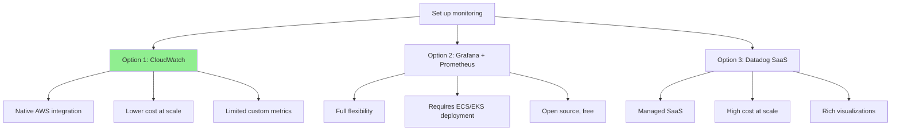

# Task Decomposition in Autonomous Agent Swarms

> **Research Focus**: How autonomous agent swarms transform vague, ambiguous user requests into concrete, executable subtasks

---

## Table of Contents

- [[#Executive Summary]]
- [[#Problem Framing - The Challenge of Ambiguity]]
- [[#Decomposition Strategies]]
  - [[#Tree-of-Thought Decomposition]]
  - [[#Plan-and-Execute Pattern]]
  - [[#Recursive Refinement]]
  - [[#Goal Decomposition]]
  - [[#Dependency-Aware Decomposition]]
- [[#Existing Frameworks and Patterns]]
- [[#AWS Implementation Patterns]]
- [[#Multi-Agent Decomposition Workflows]]
- [[#Progressive Refinement Approach]]
- [[#Human-in-the-Loop Decision Points]]
- [[#Real-World Examples]]
- [[#Key Takeaways]]
- [[#Sources]]

---

## Executive Summary

**Task decomposition** is the foundational capability that enables autonomous agent swarms to handle vague, underspecified requests. When a user asks "set up monitoring for our microservices," the system must:

1. **Discover context**: What microservices exist? Where are they deployed?
2. **Identify options**: CloudWatch, Grafana, Datadog, Prometheus?
3. **Decompose into subtasks**: Deploy dashboards, configure alarms, set thresholds, document access
4. **Sequence execution**: Dependencies, prerequisites, validation steps
5. **Iterate toward production**: POC → staging → production with feedback loops

**Core Decomposition Strategies:**
- **Tree-of-Thought**: Explore multiple decomposition paths before committing
- **Plan-and-Execute**: Generate comprehensive plan upfront, execute incrementally
- **Recursive Refinement**: Start coarse-grained, refine based on execution feedback
- **Goal Decomposition**: Work backward from desired end-state
- **Dependency-Aware**: Model task dependencies explicitly (DAG-based)

**Key Insight**: Effective decomposition requires **contextual discovery** (what exists?), **constraint identification** (what's allowed?), and **validation loops** (did it work?) — not just logical subtask splitting.

---

## Problem Framing - The Challenge of Ambiguity

### Why Vague Requests Are Hard

Vague requests contain multiple forms of ambiguity:

#### 1. **Underspecification**
```
User: "Set up monitoring"

Underspecified:
- Monitoring for what? (Microservices, databases, infrastructure)
- What metrics? (Availability, latency, errors, cost)
- What tools? (CloudWatch, Grafana, Prometheus)
- What alerting? (Slack, email, PagerDuty)
- What thresholds? (Error rate >1%, latency >500ms)
```

#### 2. **Missing Context**
```
User: "Deploy the new feature"

Missing Context:
- Which feature? (Multiple features may be in development)
- Which environment? (Dev, staging, production)
- Which AWS account? (Multi-account setup)
- Rollout strategy? (Blue/green, canary, all-at-once)
- Rollback plan? (What triggers rollback?)
```

#### 3. **Unstated Assumptions**
```
User: "Optimize our Lambda functions"

Unstated Assumptions:
- Optimize for what? (Cost, latency, throughput, cold start)
- Which Lambdas? (All, specific service, high-traffic only)
- Current baseline? (Need to measure before optimizing)
- Acceptable tradeoffs? (Memory vs. duration cost)
- Testing requirements? (Load test after changes?)
```

#### 4. **Hidden Dependencies**
```
User: "Add authentication to the API"

Hidden Dependencies:
- User directory exists? (Cognito user pool, AD, custom)
- Token format? (JWT, OAuth, API keys)
- Authorization model? (RBAC, ABAC, resource-based)
- Session management? (Stateful, stateless, hybrid)
- Rate limiting? (Per user, per tenant, per endpoint)
```

### Traditional vs. Autonomous Approaches

| Aspect | Traditional Dev | Autonomous Agent Swarm |
|--------|----------------|------------------------|
| **Requirements gathering** | Synchronous Q&A with user | Asynchronous context discovery + targeted questions |
| **Task breakdown** | Human architect creates subtasks | Agent swarm generates decomposition tree |
| **Dependency resolution** | Manual identification | Automated discovery + validation |
| **Execution** | Sequential, human-driven | Parallel, autonomous with coordination |
| **Feedback** | Periodic check-ins | Continuous validation + auto-correction |

**Autonomous agents must**:
- Discover unknowns proactively (not wait to be told)
- Validate assumptions programmatically (query infrastructure, run experiments)
- Handle incomplete information gracefully (proceed with POC, refine later)
- Learn from failures (record blockers, patterns, solutions)

---

## Decomposition Strategies

### Tree-of-Thought Decomposition

**Pattern**: Explore multiple decomposition paths in parallel, evaluate each, select best approach.

**When to Use**: High-uncertainty tasks where approach is not obvious, multiple valid strategies exist.

**Example: "Set up monitoring for microservices"**



**Tree-of-Thought Workflow**:
```python
from typing import List, Dict, Any

class DecompositionPath:
    def __init__(self, approach: str, subtasks: List[str], score: float):
        self.approach = approach
        self.subtasks = subtasks
        self.score = score

async def tree_of_thought_decomposition(vague_request: str) -> DecompositionPath:
    """
    Generate multiple decomposition paths, evaluate, select best.
    """
    # Step 1: Generate multiple approaches
    approaches = await brainstorm_approaches(vague_request)
    # Example: ["CloudWatch native", "Grafana + Prometheus", "Datadog SaaS"]

    # Step 2: For each approach, generate subtasks
    decomposition_paths = []
    for approach in approaches:
        subtasks = await decompose_approach(vague_request, approach)
        feasibility = await assess_feasibility(approach, subtasks)
        cost = await estimate_cost(approach)
        complexity = await estimate_complexity(subtasks)

        # Score based on feasibility, cost, complexity
        score = (feasibility * 0.5) + ((1 - cost) * 0.3) + ((1 - complexity) * 0.2)

        decomposition_paths.append(DecompositionPath(
            approach=approach,
            subtasks=subtasks,
            score=score
        ))

    # Step 3: Select best path
    best_path = max(decomposition_paths, key=lambda p: p.score)

    # Step 4: Ask user to confirm (optional)
    if should_confirm_with_user(best_path):
        confirmed = await ask_user_confirmation(best_path)
        if not confirmed:
            # Try second-best path
            return sorted(decomposition_paths, key=lambda p: p.score)[-2]

    return best_path

async def brainstorm_approaches(request: str) -> List[str]:
    """Use LLM to generate multiple valid approaches."""
    prompt = f"""
    User request: "{request}"

    Generate 3 different approaches to accomplish this, considering:
    - AWS-native solutions
    - Open-source alternatives
    - Managed SaaS options

    For each approach, list pros and cons.
    """
    response = await llm.generate(prompt)
    return parse_approaches(response)
```

**AWS Implementation with Step Functions**:
```json
{
  "Comment": "Tree-of-thought task decomposition",
  "StartAt": "BrainstormApproaches",
  "States": {
    "BrainstormApproaches": {
      "Type": "Task",
      "Resource": "arn:aws:states:::lambda:invoke",
      "Parameters": {
        "FunctionName": "decompose-brainstorm",
        "Payload": {
          "request.$": "$.userRequest"
        }
      },
      "Next": "ParallelEvaluation"
    },
    "ParallelEvaluation": {
      "Type": "Parallel",
      "Branches": [
        {
          "StartAt": "EvaluateApproach1",
          "States": {
            "EvaluateApproach1": {
              "Type": "Task",
              "Resource": "arn:aws:states:::lambda:invoke",
              "Parameters": {
                "FunctionName": "evaluate-approach",
                "Payload": {
                  "approach.$": "$.approaches[0]"
                }
              },
              "End": true
            }
          }
        },
        {
          "StartAt": "EvaluateApproach2",
          "States": {
            "EvaluateApproach2": {
              "Type": "Task",
              "Resource": "arn:aws:states:::lambda:invoke",
              "Parameters": {
                "FunctionName": "evaluate-approach",
                "Payload": {
                  "approach.$": "$.approaches[1]"
                }
              },
              "End": true
            }
          }
        }
      ],
      "Next": "SelectBestApproach"
    },
    "SelectBestApproach": {
      "Type": "Task",
      "Resource": "arn:aws:states:::lambda:invoke",
      "Parameters": {
        "FunctionName": "select-best-path",
        "Payload": {
          "evaluations.$": "$"
        }
      },
      "End": true
    }
  }
}
```

### Plan-and-Execute Pattern

**Pattern**: Generate comprehensive plan upfront, then execute incrementally with validation checkpoints.

**When to Use**: Well-understood domains, clear success criteria, linear dependencies.

**Example: "Deploy production infrastructure for new service"**

```python
from dataclasses import dataclass
from typing import List, Optional
from enum import Enum

class TaskStatus(Enum):
    PENDING = "pending"
    IN_PROGRESS = "in_progress"
    COMPLETED = "completed"
    FAILED = "failed"
    BLOCKED = "blocked"

@dataclass
class Task:
    id: str
    description: str
    dependencies: List[str]  # Task IDs this depends on
    status: TaskStatus
    agent_assigned: Optional[str]
    validation: Optional[str]  # How to verify completion
    rollback: Optional[str]    # How to undo if needed

@dataclass
class ExecutionPlan:
    goal: str
    tasks: List[Task]
    checkpoints: List[str]  # Task IDs where human approval needed

async def plan_and_execute(vague_request: str) -> ExecutionPlan:
    """
    Generate comprehensive plan, then execute with validation.
    """
    # Phase 1: Generate plan
    plan = await generate_execution_plan(vague_request)

    # Phase 2: Validate plan structure
    await validate_plan_structure(plan)

    # Phase 3: Execute tasks in dependency order
    while not all_tasks_complete(plan):
        # Find tasks with resolved dependencies
        ready_tasks = find_ready_tasks(plan)

        # Execute tasks in parallel
        results = await execute_tasks_parallel(ready_tasks)

        # Update plan with results
        update_plan_status(plan, results)

        # Check if any checkpoint reached
        if checkpoint_reached(plan):
            await wait_for_human_approval(plan)

    return plan

async def generate_execution_plan(request: str) -> ExecutionPlan:
    """Use LLM to generate comprehensive task list."""

    # Discover current state
    current_state = await discover_infrastructure()

    prompt = f"""
    User request: "{request}"
    Current infrastructure: {current_state}

    Generate a comprehensive execution plan with:
    1. List of tasks (each task: description, dependencies, validation criteria)
    2. Dependency graph (which tasks must complete before others)
    3. Checkpoints (where human approval is needed)
    4. Rollback steps (how to undo each task if needed)

    Format as JSON:
    {{
      "goal": "...",
      "tasks": [
        {{
          "id": "task-1",
          "description": "Create VPC",
          "dependencies": [],
          "validation": "VPC exists with CIDR 10.0.0.0/16",
          "rollback": "Delete VPC if no resources attached"
        }},
        ...
      ],
      "checkpoints": ["task-5", "task-10"]
    }}
    """

    response = await llm.generate(prompt)
    return parse_execution_plan(response)

async def execute_tasks_parallel(tasks: List[Task]) -> List[Dict[str, Any]]:
    """Execute independent tasks in parallel."""
    import asyncio

    async def execute_task(task: Task) -> Dict[str, Any]:
        # Assign to agent
        agent = await select_agent_for_task(task)
        task.agent_assigned = agent.id
        task.status = TaskStatus.IN_PROGRESS

        # Execute
        result = await agent.execute(task.description)

        # Validate
        if task.validation:
            is_valid = await validate_task_result(task.validation, result)
            if is_valid:
                task.status = TaskStatus.COMPLETED
            else:
                task.status = TaskStatus.FAILED
                # Attempt rollback
                if task.rollback:
                    await agent.execute(task.rollback)

        return {"task_id": task.id, "status": task.status, "result": result}

    return await asyncio.gather(*[execute_task(t) for t in tasks])
```

**Real-World Example: Infrastructure Deployment**

```
Goal: "Deploy production infrastructure for new service"

Generated Plan:
┌─────────────────────────────────────────────────────────┐
│ Phase 1: Network Setup                                  │
├─────────────────────────────────────────────────────────┤
│ task-1: Create VPC (10.0.0.0/16)                        │
│ task-2: Create public subnets (2 AZs)                   │ → depends on task-1
│ task-3: Create private subnets (2 AZs)                  │ → depends on task-1
│ task-4: Create NAT gateways                             │ → depends on task-2
│ task-5: Create Internet Gateway                         │ → depends on task-1
│ CHECKPOINT: Review network topology                      │
└─────────────────────────────────────────────────────────┘

┌─────────────────────────────────────────────────────────┐
│ Phase 2: Security                                        │
├─────────────────────────────────────────────────────────┤
│ task-6: Create security groups (ALB, ECS, RDS)          │ → depends on task-1
│ task-7: Configure WAF rules                              │
│ task-8: Create KMS keys (data encryption)               │
│ task-9: Set up Cognito user pool                        │
└─────────────────────────────────────────────────────────┘

┌─────────────────────────────────────────────────────────┐
│ Phase 3: Data Layer                                      │
├─────────────────────────────────────────────────────────┤
│ task-10: Create RDS Aurora cluster                      │ → depends on task-3, task-6
│ task-11: Create DynamoDB tables                         │
│ task-12: Create S3 buckets (encrypted)                  │ → depends on task-8
│ CHECKPOINT: Validate data layer                          │
└─────────────────────────────────────────────────────────┘

┌─────────────────────────────────────────────────────────┐
│ Phase 4: Compute                                         │
├─────────────────────────────────────────────────────────┤
│ task-13: Create ECS cluster                             │ → depends on task-3
│ task-14: Create ALB                                      │ → depends on task-2, task-6
│ task-15: Deploy ECS services                            │ → depends on task-13, task-14
│ CHECKPOINT: Smoke test service endpoints                 │
└─────────────────────────────────────────────────────────┘

┌─────────────────────────────────────────────────────────┐
│ Phase 5: Observability                                   │
├─────────────────────────────────────────────────────────┤
│ task-16: Create CloudWatch dashboards                   │
│ task-17: Configure alarms (CPU, memory, errors)         │
│ task-18: Set up X-Ray tracing                           │
│ FINAL CHECKPOINT: Ready for production traffic?          │
└─────────────────────────────────────────────────────────┘
```

### Recursive Refinement

**Pattern**: Start with coarse-grained tasks, refine based on execution feedback and discovered constraints.

**When to Use**: Exploration tasks, research projects, evolving requirements.

**Example: "Research best practices for Lambda cold start optimization"**

```python
from typing import List, Dict, Any

class RefinementLevel(Enum):
    COARSE = 1      # High-level goals
    MEDIUM = 2      # Concrete subtasks
    FINE = 3        # Implementation details

@dataclass
class RefinableTask:
    id: str
    description: str
    level: RefinementLevel
    subtasks: List['RefinableTask']
    findings: Dict[str, Any]

async def recursive_refinement(vague_request: str) -> List[RefinableTask]:
    """
    Start coarse, refine based on discoveries.
    """
    # Level 1: Coarse-grained decomposition
    coarse_tasks = await decompose_coarse(vague_request)

    # Level 2: Execute coarse tasks, discover constraints
    for task in coarse_tasks:
        result = await execute_task(task)
        task.findings = result

        # Refine into medium-grained tasks
        if needs_refinement(result):
            task.subtasks = await decompose_medium(task, result)

    # Level 3: Execute medium tasks, refine to fine-grained
    for coarse_task in coarse_tasks:
        for medium_task in coarse_task.subtasks:
            result = await execute_task(medium_task)
            medium_task.findings = result

            if needs_further_refinement(result):
                medium_task.subtasks = await decompose_fine(medium_task, result)

    return coarse_tasks

# Example: Lambda cold start optimization research

# Level 1 (Coarse): Initial decomposition
coarse_tasks = [
    "Research Lambda cold start causes",
    "Identify optimization techniques",
    "Benchmark improvements"
]

# After executing "Research Lambda cold start causes":
# Discoveries: VPC ENI attachment (10s), large deployment packages (2-5s),
#              runtime initialization (Python vs Node), memory settings

# Level 2 (Medium): Refined based on findings
medium_tasks_for_causes = [
    "Measure VPC cold start overhead",
    "Analyze deployment package size impact",
    "Compare runtime initialization times",
    "Test memory configuration effects"
]

# After executing "Measure VPC cold start overhead":
# Discovery: VPC ENI attachment adds 10-15s, Hyperplane architecture removes this

# Level 3 (Fine): Implementation details
fine_tasks_for_vpc = [
    "Deploy Lambda without VPC (baseline)",
    "Deploy Lambda with VPC (traditional ENI)",
    "Deploy Lambda with VPC (Hyperplane - post-2019)",
    "Compare cold start latencies across configurations",
    "Document: VPC cold start penalty eliminated in 2019"
]
```

**Refinement Triggers**:
- Unexpected results (task fails, reveals new complexity)
- Discovered constraints (API limits, permission boundaries)
- New information (documentation found, tool capabilities learned)
- User feedback (clarification provided, priorities changed)

### Goal Decomposition

**Pattern**: Work backward from desired end-state, identify prerequisites recursively.

**When to Use**: Clear end-goal, unknown path to reach it.

**Example: "Make our Lambda functions pass security audit"**

```python
from typing import List, Set

@dataclass
class Goal:
    description: str
    success_criteria: List[str]
    prerequisites: List['Goal']
    actions: List[str]

async def goal_decomposition(end_goal: str) -> Goal:
    """
    Work backward from end-goal to identify prerequisites.
    """
    # Define end-goal success criteria
    root_goal = Goal(
        description=end_goal,
        success_criteria=await define_success_criteria(end_goal),
        prerequisites=[],
        actions=[]
    )

    # Recursively identify prerequisites
    await identify_prerequisites(root_goal)

    return root_goal

async def identify_prerequisites(goal: Goal) -> None:
    """
    For each success criterion, identify what must be true first.
    """
    for criterion in goal.success_criteria:
        # What must be true for this criterion to be satisfied?
        prereqs = await analyze_prerequisites(criterion)

        for prereq in prereqs:
            # Check if prerequisite is already satisfied
            if not await is_satisfied(prereq):
                prereq_goal = Goal(
                    description=prereq["description"],
                    success_criteria=prereq["criteria"],
                    prerequisites=[],
                    actions=[]
                )
                goal.prerequisites.append(prereq_goal)

                # Recurse
                await identify_prerequisites(prereq_goal)

# Example: "Lambda functions pass security audit"

root_goal = Goal(
    description="Lambda functions pass security audit",
    success_criteria=[
        "No environment variables contain secrets",
        "All functions use least-privilege IAM roles",
        "All functions encrypted at rest",
        "All functions behind WAF",
        "All dependencies scanned for vulnerabilities"
    ],
    prerequisites=[],
    actions=[]
)

# After analysis:
prerequisites = [
    Goal(
        description="Secrets managed in Secrets Manager",
        success_criteria=[
            "All secrets stored in Secrets Manager",
            "Lambda functions configured with secret ARNs",
            "Secrets rotated every 90 days"
        ],
        prerequisites=[
            Goal(
                description="Identify all hardcoded secrets",
                success_criteria=["Scan all Lambda env vars", "Scan all code for hardcoded keys"],
                prerequisites=[],
                actions=["Run secret scanner on all functions"]
            ),
            Goal(
                description="Provision Secrets Manager",
                success_criteria=["Secrets Manager enabled", "KMS key for encryption"],
                prerequisites=[],
                actions=["Create KMS key", "Create secret entries"]
            )
        ],
        actions=[]
    ),
    # ... more prerequisites
]
```

**Goal Graph Visualization**:
```
"Lambda functions pass security audit"
│
├─► "Secrets managed in Secrets Manager"
│   ├─► "Identify all hardcoded secrets"
│   │   ├─► "Scan all Lambda env vars"
│   │   └─► "Scan all code for API keys"
│   └─► "Provision Secrets Manager"
│       ├─► "Create KMS key"
│       └─► "Create secret entries"
│
├─► "Least-privilege IAM roles"
│   ├─► "Audit current IAM permissions"
│   │   └─► "Run IAM Access Analyzer"
│   └─► "Generate minimal policies"
│       └─► "Test with reduced permissions"
│
└─► "Dependencies scanned for vulnerabilities"
    ├─► "Integrate vulnerability scanner"
    └─► "Set up automated scanning in CI/CD"
```

### Dependency-Aware Decomposition

**Pattern**: Model task dependencies explicitly as DAG, schedule execution respecting constraints.

**When to Use**: Complex multi-step workflows, parallel execution opportunities.

**Example: "Set up CI/CD pipeline for microservices"**

```python
from typing import List, Set, Dict
import networkx as nx

@dataclass
class DependentTask:
    id: str
    description: str
    dependencies: Set[str]  # Task IDs this depends on
    estimated_duration: int  # minutes
    parallelizable: bool

class DependencyGraph:
    def __init__(self):
        self.graph = nx.DiGraph()

    def add_task(self, task: DependentTask):
        self.graph.add_node(task.id, task=task)
        for dep_id in task.dependencies:
            self.graph.add_edge(dep_id, task.id)

    def get_execution_order(self) -> List[List[str]]:
        """
        Returns tasks grouped by execution wave (tasks in same wave can run in parallel).
        """
        waves = []
        remaining = set(self.graph.nodes())

        while remaining:
            # Find tasks with no unfinished dependencies
            ready = {
                node for node in remaining
                if all(dep not in remaining for dep in self.graph.predecessors(node))
            }

            if not ready:
                raise ValueError("Circular dependency detected")

            waves.append(list(ready))
            remaining -= ready

        return waves

    def get_critical_path(self) -> List[str]:
        """Find longest path (critical path for scheduling)."""
        return nx.dag_longest_path(self.graph, weight='estimated_duration')

# Example: CI/CD pipeline setup

tasks = [
    DependentTask(
        id="create-codecommit-repo",
        description="Create CodeCommit repository",
        dependencies=set(),
        estimated_duration=5,
        parallelizable=True
    ),
    DependentTask(
        id="create-ecr-repo",
        description="Create ECR repository for Docker images",
        dependencies=set(),
        estimated_duration=5,
        parallelizable=True
    ),
    DependentTask(
        id="create-codebuild-project",
        description="Create CodeBuild project (build + test)",
        dependencies={"create-codecommit-repo", "create-ecr-repo"},
        estimated_duration=15,
        parallelizable=False
    ),
    DependentTask(
        id="configure-buildspec",
        description="Write buildspec.yml with build steps",
        dependencies={"create-codebuild-project"},
        estimated_duration=20,
        parallelizable=False
    ),
    DependentTask(
        id="create-ecs-cluster",
        description="Create ECS cluster for deployments",
        dependencies=set(),
        estimated_duration=10,
        parallelizable=True
    ),
    DependentTask(
        id="create-codedeploy-app",
        description="Create CodeDeploy application",
        dependencies={"create-ecs-cluster", "create-ecr-repo"},
        estimated_duration=10,
        parallelizable=False
    ),
    DependentTask(
        id="create-codepipeline",
        description="Create CodePipeline (source → build → deploy)",
        dependencies={"create-codebuild-project", "create-codedeploy-app"},
        estimated_duration=20,
        parallelizable=False
    ),
    DependentTask(
        id="configure-notifications",
        description="Set up SNS notifications for pipeline events",
        dependencies={"create-codepipeline"},
        estimated_duration=10,
        parallelizable=True
    ),
    DependentTask(
        id="test-pipeline",
        description="Trigger test run of pipeline",
        dependencies={"create-codepipeline", "configure-buildspec"},
        estimated_duration=30,
        parallelizable=False
    )
]

graph = DependencyGraph()
for task in tasks:
    graph.add_task(task)

# Get execution waves (parallel execution opportunities)
execution_waves = graph.get_execution_order()
# Wave 1: ["create-codecommit-repo", "create-ecr-repo", "create-ecs-cluster"]
# Wave 2: ["create-codebuild-project", "create-codedeploy-app"]
# Wave 3: ["configure-buildspec"]
# Wave 4: ["create-codepipeline"]
# Wave 5: ["configure-notifications", "test-pipeline"]

# Get critical path (longest sequence)
critical_path = graph.get_critical_path()
# ["create-codecommit-repo", "create-codebuild-project", "configure-buildspec",
#  "create-codepipeline", "test-pipeline"]
# Total duration: 5 + 15 + 20 + 20 + 30 = 90 minutes
```

---

## Existing Frameworks and Patterns

### LangChain Plan-and-Solve

**Pattern**: Generate plan, then execute with self-critique loop.

```python
from langchain.chains import LLMChain
from langchain.prompts import PromptTemplate

plan_prompt = PromptTemplate(
    input_variables=["user_request"],
    template="""
    User request: {user_request}

    Generate a step-by-step plan to accomplish this. For each step:
    1. What needs to be done
    2. What information is needed
    3. How to validate completion

    Plan:
    """
)

plan_chain = LLMChain(llm=llm, prompt=plan_prompt)

# Generate plan
plan = plan_chain.run(user_request="Set up monitoring for microservices")

# Execute each step
for step in plan["steps"]:
    result = execute_step(step)
    if not validate_step(step, result):
        # Re-plan based on failure
        revised_plan = plan_chain.run(
            user_request=f"Step failed: {step}. Revise plan."
        )
```

### ReAct (Reasoning + Acting)

**Pattern**: Interleave reasoning (think) with acting (execute), adjust based on observations.

```python
def react_loop(goal: str, max_iterations: int = 10):
    observations = []

    for i in range(max_iterations):
        # Thought: What should I do next?
        thought = llm.generate(f"""
            Goal: {goal}
            Previous observations: {observations}

            Think: What should I do next to make progress?
        """)

        # Action: Execute thought
        action = parse_action(thought)
        observation = execute_action(action)
        observations.append({"action": action, "result": observation})

        # Check if goal reached
        if goal_achieved(goal, observations):
            break

        # If stuck, decompose further
        if no_progress(observations):
            sub_goals = llm.generate(f"""
                Goal: {goal}
                Stuck at: {observations[-1]}

                Decompose this into smaller sub-goals.
            """)
            for sub_goal in sub_goals:
                react_loop(sub_goal)

# Example:
react_loop("Deploy CloudWatch dashboards for Lambda functions")
# Iteration 1:
#   Thought: "I need to know which Lambda functions exist"
#   Action: ListFunctions
#   Observation: ["api-handler", "auth-service", "data-processor"]
# Iteration 2:
#   Thought: "I need to create dashboards for each function"
#   Action: CreateDashboard(function="api-handler")
#   Observation: Dashboard created with ID: "dashboard-123"
# ...
```

### AutoGPT Task Decomposition

**Pattern**: Agent maintains task list, adds/removes tasks dynamically based on execution.

```python
class AutoGPTAgent:
    def __init__(self, goal: str):
        self.goal = goal
        self.task_queue = []
        self.completed_tasks = []

    async def run(self):
        # Initial decomposition
        self.task_queue = await self.decompose_goal(self.goal)

        while self.task_queue:
            task = self.task_queue.pop(0)

            # Execute task
            result = await self.execute_task(task)
            self.completed_tasks.append({"task": task, "result": result})

            # Evaluate: Does this result suggest new tasks?
            new_tasks = await self.evaluate_result(result, self.goal)
            self.task_queue.extend(new_tasks)

            # Should we change strategy?
            if self.should_revise_approach(self.completed_tasks, self.goal):
                self.task_queue = await self.replan(
                    self.goal,
                    self.completed_tasks
                )

    async def decompose_goal(self, goal: str) -> List[str]:
        """Generate initial task list."""
        prompt = f"""
        Goal: {goal}

        Decompose into executable tasks. Each task should:
        - Be concrete and actionable
        - Have clear completion criteria
        - Be achievable by a single agent

        Tasks:
        """
        response = await self.llm.generate(prompt)
        return parse_tasks(response)

    async def evaluate_result(self, result: Any, goal: str) -> List[str]:
        """Based on task result, identify new tasks needed."""
        prompt = f"""
        Goal: {goal}
        Latest result: {result}

        Does this result reveal new tasks that need to be done?
        If yes, list them. If no, return empty list.
        """
        response = await self.llm.generate(prompt)
        return parse_tasks(response)
```

### OpenAI Swarm Handoffs

**Pattern**: Agents hand off tasks to specialized agents based on context.

```python
from openai import OpenAI

client = OpenAI()

def triage_agent(user_request: str):
    """Triage request and hand off to specialist."""
    response = client.chat.completions.create(
        model="gpt-4",
        messages=[
            {"role": "system", "content": "You triage requests and hand off to specialists."},
            {"role": "user", "content": user_request}
        ],
        functions=[
            {
                "name": "hand_off_to_infrastructure_agent",
                "description": "Hand off infrastructure setup tasks"
            },
            {
                "name": "hand_off_to_security_agent",
                "description": "Hand off security/compliance tasks"
            },
            {
                "name": "hand_off_to_data_agent",
                "description": "Hand off database/data pipeline tasks"
            }
        ]
    )

    # If LLM calls function, hand off
    if response.choices[0].message.function_call:
        function_name = response.choices[0].message.function_call.name
        specialist = get_specialist(function_name)
        return specialist.execute(user_request)

def infrastructure_agent(task: str):
    """Specialist for infrastructure tasks."""
    # Decompose infrastructure task
    subtasks = decompose_infrastructure_task(task)
    results = []
    for subtask in subtasks:
        results.append(execute_subtask(subtask))
    return results
```

---

## AWS Implementation Patterns

### Step Functions + Lambda for Decomposition

```python
# Lambda: Task Decomposer
import json
import boto3

stepfunctions = boto3.client('stepfunctions')

def lambda_handler(event, context):
    vague_request = event['userRequest']

    # Use LLM to decompose
    tasks = decompose_with_llm(vague_request)

    # Create Step Functions execution for each task
    for task in tasks:
        stepfunctions.start_execution(
            stateMachineArn=os.environ['TASK_EXECUTOR_ARN'],
            input=json.dumps({
                'task': task,
                'parentRequest': vague_request
            })
        )

    return {
        'statusCode': 200,
        'body': json.dumps({
            'message': f'Decomposed into {len(tasks)} tasks',
            'tasks': tasks
        })
    }

def decompose_with_llm(request: str) -> List[Dict]:
    """Use Bedrock to decompose request."""
    import boto3

    bedrock = boto3.client('bedrock-runtime')

    prompt = f"""
    User request: "{request}"

    Decompose this into concrete, executable tasks. For each task:
    - description: what needs to be done
    - dependencies: which other tasks must complete first
    - validation: how to verify completion
    - aws_services: which AWS services are needed

    Return as JSON array of task objects.
    """

    response = bedrock.invoke_model(
        modelId='anthropic.claude-3-sonnet-20240229-v1:0',
        body=json.dumps({
            'anthropic_version': 'bedrock-2023-05-31',
            'messages': [{'role': 'user', 'content': prompt}],
            'max_tokens': 4096
        })
    )

    result = json.loads(response['body'].read())
    content = result['content'][0]['text']

    # Parse JSON from LLM response
    import re
    json_match = re.search(r'\[.*\]', content, re.DOTALL)
    if json_match:
        return json.loads(json_match.group())

    return []
```

### EventBridge + SQS for Parallel Task Execution

```python
# After decomposition, publish tasks to EventBridge
import boto3

events = boto3.client('events')

def publish_tasks_for_parallel_execution(tasks: List[Dict]):
    """Publish tasks to EventBridge for parallel agent execution."""
    entries = []

    for task in tasks:
        entries.append({
            'Source': 'chimera.task-decomposer',
            'DetailType': 'TaskReady',
            'Detail': json.dumps({
                'taskId': task['id'],
                'description': task['description'],
                'dependencies': task['dependencies'],
                'priority': task.get('priority', 'medium')
            }),
            'EventBusName': 'chimera-agent-bus'
        })

    # Batch publish (max 10 per call)
    for i in range(0, len(entries), 10):
        batch = entries[i:i+10]
        events.put_events(Entries=batch)

# Agent workers listen to EventBridge, pull from SQS
# EventBridge rule routes TaskReady events to SQS queue
# Multiple agents poll SQS, execute tasks in parallel
```

### DynamoDB for Dependency Tracking

```python
import boto3
from boto3.dynamodb.conditions import Key, Attr

dynamodb = boto3.resource('dynamodb')
table = dynamodb.Table('chimera-task-dependencies')

def record_task_dependency(parent_task_id: str, child_task_id: str):
    """Record that child_task depends on parent_task."""
    table.put_item(Item={
        'taskId': child_task_id,
        'dependsOn': parent_task_id,
        'status': 'waiting',
        'createdAt': datetime.utcnow().isoformat()
    })

def mark_task_complete(task_id: str):
    """Mark task complete and check if dependent tasks can now execute."""
    # Update task status
    table.update_item(
        Key={'taskId': task_id},
        UpdateExpression='SET #status = :status, completedAt = :timestamp',
        ExpressionAttributeNames={'#status': 'status'},
        ExpressionAttributeValues={
            ':status': 'completed',
            ':timestamp': datetime.utcnow().isoformat()
        }
    )

    # Find tasks that depend on this one
    response = table.scan(
        FilterExpression=Attr('dependsOn').eq(task_id) & Attr('status').eq('waiting')
    )

    dependent_tasks = response['Items']

    for dependent_task in dependent_tasks:
        # Check if all dependencies are satisfied
        if all_dependencies_satisfied(dependent_task['taskId']):
            # Trigger execution
            publish_task_ready(dependent_task)

def all_dependencies_satisfied(task_id: str) -> bool:
    """Check if all dependencies for a task are completed."""
    response = table.scan(
        FilterExpression=Attr('taskId').eq(task_id)
    )

    for item in response['Items']:
        dep_task_id = item['dependsOn']
        dep_response = table.get_item(Key={'taskId': dep_task_id})
        if dep_response['Item']['status'] != 'completed':
            return False

    return True
```

---

## Multi-Agent Decomposition Workflows

### Lead-Builder Pattern (Overstory)

**Pattern**: Lead agent decomposes, spawns builder agents for execution.

```python
# Lead agent
class LeadAgent:
    async def handle_vague_request(self, request: str):
        # 1. Decompose into subtasks
        subtasks = await self.decompose_request(request)

        # 2. Spawn builder agents (parallel)
        builder_agents = []
        for subtask in subtasks:
            builder = await self.spawn_builder(subtask)
            builder_agents.append(builder)

        # 3. Wait for builders to complete
        results = await asyncio.gather(*[b.execute() for b in builder_agents])

        # 4. Merge results
        final_result = await self.merge_builder_results(results)

        return final_result

    async def decompose_request(self, request: str) -> List[Dict]:
        """Use LLM to decompose into parallel subtasks."""
        prompt = f"""
        Request: "{request}"

        Decompose into 3-5 independent subtasks that can be executed in parallel.
        Each subtask should be self-contained.

        Return JSON array with:
        - description: clear task description
        - context: what the builder needs to know
        - success_criteria: how to verify completion
        """

        response = await self.llm.generate(prompt)
        return parse_subtasks(response)

    async def spawn_builder(self, subtask: Dict) -> BuilderAgent:
        """Spawn a builder agent with specific scope."""
        builder = BuilderAgent(
            task=subtask['description'],
            context=subtask['context'],
            success_criteria=subtask['success_criteria']
        )
        return builder

# Builder agent
class BuilderAgent:
    def __init__(self, task: str, context: Dict, success_criteria: List[str]):
        self.task = task
        self.context = context
        self.success_criteria = success_criteria

    async def execute(self) -> Dict:
        """Execute assigned task autonomously."""
        # 1. Understand task
        plan = await self.create_execution_plan()

        # 2. Execute plan
        for step in plan:
            await self.execute_step(step)

        # 3. Validate against success criteria
        validation_results = await self.validate_completion()

        # 4. Return results to lead
        return {
            'task': self.task,
            'status': 'completed' if validation_results['passed'] else 'failed',
            'artifacts': validation_results['artifacts'],
            'notes': validation_results['notes']
        }
```

### Hierarchical Decomposition

**Pattern**: Multi-level decomposition (lead → sub-leads → builders).

```
Lead Agent (Platform Setup)
├─► Sub-Lead: Infrastructure
│   ├─► Builder: VPC setup
│   ├─► Builder: Security groups
│   └─► Builder: NAT/IGW
├─► Sub-Lead: Data Layer
│   ├─► Builder: DynamoDB tables
│   ├─► Builder: RDS Aurora
│   └─► Builder: S3 buckets
└─► Sub-Lead: Compute
    ├─► Builder: ECS cluster
    ├─► Builder: ALB
    └─► Builder: Service deployment
```

---

## Progressive Refinement Approach

**Principle**: Start with POC, iterate toward production based on learnings.

### Stage 1: Proof of Concept

```python
async def create_poc(vague_request: str) -> Dict:
    """
    Create minimal proof-of-concept to validate approach.
    """
    # Simplified decomposition
    poc_tasks = await decompose_for_poc(vague_request)
    # Example: ["Create single Lambda", "Test basic functionality"]

    # Execute with minimal validation
    for task in poc_tasks:
        await execute_task_quick(task)

    # Gather learnings
    learnings = await evaluate_poc()
    # - Approach viable?
    # - What's missing?
    # - What assumptions were wrong?

    return learnings

async def decompose_for_poc(request: str) -> List[str]:
    """Generate minimal task list for POC."""
    prompt = f"""
    Request: "{request}"

    Create a proof-of-concept plan with:
    - Minimal viable implementation
    - Single happy-path test
    - No production concerns (security, scale, observability)

    Goal: Validate approach quickly.
    """
    response = await llm.generate(prompt)
    return parse_tasks(response)
```

### Stage 2: Staging Environment

```python
async def deploy_to_staging(poc_learnings: Dict, request: str) -> Dict:
    """
    Refine POC into staging-ready implementation.
    """
    # Incorporate learnings from POC
    staging_tasks = await decompose_for_staging(request, poc_learnings)
    # Example: ["Add error handling", "Add CloudWatch metrics",
    #           "Add IAM least-privilege", "Add integration tests"]

    for task in staging_tasks:
        await execute_task_with_validation(task)

    # Run staging tests
    test_results = await run_staging_tests()

    return {
        'ready_for_production': test_results['passed'],
        'remaining_issues': test_results['failures'],
        'production_readiness_checklist': generate_prod_checklist(test_results)
    }

async def decompose_for_staging(request: str, poc_learnings: Dict) -> List[str]:
    """Refine decomposition based on POC learnings."""
    prompt = f"""
    Request: "{request}"
    POC learnings: {poc_learnings}

    Refine into staging implementation with:
    - Error handling
    - Observability (CloudWatch, X-Ray)
    - Security (IAM, encryption)
    - Integration tests

    What additional tasks are needed beyond POC?
    """
    response = await llm.generate(prompt)
    return parse_tasks(response)
```

### Stage 3: Production

```python
async def deploy_to_production(staging_results: Dict, request: str) -> Dict:
    """
    Production deployment with full quality gates.
    """
    # Production checklist
    prod_tasks = await decompose_for_production(request, staging_results)
    # Example: ["Add WAF rules", "Set up alarms", "Create runbook",
    #           "Configure backups", "Add canary deployment"]

    for task in prod_tasks:
        # Strict validation for production
        result = await execute_task_with_approval(task)
        if not result['approved']:
            raise Exception(f"Task {task} not approved for production")

    # Canary deployment
    await deploy_canary()
    await monitor_canary_metrics()

    if canary_healthy():
        await deploy_full()
    else:
        await rollback()
```

---

## Human-in-the-Loop Decision Points

When should agents ask for human input vs. proceed autonomously?

### Decision Matrix

| Scenario | Autonomous | Ask Human | Rationale |
|----------|-----------|-----------|-----------|
| Multiple valid approaches | ✓ (pick best) | For critical systems | Agent can score approaches |
| Irreversible action (delete prod data) | ✗ | ✓ | Too risky to automate |
| Cost exceeds threshold | ✗ | ✓ | Budget impact |
| Compliance impact (HIPAA, PCI-DSS) | ✗ | ✓ | Legal risk |
| Adding test environment resources | ✓ | ✗ | Low risk, reversible |
| Changing production config | ✗ | ✓ (for approval) | High impact |
| POC/research tasks | ✓ | ✗ | Exploratory, low risk |
| Installing dependencies | ✓ | For new external services | Supply chain risk |

### Implementation Pattern

```python
class HumanInLoopPolicy:
    def should_ask_human(self, task: Task, context: Dict) -> bool:
        """Determine if human approval needed."""

        # High-cost operations
        if task.estimated_cost_usd > COST_THRESHOLD:
            return True

        # Irreversible operations
        if task.is_irreversible():
            return True

        # Production environment
        if context['environment'] == 'production':
            return True

        # Compliance-sensitive
        if task.affects_compliance_scope():
            return True

        # Low-risk operations can proceed autonomously
        return False

async def execute_with_human_loop(task: Task, context: Dict):
    """Execute task with human approval if needed."""

    policy = HumanInLoopPolicy()

    if policy.should_ask_human(task, context):
        # Ask for approval
        approval_request = {
            'task': task.description,
            'rationale': task.rationale,
            'risks': task.risks,
            'estimated_cost': task.estimated_cost_usd,
            'rollback_plan': task.rollback_steps
        }

        approved = await request_human_approval(approval_request)

        if not approved:
            return {'status': 'rejected', 'reason': 'human_declined'}

    # Execute task
    result = await execute_task(task)
    return result
```

---

## Real-World Examples

### Example 1: "Set up monitoring for our microservices"

**Initial Request**: Vague, no details about services, tools, thresholds.

**Decomposition Steps**:

```python
# Step 1: Discovery
discovered = {
    'services': ['api-gateway', 'auth-service', 'data-processor', 'notification-service'],
    'deployment': 'ECS Fargate',
    'region': 'us-east-1',
    'existing_monitoring': None
}

# Step 2: Tool Selection (Tree-of-Thought)
options = [
    {
        'approach': 'CloudWatch native',
        'pros': ['AWS-native', 'No deployment needed', 'Lower cost at our scale'],
        'cons': ['Limited custom metrics', 'Basic visualizations'],
        'score': 0.85
    },
    {
        'approach': 'Grafana + Prometheus',
        'pros': ['Flexible', 'Rich dashboards', 'Open source'],
        'cons': ['Requires ECS deployment', 'Operational overhead'],
        'score': 0.65
    }
]
selected = 'CloudWatch native'

# Step 3: Task Decomposition
tasks = [
    {
        'id': 'task-1',
        'description': 'Create CloudWatch dashboard for api-gateway',
        'metrics': ['RequestCount', 'Latency', '4XXError', '5XXError'],
        'dependencies': []
    },
    {
        'id': 'task-2',
        'description': 'Create CloudWatch dashboard for auth-service',
        'metrics': ['RequestCount', 'Latency', 'AuthFailures'],
        'dependencies': []
    },
    # ... similar for other services
    {
        'id': 'task-5',
        'description': 'Create composite dashboard (all services)',
        'dependencies': ['task-1', 'task-2', 'task-3', 'task-4']
    },
    {
        'id': 'task-6',
        'description': 'Configure alarms for critical metrics',
        'thresholds': {
            '5XXError': '> 10 in 5 minutes',
            'Latency': '> 500ms for 2 datapoints'
        },
        'dependencies': ['task-1', 'task-2', 'task-3', 'task-4']
    },
    {
        'id': 'task-7',
        'description': 'Set up SNS topic for alarm notifications',
        'subscribers': ['oncall-team@example.com'],
        'dependencies': []
    },
    {
        'id': 'task-8',
        'description': 'Document dashboard URLs and alarm procedures',
        'dependencies': ['task-5', 'task-6', 'task-7']
    }
]

# Step 4: Parallel Execution
# Wave 1: task-1, task-2, task-3, task-4, task-7 (parallel)
# Wave 2: task-5, task-6 (parallel, after wave 1)
# Wave 3: task-8 (after wave 2)
```

### Example 2: "Optimize our Lambda functions"

**Initial Request**: Ambiguous — optimize for what? Which Lambdas?

**Decomposition Steps**:

```python
# Step 1: Clarify Goal (Ask human if critical)
goal_clarification = {
    'question': 'Optimize for cost, latency, or both?',
    'context': 'Lambda costs are $500/month. Average latency is 300ms.',
    'user_response': 'Both, but prioritize latency.'
}

# Step 2: Discovery
functions = list_lambda_functions()
baseline_metrics = {
    'api-handler': {'invocations': 1000000, 'duration_avg': 350, 'memory': 512},
    'auth-service': {'invocations': 500000, 'duration_avg': 150, 'memory': 256},
    'data-processor': {'invocations': 100000, 'duration_avg': 2500, 'memory': 1024}
}

# Step 3: Identify Optimization Opportunities
opportunities = [
    {
        'function': 'api-handler',
        'issue': 'Cold starts (VPC-attached)',
        'recommendation': 'Use Hyperplane (post-2019 VPC)',
        'expected_improvement': '10-15s → <1s cold start'
    },
    {
        'function': 'data-processor',
        'issue': 'Memory-bound (1024MB, high duration)',
        'recommendation': 'Increase memory to 1536MB (faster CPU)',
        'expected_improvement': '2500ms → 1800ms (28% faster, cost-neutral)'
    },
    {
        'function': 'auth-service',
        'issue': 'Oversized deployment package (50MB)',
        'recommendation': 'Use Lambda layers for dependencies',
        'expected_improvement': '5s → 1s cold start'
    }
]

# Step 4: Task Decomposition (Goal-Based)
tasks = [
    {
        'id': 'opt-1',
        'function': 'data-processor',
        'action': 'Increase memory to 1536MB',
        'validation': 'Average duration < 2000ms after 1000 invocations',
        'rollback': 'Revert to 1024MB if duration increases'
    },
    {
        'id': 'opt-2',
        'function': 'auth-service',
        'action': 'Refactor dependencies to Lambda layer',
        'validation': 'Deployment package < 10MB, cold start < 2s',
        'rollback': 'Restore original deployment package'
    },
    {
        'id': 'opt-3',
        'function': 'api-handler',
        'action': 'Validate VPC uses Hyperplane (should be default)',
        'validation': 'Cold start < 1s',
        'rollback': 'N/A (read-only check)'
    }
]

# Step 5: Progressive Refinement
# 1. POC: Test opt-1 in staging → Success, latency improved 30%
# 2. Staging: Test opt-2 → Success, cold start improved 75%
# 3. Production: Deploy opt-1 and opt-2 with canary
```

---

## Key Takeaways

1. **Vague requests require contextual discovery first**: Don't decompose in a vacuum — discover what exists, what constraints apply, what tools are available.

2. **Multiple decomposition strategies exist**: Tree-of-Thought (explore options), Plan-and-Execute (upfront planning), Recursive Refinement (discover-as-you-go), Goal Decomposition (work backward), Dependency-Aware (DAG-based).

3. **Effective decomposition models dependencies**: Explicit dependency tracking enables parallel execution and prevents deadlocks.

4. **Progressive refinement beats big-bang**: POC → Staging → Production with learnings incorporated at each stage.

5. **Human-in-the-loop at decision points**: Agents should ask for approval on irreversible actions, high-cost operations, compliance-sensitive changes, production deployments.

6. **Frameworks provide starting patterns**: LangChain, ReAct, AutoGPT, OpenAI Swarm offer decomposition patterns, but custom logic often needed for domain-specific tasks.

7. **AWS services enable scalable decomposition**: Step Functions (orchestration), EventBridge (event routing), SQS (task queues), DynamoDB (dependency tracking).

8. **Validation loops are critical**: Each subtask needs clear success criteria and validation logic — otherwise decomposition generates unbounded work.

9. **Failure is a decomposition trigger**: When a task fails, re-decompose with failure context to find alternative paths.

10. **Multi-agent decomposition scales**: Lead-builder pattern (Overstory), hierarchical delegation, swarm patterns enable parallel execution of decomposed tasks.

---

## Sources

1. [Agent Protocols and Collaboration Patterns](../collaboration/03-Agent-Protocols-and-Collaboration-Patterns.md) — Multi-agent coordination
2. [User-Through-Agent Collaboration](../collaboration/06-User-Through-Agent-Collaboration.md) — Human-agent interaction patterns
3. [ReAct: Synergizing Reasoning and Acting in Language Models](https://arxiv.org/abs/2210.03629) — Yao et al., 2022
4. [Plan-and-Solve Prompting](https://arxiv.org/abs/2305.04091) — Wang et al., 2023
5. [Tree of Thoughts: Deliberate Problem Solving with Large Language Models](https://arxiv.org/abs/2305.10601) — Yao et al., 2023
6. [AWS Step Functions](https://docs.aws.amazon.com/step-functions/) — Workflow orchestration
7. [LangChain Agents](https://python.langchain.com/docs/modules/agents/) — Agent frameworks
8. [OpenAI Agents SDK](https://platform.openai.com/docs/agents) — Agent patterns
9. [AutoGPT](https://github.com/Significant-Gravitas/AutoGPT) — Autonomous agent task management
10. Chimera Architecture Research — Internal documents
