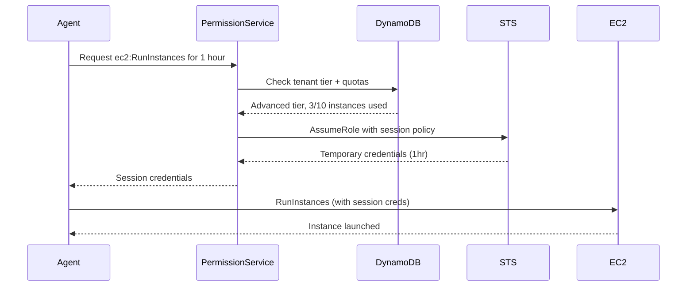

# IAM Scoping & Least Privilege for Chimera Agents

---
**Date:** 2026-03-20
**Purpose:** Define IAM permission patterns for multi-tenant agent platform with least-privilege access to AWS services
**Scope:** IAM roles, policies, permission boundaries, Cedar integration, and tenant isolation patterns
**Related:** [[01-AWS-Services-Audit]], [[06-Multi-Region-Operations]], infra/lib/tenant-onboarding-stack.ts
---

## Executive Summary

AWS Chimera agents must interact with **any AWS service** to complete user tasks — EC2, S3, Lambda, DynamoDB, RDS, CloudFormation, etc. This requires a sophisticated IAM architecture that:

1. **Enforces multi-tenant isolation** — Agent A (tenant X) cannot access tenant Y's data
2. **Implements least-privilege** — Agents get only the permissions needed for their tier/role
3. **Prevents privilege escalation** — Agents cannot grant themselves broader permissions
4. **Supports dynamic permissions** — Agents can request time-limited elevated access for specific tasks
5. **Integrates with Cedar policies** — Defense-in-depth authorization at IAM + application layers
6. **Scales to 1000s of tenants** — IAM role management must be automated and performant

This document covers:
- **Tenant IAM role architecture** with partition and prefix isolation
- **Permission boundary patterns** to prevent privilege escalation
- **Session-scoped credentials** for temporary elevated access
- **Service control policies (SCPs)** for organization-level guardrails
- **Cedar policy integration** for application-layer authorization
- **Cross-account access patterns** for enterprise tenants with existing AWS accounts

---

## 1. Tenant IAM Role Architecture

### 1.1 Per-Tenant IAM Roles

Each tenant gets a dedicated IAM role assumed by Bedrock AgentCore Runtime. The role name follows the pattern:

```
chimera-tenant-{tenantId}-{environment}
```

**Trust Policy:**
```json
{
  "Version": "2012-10-17",
  "Statement": [{
    "Effect": "Allow",
    "Principal": { "Service": "bedrock.amazonaws.com" },
    "Action": "sts:AssumeRole",
    "Condition": {
      "StringEquals": {
        "aws:SourceAccount": "123456789012"
      }
    }
  }]
}
```

The `aws:SourceAccount` condition prevents confused deputy attacks where a malicious actor tricks Bedrock in a different account into assuming the role.

**Implementation Reference:** `infra/lib/tenant-onboarding-stack.ts:278-300`

---

### 1.2 DynamoDB Partition Isolation via LeadingKeys

Multi-tenant DynamoDB tables use **partition key prefixes** to isolate tenant data:

```
PK = TENANT#{tenantId}
SK = <resource-specific>
```

IAM policy enforces that agents can only access items with their tenant's partition key:

```json
{
  "Version": "2012-10-17",
  "Statement": [
    {
      "Effect": "Allow",
      "Action": [
        "dynamodb:GetItem",
        "dynamodb:PutItem",
        "dynamodb:UpdateItem",
        "dynamodb:DeleteItem",
        "dynamodb:Query"
      ],
      "Resource": [
        "arn:aws:dynamodb:us-east-1:123456789012:table/chimera-*-prod",
        "arn:aws:dynamodb:us-east-1:123456789012:table/chimera-*-prod/index/*"
      ]
    },
    {
      "Effect": "Deny",
      "Action": "dynamodb:*",
      "Resource": [
        "arn:aws:dynamodb:us-east-1:123456789012:table/chimera-*-prod",
        "arn:aws:dynamodb:us-east-1:123456789012:table/chimera-*-prod/index/*"
      ],
      "Condition": {
        "ForAllValues:StringNotLike": {
          "dynamodb:LeadingKeys": ["TENANT#abc123*"]
        }
      }
    }
  ]
}
```

**Critical insight:** The `Deny` statement uses `ForAllValues:StringNotLike` to block queries that don't start with the tenant's partition key. This prevents **GSI cross-tenant leakage** where a malicious agent queries a GSI without filtering by `tenantId`.

**Why this works:**
- DynamoDB's `LeadingKeys` condition key contains the partition key values being accessed
- The `ForAllValues` modifier checks that **all** accessed keys match the pattern
- Wildcard `TENANT#abc123*` allows access to all items under this tenant (including sub-partitions like `TENANT#abc123#USER#456`)

**Implementation Reference:** `infra/lib/tenant-onboarding-stack.ts:306-327`

---

### 1.3 S3 Prefix Isolation

Tenant data in S3 uses a prefix-based isolation pattern:

```
s3://chimera-tenants-prod/tenants/{tenantId}/...
```

IAM policy restricts agents to their prefix:

```json
{
  "Version": "2012-10-17",
  "Statement": [
    {
      "Effect": "Allow",
      "Action": [
        "s3:GetObject",
        "s3:PutObject",
        "s3:DeleteObject",
        "s3:ListBucket"
      ],
      "Resource": [
        "arn:aws:s3:::chimera-tenants-prod/tenants/abc123/*"
      ]
    },
    {
      "Effect": "Allow",
      "Action": "s3:ListBucket",
      "Resource": "arn:aws:s3:::chimera-tenants-prod",
      "Condition": {
        "StringLike": {
          "s3:prefix": "tenants/abc123/*"
        }
      }
    }
  ]
}
```

**Read-only access to shared skills:**
```json
{
  "Effect": "Allow",
  "Action": "s3:GetObject",
  "Resource": [
    "arn:aws:s3:::chimera-skills-prod/skills/global/*",
    "arn:aws:s3:::chimera-skills-prod/skills/tenant/abc123/*"
  ]
}
```

**Implementation Reference:** `infra/lib/tenant-onboarding-stack.ts:328-342`

---

### 1.4 Tier-Based Model Access

Different subscription tiers get different Bedrock model access:

| Tier | Allowed Models | Monthly Budget |
|------|----------------|----------------|
| **Basic** | Claude Haiku, Nova Lite | $100 |
| **Advanced** | Claude Sonnet/Haiku, Nova (all) | $1,000 |
| **Enterprise** | Claude Opus/Sonnet/Haiku, Nova (all) | $10,000 |

IAM policy encodes tier restrictions:

```json
{
  "Effect": "Allow",
  "Action": [
    "bedrock:InvokeModel",
    "bedrock:InvokeModelWithResponseStream"
  ],
  "Resource": [
    "arn:aws:bedrock:us-east-1::foundation-model/anthropic.claude-sonnet-*",
    "arn:aws:bedrock:us-east-1::foundation-model/anthropic.claude-haiku-*",
    "arn:aws:bedrock:us-east-1::foundation-model/amazon.nova-*"
  ]
}
```

**Why IAM instead of application logic:**
- **Defense in depth** — Even if application authorization is bypassed, IAM blocks unauthorized model access
- **Audit trail** — CloudTrail logs IAM-denied requests for security analysis
- **Cost control** — Prevents expensive model usage from billing surprises

**Implementation Reference:** `infra/lib/tenant-onboarding-stack.ts:342-355`

---

### 1.5 Secrets Manager Isolation

Tenant-specific API keys and credentials are stored in Secrets Manager with prefix isolation:

```
chimera/{tenantId}/github-token
chimera/{tenantId}/stripe-api-key
chimera/{tenantId}/custom-llm-endpoint
```

IAM policy restricts access:

```json
{
  "Effect": "Allow",
  "Action": "secretsmanager:GetSecretValue",
  "Resource": "arn:aws:secretsmanager:us-east-1:123456789012:secret:chimera/abc123/*"
}
```

**Encryption:** All secrets are encrypted with KMS keys — either the platform key (SecurityStack) or tenant-specific CMKs for enterprise tiers.

**Implementation Reference:** `infra/lib/tenant-onboarding-stack.ts:356-361`

---

## 2. Permission Boundaries

Permission boundaries prevent agents from escalating privileges by creating new IAM roles/policies with broader permissions.

### 2.1 What is a Permission Boundary?

A **permission boundary** is a maximum set of permissions an IAM entity can have. Even if an agent's role has `iam:CreateRole`, the newly created role cannot exceed the boundary.

**Architecture:**
```
Agent Role
  ├─ Inline Policy (tenant-scoped permissions)
  └─ Permission Boundary (organization-wide limits)
```

### 2.2 Chimera Permission Boundary

All tenant IAM roles have this boundary attached:

```json
{
  "Version": "2012-10-17",
  "Statement": [
    {
      "Sid": "AllowManagedServices",
      "Effect": "Allow",
      "Action": [
        "dynamodb:*",
        "s3:*",
        "bedrock:InvokeModel*",
        "secretsmanager:GetSecretValue",
        "lambda:InvokeFunction",
        "sqs:SendMessage",
        "sqs:ReceiveMessage",
        "sns:Publish",
        "events:PutEvents",
        "cloudwatch:PutMetricData",
        "logs:CreateLogGroup",
        "logs:CreateLogStream",
        "logs:PutLogEvents"
      ],
      "Resource": "*"
    },
    {
      "Sid": "DenyIAMModification",
      "Effect": "Deny",
      "Action": [
        "iam:CreateUser",
        "iam:CreateRole",
        "iam:CreatePolicy",
        "iam:AttachUserPolicy",
        "iam:AttachRolePolicy",
        "iam:PutUserPolicy",
        "iam:PutRolePolicy",
        "iam:DeleteUserPolicy",
        "iam:DeleteRolePolicy",
        "iam:UpdateAssumeRolePolicy"
      ],
      "Resource": "*"
    },
    {
      "Sid": "DenyOrganizationChanges",
      "Effect": "Deny",
      "Action": [
        "organizations:*",
        "account:*"
      ],
      "Resource": "*"
    },
    {
      "Sid": "DenyBillingAccess",
      "Effect": "Deny",
      "Action": [
        "aws-portal:*",
        "budgets:*",
        "ce:*"
      ],
      "Resource": "*"
    }
  ]
}
```

**Why this matters:**
- Agent creates a Lambda function that needs DynamoDB access → allowed
- Agent tries to create an IAM role with `iam:*` permissions → **denied by boundary**
- Agent tries to modify its own role's inline policy → **denied by boundary**

### 2.3 Applying Permission Boundaries via CDK

```typescript
import * as iam from 'aws-cdk-lib/aws-iam';

// Create permission boundary policy
const permissionBoundary = new iam.ManagedPolicy(this, 'TenantPermissionBoundary', {
  managedPolicyName: `chimera-tenant-boundary-${envName}`,
  statements: [/* statements from above */],
});

// Apply to tenant role
const tenantRole = new iam.Role(this, 'TenantRole', {
  assumedBy: new iam.ServicePrincipal('bedrock.amazonaws.com'),
  permissionssBoundary: permissionBoundary,
});
```

**CDK Implementation Pattern:** Create the boundary as a `ManagedPolicy` so it can be referenced across stacks. All tenant roles reference the same boundary ARN.

---

## 3. Session-Scoped Credentials

Agents may need temporary elevated permissions for specific tasks. Example: an agent needs to create an EC2 instance for a user, but the tenant role doesn't have `ec2:RunInstances` by default.

### 3.1 Dynamic Permission Request Flow



### 3.2 Session Policy Pattern

Session policies **further restrict** the assumed role's permissions — they cannot expand them.

```python
import boto3

sts = boto3.client('sts')

# Session policy grants only EC2 launch permission
session_policy = {
    "Version": "2012-10-17",
    "Statement": [{
        "Effect": "Allow",
        "Action": "ec2:RunInstances",
        "Resource": "*",
        "Condition": {
            "StringEquals": {
                "aws:RequestedRegion": "us-east-1"
            },
            "NumericLessThanEquals": {
                "ec2:InstanceCount": "5"
            }
        }
    }]
}

# Agent assumes its tenant role with the session policy
response = sts.assume_role(
    RoleArn='arn:aws:iam::123456789012:role/chimera-tenant-abc123-prod',
    RoleSessionName='agent-session-ec2-launch',
    Policy=json.dumps(session_policy),
    DurationSeconds=3600  # 1 hour
)

# Use session credentials
ec2 = boto3.client(
    'ec2',
    aws_access_key_id=response['Credentials']['AccessKeyId'],
    aws_secret_access_key=response['Credentials']['SecretAccessKey'],
    aws_session_token=response['Credentials']['SessionToken']
)

ec2.run_instances(ImageId='ami-12345', InstanceType='t3.micro', MinCount=1, MaxCount=1)
```

**Key points:**
- Session policy intersects with (restricts) the role's inline policy
- `DurationSeconds` limits credential lifetime (default 1 hour, max 12 hours)
- `RoleSessionName` appears in CloudTrail for audit logging

### 3.3 Permission Request Service

Chimera implements a `PermissionRequestService` that:

1. **Validates request** against tenant tier and quotas
2. **Generates session policy** with constraints (region, resource type, count)
3. **Records request in audit log** (DynamoDB `chimera-audit` table)
4. **Returns temporary credentials** to agent
5. **Expires credentials** automatically after time limit

```typescript
// packages/core/src/permissions/permission-request-service.ts
export class PermissionRequestService {
  async requestPermission(
    tenantId: string,
    action: string,
    resource: string,
    durationSeconds: number
  ): Promise<TemporaryCredentials> {
    // 1. Validate tier supports this action
    const tier = await this.getTenantTier(tenantId);
    if (!this.isActionAllowedForTier(action, tier)) {
      throw new Error(`Action ${action} not allowed for ${tier} tier`);
    }

    // 2. Check quotas
    await this.checkQuota(tenantId, action);

    // 3. Generate session policy
    const sessionPolicy = this.buildSessionPolicy(action, resource);

    // 4. AssumeRole with session policy
    const credentials = await this.sts.assumeRole({
      RoleArn: `arn:aws:iam::${this.account}:role/chimera-tenant-${tenantId}-prod`,
      RoleSessionName: `agent-${action}-${Date.now()}`,
      Policy: JSON.stringify(sessionPolicy),
      DurationSeconds: Math.min(durationSeconds, 3600), // Max 1 hour
    });

    // 5. Audit log
    await this.auditLog.record({
      tenantId,
      action: 'PERMISSION_REQUEST',
      resource: action,
      sessionName: credentials.AssumedRoleUser.AssumedRoleId,
      expiresAt: credentials.Credentials.Expiration,
    });

    return credentials.Credentials;
  }
}
```

---

## 4. Service Control Policies (SCPs)

For Chimera deployments using AWS Organizations, **Service Control Policies** provide organization-level guardrails that apply to **all** accounts, including the Chimera platform account.

### 4.1 Example SCP: Prevent Data Exfiltration

Deny all S3 operations outside the organization:

```json
{
  "Version": "2012-10-17",
  "Statement": [{
    "Effect": "Deny",
    "Action": "s3:*",
    "Resource": "*",
    "Condition": {
      "StringNotEquals": {
        "aws:PrincipalOrgID": "o-abc123xyz"
      }
    }
  }]
}
```

**Use case:** Even if an agent's IAM role is compromised, it cannot exfiltrate S3 data to an external account.

### 4.2 Example SCP: Require MFA for Sensitive Actions

```json
{
  "Version": "2012-10-17",
  "Statement": [{
    "Effect": "Deny",
    "Action": [
      "iam:DeleteUser",
      "iam:DeleteRole",
      "iam:DeletePolicy"
    ],
    "Resource": "*",
    "Condition": {
      "BoolIfExists": {
        "aws:MultiFactorAuthPresent": "false"
      }
    }
  }]
}
```

**Use case:** Platform administrators must use MFA when deleting IAM entities. Agents cannot delete IAM resources at all (blocked by permission boundary).

### 4.3 Example SCP: Restrict Regions

Prevent resource creation outside approved regions:

```json
{
  "Version": "2012-10-17",
  "Statement": [{
    "Effect": "Deny",
    "NotAction": [
      "iam:*",
      "organizations:*",
      "cloudfront:*",
      "route53:*",
      "budgets:*"
    ],
    "Resource": "*",
    "Condition": {
      "StringNotEquals": {
        "aws:RequestedRegion": [
          "us-east-1",
          "us-west-2",
          "eu-west-1"
        ]
      }
    }
  }]
}
```

**Use case:** Enforce data residency requirements (GDPR, HIPAA) by allowing only approved regions. Global services (IAM, CloudFront) are exempted.

---

## 5. Cedar Policy Integration

AWS Verified Permissions with Cedar provides **application-layer authorization** on top of IAM. This creates defense-in-depth where agents must pass **both** IAM and Cedar checks.

### 5.1 Why Cedar on Top of IAM?

| Layer | Purpose | Example |
|-------|---------|---------|
| **IAM** | Coarse-grained AWS API access | "Tenant A can call `dynamodb:Query` on any table" |
| **Cedar** | Fine-grained business logic | "Tenant A can only query items where `tenantId == 'abc123'` AND `status != 'deleted'"` |

**Key insight:** IAM cannot express attribute-based conditions on DynamoDB item content. Cedar evaluates application-level attributes like item fields, user roles, and business rules.

### 5.2 Tenant Isolation Policy

```cedar
// Deny cross-tenant data access
forbid(
  principal,
  action in [
    Chimera::Action::"read_data",
    Chimera::Action::"write_data"
  ],
  resource
) when {
  principal.tenantId != resource.tenantId
};
```

**Evaluation:**
- `principal.tenantId` comes from the JWT claim `custom:tenant_id`
- `resource.tenantId` comes from the DynamoDB item's `tenantId` attribute
- If they don't match → `forbid` blocks the action

### 5.3 Tier-Based Feature Access

```cedar
// Basic tier cannot use code interpreter
forbid(
  principal,
  action == Chimera::Action::"invoke_tool",
  resource
) when {
  principal.tier == "basic" &&
  resource.toolName == "code_interpreter"
};
```

### 5.4 Quota Enforcement

```cedar
// Block API calls if monthly quota exceeded
forbid(
  principal,
  action == Chimera::Action::"invoke_agent",
  resource
) when {
  principal.quotaRemaining <= 0
};
```

**Integration with IAM:**
1. Agent makes API call → IAM checks role permissions
2. IAM allows → Application calls Cedar policy evaluation
3. Cedar checks business rules → allows or denies
4. If Cedar allows → execute action
5. If Cedar denies → return 403 to agent

**Implementation Reference:** `infra/lib/tenant-onboarding-stack.ts:462-527`

---

## 6. Cross-Account Access Patterns

Enterprise tenants often want agents to access their existing AWS accounts (e.g., deploy infrastructure, query RDS, analyze CloudWatch logs).

### 6.1 Cross-Account IAM Role

**Tenant's AWS Account:**
```json
{
  "Version": "2012-10-17",
  "Statement": [{
    "Effect": "Allow",
    "Principal": {
      "AWS": "arn:aws:iam::123456789012:role/chimera-tenant-abc123-prod"
    },
    "Action": "sts:AssumeRole",
    "Condition": {
      "StringEquals": {
        "sts:ExternalId": "chimera-abc123-secret-xyz"
      }
    }
  }]
}
```

**Chimera Platform:**
Agent assumes the cross-account role:

```python
import boto3

sts = boto3.client('sts')

# Assume role in tenant's account
response = sts.assume_role(
    RoleArn='arn:aws:iam::999888777666:role/chimera-cross-account-access',
    RoleSessionName='agent-cross-account',
    ExternalId='chimera-abc123-secret-xyz',
    DurationSeconds=3600
)

# Use credentials to access tenant's account
ec2 = boto3.client(
    'ec2',
    aws_access_key_id=response['Credentials']['AccessKeyId'],
    aws_secret_access_key=response['Credentials']['SecretAccessKey'],
    aws_session_token=response['Credentials']['SessionToken']
)

# Now agent can list tenant's EC2 instances
instances = ec2.describe_instances()
```

**Security:**
- `ExternalId` prevents **confused deputy** attacks (a malicious tenant tricks the agent into assuming their role by guessing the role ARN)
- The external ID is stored in Secrets Manager: `chimera/{tenantId}/cross-account-external-id`
- Tenant rotates external ID regularly via API

### 6.2 CloudFormation StackSets

For multi-account enterprise deployments, use **StackSets** to provision the cross-account IAM role across all tenant accounts:

```yaml
# Template: cross-account-role.yaml
Resources:
  ChimeraCrossAccountRole:
    Type: AWS::IAM::Role
    Properties:
      RoleName: chimera-cross-account-access
      AssumeRolePolicyDocument:
        Version: '2012-10-17'
        Statement:
          - Effect: Allow
            Principal:
              AWS: !Sub 'arn:aws:iam::${ChimeraPlatformAccountId}:role/chimera-tenant-${TenantId}-prod'
            Action: sts:AssumeRole
            Condition:
              StringEquals:
                sts:ExternalId: !Ref ExternalId
      ManagedPolicyArns:
        - arn:aws:iam::aws:policy/ReadOnlyAccess
      Policies:
        - PolicyName: ChimeraAgentAccess
          PolicyDocument:
            Version: '2012-10-17'
            Statement:
              - Effect: Allow
                Action:
                  - cloudformation:*
                  - lambda:*
                  - s3:*
                  - dynamodb:*
                Resource: '*'
```

Deploy via StackSet:
```bash
aws cloudformation create-stack-set \
  --stack-set-name chimera-cross-account-roles \
  --template-body file://cross-account-role.yaml \
  --parameters ParameterKey=ChimeraPlatformAccountId,ParameterValue=123456789012 \
               ParameterKey=TenantId,ParameterValue=abc123 \
               ParameterKey=ExternalId,ParameterValue=chimera-abc123-secret-xyz \
  --capabilities CAPABILITY_NAMED_IAM
```

---

## 7. IAM Best Practices for Agents

### 7.1 Least Privilege by Default

Start with minimal permissions and expand as needed:

```json
{
  "Version": "2012-10-17",
  "Statement": [{
    "Effect": "Allow",
    "Action": [
      "dynamodb:GetItem",
      "dynamodb:Query",
      "s3:GetObject",
      "bedrock:InvokeModel"
    ],
    "Resource": "*"
  }]
}
```

Agents request elevated permissions via `PermissionRequestService` when needed.

### 7.2 Use IAM Conditions

Lock down permissions with context keys:

```json
{
  "Effect": "Allow",
  "Action": "ec2:RunInstances",
  "Resource": "*",
  "Condition": {
    "StringEquals": {
      "aws:RequestedRegion": "us-east-1",
      "ec2:InstanceType": ["t3.micro", "t3.small"]
    },
    "NumericLessThanEquals": {
      "ec2:InstanceCount": "5"
    }
  }
}
```

### 7.3 Regularly Audit IAM Policies

Use **IAM Access Analyzer** to identify unused permissions:

```bash
aws accessanalyzer create-analyzer \
  --analyzer-name chimera-unused-access \
  --type ACCOUNT

aws accessanalyzer list-findings \
  --analyzer-arn arn:aws:access-analyzer:us-east-1:123456789012:analyzer/chimera-unused-access
```

### 7.4 Enable CloudTrail for IAM Actions

All IAM operations must be logged:

```typescript
// infra/lib/observability-stack.ts
const trail = new cloudtrail.Trail(this, 'AuditTrail', {
  trailName: `chimera-audit-${envName}`,
  includeGlobalServiceEvents: true, // Logs IAM actions
  isMultiRegionTrail: true,
  managementEvents: cloudtrail.ReadWriteType.ALL,
});
```

Query IAM actions via CloudWatch Logs Insights:

```sql
fields @timestamp, eventName, userIdentity.principalId, requestParameters
| filter eventSource = "iam.amazonaws.com"
| filter userIdentity.principalId like /chimera-tenant/
| sort @timestamp desc
| limit 100
```

---

## 8. Cost Model for IAM Operations

| Operation | Cost | Notes |
|-----------|------|-------|
| **IAM API calls** | Free | CreateRole, PutRolePolicy, AssumeRole — no charge |
| **STS AssumeRole** | Free | No charge for temporary credentials |
| **CloudTrail logging** | $2/100K events | Only management events (data events excluded) |
| **IAM Access Analyzer** | $0.20/resource/month | Per IAM role analyzed |
| **Verified Permissions (Cedar)** | $0.0125/10K requests | Cedar policy evaluations |

**Total IAM costs for 1000 tenants:**
- 1000 IAM roles × $0.20/month = $200/month (Access Analyzer)
- 100K policy evaluations/day × 30 days = 300M/month = $3,750/month (Cedar)
- CloudTrail: ~50K IAM events/month = $1/month
- **Total: ~$4,000/month**

---

## 9. Security Considerations

### 9.1 Prevent Privilege Escalation

- **Permission boundaries** block agents from creating overly permissive roles
- **IAM deny policies** take precedence over allow policies — use deny to block dangerous actions
- **SCPs** provide organization-wide guardrails that cannot be bypassed

### 9.2 Audit All Permission Changes

Every IAM policy modification must trigger an alert:

```typescript
// EventBridge rule for IAM changes
const iamChangeRule = new events.Rule(this, 'IAMChangeAlert', {
  eventPattern: {
    source: ['aws.iam'],
    detailType: ['AWS API Call via CloudTrail'],
    detail: {
      eventName: [
        'CreateRole',
        'PutRolePolicy',
        'AttachRolePolicy',
        'DeleteRole',
        'DeleteRolePolicy',
      ],
      userIdentity: {
        principalId: [{ prefix: 'chimera-tenant-' }],
      },
    },
  },
  targets: [new targets.SnsTopic(alarmTopic)],
});
```

### 9.3 Rotate External IDs

For cross-account access, rotate external IDs every 90 days:

```python
# Rotation Lambda
def rotate_external_id(tenant_id: str):
    new_external_id = secrets.token_urlsafe(32)

    # Update Secrets Manager
    secretsmanager.put_secret_value(
        SecretId=f'chimera/{tenant_id}/cross-account-external-id',
        SecretString=new_external_id
    )

    # Notify tenant to update their trust policy
    sns.publish(
        TopicArn=f'arn:aws:sns:us-east-1:{tenant_account}:chimera-notifications',
        Message=f'External ID rotated. Update IAM role trust policy to: {new_external_id}'
    )
```

---

## 10. Implementation Checklist

- [ ] Create per-tenant IAM roles with DynamoDB LeadingKeys isolation
- [ ] Implement S3 prefix isolation for tenant data
- [ ] Configure tier-based Bedrock model access
- [ ] Apply permission boundaries to all tenant roles
- [ ] Deploy Cedar policy store for application-layer authorization
- [ ] Implement PermissionRequestService for dynamic permissions
- [ ] Set up cross-account access for enterprise tenants
- [ ] Configure CloudTrail logging for IAM actions
- [ ] Deploy IAM Access Analyzer for unused permission detection
- [ ] Create EventBridge rules for IAM change alerts
- [ ] Document IAM policy patterns in runbooks
- [ ] Test privilege escalation scenarios (red team)

---

## 11. References

- [AWS IAM Best Practices](https://docs.aws.amazon.com/IAM/latest/UserGuide/best-practices.html)
- [DynamoDB Condition Keys](https://docs.aws.amazon.com/amazondynamodb/latest/developerguide/iam-condition-keys.html)
- [Cedar Policy Language](https://www.cedarpolicy.com/)
- [AWS Permission Boundaries](https://docs.aws.amazon.com/IAM/latest/UserGuide/access_policies_boundaries.html)
- [Service Control Policies](https://docs.aws.amazon.com/organizations/latest/userguide/orgs_manage_policies_scps.html)
- [IAM Access Analyzer](https://docs.aws.amazon.com/IAM/latest/UserGuide/what-is-access-analyzer.html)

**Related Chimera Documentation:**
- `infra/lib/tenant-onboarding-stack.ts` — IAM role creation implementation
- `infra/lib/security-stack.ts` — Cognito and KMS configuration
- `docs/architecture/canonical-data-model.md` — DynamoDB partition key design
- `docs/research/architecture-reviews/Chimera-Architecture-Review-Security.md` — Security architecture review
