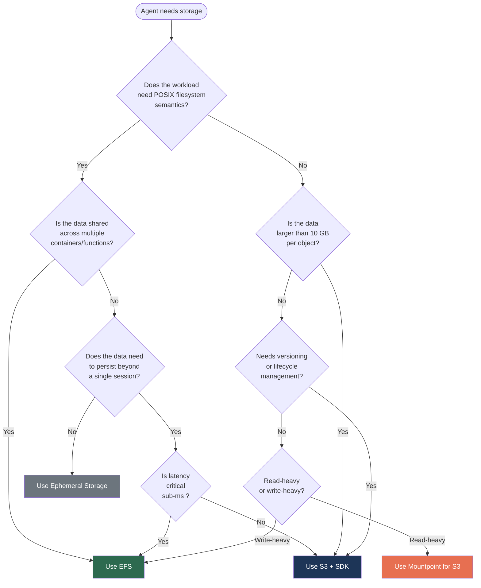
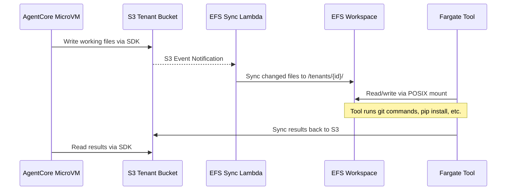
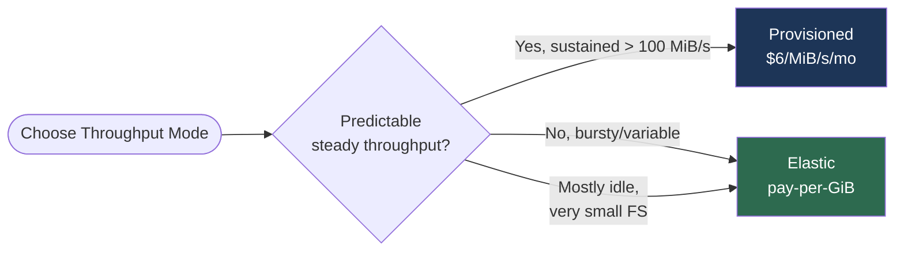
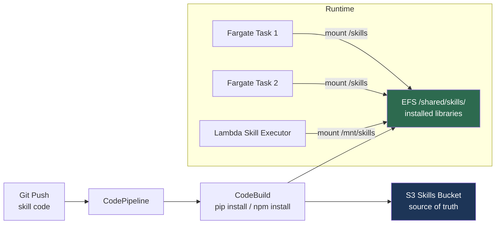
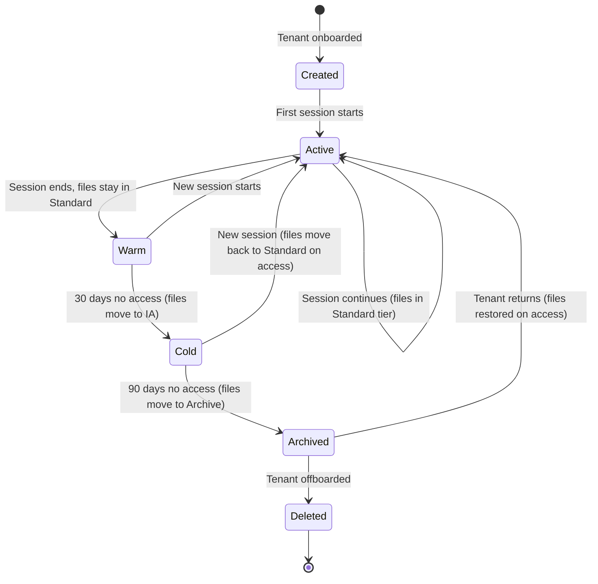
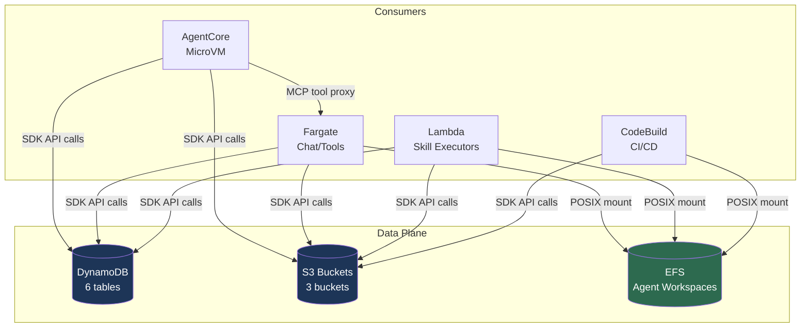

---
tags:
  - chimera
  - efs
  - storage
  - aws
  - agent-workspace
date: 2026-03-19
topic: EFS & Agent Workspace Storage for Chimera
status: complete
related:
  - "[[Chimera-AWS-Component-Blueprint]]"
  - "[[Chimera-Final-Architecture-Plan]]"
  - "[[AWS Bedrock AgentCore and Strands Agents/06-AWS-Services-Agent-Infrastructure]]"
  - "[[Chimera-Definitive-Architecture]]"
---

# EFS & Agent Workspace Storage for Chimera

> A deep dive into Amazon Elastic File System (EFS) patterns for multi-tenant AI agent
> workspaces. Covers storage architecture decisions, EFS Access Points for tenant isolation,
> integration patterns with Fargate/Lambda/AgentCore, cost modeling at scale, and CDK
> implementation code.

The existing Chimera architecture (see [[Chimera-AWS-Component-Blueprint]]) uses S3 + DynamoDB
as primary storage. This document explores **EFS as a complementary storage layer** for use
cases where agents need POSIX filesystem semantics: persistent working directories, shared
skill libraries, code repositories, and real-time file collaboration between agent components.

---

## 1. The Agent Storage Problem

AI agents are not typical web services. They have unique storage requirements that don't
map cleanly to any single AWS storage service:

| Requirement | Why Agents Need It |
|-------------|-------------------|
| **POSIX filesystem** | Agents execute code (git clone, pip install, file I/O) that expects a real filesystem |
| **Shared access** | Multiple agent instances (tool executor, code interpreter, main reasoning loop) need concurrent file access |
| **Persistent workspaces** | Agent sessions can span hours; workspace state must survive container restarts |
| **Tenant isolation** | Multi-tenant platform requires hard boundaries between tenant data |
| **Elastic capacity** | Storage needs vary wildly: one tenant has 50 MB of scripts, another has 10 GB of data |
| **Cost efficiency at scale** | Most workspace data is warm (active session) or cold (historical); tiering is essential |
| **Low-latency metadata** | Agent tools perform many small file operations (ls, stat, read config files) |

> [!info] Key Insight: The Storage Spectrum
> No single storage service covers all agent needs. The right architecture uses
> **S3 for bulk data and artifacts**, **DynamoDB for metadata and state**, and
> **EFS for POSIX workspace access**. Each handles what it does best.

---

## 2. Storage Decision Matrix: EFS vs S3 vs Ephemeral vs EBS

### 2.1 Feature Comparison

| Dimension | EFS | S3 | Ephemeral (Container/MicroVM) | EBS |
|-----------|-----|-----|-------------------------------|-----|
| **Access pattern** | POSIX filesystem (NFS 4.1) | Object API (GET/PUT/LIST) | Local filesystem | Block device |
| **Concurrency** | Thousands of simultaneous mounts | Unlimited concurrent readers | Single container only | Single instance (Multi-Attach limited to 16) |
| **Persistence** | Persistent across mounts | Persistent (object store) | Lost on container stop | Persistent but single-AZ |
| **Max size** | Petabytes (auto-scaling) | Virtually unlimited | 200 GB (Fargate), 10 GB (Lambda /tmp) | 64 TiB per volume |
| **Latency** | Sub-ms (Standard), ms (IA) | 10-100ms first byte | Sub-ms (local disk) | Sub-ms |
| **Throughput** | Up to 10+ GiB/s (Elastic) | 100+ Gbps aggregate | Depends on instance | Up to 4,000 MiB/s (io2) |
| **Multi-AZ** | Regional (3+ AZ) or One Zone | Regional (3+ AZ) | Single AZ (container placement) | Single AZ only |
| **Encryption** | At rest (KMS) + in transit (TLS) | At rest (SSE) + in transit (HTTPS) | Depends on host | At rest (KMS) |
| **Access control** | IAM + Access Points + POSIX + SG | IAM + Bucket policies + ACLs | Container IAM role | IAM + volume attachment |
| **Cost (per GB/mo)** | $0.30 (Standard), $0.0225 (IA), $0.011 (Archive) | $0.023 (Standard), $0.0125 (IA) | Included in compute | $0.08-$0.125 (gp3/io2) |
| **Fargate support** | Native mount via task definition | Via SDK only (no mount) | Native (ephemeral storage) | Not supported |
| **Lambda support** | Native mount via access point | Via SDK only | /tmp (512 MB - 10 GB) | Not supported |
| **AgentCore support** | Not natively mountable (MicroVM) | Via SDK | Ephemeral per session | Not supported |

### 2.2 Decision Flowchart



### 2.3 When to Use Which: Chimera Mapping

| Chimera Component | Recommended Storage | Rationale |
|-------------------|-------------------|-----------|
| **Agent session memory** | DynamoDB + S3 snapshots | Structured data, need for queries and TTL |
| **Code interpreter sandbox** | Ephemeral (MicroVM) | Isolated per execution, destroyed after |
| **Persistent agent workspace** (git repos, working dirs) | **EFS** | POSIX needed for git/npm/pip, persists across sessions |
| **Shared skill libraries** (SKILL.md + code) | **EFS** (read) + S3 (source of truth) | EFS for fast POSIX reads; S3 for versioned storage |
| **Tenant documents & uploads** | S3 (tenant bucket) | Object storage with lifecycle, versioning |
| **Evaluation datasets** | S3 | Large files, read-heavy, infrequent modification |
| **Cedar policies** | S3 | Small files, versioned, deployed from Git |
| **Build artifacts** | S3 | Reproducible from source, lifecycle-managed |
| **Agent tool outputs** (generated files, reports) | S3 (write) + EFS (working copy) | Write results to S3 for durability; EFS for in-progress work |
| **Shared config / environment files** | **EFS** | Multiple containers need consistent config reads |

> [!tip] Hybrid Pattern: EFS as Hot Cache, S3 as Cold Store
> The most effective pattern for agent workspaces is to use EFS as the active
> working filesystem and S3 as the durable backing store. On session start, sync
> relevant files from S3 to EFS. On session end (or periodically), sync modified
> files back to S3. This gives you POSIX semantics during work and object storage
> durability for long-term persistence.

---

## 3. EFS Architecture for Multi-Tenant Agent Workspaces

### 3.1 Core Design: One File System, Many Access Points

The recommended pattern for Chimera is a **single Regional EFS file system** with
**one Access Point per tenant**. This provides:

- **Cost efficiency**: One file system, no per-tenant infrastructure overhead
- **Hard isolation**: Each Access Point enforces a unique root directory and POSIX identity
- **Simple management**: Access Points are lightweight (up to 1,000 per file system)
- **IAM integration**: Policies can restrict which principals use which Access Points

```
EFS File System: chimera-workspaces
|
|-- /tenants/
|   |-- /acme/                    <-- Access Point: fsap-acme (uid: 10001)
|   |   |-- /workspace/           <-- Active agent working directory
|   |   |-- /repos/               <-- Cloned git repositories
|   |   |-- /tools/               <-- Tenant-specific tool installations
|   |   |-- /.cache/              <-- pip/npm cache for faster installs
|   |
|   |-- /globex/                  <-- Access Point: fsap-globex (uid: 10002)
|   |   |-- /workspace/
|   |   |-- /repos/
|   |   |-- /tools/
|   |   |-- /.cache/
|   |
|   |-- /initech/                 <-- Access Point: fsap-initech (uid: 10003)
|       |-- ...
|
|-- /shared/                      <-- Access Point: fsap-shared-ro (uid: 65534, read-only)
|   |-- /skills/                  <-- Platform skill libraries (synced from S3)
|   |   |-- /code-review/
|   |   |-- /web-search/
|   |   |-- /data-analyst/
|   |-- /runtimes/                <-- Shared Python/Node environments
|   |-- /templates/               <-- Prompt templates, config templates
```

### 3.2 Access Point Configuration

Each tenant Access Point enforces three things:

1. **Root directory**: `/tenants/{tenantId}` -- the tenant cannot see or access parent directories
2. **POSIX user identity**: Unique UID/GID per tenant -- prevents cross-tenant file access even if Access Point misconfigured
3. **Directory creation ACL**: Auto-creates the root directory with correct permissions on first mount

```typescript
// Per-tenant Access Point configuration
const tenantAccessPoint = fileSystem.addAccessPoint(`AP-${tenantId}`, {
  // Enforce root directory -- tenant sees this as "/"
  path: `/tenants/${tenantId}`,

  // Auto-create directory on first access
  createAcl: {
    ownerUid: `${10000 + tenantIndex}`,  // Unique UID per tenant
    ownerGid: '10000',                    // Shared GID for all tenants (platform group)
    permissions: '750',                    // Owner: rwx, Group: r-x, Other: ---
  },

  // Enforce POSIX identity for all operations through this AP
  posixUser: {
    uid: `${10000 + tenantIndex}`,
    gid: '10000',
  },
});
```

### 3.3 IAM Policy for Access Point Enforcement

Combine Access Points with IAM to ensure each tenant's compute resources can only mount their own Access Point:

```json
{
  "Version": "2012-10-17",
  "Statement": [
    {
      "Sid": "AllowTenantEFSAccess",
      "Effect": "Allow",
      "Action": [
        "elasticfilesystem:ClientMount",
        "elasticfilesystem:ClientWrite"
      ],
      "Resource": "arn:aws:elasticfilesystem:us-west-2:123456789:file-system/fs-abc123",
      "Condition": {
        "StringEquals": {
          "elasticfilesystem:AccessPointArn": "arn:aws:elasticfilesystem:us-west-2:123456789:access-point/fsap-tenant-acme"
        }
      }
    }
  ]
}
```

> [!warning] Access Point Limits
> EFS supports up to **1,000 Access Points per file system**. For Chimera at
> 1,000+ tenants, you would need multiple EFS file systems with a routing layer.
> At 100 tenants (Phase 1 target), this is not a concern.

### 3.4 Security Model: Defense in Depth

| Layer | Mechanism | What It Prevents |
|-------|-----------|-----------------|
| **Network** | VPC Security Groups on mount targets | Unauthorized network access to EFS |
| **Transport** | TLS encryption in transit (mount -o tls) | Eavesdropping on NFS traffic |
| **Identity** | IAM policies with Access Point conditions | Wrong compute resource mounting wrong AP |
| **Access Point** | Root directory + POSIX user enforcement | Tenant seeing other tenants' files |
| **POSIX** | File permissions (750) + unique UIDs | Cross-tenant access even without AP |
| **Encryption** | EFS encryption at rest (KMS) | Data exposure from disk access |

---

## 4. EFS Integration Patterns

### 4.1 EFS + Fargate (Chat Service, Tool Executors)

Fargate natively supports EFS volumes in task definitions. This is the primary
integration point for Chimera's chat service and tool executor containers.

```typescript
// CDK: Fargate task with EFS volume mount
import * as ecs from 'aws-cdk-lib/aws-ecs';
import * as efs from 'aws-cdk-lib/aws-efs';

const taskDefinition = new ecs.FargateTaskDefinition(this, 'AgentTask', {
  cpu: 1024,
  memoryLimitMiB: 4096,
});

// Add EFS volume to task definition
taskDefinition.addVolume({
  name: 'tenant-workspace',
  efsVolumeConfiguration: {
    fileSystemId: agentWorkspaceFs.fileSystemId,
    transitEncryption: 'ENABLED',
    authorizationConfig: {
      accessPointId: tenantAccessPoint.accessPointId,
      iam: 'ENABLED',
    },
  },
});

// Mount in container
const container = taskDefinition.addContainer('agent-worker', {
  image: ecs.ContainerImage.fromEcrRepository(agentRepo, 'latest'),
  logging: ecs.LogDrivers.awsLogs({ streamPrefix: 'agent' }),
});

container.addMountPoints({
  containerPath: '/workspace',
  sourceVolume: 'tenant-workspace',
  readOnly: false,
});

// Shared skills volume (read-only)
taskDefinition.addVolume({
  name: 'shared-skills',
  efsVolumeConfiguration: {
    fileSystemId: agentWorkspaceFs.fileSystemId,
    transitEncryption: 'ENABLED',
    authorizationConfig: {
      accessPointId: sharedSkillsAccessPoint.accessPointId,
      iam: 'ENABLED',
    },
  },
});

container.addMountPoints({
  containerPath: '/skills',
  sourceVolume: 'shared-skills',
  readOnly: true,
});
```

> [!info] Fargate Platform Version
> EFS support requires Fargate platform version 1.4.0 or later. When using CDK,
> specify `platformVersion: ecs.FargatePlatformVersion.LATEST` explicitly if your
> default might be older.

### 4.2 EFS + Lambda (Skill Executors, Event Handlers)

Lambda functions can mount EFS for access to shared data, skill libraries, or
tenant workspaces. This is useful for lightweight tool execution that needs
filesystem access without a full Fargate task.

```typescript
import * as lambda from 'aws-cdk-lib/aws-lambda';
import * as efs from 'aws-cdk-lib/aws-efs';
import * as ec2 from 'aws-cdk-lib/aws-ec2';

// Lambda must be in a VPC to access EFS
const skillExecutor = new lambda.Function(this, 'SkillExecutor', {
  runtime: lambda.Runtime.PYTHON_3_12,
  handler: 'index.handler',
  code: lambda.Code.fromAsset('./skill-executor'),
  vpc: vpc,
  vpcSubnets: { subnetType: ec2.SubnetType.PRIVATE_WITH_EGRESS },

  // Mount tenant workspace via Access Point
  filesystem: lambda.FileSystem.fromEfsAccessPoint(
    tenantAccessPoint,
    '/mnt/workspace'  // Must start with /mnt/
  ),

  // EFS connection adds cold start latency (~1-3s)
  // Use provisioned concurrency for latency-sensitive tools
  timeout: cdk.Duration.seconds(60),
  memorySize: 1024,
});
```

> [!warning] Lambda + EFS Cold Start
> Lambda functions with EFS mounts incur additional cold start latency of
> **1-3 seconds** for the NFS connection setup. For latency-sensitive agent tools,
> use **provisioned concurrency** or consider Fargate instead. The connection
> stays warm for subsequent invocations within the same execution environment.

### 4.3 EFS + AgentCore Runtime (MicroVM Considerations)

AgentCore Runtime uses Firecracker MicroVMs with **ephemeral, isolated filesystems**.
Each session gets its own dedicated MicroVM with isolated compute, memory, and
filesystem resources. After session completion, the MicroVM is terminated and all
data is destroyed.

**EFS cannot be directly mounted into AgentCore MicroVMs** -- the runtime manages
its own filesystem isolation. However, there are two integration patterns:

#### Pattern A: Sidecar Proxy via Gateway Tool

Register an MCP tool that runs on Fargate with EFS mounted. The AgentCore agent
calls this tool for filesystem operations:

```python
# MCP tool running on Fargate with EFS mounted at /workspace
from strands import tool

@tool
def workspace_read(path: str, tenant_id: str) -> str:
    """Read a file from the tenant's persistent workspace."""
    safe_path = os.path.join('/workspace', os.path.normpath(path))
    if not safe_path.startswith('/workspace/'):
        raise ValueError("Path traversal detected")
    with open(safe_path, 'r') as f:
        return f.read()

@tool
def workspace_write(path: str, content: str, tenant_id: str) -> str:
    """Write a file to the tenant's persistent workspace."""
    safe_path = os.path.join('/workspace', os.path.normpath(path))
    if not safe_path.startswith('/workspace/'):
        raise ValueError("Path traversal detected")
    os.makedirs(os.path.dirname(safe_path), exist_ok=True)
    with open(safe_path, 'w') as f:
        f.write(content)
    return f"Written {len(content)} bytes to {path}"

@tool
def workspace_list(path: str = "/", tenant_id: str = "") -> list:
    """List files in the tenant's persistent workspace directory."""
    safe_path = os.path.join('/workspace', os.path.normpath(path))
    if not safe_path.startswith('/workspace/'):
        raise ValueError("Path traversal detected")
    entries = []
    for entry in os.scandir(safe_path):
        entries.append({
            "name": entry.name,
            "is_dir": entry.is_dir(),
            "size": entry.stat().st_size if entry.is_file() else 0,
        })
    return entries
```

#### Pattern B: S3-Backed with EFS Sync

Use S3 as the durable store that AgentCore can access via SDK, with a background
sync process that mirrors active tenant workspaces to EFS for Fargate/Lambda tools:



> [!tip] Recommendation for Chimera
> Use **Pattern A (Sidecar Proxy)** for Phase 0-1. It's simpler, has fewer moving
> parts, and leverages AgentCore Gateway's existing MCP tool routing. Pattern B
> is better for Phase 2+ when you have high-throughput batch operations that
> benefit from direct POSIX access on EFS.

---

## 5. EFS Performance: Throughput Modes and Storage Classes

### 5.1 Throughput Mode Comparison

EFS offers three throughput modes. The choice significantly impacts both performance and cost.

| Mode | How It Works | Best For | Cost Model |
|------|-------------|----------|------------|
| **Elastic** (default, recommended) | Automatically scales throughput up to 10+ GiB/s. Pay per GiB transferred. | Spiky, unpredictable workloads. Agent platforms with variable load. | $0.04/GiB read, $0.06/GiB write (us-east-1) |
| **Provisioned** | You specify throughput (1-3072 MiB/s). Pay whether used or not. | Steady, predictable high-throughput needs. | $6.00/MiB/s/month provisioned |
| **Bursting** (legacy) | Throughput scales with storage size. Burst credits for peaks. | Large datasets with occasional bursts. Not recommended for new deployments. | Included in storage price (baseline: 50 KiB/s per GiB stored) |

#### Throughput Mode Decision for Chimera



> [!tip] Start with Elastic
> For Chimera, **Elastic throughput** is the right choice for Phase 0-2. Agent
> workloads are inherently bursty -- agents are idle most of the time, then burst
> during active sessions with heavy file I/O. Elastic mode means you pay nothing
> during idle periods. Switch to Provisioned only if CloudWatch monitoring shows
> sustained throughput above 100 MiB/s where provisioned would be cheaper.

### 5.2 Storage Classes and Lifecycle Management

EFS supports automatic tiering across three storage classes:

| Storage Class | Latency | Cost (GB/mo, Regional) | Best For |
|--------------|---------|----------------------|----------|
| **Standard** | Sub-millisecond | $0.30 | Active workspaces, frequently accessed skills |
| **Infrequent Access (IA)** | Single-digit ms | $0.0225 (92% savings) | Workspaces idle > 30 days, historical data |
| **Archive** | Tens of ms | $0.011 (96% savings) | Long-term retention, rarely accessed |

**Lifecycle management** automatically moves files between tiers:

```typescript
// EFS with Intelligent-Tiering lifecycle policies
const agentWorkspace = new efs.FileSystem(this, 'AgentWorkspace', {
  vpc: props.vpc,
  throughputMode: efs.ThroughputMode.ELASTIC,
  performanceMode: efs.PerformanceMode.GENERAL_PURPOSE,
  encrypted: true,
  removalPolicy: cdk.RemovalPolicy.RETAIN,

  // Move to IA after 30 days without access
  lifecyclePolicy: efs.LifecyclePolicy.AFTER_30_DAYS,

  // Move to Archive after 90 days without access
  transitionToArchivePolicy: efs.LifecyclePolicy.AFTER_90_DAYS,

  // Move back to Standard on next access (Intelligent-Tiering)
  outOfInfrequentAccessPolicy: efs.OutOfInfrequentAccessPolicy.AFTER_1_ACCESS,
});
```

> [!info] Intelligent-Tiering for Agent Workspaces
> EFS Intelligent-Tiering is ideal for agent workspaces. Active tenants' files
> stay in Standard (sub-ms latency). When a tenant goes dormant, their entire
> workspace automatically moves to IA ($0.0225/GB) and then Archive ($0.011/GB).
> When the tenant returns, files move back to Standard on first access. This
> happens per-file, so a returning tenant only pays Standard rates for the files
> they actually use.

### 5.3 Performance Mode

| Performance Mode | IOPS | Latency | Best For |
|-----------------|------|---------|----------|
| **General Purpose** (recommended) | Up to 55,000 read, 25,000 write | Sub-millisecond | Most workloads. Agent workspaces, skill libraries. |
| **Max I/O** (legacy) | 500,000+ | Higher (ms) | Highly parallelized big data. Not needed for agents. |

> Always use **General Purpose** for Chimera. Agent workloads are latency-sensitive
> (tool calls need fast file reads) and do not require the extreme parallelism of Max I/O.

---

## 6. EFS as Shared Filesystem for Skill Libraries

### 6.1 The Skill Library Problem

Chimera skills (see [[Chimera-AWS-Component-Blueprint#1.3 AgentCore Gateway]]) are
stored in S3 as the source of truth. But agents and tool executors need to _run_ skill
code, which requires a filesystem with installed dependencies.

**Without EFS:** Each container/Lambda must download and install skill dependencies at
startup. This adds 10-30 seconds of cold start time per skill.

**With EFS:** Skill libraries are pre-installed on a shared EFS volume. Containers mount
the read-only `/shared/skills/` Access Point and have instant access to all platform skills.

### 6.2 Skill Library Sync Pipeline



### 6.3 CDK: Shared Skills Volume

```typescript
// Shared skills Access Point (read-only for consumers)
const sharedSkillsAP = agentWorkspace.addAccessPoint('SharedSkills', {
  path: '/shared/skills',
  createAcl: {
    ownerUid: '0',     // Root owns the skills directory
    ownerGid: '0',
    permissions: '755', // Everyone can read, only root can write
  },
  posixUser: {
    uid: '65534',       // nobody user for read-only consumers
    gid: '65534',
  },
});

// Skill installer Access Point (write access for CI/CD)
const skillInstallerAP = agentWorkspace.addAccessPoint('SkillInstaller', {
  path: '/shared/skills',
  createAcl: {
    ownerUid: '0',
    ownerGid: '0',
    permissions: '755',
  },
  posixUser: {
    uid: '0',           // Root user for writing
    gid: '0',
  },
});
```

---

## 7. EFS for Persistent Agent Workspaces

### 7.1 Workspace Lifecycle

Agent workspaces on EFS follow a lifecycle tied to tenant activity:



### 7.2 Workspace Structure Per Tenant

```
/tenants/{tenantId}/
|-- workspace/                    # Active working directory
|   |-- current/                  # Current session working files
|   |-- outputs/                  # Generated outputs
|
|-- repos/                        # Cloned repositories (git repos)
|   |-- my-app/
|   |-- data-pipeline/
|
|-- tools/                        # Tenant-specific tool installations
|   |-- venv/                     # Python virtual environment
|   |-- node_modules/             # Node.js dependencies
|
|-- .cache/                       # Package manager caches
|   |-- pip/
|   |-- npm/
|
|-- .config/                      # Tool configurations
|   |-- git/
|   |-- ssh/                      # SSH keys for git access
```

### 7.3 Workspace Size Estimation

| Tenant Tier | Typical Workspace | Components |
|-------------|------------------|------------|
| **Basic** | 50-200 MB | Small working dir, no repos, minimal tools |
| **Pro** | 200 MB - 2 GB | 1-3 repos, Python venv, npm cache |
| **Enterprise** | 2-10 GB | Multiple repos, large datasets, full dev env |

At 100 tenants (50 basic, 40 pro, 10 enterprise):
- Total EFS Standard: ~5 GB active + ~50 GB warm = ~55 GB
- After tiering: ~5 GB Standard + ~30 GB IA + ~20 GB Archive

---

## 8. Mountpoint for Amazon S3: An Alternative

### 8.1 What Is Mountpoint for S3?

[Mountpoint for Amazon S3](https://aws.amazon.com/s3/features/mountpoint/) is an open-source
FUSE-based file client that mounts S3 buckets as local filesystems. It provides a POSIX-like
interface to S3 data without the cost of EFS.

### 8.2 Mountpoint vs EFS Comparison

| Dimension | Mountpoint for S3 | EFS |
|-----------|------------------|-----|
| **POSIX compliance** | Partial -- no random writes, no rename, limited directory support | Full POSIX (NFS 4.1) |
| **Write support** | Sequential writes only (new files). No append, no overwrite in-place. | Full random read/write |
| **Read performance** | Excellent for large sequential reads (leverages S3 throughput) | Excellent for all patterns |
| **Metadata operations** | Slow (ls, stat require S3 LIST/HEAD calls) | Fast (NFS metadata cache) |
| **Directory support** | Synthetic -- empty dirs disappear | Full POSIX directories |
| **Cost** | S3 storage ($0.023/GB) + request costs | EFS storage ($0.30/GB Standard) |
| **Concurrent access** | Yes (read). Write only from one client. | Yes (read/write from thousands) |
| **Fargate support** | Not native (requires FUSE, privileged container) | Native task definition volume |
| **Lambda support** | Not supported | Native via access point |
| **git operations** | Does not work (requires random writes, rename) | Works fully |
| **pip/npm install** | Partially works (some operations fail) | Works fully |

### 8.3 Verdict for Chimera

> [!warning] Mountpoint for S3 is NOT suitable for agent workspaces
> Agent workspaces require full POSIX semantics: git clone, pip install, file
> editing, directory manipulation, random writes. Mountpoint for S3 explicitly
> does not support these operations. It is designed for **read-heavy analytics
> workloads** accessing large datasets, not for interactive development
> environments.
>
> **Use Mountpoint for S3** only for: read-only access to large evaluation datasets,
> training data, or bulk document stores where the agent needs to scan many files
> sequentially.

---

## 9. Cost Comparison at Scale

### 9.1 Monthly Cost Model: EFS vs S3 vs EBS

Assumptions:
- Agent workspaces average 500 MB per tenant (mix of active/idle)
- 20% of data accessed daily (active), 50% accessed weekly, 30% idle
- Throughput: 50 GiB/month read, 20 GiB/month write per active tenant
- 30% of tenants active on any given day

#### 10 Tenants

| Component | EFS (Elastic + Tiering) | S3 Only | EBS (gp3) |
|-----------|------------------------|---------|-----------|
| Storage | 5 GB total: 2 GB Standard ($0.60) + 2 GB IA ($0.045) + 1 GB Archive ($0.011) | 5 GB Standard ($0.12) | 5 GB x 10 volumes ($4.00) |
| Throughput/Requests | 15 GiB read ($0.60) + 6 GiB write ($0.36) | ~50K requests ($0.025) | Included |
| **Monthly total** | **$1.62** | **$0.14** | **$4.00** |
| POSIX support | Full | None (SDK only) | Full (single instance) |
| Multi-mount | Yes | N/A | No (1 instance per volume) |

#### 100 Tenants

| Component | EFS (Elastic + Tiering) | S3 Only | EBS (gp3) |
|-----------|------------------------|---------|-----------|
| Storage | 50 GB: 15 GB Standard ($4.50) + 20 GB IA ($0.45) + 15 GB Archive ($0.17) | 50 GB ($1.15) | 50 x 10 GB volumes ($40.00) |
| Throughput/Requests | 150 GiB read ($6.00) + 60 GiB write ($3.60) | ~500K requests ($0.25) | Included |
| **Monthly total** | **$14.72** | **$1.40** | **$40.00** |

#### 1,000 Tenants

| Component | EFS (Elastic + Tiering) | S3 Only | EBS (gp3) |
|-----------|------------------------|---------|-----------|
| Storage | 500 GB: 100 GB Standard ($30.00) + 250 GB IA ($5.63) + 150 GB Archive ($1.65) | 500 GB ($11.50) | Not feasible |
| Throughput/Requests | 1,500 GiB read ($60.00) + 600 GiB write ($36.00) | ~5M requests ($2.50) | N/A |
| **Monthly total** | **$133.28** | **$14.00** | **N/A** |

### 9.2 Cost Analysis

> [!info] EFS Costs Are Dominated by Throughput, Not Storage
> With Intelligent-Tiering, EFS storage costs are modest. The primary cost driver
> is **throughput fees** (Elastic mode charges per GiB transferred). At 1,000 tenants,
> throughput is $96/month vs $37/month for storage.
>
> If throughput exceeds 100 MiB/s sustained, evaluate switching to **Provisioned
> throughput** (fixed cost regardless of data transferred).

### 9.3 S3 is Cheaper, But EFS Provides What S3 Cannot

S3 is 5-10x cheaper per GB, but:
- S3 cannot mount as a POSIX filesystem for git/pip/npm
- S3 requires application-level code for every file operation
- S3 has higher per-operation latency (10-100ms vs sub-ms)
- S3 does not support concurrent writes to the same "file"

**The cost premium of EFS ($133 vs $14 at 1,000 tenants) buys you a fully functional
POSIX filesystem that agents can use exactly like a local disk.** This is ~$0.12/tenant/month
-- negligible compared to LLM costs ($1,282/month at 100 tenants per the Blueprint).

---

## 10. Complete CDK Implementation

### 10.1 EFS Infrastructure Construct

```typescript
// lib/constructs/agent-workspace.ts
import * as cdk from 'aws-cdk-lib';
import * as efs from 'aws-cdk-lib/aws-efs';
import * as ec2 from 'aws-cdk-lib/aws-ec2';
import * as iam from 'aws-cdk-lib/aws-iam';
import { Construct } from 'constructs';

export interface AgentWorkspaceProps {
  vpc: ec2.IVpc;
  /**
   * Security group for compute resources that will mount EFS.
   * EFS mount target SG will allow NFS (2049) from this SG.
   */
  computeSecurityGroup: ec2.ISecurityGroup;
}

export class AgentWorkspace extends Construct {
  public readonly fileSystem: efs.IFileSystem;
  public readonly fileSystemSecurityGroup: ec2.ISecurityGroup;

  constructor(scope: Construct, id: string, props: AgentWorkspaceProps) {
    super(scope, id);

    // Security group for EFS mount targets
    this.fileSystemSecurityGroup = new ec2.SecurityGroup(this, 'EfsSG', {
      vpc: props.vpc,
      description: 'EFS mount target - allows NFS from compute resources',
      allowAllOutbound: false,
    });

    // Allow NFS traffic from compute SG
    this.fileSystemSecurityGroup.addIngressRule(
      props.computeSecurityGroup,
      ec2.Port.tcp(2049),
      'NFS from compute resources',
    );

    // Regional EFS file system with Intelligent-Tiering
    this.fileSystem = new efs.FileSystem(this, 'FileSystem', {
      fileSystemName: 'chimera-agent-workspaces',
      vpc: props.vpc,
      vpcSubnets: { subnetType: ec2.SubnetType.PRIVATE_WITH_EGRESS },
      securityGroup: this.fileSystemSecurityGroup,

      // Performance
      performanceMode: efs.PerformanceMode.GENERAL_PURPOSE,
      throughputMode: efs.ThroughputMode.ELASTIC,

      // Lifecycle / Intelligent-Tiering
      lifecyclePolicy: efs.LifecyclePolicy.AFTER_30_DAYS,
      transitionToArchivePolicy: efs.LifecyclePolicy.AFTER_90_DAYS,
      outOfInfrequentAccessPolicy: efs.OutOfInfrequentAccessPolicy.AFTER_1_ACCESS,

      // Encryption & durability
      encrypted: true,
      removalPolicy: cdk.RemovalPolicy.RETAIN,

      // Enable automatic backups
      enableAutomaticBackups: true,
    });
  }

  /**
   * Create a tenant-scoped Access Point with unique POSIX identity.
   */
  public addTenantAccessPoint(tenantId: string, tenantIndex: number): efs.IAccessPoint {
    const uid = (10000 + tenantIndex).toString();
    return this.fileSystem.addAccessPoint(`AP-${tenantId}`, {
      path: `/tenants/${tenantId}`,
      createAcl: {
        ownerUid: uid,
        ownerGid: '10000',
        permissions: '750',
      },
      posixUser: {
        uid: uid,
        gid: '10000',
      },
    });
  }

  /**
   * Create a read-only Access Point for shared platform resources.
   */
  public addSharedReadOnlyAccessPoint(name: string, path: string): efs.IAccessPoint {
    return this.fileSystem.addAccessPoint(`AP-shared-${name}`, {
      path: path,
      createAcl: {
        ownerUid: '0',
        ownerGid: '0',
        permissions: '755',
      },
      posixUser: {
        uid: '65534',  // nobody
        gid: '65534',
      },
    });
  }

  /**
   * Create a write Access Point for CI/CD skill installation.
   */
  public addSkillInstallerAccessPoint(): efs.IAccessPoint {
    return this.fileSystem.addAccessPoint('AP-skill-installer', {
      path: '/shared/skills',
      createAcl: {
        ownerUid: '0',
        ownerGid: '0',
        permissions: '755',
      },
      posixUser: {
        uid: '0',
        gid: '0',
      },
    });
  }

  /**
   * Grant a role permission to mount a specific Access Point.
   */
  public grantMount(role: iam.IRole, accessPoint: efs.IAccessPoint, readOnly = false): void {
    const actions = ['elasticfilesystem:ClientMount'];
    if (!readOnly) {
      actions.push('elasticfilesystem:ClientWrite');
    }

    role.addToPrincipalPolicy(new iam.PolicyStatement({
      actions,
      resources: [this.fileSystem.fileSystemArn],
      conditions: {
        StringEquals: {
          'elasticfilesystem:AccessPointArn': accessPoint.accessPointArn,
        },
      },
    }));
  }
}
```

### 10.2 Integration in DataStack

```typescript
// lib/stacks/data-stack.ts -- additions to existing DataStack
import { AgentWorkspace } from '../constructs/agent-workspace';

// Inside DataStack constructor, after S3 buckets:

// --- EFS: Agent Workspaces ---
this.agentWorkspace = new AgentWorkspace(this, 'AgentWorkspace', {
  vpc: props.vpc,
  computeSecurityGroup: props.computeSecurityGroup,
});

// Create shared skills volume
this.sharedSkillsAP = this.agentWorkspace.addSharedReadOnlyAccessPoint(
  'skills',
  '/shared/skills',
);

this.skillInstallerAP = this.agentWorkspace.addSkillInstallerAccessPoint();
```

### 10.3 Per-Tenant EFS Setup in TenantStack

```typescript
// lib/stacks/tenant-stack.ts -- additions to existing TenantStack

// Create tenant-scoped Access Point
const tenantAP = props.agentWorkspace.addTenantAccessPoint(
  tc.tenantId,
  tc.tenantIndex, // Sequential integer for unique UID
);

// Grant the tenant role permission to mount
props.agentWorkspace.grantMount(tenantRole, tenantAP);

// Grant read-only access to shared skills
props.agentWorkspace.grantMount(tenantRole, props.sharedSkillsAP, true);

// Export Access Point ID for Fargate task definitions
new cdk.CfnOutput(this, 'TenantAccessPointId', {
  value: tenantAP.accessPointId,
  exportName: `Chimera-${envName}-Tenant-${tc.tenantId}-EfsApId`,
});
```

### 10.4 VPC Endpoint for EFS (Optional, Recommended)

```typescript
// In NetworkStack -- add EFS VPC endpoint for private connectivity
// Note: EFS uses mount targets, not VPC endpoints for data plane.
// However, the EFS API (CreateFileSystem, DescribeAccessPoints, etc.)
// benefits from a VPC endpoint for control plane operations.

this.vpc.addInterfaceEndpoint('efs-endpoint', {
  service: new ec2.InterfaceVpcEndpointAwsService('elasticfilesystem'),
  privateDnsEnabled: true,
  securityGroups: [this.endpointSecurityGroup],
});
```

---

## 11. Operational Considerations

### 11.1 Monitoring

Key CloudWatch metrics for EFS agent workspaces:

| Metric | Alarm Threshold | Action |
|--------|----------------|--------|
| `PercentIOLimit` | > 80% for 15 min | Consider Max I/O mode (unlikely needed) |
| `ClientConnections` | > 900 | Approaching Access Point limit |
| `StorageBytes` (Standard) | > 500 GB | Review if tiering is working |
| `MeteredIOBytes` | > PermittedThroughput * 0.8 | Consider Provisioned throughput |
| `BurstCreditBalance` | Only for Bursting mode | N/A for Elastic mode |

### 11.2 Backup Strategy

```typescript
// EFS automatic backups (enabled in construct above)
// AWS Backup creates daily backups with 35-day retention by default.
// For enterprise tenants, create a custom backup plan:

import * as backup from 'aws-cdk-lib/aws-backup';

const plan = new backup.BackupPlan(this, 'EfsBackupPlan', {
  backupPlanName: 'chimera-efs-enterprise',
  backupPlanRules: [
    new backup.BackupPlanRule({
      ruleName: 'daily',
      scheduleExpression: events.Schedule.cron({ hour: '3', minute: '0' }),
      deleteAfter: cdk.Duration.days(90),
    }),
    new backup.BackupPlanRule({
      ruleName: 'weekly',
      scheduleExpression: events.Schedule.cron({
        weekDay: 'SUN', hour: '3', minute: '0',
      }),
      deleteAfter: cdk.Duration.days(365),
    }),
  ],
});

plan.addSelection('EfsSelection', {
  resources: [backup.BackupResource.fromEfsFileSystem(agentWorkspace.fileSystem)],
});
```

### 11.3 Tenant Offboarding: Workspace Cleanup

When a tenant is offboarded, their EFS Access Point and workspace directory should be deleted:

```typescript
// Cleanup procedure (run as part of tenant offboarding pipeline)
// 1. Delete the Access Point (prevents new mounts)
// 2. Delete the directory contents (via a cleanup Lambda with root AP)
// 3. Remove CDK stack outputs

// Cleanup Lambda with elevated permissions
const cleanupAP = agentWorkspace.fileSystem.addAccessPoint('AP-cleanup', {
  path: '/tenants',
  posixUser: { uid: '0', gid: '0' },
});
```

### 11.4 Scaling Considerations

| Scale | Access Points | EFS File Systems | Notes |
|-------|--------------|-----------------|-------|
| 1-100 tenants | 100 APs + 3 shared = 103 | 1 | Well within 1,000 AP limit |
| 100-500 tenants | 503 | 1 | Still within limit |
| 500-1,000 tenants | 1,003 | 2 (split by tenant ID hash) | Need routing layer |
| 1,000+ tenants | N/A | N per 1,000 tenants | Automate FS selection |

---

## 12. Summary: Recommended Storage Architecture



### Storage Responsibility Matrix

| Storage | What It Stores | Who Accesses It | How |
|---------|---------------|-----------------|-----|
| **DynamoDB** | Tenant config, sessions, skills metadata, rate limits, costs, audit | All compute | SDK (GetItem, Query, PutItem) |
| **S3** | Tenant documents, memory snapshots, skill packages (source), evaluation data, artifacts, Cedar policies | All compute | SDK (GetObject, PutObject) |
| **EFS** | Active workspaces, installed skill libraries, cloned repos, package caches, shared configs | Fargate, Lambda, CodeBuild | POSIX mount via Access Points |

### Key Decisions

| Decision | Choice | Rationale |
|----------|--------|-----------|
| EFS file system type | Regional (Multi-AZ) | Durability for persistent workspaces |
| Throughput mode | Elastic | Bursty agent workloads; pay-per-use |
| Performance mode | General Purpose | Sub-ms latency for agent tool calls |
| Lifecycle tiering | Standard -> IA (30d) -> Archive (90d) | 92-96% savings on dormant workspaces |
| Tenant isolation | Access Points (1 per tenant) | Hard POSIX isolation + IAM enforcement |
| Shared skills | Read-only Access Point | Fast POSIX access without per-tenant duplication |
| AgentCore integration | MCP tool proxy on Fargate | MicroVMs cannot mount EFS directly |
| Encryption | At rest (KMS) + in transit (TLS) | Defense in depth |
| Backups | AWS Backup, daily + weekly | Recovery for workspace data |

---

## 13. References

- [Amazon EFS User Guide](https://docs.aws.amazon.com/efs/latest/ug/)
- [EFS Access Points](https://docs.aws.amazon.com/efs/latest/ug/efs-access-points.html)
- [EFS Pricing](https://aws.amazon.com/efs/pricing/)
- [EFS Performance Specifications](https://docs.aws.amazon.com/efs/latest/ug/performance.html)
- [EFS + Fargate (ECS Task Definitions)](https://docs.aws.amazon.com/AmazonECS/latest/developerguide/efs-volumes.html)
- [Lambda + EFS Configuration](https://docs.aws.amazon.com/lambda/latest/dg/configuration-filesystem.html)
- [EFS Storage Classes](https://aws.amazon.com/efs/storage-classes/)
- [Mountpoint for Amazon S3](https://aws.amazon.com/s3/features/mountpoint/)
- [Multi-Tenant S3 Access Patterns (AWS Blog)](https://aws.amazon.com/blogs/storage/design-patterns-for-multi-tenant-access-control-on-amazon-s3/)
- [AgentCore Runtime Documentation](https://docs.aws.amazon.com/bedrock-agentcore/latest/devguide/agents-tools-runtime.html)
- [CDK EFS Module](https://constructs.dev/packages/aws-cdk-lib/v/2.243.0?submodule=aws_efs&lang=typescript)
- [CDK Lambda + EFS Example](https://constructs.dev/packages/aws-cdk-lib/v/2.243.0?submodule=aws_lambda&lang=typescript)
- [Fargate + EFS CDK Example](https://github.com/aws-samples/aws-cdk-examples/tree/main/typescript/ecs/fargate-service-with-efs)

---

*Researched and authored 2026-03-19. Sources: AWS documentation, EFS pricing page, AgentCore Runtime docs, CDK construct library docs, and web research on EFS patterns for container and serverless workloads.*
