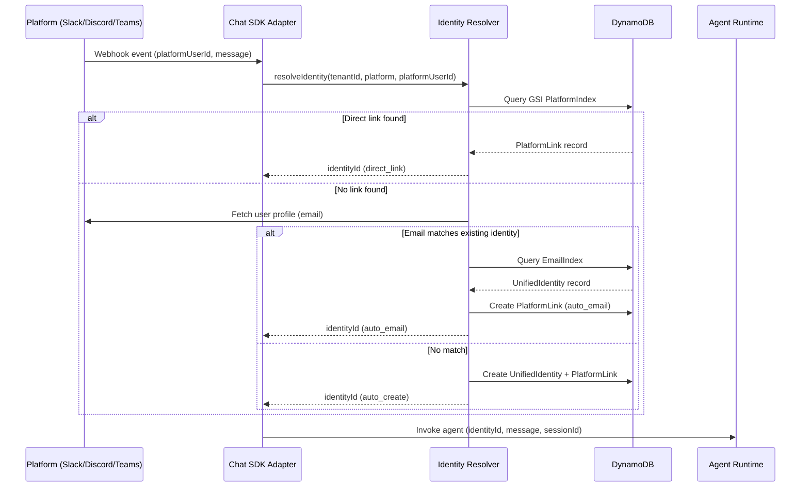
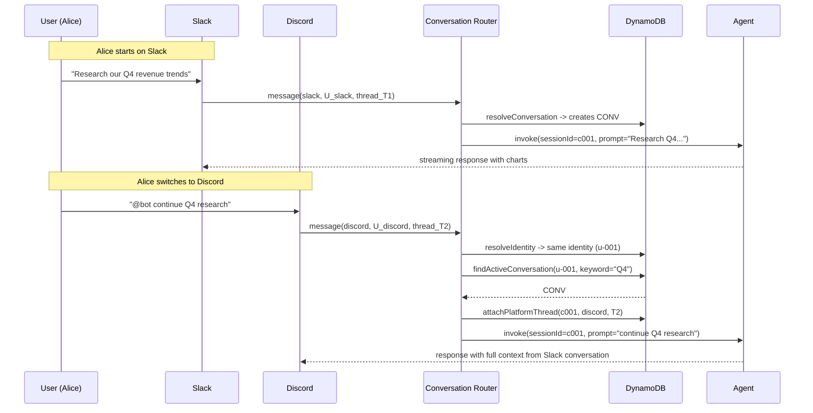
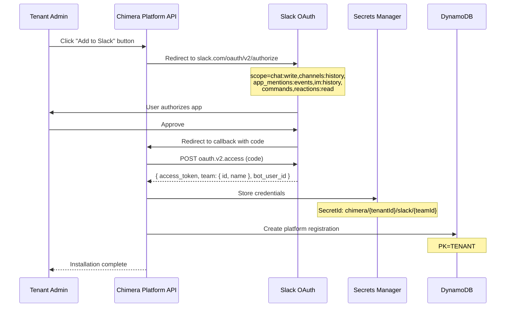
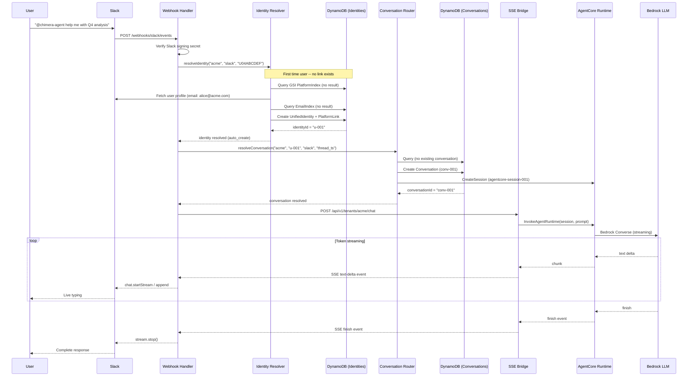
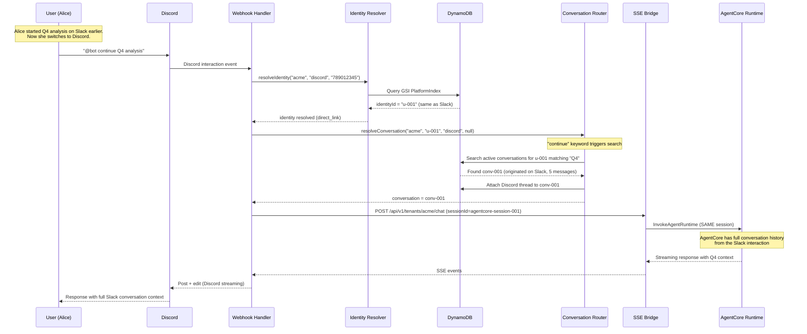
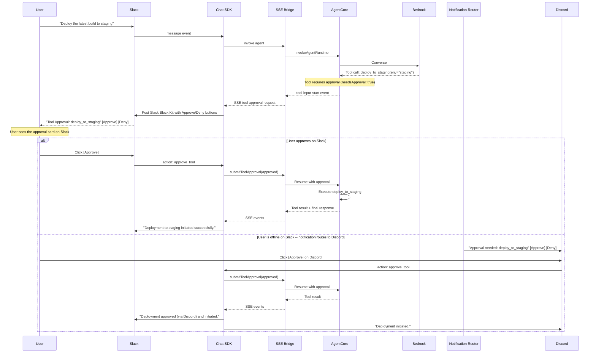
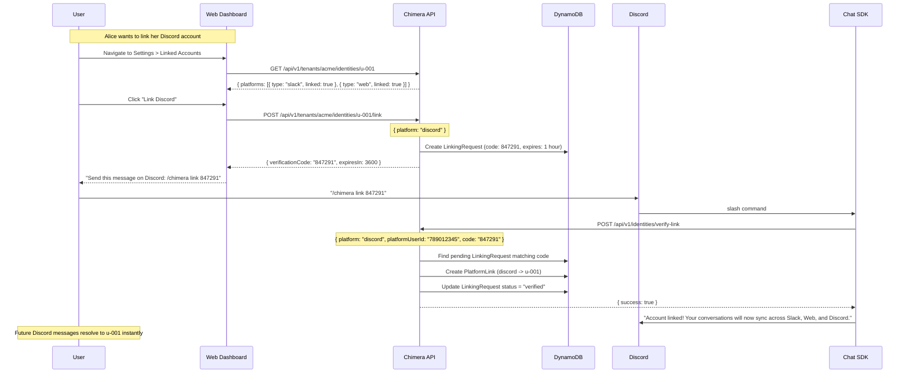

# Cross-Platform Identity & Chat Routing

> Architecture for unified identity management, conversation continuity, and chat
> routing across Slack, Discord, Microsoft Teams, and web interfaces in Chimera.

## Table of Contents

- [[#1. Overview]]
- [[#2. Identity Linking Model]]
- [[#3. Cross-Platform Conversation Continuity]]
- [[#4. Vercel Chat SDK Adapter Architecture]]
- [[#5. Message Format Normalization Layer]]
- [[#6. Platform-Specific Features]]
- [[#7. Rate Limiting per Platform]]
- [[#8. Cross-Platform Notification Routing]]
- [[#9. Bot Registration and OAuth Flows]]
- [[#10. Sequence Diagrams for Key Flows]]
- [[#11. Security Considerations]]
- [[#12. Migration and Rollout Strategy]]

---

## 1. Overview

Chimera agents must be reachable from multiple chat platforms while maintaining a
single coherent identity for each human user. This document defines:

1. **Identity linking** -- how platform-specific user IDs map to a unified tenant identity
2. **Conversation continuity** -- how a conversation started on Slack can resume on Teams
3. **Chat adapter layer** -- Vercel AI SDK-based adapters that normalize each platform
4. **Message normalization** -- a canonical message format bridging platform differences
5. **Platform features** -- leveraging native capabilities (threads, cards, reactions)
6. **Rate limiting** -- per-platform and per-user throttling
7. **Notification routing** -- delivering agent responses to the right platform
8. **Bot registration** -- OAuth and webhook setup per platform

### Design Principles

- **Platform-native UX**: Users interact through familiar platform affordances, not a
  lowest-common-denominator interface.
- **Identity-first**: Every message is attributed to a resolved identity before reaching
  the agent runtime.
- **Stateless adapters**: Platform adapters are stateless; all state lives in DynamoDB
  and the conversation store.
- **Graceful degradation**: If a platform is unreachable, messages queue and retry.
  Users can switch platforms without losing context.

### Architecture at a Glance

```
Slack ──┐                                    ┌── Agent Runtime
Discord ─┤  ┌─────────────┐  ┌────────────┐  │
Teams ───┼──│  Platform    │──│  Identity   │──┼── Tool Execution
Web UI ──┤  │  Adapters    │  │  Resolver   │  │
CLI ─────┘  └─────────────┘  └────────────┘  └── Response Router
                  │                │
                  ▼                ▼
            Message Queue    DynamoDB Tables
            (SQS/EventBridge) (Identity, Conv, Prefs)
```

---

## 2. Identity Linking Model

The identity system resolves platform-specific user IDs to a unified Chimera identity
within a tenant. This is the foundation for cross-platform continuity, personalization,
and access control.

### 2.1 Data Model Overview

Three DynamoDB tables support the identity system:

| Table | Purpose | Access Pattern |
|-------|---------|---------------|
| `chimera-identities` | Unified user profiles + platform links | By tenant+user, by platform ID |
| `chimera-conversations` | Conversation state, cross-platform threads | By session, by user |
| `chimera-preferences` | Per-user notification and platform preferences | By tenant+user |

### 2.2 DynamoDB Schema: chimera-identities

**Primary table design** -- single-table with composite keys:

```
Table: chimera-identities
  Partition Key (PK): String
  Sort Key (SK): String
  GSI-1: PlatformIndex (GSI1PK, GSI1SK) -- reverse lookup by platform ID
  GSI-2: EmailIndex (email) -- lookup by email for auto-linking
```

**Item Types:**

```typescript
// ============================================================
// Item Type 1: Unified Identity (the "user" record)
// ============================================================
interface UnifiedIdentity {
  PK: `TENANT#${tenantId}`;
  SK: `IDENTITY#${identityId}`;
  GSI1PK: `TENANT#${tenantId}`;
  GSI1SK: `IDENTITY#${identityId}`;
  entityType: 'IDENTITY';
  identityId: string;          // ulid: "01HX..."
  tenantId: string;
  displayName: string;
  email?: string;              // for auto-linking
  avatarUrl?: string;
  role: 'user' | 'admin' | 'owner';
  status: 'active' | 'suspended' | 'deleted';
  createdAt: string;           // ISO 8601
  updatedAt: string;
  lastSeenAt: string;
  lastSeenPlatform: string;    // "slack" | "discord" | "teams" | "web"
  metadata: Record<string, string>;
}

// ============================================================
// Item Type 2: Platform Link (one per platform per user)
// ============================================================
interface PlatformLink {
  PK: `TENANT#${tenantId}`;
  SK: `IDENTITY#${identityId}#PLATFORM#${platform}#${platformUserId}`;
  GSI1PK: `PLATFORM#${platform}#${platformUserId}`;
  GSI1SK: `TENANT#${tenantId}`;
  entityType: 'PLATFORM_LINK';
  identityId: string;
  tenantId: string;
  platform: 'slack' | 'discord' | 'teams' | 'web' | 'telegram' | 'github';
  platformUserId: string;      // Slack: "U04ABCDEF", Discord: "123456789012345"
  platformTeamId?: string;     // Slack workspace ID or Discord guild ID
  platformDisplayName?: string;
  platformEmail?: string;      // email from platform profile
  linkedAt: string;
  linkedBy: 'manual' | 'auto_email' | 'oauth' | 'admin';
  verified: boolean;
  oauthTokenEncrypted?: string; // encrypted ref to Secrets Manager ARN
}

// ============================================================
// Item Type 3: Linking Request (pending verification)
// ============================================================
interface LinkingRequest {
  PK: `TENANT#${tenantId}`;
  SK: `LINK_REQUEST#${requestId}`;
  GSI1PK: `PLATFORM#${platform}#${platformUserId}`;
  GSI1SK: `LINK_REQUEST#${requestId}`;
  entityType: 'LINK_REQUEST';
  requestId: string;
  tenantId: string;
  platform: string;
  platformUserId: string;
  targetIdentityId?: string;   // if linking to existing identity
  verificationCode: string;    // 6-digit code
  expiresAt: number;           // TTL epoch seconds
  status: 'pending' | 'verified' | 'expired';
}
```

### 2.3 Access Patterns

| Pattern | Key Condition | Index |
|---------|--------------|-------|
| Get user profile | `PK = TENANT#acme, SK = IDENTITY#u-001` | Table |
| List user's platform links | `PK = TENANT#acme, SK begins_with IDENTITY#u-001#PLATFORM` | Table |
| Resolve platform ID to identity | `GSI1PK = PLATFORM#slack#U04ABCDEF` | GSI-1 |
| Find identity by email | `email = alice@acme.com` | GSI-2 |
| List all identities for tenant | `PK = TENANT#acme, SK begins_with IDENTITY#` | Table |
| Get pending link requests | `PK = TENANT#acme, SK begins_with LINK_REQUEST#` | Table |

### 2.4 Identity Resolution Algorithm

When a message arrives from any platform, the identity resolver runs before
the message reaches the agent:

```typescript
async function resolveIdentity(
  tenantId: string,
  platform: string,
  platformUserId: string,
): Promise<ResolvedIdentity> {
  // Step 1: Direct lookup via GSI (fast path, ~5ms)
  const link = await dynamodb.query({
    TableName: 'chimera-identities',
    IndexName: 'PlatformIndex',
    KeyConditionExpression: 'GSI1PK = :pk',
    ExpressionAttributeValues: {
      ':pk': `PLATFORM#${platform}#${platformUserId}`,
    },
  });

  if (link.Items?.length) {
    const item = link.Items[0];
    // Filter by tenant if multi-tenant platform IDs overlap
    const tenantMatch = item.tenantId === tenantId;
    if (tenantMatch) {
      return {
        identityId: item.identityId,
        tenantId: item.tenantId,
        resolved: true,
        method: 'direct_link',
      };
    }
  }

  // Step 2: Auto-link attempt via email (if platform provides email)
  const platformProfile = await fetchPlatformProfile(platform, platformUserId);
  if (platformProfile?.email) {
    const emailMatch = await dynamodb.query({
      TableName: 'chimera-identities',
      IndexName: 'EmailIndex',
      KeyConditionExpression: 'email = :email',
      ExpressionAttributeValues: { ':email': platformProfile.email },
    });

    if (emailMatch.Items?.length) {
      // Auto-create link
      await createPlatformLink(
        tenantId,
        emailMatch.Items[0].identityId,
        platform,
        platformUserId,
        'auto_email',
      );
      return {
        identityId: emailMatch.Items[0].identityId,
        tenantId,
        resolved: true,
        method: 'auto_email',
      };
    }
  }

  // Step 3: Create new identity (first contact)
  const newIdentity = await createIdentity(tenantId, {
    displayName: platformProfile?.displayName ?? platformUserId,
    email: platformProfile?.email,
    platform,
    platformUserId,
  });

  return {
    identityId: newIdentity.identityId,
    tenantId,
    resolved: true,
    method: 'auto_create',
  };
}
```

### 2.5 Identity Resolution Sequence



### 2.6 Manual Identity Linking Flow

For cases where auto-linking fails (different emails, no email), users can
manually link via a verification code:

```typescript
// Step 1: User requests link from new platform
// POST /api/v1/tenants/{tenantId}/identities/{identityId}/link
async function requestLink(tenantId: string, identityId: string, body: {
  platform: string;
  platformUserId: string;
}): Promise<{ verificationCode: string; expiresIn: number }> {
  const code = generateSecureCode(6); // "847291"
  await dynamodb.put({
    TableName: 'chimera-identities',
    Item: {
      PK: `TENANT#${tenantId}`,
      SK: `LINK_REQUEST#${ulid()}`,
      GSI1PK: `PLATFORM#${body.platform}#${body.platformUserId}`,
      GSI1SK: `LINK_REQUEST#${ulid()}`,
      entityType: 'LINK_REQUEST',
      targetIdentityId: identityId,
      verificationCode: code,
      expiresAt: Math.floor(Date.now() / 1000) + 3600, // 1 hour TTL
      status: 'pending',
    },
  });
  return { verificationCode: code, expiresIn: 3600 };
}

// Step 2: User sends code on the OTHER platform
// The bot recognizes "link 847291" as a linking command
async function verifyLink(
  tenantId: string,
  platform: string,
  platformUserId: string,
  code: string,
): Promise<boolean> {
  // Find pending request for this platform user
  const requests = await dynamodb.query({
    TableName: 'chimera-identities',
    IndexName: 'PlatformIndex',
    KeyConditionExpression: 'GSI1PK = :pk AND begins_with(GSI1SK, :prefix)',
    ExpressionAttributeValues: {
      ':pk': `PLATFORM#${platform}#${platformUserId}`,
      ':prefix': 'LINK_REQUEST#',
    },
  });

  const match = requests.Items?.find(
    r => r.verificationCode === code && r.status === 'pending'
  );

  if (!match) return false;

  // Create the platform link
  await createPlatformLink(
    tenantId,
    match.targetIdentityId,
    platform,
    platformUserId,
    'manual',
  );

  // Mark request as verified
  await dynamodb.update({
    TableName: 'chimera-identities',
    Key: { PK: match.PK, SK: match.SK },
    UpdateExpression: 'SET #s = :v',
    ExpressionAttributeNames: { '#s': 'status' },
    ExpressionAttributeValues: { ':v': 'verified' },
  });

  return true;
}
```

### 2.7 Capacity and Cost Estimates

| Metric | Estimate |
|--------|----------|
| Identity items per tenant (1000 users, avg 2.5 platforms each) | ~3,500 items |
| Average item size | ~500 bytes |
| Storage per tenant | ~1.75 MB |
| Reads per message (identity resolution) | 1 GSI query (~5ms, 0.5 RCU) |
| GSI storage overhead | ~30% of base table |
| Monthly cost at 100 tenants, 10K msg/day each | ~$15/month (on-demand) |

---

## 3. Cross-Platform Conversation Continuity

The goal: a user starts a conversation with the agent on Slack, switches to Discord
on their phone, and the agent picks up exactly where it left off -- same context,
same memory, same tool results.

### 3.1 Conversation Model

Conversations are decoupled from platforms. A conversation belongs to an **identity**
and a **context** (topic, thread, or explicit session), not to a channel.

```typescript
// DynamoDB: chimera-conversations
interface Conversation {
  PK: `TENANT#${tenantId}#IDENTITY#${identityId}`;
  SK: `CONV#${conversationId}`;
  GSI1PK: `TENANT#${tenantId}`;
  GSI1SK: `CONV#${conversationId}`;
  entityType: 'CONVERSATION';

  conversationId: string;      // ulid
  tenantId: string;
  identityId: string;
  title?: string;              // auto-generated or user-set
  status: 'active' | 'archived' | 'deleted';

  // AgentCore session binding
  agentCoreSessionId: string;  // maps to runtimeSessionId in AgentCore
  agentId: string;             // which agent handles this conversation

  // Cross-platform tracking
  originPlatform: string;      // where conversation started
  activePlatforms: string[];   // platforms with active threads
  platformThreads: PlatformThread[];

  // Metadata
  createdAt: string;
  updatedAt: string;
  lastMessageAt: string;
  messageCount: number;
  tokenUsage: { input: number; output: number };
}

interface PlatformThread {
  platform: string;            // "slack" | "discord" | "teams" | "web"
  threadId: string;            // platform-specific thread ID
  channelId: string;           // platform-specific channel ID
  lastSyncAt: string;          // last message synced to this thread
  status: 'active' | 'stale';
}
```

### 3.2 Session Resolution: Platform Thread to Conversation

```typescript
async function resolveConversation(
  tenantId: string,
  identityId: string,
  platform: string,
  threadId: string | null,
  channelId: string,
): Promise<Conversation> {
  // Case 1: Existing thread -- find conversation linked to this thread
  if (threadId) {
    const existing = await findConversationByPlatformThread(
      tenantId, platform, threadId, channelId
    );
    if (existing) return existing;
  }

  // Case 2: DM with no thread -- find or create the default conversation
  if (!threadId && isDMChannel(platform, channelId)) {
    const defaultConv = await findDefaultConversation(tenantId, identityId);
    if (defaultConv) {
      // Attach this platform thread to the existing conversation
      await attachPlatformThread(defaultConv, platform, channelId);
      return defaultConv;
    }
  }

  // Case 3: New conversation
  const conv = await createConversation(tenantId, identityId, {
    originPlatform: platform,
    platformThread: { platform, threadId, channelId },
  });

  return conv;
}
```

### 3.3 Cross-Platform Thread Linking

When a user explicitly continues a conversation on another platform, thread linking
creates a bidirectional mapping:



### 3.4 Conversation Continuation Strategies

| Strategy | Trigger | Behavior |
|----------|---------|----------|
| **Explicit** | User says "continue <topic>" or "/continue" | Keyword search across active conversations |
| **Default DM** | DM message with no thread context | Routes to most recent active conversation |
| **Thread reply** | Reply in an existing platform thread | Direct lookup via PlatformThread mapping |
| **Deep link** | `/chat c001` or URL with conversationId | Direct conversation ID reference |
| **Auto-match** | Agent detects context overlap (embeddings) | Semantic similarity with last N conversations |

### 3.5 Conversation Context Window

When resuming a conversation on a new platform, the agent needs context from
the previous platform's messages. The context window is assembled from the
AgentCore session, not from platform history:

```python
# AgentCore Memory provides conversation context regardless of platform
from strands.agent.conversation_manager import SlidingWindowConversationManager

agent = Agent(
    model=bedrock_model,
    conversation_manager=SlidingWindowConversationManager(
        window_size=20,  # last 20 messages
    ),
    session_manager=AgentCoreSessionManager(
        session_id=conversation.agentCoreSessionId,
    ),
)

# When Alice messages from Discord, the agent has full Slack conversation
# context because it's the same AgentCore session
result = agent(message.text)
```

### 3.6 Platform Thread Sync Indicator

Users see a visual indicator that the conversation spans platforms:

```tsx
// Slack: bot posts a context message when conversation continues from elsewhere
const contextMessage = (
  <Card title="Conversation Context">
    <CardText>
      This conversation started on Discord (3 messages).
      I have the full context -- no need to repeat yourself.
    </CardText>
  </Card>
);
await thread.post(contextMessage);
```

---

## 4. Vercel Chat SDK Adapter Architecture

The Chat SDK (`chat` package v4.x) provides the multi-platform delivery layer.
Chimera extends it with tenant-aware routing, identity resolution, and
AgentCore integration.

### 4.1 Adapter Stack Architecture

```
                        ┌──────────────────────────────┐
                        │        Chimera Chat Service  │
                        │        (ECS Fargate)          │
                        │                               │
┌──────────┐            │  ┌────────────────────────┐   │
│ Slack    │◄──webhook──│  │  Chat SDK (chat v4.x)  │   │
│ Events   │──────────►│  │                        │   │
│ API      │            │  │  ┌─────────┐          │   │
└──────────┘            │  │  │ Slack   │          │   │
                        │  │  │ Adapter │          │   │
┌──────────┐            │  │  ├─────────┤          │   │
│ Discord  │◄──webhook──│  │  │ Discord │          │   │
│ Gateway  │──────────►│  │  │ Adapter │          │   │
└──────────┘            │  │  ├─────────┤          │   │
                        │  │  │ Teams   │          │   │
┌──────────┐            │  │  │ Adapter │          │   │
│ Teams    │◄──webhook──│  │  ├─────────┤          │   │
│ Bot Fwk  │──────────►│  │  │ Telegram│          │   │
└──────────┘            │  │  │ Adapter │          │   │
                        │  │  └─────────┘          │   │
┌──────────┐            │  │                        │   │
│ Telegram │◄──webhook──│  │  StateAdapter          │   │
│ Bot API  │──────────►│  │  (DynamoDB)            │   │
└──────────┘            │  └────────────────────────┘   │
                        │                               │
                        │  ┌────────────────────────┐   │
                        │  │  Chimera Extensions   │   │
                        │  │  - IdentityResolver    │   │
                        │  │  - TenantRouter        │   │
                        │  │  - ConversationManager │   │
                        │  │  - RateLimiter         │   │
                        │  │  - NotificationRouter  │   │
                        │  └────────────────────────┘   │
                        │               │               │
                        └───────────────┼───────────────┘
                                        │
                                        ▼
                        ┌──────────────────────────────┐
                        │  SSE Bridge Service           │
                        │  (ECS Fargate)                │
                        │  - AgentCore invocation       │
                        │  - Data Stream Protocol       │
                        └──────────────────────────────┘
```

### 4.2 Chat SDK Instance Configuration

```typescript
import { Chat } from 'chat';
import { createSlackAdapter } from '@chat-adapter/slack';
import { createTeamsAdapter } from '@chat-adapter/teams';
import { createDiscordAdapter } from '@chat-adapter/discord';
import { createTelegramAdapter } from '@chat-adapter/telegram';

// Custom DynamoDB state adapter (replaces Redis for AWS-native)
import { createDynamoDBState } from './adapters/dynamodb-state';
import { IdentityResolver } from './identity/resolver';
import { TenantRouter } from './routing/tenant-router';
import { AgentCoreTransport } from './transport/agentcore';

const identityResolver = new IdentityResolver(dynamoClient);
const tenantRouter = new TenantRouter(dynamoClient);
const transport = new AgentCoreTransport(agentCoreClient);

const bot = new Chat({
  userName: 'chimera-agent',
  adapters: {
    slack: createSlackAdapter({
      botToken: process.env.SLACK_BOT_TOKEN!,
      signingSecret: process.env.SLACK_SIGNING_SECRET!,
      appToken: process.env.SLACK_APP_TOKEN!, // Socket Mode
    }),
    discord: createDiscordAdapter({
      publicKey: process.env.DISCORD_PUBLIC_KEY!,
      botToken: process.env.DISCORD_BOT_TOKEN!,
    }),
    teams: createTeamsAdapter({
      appId: process.env.TEAMS_APP_ID!,
      appPassword: process.env.TEAMS_APP_PASSWORD!,
    }),
    telegram: createTelegramAdapter({
      botToken: process.env.TELEGRAM_BOT_TOKEN!,
    }),
  },
  state: createDynamoDBState({
    tableName: 'chimera-chat-state',
    region: process.env.AWS_REGION!,
  }),
});
```

### 4.3 Core Event Handlers with Identity Integration

```typescript
// ============================================================
// Handler: New mention (@bot) on any platform
// ============================================================
bot.onNewMention(async (thread, message) => {
  // 1. Resolve identity
  const identity = await identityResolver.resolve(
    thread.adapter.name,           // "slack" | "discord" | etc.
    message.sender.id,
    thread.metadata?.teamId,       // platform-specific context
  );

  // 2. Resolve tenant from the channel/workspace
  const tenant = await tenantRouter.resolve(
    thread.adapter.name,
    thread.channelId,
    thread.metadata,
  );

  // 3. Resolve or create conversation
  const conversation = await resolveConversation(
    tenant.tenantId,
    identity.identityId,
    thread.adapter.name,
    thread.id,
    thread.channelId,
  );

  // 4. Subscribe to thread for follow-up messages
  await thread.subscribe();
  await thread.setState({
    identityId: identity.identityId,
    tenantId: tenant.tenantId,
    conversationId: conversation.conversationId,
  });

  // 5. Invoke agent via SSE bridge
  const response = await transport.invoke({
    tenantId: tenant.tenantId,
    conversationId: conversation.conversationId,
    agentCoreSessionId: conversation.agentCoreSessionId,
    identityId: identity.identityId,
    message: message.text,
    platform: thread.adapter.name,
    attachments: message.attachments,
  });

  // 6. Stream response to platform
  await thread.post(response.textStream);
});

// ============================================================
// Handler: Subscribed thread messages (follow-ups)
// ============================================================
bot.onSubscribedMessage(async (thread, message) => {
  const state = await thread.state;

  const response = await transport.invoke({
    tenantId: state.tenantId,
    conversationId: state.conversationId,
    agentCoreSessionId: state.agentCoreSessionId,
    identityId: state.identityId,
    message: message.text,
    platform: thread.adapter.name,
    attachments: message.attachments,
  });

  await thread.post(response.textStream);
});

// ============================================================
// Handler: Slash commands
// ============================================================
bot.onSlashCommand('/chimera', async (thread, command) => {
  const [subcommand, ...args] = command.text.split(' ');

  switch (subcommand) {
    case 'link': {
      // Identity linking: "/chimera link 847291"
      const code = args[0];
      const identity = await identityResolver.resolve(
        thread.adapter.name, thread.sender.id,
      );
      const success = await verifyLink(
        identity.tenantId,
        thread.adapter.name,
        thread.sender.id,
        code,
      );
      await thread.post(
        success
          ? 'Account linked successfully! Your conversations will sync across platforms.'
          : 'Invalid or expired code. Request a new one from your other platform.',
      );
      break;
    }
    case 'continue': {
      // Continue conversation: "/chimera continue <topic>"
      const topic = args.join(' ');
      const identity = await identityResolver.resolve(
        thread.adapter.name, thread.sender.id,
      );
      const conv = await findConversationByKeyword(
        identity.tenantId, identity.identityId, topic,
      );
      if (conv) {
        await thread.subscribe();
        await thread.setState({
          identityId: identity.identityId,
          tenantId: identity.tenantId,
          conversationId: conv.conversationId,
        });
        await thread.post(
          `Continuing conversation "${conv.title}" (started on ${conv.originPlatform}).`,
        );
      }
      break;
    }
    case 'status':
      await thread.post(await getAgentStatus(thread));
      break;
  }
});

// ============================================================
// Handler: Button actions (tool approval, navigation)
// ============================================================
bot.onAction('approve_tool', async (thread, action) => {
  const { toolCallId, conversationId } = action.value;
  await transport.submitToolApproval(conversationId, toolCallId, 'approved');
  await thread.post('Tool execution approved.');
});

bot.onAction('deny_tool', async (thread, action) => {
  const { toolCallId, conversationId } = action.value;
  await transport.submitToolApproval(conversationId, toolCallId, 'denied');
  await thread.post('Tool execution denied.');
});
```

### 4.4 DynamoDB State Adapter

The Chat SDK requires a `StateAdapter` for thread subscriptions and distributed
locking. Chimera replaces the default Redis adapter with DynamoDB:

```typescript
import { StateAdapter } from 'chat';
import { DynamoDBClient, PutItemCommand, GetItemCommand,
         DeleteItemCommand, QueryCommand } from '@aws-sdk/client-dynamodb';

export function createDynamoDBState(config: {
  tableName: string;
  region: string;
}): StateAdapter {
  const client = new DynamoDBClient({ region: config.region });

  return {
    // Thread subscription persistence
    async subscribe(threadKey: string, metadata: Record<string, unknown>) {
      await client.send(new PutItemCommand({
        TableName: config.tableName,
        Item: {
          PK: { S: `SUB#${threadKey}` },
          SK: { S: 'META' },
          metadata: { S: JSON.stringify(metadata) },
          ttl: { N: String(Math.floor(Date.now() / 1000) + 86400 * 30) },
        },
      }));
    },

    async unsubscribe(threadKey: string) {
      await client.send(new DeleteItemCommand({
        TableName: config.tableName,
        Key: { PK: { S: `SUB#${threadKey}` }, SK: { S: 'META' } },
      }));
    },

    async isSubscribed(threadKey: string): Promise<boolean> {
      const result = await client.send(new GetItemCommand({
        TableName: config.tableName,
        Key: { PK: { S: `SUB#${threadKey}` }, SK: { S: 'META' } },
      }));
      return !!result.Item;
    },

    // Distributed locking for webhook deduplication
    async acquireLock(lockKey: string, ttlMs: number): Promise<boolean> {
      try {
        await client.send(new PutItemCommand({
          TableName: config.tableName,
          Item: {
            PK: { S: `LOCK#${lockKey}` },
            SK: { S: 'LOCK' },
            ttl: { N: String(Math.floor(Date.now() / 1000) + ttlMs / 1000) },
          },
          ConditionExpression: 'attribute_not_exists(PK)',
        }));
        return true;
      } catch (e: unknown) {
        if ((e as { name: string }).name === 'ConditionalCheckFailedException') {
          return false; // Lock already held
        }
        throw e;
      }
    },

    async releaseLock(lockKey: string) {
      await client.send(new DeleteItemCommand({
        TableName: config.tableName,
        Key: { PK: { S: `LOCK#${lockKey}` }, SK: { S: 'LOCK' } },
      }));
    },

    // Thread state (key-value)
    async getState(threadKey: string): Promise<Record<string, unknown>> {
      const result = await client.send(new GetItemCommand({
        TableName: config.tableName,
        Key: { PK: { S: `STATE#${threadKey}` }, SK: { S: 'DATA' } },
      }));
      return result.Item ? JSON.parse(result.Item.data.S!) : {};
    },

    async setState(threadKey: string, state: Record<string, unknown>) {
      await client.send(new PutItemCommand({
        TableName: config.tableName,
        Item: {
          PK: { S: `STATE#${threadKey}` },
          SK: { S: 'DATA' },
          data: { S: JSON.stringify(state) },
          ttl: { N: String(Math.floor(Date.now() / 1000) + 86400 * 30) },
        },
      }));
    },
  };
}
```

### 4.5 AgentCore Transport

The transport bridges the Chat SDK to the SSE Bridge Service:

```typescript
export class AgentCoreTransport {
  constructor(
    private bridgeUrl: string,
    private authProvider: () => Promise<string>,
  ) {}

  async invoke(params: {
    tenantId: string;
    conversationId: string;
    agentCoreSessionId: string;
    identityId: string;
    message: string;
    platform: string;
    attachments?: Attachment[];
  }): Promise<{ textStream: ReadableStream<string> }> {
    const token = await this.authProvider();

    const response = await fetch(
      `${this.bridgeUrl}/api/v1/tenants/${params.tenantId}/chat`,
      {
        method: 'POST',
        headers: {
          'Content-Type': 'application/json',
          'Authorization': `Bearer ${token}`,
          'X-Identity-Id': params.identityId,
          'X-Platform': params.platform,
        },
        body: JSON.stringify({
          messages: [{ role: 'user', content: params.message }],
          sessionId: params.agentCoreSessionId,
          conversationId: params.conversationId,
          attachments: params.attachments,
        }),
      },
    );

    // Parse SSE stream into text stream for Chat SDK
    return {
      textStream: response.body!
        .pipeThrough(new TextDecoderStream())
        .pipeThrough(new SSEToTextTransform()),
    };
  }

  async submitToolApproval(
    conversationId: string,
    toolCallId: string,
    decision: 'approved' | 'denied',
  ): Promise<void> {
    await fetch(`${this.bridgeUrl}/api/v1/tool-approvals`, {
      method: 'POST',
      headers: {
        'Content-Type': 'application/json',
        'Authorization': `Bearer ${await this.authProvider()}`,
      },
      body: JSON.stringify({ conversationId, toolCallId, decision }),
    });
  }
}
```

---

## 5. Message Format Normalization Layer

Every platform uses a different message format. The normalization layer converts
platform-specific messages into a canonical `NormalizedMessage` before they reach
the identity resolver or agent runtime.

### 5.1 Canonical Message Format

```typescript
/**
 * The platform-agnostic message format used internally by Chimera.
 * Inspired by OpenClaw's normalized envelope and extended for
 * Chimera's multi-tenant identity model.
 */
interface NormalizedMessage {
  // Identity (resolved after normalization)
  sender: {
    platformUserId: string;     // raw platform ID
    platformDisplayName: string;
    identityId?: string;        // set after identity resolution
  };

  // Content
  content: MessageContent[];    // ordered list of content blocks
  rawText: string;              // plain text extraction for the agent

  // Threading
  platform: PlatformType;
  channelId: string;            // platform channel/room/conversation ID
  threadId?: string;            // platform thread ID (Slack ts, Discord thread)
  messageId: string;            // platform message ID
  replyToMessageId?: string;    // if replying to a specific message

  // Context
  isMention: boolean;           // was the bot @mentioned?
  isDM: boolean;                // is this a direct message?
  isEdited: boolean;            // is this an edit of a previous message?

  // Platform metadata (preserved for response formatting)
  platformMetadata: Record<string, unknown>;

  // Timestamps
  timestamp: string;            // ISO 8601
  receivedAt: string;           // when Chimera received it
}

type PlatformType = 'slack' | 'discord' | 'teams' | 'telegram' | 'web' | 'github';

type MessageContent =
  | { type: 'text'; text: string }
  | { type: 'image'; url: string; mimeType: string; altText?: string }
  | { type: 'file'; url: string; filename: string; mimeType: string; size: number }
  | { type: 'audio'; url: string; duration?: number; transcription?: string }
  | { type: 'video'; url: string; duration?: number }
  | { type: 'link'; url: string; title?: string; preview?: string }
  | { type: 'mention'; userId: string; displayName: string }
  | { type: 'code'; language?: string; code: string }
  | { type: 'reaction'; emoji: string; action: 'added' | 'removed' };
```

### 5.2 Platform-to-Canonical Normalizers

Each platform adapter implements a normalizer:

```typescript
// ============================================================
// Slack Normalizer
// ============================================================
function normalizeSlackMessage(event: SlackEvent): NormalizedMessage {
  return {
    sender: {
      platformUserId: event.user,
      platformDisplayName: event.user_profile?.display_name ?? event.user,
    },
    content: parseSlackBlocks(event.blocks ?? []),
    rawText: stripSlackFormatting(event.text),
    platform: 'slack',
    channelId: event.channel,
    threadId: event.thread_ts,
    messageId: event.ts,
    replyToMessageId: event.thread_ts !== event.ts ? event.thread_ts : undefined,
    isMention: event.text.includes(`<@${BOT_USER_ID}>`),
    isDM: event.channel_type === 'im',
    isEdited: !!event.edited,
    platformMetadata: {
      teamId: event.team,
      channelType: event.channel_type,
      blocks: event.blocks,
    },
    timestamp: new Date(parseFloat(event.ts) * 1000).toISOString(),
    receivedAt: new Date().toISOString(),
  };
}

// ============================================================
// Discord Normalizer
// ============================================================
function normalizeDiscordMessage(msg: DiscordMessage): NormalizedMessage {
  return {
    sender: {
      platformUserId: msg.author.id,
      platformDisplayName: msg.member?.nick ?? msg.author.username,
    },
    content: parseDiscordContent(msg.content, msg.attachments, msg.embeds),
    rawText: stripDiscordFormatting(msg.content),
    platform: 'discord',
    channelId: msg.channel_id,
    threadId: msg.thread?.id,
    messageId: msg.id,
    replyToMessageId: msg.message_reference?.message_id,
    isMention: msg.mentions.some(m => m.id === BOT_USER_ID),
    isDM: msg.guild_id === undefined,
    isEdited: !!msg.edited_timestamp,
    platformMetadata: {
      guildId: msg.guild_id,
      attachments: msg.attachments,
      embeds: msg.embeds,
    },
    timestamp: new Date(msg.timestamp).toISOString(),
    receivedAt: new Date().toISOString(),
  };
}

// ============================================================
// Teams Normalizer
// ============================================================
function normalizeTeamsMessage(activity: TeamsActivity): NormalizedMessage {
  return {
    sender: {
      platformUserId: activity.from.aadObjectId ?? activity.from.id,
      platformDisplayName: activity.from.name,
    },
    content: parseTeamsContent(activity),
    rawText: stripHtml(activity.text),
    platform: 'teams',
    channelId: activity.channelId ?? activity.conversation.id,
    threadId: activity.conversation.id,
    messageId: activity.id,
    replyToMessageId: activity.replyToId,
    isMention: activity.entities?.some(
      e => e.type === 'mention' && e.mentioned?.id === BOT_ID
    ) ?? false,
    isDM: activity.conversation.conversationType === 'personal',
    isEdited: activity.type === 'messageUpdate',
    platformMetadata: {
      tenantId: activity.channelData?.tenant?.id,
      conversationType: activity.conversation.conversationType,
      serviceUrl: activity.serviceUrl,
    },
    timestamp: new Date(activity.timestamp).toISOString(),
    receivedAt: new Date().toISOString(),
  };
}
```

### 5.3 Attachment Processing Pipeline

Attachments are downloaded, validated, and stored in S3 before reaching the agent:

```typescript
async function processAttachments(
  message: NormalizedMessage,
  tenantId: string,
): Promise<NormalizedMessage> {
  const processedContent: MessageContent[] = [];

  for (const block of message.content) {
    if (block.type === 'image' || block.type === 'file' || block.type === 'audio') {
      // Download from platform CDN
      const buffer = await downloadPlatformFile(block.url, message.platform);

      // Validate (size limit, mime type check, virus scan)
      await validateAttachment(buffer, block.mimeType, tenantId);

      // Store in S3 with tenant isolation
      const s3Key = `tenants/${tenantId}/attachments/${ulid()}/${block.type === 'file' ? block.filename : 'attachment'}`;
      await s3.putObject({
        Bucket: ATTACHMENTS_BUCKET,
        Key: s3Key,
        Body: buffer,
        ContentType: block.mimeType,
      });

      // Transcribe audio if applicable
      if (block.type === 'audio' && !block.transcription) {
        block.transcription = await transcribeAudio(s3Key);
      }

      // Replace platform URL with S3 presigned URL
      processedContent.push({
        ...block,
        url: await s3.getSignedUrl('getObject', {
          Bucket: ATTACHMENTS_BUCKET,
          Key: s3Key,
          Expires: 3600,
        }),
      });
    } else {
      processedContent.push(block);
    }
  }

  return { ...message, content: processedContent };
}
```

### 5.4 Agent Response to Platform Formatting

When the agent responds, the output is formatted for each platform:

```typescript
interface AgentResponse {
  text: string;
  toolResults?: ToolResult[];
  cards?: CardElement[];       // JSX card elements
  attachments?: Attachment[];
}

function formatForPlatform(
  response: AgentResponse,
  platform: PlatformType,
): PlatformFormattedResponse {
  switch (platform) {
    case 'slack':
      return {
        text: markdownToSlackMrkdwn(response.text),
        blocks: response.cards
          ? cardToSlackBlockKit(response.cards)
          : textToSlackBlocks(response.text),
        unfurl_links: false,
      };

    case 'discord':
      return {
        content: truncate(markdownToDiscord(response.text), 2000),
        embeds: response.cards
          ? cardToDiscordEmbeds(response.cards)
          : [],
      };

    case 'teams':
      return {
        type: 'message',
        text: markdownToHtml(response.text),
        attachments: response.cards
          ? [{ contentType: 'application/vnd.microsoft.card.adaptive',
               content: cardToAdaptiveCard(response.cards) }]
          : [],
      };

    case 'telegram':
      return {
        text: markdownToTelegramHtml(response.text),
        parse_mode: 'HTML',
        reply_markup: response.cards
          ? cardToTelegramInlineKeyboard(response.cards)
          : undefined,
      };

    case 'web':
      // Web clients consume the raw Data Stream Protocol
      return response;
  }
}
```

---

## 6. Platform-Specific Features

Each platform has unique capabilities. The adapter layer exposes these through
a capabilities interface so the agent can use them when available.

### 6.1 Platform Capabilities Matrix

| Feature | Slack | Discord | Teams | Telegram | Web |
|---------|-------|---------|-------|----------|-----|
| Threads | Native (ts) | Forum/Thread | Conversation | Reply chains | Custom |
| Rich cards | Block Kit | Embeds | Adaptive Cards | Inline keyboards | React components |
| Reactions | Full emoji | Full emoji | Read-only | Limited set | Custom |
| Modals/Forms | Modal API | Modals | Task modules | Bot commands | React forms |
| File upload | Full | 25MB limit | Full | 50MB limit | Unlimited |
| Native streaming | `chat.startStream` | Post+edit | Post+edit | Post+edit | SSE |
| Buttons | Interactive | Button components | Card actions | Inline buttons | React buttons |
| Slash commands | Yes | Yes | No (use @mention) | Yes | N/A |
| Ephemeral messages | Yes | Ephemeral reply | No | No | Yes (transient) |
| Message editing | Yes | Yes | Limited | Yes | Yes |
| Typing indicators | Yes | Yes | Yes | Yes (sendChatAction) | Custom |

### 6.2 Slack-Specific Features

```typescript
// Slack thread management
bot.onNewMention(async (thread, message) => {
  // Use Slack-native streaming
  if (thread.adapter.name === 'slack') {
    const stream = await transport.invoke({ /* ... */ });

    // Slack's native streaming API
    const messageHandle = await thread.adapter.client.chat.startStream({
      channel: thread.channelId,
      thread_ts: thread.id,
    });

    for await (const chunk of stream.textStream) {
      await messageHandle.append(chunk);
    }
    await messageHandle.stop();
    return;
  }

  // Fallback for other platforms: post + edit
  await thread.post(stream.textStream);
});

// Slack Block Kit for tool approval
function buildToolApprovalBlocks(toolCall: ToolCall): SlackBlock[] {
  return [
    {
      type: 'section',
      text: {
        type: 'mrkdwn',
        text: `*Tool Approval Required*\n\`${toolCall.toolName}\``,
      },
    },
    {
      type: 'section',
      text: {
        type: 'mrkdwn',
        text: `\`\`\`${JSON.stringify(toolCall.args, null, 2)}\`\`\``,
      },
    },
    {
      type: 'actions',
      elements: [
        {
          type: 'button',
          text: { type: 'plain_text', text: 'Approve' },
          style: 'primary',
          action_id: 'approve_tool',
          value: JSON.stringify({
            toolCallId: toolCall.id,
            conversationId: toolCall.conversationId,
          }),
        },
        {
          type: 'button',
          text: { type: 'plain_text', text: 'Deny' },
          style: 'danger',
          action_id: 'deny_tool',
          value: JSON.stringify({
            toolCallId: toolCall.id,
            conversationId: toolCall.conversationId,
          }),
        },
      ],
    },
  ];
}
```

### 6.3 Discord-Specific Features

```typescript
// Discord channel and forum thread management
function getDiscordThreadConfig(guildId: string, channelId: string): ThreadConfig {
  // Discord forum channels auto-create threads per topic
  return {
    useForumThreads: true,      // Create forum posts for new conversations
    autoArchiveDuration: 1440,  // 24 hours
    threadNameFromTopic: true,  // Name thread from first message
  };
}

// Discord embeds for structured responses
function buildDiscordEmbed(response: AgentResponse): DiscordEmbed {
  return {
    title: response.title ?? 'Agent Response',
    description: truncate(response.text, 4096),
    color: 0x5865F2, // Discord blurple
    fields: response.toolResults?.map(tr => ({
      name: tr.toolName,
      value: truncate(JSON.stringify(tr.result), 1024),
      inline: true,
    })) ?? [],
    footer: {
      text: `Chimera | ${response.model}`,
    },
    timestamp: new Date().toISOString(),
  };
}
```

### 6.4 Teams Adaptive Cards

```typescript
// Teams Adaptive Card for structured agent output
function buildTeamsAdaptiveCard(response: AgentResponse): AdaptiveCard {
  return {
    type: 'AdaptiveCard',
    $schema: 'http://adaptivecards.io/schemas/adaptive-card.json',
    version: '1.5',
    body: [
      {
        type: 'TextBlock',
        text: response.title ?? 'Agent Response',
        size: 'Large',
        weight: 'Bolder',
      },
      {
        type: 'TextBlock',
        text: response.text,
        wrap: true,
      },
      ...(response.toolResults?.map(tr => ({
        type: 'FactSet' as const,
        facts: Object.entries(tr.result).map(([key, value]) => ({
          title: key,
          value: String(value),
        })),
      })) ?? []),
    ],
    actions: [
      {
        type: 'Action.Submit',
        title: 'Follow Up',
        data: { action: 'follow_up', conversationId: response.conversationId },
      },
    ],
  };
}
```

### 6.5 Platform-Aware Response Chunking

```typescript
const PLATFORM_LIMITS: Record<PlatformType, {
  maxMessageLength: number;
  chunkStrategy: 'length' | 'paragraph';
  editSupported: boolean;
}> = {
  slack:    { maxMessageLength: 4000,  chunkStrategy: 'paragraph', editSupported: true },
  discord:  { maxMessageLength: 2000,  chunkStrategy: 'paragraph', editSupported: true },
  teams:    { maxMessageLength: 28000, chunkStrategy: 'paragraph', editSupported: true },
  telegram: { maxMessageLength: 4096,  chunkStrategy: 'paragraph', editSupported: true },
  web:      { maxMessageLength: Infinity, chunkStrategy: 'length', editSupported: true },
  github:   { maxMessageLength: 65536, chunkStrategy: 'paragraph', editSupported: false },
};

function chunkResponse(text: string, platform: PlatformType): string[] {
  const config = PLATFORM_LIMITS[platform];
  if (text.length <= config.maxMessageLength) return [text];

  if (config.chunkStrategy === 'paragraph') {
    return chunkByParagraph(text, config.maxMessageLength);
  }
  return chunkByLength(text, config.maxMessageLength);
}
```

---

## 7. Rate Limiting per Platform

Rate limiting operates at three levels: platform API limits (hard ceilings imposed
by Slack/Discord/etc.), tenant quotas (configurable per tenant), and per-user
throttling (prevent abuse by individual users).

### 7.1 Platform API Rate Limits

| Platform | API | Limit | Burst | Scope |
|----------|-----|-------|-------|-------|
| Slack | `chat.postMessage` | 1 msg/sec/channel | N/A | Per channel |
| Slack | `chat.update` | 50 req/min | N/A | Per workspace |
| Slack | `chat.startStream` | 1 stream/sec/channel | N/A | Per channel |
| Discord | Message create | 5 msg/5sec/channel | 5 | Per channel |
| Discord | Message edit | 5 req/5sec | 5 | Per channel |
| Discord | Global | 50 req/sec | 50 | Per bot |
| Teams | Message send | 4 msg/sec | N/A | Per conversation |
| Teams | Batch operations | 30 req/sec | N/A | Per app |
| Telegram | `sendMessage` | 30 msg/sec | 30 | Per bot |
| Telegram | Group messages | 20 msg/min | N/A | Per group |

### 7.2 Rate Limiter Architecture

```typescript
import { DynamoDBClient } from '@aws-sdk/client-dynamodb';

/**
 * Token bucket rate limiter backed by DynamoDB.
 * Each bucket is identified by a composite key (tenant + user + platform).
 */
class DistributedRateLimiter {
  constructor(
    private dynamodb: DynamoDBClient,
    private tableName: string,
  ) {}

  /**
   * Attempt to consume a token. Returns true if allowed.
   * Uses DynamoDB conditional writes for atomic token consumption.
   */
  async tryConsume(key: RateLimitKey): Promise<RateLimitResult> {
    const bucketId = this.buildBucketId(key);
    const now = Date.now();
    const config = this.getConfig(key);

    try {
      // Atomic token bucket update
      const result = await this.dynamodb.send(new UpdateItemCommand({
        TableName: this.tableName,
        Key: { PK: { S: bucketId }, SK: { S: 'BUCKET' } },
        UpdateExpression: `
          SET tokens = if_not_exists(tokens, :max) - :one,
              lastRefill = if_not_exists(lastRefill, :now),
              #ttl = :ttl
        `,
        ConditionExpression: '(attribute_not_exists(tokens) OR tokens > :zero)',
        ExpressionAttributeNames: { '#ttl': 'ttl' },
        ExpressionAttributeValues: {
          ':one': { N: '1' },
          ':zero': { N: '0' },
          ':max': { N: String(config.maxTokens) },
          ':now': { N: String(now) },
          ':ttl': { N: String(Math.floor(now / 1000) + 3600) },
        },
        ReturnValues: 'ALL_NEW',
      }));

      const remaining = parseInt(result.Attributes!.tokens.N!);
      return { allowed: true, remaining, retryAfterMs: 0 };
    } catch (e: unknown) {
      if ((e as { name: string }).name === 'ConditionalCheckFailedException') {
        // Bucket empty -- calculate retry time
        const retryAfterMs = config.refillIntervalMs;
        return { allowed: false, remaining: 0, retryAfterMs };
      }
      throw e;
    }
  }

  private getConfig(key: RateLimitKey): BucketConfig {
    // Hierarchical config: platform > tenant > global defaults
    return RATE_LIMIT_CONFIGS[key.level]?.[key.platform] ?? DEFAULT_CONFIG;
  }

  private buildBucketId(key: RateLimitKey): string {
    switch (key.level) {
      case 'platform_api':
        return `RATE#platform#${key.platform}#${key.channelId}`;
      case 'tenant':
        return `RATE#tenant#${key.tenantId}#${key.platform}`;
      case 'user':
        return `RATE#user#${key.tenantId}#${key.identityId}#${key.platform}`;
    }
  }
}

interface RateLimitKey {
  level: 'platform_api' | 'tenant' | 'user';
  platform: PlatformType;
  tenantId: string;
  identityId?: string;
  channelId?: string;
}

interface RateLimitResult {
  allowed: boolean;
  remaining: number;
  retryAfterMs: number;
}
```

### 7.3 Rate Limit Configuration per Tenant

```python
# DynamoDB: tenant rate limit config
{
    "PK": "TENANT#acme",
    "SK": "RATE_LIMITS",
    "limits": {
        "messages_per_user_per_hour": 60,
        "messages_per_user_per_day": 500,
        "messages_per_tenant_per_hour": 5000,
        "agent_invocations_per_hour": 2000,
        "max_concurrent_streams": 20,
        "platforms": {
            "slack": { "max_messages_per_minute": 30 },
            "discord": { "max_messages_per_minute": 20 },
            "teams": { "max_messages_per_minute": 15 }
        }
    }
}
```

### 7.4 Rate Limit Enforcement in the Chat Handler

```typescript
bot.onNewMention(async (thread, message) => {
  const identity = await identityResolver.resolve(/* ... */);
  const tenant = await tenantRouter.resolve(/* ... */);

  // Check rate limits (three levels)
  const checks = await Promise.all([
    rateLimiter.tryConsume({
      level: 'platform_api',
      platform: thread.adapter.name,
      tenantId: tenant.tenantId,
      channelId: thread.channelId,
    }),
    rateLimiter.tryConsume({
      level: 'tenant',
      platform: thread.adapter.name,
      tenantId: tenant.tenantId,
    }),
    rateLimiter.tryConsume({
      level: 'user',
      platform: thread.adapter.name,
      tenantId: tenant.tenantId,
      identityId: identity.identityId,
    }),
  ]);

  const blocked = checks.find(c => !c.allowed);
  if (blocked) {
    await thread.post(
      `Rate limit reached. Please try again in ${Math.ceil(blocked.retryAfterMs / 1000)} seconds.`
    );
    return;
  }

  // Proceed with agent invocation
  // ...
});
```

---

## 8. Cross-Platform Notification Routing

When an agent completes an asynchronous task (cron job, long-running tool execution,
event-triggered action), it needs to notify the user. The notification router
determines which platform(s) to deliver to based on user preferences and availability.

### 8.1 Notification Preference Model

```typescript
// DynamoDB: chimera-preferences
interface NotificationPreferences {
  PK: `TENANT#${tenantId}#IDENTITY#${identityId}`;
  SK: 'NOTIFICATION_PREFS';
  entityType: 'NOTIFICATION_PREFS';

  // Delivery preferences
  primaryPlatform: PlatformType;           // preferred platform
  fallbackPlatforms: PlatformType[];       // ordered fallback list
  quietHours?: {
    timezone: string;                      // "America/Los_Angeles"
    start: string;                         // "22:00"
    end: string;                           // "08:00"
    deferNotifications: boolean;           // queue during quiet hours
  };

  // Per-notification-type routing
  routing: {
    [notificationType: string]: {
      platform: PlatformType | 'primary' | 'all';
      priority: 'low' | 'normal' | 'high' | 'urgent';
      threadBehavior: 'new' | 'existing' | 'dm';
    };
  };

  // Platform-specific delivery options
  platformOptions: {
    slack?: { channelId?: string; useDM: boolean; useThread: boolean };
    discord?: { channelId?: string; useDM: boolean };
    teams?: { useDM: boolean };
    telegram?: { chatId?: string };
    web?: { pushEnabled: boolean; emailFallback: boolean };
  };
}
```

### 8.2 Notification Router

```typescript
class NotificationRouter {
  constructor(
    private dynamodb: DynamoDBClient,
    private chatBot: Chat,
    private sesClient: SESClient, // email fallback
  ) {}

  async route(notification: AgentNotification): Promise<DeliveryResult[]> {
    // 1. Load user preferences
    const prefs = await this.getPreferences(
      notification.tenantId,
      notification.identityId,
    );

    // 2. Check quiet hours
    if (this.isQuietHours(prefs) && notification.priority !== 'urgent') {
      await this.deferNotification(notification);
      return [{ status: 'deferred', reason: 'quiet_hours' }];
    }

    // 3. Determine target platforms
    const targets = this.resolveTargets(prefs, notification);

    // 4. Deliver to each target platform
    const results: DeliveryResult[] = [];
    for (const target of targets) {
      try {
        const result = await this.deliverToPlatform(target, notification);
        results.push(result);
        if (result.status === 'delivered') break; // stop at first success
      } catch {
        results.push({ status: 'failed', platform: target.platform });
        // Continue to next fallback
      }
    }

    // 5. If all platforms failed, fall back to email
    if (results.every(r => r.status === 'failed') && prefs.platformOptions?.web?.emailFallback) {
      await this.sendEmailFallback(notification, prefs);
      results.push({ status: 'delivered', platform: 'email' });
    }

    return results;
  }

  private resolveTargets(
    prefs: NotificationPreferences,
    notification: AgentNotification,
  ): DeliveryTarget[] {
    const typeRouting = prefs.routing?.[notification.type];

    if (typeRouting?.platform === 'all') {
      // Deliver to all linked platforms
      return prefs.fallbackPlatforms.map(p => ({
        platform: p,
        ...prefs.platformOptions?.[p],
      }));
    }

    // Primary + fallbacks
    const platforms = [prefs.primaryPlatform, ...prefs.fallbackPlatforms];
    return platforms.map(p => ({
      platform: p,
      ...prefs.platformOptions?.[p],
    }));
  }

  private async deliverToPlatform(
    target: DeliveryTarget,
    notification: AgentNotification,
  ): Promise<DeliveryResult> {
    const adapter = this.chatBot.adapters[target.platform];
    if (!adapter) return { status: 'failed', platform: target.platform };

    // Find or create the delivery thread
    const threadId = target.useDM
      ? await this.getDMThread(target.platform, notification.identityId)
      : target.channelId;

    // Format notification for the target platform
    const formatted = formatNotification(notification, target.platform);

    // Post via the Chat SDK adapter
    await adapter.sendMessage(threadId, formatted);

    return { status: 'delivered', platform: target.platform };
  }
}
```

### 8.3 Notification Types

| Type | Description | Default Routing |
|------|-------------|----------------|
| `task_complete` | Cron job or async task finished | Primary platform, existing thread |
| `tool_approval` | Agent needs tool execution approval | Primary platform, DM, urgent |
| `agent_error` | Agent encountered an error | Primary platform, DM |
| `mention_response` | Agent was mentioned but user has left | All active platforms |
| `scheduled_report` | Scheduled digest or summary | Primary platform |
| `conversation_update` | Another user contributed to shared conversation | All active platforms |
| `security_alert` | Suspicious activity or policy violation | All platforms, urgent |

### 8.4 Deferred Notification Queue

```typescript
// Notifications deferred during quiet hours are stored in DynamoDB
// and processed by an EventBridge Scheduler rule at quiet hours end

interface DeferredNotification {
  PK: `DEFERRED#${tenantId}#${identityId}`;
  SK: `${deliverAt}#${notificationId}`;  // sorted by delivery time
  notification: AgentNotification;
  originalTimestamp: string;
  scheduledDelivery: string;
  ttl: number;  // auto-expire after 48 hours
}

// EventBridge rule fires at the end of each user's quiet hours
// Lambda processes the deferred queue and delivers notifications
```

---

## 9. Bot Registration and OAuth Flows

Each chat platform requires a distinct bot registration and authentication flow.
Chimera manages credentials per tenant in AWS Secrets Manager.

### 9.1 Platform Registration Summary

| Platform | Registration | Auth Type | Credentials | Rotation |
|----------|-------------|-----------|-------------|----------|
| Slack | api.slack.com/apps | OAuth 2.0 | Bot Token + App Token + Signing Secret | 12-month OAuth token |
| Discord | discord.com/developers | Bot Token | Bot Token + Public Key | No expiry (rotate manually) |
| Teams | portal.azure.com | Azure AD | App ID + App Password (client secret) | 1-2 year secret |
| Telegram | @BotFather | Bot Token | Bot Token | No expiry |
| GitHub | github.com/settings/apps | GitHub App | App ID + Private Key + Webhook Secret | Private key rotation |
| Google Chat | console.cloud.google.com | Service Account | JSON key + Project ID | Key rotation |

### 9.2 Slack OAuth Flow

Slack uses OAuth 2.0 for multi-workspace installation. When a tenant admin clicks
"Add to Slack", the flow installs the bot into their workspace:



### 9.3 Credential Storage Pattern

```typescript
// All platform credentials stored in Secrets Manager
// with tenant-scoped secret names
const SECRET_PATTERNS = {
  slack: 'chimera/{tenantId}/slack/{teamId}',
  discord: 'chimera/{tenantId}/discord/{guildId}',
  teams: 'chimera/{tenantId}/teams/{azureTenantId}',
  telegram: 'chimera/{tenantId}/telegram/{botId}',
  github: 'chimera/{tenantId}/github/{installationId}',
};

interface PlatformCredential {
  platform: string;
  tenantId: string;
  secretArn: string;
  installedAt: string;
  installedBy: string; // identity ID of the admin who installed
  status: 'active' | 'revoked' | 'expired';
  scopes: string[];    // OAuth scopes granted
}

// Credentials are cached in-memory with 5-minute TTL
// to avoid Secrets Manager API calls on every message
class CredentialCache {
  private cache = new Map<string, { credential: unknown; expiresAt: number }>();

  async get(secretArn: string): Promise<unknown> {
    const cached = this.cache.get(secretArn);
    if (cached && cached.expiresAt > Date.now()) {
      return cached.credential;
    }

    const secret = await secretsManager.getSecretValue({ SecretId: secretArn });
    const credential = JSON.parse(secret.SecretString!);
    this.cache.set(secretArn, {
      credential,
      expiresAt: Date.now() + 5 * 60 * 1000, // 5 min TTL
    });
    return credential;
  }
}
```

### 9.4 Multi-Tenant Bot Deployment Patterns

| Pattern | Description | Pros | Cons |
|---------|-------------|------|------|
| **Shared bot** | Single bot app, all tenants use same bot token | Simple setup, one webhook endpoint | No workspace isolation |
| **Per-tenant bot** | Each tenant installs via OAuth, gets own token | Full isolation, custom names/avatars | More complex, N webhook configs |
| **Per-workspace (Slack)** | OAuth distribution, one install per workspace | Standard Slack pattern | Webhook URL shared |

**Recommendation:** Per-tenant bot via OAuth for Slack and Teams (standard pattern).
Single bot with guild-scoped permissions for Discord. Per-tenant via BotFather for Telegram.

### 9.5 Webhook Endpoint Configuration

```typescript
// ALB routing rules for platform webhooks
const WEBHOOK_ROUTES = {
  '/webhooks/slack/events': handleSlackEvents,
  '/webhooks/slack/interactions': handleSlackInteractions,
  '/webhooks/slack/commands': handleSlackCommands,
  '/webhooks/discord': handleDiscordInteractions,
  '/webhooks/teams/messages': handleTeamsMessages,
  '/webhooks/telegram/{token}': handleTelegramUpdates,
  '/webhooks/github': handleGitHubWebhooks,
};

// Each handler verifies the platform's signature before processing
async function handleSlackEvents(req: Request): Promise<Response> {
  // Verify Slack signing secret (HMAC-SHA256)
  const timestamp = req.headers.get('x-slack-request-timestamp')!;
  const signature = req.headers.get('x-slack-signature')!;
  const body = await req.text();

  if (!verifySlackSignature(body, timestamp, signature, SIGNING_SECRET)) {
    return new Response('Invalid signature', { status: 401 });
  }

  // Handle URL verification challenge
  const payload = JSON.parse(body);
  if (payload.type === 'url_verification') {
    return new Response(JSON.stringify({ challenge: payload.challenge }));
  }

  // Route to Chat SDK
  return bot.webhooks.slack(req);
}
```

---

## 10. Sequence Diagrams for Key Flows

### 10.1 New User First Message (Full Flow)



### 10.2 Cross-Platform Conversation Continuation



### 10.3 Tool Approval Flow (Cross-Platform)



### 10.4 Identity Linking Flow



---

## 11. Security Considerations

### 11.1 Identity Security

| Threat | Mitigation |
|--------|-----------|
| Platform ID spoofing | Webhook signature verification per platform (HMAC-SHA256, Ed25519) |
| Cross-tenant identity leakage | Tenant ID is part of every key; GSI queries always filter by tenant |
| Unauthorized identity linking | Verification code required; codes expire in 1 hour; rate-limited to 3 attempts |
| Stale platform links | Periodic link validation; mark as stale if platform API returns "user not found" |
| Token theft (OAuth) | Credentials in Secrets Manager; encrypted at rest; IAM scoped to specific secrets |
| Session hijacking | AgentCore sessions bound to identity; session tokens rotated per conversation |

### 11.2 Webhook Security

All inbound webhooks are verified before processing:

```typescript
const WEBHOOK_VERIFIERS: Record<string, WebhookVerifier> = {
  slack: {
    verify: (body, headers) => {
      const timestamp = headers['x-slack-request-timestamp'];
      const signature = headers['x-slack-signature'];
      const basestring = `v0:${timestamp}:${body}`;
      const expected = 'v0=' + hmacSHA256(basestring, signingSecret);
      return timingSafeEqual(signature, expected);
    },
  },
  discord: {
    verify: (body, headers) => {
      const timestamp = headers['x-signature-timestamp'];
      const signature = headers['x-signature-ed25519'];
      return ed25519Verify(timestamp + body, signature, publicKey);
    },
  },
  teams: {
    verify: (body, headers) => {
      const authHeader = headers['authorization'];
      return validateBotFrameworkToken(authHeader, appId);
    },
  },
  telegram: {
    verify: (body, headers, path) => {
      // Secret token is embedded in the webhook URL path
      return path.includes(telegramBotToken);
    },
  },
};
```

### 11.3 Data Isolation

- **Tenant isolation**: Every DynamoDB query includes `tenantId` in the partition key.
  There is no query pattern that can return data from another tenant.
- **Attachment isolation**: S3 objects are prefixed with `tenants/{tenantId}/` and
  bucket policies enforce prefix-based access via IAM roles.
- **Conversation isolation**: AgentCore sessions are scoped to tenant runtime ARNs.
  Cross-tenant session access requires explicit A2A authorization via Cedar policies.

### 11.4 Rate Limit Abuse Prevention

- Failed identity resolution attempts are rate-limited (5/min per platform user ID)
- Link verification attempts are rate-limited (3 attempts per code, then code invalidated)
- Platform webhook replay attacks are prevented by timestamp checking (Slack: 5-minute window)
- DynamoDB conditional writes prevent race conditions in rate limiter token buckets

---

## 12. Migration and Rollout Strategy

### 12.1 Phase 0: Single Platform (Slack Only)

**Duration:** 2 weeks

1. Deploy Chat SDK with Slack adapter only
2. Identity resolver creates new identities (no linking needed yet)
3. Conversations are single-platform
4. Validate: webhook handling, streaming, rate limiting, error recovery

### 12.2 Phase 1: Add Discord + Teams

**Duration:** 2 weeks

1. Enable Discord and Teams adapters
2. Deploy identity linking flow (manual code-based)
3. Enable cross-platform conversation continuity
4. Validate: identity resolution across platforms, notification routing

### 12.3 Phase 2: Full Platform Suite + Auto-Linking

**Duration:** 2 weeks

1. Enable Telegram and GitHub adapters
2. Deploy auto-linking via email matching
3. Enable notification preference management
4. Deploy quiet hours and deferred notification queue

### 12.4 Phase 3: Advanced Features

**Duration:** Ongoing

1. Custom adapters for niche platforms (Matrix, Signal)
2. Platform-native rich cards (Block Kit, Adaptive Cards)
3. Cross-platform tool approval routing
4. Analytics dashboard per platform per tenant

### 12.5 Rollback Strategy

Each phase is independently deployable:

- **Adapters**: Each platform adapter is a feature flag. Disable returns traffic
  to a "platform unavailable" message.
- **Identity linking**: Disabling linking degrades to per-platform identity (no
  cross-platform continuity, but no data loss).
- **Notification routing**: Disabling falls back to replying in the originating thread.

### 12.6 Monitoring and Alerts

| Metric | Alarm Threshold | Action |
|--------|----------------|--------|
| Webhook processing latency (p99) | > 2 seconds | Scale ECS tasks |
| Identity resolution failures | > 5% of messages | Check DynamoDB GSI health |
| Platform API rate limit hits | > 10/min | Reduce streaming edit frequency |
| Unresolved identities | > 20% of new users | Check auto-linking email matching |
| Cross-platform session mismatches | > 1% | Audit conversation router logic |
| Secrets Manager throttling | Any | Increase credential cache TTL |

---

## Related Documents

- [[01-Agent-Runtime-Architecture]] -- AgentCore runtime and Strands agent patterns
- [[02-Tool-Permission-Governance]] -- Cedar-based tool permission model
- [[04-CDK-Scaffold]] -- Infrastructure as code for the platform
- [[07-Vercel-AI-SDK-Chat-Layer]] -- Deep dive on AI SDK and Chat SDK
- [[07-Chat-Interface-Multi-Platform]] -- OpenClaw/OpenFang multi-platform analysis
- [[Chimera-Architecture-Review-Integration]] -- Integration review with data flow diagrams

---

*Cross-Platform Identity & Chat Routing architecture completed 2026-03-19.*

