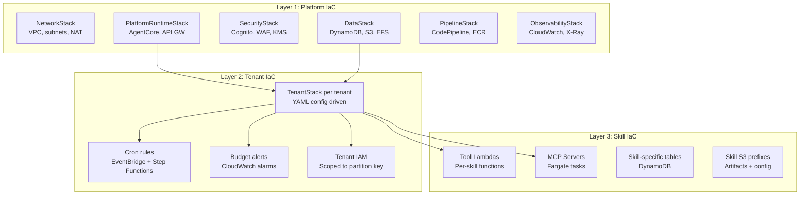
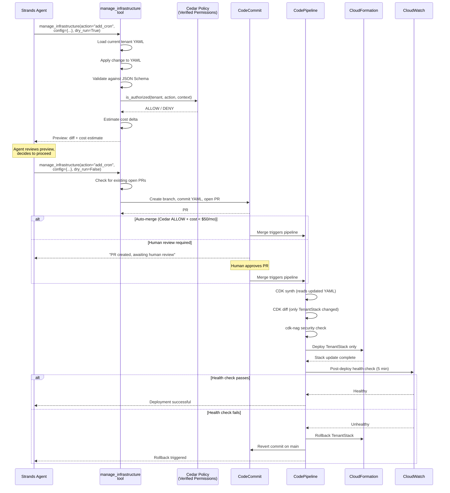
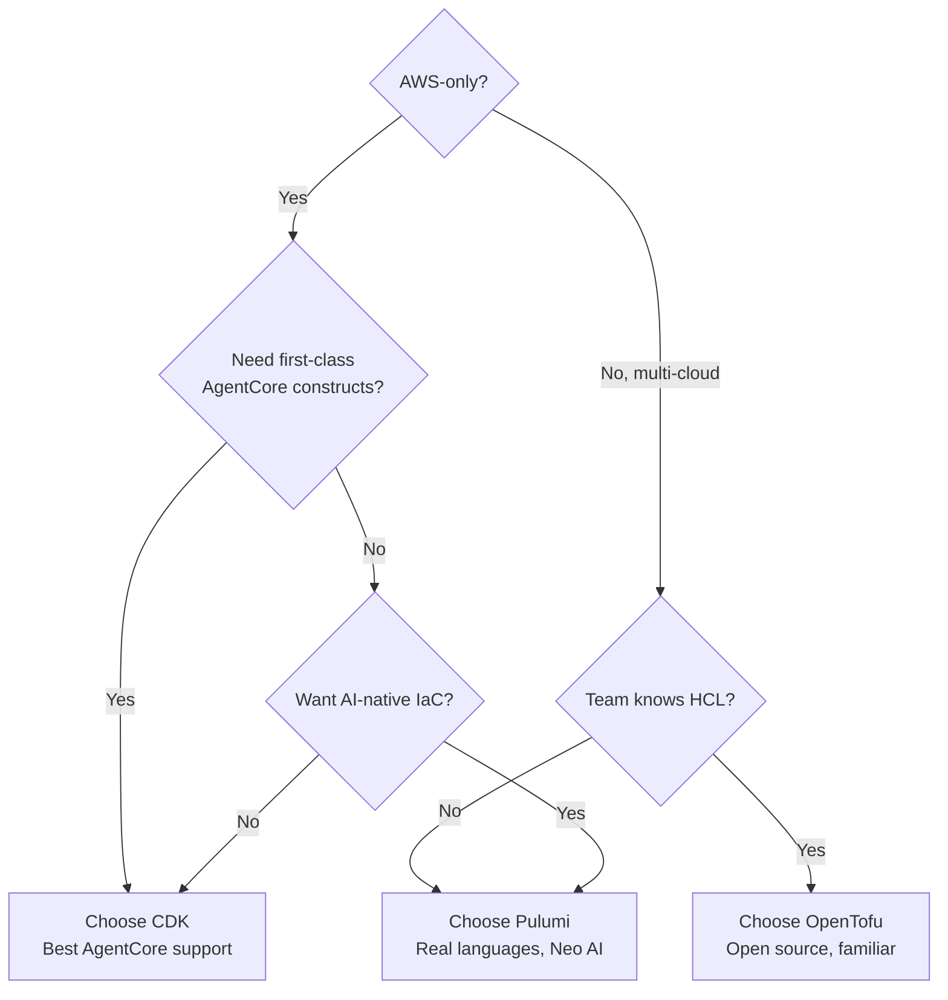
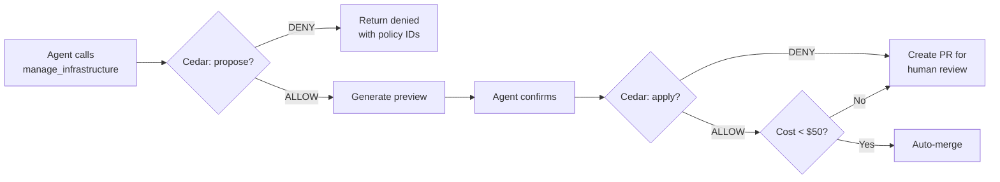
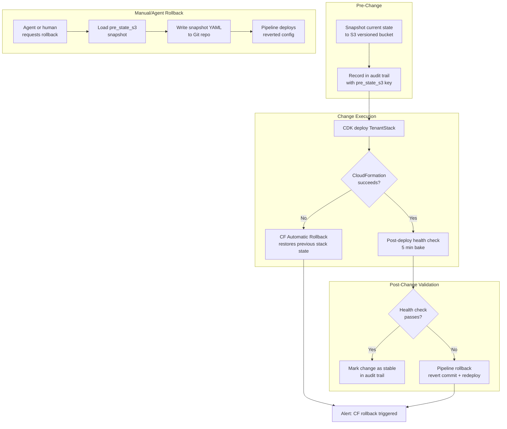
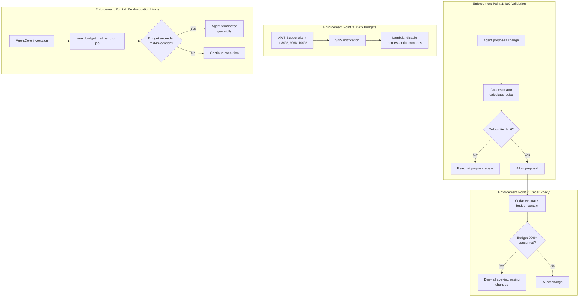
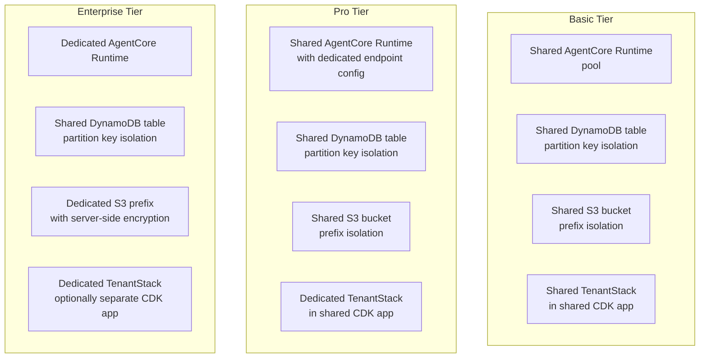
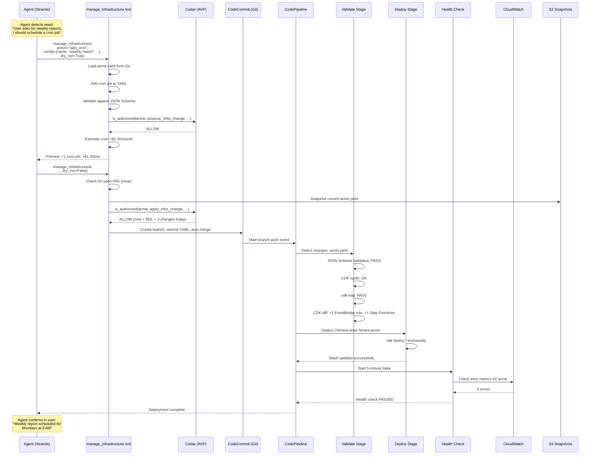

# Self-Modifying IaC Patterns for Agent Platforms

## 1. Executive Summary

Traditional Infrastructure as Code assumes a human writes the definitions, reviews the diff, and deploys the change. Agent platforms break this assumption: the agents themselves need infrastructure -- new DynamoDB tables for memory, EventBridge rules for cron jobs, Lambda functions for tools, S3 prefixes for artifacts -- and those needs change at runtime based on tenant behavior, skill installation, and self-evolution decisions.

**Self-modifying IaC** is the pattern where agents propose, validate, and (within policy bounds) apply changes to their own infrastructure definitions through a GitOps workflow. This document provides the complete implementation blueprint for Chimera's self-modification pipeline.

### Why This Matters

| Traditional IaC | Self-Modifying IaC (Chimera) |
|----------------|-------------------------------|
| Human writes CDK/HCL, reviews PR, deploys | Agent generates YAML config change, Cedar validates, pipeline deploys |
| Change frequency: weekly/monthly | Change frequency: per-tenant, potentially daily |
| Blast radius: entire stack | Blast radius: single tenant's resources |
| Rollback: CloudFormation automatic | Rollback: versioned state snapshots + canary gates |
| Cost control: manual review | Cost control: Cedar policies + AWS Budgets + hard limits |

### Core Design Principles

1. **Agents never write raw CDK/HCL.** They modify tenant YAML configuration files, which the CDK app reads and synthesizes into CloudFormation. This constrains the blast radius to a known schema.
2. **Two-phase commit.** Every change goes through `dry_run=True` (preview + cost estimate) before `dry_run=False` (create PR). No direct infrastructure mutation.
3. **Cedar is the gatekeeper.** Amazon Verified Permissions evaluates every proposed change against tenant-scoped policies before a PR can be created or auto-merged.
4. **Three layers of IaC** with different change frequencies, ownership, and approval requirements (platform, tenant, skill).
5. **Everything is auditable and reversible.** Pre-change snapshots in S3, audit events in DynamoDB, automatic rollback on health check failure.

> [!tip] Related Documents
> - [[Chimera-Self-Evolution-Engine]] -- full evolution engine design including prompt/model/memory evolution
> - [[AWS Bedrock AgentCore and Strands Agents/08-IaC-Patterns-Agent-Platforms]] -- CDK, OpenTofu, Pulumi comparison
> - [[Chimera-Architecture-Review-Platform-IaC]] -- stack decomposition and pipeline design

## 2. Three IaC Layers

Chimera separates infrastructure into three layers with distinct ownership, change frequency, and approval gates. This separation is the foundation that makes self-modification safe.



### Layer 1: Platform IaC (Operator-Managed)

| Aspect | Detail |
|--------|--------|
| **Owner** | Platform engineering team |
| **Change frequency** | Monthly/quarterly |
| **Approval** | Manual PR review + staging validation + canary bake |
| **Blast radius** | All tenants (critical) |
| **Self-modification** | Never -- agents cannot propose platform changes |
| **Stacks** | NetworkStack, DataStack, SecurityStack, ObservabilityStack, PlatformRuntimeStack, PipelineStack, ChatStack |

Platform IaC defines the shared infrastructure envelope. Changes here require the full pipeline: CDK synth, cdk-nag security checks, integration tests, staging deployment, 30-minute canary bake, manual approval, and progressive production rollout.

> [!warning] Immutable Boundary
> Cedar policies contain a hard `forbid` preventing any agent-initiated action with `resource.layer == "platform"`. This is not configurable per tenant.

### Layer 2: Tenant IaC (Agent-Modifiable)

| Aspect | Detail |
|--------|--------|
| **Owner** | Tenant admin (human) + agents via `manage_infrastructure` |
| **Change frequency** | Daily/weekly per active tenant |
| **Approval** | Cedar policy evaluation; auto-merge for low-risk, human review for high-risk |
| **Blast radius** | Single tenant |
| **Self-modification** | Yes -- within Cedar policy bounds |
| **Source of truth** | `tenants/{tenant_id}.yaml` in Git repo |

Tenant IaC is driven by YAML configuration files that the CDK app reads at synthesis time. Each tenant gets a `TenantStack` with:

- Scoped IAM role (DynamoDB leading key condition on `TENANT#{id}`)
- S3 prefix isolation (`tenants/{id}/*`)
- EventBridge cron rules for scheduled jobs
- CloudWatch budget alarms
- Enterprise tier: dedicated AgentCore Runtime

**Key constraint:** Agents modify YAML, not CDK TypeScript. The YAML schema is validated against a JSON Schema before any change is accepted. This means agents can add a cron job or change a model ID but cannot introduce arbitrary infrastructure resources.

```yaml
# tenants/acme.yaml -- this is what agents can modify
tenantId: acme
tier: pro
models:
  default: us.anthropic.claude-sonnet-4-6-v1:0
  complex: us.anthropic.claude-opus-4-6-v1:0
skills:
  - code-review
  - email-reader
cronJobs:
  - name: daily-digest
    schedule: "cron(0 8 ? * MON-FRI *)"
    promptKey: prompts/digest.md
    skills: [email-reader, summarizer]
    maxBudgetUsd: 2.0
memoryStrategies: [SUMMARY, SEMANTIC_MEMORY]
budgetLimitMonthlyUsd: 500
```

### Layer 3: Skill IaC (Skill Author-Managed)

| Aspect | Detail |
|--------|--------|
| **Owner** | Skill authors (internal or marketplace publishers) |
| **Change frequency** | Per skill version update |
| **Approval** | Platform team reviews new skills; updates follow skill-specific pipeline |
| **Blast radius** | Tenants using that skill |
| **Self-modification** | Auto-generated skills (from evolution engine) go through sandbox + signing |
| **Source of truth** | `skills/{skill_name}/infra.yaml` in skills repo |

Some skills need their own infrastructure: a Lambda function for a code execution tool, a DynamoDB table for a knowledge base, an MCP server running on Fargate. Skill IaC is defined in the skill's package and deployed as nested constructs within the TenantStack when a tenant installs the skill.

```yaml
# skills/code-review/infra.yaml
resources:
  - type: lambda
    name: code-review-analyzer
    runtime: python3.12
    memory: 512
    timeout: 120
    permissions:
      - codecommit:GetFile
      - codecommit:GetDifferences
  - type: dynamodb
    name: review-patterns
    partitionKey: pattern_id
    ttlAttribute: expires_at
```

### Layer Interaction Rules

| From Layer | Can Modify | Mechanism | Cedar Action |
|-----------|-----------|-----------|--------------|
| Platform | Platform, Tenant, Skill | Direct CDK code changes | N/A (human-only) |
| Tenant (agent) | Tenant | `manage_infrastructure` tool -> YAML -> PR | `propose_infra_change`, `apply_infra_change` |
| Tenant (agent) | Skill | Install/uninstall from skill library | `install_skill`, `remove_skill` |
| Skill | Skill | Skill package updates its own `infra.yaml` | `update_skill_infra` |
| Any agent | Platform | Forbidden | Hard `forbid` in Cedar |

## 3. CDK Self-Modification Workflow

The self-modification pipeline is the core machinery. An agent detects a need (e.g., "I should have a cron job for this recurring task"), proposes a change to its tenant YAML, the system validates and cost-estimates it, creates a PR, and the pipeline deploys only the affected TenantStack.

### End-to-End Workflow



### Two-Phase Commit: The `manage_infrastructure` Tool

This is the Strands tool that agents call. It never writes CDK TypeScript -- it modifies tenant YAML and lets the CDK app synthesize the actual CloudFormation.

```python
import json
import time
import yaml
from datetime import datetime
from strands import tool

# Actions agents are ALLOWED to perform
ALLOWED_ACTIONS = {
    "add_skill", "remove_skill",
    "add_cron", "update_cron", "remove_cron",
    "update_model", "update_memory_strategy",
    "adjust_budget",
    "enable_channel", "disable_channel",
    "update_env_var",
}

# Actions that are ALWAYS forbidden for agents
FORBIDDEN_ACTIONS = {
    "modify_iam", "modify_network", "modify_platform",
    "delete_tenant", "modify_security_group", "modify_vpc",
    "modify_kms", "modify_waf",
}

@tool
def manage_infrastructure(
    tenant_id: str,
    action: str,
    config: dict,
    dry_run: bool = True,
) -> dict:
    """
    Modify tenant infrastructure via GitOps. Two phases:
    Phase 1 (dry_run=True): Generate change, validate, estimate cost.
    Phase 2 (dry_run=False): Create PR with the validated change.

    Args:
        tenant_id: The tenant whose infrastructure to modify.
        action: The type of change (e.g., 'add_cron', 'update_model').
        config: Action-specific parameters.
        dry_run: If True, preview only. If False, create PR.
    """
    import boto3

    # 1. Hard action allowlist check
    if action in FORBIDDEN_ACTIONS:
        return {
            "status": "denied",
            "reason": f"Action '{action}' is permanently forbidden for agents.",
        }
    if action not in ALLOWED_ACTIONS:
        return {
            "status": "denied",
            "reason": f"Action '{action}' is not in the allowed action set.",
        }

    # 2. Cedar policy authorization
    avp = boto3.client("verifiedpermissions")
    auth_result = avp.is_authorized(
        policyStoreId="chimera-policies",
        principal={"entityType": "Chimera::Agent", "entityId": tenant_id},
        action={
            "actionType": "Chimera::Action",
            "actionId": "propose_infra_change",
        },
        resource={
            "entityType": "Chimera::TenantConfig",
            "entityId": f"{tenant_id}/config",
        },
        context={
            "contextMap": {
                "action": {"string": action},
                "estimated_cost_delta": {
                    "long": config.get("estimated_cost_delta", 0)
                },
                "change_count_today": {
                    "long": _get_change_count_today(tenant_id)
                },
            }
        },
    )

    if auth_result["decision"] != "ALLOW":
        return {
            "status": "denied",
            "reason": "Cedar policy denied this change.",
            "determining_policies": auth_result.get("determiningPolicies", []),
        }

    # 3. Load current tenant YAML from the repo
    codecommit = boto3.client("codecommit")
    try:
        file_resp = codecommit.get_file(
            repositoryName="chimera-infra",
            filePath=f"tenants/{tenant_id}.yaml",
        )
        current_yaml = yaml.safe_load(file_resp["fileContent"].decode())
    except codecommit.exceptions.FileDoesNotExistException:
        return {"status": "error", "reason": f"No config found for tenant {tenant_id}"}

    # 4. Apply the change (structured merge, not arbitrary edit)
    proposed_yaml = _apply_change(current_yaml, action, config)

    # 5. Validate against JSON Schema
    validation_errors = _validate_tenant_schema(proposed_yaml)
    if validation_errors:
        return {"status": "validation_error", "errors": validation_errors}

    # 6. Estimate cost impact
    cost_delta = _estimate_cost_delta(current_yaml, proposed_yaml)

    # 7. Generate diff for preview
    diff = _yaml_diff(current_yaml, proposed_yaml)

    if dry_run:
        return {
            "status": "preview",
            "diff": diff,
            "estimated_monthly_cost_delta_usd": cost_delta,
            "action": action,
            "message": "Call with dry_run=False to create PR.",
        }

    # 8. Check for concurrent PRs (one open PR per tenant)
    existing_prs = _find_open_prs(codecommit, tenant_id)
    if existing_prs:
        return {
            "status": "blocked",
            "reason": f"Tenant has open PR(s): {existing_prs}. Merge or close first.",
        }

    # 9. Create branch, commit, open PR
    main_head = _get_main_head(codecommit, "chimera-infra")
    branch_name = f"tenant/{tenant_id}/{action}/{int(time.time())}"

    codecommit.create_branch(
        repositoryName="chimera-infra",
        branchName=branch_name,
        commitId=main_head,
    )

    commit_msg = (
        f"[{tenant_id}] {action}: {config.get('name', json.dumps(config)[:80])}\n\n"
        f"Cost delta: ${cost_delta}/month\n"
        f"Generated by manage_infrastructure tool"
    )

    codecommit.put_file(
        repositoryName="chimera-infra",
        branchName=branch_name,
        fileContent=yaml.dump(proposed_yaml).encode(),
        filePath=f"tenants/{tenant_id}.yaml",
        commitMessage=commit_msg,
    )

    # 10. Determine auto-merge eligibility
    can_auto_merge = (
        cost_delta < 50
        and action in {"add_cron", "update_cron", "remove_cron",
                       "update_model", "update_env_var"}
        and _get_change_count_today(tenant_id) < 3
    )

    if can_auto_merge:
        codecommit.merge_branches_by_fast_forward(
            repositoryName="chimera-infra",
            sourceCommitSpecifier=branch_name,
            destinationCommitSpecifier="main",
        )
        _record_change(tenant_id, action, cost_delta, "auto_merged")
        return {
            "status": "auto_merged",
            "branch": branch_name,
            "cost_delta_usd": cost_delta,
            "message": "Change auto-merged. Pipeline deploying.",
        }
    else:
        pr = codecommit.create_pull_request(
            title=f"[{tenant_id}] {action}",
            description=(
                f"Automated infrastructure change.\n\n"
                f"**Tenant:** {tenant_id}\n"
                f"**Action:** {action}\n"
                f"**Cost delta:** ${cost_delta}/month\n"
                f"**Requires human review:** Yes\n\n"
                f"```diff\n{diff}\n```"
            ),
            targets=[{
                "repositoryName": "chimera-infra",
                "sourceReference": branch_name,
                "destinationReference": "main",
            }],
        )
        _record_change(tenant_id, action, cost_delta, "pr_created")
        return {
            "status": "pr_created",
            "pr_id": pr["pullRequest"]["pullRequestId"],
            "cost_delta_usd": cost_delta,
            "message": "PR created, awaiting human review.",
        }
```

### YAML Change Application Functions

The `_apply_change` function performs structured merges, not arbitrary edits. Each action type has a specific handler:

```python
def _apply_change(current: dict, action: str, config: dict) -> dict:
    """Apply a structured change to tenant YAML. Returns modified copy."""
    import copy
    proposed = copy.deepcopy(current)

    if action == "add_cron":
        proposed.setdefault("cronJobs", []).append({
            "name": config["name"],
            "schedule": config["schedule"],
            "promptKey": config["promptKey"],
            "skills": config.get("skills", []),
            "maxBudgetUsd": config.get("maxBudgetUsd", 2.0),
            "outputPrefix": config.get("outputPrefix", f"outputs/{config['name']}/"),
        })

    elif action == "update_cron":
        for job in proposed.get("cronJobs", []):
            if job["name"] == config["name"]:
                job.update({k: v for k, v in config.items() if k != "name"})
                break

    elif action == "remove_cron":
        proposed["cronJobs"] = [
            j for j in proposed.get("cronJobs", [])
            if j["name"] != config["name"]
        ]

    elif action == "update_model":
        proposed.setdefault("models", {})
        proposed["models"][config["role"]] = config["modelId"]

    elif action == "add_skill":
        skills = proposed.setdefault("skills", [])
        if config["skillName"] not in skills:
            skills.append(config["skillName"])

    elif action == "remove_skill":
        proposed["skills"] = [
            s for s in proposed.get("skills", [])
            if s != config["skillName"]
        ]

    elif action == "adjust_budget":
        proposed["budgetLimitMonthlyUsd"] = config["newBudgetUsd"]

    elif action == "update_memory_strategy":
        proposed["memoryStrategies"] = config["strategies"]

    elif action == "update_env_var":
        env = proposed.setdefault("environmentVariables", {})
        env[config["key"]] = config["value"]

    return proposed
```

### CDK Reads Tenant YAML at Synth Time

The CDK app reads all tenant YAML files and creates a `TenantStack` for each:

```typescript
// bin/app.ts
import * as fs from 'fs';
import * as path from 'path';
import * as yaml from 'yaml';
import { TenantStack } from '../lib/stacks/tenant-stack';

const tenantsDir = path.join(__dirname, '..', 'tenants');
const tenantFiles = fs.readdirSync(tenantsDir).filter(f => f.endsWith('.yaml'));

for (const file of tenantFiles) {
  const config = yaml.parse(
    fs.readFileSync(path.join(tenantsDir, file), 'utf8')
  );

  new TenantStack(app, `Chimera-${env}-Tenant-${config.tenantId}`, {
    tenantConfig: config,
    platformTable: dataStack.platformTable,
    tenantBucket: dataStack.tenantBucket,
    poolRuntime: runtimeStack.agentRuntime,
    eventBus: runtimeStack.eventBus,
    env: envConfig,
  });
}
```

This means the pipeline only needs to `cdk deploy Chimera-prod-Tenant-acme` when `tenants/acme.yaml` changes -- other tenant stacks are untouched.

## 4. OpenTofu/Pulumi Alternatives

While Chimera's primary recommendation is AWS CDK (for first-class AgentCore L2 construct support), the self-modification pattern works with any IaC tool. This section evaluates OpenTofu and Pulumi as alternatives, with specific attention to how each handles the self-modification workflow.

### Comparison Matrix

| Dimension | AWS CDK | OpenTofu | Pulumi |
|-----------|---------|----------|--------|
| **Language** | TypeScript, Python, Java, Go, C# | HCL (declarative) | TypeScript, Python, Go, C#, Java |
| **Cloud support** | AWS only | Multi-cloud via providers | Multi-cloud native |
| **AgentCore L2 constructs** | Yes (`@aws-cdk/aws-bedrock-agentcore-alpha`) | No (raw `aws_bedrockagentcore_*` resources) | Partial (`aws.bedrockagentcore.*`) |
| **State management** | CloudFormation (AWS-managed) | S3 + DynamoDB / Terraform Cloud / Spacelift | Pulumi Cloud / S3 / local |
| **Self-modification mechanism** | Agent modifies YAML -> CDK synth -> CloudFormation | Agent modifies `.tfvars` -> `tofu plan/apply` | Agent modifies config -> Pulumi up |
| **Drift detection** | CloudFormation drift detection (built-in) | `tofu plan` (scheduled) | `pulumi refresh` |
| **Rollback** | Automatic CloudFormation rollback | Manual state rollback from S3 version | Pulumi cancel + manual revert |
| **Testing** | CDK Assertions (`Template.fromStack`) | `terraform test` (limited) | Standard language test frameworks |
| **Policy enforcement** | Cedar (external) + cdk-nag | OPA / Sentinel + Cedar (external) | Pulumi CrossGuard + Cedar (external) |
| **AI-native assistance** | Amazon Q in CDK | None built-in | Pulumi Neo (AI agent for IaC) |
| **License** | Apache 2.0 | MPL 2.0 (open source) | Apache 2.0 (engine), commercial cloud |
| **Multi-tenant pattern** | Stack per tenant (natural) | Workspaces / `for_each` / Terragrunt | Stacks + ComponentResource |
| **Cost estimation** | No built-in (use Infracost) | Infracost integration | Pulumi cost estimates |

### OpenTofu Self-Modification Pattern

With OpenTofu, the agent modifies `.tfvars` files instead of YAML, and the pipeline runs `tofu plan` + `tofu apply` instead of `cdk deploy`:

```hcl
# modules/tenant-config/variables.tf
variable "tenant_id" { type = string }
variable "tier" { type = string }
variable "models" { type = map(string) }
variable "skills" { type = list(string) }
variable "cron_jobs" {
  type = list(object({
    name          = string
    schedule      = string
    prompt_key    = string
    skills        = list(string)
    max_budget    = number
    output_prefix = string
  }))
}
variable "budget_limit_monthly_usd" { type = number }
```

```hcl
# tenants/acme.tfvars -- this is what the agent modifies
tenant_id = "acme"
tier      = "pro"

models = {
  default = "us.anthropic.claude-sonnet-4-6-v1:0"
  complex = "us.anthropic.claude-opus-4-6-v1:0"
}

skills = ["code-review", "email-reader"]

cron_jobs = [
  {
    name          = "daily-digest"
    schedule      = "cron(0 8 ? * MON-FRI *)"
    prompt_key    = "prompts/digest.md"
    skills        = ["email-reader", "summarizer"]
    max_budget    = 2.0
    output_prefix = "outputs/digests/"
  }
]

budget_limit_monthly_usd = 500
```

**State isolation approach:** One workspace per tenant, state stored in S3 with DynamoDB locking:

```hcl
# backend.tf
terraform {
  backend "s3" {
    bucket         = "chimera-tofu-state"
    key            = "tenants/${var.tenant_id}/terraform.tfstate"
    region         = "us-west-2"
    dynamodb_table = "chimera-tofu-locks"
    encrypt        = true
  }
}
```

### Pulumi Self-Modification Pattern

Pulumi uses real programming languages, so the agent can modify a JSON/YAML config file that a Pulumi program reads:

```python
# __main__.py -- Pulumi program reads tenant configs
import pulumi
import pulumi_aws as aws
import yaml
from pathlib import Path

config_path = Path(f"tenants/{pulumi.get_stack()}.yaml")
tenant = yaml.safe_load(config_path.read_text())

# Create resources from config
for job in tenant.get("cronJobs", []):
    aws.scheduler.Schedule(
        f"cron-{job['name']}",
        schedule_expression=f"cron({job['schedule']})",
        flexible_time_window={"mode": "OFF"},
        target={
            "arn": cron_executor_arn,
            "role_arn": scheduler_role_arn,
            "input": pulumi.Output.json_dumps({
                "tenant_id": tenant["tenantId"],
                "job_name": job["name"],
                "prompt_key": job["promptKey"],
            }),
        },
    )
```

**Pulumi Neo advantage:** Pulumi Neo (their AI agent) can serve as the self-modification engine itself, understanding the full infrastructure context and proposing changes within Pulumi CrossGuard policy boundaries. This is the most "AI-native" self-modification approach available today.

### When to Choose Each



> [!note] Chimera Recommendation
> **CDK for the primary path.** AgentCore alpha L2 constructs, CloudFormation's built-in rollback, and CDK Assertions for testing make it the lowest-risk choice for an AWS-native agent platform. The self-modification pattern (YAML -> CDK synth) works cleanly with CloudFormation's change sets.
>
> **OpenTofu for multi-cloud extensions.** If Chimera needs to deploy tools or MCP servers to non-AWS environments, OpenTofu modules can be composed alongside CDK using CDKTF/CDK Terrain.
>
> **Pulumi for teams that want AI-native IaC.** If the team is already using Pulumi, Neo provides the most seamless self-modification experience -- the IaC tool itself is an AI agent.

## 5. Cedar Policy Constraints

Cedar policies are the non-negotiable authorization layer for self-modifying IaC. Every proposed change is evaluated by Amazon Verified Permissions before a PR can be created or auto-merged. The policies enforce a layered defense: action allowlists, resource scope, cost limits, rate limits, and immutable safety boundaries.

### Cedar Entity Model for IaC

```cedar
// Entity types
namespace Chimera {
  entity Agent in [Role] {
    tenant_id: String,
    agent_id: String,
    tier: String,
    infra_changes_today: Long,
    infra_changes_this_week: Long,
    budget_used_this_month_usd: Long,
    budget_limit_monthly_usd: Long,
  };

  entity TenantConfig {
    tenant_id: String,
    layer: String,           // "platform" | "tenant" | "skill"
    change_type: String,     // action name
    estimated_cost_delta: Long,
    current_cron_count: Long,
    current_skill_count: Long,
  };

  entity Role;

  action propose_infra_change appliesTo {
    principal: Agent, resource: TenantConfig
  };
  action apply_infra_change appliesTo {
    principal: Agent, resource: TenantConfig
  };
  action emergency_heal appliesTo {
    principal: Agent, resource: TenantConfig
  };
}
```

### Policy Set: Infrastructure Self-Modification

```cedar
// ============================================================
// LAYER BOUNDARY: Agents can NEVER modify platform infrastructure
// ============================================================

forbid(
    principal in Chimera::Role::"agent",
    action in [
        Chimera::Action::"propose_infra_change",
        Chimera::Action::"apply_infra_change"
    ],
    resource
)
when {
    resource.layer == "platform"
};

// ============================================================
// PROPOSE: Any agent can propose tenant-layer changes
// ============================================================

permit(
    principal in Chimera::Role::"agent",
    action == Chimera::Action::"propose_infra_change",
    resource
)
when {
    // Only tenant-layer resources
    resource.layer == "tenant" &&
    // Only the agent's own tenant
    resource.tenant_id == principal.tenant_id &&
    // Only allowed change types
    resource.change_type in [
        "add_skill", "remove_skill",
        "add_cron", "update_cron", "remove_cron",
        "update_model", "update_memory_strategy",
        "adjust_budget", "update_env_var",
        "enable_channel", "disable_channel"
    ]
};

// ============================================================
// AUTO-APPLY: Low-risk changes can be auto-merged
// ============================================================

permit(
    principal in Chimera::Role::"agent",
    action == Chimera::Action::"apply_infra_change",
    resource
)
when {
    resource.layer == "tenant" &&
    resource.tenant_id == principal.tenant_id &&
    // Only specific low-risk actions
    resource.change_type in [
        "add_cron", "update_cron", "remove_cron",
        "update_model", "update_env_var"
    ] &&
    // Cost impact under $50/month
    resource.estimated_cost_delta < 50 &&
    // Rate limit: max 3 auto-applies per day
    principal.infra_changes_today < 3
};

// ============================================================
// CRON JOB LIMITS
// ============================================================

// Max 10 cron jobs per tenant
forbid(
    principal in Chimera::Role::"agent",
    action == Chimera::Action::"propose_infra_change",
    resource
)
when {
    resource.change_type == "add_cron" &&
    resource.current_cron_count >= 10
};

// ============================================================
// SKILL INSTALLATION LIMITS
// ============================================================

// Max 20 skills per tenant (basic tier)
forbid(
    principal in Chimera::Role::"agent",
    action == Chimera::Action::"propose_infra_change",
    resource
)
when {
    resource.change_type == "add_skill" &&
    principal.tier == "basic" &&
    resource.current_skill_count >= 20
};

// Max 50 skills per tenant (pro/enterprise tier)
forbid(
    principal in Chimera::Role::"agent",
    action == Chimera::Action::"propose_infra_change",
    resource
)
when {
    resource.change_type == "add_skill" &&
    principal.tier in ["pro", "enterprise"] &&
    resource.current_skill_count >= 50
};

// ============================================================
// BUDGET ENFORCEMENT
// ============================================================

// Cannot adjust budget above the tier maximum
forbid(
    principal in Chimera::Role::"agent",
    action == Chimera::Action::"propose_infra_change",
    resource
)
when {
    resource.change_type == "adjust_budget" &&
    (
        (principal.tier == "basic" && resource.estimated_cost_delta > 100) ||
        (principal.tier == "pro" && resource.estimated_cost_delta > 1000) ||
        (principal.tier == "enterprise" && resource.estimated_cost_delta > 10000)
    )
};

// Cannot make changes when monthly budget is 90%+ consumed
forbid(
    principal in Chimera::Role::"agent",
    action in [
        Chimera::Action::"propose_infra_change",
        Chimera::Action::"apply_infra_change"
    ],
    resource
)
when {
    resource.estimated_cost_delta > 0 &&
    principal.budget_used_this_month_usd >
        (principal.budget_limit_monthly_usd * 9 / 10)
};

// ============================================================
// RATE LIMITS
// ============================================================

// No more than 10 proposals per day
forbid(
    principal in Chimera::Role::"agent",
    action == Chimera::Action::"propose_infra_change",
    resource
)
when {
    principal.infra_changes_today >= 10
};

// No more than 30 proposals per week
forbid(
    principal in Chimera::Role::"agent",
    action == Chimera::Action::"propose_infra_change",
    resource
)
when {
    principal.infra_changes_this_week >= 30
};

// ============================================================
// IMMUTABLE SAFETY: Agents can never modify policies themselves
// ============================================================

forbid(
    principal in Chimera::Role::"agent",
    action in [
        Chimera::Action::"propose_infra_change",
        Chimera::Action::"apply_infra_change"
    ],
    resource
)
when {
    resource.change_type in [
        "modify_cedar_policy", "modify_iam",
        "modify_security_group", "modify_vpc",
        "modify_kms", "modify_waf",
        "delete_tenant", "modify_platform"
    ]
};
```

### How Cedar Integrates with the Pipeline



> [!important] Defense in Depth
> Cedar is one of three enforcement layers:
> 1. **Hard-coded allowlist** in `manage_infrastructure` tool (ALLOWED_ACTIONS / FORBIDDEN_ACTIONS)
> 2. **Cedar policy evaluation** via Amazon Verified Permissions
> 3. **JSON Schema validation** of the resulting tenant YAML
>
> An agent would need to bypass all three to make an unauthorized change.

## 6. Drift Detection

Drift -- when actual infrastructure state diverges from IaC definitions -- is especially dangerous in a self-modifying system. An agent could make a change through the `manage_infrastructure` tool while a manual console change simultaneously alters the same resource, creating inconsistency. Chimera implements drift detection at three levels.

### Level 1: CloudFormation Drift Detection (Built-in)

CloudFormation can detect drift for all resources in a stack. Chimera schedules daily drift checks via a CodeBuild project:

```yaml
# buildspec-drift-detection.yml
version: 0.2
env:
  variables:
    ALERT_TOPIC: "arn:aws:sns:us-west-2:ACCOUNT:chimera-drift-alerts"
    SLACK_WEBHOOK_PARAM: "/chimera/slack-webhook-drift"
phases:
  install:
    commands:
      - npm ci
  build:
    commands:
      # Detect drift for all Chimera stacks
      - |
        STACKS=$(aws cloudformation list-stacks \
          --stack-status-filter CREATE_COMPLETE UPDATE_COMPLETE \
          --query "StackSummaries[?starts_with(StackName, 'Chimera-prod')].StackName" \
          --output text)
      - |
        DRIFTED_STACKS=""
        for STACK in $STACKS; do
          echo "Checking drift for $STACK..."
          DETECTION_ID=$(aws cloudformation detect-stack-drift \
            --stack-name "$STACK" \
            --query "StackDriftDetectionId" --output text)

          # Wait for detection to complete (max 5 min per stack)
          for i in $(seq 1 30); do
            STATUS=$(aws cloudformation describe-stack-drift-detection-status \
              --stack-drift-detection-id "$DETECTION_ID" \
              --query "DetectionStatus" --output text)
            if [ "$STATUS" != "DETECTION_IN_PROGRESS" ]; then break; fi
            sleep 10
          done

          DRIFT_STATUS=$(aws cloudformation describe-stack-drift-detection-status \
            --stack-drift-detection-id "$DETECTION_ID" \
            --query "StackDriftStatus" --output text)

          if [ "$DRIFT_STATUS" = "DRIFTED" ]; then
            DRIFTED_STACKS="$DRIFTED_STACKS $STACK"
            echo "DRIFT DETECTED in $STACK"
            aws cloudformation describe-stack-resource-drifts \
              --stack-name "$STACK" \
              --stack-resource-drift-status-filters MODIFIED DELETED \
              --output json >> drift-report.json
          fi
        done
      # Alert if any drift detected
      - |
        if [ -n "$DRIFTED_STACKS" ]; then
          aws sns publish --topic-arn "$ALERT_TOPIC" \
            --subject "Chimera Drift Detected: $DRIFTED_STACKS" \
            --message file://drift-report.json
          echo "DRIFT DETECTED in:$DRIFTED_STACKS"
          exit 1
        else
          echo "No drift detected across all stacks."
        fi
```

### Level 2: CDK Diff (Configuration Drift)

CloudFormation drift detects changes to deployed resources, but not changes to the IaC definitions themselves (e.g., someone edits a tenant YAML in the repo without going through the `manage_infrastructure` tool). A daily `cdk diff` catches this:

```typescript
// lib/constructs/drift-detection.ts
import * as cdk from 'aws-cdk-lib';
import * as codebuild from 'aws-cdk-lib/aws-codebuild';
import * as events from 'aws-cdk-lib/aws-events';
import * as targets from 'aws-cdk-lib/aws-events-targets';
import * as sns from 'aws-cdk-lib/aws-sns';
import { Construct } from 'constructs';

export class DriftDetection extends Construct {
  constructor(scope: Construct, id: string, props: { alertTopic: sns.ITopic }) {
    super(scope, id);

    const project = new codebuild.Project(this, 'DriftCheck', {
      projectName: 'chimera-drift-detection',
      source: codebuild.Source.codeCommit({
        repository: codebuild.Repository.fromRepositoryName(
          this, 'Repo', 'chimera-infra'
        ),
      }),
      environment: {
        buildImage: codebuild.LinuxBuildImage.STANDARD_7_0,
      },
      buildSpec: codebuild.BuildSpec.fromAsset('buildspec-drift-detection.yml'),
      environmentVariables: {
        ALERT_TOPIC: { value: props.alertTopic.topicArn },
      },
    });

    props.alertTopic.grantPublish(project);

    // Run daily at 6 AM UTC
    new events.Rule(this, 'DailyDriftCheck', {
      schedule: events.Schedule.cron({ hour: '6', minute: '0' }),
      targets: [new targets.CodeBuildProject(project)],
    });
  }
}
```

### Level 3: Tenant Config Integrity Check

The most critical drift scenario: the Git repo's tenant YAML diverges from what's actually deployed. This happens when a deployment fails mid-way or someone manually patches a resource. A custom check compares Git YAML against DynamoDB config:

```python
@tool
def check_tenant_config_integrity(
    tenant_id: str,
) -> dict:
    """Compare Git tenant YAML against deployed DynamoDB config.
    Returns any discrepancies."""
    import boto3
    import yaml

    # Load from Git (source of truth)
    codecommit = boto3.client("codecommit")
    file_resp = codecommit.get_file(
        repositoryName="chimera-infra",
        filePath=f"tenants/{tenant_id}.yaml",
    )
    git_config = yaml.safe_load(file_resp["fileContent"].decode())

    # Load from DynamoDB (deployed state)
    dynamodb = boto3.resource("dynamodb")
    table = dynamodb.Table("chimera-platform")
    item = table.get_item(
        Key={"PK": f"TENANT#{tenant_id}", "SK": "CONFIG"}
    ).get("Item", {})

    deployed_config = {
        "tenantId": item.get("tenant_id"),
        "tier": item.get("tier"),
        "models": item.get("models", {}),
        "skills": item.get("skills", []),
        "budgetLimitMonthlyUsd": item.get("budget_limit_monthly_usd"),
    }

    # Compare key fields
    discrepancies = []
    for field in ["tier", "models", "skills", "budgetLimitMonthlyUsd"]:
        git_val = git_config.get(field)
        deployed_val = deployed_config.get(field)
        if git_val != deployed_val:
            discrepancies.append({
                "field": field,
                "git_value": git_val,
                "deployed_value": deployed_val,
            })

    # Check cron job count
    git_cron_count = len(git_config.get("cronJobs", []))
    deployed_crons = table.query(
        KeyConditionExpression="PK = :pk AND begins_with(SK, :prefix)",
        ExpressionAttributeValues={
            ":pk": f"TENANT#{tenant_id}",
            ":prefix": "CRON#",
        },
        Select="COUNT",
    )["Count"]

    if git_cron_count != deployed_crons:
        discrepancies.append({
            "field": "cronJobs",
            "git_value": f"{git_cron_count} jobs",
            "deployed_value": f"{deployed_crons} jobs",
        })

    return {
        "tenant_id": tenant_id,
        "in_sync": len(discrepancies) == 0,
        "discrepancies": discrepancies,
        "recommendation": (
            "No action needed."
            if not discrepancies
            else "Run pipeline for this tenant to reconcile."
        ),
    }
```

### Drift Response Actions

| Drift Type | Severity | Automated Response |
|-----------|----------|-------------------|
| CloudFormation resource modified externally | High | SNS alert + Slack notification + auto-reconcile flag |
| Tenant YAML differs from deployed state | Medium | Re-run pipeline for affected TenantStack |
| New resources not in IaC (orphans) | Low | Log for cleanup, monthly orphan resource sweep |
| Security-critical drift (IAM, SG, KMS) | Critical | PagerDuty alert + immediate `cdk deploy` to restore |

## 7. Rollback Patterns

Self-modifying infrastructure demands robust rollback. Every change must be reversible, ideally automatically. Chimera implements rollback at four levels: CloudFormation automatic, pipeline-triggered, snapshot-based, and agent-initiated.

### Rollback Architecture



### Level 1: CloudFormation Automatic Rollback

CloudFormation rolls back automatically when a stack update fails (resource creation error, timeout, etc.). This is the first safety net and requires no custom implementation.

```typescript
// CDK: Configure stack-level rollback settings
new TenantStack(app, `Chimera-prod-Tenant-${tenantId}`, {
  tenantConfig: config,
  // ... other props
  synthesizer: new cdk.DefaultStackSynthesizer(),
  // CloudFormation will automatically roll back on failure
  // No additional config needed -- this is the default behavior
});
```

### Level 2: Pipeline Rollback on Health Check Failure

After a successful CloudFormation deploy, a 5-minute canary bake period monitors tenant health metrics. If error rates spike or latency degrades, the pipeline reverts the Git commit and redeploys:

```typescript
// lib/stacks/pipeline-stack.ts -- post-deploy validation stage
const healthCheckStep = new pipelines.ShellStep('PostDeployHealthCheck', {
  commands: [
    // Wait for 5 minutes of metric data
    'sleep 300',
    // Check error rate for the affected tenant
    `ERRORS=$(aws cloudwatch get-metric-statistics \\
      --namespace AgentPlatform \\
      --metric-name Errors \\
      --dimensions Name=TenantId,Value=$TENANT_ID \\
      --start-time $(date -u -v-5M +%Y-%m-%dT%H:%M:%S) \\
      --end-time $(date -u +%Y-%m-%dT%H:%M:%S) \\
      --period 300 --statistics Sum \\
      --query "Datapoints[0].Sum" --output text)`,
    // Fail the step if errors exceed threshold
    'if [ "$(echo "$ERRORS > 5" | bc)" -eq 1 ]; then',
    '  echo "Health check failed: $ERRORS errors in 5 min"',
    '  exit 1',
    'fi',
    'echo "Health check passed: $ERRORS errors (threshold: 5)"',
  ],
  envFromCfnOutputs: {
    TENANT_ID: tenantStack.tenantIdOutput,
  },
});
```

### Level 3: S3 Versioned State Snapshots

Every change made through `manage_infrastructure` captures a pre-change snapshot in S3. The S3 bucket uses versioning, so even if a snapshot is overwritten, the history is preserved:

```python
def _snapshot_pre_change_state(
    tenant_id: str,
    current_yaml: dict,
    action: str,
) -> str:
    """Save pre-change state to S3. Returns the S3 key."""
    import boto3
    import json
    from datetime import datetime

    s3 = boto3.client("s3")
    timestamp = datetime.utcnow().strftime("%Y%m%dT%H%M%S")
    key = f"snapshots/{tenant_id}/{timestamp}-pre-{action}.json"

    s3.put_object(
        Bucket="chimera-evolution-artifacts",
        Key=key,
        Body=json.dumps({
            "tenant_id": tenant_id,
            "timestamp": timestamp,
            "action": action,
            "config_yaml": current_yaml,
            "metadata": {
                "snapshot_type": "pre_change",
                "tool": "manage_infrastructure",
            },
        }),
        ServerSideEncryption="AES256",
    )

    return key


def _rollback_from_snapshot(
    tenant_id: str,
    snapshot_s3_key: str,
    reason: str,
) -> dict:
    """Restore tenant config from an S3 snapshot."""
    import boto3
    import json
    import yaml

    s3 = boto3.client("s3")
    codecommit = boto3.client("codecommit")

    # Load snapshot
    obj = s3.get_object(
        Bucket="chimera-evolution-artifacts",
        Key=snapshot_s3_key,
    )
    snapshot = json.loads(obj["Body"].read())
    restored_yaml = snapshot["config_yaml"]

    # Commit restored YAML to Git
    main_head = _get_main_head(codecommit, "chimera-infra")
    branch = f"rollback/{tenant_id}/{int(time.time())}"

    codecommit.create_branch(
        repositoryName="chimera-infra",
        branchName=branch,
        commitId=main_head,
    )

    codecommit.put_file(
        repositoryName="chimera-infra",
        branchName=branch,
        fileContent=yaml.dump(restored_yaml).encode(),
        filePath=f"tenants/{tenant_id}.yaml",
        commitMessage=(
            f"[ROLLBACK] {tenant_id}: Restoring from snapshot\n\n"
            f"Reason: {reason}\n"
            f"Snapshot: {snapshot_s3_key}"
        ),
    )

    # Auto-merge rollbacks (they restore known-good state)
    codecommit.merge_branches_by_fast_forward(
        repositoryName="chimera-infra",
        sourceCommitSpecifier=branch,
        destinationCommitSpecifier="main",
    )

    return {
        "status": "rolled_back",
        "snapshot_key": snapshot_s3_key,
        "reason": reason,
        "restored_config": restored_yaml,
    }
```

### Level 4: Agent-Initiated Rollback

The evolution engine's rollback tool (from [[Chimera-Self-Evolution-Engine#8. Safety Guardrails for Self-Evolution]]) integrates with the IaC rollback:

```python
@tool
def rollback_infrastructure_change(
    tenant_id: str,
    change_event_id: str,
    reason: str,
) -> dict:
    """Roll back a specific infrastructure change using audit trail."""
    import boto3

    dynamodb = boto3.resource("dynamodb")
    audit_table = dynamodb.Table("chimera-audit")

    # Load the audit event
    event = audit_table.get_item(
        Key={"PK": f"TENANT#{tenant_id}", "SK": change_event_id}
    ).get("Item")

    if not event:
        return {"status": "error", "reason": "Change event not found"}
    if event.get("rolled_back"):
        return {"status": "error", "reason": "Already rolled back"}
    if not event.get("pre_state_s3"):
        return {"status": "error", "reason": "No pre-state snapshot available"}

    # Perform the rollback
    result = _rollback_from_snapshot(
        tenant_id=tenant_id,
        snapshot_s3_key=event["pre_state_s3"],
        reason=reason,
    )

    # Update audit trail
    audit_table.update_item(
        Key={"PK": f"TENANT#{tenant_id}", "SK": change_event_id},
        UpdateExpression="SET rolled_back = :t, rolled_back_at = :ts, rollback_reason = :r",
        ExpressionAttributeValues={
            ":t": True,
            ":ts": datetime.utcnow().isoformat(),
            ":r": reason,
        },
    )

    return result
```

### Rollback Decision Matrix

| Trigger | Automation Level | Rollback Method | Time to Recover |
|---------|-----------------|-----------------|-----------------|
| CloudFormation resource creation failure | Fully automatic | CF stack rollback | 2-5 minutes |
| Post-deploy health check failure | Fully automatic | Pipeline revert commit + redeploy | 5-10 minutes |
| Agent detects degraded performance | Semi-automatic | Agent calls `rollback_infrastructure_change` | 5-15 minutes |
| Human detects issue | Manual | Revert PR in Git, pipeline redeploys | 10-30 minutes |
| DynamoDB data corruption | Manual | PITR restore | 15-60 minutes |

## 8. Cost Guardrails

Self-modifying infrastructure can cause cost explosions: an agent adds 10 cron jobs running Opus every hour, or provisions a DynamoDB table with provisioned capacity it doesn't need. Chimera enforces cost controls at four enforcement points.

### Cost Control Architecture



### Enforcement Point 1: Cost Estimation at Proposal Time

The `manage_infrastructure` tool estimates monthly cost impact before any change is committed. The cost model uses known rates for Chimera's resource types:

```python
# Cost model for tenant resources (USD/month estimates)
COST_MODEL = {
    "cron_job": {
        "base": 0.00,                          # EventBridge rule: ~free
        "per_invocation": {
            "step_functions": 0.025,            # per state transition
            "agent_invocation": {               # per model call
                "us.amazon.nova-micro-v1:0": 0.002,
                "us.amazon.nova-lite-v1:0": 0.005,
                "us.anthropic.claude-sonnet-4-6-v1:0": 0.045,
                "us.anthropic.claude-opus-4-6-v1:0": 0.15,
            },
        },
    },
    "skill_lambda": {
        "per_invocation": 0.0000002,            # Lambda pricing
        "memory_gb_second": 0.0000166667,
    },
    "dynamodb_table": {
        "per_wcu": 0.00065,                     # per WCU-hour (on-demand)
        "per_rcu": 0.00013,
        "storage_per_gb": 0.25,
    },
}


def _estimate_cost_delta(current: dict, proposed: dict) -> float:
    """Estimate monthly cost change between current and proposed config."""
    delta = 0.0

    # New cron jobs
    current_crons = {j["name"] for j in current.get("cronJobs", [])}
    proposed_crons = {j["name"] for j in proposed.get("cronJobs", [])}

    for job in proposed.get("cronJobs", []):
        if job["name"] not in current_crons:
            # Estimate invocations/month from schedule
            monthly_invocations = _schedule_to_monthly_count(job["schedule"])
            model = proposed.get("models", {}).get("default",
                "us.anthropic.claude-sonnet-4-6-v1:0")
            per_invocation = (
                COST_MODEL["cron_job"]["per_invocation"]["step_functions"]
                + COST_MODEL["cron_job"]["per_invocation"]["agent_invocation"]
                    .get(model, 0.045)
            )
            delta += monthly_invocations * per_invocation

    # Removed cron jobs (negative cost)
    for job in current.get("cronJobs", []):
        if job["name"] not in proposed_crons:
            monthly_invocations = _schedule_to_monthly_count(job["schedule"])
            model = current.get("models", {}).get("default",
                "us.anthropic.claude-sonnet-4-6-v1:0")
            per_invocation = (
                COST_MODEL["cron_job"]["per_invocation"]["step_functions"]
                + COST_MODEL["cron_job"]["per_invocation"]["agent_invocation"]
                    .get(model, 0.045)
            )
            delta -= monthly_invocations * per_invocation

    # Model changes (affects all existing cron jobs)
    if current.get("models") != proposed.get("models"):
        current_model = current.get("models", {}).get("default",
            "us.anthropic.claude-sonnet-4-6-v1:0")
        proposed_model = proposed.get("models", {}).get("default",
            "us.anthropic.claude-sonnet-4-6-v1:0")
        current_cost = COST_MODEL["cron_job"]["per_invocation"][
            "agent_invocation"].get(current_model, 0.045)
        proposed_cost = COST_MODEL["cron_job"]["per_invocation"][
            "agent_invocation"].get(proposed_model, 0.045)

        total_monthly_invocations = sum(
            _schedule_to_monthly_count(j["schedule"])
            for j in proposed.get("cronJobs", [])
        )
        delta += total_monthly_invocations * (proposed_cost - current_cost)

    return round(delta, 2)


def _schedule_to_monthly_count(schedule: str) -> int:
    """Estimate monthly invocations from a cron expression."""
    # Simplified: count weekday-only vs daily patterns
    if "MON-FRI" in schedule:
        return 22  # ~22 weekdays/month
    elif "MON" in schedule and "FRI" not in schedule:
        return 4   # weekly
    else:
        return 30  # daily
```

### Enforcement Point 2: Cedar Budget Policies

Cedar policies (defined in Section 5) enforce budget awareness:

- **90% budget consumed**: Block all cost-increasing changes
- **Tier-based limits**: Basic tenants capped at $100/mo delta, Pro at $1000/mo, Enterprise at $10000/mo
- These policies are evaluated at proposal time AND at auto-merge time

### Enforcement Point 3: AWS Budgets + Automated Response

```typescript
// lib/constructs/cost-guardrails.ts
import * as cdk from 'aws-cdk-lib';
import * as budgets from 'aws-cdk-lib/aws-budgets';
import * as sns from 'aws-cdk-lib/aws-sns';
import * as lambda from 'aws-cdk-lib/aws-lambda';
import * as subscriptions from 'aws-cdk-lib/aws-sns-subscriptions';
import { Construct } from 'constructs';

export interface TenantBudgetGuardrailProps {
  tenantId: string;
  monthlyLimitUsd: number;
  alertTopic: sns.ITopic;
}

export class TenantBudgetGuardrail extends Construct {
  constructor(scope: Construct, id: string, props: TenantBudgetGuardrailProps) {
    super(scope, id);

    // AWS Budget with three thresholds
    new budgets.CfnBudget(this, 'TenantBudget', {
      budget: {
        budgetName: `chimera-${props.tenantId}-monthly`,
        budgetType: 'COST',
        timeUnit: 'MONTHLY',
        budgetLimit: {
          amount: props.monthlyLimitUsd,
          unit: 'USD',
        },
        costFilters: {
          TagKeyValue: [`user:tenant_id$${props.tenantId}`],
        },
      },
      notificationsWithSubscribers: [
        {
          notification: {
            notificationType: 'ACTUAL',
            comparisonOperator: 'GREATER_THAN',
            threshold: 80,
            thresholdType: 'PERCENTAGE',
          },
          subscribers: [{
            subscriptionType: 'SNS',
            address: props.alertTopic.topicArn,
          }],
        },
        {
          notification: {
            notificationType: 'ACTUAL',
            comparisonOperator: 'GREATER_THAN',
            threshold: 90,
            thresholdType: 'PERCENTAGE',
          },
          subscribers: [{
            subscriptionType: 'SNS',
            address: props.alertTopic.topicArn,
          }],
        },
        {
          notification: {
            notificationType: 'ACTUAL',
            comparisonOperator: 'GREATER_THAN',
            threshold: 100,
            thresholdType: 'PERCENTAGE',
          },
          subscribers: [{
            subscriptionType: 'SNS',
            address: props.alertTopic.topicArn,
          }],
        },
      ],
    });

    // Lambda to disable non-essential cron jobs at 100% budget
    const budgetBreaker = new lambda.Function(this, 'BudgetBreaker', {
      runtime: lambda.Runtime.PYTHON_3_12,
      handler: 'index.handler',
      code: lambda.Code.fromInline(`
import boto3
import json
import os

def handler(event, context):
    message = json.loads(event['Records'][0]['Sns']['Message'])
    tenant_id = os.environ['TENANT_ID']

    # Check if this is the 100% threshold
    if message.get('threshold', 0) >= 100:
        scheduler = boto3.client('scheduler')
        # List and disable non-essential cron jobs
        paginator = scheduler.get_paginator('list_schedules')
        for page in paginator.paginate(NamePrefix=f'chimera-{tenant_id}-'):
            for schedule in page['Schedules']:
                if schedule['State'] == 'ENABLED':
                    scheduler.update_schedule(
                        Name=schedule['Name'],
                        State='DISABLED',
                        FlexibleTimeWindow={'Mode': 'OFF'},
                        ScheduleExpression=schedule['ScheduleExpression'],
                        Target=schedule['Target'],
                    )
                    print(f"Disabled schedule: {schedule['Name']}")

        return {'status': 'cron_jobs_disabled', 'tenant_id': tenant_id}
    return {'status': 'warning_only'}
      `),
      environment: {
        TENANT_ID: props.tenantId,
      },
    });

    // Grant Lambda permission to manage EventBridge Scheduler
    budgetBreaker.addToRolePolicy(new cdk.aws_iam.PolicyStatement({
      actions: ['scheduler:ListSchedules', 'scheduler:UpdateSchedule'],
      resources: ['*'],
      conditions: {
        StringLike: {
          'scheduler:ScheduleName': `chimera-${props.tenantId}-*`,
        },
      },
    }));

    props.alertTopic.addSubscription(
      new subscriptions.LambdaSubscription(budgetBreaker)
    );
  }
}
```

### Enforcement Point 4: Per-Invocation Budget Limits

Each cron job in tenant YAML specifies `maxBudgetUsd`. The Step Functions workflow that executes cron jobs passes this as a budget parameter to the AgentCore invocation, which terminates the agent if cost exceeds the limit:

```python
# In the cron executor Step Functions workflow
agent_invocation_params = {
    "runtime_id": runtime_id,
    "session_id": f"{tenant_id}-{job_name}-{timestamp}",
    "system_prompt": prompt_content,
    "max_budget_usd": job_config["maxBudgetUsd"],  # Hard per-invocation limit
    "timeout_seconds": 1800,
}
```

### Cost Guardrail Summary

| Enforcement Point | When | What it Prevents | Override |
|------------------|------|------------------|---------|
| Cost estimation (proposal) | Before PR creation | High-cost changes proposed unknowingly | Agent can retry with lower-cost config |
| Cedar policy (budget check) | Before PR creation/merge | Changes when budget nearly exhausted | Human override by approving PR |
| AWS Budgets (100% alert) | Real-time during month | Runaway costs from active cron jobs | Manual re-enable of disabled jobs |
| Per-invocation limit | During agent execution | Single invocation spiraling in cost | Human can increase maxBudgetUsd in YAML |

## 9. Per-Tenant IaC Isolation

The self-modification pattern requires that one tenant's infrastructure changes cannot affect another tenant. Chimera achieves this through stack-level isolation, IAM boundary enforcement, and GitOps concurrency controls.

### Tiered Isolation Model



| Isolation Dimension | Basic | Pro | Enterprise |
|-------------------|-------|-----|-----------|
| AgentCore Runtime | Shared pool | Shared with weighted routing | Dedicated runtime |
| DynamoDB | Shared table, PK=`TENANT#{id}` | Same | Same (global tables optional) |
| S3 | Shared bucket, prefix `tenants/{id}/` | Same | Dedicated prefix + KMS key |
| IAM | Shared role, PK condition | Dedicated role, PK condition | Dedicated role, resource-level |
| CDK Stack | Shared TenantStack | Dedicated TenantStack | Dedicated TenantStack (separate deploy) |
| CloudFormation | Part of shared stack | Dedicated nested stack | Fully independent stack |
| Pipeline deployment | Batch (all basic tenants) | Individual (per-tenant deploy) | Individual with manual approval |
| Self-modification rate limit | 3/day, 10/week | 5/day, 20/week | 10/day, 50/week |

### Stack-Per-Tenant Implementation

Each tenant gets its own CloudFormation stack, deployed independently. The CDK app reads tenant YAML files and creates separate stacks:

```typescript
// lib/stacks/tenant-stack.ts
import * as cdk from 'aws-cdk-lib';
import * as agentcore from '@aws-cdk/aws-bedrock-agentcore-alpha';
import * as iam from 'aws-cdk-lib/aws-iam';
import * as events from 'aws-cdk-lib/aws-events';
import * as targets from 'aws-cdk-lib/aws-events-targets';
import * as sfn from 'aws-cdk-lib/aws-stepfunctions';
import * as dynamodb from 'aws-cdk-lib/aws-dynamodb';
import * as s3 from 'aws-cdk-lib/aws-s3';
import { Construct } from 'constructs';
import { TenantBudgetGuardrail } from '../constructs/cost-guardrails';

export interface TenantConfig {
  tenantId: string;
  tier: 'basic' | 'pro' | 'enterprise';
  models: Record<string, string>;
  skills: string[];
  cronJobs: CronJobConfig[];
  memoryStrategies: string[];
  budgetLimitMonthlyUsd: number;
  environmentVariables?: Record<string, string>;
}

interface CronJobConfig {
  name: string;
  schedule: string;
  promptKey: string;
  skills: string[];
  maxBudgetUsd: number;
  outputPrefix: string;
}

export interface TenantStackProps extends cdk.StackProps {
  tenantConfig: TenantConfig;
  platformTable: dynamodb.ITable;
  tenantBucket: s3.IBucket;
  poolRuntime: agentcore.Runtime;
  eventBus: events.IEventBus;
  alertTopic: cdk.aws_sns.ITopic;
}

export class TenantStack extends cdk.Stack {
  public readonly tenantIdOutput: cdk.CfnOutput;

  constructor(scope: Construct, id: string, props: TenantStackProps) {
    super(scope, id, props);

    const { tenantConfig: tc } = props;

    // --- IAM: Scoped role for this tenant ---
    const tenantRole = new iam.Role(this, 'TenantRole', {
      assumedBy: new iam.ServicePrincipal('bedrock.amazonaws.com'),
      description: `Chimera tenant role: ${tc.tenantId}`,
    });

    // DynamoDB: Allow access only to this tenant's partition keys
    props.platformTable.grant(tenantRole,
      'dynamodb:GetItem', 'dynamodb:PutItem', 'dynamodb:Query',
      'dynamodb:UpdateItem', 'dynamodb:DeleteItem',
    );
    tenantRole.addToPolicy(new iam.PolicyStatement({
      effect: iam.Effect.DENY,
      actions: ['dynamodb:*'],
      resources: [props.platformTable.tableArn],
      conditions: {
        'ForAllValues:StringNotLike': {
          'dynamodb:LeadingKeys': [`TENANT#${tc.tenantId}*`],
        },
      },
    }));

    // S3: Allow access only to this tenant's prefix
    props.tenantBucket.grantReadWrite(tenantRole, `tenants/${tc.tenantId}/*`);

    // --- Enterprise: Dedicated AgentCore Runtime ---
    if (tc.tier === 'enterprise') {
      const dedicatedRuntime = new agentcore.Runtime(this, 'DedicatedRuntime', {
        runtimeName: `chimera-${tc.tenantId}`,
        agentRuntimeArtifact: agentcore.AgentRuntimeArtifact.fromAsset(
          './agent-code'
        ),
      });
      dedicatedRuntime.addEndpoint('production', {
        description: `Dedicated endpoint for ${tc.tenantId}`,
      });
    }

    // --- Cron Jobs: EventBridge + Step Functions ---
    for (const job of tc.cronJobs) {
      const stateMachine = new sfn.StateMachine(this, `Cron-${job.name}`, {
        stateMachineName: `chimera-${tc.tenantId}-${job.name}`,
        definitionBody: sfn.DefinitionBody.fromChainable(
          new sfn.Pass(this, `${job.name}-Start`, {
            comment: `Cron: ${job.name} for ${tc.tenantId}`,
          })
          // Full chain: LoadPrompt -> InvokeAgent -> WriteOutput -> Notify
        ),
        timeout: cdk.Duration.minutes(30),
      });

      new events.Rule(this, `Schedule-${job.name}`, {
        schedule: events.Schedule.expression(`cron(${job.schedule})`),
        targets: [new targets.SfnStateMachine(stateMachine, {
          input: events.RuleTargetInput.fromObject({
            tenant_id: tc.tenantId,
            job_name: job.name,
            prompt_key: job.promptKey,
            skills: job.skills,
            max_budget_usd: job.maxBudgetUsd,
            output_prefix: job.outputPrefix,
          }),
        })],
      });
    }

    // --- Budget Guardrails ---
    new TenantBudgetGuardrail(this, 'BudgetGuardrail', {
      tenantId: tc.tenantId,
      monthlyLimitUsd: tc.budgetLimitMonthlyUsd,
      alertTopic: props.alertTopic,
    });

    // --- Outputs ---
    this.tenantIdOutput = new cdk.CfnOutput(this, 'TenantId', {
      value: tc.tenantId,
    });

    // Tag all resources for cost allocation
    cdk.Tags.of(this).add('tenant_id', tc.tenantId);
    cdk.Tags.of(this).add('tier', tc.tier);
    cdk.Tags.of(this).add('managed_by', 'chimera');
  }
}
```

### GitOps Concurrency Control

Multiple agents (or the same agent) must not create conflicting PRs for the same tenant:

```python
def _find_open_prs(codecommit_client, tenant_id: str) -> list:
    """Check for existing open PRs from this tenant."""
    prs = codecommit_client.list_pull_requests(
        repositoryName="chimera-infra",
        pullRequestStatus="OPEN",
    )

    open_tenant_prs = []
    for pr_id in prs.get("pullRequestIds", []):
        pr = codecommit_client.get_pull_request(pullRequestId=pr_id)
        title = pr["pullRequest"]["title"]
        if title.startswith(f"[{tenant_id}]"):
            open_tenant_prs.append({
                "pr_id": pr_id,
                "title": title,
                "created": pr["pullRequest"]["creationDate"].isoformat(),
            })

    return open_tenant_prs
```

This prevents:
- **Race conditions**: Two concurrent `manage_infrastructure` calls creating conflicting branches
- **PR pile-up**: An agent creating multiple PRs before the first is merged
- **Merge conflicts**: Two YAML edits to the same file diverging

### Selective Deployment

When a tenant YAML changes, the pipeline only deploys that tenant's stack:

```bash
# In CodePipeline build step: detect which tenants changed
CHANGED_TENANTS=$(git diff HEAD~1 --name-only | \
  grep '^tenants/' | \
  sed 's|tenants/||; s|\.yaml||')

for TENANT in $CHANGED_TENANTS; do
  echo "Deploying TenantStack for: $TENANT"
  npx cdk deploy "Chimera-prod-Tenant-$TENANT" \
    --require-approval never \
    --exclusively
done
```

The `--exclusively` flag ensures only the specified stack is deployed, not its dependencies (which haven't changed).

## 10. Implementation Code

This section provides the complete CDK TypeScript for the self-modification pipeline -- the CodePipeline that watches the Git repo, detects tenant YAML changes, deploys affected stacks, runs health checks, and rolls back on failure.

### Self-Modification Pipeline Stack

```typescript
// lib/stacks/self-modification-pipeline-stack.ts
import * as cdk from 'aws-cdk-lib';
import * as pipelines from 'aws-cdk-lib/pipelines';
import * as codebuild from 'aws-cdk-lib/aws-codebuild';
import * as codepipeline from 'aws-cdk-lib/aws-codepipeline';
import * as codepipeline_actions from 'aws-cdk-lib/aws-codepipeline-actions';
import * as codecommit from 'aws-cdk-lib/aws-codecommit';
import * as sns from 'aws-cdk-lib/aws-sns';
import * as cloudwatch from 'aws-cdk-lib/aws-cloudwatch';
import * as cloudwatch_actions from 'aws-cdk-lib/aws-cloudwatch-actions';
import * as iam from 'aws-cdk-lib/aws-iam';
import { Construct } from 'constructs';

export interface SelfModificationPipelineProps extends cdk.StackProps {
  alertTopic: sns.ITopic;
}

export class SelfModificationPipelineStack extends cdk.Stack {
  constructor(scope: Construct, id: string, props: SelfModificationPipelineProps) {
    super(scope, id, props);

    const repo = codecommit.Repository.fromRepositoryName(
      this, 'InfraRepo', 'chimera-infra'
    );

    // -------------------------------------------------------
    // Stage 1: Source -- trigger on main branch push
    // -------------------------------------------------------
    const sourceOutput = new codepipeline.Artifact('SourceOutput');
    const sourceAction = new codepipeline_actions.CodeCommitSourceAction({
      actionName: 'Source',
      repository: repo,
      branch: 'main',
      output: sourceOutput,
      trigger: codepipeline_actions.CodeCommitTrigger.EVENTS,
    });

    // -------------------------------------------------------
    // Stage 2: Detect Changes -- identify which tenants changed
    // -------------------------------------------------------
    const detectProject = new codebuild.PipelineProject(this, 'DetectChanges', {
      projectName: 'chimera-detect-tenant-changes',
      environment: {
        buildImage: codebuild.LinuxBuildImage.STANDARD_7_0,
      },
      buildSpec: codebuild.BuildSpec.fromObject({
        version: '0.2',
        phases: {
          build: {
            commands: [
              // Detect changed tenant files
              'CHANGED=$(git diff HEAD~1 --name-only -- tenants/ 2>/dev/null || echo "")',
              'if [ -z "$CHANGED" ]; then echo "NO_TENANT_CHANGES"; exit 0; fi',
              // Extract tenant IDs
              'TENANTS=$(echo "$CHANGED" | sed "s|tenants/||; s|\\.yaml||" | tr "\\n" ",")',
              'echo "Changed tenants: $TENANTS"',
              // Write to artifact for next stage
              'echo "$TENANTS" > changed-tenants.txt',
            ],
          },
        },
        artifacts: {
          files: ['changed-tenants.txt'],
        },
      }),
    });

    // -------------------------------------------------------
    // Stage 3: Validate -- schema check, cdk-nag, cost estimate
    // -------------------------------------------------------
    const validateProject = new codebuild.PipelineProject(this, 'Validate', {
      projectName: 'chimera-validate-tenant-changes',
      environment: {
        buildImage: codebuild.LinuxBuildImage.STANDARD_7_0,
      },
      buildSpec: codebuild.BuildSpec.fromObject({
        version: '0.2',
        phases: {
          install: {
            commands: [
              'npm ci',
              'pip install jsonschema',
            ],
          },
          build: {
            commands: [
              // Validate tenant YAML against JSON Schema
              'for f in tenants/*.yaml; do',
              '  python scripts/validate-tenant-yaml.py "$f"',
              'done',
              // Run CDK synth to check for synthesis errors
              'npx cdk synth --quiet',
              // Run cdk-nag security checks
              'npm run test:security',
              // Generate CDK diff for changed stacks
              'TENANTS=$(cat changed-tenants.txt | tr "," " ")',
              'for T in $TENANTS; do',
              '  echo "=== CDK diff for $T ==="',
              '  npx cdk diff "Chimera-prod-Tenant-$T" || true',
              'done',
            ],
          },
        },
      }),
    });

    // -------------------------------------------------------
    // Stage 4: Deploy -- selective tenant stack deployment
    // -------------------------------------------------------
    const deployProject = new codebuild.PipelineProject(this, 'DeployTenants', {
      projectName: 'chimera-deploy-tenant-stacks',
      environment: {
        buildImage: codebuild.LinuxBuildImage.STANDARD_7_0,
        privileged: true, // Required for Docker (CDK asset bundling)
      },
      buildSpec: codebuild.BuildSpec.fromObject({
        version: '0.2',
        phases: {
          install: { commands: ['npm ci'] },
          build: {
            commands: [
              'TENANTS=$(cat changed-tenants.txt | tr "," " ")',
              'DEPLOYED=""',
              'FAILED=""',
              'for T in $TENANTS; do',
              '  echo "Deploying TenantStack for: $T"',
              '  if npx cdk deploy "Chimera-prod-Tenant-$T" \\',
              '    --require-approval never --exclusively; then',
              '    DEPLOYED="$DEPLOYED $T"',
              '  else',
              '    FAILED="$FAILED $T"',
              '    echo "FAILED: $T"',
              '  fi',
              'done',
              'echo "Deployed:$DEPLOYED" > deploy-result.txt',
              'echo "Failed:$FAILED" >> deploy-result.txt',
              'if [ -n "$FAILED" ]; then exit 1; fi',
            ],
          },
        },
        artifacts: {
          files: ['deploy-result.txt', 'changed-tenants.txt'],
        },
      }),
    });

    // Grant CDK deploy permissions
    deployProject.addToRolePolicy(new iam.PolicyStatement({
      actions: [
        'cloudformation:*',
        'sts:AssumeRole',
        's3:*',
        'iam:PassRole',
      ],
      resources: ['*'], // Scoped by CDK bootstrap roles in practice
    }));

    // -------------------------------------------------------
    // Stage 5: Health Check -- 5-minute bake period
    // -------------------------------------------------------
    const healthCheckProject = new codebuild.PipelineProject(
      this, 'HealthCheck', {
        projectName: 'chimera-post-deploy-health-check',
        environment: {
          buildImage: codebuild.LinuxBuildImage.STANDARD_7_0,
        },
        buildSpec: codebuild.BuildSpec.fromObject({
          version: '0.2',
          phases: {
            build: {
              commands: [
                'echo "Starting 5-minute health check bake period..."',
                'sleep 300',
                'TENANTS=$(cat changed-tenants.txt | tr "," " ")',
                'ALL_HEALTHY=true',
                'for T in $TENANTS; do',
                '  ERRORS=$(aws cloudwatch get-metric-statistics \\',
                '    --namespace AgentPlatform \\',
                '    --metric-name Errors \\',
                '    --dimensions Name=TenantId,Value=$T \\',
                '    --start-time $(date -u -d "5 minutes ago" +%Y-%m-%dT%H:%M:%S) \\',
                '    --end-time $(date -u +%Y-%m-%dT%H:%M:%S) \\',
                '    --period 300 --statistics Sum \\',
                '    --query "Datapoints[0].Sum" --output text 2>/dev/null || echo "0")',
                '  echo "Tenant $T: $ERRORS errors in 5 min"',
                '  if [ "$(echo "$ERRORS > 5" | bc 2>/dev/null || echo 0)" -eq 1 ]; then',
                '    echo "UNHEALTHY: $T"',
                '    ALL_HEALTHY=false',
                '  fi',
                'done',
                'if [ "$ALL_HEALTHY" = false ]; then',
                '  echo "Health check failed -- triggering rollback"',
                '  exit 1',
                'fi',
                'echo "All tenants healthy after bake period."',
              ],
            },
          },
        }),
      }
    );

    // -------------------------------------------------------
    // Assemble the pipeline
    // -------------------------------------------------------
    const pipeline = new codepipeline.Pipeline(this, 'TenantPipeline', {
      pipelineName: 'chimera-tenant-deploy',
      restartExecutionOnUpdate: true,
    });

    const detectOutput = new codepipeline.Artifact('DetectOutput');
    const deployOutput = new codepipeline.Artifact('DeployOutput');

    pipeline.addStage({
      stageName: 'Source',
      actions: [sourceAction],
    });

    pipeline.addStage({
      stageName: 'DetectChanges',
      actions: [new codepipeline_actions.CodeBuildAction({
        actionName: 'DetectTenantChanges',
        project: detectProject,
        input: sourceOutput,
        outputs: [detectOutput],
      })],
    });

    pipeline.addStage({
      stageName: 'Validate',
      actions: [new codepipeline_actions.CodeBuildAction({
        actionName: 'ValidateAndSynth',
        project: validateProject,
        input: sourceOutput,
        extraInputs: [detectOutput],
      })],
    });

    pipeline.addStage({
      stageName: 'Deploy',
      actions: [new codepipeline_actions.CodeBuildAction({
        actionName: 'DeployTenantStacks',
        project: deployProject,
        input: sourceOutput,
        extraInputs: [detectOutput],
        outputs: [deployOutput],
      })],
    });

    pipeline.addStage({
      stageName: 'HealthCheck',
      actions: [new codepipeline_actions.CodeBuildAction({
        actionName: 'PostDeployBake',
        project: healthCheckProject,
        input: deployOutput,
      })],
    });

    // -------------------------------------------------------
    // Alarm-based rollback
    // -------------------------------------------------------
    const pipelineFailAlarm = new cloudwatch.Alarm(this, 'PipelineFailAlarm', {
      metric: new cloudwatch.Metric({
        namespace: 'AWS/CodePipeline',
        metricName: 'PipelineExecutionFailed',
        dimensionsMap: { PipelineName: pipeline.pipelineName },
        statistic: 'Sum',
        period: cdk.Duration.minutes(5),
      }),
      threshold: 1,
      evaluationPeriods: 1,
      comparisonOperator: cloudwatch.ComparisonOperator.GREATER_THAN_OR_EQUAL_TO_THRESHOLD,
      alarmDescription: 'Chimera tenant pipeline failed -- check for rollback',
    });

    pipelineFailAlarm.addAlarmAction(
      new cloudwatch_actions.SnsAction(props.alertTopic)
    );
  }
}
```

### Tenant YAML JSON Schema Validator

```python
# scripts/validate-tenant-yaml.py
"""Validate a tenant YAML file against the Chimera tenant schema."""
import sys
import json
import yaml
from jsonschema import validate, ValidationError

TENANT_SCHEMA = {
    "$schema": "https://json-schema.org/draft/2020-12/schema",
    "type": "object",
    "required": ["tenantId", "tier", "models", "budgetLimitMonthlyUsd"],
    "properties": {
        "tenantId": {
            "type": "string",
            "pattern": "^[a-z0-9][a-z0-9-]{1,62}[a-z0-9]$",
        },
        "tier": {
            "type": "string",
            "enum": ["basic", "pro", "enterprise"],
        },
        "models": {
            "type": "object",
            "properties": {
                "default": {"type": "string"},
                "complex": {"type": "string"},
                "fast": {"type": "string"},
            },
            "required": ["default"],
        },
        "skills": {
            "type": "array",
            "items": {"type": "string", "pattern": "^[a-z0-9-]+$"},
            "maxItems": 50,
        },
        "cronJobs": {
            "type": "array",
            "items": {
                "type": "object",
                "required": ["name", "schedule", "promptKey", "maxBudgetUsd"],
                "properties": {
                    "name": {
                        "type": "string",
                        "pattern": "^[a-z0-9-]+$",
                    },
                    "schedule": {"type": "string"},
                    "promptKey": {"type": "string"},
                    "skills": {
                        "type": "array",
                        "items": {"type": "string"},
                    },
                    "maxBudgetUsd": {
                        "type": "number",
                        "minimum": 0.1,
                        "maximum": 50.0,
                    },
                    "outputPrefix": {"type": "string"},
                },
            },
            "maxItems": 10,
        },
        "memoryStrategies": {
            "type": "array",
            "items": {
                "type": "string",
                "enum": ["SUMMARY", "SEMANTIC_MEMORY", "USER_PREFERENCE"],
            },
        },
        "budgetLimitMonthlyUsd": {
            "type": "number",
            "minimum": 10,
            "maximum": 10000,
        },
        "environmentVariables": {
            "type": "object",
            "additionalProperties": {"type": "string"},
            "maxProperties": 20,
        },
    },
    "additionalProperties": False,
}


def main():
    filepath = sys.argv[1]
    with open(filepath) as f:
        config = yaml.safe_load(f)

    try:
        validate(instance=config, schema=TENANT_SCHEMA)
        print(f"PASS: {filepath}")
    except ValidationError as e:
        print(f"FAIL: {filepath}")
        print(f"  Error: {e.message}")
        print(f"  Path: {' -> '.join(str(p) for p in e.absolute_path)}")
        sys.exit(1)


if __name__ == "__main__":
    main()
```

### Monorepo Directory Structure

```
chimera-infra/
  bin/
    app.ts                      # CDK entry: reads tenants/*.yaml, creates stacks
  lib/
    stacks/
      network-stack.ts           # VPC, subnets, VPC endpoints
      data-stack.ts              # DynamoDB, S3, EFS
      security-stack.ts          # Cognito, WAF, KMS, Cedar policy store
      observability-stack.ts     # CloudWatch dashboards, alarms
      platform-runtime-stack.ts  # Shared AgentCore Runtime, API GW, EventBridge
      tenant-stack.ts            # Per-tenant stack (created from YAML)
      pipeline-stack.ts          # Platform CI/CD pipeline
      self-modification-pipeline-stack.ts  # Tenant self-modification pipeline
    constructs/
      tenant-agent.ts            # L3 construct: tenant agent resources
      agent-observability.ts     # L3 construct: monitoring per tenant
      cost-guardrails.ts         # Budget alerts, breaker Lambda
      drift-detection.ts         # Daily drift check CodeBuild
  agent-code/                    # Strands agent deployed to AgentCore
    main.py
    tools/
      manage_infrastructure.py   # The self-modification tool
    Dockerfile
  tenants/                       # YAML configs (Git source of truth)
    acme.yaml
    globex.yaml
    initech.yaml
  policies/                      # Cedar policy files
    infra-modification.cedar     # Policies from Section 5
    tenant-defaults.cedar
  scripts/
    validate-tenant-yaml.py      # JSON Schema validator
  buildspec-drift-detection.yml  # Drift detection CodeBuild spec
  test/
    unit/
      tenant-stack.test.ts       # CDK Assertions
    security/
      nag-checks.test.ts         # cdk-nag
  cdk.json
  package.json
  tsconfig.json
```

### Putting It All Together: The Full Self-Modification Flow



---

## Related Documents

- [[Chimera-Self-Evolution-Engine]] -- Full evolution engine: prompts, skills, memory, model routing, cron scheduling, feedback loops, safety guardrails
- [[AWS Bedrock AgentCore and Strands Agents/08-IaC-Patterns-Agent-Platforms]] -- CDK, OpenTofu, Pulumi deep comparison with code examples
- [[Chimera-Architecture-Review-Platform-IaC]] -- 8-stack CDK decomposition, pipeline design, testing strategy, DR/multi-region
- [[Chimera-Architecture-Review-Security]] -- STRIDE threat model, Cedar policy architecture
- [[Chimera-Architecture-Review-Cost-Scale]] -- Cost model, per-tenant budgeting, optimization strategies
- [[Chimera-Final-Architecture-Plan]] -- Overall architecture and implementation phases

---

*Self-Modifying IaC patterns designed 2026-03-19. Builds on the evolution engine design, IaC research, and platform engineering review. All code examples use AWS CDK (TypeScript), Strands Agents (Python), Cedar policies, and AWS-native services (CodePipeline, CloudFormation, Verified Permissions, CloudWatch).*
