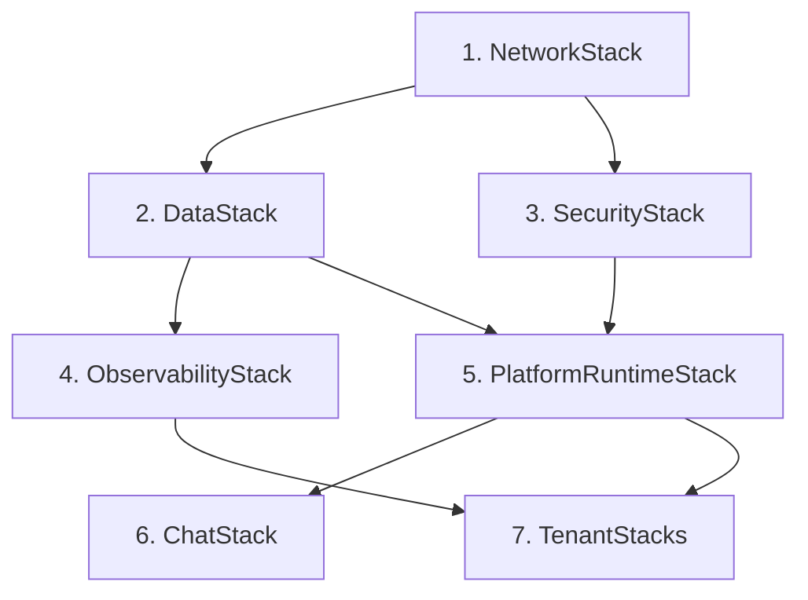

---
tags:
  - chimera
  - operations
  - runbook
  - monitoring
  - incident-response
  - deployment
  - disaster-recovery
date: 2026-03-19
topic: Chimera Operational Runbook
status: complete
---

# Chimera Operational Runbook

> Operational procedures for running the Chimera multi-tenant AI agent platform
> in production. Covers deployment, monitoring, alerting, incident response,
> tenant lifecycle, disaster recovery, and capacity planning.

**Related documents:**
- [[Chimera-Final-Architecture-Plan]] -- Architecture decisions
- [[Chimera-AWS-Component-Blueprint]] -- AWS service specifications
- [[Chimera-Architecture-Review-Security]] -- Security controls and threat model
- [[Chimera-Architecture-Review-Cost-Scale]] -- Cost model and scaling analysis
- [[06-Testing-Strategy]] -- Test pipeline that validates these procedures

---

## 1. Deployment Procedures

### 1.1 Deployment Strategy Overview

Chimera uses a **canary deployment** model for agent runtime changes and
**blue-green** for infrastructure (CDK stack) changes.

| Component | Strategy | Rollback Time | Risk |
|-----------|----------|---------------|------|
| Agent runtime code | Canary (5% -> 25% -> 100%) | <1 minute | Low |
| CDK infrastructure stacks | Blue-green with CloudFormation rollback | <10 minutes | Medium |
| Chat SDK (ECS Fargate) | Rolling update (min healthy 50%) | <5 minutes | Low |
| Cedar policies | Git-versioned, instant reload | <1 minute | Low |
| Tenant configuration | DynamoDB update, immediate effect | Instant | Low |
| Skill registry | S3 upload + DDB metadata, Gateway sync | <60 seconds | Low |

### 1.2 Agent Runtime Deployment

```
Developer pushes code
        |
        v
CodePipeline triggers
        |
        v
Stage 1: Build
  - Docker image built from agent-code/
  - Pushed to ECR: chimera-agent-runtime:{git-sha}
  - Unit + contract tests run
        |
        v
Stage 2: Deploy to Canary
  - AgentCore canary endpoint updated to new image
  - 5% of traffic routed to canary
  - CloudWatch alarm monitoring begins
        |
        v
Stage 3: Canary Bake (30 minutes)
  - Monitor: error rate, latency p99, guardrail triggers
  - Run evaluation suite against canary endpoint
  - Composite score must be >= 80
        |
        v  (auto-promote if healthy)
Stage 4: Progressive Rollout
  - 25% traffic for 15 minutes
  - 50% traffic for 15 minutes
  - 100% traffic
        |
        v  (any alarm -> auto-rollback)
Stage 5: Post-Deploy Validation
  - Synthetic canary checks every 5 minutes
  - Cost anomaly detection for 2 hours
  - Success: tag image as :latest-stable
```

**Canary rollback trigger conditions:**

| Metric | Threshold | Window | Action |
|--------|-----------|--------|--------|
| Error rate (canary) | > 5% | 5 min | Auto-rollback |
| P99 latency (canary) | > 2x baseline | 10 min | Auto-rollback |
| Guardrail trigger rate | > 10% | 15 min | Auto-rollback |
| Evaluation composite score | < 80 | Single eval | Block promotion |
| Cost per session (canary) | > 3x baseline | 15 min | Alert + manual review |

### 1.3 Infrastructure (CDK) Deployment

```bash
# Pre-deployment checklist
npx cdk diff --all                    # Review all changes
npx cdk-nag                           # Security rule validation
# Review CloudFormation changeset in console

# Deploy with rollback protection
npx cdk deploy Chimera-prod-Network \
  --require-approval broadening \
  --rollback true \
  --change-set-name "deploy-$(date +%Y%m%d-%H%M%S)"

# Deploy stacks in dependency order
npx cdk deploy Chimera-prod-Data --require-approval broadening
npx cdk deploy Chimera-prod-Security --require-approval broadening
npx cdk deploy Chimera-prod-Observability
npx cdk deploy Chimera-prod-Runtime --require-approval broadening
npx cdk deploy Chimera-prod-Chat
```

**Stack deployment order (mandatory):**



### 1.4 Emergency Rollback Procedures

**Agent runtime rollback (< 1 minute):**

```bash
# Revert canary to previous stable image
aws bedrock-agent-runtime update-agent-runtime-endpoint \
  --runtime-name chimera-pool \
  --endpoint-name canary \
  --agent-runtime-artifact "ecr://chimera-agent-runtime:latest-stable"

# If production is affected, revert production endpoint too
aws bedrock-agent-runtime update-agent-runtime-endpoint \
  --runtime-name chimera-pool \
  --endpoint-name production \
  --agent-runtime-artifact "ecr://chimera-agent-runtime:latest-stable"
```

**CDK stack rollback (< 10 minutes):**

```bash
# CloudFormation automatic rollback on failure is enabled by default
# For manual rollback to previous version:
aws cloudformation rollback-stack \
  --stack-name Chimera-prod-Runtime \
  --client-request-token "rollback-$(date +%s)"

# Monitor rollback progress
aws cloudformation describe-stack-events \
  --stack-name Chimera-prod-Runtime \
  --query 'StackEvents[?ResourceStatus==`ROLLBACK_COMPLETE`]'
```

**Chat SDK rollback (< 5 minutes):**

```bash
# Force new deployment with previous task definition
aws ecs update-service \
  --cluster chimera-chat \
  --service chat-sdk \
  --task-definition chimera-chat-sdk:PREVIOUS_REVISION \
  --force-new-deployment
```

---

## 2. Monitoring Dashboards

### 2.1 Platform Dashboard

The platform dashboard provides a single-pane-of-glass view of Chimera health.

**CloudWatch Dashboard JSON:**

```json
{
  "widgets": [
    {
      "type": "metric",
      "x": 0, "y": 0, "width": 12, "height": 6,
      "properties": {
        "title": "Agent Invocation Latency",
        "metrics": [
          ["AgentPlatform", "InvocationDuration", {"stat": "p50", "label": "p50"}],
          ["AgentPlatform", "InvocationDuration", {"stat": "p95", "label": "p95"}],
          ["AgentPlatform", "InvocationDuration", {"stat": "p99", "label": "p99"}]
        ],
        "period": 300,
        "view": "timeSeries",
        "yAxis": {"left": {"label": "ms", "min": 0}}
      }
    },
    {
      "type": "metric",
      "x": 12, "y": 0, "width": 12, "height": 6,
      "properties": {
        "title": "Error Rate",
        "metrics": [
          ["AgentPlatform", "Errors", {"stat": "Sum", "label": "Errors"}],
          ["AgentPlatform", "Invocations", {"stat": "Sum", "label": "Total", "yAxis": "right"}]
        ],
        "period": 300,
        "view": "timeSeries"
      }
    },
    {
      "type": "metric",
      "x": 0, "y": 6, "width": 8, "height": 6,
      "properties": {
        "title": "Active Sessions",
        "metrics": [
          ["AgentPlatform", "ActiveSessions", {"stat": "Maximum"}]
        ],
        "period": 60,
        "view": "timeSeries"
      }
    },
    {
      "type": "metric",
      "x": 8, "y": 6, "width": 8, "height": 6,
      "properties": {
        "title": "Token Usage (Hourly)",
        "metrics": [
          ["AgentPlatform", "TokensUsed", {"stat": "Sum", "label": "Input+Output"}]
        ],
        "period": 3600,
        "view": "timeSeries"
      }
    },
    {
      "type": "metric",
      "x": 16, "y": 6, "width": 8, "height": 6,
      "properties": {
        "title": "Cost Accumulation (Daily)",
        "metrics": [
          ["AgentPlatform", "CostAccumulated", {"stat": "Maximum", "label": "Platform Total"}]
        ],
        "period": 86400,
        "view": "timeSeries",
        "yAxis": {"left": {"label": "USD"}}
      }
    },
    {
      "type": "metric",
      "x": 0, "y": 12, "width": 12, "height": 6,
      "properties": {
        "title": "DynamoDB Throttles",
        "metrics": [
          ["AWS/DynamoDB", "ThrottledRequests", "TableName", "chimera-tenants", {"stat": "Sum"}],
          ["AWS/DynamoDB", "ThrottledRequests", "TableName", "chimera-sessions", {"stat": "Sum"}],
          ["AWS/DynamoDB", "ThrottledRequests", "TableName", "chimera-rate-limits", {"stat": "Sum"}]
        ],
        "period": 300,
        "view": "timeSeries"
      }
    },
    {
      "type": "metric",
      "x": 12, "y": 12, "width": 12, "height": 6,
      "properties": {
        "title": "Chat SDK (ECS) Health",
        "metrics": [
          ["AWS/ECS", "CPUUtilization", "ServiceName", "chat-sdk", "ClusterName", "chimera-chat", {"stat": "Average"}],
          ["AWS/ECS", "MemoryUtilization", "ServiceName", "chat-sdk", "ClusterName", "chimera-chat", {"stat": "Average"}]
        ],
        "period": 300,
        "view": "timeSeries"
      }
    },
    {
      "type": "metric",
      "x": 0, "y": 18, "width": 24, "height": 6,
      "properties": {
        "title": "Guardrail Interventions",
        "metrics": [
          ["AgentPlatform", "GuardrailTriggered", {"stat": "Sum", "label": "Blocked"}],
          ["AgentPlatform", "GuardrailPassed", {"stat": "Sum", "label": "Passed"}]
        ],
        "period": 300,
        "view": "timeSeries"
      }
    }
  ]
}
```

### 2.2 Per-Tenant Dashboard Template

Each tenant gets an auto-generated dashboard created by the `AgentObservability`
CDK construct in [[Chimera-AWS-Component-Blueprint|TenantStack]].

| Widget | Metric | Purpose |
|--------|--------|---------|
| Errors (5min) | `Errors{TenantId=X}` | Tenant-specific error rate |
| Latency p99 (5min) | `InvocationDuration{TenantId=X}` | Tenant response times |
| Tokens/hour | `TokensUsed{TenantId=X}` | Token consumption trend |
| Active sessions | `ActiveSessions{TenantId=X}` | Current session count |
| Cost (monthly) | `CostAccumulated{TenantId=X}` | Running cost total |
| Budget utilization | Cost / BudgetLimit | % of monthly budget used |
| Cron job status | Step Functions execution status | Last 10 cron runs |
| Skill invocations | `ToolCalls{TenantId=X}` by skill | Most-used skills |

### 2.3 Operational Logs

| Log Group | Content | Retention |
|-----------|---------|-----------|
| `/chimera/prod/agent-runtime` | Agent execution logs (structured JSON via EMF) | 1 year |
| `/chimera/prod/tenant/{tenantId}` | Per-tenant filtered logs | 1 year |
| `/chimera/prod/chat-sdk` | Chat gateway access + error logs | 90 days |
| `/chimera/prod/api-gateway` | API Gateway access logs | 90 days |
| `/chimera/prod/cedar-audit` | Cedar policy evaluation decisions | 1 year |
| `/chimera/prod/guardrails` | Bedrock Guardrails intervention logs | 1 year |
| `/aws/codepipeline/chimera` | Deployment pipeline logs | 90 days |

**Useful CloudWatch Logs Insights queries:**

```
# Top 10 errors in last hour
fields @timestamp, @message, tenant_id, error_type
| filter level = "ERROR"
| stats count(*) as error_count by error_type, tenant_id
| sort error_count desc
| limit 10

# Slow agent invocations (> 30s)
fields @timestamp, tenant_id, session_id, duration_ms
| filter duration_ms > 30000
| sort duration_ms desc
| limit 20

# Cedar policy denials
fields @timestamp, principal, action, resource, decision
| filter decision = "DENY"
| stats count(*) as denial_count by action, principal
| sort denial_count desc

# Cost tracking: top spending tenants today
fields @timestamp, tenant_id, cost_usd
| filter event_type = "cost_increment"
| stats sum(cost_usd) as total_cost by tenant_id
| sort total_cost desc
| limit 10
```

---

## 3. Alert Hierarchy

### 3.1 Severity Levels

| Severity | Response Time | Notification | Escalation |
|----------|--------------|-------------|------------|
| **SEV1 - Critical** | <15 minutes | PagerDuty + Slack #chimera-incidents | VP after 30 min |
| **SEV2 - High** | <1 hour | Slack #chimera-alerts + email | Manager after 2 hours |
| **SEV3 - Medium** | <4 hours | Slack #chimera-alerts | Triage in daily standup |
| **SEV4 - Low** | Next business day | Slack #chimera-ops | Weekly review |

### 3.2 CloudWatch Alarms

**SEV1 -- Critical Alarms:**

```json
[
  {
    "AlarmName": "Chimera-CRITICAL-PlatformDown",
    "MetricName": "Invocations",
    "Namespace": "AgentPlatform",
    "Statistic": "Sum",
    "Period": 300,
    "EvaluationPeriods": 2,
    "Threshold": 0,
    "ComparisonOperator": "LessThanOrEqualToThreshold",
    "TreatMissingData": "breaching",
    "AlarmDescription": "SEV1: Zero invocations for 10 minutes -- platform may be down"
  },
  {
    "AlarmName": "Chimera-CRITICAL-TenantIsolationBreach",
    "MetricName": "CrossTenantAccessAttempt",
    "Namespace": "AgentPlatform",
    "Statistic": "Sum",
    "Period": 60,
    "EvaluationPeriods": 1,
    "Threshold": 0,
    "ComparisonOperator": "GreaterThanThreshold",
    "AlarmDescription": "SEV1: Cross-tenant data access detected"
  },
  {
    "AlarmName": "Chimera-CRITICAL-DataExfiltration",
    "MetricName": "SkillExfiltrationAttempt",
    "Namespace": "AgentPlatform",
    "Statistic": "Sum",
    "Period": 60,
    "EvaluationPeriods": 1,
    "Threshold": 0,
    "ComparisonOperator": "GreaterThanThreshold",
    "AlarmDescription": "SEV1: Skill attempted data exfiltration to external endpoint"
  }
]
```

**SEV2 -- High Alarms:**

```json
[
  {
    "AlarmName": "Chimera-HIGH-ErrorRateSpike",
    "MetricName": "Errors",
    "Namespace": "AgentPlatform",
    "Statistic": "Sum",
    "Period": 300,
    "EvaluationPeriods": 3,
    "Threshold": 50,
    "ComparisonOperator": "GreaterThanThreshold",
    "AlarmDescription": "SEV2: >50 errors in 5-min window for 15 minutes"
  },
  {
    "AlarmName": "Chimera-HIGH-LatencyDegradation",
    "MetricName": "InvocationDuration",
    "Namespace": "AgentPlatform",
    "Statistic": "p99",
    "Period": 300,
    "EvaluationPeriods": 3,
    "Threshold": 60000,
    "ComparisonOperator": "GreaterThanThreshold",
    "AlarmDescription": "SEV2: P99 latency >60s for 15 minutes"
  },
  {
    "AlarmName": "Chimera-HIGH-DynamoDBThrottling",
    "MetricName": "ThrottledRequests",
    "Namespace": "AWS/DynamoDB",
    "Dimensions": [{"Name": "TableName", "Value": "chimera-sessions"}],
    "Statistic": "Sum",
    "Period": 300,
    "EvaluationPeriods": 2,
    "Threshold": 100,
    "ComparisonOperator": "GreaterThanThreshold",
    "AlarmDescription": "SEV2: DynamoDB throttling >100 requests in 5 minutes"
  },
  {
    "AlarmName": "Chimera-HIGH-GuardrailSurge",
    "MetricName": "GuardrailTriggered",
    "Namespace": "AgentPlatform",
    "Statistic": "Sum",
    "Period": 900,
    "EvaluationPeriods": 1,
    "Threshold": 50,
    "ComparisonOperator": "GreaterThanThreshold",
    "AlarmDescription": "SEV2: >50 guardrail interventions in 15 minutes -- possible attack"
  }
]
```

**SEV3 -- Medium Alarms:**

```json
[
  {
    "AlarmName": "Chimera-MEDIUM-TenantBudgetWarning",
    "MetricName": "CostAccumulated",
    "Namespace": "AgentPlatform",
    "Statistic": "Maximum",
    "Period": 3600,
    "EvaluationPeriods": 1,
    "Threshold": "DYNAMIC (90% of tenant budget)",
    "ComparisonOperator": "GreaterThanThreshold",
    "AlarmDescription": "SEV3: Tenant approaching 90% of monthly budget"
  },
  {
    "AlarmName": "Chimera-MEDIUM-CronJobFailure",
    "MetricName": "ExecutionsFailed",
    "Namespace": "AWS/States",
    "Statistic": "Sum",
    "Period": 3600,
    "EvaluationPeriods": 1,
    "Threshold": 3,
    "ComparisonOperator": "GreaterThanThreshold",
    "AlarmDescription": "SEV3: >3 cron job failures in 1 hour"
  },
  {
    "AlarmName": "Chimera-MEDIUM-HighTokenUsage",
    "MetricName": "TokensUsed",
    "Namespace": "AgentPlatform",
    "Statistic": "Sum",
    "Period": 3600,
    "EvaluationPeriods": 1,
    "Threshold": 5000000,
    "ComparisonOperator": "GreaterThanThreshold",
    "AlarmDescription": "SEV3: >5M tokens in 1 hour (cost anomaly)"
  }
]
```

### 3.3 Composite Alarm

```json
{
  "AlarmName": "Chimera-COMPOSITE-PlatformHealth",
  "AlarmRule": "ALARM(Chimera-HIGH-ErrorRateSpike) OR ALARM(Chimera-HIGH-LatencyDegradation) OR ALARM(Chimera-CRITICAL-PlatformDown)",
  "AlarmDescription": "Composite: Platform health degraded -- check individual alarms",
  "AlarmActions": ["arn:aws:sns:us-west-2:123456:chimera-pagerduty"]
}
```

---

## 4. Common Failure Modes and Remediation

### 4.1 Failure Mode Table

| # | Failure Mode | Symptoms | Impact | Likelihood | Root Cause | Remediation |
|---|-------------|----------|--------|------------|------------|-------------|
| F1 | AgentCore cold start spike | Session creation latency > 5s | High (user-facing) | Medium | Burst traffic after quiet period | Pre-warm sessions via EventBridge before known peaks |
| F2 | Bedrock model throttling | 429 errors, increased p99 | High | Medium | Exceeded region throughput quota | Switch to cross-region inference profile (`us.` prefix) |
| F3 | DynamoDB hot partition | Elevated latency for specific tenants | Medium | Medium | Enterprise tenant with disproportionate traffic | DAX cache for hot keys; consider silo model |
| F4 | Chat SDK OOM | ECS task restarts, dropped connections | High | Low | Large message payloads or connection leak | Increase memory limit; investigate leak; add circuit breaker |
| F5 | Cedar policy misconfiguration | Unexpected DENY for legitimate requests | High | Medium | Policy update with unintended side effects | Rollback to previous policy version from S3; test in staging first |
| F6 | Skill marketplace poisoning | Malicious tool behavior detected | Critical | Low | Compromised or malicious skill published | Quarantine skill; see Section 4.2 |
| F7 | Memory poisoning | Agent behavior drift over sessions | High | Low | Injected content in LTM | Purge affected memory namespace; see Section 4.3 |
| F8 | Cost runaway | Single tenant consuming disproportionate budget | Medium | Medium | Missing or misconfigured budget limit | Enforce budget cap; throttle or suspend tenant |
| F9 | Cognito token expiry cascade | Mass authentication failures | High | Low | Token service issue or clock skew | Extend token validity; verify NTP sync |
| F10 | S3 skill bucket unavailable | Skills fail to load for new sessions | High | Very Low | Regional S3 outage | Skill cache in agent runtime; fail open with built-in skills |

### 4.2 Runbook: Malicious Skill Detected (F6)

**Trigger:** Security alarm, guardrail surge, manual report

| Step | Action | Command/Detail | Time |
|------|--------|----------------|------|
| 1 | **Identify** | Query audit log for skill ID and affected tenants | 2 min |
| 2 | **Quarantine** | Set skill status to `quarantined` in DynamoDB | 1 min |
| 3 | **Kill sessions** | Terminate all active sessions using the skill | 2 min |
| 4 | **Notify tenants** | Send notification via Chat SDK to affected tenants | 5 min |
| 5 | **Analyze impact** | Review VPC Flow Logs, CloudTrail, agent runtime logs | 30 min |
| 6 | **Check persistence** | Scan LTM for injected content; check cron jobs; check IaC PRs | 30 min |
| 7 | **Remediate** | Purge malicious LTM entries; revert any IaC changes | 15 min |
| 8 | **Block author** | Disable skill author's account and all their published skills | 5 min |
| 9 | **Report** | Write incident report with timeline and blast radius | 1 hour |

```bash
# Step 2: Quarantine the skill
aws dynamodb update-item \
  --table-name chimera-skills \
  --key '{"PK": {"S": "TENANT#GLOBAL"}, "SK": {"S": "SKILL#malicious-skill"}}' \
  --update-expression "SET #status = :quarantined, quarantinedAt = :now" \
  --expression-attribute-names '{"#status": "status"}' \
  --expression-attribute-values '{":quarantined": {"S": "quarantined"}, ":now": {"S": "2026-03-19T15:00:00Z"}}'

# Step 3: Find and terminate affected sessions
aws dynamodb query \
  --table-name chimera-sessions \
  --index-name GSI1-agent-activity \
  --key-condition-expression "begins_with(SK, :skill)" \
  --expression-attribute-values '{":skill": {"S": "SKILL#malicious-skill"}}' \
  --projection-expression "PK,SK,sessionId"
# Then terminate each session via AgentCore API
```

### 4.3 Runbook: Memory Poisoning Detected (F7)

**Trigger:** Anomalous agent behavior, security scan finding

| Step | Action | Detail | Time |
|------|--------|--------|------|
| 1 | **Identify tenant** | Find affected tenant from alert or report | 2 min |
| 2 | **Freeze memory writes** | Update Cedar policy to deny all LTM writes for tenant | 2 min |
| 3 | **Export memory** | Dump all LTM records for the tenant to S3 for analysis | 5 min |
| 4 | **Scan for patterns** | Search for shell commands, URLs, instruction overrides | 15 min |
| 5 | **Purge poisoned entries** | Delete identified malicious LTM records | 10 min |
| 6 | **Restore from backup** | If extensive, restore from last known-good S3 snapshot | 15 min |
| 7 | **Re-enable writes** | Update Cedar policy to allow LTM writes with new restrictions | 2 min |
| 8 | **Root cause** | Identify how poisoning occurred (skill? user prompt? A2A?) | 1 hour |

### 4.4 Runbook: Bedrock Model Throttling (F2)

| Step | Action | Detail | Time |
|------|--------|--------|------|
| 1 | **Confirm throttling** | Check CloudWatch for Bedrock `ThrottledRequests` metric | 1 min |
| 2 | **Switch inference profile** | Update agent config to use cross-region profile | 2 min |
| 3 | **Enable model routing** | Route simple queries to Haiku/Nova to reduce Sonnet load | 5 min |
| 4 | **Request quota increase** | File service limit increase via AWS Support | 15 min |
| 5 | **Monitor** | Verify 429 errors decreasing | 10 min |

```python
# Switch to cross-region inference profile
# Update tenant config in DynamoDB
dynamodb.update_item(
    TableName="chimera-tenants",
    Key={"PK": {"S": "TENANT#acme"}, "SK": {"S": "META"}},
    UpdateExpression="SET modelId = :model",
    ExpressionAttributeValues={
        ":model": {"S": "us.anthropic.claude-sonnet-4-6-v1:0"}
        # Cross-region prefix 'us.' for higher throughput
    },
)
```

### 4.5 Runbook: Cost Runaway (F8)

| Step | Action | Detail | Time |
|------|--------|--------|------|
| 1 | **Identify tenant** | Query cost-tracking table for anomalous spend | 2 min |
| 2 | **Assess severity** | Compare current spend vs budget limit and daily average | 2 min |
| 3 | **Throttle** | Reduce tenant rate limit to 1 request/minute | 1 min |
| 4 | **Disable cron** | Pause all EventBridge schedules for the tenant | 2 min |
| 5 | **Notify tenant** | Send budget alert via Chat SDK and email | 5 min |
| 6 | **Investigate** | Check for runaway cron jobs, agent loops, or abuse | 30 min |
| 7 | **Resolve** | Fix root cause; restore rate limits; resume cron | 15 min |

```bash
# Step 3: Throttle tenant
aws dynamodb update-item \
  --table-name chimera-tenants \
  --key '{"PK": {"S": "TENANT#expensive-corp"}, "SK": {"S": "META"}}' \
  --update-expression "SET rateLimitPerMinute = :limit, #status = :throttled" \
  --expression-attribute-names '{"#status": "accountStatus"}' \
  --expression-attribute-values '{":limit": {"N": "1"}, ":throttled": {"S": "throttled"}}'

# Step 4: Disable cron jobs
aws events disable-rule --name "chimera-expensive-corp-daily-digest"
aws events disable-rule --name "chimera-expensive-corp-weekly-report"
```

---

## 5. Tenant Lifecycle Management

### 5.1 Tenant Onboarding

```
Admin runs: chimera tenant create acme --tier=standard
        |
        v
Step Functions workflow triggers:
  1. Create Cognito user group for tenant
  2. Insert tenant record in chimera-tenants DynamoDB
  3. Create tenant IAM role (scoped to partition)
  4. Create S3 prefix structure in tenant bucket
  5. Register default skills in chimera-skills table
  6. Create AgentCore Memory namespace
  7. Create per-tenant CloudWatch dashboard
  8. Create per-tenant CloudWatch alarms
  9. Send welcome notification
  10. Log audit event: tenant_created
        |
        v
Tenant active in ~2 minutes (pool model)
```

**Onboarding checklist:**

| # | Step | Automated | Verification |
|---|------|-----------|-------------|
| 1 | Cognito group created | Yes | `aws cognito-idp list-groups` |
| 2 | DynamoDB tenant record | Yes | Query `chimera-tenants` |
| 3 | IAM role created | Yes | `aws iam get-role` |
| 4 | S3 prefix exists | Yes | `aws s3 ls s3://bucket/tenants/{id}/` |
| 5 | Skills registered | Yes | Query `chimera-skills` |
| 6 | Memory namespace | Yes | AgentCore Memory API |
| 7 | Dashboard created | Yes | CloudWatch console |
| 8 | Alarms active | Yes | `aws cloudwatch describe-alarms` |
| 9 | Welcome sent | Yes | Check Chat SDK logs |
| 10 | Audit logged | Yes | Query `chimera-audit` |

### 5.2 Tenant Tier Changes

| From | To | Actions | Downtime |
|------|----|---------|----------|
| Basic -> Standard | Upgrade | Enable Sonnet model access, increase rate limits, enable cron | None |
| Standard -> Premium | Upgrade | Enable Opus, increase cron limit, expand LTM retention | None |
| Premium -> Enterprise | Upgrade | Deploy dedicated AgentCore Runtime, enable cross-region replication, CMK encryption | <5 min |
| Enterprise -> Premium | Downgrade | Migrate to pool runtime, disable dedicated resources | <10 min (session drain) |
| Any -> Suspended | Suspend | Disable all sessions and cron; retain data | Immediate |

### 5.3 Tenant Offboarding

**Data retention requirements:**

| Data Type | Retention After Offboarding | Action |
|-----------|----------------------------|--------|
| DynamoDB tenant records | 90 days (legal hold) | TTL set, then auto-deleted |
| S3 tenant data | 30 days (recovery period) | Lifecycle rule to Glacier, then delete |
| AgentCore Memory | Immediate delete | Purge namespace |
| Secrets Manager | Immediate delete | Schedule secret deletion (7-day min) |
| CloudWatch logs | Retained per retention policy | No special action |
| Audit records | 7 years (compliance) | TTL set per compliance tier |

```bash
# Tenant offboarding procedure
chimera tenant suspend acme          # Stop all activity
chimera tenant export acme --to s3   # Export data for tenant
chimera tenant delete acme --confirm # Schedule deletion
```

---

## 6. Skill Marketplace Operations

### 6.1 Skill Moderation Workflow

```
Skill submitted by author
        |
        v
Automated pipeline (< 5 minutes):
  1. Rate limit check (max 5 submissions/day/author)
  2. Static analysis (Semgrep rules for dangerous patterns)
  3. Dependency audit (known vulnerable packages)
  4. Secret detection (detect-secrets scan)
  5. WASM sandbox execution test (network-isolated)
        |
        +--> Any failure: REJECT with feedback
        |
        v  All pass
  6. Ed25519 signature by platform
  7. Published with trust_level: "community" (auto-scanned only)
        |
        v
Human review queue (optional, for Tier 1 "verified"):
  8. Manual code review
  9. Permission scope review
  10. If approved: upgrade to trust_level: "verified"
```

### 6.2 Skill Moderation Dashboard

| Metric | Target | Alert |
|--------|--------|-------|
| Skills pending review | < 20 | > 50 pending for > 24 hours |
| Average review time | < 48 hours | > 72 hours |
| Rejection rate | < 30% | > 50% (may indicate unclear guidelines) |
| Quarantined skills (30 day) | 0 | Any quarantine event |
| Author ban rate | < 1% | > 5% |

### 6.3 Skill Incident Response

| Severity | Example | Action |
|----------|---------|--------|
| Low | Skill crashes on edge case input | Add to backlog; notify author |
| Medium | Skill produces incorrect/harmful output | Downgrade trust level; require fix |
| High | Skill attempts unauthorized actions (blocked by Cedar) | Quarantine; investigate author |
| Critical | Skill exfiltrates data or exploits vulnerability | Quarantine all author skills; incident response; potential ban |

---

## 7. Cost Anomaly Detection

### 7.1 Anomaly Detection Rules

```python
# Lambda: chimera-cost-anomaly-detector
# Runs hourly via EventBridge

def detect_anomalies(event, context):
    tenants = get_all_active_tenants()
    for tenant in tenants:
        current_daily = get_today_cost(tenant.id)
        avg_daily = get_7day_average_cost(tenant.id)
        budget_limit = tenant.budget_limit_monthly_usd

        # Rule 1: Daily spend > 3x average
        if avg_daily > 0 and current_daily > avg_daily * 3:
            alert(
                severity="MEDIUM",
                tenant_id=tenant.id,
                message=f"Daily spend ${current_daily:.2f} is {current_daily/avg_daily:.1f}x "
                        f"the 7-day average ${avg_daily:.2f}",
            )

        # Rule 2: On pace to exceed monthly budget
        days_elapsed = get_days_in_current_period()
        days_total = get_days_in_month()
        projected = (get_current_period_cost(tenant.id) / max(days_elapsed, 1)) * days_total
        if projected > budget_limit * 0.9:
            alert(
                severity="HIGH" if projected > budget_limit else "MEDIUM",
                tenant_id=tenant.id,
                message=f"Projected monthly spend ${projected:.2f} exceeds "
                        f"90% of ${budget_limit} budget",
            )

        # Rule 3: Single session cost > $5 (Sonnet) or $25 (Opus)
        expensive_sessions = get_sessions_exceeding_threshold(
            tenant.id, threshold_usd=5.0
        )
        for session in expensive_sessions:
            alert(
                severity="LOW",
                tenant_id=tenant.id,
                message=f"Session {session.id} cost ${session.cost_usd:.2f}",
            )
```

### 7.2 Budget Enforcement Actions

| Budget % Used | Action |
|---------------|--------|
| 70% | Email notification to tenant admin |
| 80% | Slack notification + email |
| 90% | Downgrade default model to Haiku; notify tenant |
| 95% | Disable cron jobs; allow only interactive sessions |
| 100% | Suspend all new sessions; active sessions continue until completion |
| 110% | Force-terminate all active sessions |

### 7.3 Cost Reports

**Weekly cost report (generated by EventBridge cron + Step Functions):**

```markdown
## Chimera Weekly Cost Report - Week of 2026-03-15

### Platform Summary
| Metric | This Week | Last Week | Change |
|--------|-----------|-----------|--------|
| Total cost | $487.23 | $452.10 | +7.8% |
| Active tenants | 87 | 83 | +4 |
| Total sessions | 24,500 | 22,100 | +10.9% |
| Avg cost/session | $0.0199 | $0.0205 | -2.9% |

### Top 5 Tenants by Spend
| Tenant | Spend | % of Total | Sessions |
|--------|-------|------------|----------|
| enterprise-corp | $89.45 | 18.4% | 3,200 |
| acme-inc | $45.20 | 9.3% | 1,800 |
| ...

### Cost Optimization Opportunities
- 3 tenants using Sonnet for simple queries (recommend model routing)
- Prompt caching would save estimated $45/week across all tenants
- 2 cron jobs with >$2/execution (recommend Haiku for digests)
```

---

## 8. Disaster Recovery

### 8.1 RPO/RTO Targets

| Component | RPO (data loss tolerance) | RTO (recovery time) | Strategy |
|-----------|--------------------------|---------------------|----------|
| DynamoDB tables (5 retained) | 0 (PITR enabled) | <1 hour | PITR restore |
| DynamoDB rate-limits table | N/A (ephemeral) | <5 min | Recreate from CDK |
| S3 tenant data | 0 (versioned) | <2 hours | Version restore or cross-region |
| S3 skills | 0 (versioned) | <1 hour | Redeploy from Git |
| Cognito user pool | 0 (managed) | <30 min | AWS managed; export/import backup |
| AgentCore Runtime | N/A (stateless) | <5 min | Redeploy from ECR image |
| AgentCore Memory | Best effort | <1 hour | S3 snapshots; LTM rebuild from exports |
| Chat SDK | N/A (stateless) | <5 min | ECS redeployment |
| Cedar policies | 0 (Git versioned) | <5 min | Redeploy from Git |
| Secrets Manager | 0 (managed) | <15 min | Cross-region replication (enterprise) |

### 8.2 Backup Schedule

| Resource | Backup Method | Frequency | Retention |
|----------|--------------|-----------|-----------|
| DynamoDB (all tables) | PITR (continuous) | Continuous | 35 days |
| DynamoDB (weekly) | On-demand backup | Weekly (Sunday 03:00 UTC) | 90 days |
| S3 tenant bucket | Versioning + cross-region replication | Continuous (enterprise tenants) | 90 days noncurrent |
| S3 skills bucket | Versioning | On every change | 180 days noncurrent |
| Cognito user pool | Export via CLI | Weekly | 90 days |
| AgentCore Memory | S3 session snapshots | On session end | Per-tier retention |
| Cedar policies | Git repository | On every commit | Unlimited (Git) |
| CDK state | CloudFormation + cdk.context.json | On every deploy | Unlimited (Git) |

### 8.3 DynamoDB Point-in-Time Recovery Procedure

```bash
# Step 1: Identify the recovery point (before the incident)
RECOVERY_TIME="2026-03-19T14:30:00Z"

# Step 2: Restore to a new table
aws dynamodb restore-table-to-point-in-time \
  --source-table-name chimera-tenants \
  --target-table-name chimera-tenants-restored \
  --restore-date-time "$RECOVERY_TIME" \
  --no-use-latest-restorable-time

# Step 3: Verify restored data
aws dynamodb scan \
  --table-name chimera-tenants-restored \
  --select COUNT

# Step 4: Swap tables (rename approach via CDK)
# Update DataStack to point to restored table
# Deploy with careful dependency management

# Step 5: Verify application connectivity
```

### 8.4 Cross-Region Failover (Enterprise)

```
Primary Region (us-west-2)          DR Region (us-east-1)
+---------------------+            +---------------------+
| AgentCore Runtime   |            | AgentCore Runtime   |
| Chat SDK (ECS)      |            | Chat SDK (ECS)      |
| API Gateway         |            | API Gateway         |
| DynamoDB (active)   |--global--->| DynamoDB (replica)  |
| S3 (source)         |--repl----->| S3 (replica)        |
| Cognito             |            | Cognito (separate)  |
| Secrets Manager     |--repl----->| Secrets Manager     |
+---------------------+            +---------------------+
         |                                    |
         v                                    v
    Route53 health check -> failover DNS record
```

**Failover procedure:**

| Step | Action | Time |
|------|--------|------|
| 1 | Route53 health check detects primary failure | Auto (30s) |
| 2 | DNS failover to DR region | Auto (60s TTL) |
| 3 | DR AgentCore Runtime accepts traffic | Immediate |
| 4 | DynamoDB global table provides read/write in DR | Immediate |
| 5 | S3 cross-region replicated data available | Immediate |
| 6 | Verify: run synthetic canary against DR endpoint | 5 min |
| 7 | Notify tenants of region failover | 10 min |

---

## 9. Capacity Planning

### 9.1 Growth Model

| Metric | Current (10 tenants) | 6 months (50) | 12 months (200) | 18 months (500) |
|--------|---------------------|----------------|------------------|------------------|
| Active tenants | 10 | 50 | 200 | 500 |
| Sessions/day | 200 | 750 | 3,000 | 7,500 |
| Concurrent sessions | 5 | 25 | 100 | 250 |
| DynamoDB WCU (peak) | 20 | 100 | 400 | 1,000 |
| DynamoDB RCU (peak) | 80 | 400 | 1,600 | 4,000 |
| S3 storage (total) | 5 GB | 25 GB | 200 GB | 1 TB |
| LLM tokens/month | 500K | 2.5M | 10M | 25M |
| Monthly cost | ~$400 | ~$1,500 | ~$5,000 | ~$12,000 |

### 9.2 Scaling Triggers

| Resource | Scaling Trigger | Action |
|----------|----------------|--------|
| DynamoDB (on-demand) | Monthly bill > $500 | Switch to provisioned + auto-scaling |
| DynamoDB (provisioned) | Throttled requests > 0 for 5 min | Increase auto-scaling max |
| Chat SDK (ECS) | CPU > 70% for 5 min | Scale out (auto-scaling policy) |
| Chat SDK (ECS) | Concurrent connections > 500/task | Add tasks |
| AgentCore Runtime | Session creation latency > 3s p99 | Request quota increase |
| Bedrock models | ThrottledRequests > 0 | Switch to cross-region profile |
| CloudWatch metrics | >5,000 custom metrics | Switch to EMF for high-cardinality |
| Secrets Manager | >500 secrets | Evaluate SSM Parameter Store for non-rotating |
| S3 | >1 TB | Review lifecycle policies; archive cold data |

### 9.3 Service Limit Tracking

| Service | Limit | Default | Current Usage | Action At |
|---------|-------|---------|---------------|-----------|
| AgentCore Runtime endpoints | 10/account | 10 | 2 | 7 (request increase) |
| AgentCore concurrent sessions | 10/endpoint | 10 | 5 | 8 (request increase) |
| Bedrock Sonnet RPM | 100 | 100 | 30 | 70 (request increase) |
| Bedrock Sonnet TPM | 200K | 200K | 50K | 150K |
| DynamoDB tables | 2,500/region | 2,500 | 6 | N/A |
| API Gateway WebSocket connections | 500 | 500 | 50 | 400 |
| ECS Fargate tasks/cluster | 500 | 500 | 2 | N/A |
| Cognito user pools | 1,000 | 1,000 | 1 | N/A |
| CloudWatch alarms | 5,000 | 5,000 | 30 | 4,000 |
| Secrets Manager secrets | 500K | 500K | 20 | N/A |
| EventBridge rules | 300/bus | 300 | 10 | 250 |
| Step Functions executions | 1M/month | 1M | 500 | 800K |

### 9.4 Capacity Review Cadence

| Review | Frequency | Participants | Focus |
|--------|-----------|-------------|-------|
| Daily ops check | Daily (async) | On-call engineer | Alarm review, cost check |
| Weekly capacity review | Weekly | Platform team | Growth trends, limit tracking |
| Monthly cost review | Monthly | Platform + finance | Cost optimization, tier pricing |
| Quarterly architecture review | Quarterly | Full team + stakeholders | Scaling strategy, new features |

---

## 10. Operational Checklists

### 10.1 Daily Operations Checklist

| # | Check | Tool | Expected |
|---|-------|------|----------|
| 1 | All CloudWatch alarms in OK state | Console / CLI | 0 alarms in ALARM |
| 2 | Error rate < 1% | Platform dashboard | < 1% |
| 3 | P99 latency < 30s | Platform dashboard | < 30s |
| 4 | No DynamoDB throttling | DynamoDB console | 0 throttled requests |
| 5 | Chat SDK tasks healthy | ECS console | All tasks RUNNING |
| 6 | Cron jobs succeeded | Step Functions console | All executions SUCCEEDED |
| 7 | No security alerts | Guardrails + Cedar logs | 0 critical findings |
| 8 | Cost on track | Cost dashboard | Within 120% of daily average |

### 10.2 Pre-Deployment Checklist

| # | Check | Verified |
|---|-------|----------|
| 1 | All unit tests pass | CI pipeline green |
| 2 | All integration tests pass | CI pipeline green |
| 3 | CDK diff reviewed (no unexpected changes) | Manual review |
| 4 | CDK Nag clean (no security findings) | CI pipeline |
| 5 | No IAM permission changes without approval | CDK diff |
| 6 | Cost estimate within budget | Infracost output |
| 7 | Rollback procedure documented | This runbook |
| 8 | On-call engineer notified | Slack message |
| 9 | Deployment window not during peak hours | Calendar check |
| 10 | Canary bake period configured | Pipeline config |

### 10.3 New Tenant Onboarding Checklist

| # | Step | Verification |
|---|------|-------------|
| 1 | Tenant YAML created in tenants/ directory | Git PR merged |
| 2 | CDK deploy for new TenantStack | CloudFormation CREATE_COMPLETE |
| 3 | Cognito user group exists | `aws cognito-idp list-groups` |
| 4 | First user created and can authenticate | Test login |
| 5 | Agent responds to "Hello" | Manual test |
| 6 | Skills visible in tenant skill list | `chimera skill list` |
| 7 | Dashboard shows data | CloudWatch console |
| 8 | Budget alarm configured | `aws cloudwatch describe-alarms` |
| 9 | Cron jobs scheduled (if any) | `aws events list-rules` |
| 10 | Onboarding audit event logged | Query audit table |

### 10.4 Incident Response Checklist

| # | Step | Action |
|---|------|--------|
| 1 | **Detect** | Alarm fires or report received |
| 2 | **Assess** | Determine severity (SEV1-4) |
| 3 | **Communicate** | Post in #chimera-incidents with initial assessment |
| 4 | **Contain** | Isolate affected component (rollback, throttle, quarantine) |
| 5 | **Investigate** | CloudWatch Logs, X-Ray traces, CloudTrail, VPC Flow Logs |
| 6 | **Remediate** | Fix root cause; deploy fix via canary pipeline |
| 7 | **Verify** | Run relevant test suite; confirm alarms clear |
| 8 | **Communicate** | Post resolution in incident channel |
| 9 | **Report** | Write incident report within 48 hours |
| 10 | **Improve** | Create tasks for preventive measures |

---

## 11. On-Call Guide

### 11.1 On-Call Rotation

| Shift | Hours (UTC) | Coverage |
|-------|-------------|----------|
| US Pacific | 16:00 - 00:00 | Primary on-call |
| US Eastern | 13:00 - 21:00 | Backup on-call |
| Off-hours | 00:00 - 13:00 | PagerDuty SEV1 only; all others wait |

### 11.2 Escalation Path

```
L1: On-call engineer (15 min response for SEV1)
  |
  +--> Cannot resolve in 30 min
  |
L2: Platform team lead
  |
  +--> Cannot resolve in 1 hour
  |
L3: VP Engineering + AWS TAM (for AWS service issues)
```

### 11.3 On-Call Toolkit

| Tool | Purpose | Access |
|------|---------|--------|
| AWS Console | Dashboard, logs, alarms | IAM role: `chimera-oncall-role` |
| CloudWatch Logs Insights | Log search and analysis | Same IAM role |
| X-Ray | Distributed tracing | Same IAM role |
| `chimera` CLI | Tenant management, skill ops | Installed on ops laptop |
| PagerDuty | Incident management | Team account |
| Slack #chimera-incidents | Incident communication | Team channel |
| Grafana (optional) | Alternative dashboards | If configured |

### 11.4 First 5 Minutes Triage Script

```bash
#!/bin/bash
# chimera-triage.sh -- Run this first when paged

echo "=== Chimera Platform Triage ==="
echo "Time: $(date -u)"
echo ""

echo "--- Active Alarms ---"
aws cloudwatch describe-alarms \
  --alarm-name-prefix "Chimera" \
  --state-value ALARM \
  --query 'MetricAlarms[].{Name:AlarmName,State:StateValue,Reason:StateReason}' \
  --output table

echo ""
echo "--- Error Rate (last 30 min) ---"
aws cloudwatch get-metric-statistics \
  --namespace AgentPlatform \
  --metric-name Errors \
  --start-time "$(date -u -v-30M +%Y-%m-%dT%H:%M:%S)" \
  --end-time "$(date -u +%Y-%m-%dT%H:%M:%S)" \
  --period 300 \
  --statistics Sum \
  --output table

echo ""
echo "--- Active Sessions ---"
aws cloudwatch get-metric-statistics \
  --namespace AgentPlatform \
  --metric-name ActiveSessions \
  --start-time "$(date -u -v-10M +%Y-%m-%dT%H:%M:%S)" \
  --end-time "$(date -u +%Y-%m-%dT%H:%M:%S)" \
  --period 60 \
  --statistics Maximum \
  --output table

echo ""
echo "--- ECS Chat SDK Tasks ---"
aws ecs describe-services \
  --cluster chimera-chat \
  --services chat-sdk \
  --query 'services[0].{Running:runningCount,Desired:desiredCount,Pending:pendingCount}' \
  --output table

echo ""
echo "--- Recent Deployments (last 24h) ---"
aws codepipeline list-pipeline-executions \
  --pipeline-name chimera-deploy \
  --query 'pipelineExecutionSummaries[?lastUpdateTime>=`'"$(date -u -v-24H +%Y-%m-%dT%H:%M:%S)"'`].{Status:status,Time:lastUpdateTime}' \
  --output table

echo ""
echo "--- DynamoDB Throttles ---"
for table in chimera-tenants chimera-sessions chimera-skills chimera-rate-limits; do
  throttles=$(aws cloudwatch get-metric-statistics \
    --namespace AWS/DynamoDB \
    --metric-name ThrottledRequests \
    --dimensions Name=TableName,Value=$table \
    --start-time "$(date -u -v-30M +%Y-%m-%dT%H:%M:%S)" \
    --end-time "$(date -u +%Y-%m-%dT%H:%M:%S)" \
    --period 300 \
    --statistics Sum \
    --query 'Datapoints[0].Sum' \
    --output text 2>/dev/null)
  echo "$table: ${throttles:-0} throttled requests"
done
```

---

## 12. Maintenance Windows

### 12.1 Regular Maintenance Schedule

| Task | Frequency | Window | Impact |
|------|-----------|--------|--------|
| CDK stack updates | As needed | Tue/Thu 08:00-10:00 UTC | None (rolling) |
| DynamoDB backup verification | Weekly | Sunday 04:00 UTC | None |
| Cedar policy updates | As needed | Any (instant, no downtime) | None |
| Log retention cleanup | Monthly | 1st Sunday 05:00 UTC | None |
| Secret rotation verification | Monthly | 1st Monday | None |
| Cognito user pool cleanup | Monthly | 1st Monday | None |
| DR failover test | Quarterly | Scheduled, announced 1 week prior | 15 min DR region downtime |
| Penetration test | Quarterly | Scheduled with security team | None (staging environment) |
| Load test | Quarterly | Weekend, staging environment | None (staging only) |

### 12.2 Emergency Maintenance

Emergency maintenance (unplanned patching, security fixes) follows this process:

1. Assess: Is it exploitable now? If yes, proceed immediately
2. Communicate: Post to #chimera-ops with ETA and impact
3. Test: Deploy fix to staging and run security test suite
4. Deploy: Use canary pipeline with shortened bake time (10 min)
5. Verify: Run synthetic canary + targeted tests
6. Communicate: Post resolution

---

## Related Documents

- [[Chimera-Final-Architecture-Plan]] -- Architecture this runbook operates
- [[Chimera-AWS-Component-Blueprint]] -- AWS service details referenced throughout
- [[Chimera-Architecture-Review-Security]] -- Security incident response procedures
- [[Chimera-Architecture-Review-Cost-Scale]] -- Cost thresholds and optimization
- [[06-Testing-Strategy]] -- Test suites used for deployment validation

---

*Operational runbook authored 2026-03-19 by Ops Author agent on team chimera-enhance.*
*Covers deployment, monitoring, alerting, incident response, tenant lifecycle, DR, and capacity planning.*
