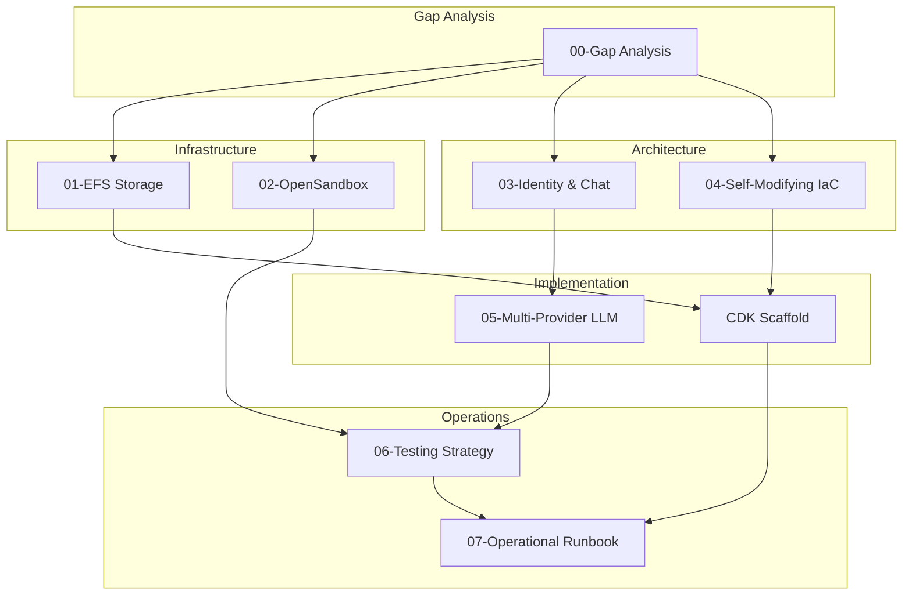

---
tags:
  - research-rabbithole
  - chimera
  - chimera
  - aws
  - enhancement
  - architecture
date: 2026-03-19
topic: Chimera Enhancement Session
status: complete
project: AWS Chimera
---

# Chimera Enhancement Index — AWS Chimera

> **Session purpose:** Review, deepen, and extend the existing 31,000-line Chimera
> research corpus. Fill implementation gaps, add CDK scaffold code, produce operational
> documentation, and prepare for the AWS Chimera project.

**Project renamed:** Chimera → **AWS Chimera** — the multi-formed, self-evolving
agent platform. Repo: `~/Documents/DevBox/chimera/`

---

## What Was Added

This session produced **12,308 lines** of new documentation and code across 8 deliverables,
plus a gap analysis that identified 14 critical issues in the existing corpus.

### Enhancement Documents

| # | Document | Lines | Description |
|---|----------|------:|-------------|
| 0 | [[00-Gap-Analysis-Report]] | 335 | Critical gaps, contradictions, missing docs across all 28 existing documents |
| 1 | [[01-EFS-Agent-Workspace-Storage]] | 1,105 | EFS vs S3 decision matrix, multi-tenant Access Points, CDK constructs, cost models |
| 2 | [[02-OpenSandbox-Code-Interpreter-Deep-Dive]] | 1,742 | Firecracker MicroVMs, WASM sandboxes, E2B, OpenFang 16-layer security mapping |
| 3 | [[03-Cross-Platform-Identity-Chat-Routing]] | 2,247 | Identity linking DynamoDB schema, Vercel Chat SDK adapters, 4 sequence diagrams |
| 4 | [[04-Self-Modifying-IaC-Patterns]] | 2,404 | 3-layer IaC model, Cedar constraints, CDK self-modification pipeline, OpenTofu/Pulumi |
| 5 | [[05-Multi-Provider-LLM-Implementation]] | 1,726 | 15 providers via Strands, LiteLLM proxy, Bayesian model routing, fallback chains |
| 6 | [[06-Testing-Strategy]] | 1,550 | Unit/integration/E2E/security testing, 10-stage CI/CD, agent evaluation framework |
| 7 | [[07-Operational-Runbook]] | 1,199 | Canary deploys, CloudWatch dashboards, 10 failure mode runbooks, DR procedures |
| **Total** | | **12,308** | |

### CDK Scaffold (Phase 0-1)

| File | Purpose |
|------|---------|
| `infra/package.json` | Dependencies (aws-cdk-lib, constructs) |
| `infra/tsconfig.json` | Strict TypeScript config |
| `infra/cdk.json` | CDK app config |
| `infra/bin/chimera.ts` | App entry point, 3 stacks with dependency ordering |
| `infra/lib/network-stack.ts` | VPC, 3 subnets, NAT, 9 VPC endpoints, 4 security groups |
| `infra/lib/data-stack.ts` | 6 DynamoDB tables + GSIs, 3 S3 buckets with lifecycle |
| `infra/lib/security-stack.ts` | Cognito user pool, WAF WebACL, KMS key |
| `infra/constructs/tenant-agent.ts` | L3 construct: IAM, Cognito group, EventBridge cron, CloudWatch dashboard |

## Gap Analysis Highlights

> [!warning] Critical Contradictions Found
> The gap analyst identified 4 major contradictions across the existing 28 documents:
> - DynamoDB schema: 4 incompatible versions (resolved → 6-table in CDK scaffold)
> - Cost figures: 3 different numbers for 100 tenants ($2,582 vs $3,085 vs $2,850)
> - CDK stacks: 3 different counts (4-5 vs 7 vs 8)
> - Cedar entity model: 4 incompatible schemas

> [!tip] Previously Missing (Now Covered)
> - Testing strategy → [[06-Testing-Strategy]]
> - Operational runbook → [[07-Operational-Runbook]]
> - EFS patterns → [[01-EFS-Agent-Workspace-Storage]]
> - Sandbox deep dive → [[02-OpenSandbox-Code-Interpreter-Deep-Dive]]
> - Cross-platform identity → [[03-Cross-Platform-Identity-Chat-Routing]]

## Suggested Reading Order

1. **Start with gaps:** [[00-Gap-Analysis-Report]] — understand what was weak
2. **New infrastructure:** [[01-EFS-Agent-Workspace-Storage]] → [[02-OpenSandbox-Code-Interpreter-Deep-Dive]]
3. **New architecture:** [[03-Cross-Platform-Identity-Chat-Routing]] → [[04-Self-Modifying-IaC-Patterns]]
4. **Implementation:** [[05-Multi-Provider-LLM-Implementation]] → CDK scaffold code
5. **Operations:** [[06-Testing-Strategy]] → [[07-Operational-Runbook]]

## Document Relationship Graph



## AWS Chimera Repository

All documentation and code has been copied to: `~/Documents/DevBox/chimera/`

```
chimera/
├── README.md                              # Project overview
├── docs/research/
│   ├── openclaw-nemoclaw-openfang/        # 9 docs (6,991 lines)
│   ├── agentcore-strands/                 # 10 docs (10,848 lines)
│   ├── architecture-reviews/              # 12 docs (~14,000 lines)
│   ├── enhancement/                       # 8 docs (12,308 lines)
│   └── earlier/                           # 8 docs (earlier OpenClaw on AWS research)
├── infra/                                 # CDK scaffold (8 files)
│   ├── bin/chimera.ts
│   ├── lib/{network,data,security}-stack.ts
│   └── constructs/tenant-agent.ts
└── .gitignore
```

## Cumulative Research Corpus

| Collection | Documents | Lines |
|-----------|----------|------:|
| OpenClaw/NemoClaw/OpenFang research | 9 | 6,991 |
| AgentCore & Strands research | 10 | 10,848 |
| Architecture reviews & designs | 12 | ~14,000 |
| Enhancement documents (this session) | 8 | 12,308 |
| Earlier OpenClaw on AWS research | 8 | ~4,000 |
| **Total** | **47** | **~48,000** |

## Next Steps

1. **Resolve contradictions** — canonicalize DynamoDB schema, cost model, and Cedar entities (gap report priority)
2. **Rename Chimera → Chimera** throughout all docs (search-replace pass)
3. **Add API specification** — OpenAPI/AsyncAPI for all endpoints (gap report: missing)
4. **SSE bridge implementation** — connect Strands streaming to Vercel Data Stream Protocol (gap report: critical)
5. **Initial commit** — commit the chimera repo with all research + scaffold
6. **Phase 0 implementation** — `cdk deploy` the foundation stacks

## Research Metadata

- **Date:** 2026-03-19
- **Team:** chimera-enhance (8 agents, 3 replacements)
- **New lines produced:** 12,308 (docs) + ~800 (CDK code) = ~13,100
- **Cumulative corpus:** ~48,000 lines across 47+ documents
- **Agent success rate:** 5/8 first-attempt, 3/8 required replacement (write-as-you-go failure)
- **Project:** AWS Chimera (`~/Documents/DevBox/chimera/`)

---

*Enhancement session completed 2026-03-19. 8 specialist agents across 2 waves.*
*Project renamed: Chimera → AWS Chimera — where agents are forged.*
