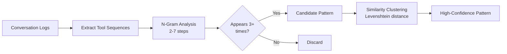
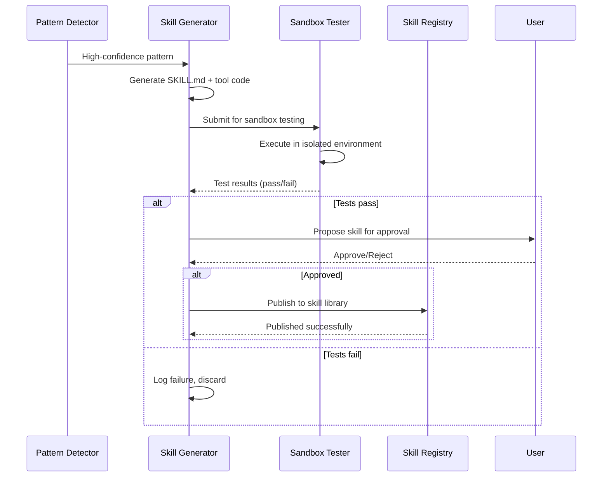

---
tags:
  - research
  - self-evolution
  - auto-skill-generation
  - chimera
  - aws
date: 2026-03-19
topic: Auto-Skill Generation for AWS Chimera
status: complete
---

# Auto-Skill Generation: Detecting Capability Gaps & Creating Skills

> How Chimera agents automatically identify repetitive patterns in their work, detect capability
> gaps, and generate new reusable skills without human intervention.

**Related:** [[ClawCore-Self-Evolution-Engine]] | [[README]]

---

## Executive Summary

Auto-skill generation enables Chimera agents to **learn new capabilities from their own behavior**. When an agent repeatedly performs the same multi-step task, the system:

1. **Detects the pattern** through conversation log analysis
2. **Extracts the workflow** into a structured skill definition
3. **Tests the skill** in an isolated sandbox (AgentCore Code Interpreter)
4. **Proposes the skill** to the tenant for approval
5. **Publishes to the skill library** once approved

This creates a **self-expanding capability surface** where agents become more capable over time without developer intervention.

---

## Pattern Detection: Identifying Skill Opportunities

### Three Detection Strategies

#### 1. Tool Call Sequence Analysis (Primary)

The most reliable signal for skill generation is **repeated tool call sequences**.



**Implementation:**

```python
# infra/lambda/pattern-detector/main.py
import boto3
from datetime import datetime, timedelta
from collections import Counter, defaultdict
from typing import List, Dict, Tuple

dynamodb = boto3.resource("dynamodb")
sessions_table = dynamodb.Table("chimera-sessions")

def detect_tool_sequence_patterns(
    tenant_id: str,
    window_days: int = 14,
    min_occurrences: int = 3,
    min_steps: int = 2,
    max_steps: int = 7
) -> List[Dict]:
    """
    Detect repeated multi-step tool sequences in agent conversations.

    Returns patterns that appear at least `min_occurrences` times within
    the last `window_days` days.
    """
    cutoff = (datetime.utcnow() - timedelta(days=window_days)).isoformat()

    # Query recent sessions for this tenant
    response = sessions_table.query(
        IndexName="tenant-timestamp-index",
        KeyConditionExpression="tenant_id = :tid AND created_at > :cutoff",
        ExpressionAttributeValues={
            ":tid": tenant_id,
            ":cutoff": cutoff,
        },
        ProjectionExpression="session_id, conversation_log",
    )

    # Extract tool call sequences from each session
    sequences = []
    session_contexts = {}

    for session in response["Items"]:
        tool_seq = []
        user_intents = []

        for turn in session.get("conversation_log", []):
            # Track user intent (first user message before tool calls)
            if turn.get("role") == "user" and not tool_seq:
                user_intents.append(turn.get("content", "")[:200])

            # Extract tool calls
            if turn.get("role") == "assistant" and turn.get("tool_calls"):
                for tc in turn["tool_calls"]:
                    tool_seq.append({
                        "name": tc["name"],
                        "params": tc.get("parameters", {}),
                    })

        if len(tool_seq) >= min_steps:
            seq_key = tuple(t["name"] for t in tool_seq)
            sequences.append(seq_key)
            session_contexts[seq_key] = {
                "full_sequence": tool_seq,
                "user_intent": user_intents[0] if user_intents else "",
                "session_id": session["session_id"],
            }

    # Find repeated subsequences using n-gram extraction
    pattern_counts = Counter()
    pattern_examples = defaultdict(list)

    for seq in sequences:
        # Generate all n-grams from min_steps to max_steps
        for length in range(min_steps, min(len(seq) + 1, max_steps + 1)):
            for start in range(len(seq) - length + 1):
                subseq = seq[start:start + length]
                pattern_counts[subseq] += 1

                # Keep track of examples (limit to 5 per pattern)
                if len(pattern_examples[subseq]) < 5:
                    pattern_examples[subseq].append(session_contexts.get(seq, {}))

    # Filter to patterns that appear >= min_occurrences
    candidates = []
    for pattern, count in pattern_counts.most_common(50):
        if count >= min_occurrences:
            # Calculate confidence score based on consistency
            examples = pattern_examples[pattern]
            confidence = compute_pattern_confidence(pattern, examples)

            candidates.append({
                "pattern": list(pattern),
                "occurrences": count,
                "steps": len(pattern),
                "confidence": round(confidence, 3),
                "examples": examples[:3],  # Keep top 3 examples
                "user_intents": [ex.get("user_intent", "") for ex in examples[:3]],
            })

    # Sort by confidence * occurrences (high-value patterns first)
    candidates.sort(key=lambda p: p["confidence"] * p["occurrences"], reverse=True)

    return candidates


def compute_pattern_confidence(pattern: Tuple[str], examples: List[Dict]) -> float:
    """
    Calculate confidence score for a pattern based on:
    - Consistency of parameter types across occurrences
    - Clarity of user intent
    - Success rate of executions
    """
    if not examples:
        return 0.0

    # Check parameter consistency
    param_consistency = 0.0
    if len(examples) > 1:
        # Compare parameter structures across examples
        first_params = [
            set(t.get("params", {}).keys())
            for t in examples[0].get("full_sequence", [])
        ]

        matching = 0
        for ex in examples[1:]:
            ex_params = [
                set(t.get("params", {}).keys())
                for t in ex.get("full_sequence", [])
            ]
            if ex_params == first_params:
                matching += 1

        param_consistency = matching / (len(examples) - 1)

    # Intent clarity (non-empty user messages)
    intent_clarity = sum(
        1 for ex in examples if ex.get("user_intent", "").strip()
    ) / len(examples)

    # Combined score
    return (param_consistency * 0.6) + (intent_clarity * 0.4)
```

#### 2. Failure-Driven Skill Generation

When agents repeatedly fail at the same task, generate a skill to prevent future failures.

```python
# infra/lambda/pattern-detector/failure_detector.py
def detect_failure_patterns(tenant_id: str, window_days: int = 7) -> List[Dict]:
    """
    Identify tasks where the agent repeatedly makes mistakes,
    suggesting a need for a specialized skill or tool.
    """
    cutoff = (datetime.utcnow() - timedelta(days=window_days)).isoformat()

    response = sessions_table.query(
        IndexName="tenant-timestamp-index",
        KeyConditionExpression="tenant_id = :tid AND created_at > :cutoff",
        ExpressionAttributeValues={":tid": tenant_id, ":cutoff": cutoff},
    )

    failure_patterns = defaultdict(lambda: {"count": 0, "contexts": []})

    for session in response["Items"]:
        log = session.get("conversation_log", [])

        for i, turn in enumerate(log):
            # Detect failures: tool errors, user corrections, retry patterns
            if turn.get("role") == "tool" and turn.get("status") == "error":
                error_type = classify_error(turn.get("content", ""))
                task_context = extract_task_context(log, i)

                failure_patterns[error_type]["count"] += 1
                failure_patterns[error_type]["contexts"].append(task_context)

            # Detect user corrections
            if turn.get("role") == "user":
                content_lower = turn.get("content", "").lower()
                correction_signals = [
                    "no, ", "that's wrong", "try again", "incorrect",
                    "i meant", "please fix", "not quite"
                ]

                if any(sig in content_lower for sig in correction_signals):
                    prior_turn = log[i-1] if i > 0 else {}
                    task_context = extract_task_context(log, i)

                    failure_patterns["user_correction"]["count"] += 1
                    failure_patterns["user_correction"]["contexts"].append({
                        "user_message": turn.get("content", "")[:300],
                        "prior_assistant": prior_turn.get("content", "")[:300],
                        "task": task_context,
                    })

    # Return failure patterns that occur >= 3 times
    return [
        {
            "failure_type": ftype,
            "occurrences": data["count"],
            "contexts": data["contexts"][:5],
            "skill_recommendation": recommend_skill_for_failure(ftype, data),
        }
        for ftype, data in failure_patterns.items()
        if data["count"] >= 3
    ]


def classify_error(error_message: str) -> str:
    """Classify error into skill-relevant categories."""
    error_lower = error_message.lower()

    if "permission" in error_lower or "unauthorized" in error_lower:
        return "permission_error"
    elif "not found" in error_lower or "404" in error_lower:
        return "resource_not_found"
    elif "timeout" in error_lower or "timed out" in error_lower:
        return "timeout"
    elif "validation" in error_lower or "invalid" in error_lower:
        return "validation_error"
    elif "rate limit" in error_lower or "throttl" in error_lower:
        return "rate_limit"
    else:
        return "unknown_error"


def recommend_skill_for_failure(
    failure_type: str,
    failure_data: Dict
) -> Dict:
    """
    Generate a skill recommendation based on failure pattern.
    """
    recommendations = {
        "permission_error": {
            "skill_type": "permission_checker",
            "description": "Pre-flight permission validation before operations",
            "tools": ["check_iam_policy", "simulate_permissions"],
        },
        "resource_not_found": {
            "skill_type": "resource_validator",
            "description": "Verify resource existence before operations",
            "tools": ["list_resources", "describe_resource"],
        },
        "rate_limit": {
            "skill_type": "rate_limiter",
            "description": "Exponential backoff and retry with jitter",
            "tools": ["retry_with_backoff", "check_rate_limit_status"],
        },
        "validation_error": {
            "skill_type": "input_validator",
            "description": "Validate inputs against schema before submission",
            "tools": ["validate_against_schema", "sanitize_input"],
        },
    }

    return recommendations.get(failure_type, {
        "skill_type": "generic_error_handler",
        "description": f"Handle {failure_type} gracefully",
        "tools": ["log_error", "notify_user"],
    })
```

#### 3. User Request Pattern Mining

Analyze user requests to identify frequently asked tasks that don't yet have dedicated skills.

```python
# infra/lambda/pattern-detector/request_analyzer.py
from typing import List, Dict
import boto3

bedrock = boto3.client("bedrock-runtime")

def analyze_user_request_patterns(tenant_id: str, window_days: int = 30) -> List[Dict]:
    """
    Use LLM to cluster user requests into task categories,
    identifying high-frequency tasks without dedicated skills.
    """
    cutoff = (datetime.utcnow() - timedelta(days=window_days)).isoformat()

    # Fetch user messages only
    response = sessions_table.query(
        IndexName="tenant-timestamp-index",
        KeyConditionExpression="tenant_id = :tid AND created_at > :cutoff",
        ExpressionAttributeValues={":tid": tenant_id, ":cutoff": cutoff},
    )

    user_requests = []
    for session in response["Items"]:
        for turn in session.get("conversation_log", []):
            if turn.get("role") == "user":
                user_requests.append({
                    "content": turn.get("content", ""),
                    "session_id": session["session_id"],
                    "timestamp": turn.get("timestamp"),
                })

    if not user_requests:
        return []

    # Use LLM to cluster requests into task categories
    clustering_prompt = f"""Analyze these {len(user_requests)} user requests and identify
the top 10 most common task types. For each task type, provide:
- Task category name
- Description
- Example requests (3-5)
- Estimated frequency

User requests (truncated):
{json.dumps([r["content"][:100] for r in user_requests[:100]], indent=2)}

Output JSON:
[{{"category": "...", "description": "...", "examples": [...], "frequency": ...}}]
"""

    response = bedrock.invoke_model(
        modelId="us.anthropic.claude-sonnet-4-6-v1:0",
        body=json.dumps({
            "anthropic_version": "bedrock-2023-05-31",
            "messages": [{"role": "user", "content": clustering_prompt}],
            "max_tokens": 4000,
            "temperature": 0.3,
        }),
    )

    result = json.loads(response["body"].read())
    clusters = json.loads(result["content"][0]["text"])

    # Check which clusters lack dedicated skills
    skills_table = dynamodb.Table("chimera-skills")
    existing_skills = skills_table.query(
        KeyConditionExpression="tenant_id = :tid",
        ExpressionAttributeValues={":tid": tenant_id},
    )["Items"]

    existing_categories = {
        skill.get("category", "").lower() for skill in existing_skills
    }

    gaps = []
    for cluster in clusters:
        category = cluster["category"].lower()
        if category not in existing_categories and cluster["frequency"] >= 5:
            gaps.append({
                "task_category": cluster["category"],
                "description": cluster["description"],
                "examples": cluster["examples"],
                "frequency": cluster["frequency"],
                "skill_opportunity": True,
            })

    return gaps
```

---

## Skill Generation: From Pattern to Executable Code

### Generation Pipeline



### Skill Template Generation

```python
# infra/lambda/skill-generator/generator.py
from typing import Dict, List
import json

def generate_skill_from_pattern(
    pattern: List[str],
    examples: List[Dict],
    tenant_id: str,
    metadata: Dict
) -> Dict:
    """
    Generate a complete skill definition from a detected pattern.

    Returns:
        {
            "skill_name": str,
            "skill_md": str,  # SKILL.md content
            "tool_code": str,  # Python tool implementation
            "test_cases": List[Dict],  # Generated test cases
            "confidence": float,
        }
    """
    skill_name = derive_skill_name(pattern, examples)
    tool_name = skill_name.lower().replace("-", "_")

    # Generate SKILL.md using LLM
    skill_md_prompt = f"""Generate a SKILL.md file for an auto-generated skill.

Pattern detected: {' → '.join(pattern)}
Occurrences: {metadata.get('occurrences', 'N/A')}
Confidence: {metadata.get('confidence', 0.0):.2f}

Example user intents:
{json.dumps(metadata.get('user_intents', []), indent=2)}

Example tool sequences:
{json.dumps(examples[:2], indent=2)}

Generate a complete SKILL.md with:
1. Clear "When to Use" section
2. Step-by-step workflow
3. Parameters and return values
4. Error handling notes
5. Example usage

Format:
---
name: {skill_name}
description: <one-line description>
category: <category>
auto_generated: true
confidence: {metadata.get('confidence', 0.0):.2f}
---

# {skill_name}

> Auto-generated skill from {metadata.get('occurrences', 'N/A')} observed repetitions.

## When to Use

[Describe when this skill should be invoked]

## Workflow

[Step-by-step process]

## Parameters

[Input parameters]

## Returns

[Output format]

## Error Handling

[Common failures and mitigations]

## Example

[Usage example]
"""

    skill_md_response = bedrock.invoke_model(
        modelId="us.anthropic.claude-sonnet-4-6-v1:0",
        body=json.dumps({
            "anthropic_version": "bedrock-2023-05-31",
            "messages": [{"role": "user", "content": skill_md_prompt}],
            "max_tokens": 3000,
            "temperature": 0.5,
        }),
    )

    skill_md = json.loads(skill_md_response["body"].read())["content"][0]["text"]

    # Generate tool implementation
    tool_code_prompt = f"""Generate Python tool implementation for this skill.

Skill: {skill_name}
Pattern: {pattern}

The tool should:
1. Execute the pattern: {' → '.join(pattern)}
2. Handle the parameters from examples
3. Include error handling and validation
4. Return structured results

Generate a complete Python function using AWS SDK (boto3) where applicable.
Use type hints and docstrings.

Format:
```python
import boto3
from typing import Dict, List, Optional

def {tool_name}(
    tenant_id: str,
    # ... parameters based on pattern
) -> Dict:
    \"\"\"
    Auto-generated tool for {skill_name}.

    Args:
        tenant_id: Tenant identifier
        # ... parameter descriptions

    Returns:
        Dict with results and status
    \"\"\"
    # Implementation
    pass
```
"""

    tool_code_response = bedrock.invoke_model(
        modelId="us.anthropic.claude-sonnet-4-6-v1:0",
        body=json.dumps({
            "anthropic_version": "bedrock-2023-05-31",
            "messages": [{"role": "user", "content": tool_code_prompt}],
            "max_tokens": 2000,
            "temperature": 0.3,
        }),
    )

    tool_code_raw = json.loads(tool_code_response["body"].read())["content"][0]["text"]
    tool_code = extract_code_block(tool_code_raw, language="python")

    # Generate test cases
    test_cases = generate_test_cases(pattern, examples, tool_name)

    return {
        "skill_name": skill_name,
        "skill_md": skill_md,
        "tool_code": tool_code,
        "test_cases": test_cases,
        "confidence": metadata.get("confidence", 0.0),
        "pattern": pattern,
        "metadata": metadata,
    }


def derive_skill_name(pattern: List[str], examples: List[Dict]) -> str:
    """
    Generate a descriptive skill name from the tool pattern.

    Examples:
        ["read_file", "grep", "edit_file"] → "search-and-replace"
        ["list_s3_objects", "download_file"] → "s3-file-retriever"
    """
    # Use LLM to generate a concise, descriptive name
    name_prompt = f"""Generate a concise skill name (kebab-case) for this tool pattern:

Pattern: {' → '.join(pattern)}

Examples of when users invoke this:
{json.dumps([ex.get('user_intent', '') for ex in examples[:3]], indent=2)}

Requirements:
- Kebab-case (lowercase with hyphens)
- 2-4 words max
- Descriptive of the task
- No generic words like "skill" or "tool"

Examples:
- Pattern: ["read_file", "grep", "edit"] → "search-and-replace"
- Pattern: ["list_s3", "download"] → "s3-file-retriever"

Output only the name, nothing else.
"""

    response = bedrock.invoke_model(
        modelId="us.amazon.nova-micro-v1:0",  # Use cheaper model for simple task
        body=json.dumps({
            "messages": [{"role": "user", "content": name_prompt}],
            "max_tokens": 50,
            "temperature": 0.7,
        }),
    )

    name = json.loads(response["body"].read())["content"][0]["text"].strip()

    # Sanitize
    name = name.lower().replace(" ", "-").replace("_", "-")
    name = "".join(c for c in name if c.isalnum() or c == "-")

    return name


def generate_test_cases(
    pattern: List[str],
    examples: List[Dict],
    tool_name: str
) -> List[Dict]:
    """
    Generate test cases based on pattern examples.
    """
    test_cases = []

    for i, example in enumerate(examples[:3]):
        # Extract parameters from example tool calls
        params = {}
        for step in example.get("full_sequence", []):
            params.update(step.get("params", {}))

        test_cases.append({
            "test_id": f"test_{i+1}",
            "description": f"Test case from example {i+1}",
            "input": params,
            "expected_pattern": pattern,
            "timeout_seconds": 30,
        })

    return test_cases
```

---

## Sandbox Testing: Validating Generated Skills

### AgentCore Code Interpreter Integration

```python
# infra/lambda/skill-tester/tester.py
import boto3
import json
from typing import Dict, List

bedrock_agent = boto3.client("bedrock-agent-runtime")

def test_skill_in_sandbox(
    skill_code: str,
    test_cases: List[Dict],
    tenant_id: str
) -> Dict:
    """
    Test a generated skill in AgentCore Code Interpreter sandbox.

    Returns test results with pass/fail status for each test case.
    """
    results = {
        "total_tests": len(test_cases),
        "passed": 0,
        "failed": 0,
        "errors": [],
        "test_results": [],
    }

    for test_case in test_cases:
        try:
            # Execute in isolated Code Interpreter environment
            response = bedrock_agent.invoke_inline_agent(
                enableTrace=True,
                inputText=json.dumps(test_case["input"]),
                inlineAgentPayload={
                    "modelId": "us.anthropic.claude-sonnet-4-6-v1:0",
                    "instruction": f"""You are testing an auto-generated skill.
Execute the provided code with the test input and return results.

Code to test:
```python
{skill_code}
```

Test input: {json.dumps(test_case["input"])}

Execute the function and return the result as JSON.""",
                    "codeInterpreterConfiguration": {
                        "sessionTimeout": 30,
                        "networkAccess": {
                            "allowedRegions": ["us-east-1"],  # Restricted network
                        },
                    },
                },
            )

            # Parse execution result
            execution_output = ""
            for event in response.get("completion", []):
                if "chunk" in event:
                    execution_output += event["chunk"].get("bytes", b"").decode()

            # Check if execution succeeded
            test_result = {
                "test_id": test_case["test_id"],
                "status": "passed",
                "output": execution_output,
                "execution_time_ms": response.get("executionTimeMs", 0),
            }

            results["passed"] += 1
            results["test_results"].append(test_result)

        except Exception as e:
            results["failed"] += 1
            results["errors"].append({
                "test_id": test_case["test_id"],
                "error": str(e),
                "error_type": type(e).__name__,
            })
            results["test_results"].append({
                "test_id": test_case["test_id"],
                "status": "failed",
                "error": str(e),
            })

    results["pass_rate"] = results["passed"] / results["total_tests"] if results["total_tests"] > 0 else 0

    return results
```

### Security & Isolation

**Critical safeguards for sandbox testing:**

1. **Network isolation** — Code Interpreter sandboxes have no outbound network access by default
2. **Timeout limits** — Max 30 seconds per test execution
3. **Resource limits** — CPU/memory quotas prevent runaway processes
4. **No persistent state** — Each test runs in a fresh environment
5. **IAM restrictions** — Sandbox execution role has minimal permissions

```python
# infra/cdk/sandbox-execution-role.ts
const sandboxExecutionRole = new iam.Role(this, 'SandboxExecutionRole', {
  assumedBy: new iam.ServicePrincipal('bedrock.amazonaws.com'),
  description: 'Minimal permissions for skill sandbox testing',
  inlinePolicies: {
    'sandbox-policy': new iam.PolicyDocument({
      statements: [
        // Allow logging only
        new iam.PolicyStatement({
          effect: iam.Effect.ALLOW,
          actions: [
            'logs:CreateLogGroup',
            'logs:CreateLogStream',
            'logs:PutLogEvents',
          ],
          resources: [`arn:aws:logs:*:${this.account}:log-group:/aws/bedrock/skill-sandbox/*`],
        }),
        // Explicitly deny dangerous operations
        new iam.PolicyStatement({
          effect: iam.Effect.DENY,
          actions: [
            'iam:*',
            'sts:AssumeRole',
            's3:DeleteBucket',
            'dynamodb:DeleteTable',
            'lambda:DeleteFunction',
          ],
          resources: ['*'],
        }),
      ],
    }),
  },
});
```

---

## Skill Approval Workflow

### User Notification & Approval

```python
# infra/lambda/skill-publisher/approval.py
import boto3

sns = boto3.client("sns")
dynamodb = boto3.resource("dynamodb")
pending_table = dynamodb.Table("chimera-pending-skills")

def propose_skill_to_user(
    tenant_id: str,
    skill_data: Dict,
    test_results: Dict
) -> Dict:
    """
    Notify the user about a newly generated skill and request approval.
    """
    skill_id = f"skill-{datetime.utcnow().strftime('%Y%m%d%H%M%S')}"

    # Store in pending skills table
    pending_table.put_item(
        Item={
            "tenant_id": tenant_id,
            "skill_id": skill_id,
            "skill_name": skill_data["skill_name"],
            "skill_md": skill_data["skill_md"],
            "tool_code": skill_data["tool_code"],
            "confidence": skill_data["confidence"],
            "pattern": skill_data["pattern"],
            "test_results": test_results,
            "status": "pending_approval",
            "created_at": datetime.utcnow().isoformat(),
            "expires_at": (datetime.utcnow() + timedelta(days=7)).isoformat(),
        }
    )

    # Send notification (SNS → Email/Slack/Chat UI)
    message = f"""🔧 New Skill Generated: {skill_data["skill_name"]}

I noticed you've performed this task {skill_data['metadata']['occurrences']} times:
Pattern: {' → '.join(skill_data['pattern'])}

I've created a reusable skill to make this faster in the future.

Confidence: {skill_data['confidence']:.1%}
Test Results: {test_results['passed']}/{test_results['total_tests']} passed

To approve:
- Review the skill: https://chimera.console/skills/pending/{skill_id}
- Approve: POST /api/skills/{skill_id}/approve
- Reject: POST /api/skills/{skill_id}/reject

This proposal expires in 7 days.
"""

    sns.publish(
        TopicArn=f"arn:aws:sns:us-east-1:{os.environ['AWS_ACCOUNT_ID']}:chimera-tenant-{tenant_id}",
        Subject=f"New Skill Proposal: {skill_data['skill_name']}",
        Message=message,
    )

    return {
        "skill_id": skill_id,
        "status": "pending_approval",
        "expires_at": (datetime.utcnow() + timedelta(days=7)).isoformat(),
    }


def approve_skill(tenant_id: str, skill_id: str, user_id: str) -> Dict:
    """
    Approve a pending skill and publish it to the tenant's skill library.
    """
    # Fetch pending skill
    pending_skill = pending_table.get_item(
        Key={"tenant_id": tenant_id, "skill_id": skill_id}
    ).get("Item")

    if not pending_skill or pending_skill["status"] != "pending_approval":
        raise ValueError(f"Skill {skill_id} not found or not pending")

    # Publish to skill library
    skills_table = dynamodb.Table("chimera-skills")
    skills_table.put_item(
        Item={
            "tenant_id": tenant_id,
            "skill_id": skill_id,
            "skill_name": pending_skill["skill_name"],
            "skill_md": pending_skill["skill_md"],
            "tool_code": pending_skill["tool_code"],
            "confidence": pending_skill["confidence"],
            "auto_generated": True,
            "approved_by": user_id,
            "approved_at": datetime.utcnow().isoformat(),
            "created_at": pending_skill["created_at"],
            "status": "active",
            "usage_count": 0,
        }
    )

    # Upload to S3 for agent access
    s3 = boto3.client("s3")
    s3.put_object(
        Bucket="chimera-skills",
        Key=f"{tenant_id}/{skill_id}/SKILL.md",
        Body=pending_skill["skill_md"],
        ContentType="text/markdown",
    )
    s3.put_object(
        Bucket="chimera-skills",
        Key=f"{tenant_id}/{skill_id}/tool.py",
        Body=pending_skill["tool_code"],
        ContentType="text/x-python",
    )

    # Mark as approved in pending table
    pending_table.update_item(
        Key={"tenant_id": tenant_id, "skill_id": skill_id},
        UpdateExpression="SET #status = :approved, approved_by = :user, approved_at = :timestamp",
        ExpressionAttributeNames={"#status": "status"},
        ExpressionAttributeValues={
            ":approved": "approved",
            ":user": user_id,
            ":timestamp": datetime.utcnow().isoformat(),
        },
    )

    return {
        "skill_id": skill_id,
        "status": "published",
        "message": f"Skill {pending_skill['skill_name']} is now available to all agents",
    }
```

---

## Skill Evolution: Learning from Usage

### Usage Tracking

```python
# Track every skill invocation
def track_skill_usage(tenant_id: str, skill_id: str, result: Dict) -> None:
    """
    Record skill usage for continuous improvement.
    """
    skills_table = dynamodb.Table("chimera-skills")

    # Increment usage counter
    skills_table.update_item(
        Key={"tenant_id": tenant_id, "skill_id": skill_id},
        UpdateExpression="""
            ADD usage_count :inc,
                success_count :success,
                failure_count :failure
            SET last_used_at = :timestamp,
                average_execution_ms = if_not_exists(average_execution_ms, :zero) * :weight + :exec_ms * :inv_weight
        """,
        ExpressionAttributeValues={
            ":inc": 1,
            ":success": 1 if result.get("status") == "success" else 0,
            ":failure": 1 if result.get("status") != "success" else 0,
            ":timestamp": datetime.utcnow().isoformat(),
            ":exec_ms": result.get("execution_time_ms", 0),
            ":zero": 0,
            ":weight": Decimal("0.9"),  # Exponential moving average
            ":inv_weight": Decimal("0.1"),
        },
    )
```

### Auto-Refinement

When a skill shows consistent usage patterns, refine it:

```python
def refine_skill(tenant_id: str, skill_id: str) -> Dict:
    """
    Refine a skill based on usage data and failures.
    """
    # Analyze usage logs
    usage_data = analyze_skill_usage(tenant_id, skill_id)

    if usage_data["failure_rate"] > 0.2:  # >20% failure rate
        # Generate improvement proposal
        improvement_prompt = f"""This auto-generated skill has a {usage_data['failure_rate']:.1%} failure rate.

Skill: {usage_data['skill_name']}
Current implementation:
```python
{usage_data['tool_code']}
```

Common failure patterns:
{json.dumps(usage_data['failure_patterns'], indent=2)}

Generate an improved version that handles these failure cases.
"""
        # Re-generate and test improved version
        # If tests pass, propose as skill update
```

---

## Cost & Performance Optimization

### Detection Cost Analysis

| Component | Model | Cost per 1K Tokens | Monthly Cost (10K sessions) |
|-----------|-------|--------------------|-----------------------------|
| Pattern Detection | (Log analysis, no LLM) | $0 | $0 |
| Skill Generation | Claude Sonnet 4.6 | $0.009 | ~$5 (5-10 skills/month) |
| Sandbox Testing | Code Interpreter | $0.01/session | ~$0.50 (5-10 skills/month) |
| Request Clustering | Claude Sonnet 4.6 | $0.009 | ~$10/month (monthly analysis) |

**Total: ~$15-20/month per tenant** for continuous skill generation.

### Performance Targets

- **Pattern detection**: <1 minute for 14-day window (10K sessions)
- **Skill generation**: <30 seconds per skill
- **Sandbox testing**: <2 minutes per skill (3 test cases)
- **End-to-end**: <5 minutes from pattern detection to user notification

---

## Integration with Chimera Architecture

### DynamoDB Schema

```
Table: chimera-skills
PK: tenant_id
SK: skill_id

Attributes:
  skill_name:          str
  skill_md:            str     # SKILL.md content
  tool_code:           str     # Python implementation
  auto_generated:      bool
  confidence:          num
  pattern:             list    # Original tool sequence
  created_at:          str
  approved_by:         str
  approved_at:         str
  status:              str     # pending_approval | active | deprecated
  usage_count:         num
  success_count:       num
  failure_count:       num
  last_used_at:        str
  average_execution_ms: num

GSI: status-created-index
  PK: tenant_id#status
  SK: created_at
```

### Step Functions Workflow

```yaml
# infra/stepfunctions/skill-generation-pipeline.yaml
StartAt: DetectPatterns
States:
  DetectPatterns:
    Type: Task
    Resource: arn:aws:lambda:${region}:${account}:function:pattern-detector
    Next: FilterHighConfidence

  FilterHighConfidence:
    Type: Choice
    Choices:
      - Variable: $.confidence
        NumericGreaterThan: 0.7
        Next: GenerateSkill
    Default: Discard

  GenerateSkill:
    Type: Task
    Resource: arn:aws:lambda:${region}:${account}:function:skill-generator
    Next: TestInSandbox

  TestInSandbox:
    Type: Task
    Resource: arn:aws:lambda:${region}:${account}:function:skill-tester
    Next: CheckTestResults

  CheckTestResults:
    Type: Choice
    Choices:
      - Variable: $.test_results.pass_rate
        NumericGreaterThan: 0.8
        Next: ProposeToUser
    Default: LogFailure

  ProposeToUser:
    Type: Task
    Resource: arn:aws:lambda:${region}:${account}:function:skill-publisher
    End: true

  LogFailure:
    Type: Pass
    End: true

  Discard:
    Type: Pass
    End: true
```

---

## Future Enhancements

1. **Skill composition** — Combine multiple auto-generated skills into higher-level workflows
2. **Cross-tenant skill marketplace** — Share anonymized high-performing skills across tenants
3. **Skill versioning** — Track skill evolution over time, A/B test improvements
4. **Multi-agent skill generation** — Agents collaboratively refine skills through peer review
5. **Skill deprecation** — Automatically retire unused or superseded skills

---

## Related Documents

- [[ClawCore-Self-Evolution-Engine]] — Overall self-evolution architecture
- [[02-ML-Autoresearch-Karpathy-Pattern]] — Self-improving through experiments
- [[03-Code-Sandbox-Interpreter]] — Isolated execution environment

---

*Auto-skill generation research completed 2026-03-19. Builds on patterns from OpenClaw skill
system, ClawCore evolution engine, and AWS AgentCore Code Interpreter capabilities.*
