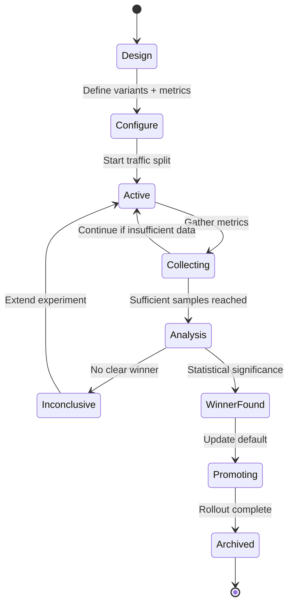
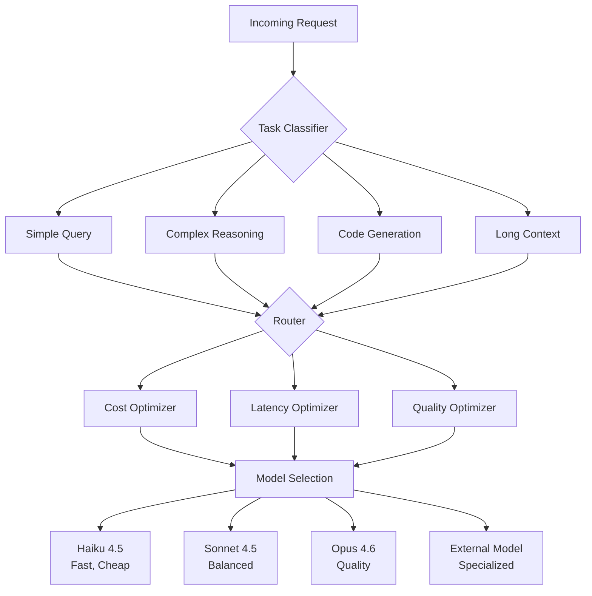

---
tags:
  - self-evolution
  - prompt-optimization
  - model-routing
  - a-b-testing
  - bedrock
  - step-functions
  - sagemaker
  - experimentation
date: 2026-03-19
topic: Prompt A/B Testing and Model Routing Optimization
status: complete
---

# Prompt A/B Testing & Model Routing Optimization

## Overview

Self-optimizing agent platforms require systematic experimentation frameworks to continuously improve prompt quality and model selection. This document covers:

1. **Prompt A/B Testing** — Experimental frameworks for comparing prompt variants, measuring performance, and auto-selecting winners
2. **Model Routing Optimization** — Dynamic model selection based on task type, cost, latency, and quality metrics
3. **AWS Implementation** — Concrete patterns using Bedrock, Step Functions, SageMaker, and CloudWatch

## Table of Contents

- [Prompt A/B Testing Framework](#prompt-a-b-testing-framework)
  - [Experiment Lifecycle](#experiment-lifecycle)
  - [Traffic Splitting Strategies](#traffic-splitting-strategies)
  - [Metrics Collection](#metrics-collection)
  - [Statistical Significance](#statistical-significance)
  - [Auto-Promotion](#auto-promotion)
- [Model Routing Optimization](#model-routing-optimization)
  - [Router Architecture](#router-architecture)
  - [Routing Strategies](#routing-strategies)
  - [Cost-Quality Tradeoffs](#cost-quality-tradeoffs)
  - [Latency-Aware Routing](#latency-aware-routing)
  - [Cascade Patterns](#cascade-patterns)
- [AWS Implementation Patterns](#aws-implementation-patterns)
  - [Step Functions Experiment Orchestration](#step-functions-experiment-orchestration)
  - [Bedrock Model Evaluation](#bedrock-model-evaluation)
  - [CloudWatch Metrics and Alarms](#cloudwatch-metrics-and-alarms)
  - [DynamoDB Experiment State](#dynamodb-experiment-state)
  - [SageMaker Experiments Integration](#sagemaker-experiments-integration)
- [Code Examples](#code-examples)
- [Production Considerations](#production-considerations)

---

## Prompt A/B Testing Framework

### Experiment Lifecycle

A prompt optimization experiment follows this lifecycle:



**Key Phases:**

1. **Design** — Define hypothesis, variants (control + treatment), success metrics
2. **Configure** — Set traffic split ratio, sample size, duration limits
3. **Active** — Route traffic to variants, collect outcomes
4. **Analysis** — Statistical tests (t-test, Mann-Whitney U) to determine winner
5. **Promotion** — Rollout winner to 100%, archive losers

### Traffic Splitting Strategies

#### Deterministic Split (User-Based)

Route each user/tenant consistently to the same variant for session continuity:

```typescript
// Consistent hashing for user-level assignment
function assignVariant(
  userId: string,
  experiment: Experiment
): string {
  const hash = murmur3(userId + experiment.id);
  const ratio = hash % 100;

  let cumulative = 0;
  for (const variant of experiment.variants) {
    cumulative += variant.trafficPercentage;
    if (ratio < cumulative) {
      return variant.id;
    }
  }
  return experiment.control;
}

// Example experiment config
const experiment = {
  id: "prompt-v2-vs-v1",
  control: "v1-baseline",
  variants: [
    { id: "v1-baseline", trafficPercentage: 50 },
    { id: "v2-cot-reasoning", trafficPercentage: 50 }
  ],
  metrics: ["task_success_rate", "avg_latency", "token_cost"],
  minSampleSize: 1000
};
```

#### Request-Level Randomization

For single-request experiments (no session state):

```typescript
function randomVariant(experiment: Experiment): string {
  const rand = Math.random() * 100;
  let cumulative = 0;

  for (const variant of experiment.variants) {
    cumulative += variant.trafficPercentage;
    if (rand < cumulative) {
      return variant.id;
    }
  }
  return experiment.control;
}
```

#### Multi-Armed Bandit (MAB)

Dynamically shift traffic toward better-performing variants:

```typescript
interface BanditArm {
  variantId: string;
  successCount: number;
  totalCount: number;
  confidence: number; // UCB1 score
}

// Upper Confidence Bound (UCB1) algorithm
function selectVariantUCB1(arms: BanditArm[], totalPulls: number): string {
  return arms
    .map(arm => ({
      id: arm.variantId,
      ucb: (arm.successCount / arm.totalCount) +
           Math.sqrt((2 * Math.log(totalPulls)) / arm.totalCount)
    }))
    .sort((a, b) => b.ucb - a.ucb)[0].id;
}

// Thompson Sampling (Bayesian approach)
function selectVariantThompson(arms: BanditArm[]): string {
  return arms
    .map(arm => ({
      id: arm.variantId,
      sample: betaSample(arm.successCount + 1,
                         arm.totalCount - arm.successCount + 1)
    }))
    .sort((a, b) => b.sample - a.sample)[0].id;
}
```

**When to Use:**
- **Deterministic**: Sessions with state (chat history, user preferences)
- **Random**: Stateless API calls, one-off tasks
- **MAB**: Production optimization where you want to minimize exposure to bad variants

### Metrics Collection

Track both **business metrics** (task success) and **technical metrics** (latency, cost):

```typescript
interface ExperimentMetrics {
  variantId: string;
  timestamp: string;

  // Business metrics
  taskSuccess: boolean;
  userSatisfaction?: number; // 1-5 rating
  goalCompleted: boolean;

  // Technical metrics
  latencyMs: number;
  inputTokens: number;
  outputTokens: number;
  costUSD: number;

  // Quality metrics
  outputLength: number;
  formatValid: boolean;
  hallucinations?: number;

  // Metadata
  tenantId: string;
  sessionId: string;
  modelId: string;
}
```

**AWS Implementation (DynamoDB + CloudWatch):**

```typescript
import { DynamoDBClient, PutItemCommand } from "@aws-sdk/client-dynamodb";
import { CloudWatchClient, PutMetricDataCommand } from "@aws-sdk/client-cloudwatch";

async function recordExperimentMetrics(metrics: ExperimentMetrics) {
  // Store raw data in DynamoDB for detailed analysis
  await dynamodb.send(new PutItemCommand({
    TableName: "ExperimentMetrics",
    Item: {
      PK: { S: `EXPERIMENT#${metrics.variantId}` },
      SK: { S: `METRIC#${metrics.timestamp}#${metrics.sessionId}` },
      variantId: { S: metrics.variantId },
      timestamp: { S: metrics.timestamp },
      taskSuccess: { BOOL: metrics.taskSuccess },
      latencyMs: { N: metrics.latencyMs.toString() },
      costUSD: { N: metrics.costUSD.toString() },
      inputTokens: { N: metrics.inputTokens.toString() },
      outputTokens: { N: metrics.outputTokens.toString() },
      tenantId: { S: metrics.tenantId },
      // ... other fields
    }
  }));

  // Emit CloudWatch metrics for real-time monitoring
  await cloudwatch.send(new PutMetricDataCommand({
    Namespace: "AgentPlatform/Experiments",
    MetricData: [
      {
        MetricName: "TaskSuccessRate",
        Dimensions: [
          { Name: "VariantId", Value: metrics.variantId },
          { Name: "TenantId", Value: metrics.tenantId }
        ],
        Value: metrics.taskSuccess ? 1 : 0,
        Unit: "None",
        Timestamp: new Date(metrics.timestamp)
      },
      {
        MetricName: "Latency",
        Dimensions: [{ Name: "VariantId", Value: metrics.variantId }],
        Value: metrics.latencyMs,
        Unit: "Milliseconds",
        Timestamp: new Date(metrics.timestamp)
      },
      {
        MetricName: "Cost",
        Dimensions: [{ Name: "VariantId", Value: metrics.variantId }],
        Value: metrics.costUSD,
        Unit: "None",
        Timestamp: new Date(metrics.timestamp)
      }
    ]
  }));
}
```

### Statistical Significance

Use statistical tests to determine if observed differences are real or noise:

#### T-Test (for continuous metrics like latency)

```typescript
import { tTest } from "simple-statistics";

interface VariantResults {
  variantId: string;
  latencies: number[]; // all latency samples
  successCount: number;
  totalCount: number;
}

function analyzeTTest(
  control: VariantResults,
  treatment: VariantResults,
  alpha = 0.05 // 95% confidence
): { significant: boolean; pValue: number; improvement: number } {
  const tTestResult = tTest(control.latencies, treatment.latencies);
  const pValue = tTestResult.pValue;

  const controlMean = mean(control.latencies);
  const treatmentMean = mean(treatment.latencies);
  const improvement = ((controlMean - treatmentMean) / controlMean) * 100;

  return {
    significant: pValue < alpha,
    pValue,
    improvement // % improvement (positive = treatment is better)
  };
}
```

#### Chi-Square Test (for categorical metrics like success/failure)

```typescript
function analyzeChiSquare(
  control: VariantResults,
  treatment: VariantResults,
  alpha = 0.05
): { significant: boolean; pValue: number; improvement: number } {
  // Contingency table: [success_control, fail_control, success_treatment, fail_treatment]
  const observed = [
    control.successCount,
    control.totalCount - control.successCount,
    treatment.successCount,
    treatment.totalCount - treatment.successCount
  ];

  const chiSquareResult = chiSquareTest(observed);

  const controlRate = control.successCount / control.totalCount;
  const treatmentRate = treatment.successCount / treatment.totalCount;
  const improvement = ((treatmentRate - controlRate) / controlRate) * 100;

  return {
    significant: chiSquareResult.pValue < alpha,
    pValue: chiSquareResult.pValue,
    improvement
  };
}
```

#### Bayesian A/B Test (credible intervals)

```typescript
// Beta distribution for conversion rates
function bayesianABTest(
  control: VariantResults,
  treatment: VariantResults
): { probTreatmentBetter: number; credibleInterval: [number, number] } {
  // Posterior: Beta(successes + 1, failures + 1)
  const controlAlpha = control.successCount + 1;
  const controlBeta = (control.totalCount - control.successCount) + 1;

  const treatmentAlpha = treatment.successCount + 1;
  const treatmentBeta = (treatment.totalCount - treatment.successCount) + 1;

  // Monte Carlo simulation
  const samples = 100000;
  let treatmentWins = 0;

  for (let i = 0; i < samples; i++) {
    const controlSample = betaSample(controlAlpha, controlBeta);
    const treatmentSample = betaSample(treatmentAlpha, treatmentBeta);
    if (treatmentSample > controlSample) treatmentWins++;
  }

  return {
    probTreatmentBetter: treatmentWins / samples,
    credibleInterval: betaCredibleInterval(treatmentAlpha, treatmentBeta, 0.95)
  };
}
```

### Auto-Promotion

Automatically promote winners when statistical confidence is reached:

```typescript
interface PromotionPolicy {
  minSampleSize: number; // e.g., 1000 requests per variant
  minImprovement: number; // e.g., 5% better
  confidenceLevel: number; // e.g., 0.95 (95% confidence)
  bayesianThreshold?: number; // e.g., 0.95 (95% prob treatment better)
}

async function evaluatePromotion(
  experimentId: string,
  policy: PromotionPolicy
): Promise<{ promote: boolean; winner: string | null; reason: string }> {
  // Fetch results from DynamoDB
  const results = await fetchExperimentResults(experimentId);
  const control = results.find(v => v.isControl);
  const treatments = results.filter(v => !v.isControl);

  // Check minimum sample size
  if (results.some(v => v.totalCount < policy.minSampleSize)) {
    return { promote: false, winner: null, reason: "Insufficient samples" };
  }

  // Run statistical tests
  let bestVariant = control;
  let bestImprovement = 0;

  for (const treatment of treatments) {
    const frequentistResult = analyzeChiSquare(control, treatment, 1 - policy.confidenceLevel);
    const bayesianResult = bayesianABTest(control, treatment);

    // Require both frequentist significance AND Bayesian confidence
    if (
      frequentistResult.significant &&
      frequentistResult.improvement >= policy.minImprovement &&
      bayesianResult.probTreatmentBetter >= (policy.bayesianThreshold || 0.95) &&
      frequentistResult.improvement > bestImprovement
    ) {
      bestVariant = treatment;
      bestImprovement = frequentistResult.improvement;
    }
  }

  if (bestVariant !== control) {
    return {
      promote: true,
      winner: bestVariant.variantId,
      reason: `${bestImprovement.toFixed(1)}% improvement with high confidence`
    };
  }

  return { promote: false, winner: null, reason: "No clear winner" };
}

// Promotion execution
async function promoteVariant(experimentId: string, winnerVariantId: string) {
  // 1. Update experiment state
  await updateExperimentState(experimentId, "PROMOTING", winnerVariantId);

  // 2. Gradual rollout: 50% -> 90% -> 100%
  await updateTrafficSplit(experimentId, { [winnerVariantId]: 50 });
  await wait(3600000); // 1 hour

  await updateTrafficSplit(experimentId, { [winnerVariantId]: 90 });
  await wait(3600000);

  await updateTrafficSplit(experimentId, { [winnerVariantId]: 100 });

  // 3. Update default prompt in config
  await updateDefaultPrompt(winnerVariantId);

  // 4. Archive experiment
  await updateExperimentState(experimentId, "ARCHIVED", winnerVariantId);

  // 5. Notify Slack/SNS
  await notifyPromotionComplete(experimentId, winnerVariantId);
}
```

---

## Model Routing Optimization

### Router Architecture

A model router dynamically selects the best model for each request based on task characteristics, constraints, and performance data:



**Key Components:**

1. **Task Classifier** — Categorizes requests (simple vs. complex, code vs. text, etc.)
2. **Router** — Selects model based on task + constraints
3. **Optimizers** — Balance cost, latency, quality tradeoffs
4. **Fallback Logic** — Cascade to backup models on failure/throttling

### Routing Strategies

#### Rule-Based Routing

Simple heuristics for deterministic routing:

```typescript
interface RoutingRule {
  condition: (request: AgentRequest) => boolean;
  model: string;
  priority: number;
}

const routingRules: RoutingRule[] = [
  {
    condition: (req) => req.taskType === "code_generation" && req.contextLength < 10000,
    model: "anthropic.claude-sonnet-4-5-v2:0",
    priority: 10
  },
  {
    condition: (req) => req.taskType === "code_generation" && req.contextLength >= 10000,
    model: "anthropic.claude-opus-4-6-v1:0",
    priority: 9
  },
  {
    condition: (req) => req.complexity === "simple" && req.latencySLA < 1000,
    model: "anthropic.claude-haiku-4-5-v1:0",
    priority: 8
  },
  {
    condition: (req) => req.taskType === "research" || req.requiresMultiStep,
    model: "anthropic.claude-opus-4-6-v1:0",
    priority: 7
  },
  {
    condition: () => true, // default
    model: "anthropic.claude-sonnet-4-5-v2:0",
    priority: 1
  }
];

function selectModelRuleBased(request: AgentRequest): string {
  const matchedRule = routingRules
    .filter(rule => rule.condition(request))
    .sort((a, b) => b.priority - a.priority)[0];

  return matchedRule.model;
}
```

#### Cost-Aware Routing

Route to the cheapest model that meets quality requirements:

```typescript
interface ModelProfile {
  modelId: string;
  inputCostPer1M: number; // USD per 1M input tokens
  outputCostPer1M: number; // USD per 1M output tokens
  avgLatencyP50: number; // milliseconds
  avgLatencyP99: number;
  qualityScore: number; // 0-100 (from evals)
  taskFitness: Record<string, number>; // task-specific scores
}

const modelProfiles: ModelProfile[] = [
  {
    modelId: "anthropic.claude-haiku-4-5-v1:0",
    inputCostPer1M: 0.30,
    outputCostPer1M: 1.50,
    avgLatencyP50: 450,
    avgLatencyP99: 1200,
    qualityScore: 82,
    taskFitness: { simple_query: 95, code_gen: 70, reasoning: 65 }
  },
  {
    modelId: "anthropic.claude-sonnet-4-5-v2:0",
    inputCostPer1M: 3.00,
    outputCostPer1M: 15.00,
    avgLatencyP50: 850,
    avgLatencyP99: 2500,
    qualityScore: 93,
    taskFitness: { simple_query: 98, code_gen: 95, reasoning: 90 }
  },
  {
    modelId: "anthropic.claude-opus-4-6-v1:0",
    inputCostPer1M: 15.00,
    outputCostPer1M: 75.00,
    avgLatencyP50: 1800,
    avgLatencyP99: 5000,
    qualityScore: 98,
    taskFitness: { simple_query: 99, code_gen: 98, reasoning: 98 }
  }
];

function selectModelCostAware(
  request: AgentRequest,
  maxCost: number, // max USD per request
  minQuality: number // minimum quality score
): string {
  const estimatedTokens = estimateTokenCount(request);

  const candidates = modelProfiles
    .filter(model => {
      // Must meet quality threshold
      const taskScore = model.taskFitness[request.taskType] || model.qualityScore;
      if (taskScore < minQuality) return false;

      // Must fit within cost budget
      const estimatedCost =
        (estimatedTokens.input * model.inputCostPer1M / 1_000_000) +
        (estimatedTokens.output * model.outputCostPer1M / 1_000_000);
      if (estimatedCost > maxCost) return false;

      return true;
    })
    .sort((a, b) => {
      // Sort by cost (cheapest first)
      const costA = (estimatedTokens.input * a.inputCostPer1M + estimatedTokens.output * a.outputCostPer1M);
      const costB = (estimatedTokens.input * b.inputCostPer1M + estimatedTokens.output * b.outputCostPer1M);
      return costA - costB;
    });

  return candidates[0]?.modelId || modelProfiles[1].modelId; // fallback to Sonnet
}
```

#### ML-Based Routing (Predictive)

Train a classifier to predict the best model for each request:

```typescript
// Feature extraction
interface RoutingFeatures {
  contextLength: number;
  taskType: string; // categorical
  complexity: number; // 1-10 (heuristic)
  requiresMultiStep: boolean;
  hasCodeBlocks: boolean;
  estimatedOutputLength: number;
  userTier: string; // free, pro, enterprise
  latencySLA: number; // milliseconds
  costBudget: number; // USD
}

// Train a model (offline) to predict best model
async function trainRoutingModel() {
  // Collect historical data: (features, model_used, outcome_score)
  const trainingData = await fetchHistoricalRoutingData();

  // Train XGBoost/Random Forest to predict outcome_score given features + model
  // Use SageMaker for training
  const trainingJob = await sagemaker.createTrainingJob({
    AlgorithmSpecification: {
      TrainingImage: "xgboost-container-uri",
      TrainingInputMode: "File"
    },
    InputDataConfig: [{
      ChannelName: "train",
      DataSource: {
        S3DataSource: {
          S3DataType: "S3Prefix",
          S3Uri: "s3://bucket/routing-training-data/"
        }
      }
    }],
    OutputDataConfig: {
      S3OutputPath: "s3://bucket/routing-model/"
    },
    ResourceConfig: {
      InstanceType: "ml.m5.xlarge",
      InstanceCount: 1,
      VolumeSizeInGB: 10
    },
    RoleArn: "arn:aws:iam::123456789012:role/SageMakerRole",
    HyperParameters: {
      objective: "reg:squarederror",
      num_round: "100"
    }
  });

  return trainingJob.TrainingJobArn;
}

// Inference: predict best model for request
async function selectModelML(request: AgentRequest): Promise<string> {
  const features = extractFeatures(request);

  // Invoke SageMaker endpoint for each candidate model
  const predictions = await Promise.all(
    modelProfiles.map(async (model) => {
      const response = await sagemakerRuntime.invokeEndpoint({
        EndpointName: "routing-model-endpoint",
        Body: JSON.stringify({
          ...features,
          candidate_model: model.modelId
        }),
        ContentType: "application/json"
      });

      const prediction = JSON.parse(response.Body.toString());
      return { modelId: model.modelId, score: prediction.outcome_score };
    })
  );

  // Select model with highest predicted outcome
  const best = predictions.sort((a, b) => b.score - a.score)[0];
  return best.modelId;
}
```

### Cost-Quality Tradeoffs

Visualizing the Pareto frontier:

```typescript
// Compute Pareto-efficient models (non-dominated solutions)
function computeParetoFrontier(
  models: ModelProfile[],
  taskType: string
): ModelProfile[] {
  const pareto: ModelProfile[] = [];

  for (const model of models) {
    const isDominated = models.some(other => {
      const modelCost = model.inputCostPer1M + model.outputCostPer1M;
      const otherCost = other.inputCostPer1M + other.outputCostPer1M;
      const modelQuality = model.taskFitness[taskType] || model.qualityScore;
      const otherQuality = other.taskFitness[taskType] || other.qualityScore;

      // Other dominates if it's both cheaper AND better quality
      return otherCost < modelCost && otherQuality >= modelQuality;
    });

    if (!isDominated) pareto.push(model);
  }

  return pareto.sort((a, b) => {
    const costA = a.inputCostPer1M + a.outputCostPer1M;
    const costB = b.inputCostPer1M + b.outputCostPer1M;
    return costA - costB;
  });
}

// Example: Select from Pareto frontier based on user tier
function selectFromPareto(
  paretoModels: ModelProfile[],
  userTier: "free" | "pro" | "enterprise"
): string {
  const tierPreferences = {
    free: 0, // cheapest
    pro: Math.floor(paretoModels.length / 2), // mid-range
    enterprise: paretoModels.length - 1 // best quality
  };

  const index = tierPreferences[userTier];
  return paretoModels[index].modelId;
}
```

### Latency-Aware Routing

Route to faster models when latency SLA is tight:

```typescript
interface LatencyConstraint {
  p50MaxMs: number;
  p99MaxMs: number;
  timeoutMs: number;
}

function selectModelLatencyAware(
  request: AgentRequest,
  constraint: LatencyConstraint
): string {
  const candidates = modelProfiles.filter(model => {
    // Must meet latency requirements
    if (model.avgLatencyP50 > constraint.p50MaxMs) return false;
    if (model.avgLatencyP99 > constraint.p99MaxMs) return false;

    // Must meet minimum quality
    const taskScore = model.taskFitness[request.taskType] || model.qualityScore;
    if (taskScore < 80) return false;

    return true;
  });

  if (candidates.length === 0) {
    // No model meets constraints - pick fastest
    return modelProfiles.sort((a, b) => a.avgLatencyP50 - b.avgLatencyP50)[0].modelId;
  }

  // Among candidates, pick best quality
  return candidates.sort((a, b) => b.qualityScore - a.qualityScore)[0].modelId;
}
```

### Cascade Patterns

Start with a fast/cheap model, escalate to better models if needed:

```typescript
async function cascadeInference(request: AgentRequest): Promise<AgentResponse> {
  const cascade = [
    { model: "anthropic.claude-haiku-4-5-v1:0", maxRetries: 1 },
    { model: "anthropic.claude-sonnet-4-5-v2:0", maxRetries: 1 },
    { model: "anthropic.claude-opus-4-6-v1:0", maxRetries: 2 }
  ];

  for (const tier of cascade) {
    for (let attempt = 0; attempt < tier.maxRetries; attempt++) {
      try {
        const response = await invokeModel(tier.model, request);

        // Check quality thresholds
        if (isHighQuality(response)) {
          return response;
        }

        // If low quality, try next tier
        console.log(`Model ${tier.model} produced low-quality output, escalating`);
        break;
      } catch (error) {
        if (error.code === "ThrottlingException" || error.code === "ServiceUnavailable") {
          console.log(`Model ${tier.model} throttled, escalating`);
          break;
        }
        // Retry same tier
        if (attempt < tier.maxRetries - 1) {
          await sleep(1000 * (attempt + 1)); // exponential backoff
        }
      }
    }
  }

  throw new Error("All cascade tiers failed");
}

function isHighQuality(response: AgentResponse): boolean {
  // Heuristics for quality
  return (
    response.outputLength > 50 && // not too short
    response.formatValid && // valid JSON/markdown/etc
    !response.refusedTask && // didn't refuse
    response.confidence > 0.7 // model-reported confidence
  );
}
```

---

## AWS Implementation Patterns

### Step Functions Experiment Orchestration

Use Step Functions to orchestrate long-running experiments:

```json
{
  "Comment": "Prompt A/B Test Orchestration",
  "StartAt": "InitializeExperiment",
  "States": {
    "InitializeExperiment": {
      "Type": "Task",
      "Resource": "arn:aws:states:::dynamodb:putItem",
      "Parameters": {
        "TableName": "Experiments",
        "Item": {
          "PK": { "S.$": "$.experimentId" },
          "SK": { "S": "METADATA" },
          "status": { "S": "ACTIVE" },
          "startTime": { "S.$": "$$.State.EnteredTime" },
          "variants.$": "$.variants",
          "targetSampleSize": { "N.$": "$.targetSampleSize" }
        }
      },
      "Next": "WaitForSamples"
    },

    "WaitForSamples": {
      "Type": "Wait",
      "Seconds": 3600,
      "Next": "CheckSampleSize"
    },

    "CheckSampleSize": {
      "Type": "Task",
      "Resource": "arn:aws:states:::lambda:invoke",
      "Parameters": {
        "FunctionName": "CheckExperimentProgress",
        "Payload": {
          "experimentId.$": "$.experimentId"
        }
      },
      "Next": "SufficientSamples?"
    },

    "SufficientSamples?": {
      "Type": "Choice",
      "Choices": [
        {
          "Variable": "$.sufficient",
          "BooleanEquals": true,
          "Next": "RunStatisticalAnalysis"
        },
        {
          "Variable": "$.durationHours",
          "NumericGreaterThan": 168,
          "Next": "ExperimentTimeout"
        }
      ],
      "Default": "WaitForSamples"
    },

    "RunStatisticalAnalysis": {
      "Type": "Task",
      "Resource": "arn:aws:states:::lambda:invoke",
      "Parameters": {
        "FunctionName": "AnalyzeExperimentResults",
        "Payload": {
          "experimentId.$": "$.experimentId"
        }
      },
      "Next": "WinnerFound?"
    },

    "WinnerFound?": {
      "Type": "Choice",
      "Choices": [
        {
          "Variable": "$.winner",
          "IsPresent": true,
          "Next": "PromoteWinner"
        }
      ],
      "Default": "ExtendExperiment"
    },

    "PromoteWinner": {
      "Type": "Task",
      "Resource": "arn:aws:states:::lambda:invoke",
      "Parameters": {
        "FunctionName": "PromoteVariant",
        "Payload": {
          "experimentId.$": "$.experimentId",
          "winner.$": "$.winner"
        }
      },
      "Next": "NotifySuccess"
    },

    "ExtendExperiment": {
      "Type": "Task",
      "Resource": "arn:aws:states:::dynamodb:updateItem",
      "Parameters": {
        "TableName": "Experiments",
        "Key": {
          "PK": { "S.$": "$.experimentId" },
          "SK": { "S": "METADATA" }
        },
        "UpdateExpression": "SET targetSampleSize = targetSampleSize + :increment",
        "ExpressionAttributeValues": {
          ":increment": { "N": "500" }
        }
      },
      "Next": "WaitForSamples"
    },

    "ExperimentTimeout": {
      "Type": "Task",
      "Resource": "arn:aws:states:::sns:publish",
      "Parameters": {
        "TopicArn": "arn:aws:sns:us-east-1:123456789012:ExperimentAlerts",
        "Subject": "Experiment Timeout",
        "Message.$": "States.Format('Experiment {} timed out after 7 days', $.experimentId)"
      },
      "Next": "ArchiveExperiment"
    },

    "NotifySuccess": {
      "Type": "Task",
      "Resource": "arn:aws:states:::sns:publish",
      "Parameters": {
        "TopicArn": "arn:aws:sns:us-east-1:123456789012:ExperimentAlerts",
        "Subject": "Experiment Winner",
        "Message.$": "States.Format('Experiment {} completed. Winner: {}', $.experimentId, $.winner)"
      },
      "Next": "ArchiveExperiment"
    },

    "ArchiveExperiment": {
      "Type": "Task",
      "Resource": "arn:aws:states:::dynamodb:updateItem",
      "Parameters": {
        "TableName": "Experiments",
        "Key": {
          "PK": { "S.$": "$.experimentId" },
          "SK": { "S": "METADATA" }
        },
        "UpdateExpression": "SET #status = :archived, endTime = :now",
        "ExpressionAttributeNames": {
          "#status": "status"
        },
        "ExpressionAttributeValues": {
          ":archived": { "S": "ARCHIVED" },
          ":now": { "S.$": "$$.State.EnteredTime" }
        }
      },
      "End": true
    }
  }
}
```

### Bedrock Model Evaluation

Use Bedrock Model Evaluation to automatically assess prompt quality:

```typescript
import { BedrockClient, CreateEvaluationJobCommand } from "@aws-sdk/client-bedrock";

async function createEvaluationJob(
  experimentId: string,
  variantId: string,
  promptTemplate: string
) {
  const evalJob = await bedrock.send(new CreateEvaluationJobCommand({
    jobName: `eval-${experimentId}-${variantId}`,

    // Define evaluation dataset (golden Q&A pairs)
    evaluationDatasetMetricConfigs: [{
      taskType: "QuestionAndAnswer",
      dataset: {
        name: "agent-eval-dataset",
        datasetLocation: {
          s3Uri: "s3://bucket/eval-datasets/agent-qa.jsonl"
        }
      },
      metricNames: ["Correctness", "Completeness", "Relevance"]
    }],

    // Model under test
    inferenceConfig: {
      models: [{
        bedrockModel: {
          modelIdentifier: "anthropic.claude-sonnet-4-5-v2:0",
          inferenceParams: JSON.stringify({
            max_tokens: 2048,
            temperature: 0.7,
            system: promptTemplate
          })
        }
      }]
    },

    outputDataConfig: {
      s3Uri: `s3://bucket/eval-results/${experimentId}/${variantId}/`
    },

    roleArn: "arn:aws:iam::123456789012:role/BedrockEvalRole"
  }));

  return evalJob.jobArn;
}

// Poll for results
async function getEvaluationResults(jobArn: string) {
  const job = await bedrock.send(new GetEvaluationJobCommand({ jobIdentifier: jobArn }));

  if (job.status === "Completed") {
    // Download results from S3
    const results = await downloadS3(job.outputDataConfig.s3Uri);

    return {
      correctness: results.metrics.Correctness.score,
      completeness: results.metrics.Completeness.score,
      relevance: results.metrics.Relevance.score,
      overallScore: (results.metrics.Correctness.score +
                     results.metrics.Completeness.score +
                     results.metrics.Relevance.score) / 3
    };
  }

  return null; // still running
}
```

### CloudWatch Metrics and Alarms

Monitor experiments in real-time with CloudWatch:

```typescript
import { CloudWatchClient, PutMetricAlarmCommand } from "@aws-sdk/client-cloudwatch";

async function createExperimentAlarms(experimentId: string, variants: string[]) {
  for (const variantId of variants) {
    // Alarm: Success rate drops below 80%
    await cloudwatch.send(new PutMetricAlarmCommand({
      AlarmName: `${experimentId}-${variantId}-low-success-rate`,
      MetricName: "TaskSuccessRate",
      Namespace: "AgentPlatform/Experiments",
      Statistic: "Average",
      Period: 300, // 5 minutes
      EvaluationPeriods: 2,
      Threshold: 0.8,
      ComparisonOperator: "LessThanThreshold",
      Dimensions: [{ Name: "VariantId", Value: variantId }],
      AlarmActions: ["arn:aws:sns:us-east-1:123456789012:ExperimentAlerts"],
      TreatMissingData: "notBreaching"
    }));

    // Alarm: Latency exceeds 5 seconds
    await cloudwatch.send(new PutMetricAlarmCommand({
      AlarmName: `${experimentId}-${variantId}-high-latency`,
      MetricName: "Latency",
      Namespace: "AgentPlatform/Experiments",
      Statistic: "Average",
      Period: 300,
      EvaluationPeriods: 2,
      Threshold: 5000,
      ComparisonOperator: "GreaterThanThreshold",
      Dimensions: [{ Name: "VariantId", Value: variantId }],
      AlarmActions: ["arn:aws:sns:us-east-1:123456789012:ExperimentAlerts"],
      TreatMissingData: "notBreaching"
    }));

    // Alarm: Cost anomaly (>2x expected)
    await cloudwatch.send(new PutMetricAlarmCommand({
      AlarmName: `${experimentId}-${variantId}-cost-anomaly`,
      MetricName: "Cost",
      Namespace: "AgentPlatform/Experiments",
      Statistic: "Sum",
      Period: 3600, // 1 hour
      EvaluationPeriods: 1,
      Threshold: 10.0, // $10/hour
      ComparisonOperator: "GreaterThanThreshold",
      Dimensions: [{ Name: "VariantId", Value: variantId }],
      AlarmActions: ["arn:aws:sns:us-east-1:123456789012:ExperimentAlerts"],
      TreatMissingData: "notBreaching"
    }));
  }
}
```

### DynamoDB Experiment State

Schema for storing experiment configuration and results:

```typescript
// Table: Experiments
// PK: EXPERIMENT#<id>
// SK: METADATA | VARIANT#<variantId> | METRIC#<timestamp>

interface ExperimentMetadata {
  PK: string; // "EXPERIMENT#exp-123"
  SK: string; // "METADATA"
  status: "DRAFT" | "ACTIVE" | "PAUSED" | "ANALYZING" | "PROMOTING" | "ARCHIVED";
  name: string;
  hypothesis: string;
  startTime: string;
  endTime?: string;
  targetSampleSize: number;
  currentSampleSize: number;
  owner: string;
  tags: string[];
}

interface VariantConfig {
  PK: string; // "EXPERIMENT#exp-123"
  SK: string; // "VARIANT#v1-baseline"
  variantId: string;
  isControl: boolean;
  trafficPercentage: number;
  promptTemplate: string;
  modelId: string;
  temperature: number;
  systemPrompt?: string;
}

interface AggregatedMetric {
  PK: string; // "EXPERIMENT#exp-123"
  SK: string; // "METRIC#2026-03-19T10:00:00Z"
  variantId: string;
  timestamp: string;

  // Aggregated over 5-minute window
  requestCount: number;
  successCount: number;
  failureCount: number;
  avgLatencyMs: number;
  p50LatencyMs: number;
  p95LatencyMs: number;
  p99LatencyMs: number;
  totalCostUSD: number;
  avgInputTokens: number;
  avgOutputTokens: number;
}

// Query patterns
async function getExperimentSummary(experimentId: string) {
  // Get metadata
  const metadata = await dynamodb.getItem({
    TableName: "Experiments",
    Key: {
      PK: { S: `EXPERIMENT#${experimentId}` },
      SK: { S: "METADATA" }
    }
  });

  // Get all variants
  const variants = await dynamodb.query({
    TableName: "Experiments",
    KeyConditionExpression: "PK = :pk AND begins_with(SK, :sk)",
    ExpressionAttributeValues: {
      ":pk": { S: `EXPERIMENT#${experimentId}` },
      ":sk": { S: "VARIANT#" }
    }
  });

  // Get recent metrics (last 24 hours)
  const yesterday = new Date(Date.now() - 86400000).toISOString();
  const metrics = await dynamodb.query({
    TableName: "Experiments",
    KeyConditionExpression: "PK = :pk AND SK BETWEEN :start AND :end",
    ExpressionAttributeValues: {
      ":pk": { S: `EXPERIMENT#${experimentId}` },
      ":start": { S: `METRIC#${yesterday}` },
      ":end": { S: `METRIC#9999` }
    }
  });

  return { metadata, variants, metrics };
}
```

### SageMaker Experiments Integration

Track experiments and model performance with SageMaker Experiments:

```typescript
import {
  SageMakerClient,
  CreateExperimentCommand,
  CreateTrialCommand,
  AssociateTrialComponentCommand
} from "@aws-sdk/client-sagemaker";

async function createSageMakerExperiment(experimentId: string) {
  // Create experiment
  await sagemaker.send(new CreateExperimentCommand({
    ExperimentName: `prompt-optimization-${experimentId}`,
    Description: "Prompt A/B testing for agent platform",
    Tags: [
      { Key: "Platform", Value: "Chimera" },
      { Key: "ExperimentType", Value: "PromptAB" }
    ]
  }));

  // Create trials for each variant
  const variants = ["v1-baseline", "v2-cot", "v3-few-shot"];

  for (const variantId of variants) {
    await sagemaker.send(new CreateTrialCommand({
      ExperimentName: `prompt-optimization-${experimentId}`,
      TrialName: `${experimentId}-${variantId}`,
      Tags: [
        { Key: "Variant", Value: variantId }
      ]
    }));
  }
}

// Log metrics to SageMaker
async function logTrialMetric(
  experimentId: string,
  variantId: string,
  metricName: string,
  value: number
) {
  await sagemaker.send(new UpdateTrialComponentCommand({
    TrialComponentName: `${experimentId}-${variantId}`,
    Parameters: {
      [metricName]: {
        NumberValue: value
      }
    }
  }));
}
```

---

## Code Examples

### Complete Experiment Setup

```typescript
// Full end-to-end example
async function runPromptExperiment() {
  // 1. Define experiment
  const experiment = {
    id: `exp-${Date.now()}`,
    name: "CoT Reasoning vs Baseline",
    hypothesis: "Chain-of-thought prompting improves code generation accuracy by 10%+",
    variants: [
      {
        id: "v1-baseline",
        isControl: true,
        trafficPercentage: 50,
        promptTemplate: "Generate Python code for: {{task}}",
        modelId: "anthropic.claude-sonnet-4-5-v2:0"
      },
      {
        id: "v2-cot",
        isControl: false,
        trafficPercentage: 50,
        promptTemplate: `Generate Python code for: {{task}}

Think step-by-step:
1. Understand the requirements
2. Plan the solution approach
3. Implement the code
4. Verify correctness`,
        modelId: "anthropic.claude-sonnet-4-5-v2:0"
      }
    ],
    metrics: ["task_success_rate", "code_correctness", "avg_latency"],
    targetSampleSize: 2000,
    promotionPolicy: {
      minSampleSize: 1000,
      minImprovement: 10,
      confidenceLevel: 0.95
    }
  };

  // 2. Initialize in DynamoDB
  await dynamodb.send(new PutItemCommand({
    TableName: "Experiments",
    Item: marshall({
      PK: `EXPERIMENT#${experiment.id}`,
      SK: "METADATA",
      ...experiment,
      status: "ACTIVE",
      startTime: new Date().toISOString()
    })
  }));

  for (const variant of experiment.variants) {
    await dynamodb.send(new PutItemCommand({
      TableName: "Experiments",
      Item: marshall({
        PK: `EXPERIMENT#${experiment.id}`,
        SK: `VARIANT#${variant.id}`,
        ...variant
      })
    }));
  }

  // 3. Create CloudWatch alarms
  await createExperimentAlarms(experiment.id, experiment.variants.map(v => v.id));

  // 4. Start Step Functions orchestration
  await stepfunctions.send(new StartExecutionCommand({
    stateMachineArn: "arn:aws:states:us-east-1:123456789012:stateMachine:ExperimentOrchestrator",
    input: JSON.stringify(experiment)
  }));

  // 5. Traffic starts routing to variants automatically via assignVariant()
  console.log(`Experiment ${experiment.id} started`);
}

// Integration into agent request handler
async function handleAgentRequest(request: AgentRequest): Promise<AgentResponse> {
  // Check for active experiments
  const activeExperiments = await getActiveExperiments(request.taskType);

  let variantId = "default";
  let experimentId: string | null = null;

  if (activeExperiments.length > 0) {
    // Assign to experiment variant
    const experiment = activeExperiments[0];
    variantId = assignVariant(request.userId, experiment);
    experimentId = experiment.id;

    // Fetch variant config
    const variant = await getVariantConfig(experimentId, variantId);
    request.promptTemplate = variant.promptTemplate;
    request.modelId = variant.modelId;
  }

  // Execute request
  const startTime = Date.now();
  const response = await invokeModel(request.modelId, request);
  const latencyMs = Date.now() - startTime;

  // Record metrics
  if (experimentId) {
    await recordExperimentMetrics({
      variantId,
      timestamp: new Date().toISOString(),
      taskSuccess: response.success,
      latencyMs,
      inputTokens: response.usage.inputTokens,
      outputTokens: response.usage.outputTokens,
      costUSD: calculateCost(response.usage, request.modelId),
      tenantId: request.tenantId,
      sessionId: request.sessionId,
      modelId: request.modelId
    });
  }

  return response;
}
```

---

## Production Considerations

### Experiment Isolation

**Problem:** Experiments can interfere with each other if multiple run simultaneously.

**Solution:** Use experiment namespaces and traffic allocation:

```typescript
interface ExperimentConfig {
  id: string;
  namespace: string; // e.g., "code_generation", "research"
  trafficAllocation: number; // % of namespace traffic (0-100)
}

// Only 20% of code_generation traffic goes to experiments
const experiments: ExperimentConfig[] = [
  {
    id: "exp-1",
    namespace: "code_generation",
    trafficAllocation: 20
  }
];

function shouldParticipateInExperiment(
  request: AgentRequest,
  experiment: ExperimentConfig
): boolean {
  if (request.taskType !== experiment.namespace) return false;

  const hash = murmur3(request.userId + experiment.namespace);
  const bucket = hash % 100;
  return bucket < experiment.trafficAllocation;
}
```

### Guardrails

**Problem:** Experiments might degrade quality or increase cost significantly.

**Solution:** Kill switches and circuit breakers:

```typescript
interface ExperimentGuardrails {
  maxCostPerHour: number; // auto-pause if exceeded
  minSuccessRate: number; // auto-pause if below (e.g., 0.7)
  maxLatencyP99: number; // auto-pause if exceeded
}

async function checkGuardrails(experimentId: string, guardrails: ExperimentGuardrails) {
  const metrics = await getRecentMetrics(experimentId, 3600000); // last hour

  // Check cost
  const hourlyCost = metrics.reduce((sum, m) => sum + m.totalCostUSD, 0);
  if (hourlyCost > guardrails.maxCostPerHour) {
    await pauseExperiment(experimentId, "Cost exceeded limit");
    return;
  }

  // Check success rate
  const successRate = metrics.reduce((sum, m) => sum + m.successCount, 0) /
                       metrics.reduce((sum, m) => sum + m.requestCount, 0);
  if (successRate < guardrails.minSuccessRate) {
    await pauseExperiment(experimentId, "Success rate too low");
    return;
  }

  // Check latency
  const p99Latency = percentile(metrics.map(m => m.p99LatencyMs), 99);
  if (p99Latency > guardrails.maxLatencyP99) {
    await pauseExperiment(experimentId, "Latency too high");
    return;
  }
}
```

### Reproducibility

**Problem:** Experiments need to be reproducible for debugging.

**Solution:** Log full request/response pairs for analysis:

```typescript
// Stream experiment data to S3 for replay
async function logExperimentRequest(
  experimentId: string,
  variantId: string,
  request: AgentRequest,
  response: AgentResponse
) {
  await s3.send(new PutObjectCommand({
    Bucket: "experiment-logs",
    Key: `experiments/${experimentId}/${variantId}/${Date.now()}.json`,
    Body: JSON.stringify({
      experimentId,
      variantId,
      request: {
        prompt: request.prompt,
        modelId: request.modelId,
        temperature: request.temperature,
        systemPrompt: request.systemPrompt
      },
      response: {
        output: response.output,
        usage: response.usage,
        latencyMs: response.latencyMs
      },
      outcome: {
        success: response.success,
        quality: response.quality
      }
    })
  }));
}
```

### Multi-Tenant Considerations

**Problem:** Different tenants may need different experiments.

**Solution:** Tenant-scoped experiments:

```typescript
interface TenantExperiment {
  experimentId: string;
  tenantId: string;
  variants: VariantConfig[];
}

async function getTenantExperiment(
  tenantId: string,
  taskType: string
): Promise<TenantExperiment | null> {
  const result = await dynamodb.query({
    TableName: "TenantExperiments",
    IndexName: "TenantTaskIndex",
    KeyConditionExpression: "tenantId = :tid AND taskType = :tt",
    FilterExpression: "#status = :active",
    ExpressionAttributeNames: { "#status": "status" },
    ExpressionAttributeValues: {
      ":tid": { S: tenantId },
      ":tt": { S: taskType },
      ":active": { S: "ACTIVE" }
    }
  });

  return result.Items?.[0] as TenantExperiment || null;
}
```

---

## References

- [AWS Bedrock Model Evaluation](https://docs.aws.amazon.com/bedrock/latest/userguide/model-evaluation.html)
- [Step Functions for ML Workflows](https://aws.amazon.com/step-functions/use-cases/machine-learning/)
- [SageMaker Experiments](https://docs.aws.amazon.com/sagemaker/latest/dg/experiments.html)
- [Multi-Armed Bandits for A/B Testing](https://en.wikipedia.org/wiki/Multi-armed_bandit)
- [Bayesian A/B Testing](https://www.evanmiller.org/bayesian-ab-testing.html)
- [Netflix Experimentation Platform](https://netflixtechblog.com/its-all-a-bout-testing-the-netflix-experimentation-platform-4e1ca458c15)
- [Uber's Experimentation Platform](https://www.uber.com/blog/experimentation-platform/)

---

## Related Documents

- [[02-ML-Experiment-Autoresearch]] — Automated ML experiment loops
- [[03-Self-Modifying-Infrastructure]] — CDK self-editing with Cedar policies
- [[04-Agent-Skill-Generation]] — Auto-generating skills from learnings
