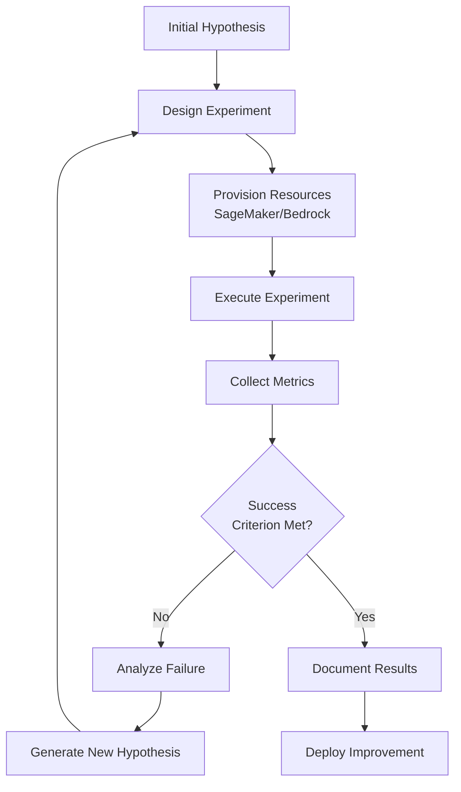
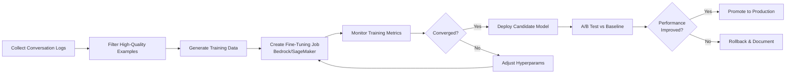
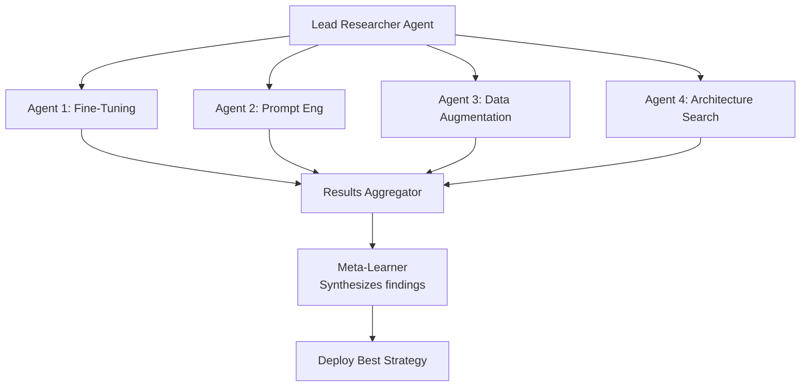

---
tags:
  - research
  - self-evolution
  - ml-experiments
  - autoresearch
  - chimera
  - aws
date: 2026-03-19
topic: ML Autoresearch & Self-Experimentation for AWS Chimera
status: complete
---

# ML Autoresearch: Karpathy-Style Experiment Loops

> How Chimera agents run ML experiments, evaluate results, iterate on hypotheses, and improve
> their own models — inspired by Andrej Karpathy's vision of agents that "do research autonomously."

**Related:** [[Chimera-Self-Evolution-Engine]] | [[01-Auto-Skill-Generation]] | [[README]]

---

## Executive Summary

**Autoresearch** is the ability of an agent to:
1. **Formulate hypotheses** about model performance, data quality, or system behavior
2. **Design experiments** to test those hypotheses
3. **Execute experiments** at scale using AWS infrastructure (SageMaker, Bedrock, Step Functions)
4. **Analyze results** and decide on next steps
5. **Iterate autonomously** until a success criterion is met or budget exhausted

This creates agents that **improve through experimentation** rather than human-driven iteration cycles.

---

## The Karpathy Autoresearch Pattern

### Core Loop



### Andrej Karpathy's Vision

From Karpathy's 2023 talk on autonomous agents:

> "The agent should be able to run experiments overnight. You give it a hypothesis — 'I think
> adding dropout will improve validation loss' — and it designs the experiment, runs it, analyzes
> the results, and comes back with 'Yes, dropout=0.3 improved val loss by 2.1%, here's the
> tensorboard link.' Or it says 'No, I tried 10 variants and none beat baseline, moving on.'"

**Key insight**: The bottleneck in ML research isn't compute, it's the **iteration speed of
hypothesis testing**. Agents can compress 10 days of human-led experiments into 10 hours of
autonomous exploration.

---

## Experiment Types for Self-Evolution

### 1. Model Fine-Tuning Experiments

**Goal**: Improve agent performance on tenant-specific tasks through fine-tuning.



**Implementation:**

```python
# infra/lambda/autoresearch/finetuning.py
import boto3
import json
from datetime import datetime, timedelta
from typing import Dict, List

bedrock = boto3.client("bedrock")
sagemaker = boto3.client("sagemaker")
s3 = boto3.client("s3")

class FineTuningExperiment:
    """
    Autonomous fine-tuning experiment runner for Chimera agents.
    """

    def __init__(self, tenant_id: str, experiment_id: str):
        self.tenant_id = tenant_id
        self.experiment_id = experiment_id
        self.bucket = "chimera-ml-experiments"

    def run_experiment(
        self,
        base_model_id: str,
        hypothesis: str,
        training_data_filter: Dict,
        hyperparameters: Dict,
        budget_usd: float = 100.0
    ) -> Dict:
        """
        Execute a complete fine-tuning experiment.

        Args:
            base_model_id: Bedrock model to fine-tune
            hypothesis: Human-readable hypothesis being tested
            training_data_filter: Criteria for selecting training examples
            hyperparameters: Training config (learning rate, epochs, etc.)
            budget_usd: Max spend for this experiment

        Returns:
            Experiment results with metrics and recommendations
        """
        experiment_log = {
            "experiment_id": self.experiment_id,
            "tenant_id": self.tenant_id,
            "hypothesis": hypothesis,
            "base_model": base_model_id,
            "started_at": datetime.utcnow().isoformat(),
            "budget_usd": budget_usd,
            "phases": [],
        }

        # Phase 1: Data Preparation
        training_data = self._prepare_training_data(training_data_filter)
        experiment_log["phases"].append({
            "phase": "data_preparation",
            "examples_collected": training_data["count"],
            "data_quality_score": training_data["quality_score"],
            "s3_key": training_data["s3_key"],
        })

        if training_data["count"] < 100:
            return {
                **experiment_log,
                "status": "aborted",
                "reason": "Insufficient training data (< 100 examples)",
            }

        # Phase 2: Fine-Tuning Job
        job_result = self._create_finetuning_job(
            base_model_id=base_model_id,
            training_data_s3=training_data["s3_key"],
            hyperparameters=hyperparameters,
        )
        experiment_log["phases"].append({
            "phase": "fine_tuning",
            "job_arn": job_result["job_arn"],
            "duration_minutes": job_result["duration_minutes"],
            "cost_usd": job_result["cost_usd"],
            "final_loss": job_result["final_loss"],
            "model_arn": job_result["model_arn"],
        })

        if job_result["cost_usd"] > budget_usd:
            return {
                **experiment_log,
                "status": "over_budget",
                "reason": f"Cost ${job_result['cost_usd']} exceeds budget ${budget_usd}",
            }

        # Phase 3: Evaluation
        eval_results = self._evaluate_model(
            model_arn=job_result["model_arn"],
            eval_dataset_filter=training_data_filter,
        )
        experiment_log["phases"].append({
            "phase": "evaluation",
            "baseline_accuracy": eval_results["baseline_accuracy"],
            "finetuned_accuracy": eval_results["finetuned_accuracy"],
            "improvement": eval_results["improvement"],
            "eval_samples": eval_results["sample_count"],
        })

        # Phase 4: Decision
        recommendation = self._make_recommendation(eval_results, budget_usd)
        experiment_log["recommendation"] = recommendation
        experiment_log["completed_at"] = datetime.utcnow().isoformat()

        # Log to S3
        self._save_experiment_log(experiment_log)

        return experiment_log

    def _prepare_training_data(self, filter_criteria: Dict) -> Dict:
        """
        Collect high-quality training examples from conversation logs.

        Filters for:
        - Successful interactions (user didn't correct the agent)
        - Task completion (agent fulfilled the request)
        - Quality signals (user thumbs up, no retries)
        """
        dynamodb = boto3.resource("dynamodb")
        sessions_table = dynamodb.Table("chimera-sessions")

        # Query recent sessions matching criteria
        cutoff = (datetime.utcnow() - timedelta(days=filter_criteria.get("days_back", 90))).isoformat()

        response = sessions_table.query(
            IndexName="tenant-timestamp-index",
            KeyConditionExpression="tenant_id = :tid AND created_at > :cutoff",
            ExpressionAttributeValues={
                ":tid": self.tenant_id,
                ":cutoff": cutoff,
            },
        )

        training_examples = []
        for session in response["Items"]:
            # Apply quality filters
            if not self._meets_quality_criteria(session, filter_criteria):
                continue

            # Extract turns for fine-tuning format
            for turn in session.get("conversation_log", []):
                if turn.get("role") == "user":
                    user_msg = turn.get("content", "")
                elif turn.get("role") == "assistant":
                    assistant_msg = turn.get("content", "")
                    training_examples.append({
                        "user": user_msg,
                        "assistant": assistant_msg,
                        "session_id": session["session_id"],
                    })

        # Convert to Bedrock fine-tuning format (JSONL)
        training_jsonl = "\n".join(
            json.dumps({"user": ex["user"], "assistant": ex["assistant"]})
            for ex in training_examples
        )

        # Upload to S3
        s3_key = f"{self.tenant_id}/experiments/{self.experiment_id}/training_data.jsonl"
        s3.put_object(
            Bucket=self.bucket,
            Key=s3_key,
            Body=training_jsonl.encode(),
            ContentType="application/jsonl",
        )

        # Compute quality score
        quality_score = self._compute_data_quality(training_examples)

        return {
            "count": len(training_examples),
            "s3_key": f"s3://{self.bucket}/{s3_key}",
            "quality_score": quality_score,
        }

    def _meets_quality_criteria(self, session: Dict, criteria: Dict) -> bool:
        """
        Filter for high-quality training examples.
        """
        # Check for user corrections
        log = session.get("conversation_log", [])
        correction_signals = ["no, ", "that's wrong", "try again", "incorrect"]
        for turn in log:
            if turn.get("role") == "user":
                content_lower = turn.get("content", "").lower()
                if any(sig in content_lower for sig in correction_signals):
                    return False  # User corrected agent, skip this session

        # Check for positive feedback
        if criteria.get("require_positive_feedback", False):
            feedback = session.get("feedback", {})
            if feedback.get("rating") != "thumbs_up":
                return False

        # Check task completion
        if criteria.get("require_task_completion", True):
            if not session.get("task_completed", False):
                return False

        return True

    def _compute_data_quality(self, examples: List[Dict]) -> float:
        """
        Quality score based on response length, diversity, coverage.
        """
        if not examples:
            return 0.0

        # Length diversity
        lengths = [len(ex["assistant"]) for ex in examples]
        avg_length = sum(lengths) / len(lengths)
        length_variance = sum((l - avg_length) ** 2 for l in lengths) / len(lengths)

        # Topic diversity (simple: unique first words)
        first_words = set(ex["user"].split()[0].lower() for ex in examples if ex["user"])
        diversity = len(first_words) / len(examples)

        # Combined score
        return min(1.0, (diversity * 0.6) + (min(avg_length / 1000, 1.0) * 0.4))

    def _create_finetuning_job(
        self,
        base_model_id: str,
        training_data_s3: str,
        hyperparameters: Dict
    ) -> Dict:
        """
        Create a Bedrock fine-tuning job.
        """
        job_name = f"chimera-finetune-{self.experiment_id}"

        response = bedrock.create_model_customization_job(
            jobName=job_name,
            customModelName=f"chimera-{self.tenant_id}-{self.experiment_id}",
            roleArn=f"arn:aws:iam::{os.environ['AWS_ACCOUNT_ID']}:role/chimera-bedrock-finetuning-role",
            baseModelIdentifier=base_model_id,
            trainingDataConfig={
                "s3Uri": training_data_s3,
            },
            hyperParameters={
                "epochCount": str(hyperparameters.get("epochs", 3)),
                "batchSize": str(hyperparameters.get("batch_size", 16)),
                "learningRateMultiplier": str(hyperparameters.get("learning_rate", 0.0001)),
            },
            outputDataConfig={
                "s3Uri": f"s3://{self.bucket}/{self.tenant_id}/experiments/{self.experiment_id}/output/",
            },
        )

        job_arn = response["jobArn"]

        # Poll for completion (with timeout)
        start_time = datetime.utcnow()
        timeout_minutes = 120

        while True:
            job_status = bedrock.get_model_customization_job(jobIdentifier=job_arn)
            status = job_status["status"]

            if status == "Completed":
                duration = (datetime.utcnow() - start_time).total_seconds() / 60
                cost = self._estimate_finetuning_cost(base_model_id, duration, hyperparameters)

                return {
                    "job_arn": job_arn,
                    "model_arn": job_status["outputModelArn"],
                    "duration_minutes": round(duration, 2),
                    "cost_usd": round(cost, 2),
                    "final_loss": job_status.get("trainingMetrics", {}).get("trainingLoss", 0),
                }

            elif status in ["Failed", "Stopped"]:
                raise RuntimeError(f"Fine-tuning job failed: {job_status.get('failureMessage')}")

            # Timeout check
            elapsed = (datetime.utcnow() - start_time).total_seconds() / 60
            if elapsed > timeout_minutes:
                bedrock.stop_model_customization_job(jobIdentifier=job_arn)
                raise TimeoutError(f"Fine-tuning exceeded {timeout_minutes} minutes")

            # Wait before next poll
            time.sleep(60)

    def _estimate_finetuning_cost(
        self,
        base_model_id: str,
        duration_minutes: float,
        hyperparams: Dict
    ) -> float:
        """
        Estimate cost based on model, duration, and training params.

        Bedrock fine-tuning pricing (as of 2026):
        - Claude 3.5 Sonnet: ~$10-15/hour
        - Nova models: ~$5-8/hour
        """
        if "claude" in base_model_id.lower():
            cost_per_hour = 12.50
        elif "nova" in base_model_id.lower():
            cost_per_hour = 6.00
        else:
            cost_per_hour = 10.00  # Default

        return (duration_minutes / 60) * cost_per_hour

    def _evaluate_model(self, model_arn: str, eval_dataset_filter: Dict) -> Dict:
        """
        Compare fine-tuned model against baseline on held-out eval set.
        """
        # Prepare evaluation dataset (separate from training)
        eval_data = self._prepare_training_data({
            **eval_dataset_filter,
            "days_back": 30,  # Recent data only
            "max_examples": 100,
        })

        # Run inference on both baseline and fine-tuned
        baseline_scores = []
        finetuned_scores = []

        for example in eval_data["examples"][:100]:
            # Baseline model
            baseline_response = bedrock.invoke_model(
                modelId=self.base_model_id,
                body=json.dumps({
                    "anthropic_version": "bedrock-2023-05-31",
                    "messages": [{"role": "user", "content": example["user"]}],
                    "max_tokens": 1000,
                }),
            )
            baseline_text = json.loads(baseline_response["body"].read())["content"][0]["text"]

            # Fine-tuned model
            finetuned_response = bedrock.invoke_model(
                modelId=model_arn,
                body=json.dumps({
                    "anthropic_version": "bedrock-2023-05-31",
                    "messages": [{"role": "user", "content": example["user"]}],
                    "max_tokens": 1000,
                }),
            )
            finetuned_text = json.loads(finetuned_response["body"].read())["content"][0]["text"]

            # Score quality (cosine similarity to ground truth)
            baseline_score = self._compute_similarity(baseline_text, example["assistant"])
            finetuned_score = self._compute_similarity(finetuned_text, example["assistant"])

            baseline_scores.append(baseline_score)
            finetuned_scores.append(finetuned_score)

        baseline_avg = sum(baseline_scores) / len(baseline_scores)
        finetuned_avg = sum(finetuned_scores) / len(finetuned_scores)

        return {
            "baseline_accuracy": round(baseline_avg, 4),
            "finetuned_accuracy": round(finetuned_avg, 4),
            "improvement": round(finetuned_avg - baseline_avg, 4),
            "sample_count": len(baseline_scores),
        }

    def _make_recommendation(self, eval_results: Dict, budget: float) -> Dict:
        """
        Decide whether to deploy the fine-tuned model.
        """
        improvement = eval_results["improvement"]
        threshold = 0.05  # Require 5% improvement minimum

        if improvement > threshold:
            return {
                "action": "deploy",
                "reason": f"Fine-tuned model improved by {improvement:.1%}, exceeds threshold {threshold:.1%}",
                "confidence": "high" if improvement > 0.1 else "medium",
            }
        else:
            return {
                "action": "discard",
                "reason": f"Improvement {improvement:.1%} below threshold {threshold:.1%}",
                "next_steps": [
                    "Collect more diverse training data",
                    "Try different hyperparameters",
                    "Consider a different base model",
                ],
            }
```

### 2. Prompt Engineering Experiments

**Goal**: Find optimal prompt formulations through systematic exploration.

```python
# infra/lambda/autoresearch/prompt_experiments.py
class PromptExperiment:
    """
    A/B test prompt variants using bandit algorithms.
    """

    def run_prompt_variant_experiment(
        self,
        variants: List[str],
        eval_dataset: List[Dict],
        budget_requests: int = 1000
    ) -> Dict:
        """
        Test multiple prompt variants and identify the winner.

        Uses Thompson Sampling for efficient exploration.
        """
        arms = [
            {"prompt": variant, "alpha": 1.0, "beta": 1.0}
            for variant in variants
        ]

        results = []

        for i in range(budget_requests):
            # Thompson Sampling: draw from Beta distributions
            samples = [
                random.betavariate(arm["alpha"], arm["beta"])
                for arm in arms
            ]
            selected_idx = samples.index(max(samples))
            selected_arm = arms[selected_idx]

            # Run inference with selected prompt
            test_case = random.choice(eval_dataset)
            response = self._invoke_with_prompt(selected_arm["prompt"], test_case)
            score = self._score_response(response, test_case["expected"])

            # Update Beta distribution
            selected_arm["alpha"] += score
            selected_arm["beta"] += (1.0 - score)

            results.append({
                "iteration": i,
                "variant_idx": selected_idx,
                "score": score,
            })

        # Winner: highest mean
        winner_idx = max(
            range(len(arms)),
            key=lambda i: arms[i]["alpha"] / (arms[i]["alpha"] + arms[i]["beta"])
        )

        return {
            "winner": variants[winner_idx],
            "winner_score": arms[winner_idx]["alpha"] / (arms[winner_idx]["alpha"] + arms[winner_idx]["beta"]),
            "all_variants": [
                {
                    "prompt": arm["prompt"],
                    "mean_score": arm["alpha"] / (arm["alpha"] + arm["beta"]),
                    "observations": int(arm["alpha"] + arm["beta"] - 2),
                }
                for arm in arms
            ],
            "total_requests": budget_requests,
        }
```

### 3. Architecture Search Experiments

**Goal**: Discover optimal model routing strategies.

```python
# infra/lambda/autoresearch/routing_experiments.py
class RoutingExperiment:
    """
    Experiment with different model routing strategies.
    """

    def run_routing_experiment(
        self,
        task_categories: List[str],
        candidate_models: List[str],
        eval_workload: List[Dict],
        optimization_goal: str = "cost_quality_balance"
    ) -> Dict:
        """
        Test routing strategies and find optimal model assignment per task type.

        Args:
            task_categories: List of task types to optimize
            candidate_models: Models to test (e.g., ["nova-micro", "sonnet-4.6"])
            eval_workload: Representative workload for testing
            optimization_goal: "cost" | "quality" | "cost_quality_balance"

        Returns:
            Optimal routing table with model assignments per task category
        """
        results = {}

        for task_cat in task_categories:
            task_workload = [w for w in eval_workload if w["category"] == task_cat]

            # Test each model on this task category
            model_scores = []
            for model_id in candidate_models:
                quality = self._evaluate_model_quality(model_id, task_workload)
                cost = self._estimate_cost(model_id, task_workload)
                latency = self._measure_latency(model_id, task_workload)

                # Composite score based on optimization goal
                if optimization_goal == "cost":
                    score = 1.0 / (cost + 1e-9)
                elif optimization_goal == "quality":
                    score = quality
                else:  # cost_quality_balance
                    score = quality / (cost + 1e-9)

                model_scores.append({
                    "model_id": model_id,
                    "quality": quality,
                    "cost_per_1k": cost,
                    "latency_p50": latency["p50"],
                    "score": score,
                })

            # Select winner for this task category
            winner = max(model_scores, key=lambda m: m["score"])
            results[task_cat] = winner

        return {
            "routing_table": results,
            "optimization_goal": optimization_goal,
            "total_cost_savings": self._compute_savings(results, eval_workload),
        }
```

---

## Step Functions Orchestration for Long-Running Experiments

### Multi-Day Experiment Workflow

```yaml
# infra/stepfunctions/autoresearch-orchestrator.yaml
StartAt: GenerateHypotheses
States:
  GenerateHypotheses:
    Type: Task
    Resource: arn:aws:lambda:${region}:${account}:function:hypothesis-generator
    Next: PrioritizeExperiments

  PrioritizeExperiments:
    Type: Task
    Resource: arn:aws:lambda:${region}:${account}:function:experiment-prioritizer
    Next: RunExperiments

  RunExperiments:
    Type: Map
    ItemsPath: $.experiments
    MaxConcurrency: 3
    Iterator:
      StartAt: ExecuteExperiment
      States:
        ExecuteExperiment:
          Type: Task
          Resource: arn:aws:lambda:${region}:${account}:function:experiment-executor
          TimeoutSeconds: 14400  # 4 hours
          Retry:
            - ErrorEquals: ["States.Timeout"]
              MaxAttempts: 0
          End: true
    Next: AnalyzeResults

  AnalyzeResults:
    Type: Task
    Resource: arn:aws:lambda:${region}:${account}:function:results-analyzer
    Next: CheckConvergence

  CheckConvergence:
    Type: Choice
    Choices:
      - Variable: $.converged
        BooleanEquals: true
        Next: PublishFindings
      - Variable: $.iteration_count
        NumericGreaterThan: 10
        Next: PublishFindings
    Default: GenerateHypotheses

  PublishFindings:
    Type: Task
    Resource: arn:aws:lambda:${region}:${account}:function:findings-publisher
    End: true
```

---

## SageMaker Integration for Large-Scale Experiments

### Training Job Automation

```python
# infra/lambda/autoresearch/sagemaker_experiments.py
import boto3
import sagemaker
from sagemaker.estimator import Estimator

sagemaker_client = boto3.client("sagemaker")
sagemaker_session = sagemaker.Session()

class SageMakerExperiment:
    """
    Run large-scale training experiments on SageMaker.
    """

    def launch_hyperparameter_search(
        self,
        training_script_s3: str,
        training_data_s3: str,
        hyperparameter_ranges: Dict,
        max_jobs: int = 20,
        max_parallel_jobs: int = 5
    ) -> Dict:
        """
        Launch a SageMaker hyperparameter tuning job.
        """
        tuner = sagemaker.tuner.HyperparameterTuner(
            estimator=Estimator(
                image_uri=f"{os.environ['AWS_ACCOUNT_ID']}.dkr.ecr.us-east-1.amazonaws.com/chimera-training:latest",
                role=f"arn:aws:iam::{os.environ['AWS_ACCOUNT_ID']}:role/chimera-sagemaker-role",
                instance_count=1,
                instance_type="ml.g5.xlarge",
                sagemaker_session=sagemaker_session,
                entry_point="train.py",
                source_dir=training_script_s3,
            ),
            objective_metric_name="validation:loss",
            objective_type="Minimize",
            hyperparameter_ranges=hyperparameter_ranges,
            max_jobs=max_jobs,
            max_parallel_jobs=max_parallel_jobs,
        )

        tuner.fit({"training": training_data_s3}, wait=False)

        return {
            "tuning_job_name": tuner.latest_tuning_job.name,
            "status": "in_progress",
            "max_jobs": max_jobs,
        }

    def monitor_tuning_job(self, tuning_job_name: str) -> Dict:
        """
        Check status and retrieve best hyperparameters.
        """
        response = sagemaker_client.describe_hyper_parameter_tuning_job(
            HyperParameterTuningJobName=tuning_job_name
        )

        if response["HyperParameterTuningJobStatus"] == "Completed":
            best_training_job = response["BestTrainingJob"]["TrainingJobName"]
            best_params = response["BestTrainingJob"]["TunedHyperParameters"]

            return {
                "status": "completed",
                "best_training_job": best_training_job,
                "best_hyperparameters": best_params,
                "best_metric": response["BestTrainingJob"]["FinalHyperParameterTuningJobObjectiveMetric"]["Value"],
            }
        else:
            return {
                "status": response["HyperParameterTuningJobStatus"],
                "completed_jobs": response["TrainingJobStatusCounters"]["Completed"],
                "running_jobs": response["TrainingJobStatusCounters"]["InProgress"],
            }
```

---

## Evaluation & Metrics Tracking

### Experiment Metrics DynamoDB Schema

```
Table: chimera-experiment-metrics
PK: tenant_id
SK: experiment_id#timestamp

Attributes:
  experiment_type:      str     # finetuning | prompt_variant | routing | architecture
  hypothesis:           str     # What was being tested
  baseline_metric:      num     # Baseline performance
  experiment_metric:    num     # New performance
  improvement:          num     # Delta
  cost_usd:             num     # Total experiment cost
  duration_minutes:     num     # Wall-clock time
  status:               str     # completed | failed | aborted
  recommendation:       dict    # Deploy | discard | iterate
  artifacts_s3:         str     # S3 path to detailed logs
  created_at:           str
  completed_at:         str
```

### CloudWatch Dashboard for Autoresearch

```python
# infra/cdk/autoresearch-dashboard.ts
import * as cw from 'aws-cdk-lib/aws-cloudwatch';

const autoresearchDashboard = new cw.Dashboard(this, 'AutoresearchDashboard', {
  dashboardName: 'chimera-autoresearch',
  widgets: [
    new cw.GraphWidget({
      title: 'Experiments Per Day',
      left: [
        new cw.Metric({
          namespace: 'Chimera/Autoresearch',
          metricName: 'ExperimentsLaunched',
          statistic: 'Sum',
          period: cdk.Duration.days(1),
        }),
      ],
    }),
    new cw.GraphWidget({
      title: 'Success Rate',
      left: [
        new cw.MathExpression({
          expression: '(successful / total) * 100',
          usingMetrics: {
            successful: new cw.Metric({
              namespace: 'Chimera/Autoresearch',
              metricName: 'ExperimentsSuccessful',
              statistic: 'Sum',
            }),
            total: new cw.Metric({
              namespace: 'Chimera/Autoresearch',
              metricName: 'ExperimentsLaunched',
              statistic: 'Sum',
            }),
          },
        }),
      ],
    }),
    new cw.SingleValueWidget({
      title: 'Total Experiment Cost (30d)',
      metrics: [
        new cw.Metric({
          namespace: 'Chimera/Autoresearch',
          metricName: 'ExperimentCostUSD',
          statistic: 'Sum',
          period: cdk.Duration.days(30),
        }),
      ],
    }),
  ],
});
```

---

## Budget & Safety Guardrails

### Experiment Budget Limits

```python
# infra/lambda/autoresearch/budget_enforcer.py
def check_experiment_budget(tenant_id: str, estimated_cost: float) -> Dict:
    """
    Enforce per-tenant experiment budget limits.
    """
    dynamodb = boto3.resource("dynamodb")
    budgets_table = dynamodb.Table("chimera-tenant-budgets")

    tenant_budget = budgets_table.get_item(
        Key={"tenant_id": tenant_id}
    ).get("Item", {})

    monthly_limit = tenant_budget.get("autoresearch_monthly_limit_usd", 500.0)
    current_spend = tenant_budget.get("current_month_spend_usd", 0.0)

    if current_spend + estimated_cost > monthly_limit:
        return {
            "approved": False,
            "reason": f"Experiment cost ${estimated_cost} would exceed monthly limit ${monthly_limit} (current: ${current_spend})",
            "remaining_budget": monthly_limit - current_spend,
        }

    return {
        "approved": True,
        "remaining_budget": monthly_limit - current_spend - estimated_cost,
    }
```

### Cedar Policy for Experiment Approval

```cedar
// Allow agents to launch experiments within budget
permit(
    principal in Chimera::Role::"agent",
    action == Chimera::Action::"launch_experiment",
    resource is Chimera::Experiment
)
when {
    // Estimated cost under per-experiment limit
    resource.estimated_cost_usd < 100 &&
    // Total monthly spend under tenant limit
    context.monthly_spend_usd < principal.tenant.autoresearch_budget_usd &&
    // Not more than 5 experiments per day
    context.experiments_today < 5
};

// Require human approval for expensive experiments
forbid(
    principal in Chimera::Role::"agent",
    action == Chimera::Action::"launch_experiment",
    resource is Chimera::Experiment
)
unless {
    resource.estimated_cost_usd < 100 ||
    context.human_approved == true
};
```

---

## Example: End-to-End Autoresearch Session

### Scenario: Agent Improves Code Generation Quality

```python
# Autonomous agent session transcript
Agent: "I've noticed my code generation accuracy on React components has dropped to 78%
        over the last 30 days (baseline was 85%). Launching autoresearch experiment to diagnose."

[Experiment 1: Hypothesis Testing]
Hypothesis: "Adding more TypeScript examples to training data will improve React generation."

- Collected 450 high-quality React + TypeScript examples from user conversations
- Fine-tuned Claude Sonnet 4.6 on this data (3 epochs, lr=0.0001)
- Cost: $42.30, Duration: 2.3 hours
- Evaluation: 82% accuracy (+4% over current, still -3% vs baseline)
- Recommendation: Marginal improvement, continue investigation

[Experiment 2: Prompt Engineering]
Hypothesis: "System prompt lacks explicit React best practices guidance."

- Generated 5 prompt variants emphasizing React patterns
- A/B tested with Thompson Sampling over 500 requests
- Winner: Variant 3 (added "always use functional components and hooks" instruction)
- Evaluation: 86% accuracy (+8% over current, +1% vs baseline)
- Cost: $8.20, Duration: 45 minutes
- Recommendation: DEPLOY

[Experiment 3: Model Routing]
Hypothesis: "Nova Pro might be better for simple component generation, reserving Sonnet for complex ones."

- Classified React tasks into "simple" and "complex" using Nova Micro
- Tested routing: simple → Nova Pro, complex → Sonnet 4.6 + new prompt
- Evaluation: 87% accuracy, 40% cost reduction
- Cost: $12.50, Duration: 1.2 hours
- Recommendation: DEPLOY

[Summary]
Total experiments: 3
Total cost: $63.00
Total duration: 4.2 hours
Final improvement: +9% accuracy, -40% cost
Actions taken:
  ✓ Deployed prompt variant 3 to production
  ✓ Enabled smart routing (Nova Pro for simple, Sonnet for complex)
  ✓ Documented findings in tenant knowledge base
```

---

## Future: Multi-Agent Autoresearch Swarms

### Parallel Exploration



Each agent explores a different dimension of the hypothesis space in parallel, dramatically
compressing research time.

---

## Related Documents

- [[Chimera-Self-Evolution-Engine]] — Overall self-evolution architecture
- [[01-Auto-Skill-Generation]] — How agents create new capabilities
- [[03-Code-Sandbox-Interpreter]] — Safe execution environment for experiments

---

*ML autoresearch research completed 2026-03-19. Inspired by Andrej Karpathy's vision of
autonomous ML research agents and implemented using AWS SageMaker, Bedrock, and Step Functions.*
