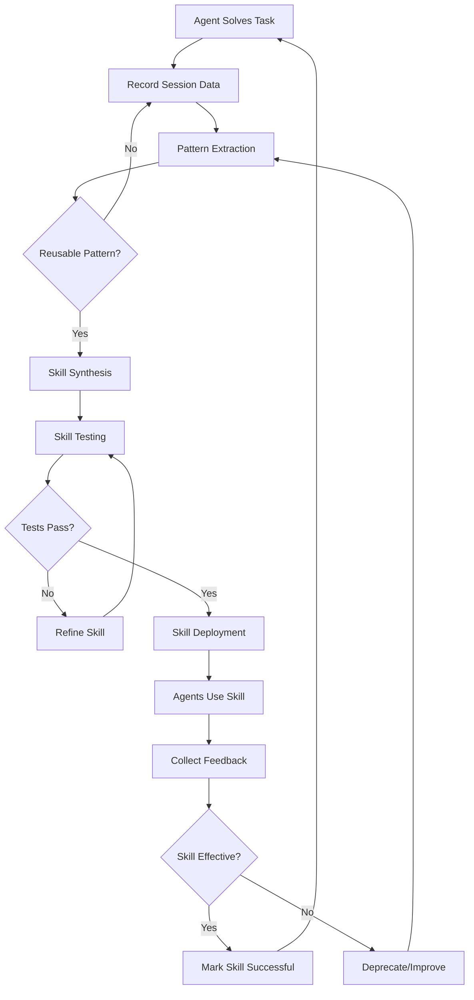

---
tags:
  - self-evolution
  - skill-generation
  - auto-learning
  - knowledge-extraction
  - agent-capabilities
  - meta-learning
date: 2026-03-19
topic: Autonomous Agent Skill Generation
status: complete
---

# Autonomous Agent Skill Generation

## Overview

Self-evolving agents learn from experience and codify learnings into reusable skills, creating a flywheel where agents solve problems, extract patterns, generate skills, and become more capable. This enables continuous improvement without human intervention.

**Key Topics:**
- Pattern extraction from successful agent sessions
- Automated skill synthesis via LLM analysis
- Test-driven skill validation
- Skill deployment and registry management
- Meta-learning: agents improving their learning process
- Skill ecosystem management at scale

---

## The Skill Generation Flywheel



**Core Principles:**
1. **Automatic Extraction** — Skills emerge from patterns, not manual authoring
2. **Test-Driven** — All generated skills must pass validation tests
3. **Feedback Loop** — Track usage and effectiveness to refine patterns
4. **Incremental Learning** — Skills evolve as more data becomes available

---

## Pattern Extraction

### Session Data Collection

```typescript
interface AgentSession {
  sessionId: string;
  taskType: string;
  taskDescription: string;
  agentActions: Action[];
  outcome: "success" | "failure";
  durationMs: number;
  toolsUsed: string[];
  codeGenerated?: string[];
  errorsEncountered?: Error[];
  humanFeedback?: { rating: number; comments: string };
}

// Record all agent sessions
async function recordSession(session: AgentSession) {
  await dynamodb.send(new PutItemCommand({
    TableName: "AgentSessions",
    Item: {
      PK: { S: `SESSION#${session.sessionId}` },
      SK: { S: "METADATA" },
      taskType: { S: session.taskType },
      outcome: { S: session.outcome },
      timestamp: { S: new Date().toISOString() },
      data: { S: JSON.stringify(session) }
    }
  }));
}
```

### Identify Repeating Patterns

```typescript
async function identifyRepeatingPatterns(): Promise<Pattern[]> {
  const sessions = await fetchRecentSessions(1000, "success");
  const byTaskType = groupBy(sessions, "taskType");
  const patterns: Pattern[] = [];

  for (const [taskType, taskSessions] of Object.entries(byTaskType)) {
    const actionSequences = taskSessions.map(s =>
      s.agentActions.map(a => a.type).join(" -> ")
    );

    const sequenceCounts = countOccurrences(actionSequences);
    const commonSequences = Object.entries(sequenceCounts)
      .filter(([seq, count]) => count >= 5)
      .sort((a, b) => b[1] - a[1]);

    for (const [sequence, count] of commonSequences) {
      const exampleSessions = taskSessions.filter(s =>
        s.agentActions.map(a => a.type).join(" -> ") === sequence
      );

      patterns.push({
        id: `pattern-${Date.now()}-${Math.random().toString(36).slice(2)}`,
        taskType,
        actionSequence: sequence,
        frequency: count,
        exampleSessions: exampleSessions.slice(0, 3).map(s => s.sessionId),
        averageDuration: mean(exampleSessions.map(s => s.durationMs)),
        successRate: 1.0
      });
    }
  }

  return patterns;
}
```

### LLM-Based Pattern Analysis

```typescript
async function analyzePatternWithLLM(pattern: Pattern): Promise<PatternAnalysis> {
  const examples = await Promise.all(
    pattern.exampleSessions.map(id => fetchSession(id))
  );

  const prompt = `
Analyze these agent sessions following the same pattern:

Task Type: ${pattern.taskType}
Action Sequence: ${pattern.actionSequence}
Frequency: ${pattern.frequency} occurrences

Example Sessions:
${examples.map((session, i) => `
Session ${i + 1}:
- Task: ${session.taskDescription}
- Actions: ${JSON.stringify(session.agentActions, null, 2)}
- Duration: ${session.durationMs}ms
- Tools Used: ${session.toolsUsed.join(", ")}
`).join("\n")}

Output JSON:
{
  "patternName": "...",
  "description": "...",
  "triggerConditions": ["..."],
  "steps": ["..."],
  "prerequisites": ["..."],
  "reusabilityScore": 0-10,
  "recommendation": "create_skill" | "too_specific" | "merge_with_existing"
}
`;

  const response = await invokeModel("anthropic.claude-opus-4-6-v1:0", {
    prompt,
    temperature: 0.5,
    maxTokens: 4096
  });

  return JSON.parse(response.output);
}
```

---

## Skill Synthesis

### Generate Skill Definition

```typescript
async function synthesizeSkill(
  pattern: Pattern,
  analysis: PatternAnalysis
): Promise<SkillDefinition> {
  if (analysis.recommendation !== "create_skill") {
    throw new Error(`Pattern not suitable: ${analysis.recommendation}`);
  }

  const prompt = `
Generate a reusable agent skill:

Pattern: ${analysis.patternName}
Description: ${analysis.description}
Trigger: ${analysis.triggerConditions.join(", ")}
Steps: ${analysis.steps.join(" → ")}

Create a skill file with:
1. Clear name (kebab-case)
2. Description and trigger conditions
3. Step-by-step actions
4. Required tools
5. Example usage

Output complete YAML skill file.
`;

  const response = await invokeModel("anthropic.claude-opus-4-6-v1:0", {
    prompt,
    temperature: 0.7,
    maxTokens: 4096
  });

  return {
    name: analysis.patternName,
    description: analysis.description,
    trigger: analysis.triggerConditions.join(" OR "),
    steps: analysis.steps.map(step => ({
      description: step,
      action: inferActionType(step),
      details: {}
    })),
    requiredTools: extractToolsFromSteps(analysis.steps),
    exampleUsage: response.output,
    metadata: {
      generatedFrom: pattern.exampleSessions,
      extractionDate: new Date().toISOString(),
      reusabilityScore: analysis.reusabilityScore
    }
  };
}
```

---

## Skill Testing

### Test Case Generation

```typescript
async function generateSkillTests(skill: SkillDefinition): Promise<SkillTest[]> {
  const prompt = `
Generate test cases for skill: ${skill.name}

Create 3-5 tests covering:
1. Happy path
2. Edge cases
3. Failure modes

Output JSON array with: testName, scenario, expectedOutcome
`;

  const response = await invokeModel("anthropic.claude-opus-4-6-v1:0", {
    prompt,
    temperature: 0.5,
    maxTokens: 4096
  });

  return JSON.parse(response.output);
}

async function testSkill(skill: SkillDefinition, tests: SkillTest[]): Promise<TestResults> {
  const results: TestResult[] = [];

  for (const test of tests) {
    try {
      const testAgent = await createTestAgent(skill);
      const result = await testAgent.executeSkill(skill.name, { scenario: test.scenario });

      results.push({
        testName: test.testName,
        passed: validateResult(result, test.expectedOutcome),
        result,
        error: null
      });
    } catch (error) {
      results.push({
        testName: test.testName,
        passed: false,
        result: null,
        error: error.message
      });
    }
  }

  return {
    skillName: skill.name,
    totalTests: tests.length,
    passed: results.filter(r => r.passed).length,
    failed: results.filter(r => !r.passed).length,
    results
  };
}
```

---

## Skill Deployment

### Deployment Pipeline

```typescript
async function deploySkill(skill: SkillDefinition): Promise<DeploymentResult> {
  // 1. Generate skill file
  const skillContent = await generateSkillFile(skill);
  const skillFilePath = `skills/${kebabCase(skill.name)}.md`;

  // 2. Generate and run tests
  const tests = await generateSkillTests(skill);
  const testResults = await testSkill(skill, tests);

  if (testResults.failed > 0) {
    throw new Error(`Tests failed: ${testResults.failed}/${testResults.totalTests}`);
  }

  // 3. Create PR
  await git.checkout("-b", `skill/${kebabCase(skill.name)}`);
  await fs.writeFile(skillFilePath, skillContent);
  await git.add(skillFilePath);
  await git.commit("-m", `Add auto-generated skill: ${skill.name}`);
  await git.push("origin", git.currentBranch());

  const pr = await github.createPullRequest({
    title: `[Auto-Generated] Skill: ${skill.name}`,
    body: `
## 🤖 Auto-Generated Skill

**Name:** ${skill.name}
**Reusability Score:** ${skill.metadata.reusabilityScore}/10

Extracted from ${skill.metadata.generatedFrom.length} successful sessions.

**Test Results:** ✅ ${testResults.passed}/${testResults.totalTests} passed

/cc @skills-review-team
    `,
    labels: ["auto-generated", "skill"]
  });

  return { success: true, skillName: skill.name, prNumber: pr.number, testResults };
}
```

### Skill Registry

```typescript
// DynamoDB-based skill catalog
async function registerSkill(skill: SkillDefinition) {
  await dynamodb.send(new PutItemCommand({
    TableName: "SkillRegistry",
    Item: {
      PK: { S: `SKILL#${kebabCase(skill.name)}` },
      SK: { S: `VERSION#1.0.0` },
      skillName: { S: skill.name },
      description: { S: skill.description },
      usageCount: { N: "0" },
      successRate: { N: "0" },
      status: { S: "testing" },
      deployedAt: { S: new Date().toISOString() }
    }
  }));
}

async function recordSkillUsage(skillName: string, success: boolean, durationMs: number) {
  await dynamodb.send(new UpdateItemCommand({
    TableName: "SkillRegistry",
    Key: {
      PK: { S: `SKILL#${kebabCase(skillName)}` },
      SK: { S: `VERSION#1.0.0` }
    },
    UpdateExpression: `
      SET usageCount = usageCount + :one,
          successCount = successCount + :success,
          successRate = (successCount + :success) / (usageCount + :one),
          lastUsed = :now
    `,
    ExpressionAttributeValues: {
      ":one": { N: "1" },
      ":success": { N: success ? "1" : "0" },
      ":now": { S: new Date().toISOString() }
    }
  }));
}
```

---

## Meta-Learning

### Learning About Learning

```typescript
async function analyzeSkillGenerationEffectiveness(): Promise<MetaLearningInsights> {
  const skills = await getAllSkills({ filter: { generated: true } });

  const insights = {
    totalSkillsGenerated: skills.length,
    activeSkills: skills.filter(s => s.status === "active").length,
    deprecatedSkills: skills.filter(s => s.status === "deprecated").length,
    averageReusabilityScore: mean(skills.map(s => s.metadata.reusabilityScore)),
    averageUsageCount: mean(skills.map(s => s.usageCount)),
    averageSuccessRate: mean(skills.map(s => s.successRate)),
    mostUsedSkills: skills.sort((a, b) => b.usageCount - a.usageCount).slice(0, 10),
    leastUsedSkills: skills.filter(s => s.usageCount < 5)
  };

  const metaPrompt = `
Analyze skill generation effectiveness:

${JSON.stringify(insights, null, 2)}

Identify:
1. What patterns produce useful skills?
2. What reusability threshold predicts high usage?
3. How to improve pattern extraction?

Output recommendations as JSON.
`;

  const response = await invokeModel("anthropic.claude-opus-4-6-v1:0", {
    prompt: metaPrompt,
    temperature: 0.5,
    maxTokens: 4096
  });

  insights.recommendations = JSON.parse(response.output);
  await applyMetaLearnings(insights.recommendations);

  return insights;
}
```

### Skill Evolution

```typescript
async function evolveSkill(skillName: string): Promise<SkillDefinition> {
  const currentSkill = await getSkill(skillName);
  const usageData = await getSkillUsageData(skillName);
  const failures = usageData.filter(u => !u.success);

  if (failures.length === 0) return currentSkill;

  const prompt = `
Improve this skill based on failure cases:

Skill: ${JSON.stringify(currentSkill, null, 2)}

Failures:
${failures.map(f => `- ${f.scenario}: ${f.error}`).join("\n")}

Output improved skill definition as JSON.
`;

  const response = await invokeModel("anthropic.claude-opus-4-6-v1:0", {
    prompt,
    temperature: 0.5,
    maxTokens: 4096
  });

  const improvedSkill = JSON.parse(response.output);

  // Test and deploy if better
  const tests = await generateSkillTests(improvedSkill);
  const testResults = await testSkill(improvedSkill, tests);

  if (testResults.passed >= testResults.totalTests * 0.8) {
    await deploySkillVersion(improvedSkill, "2.0.0");
    return improvedSkill;
  }

  return currentSkill;
}
```

---

## Skill Ecosystem Management

### Skill Discovery

```typescript
async function discoverSkillsForTask(taskDescription: string): Promise<string[]> {
  const prompt = `
Which skills are relevant for: ${taskDescription}

Available skills: ${await listAllSkills()}

Output JSON array of skill names.
`;

  const response = await invokeModel("anthropic.claude-sonnet-4-5-v2:0", {
    prompt,
    temperature: 0.3,
    maxTokens: 1024
  });

  return JSON.parse(response.output);
}
```

### Skill Composition

```typescript
async function composeSkills(
  taskDescription: string,
  availableSkills: string[]
): Promise<SkillWorkflow> {
  const prompt = `
Create a workflow for: ${taskDescription}

Available Skills: ${availableSkills.join(", ")}

Output JSON workflow with steps and error handling.
`;

  const response = await invokeModel("anthropic.claude-opus-4-6-v1:0", {
    prompt,
    temperature: 0.5,
    maxTokens: 2048
  });

  return JSON.parse(response.output);
}
```

### Skill Deduplication

```typescript
async function detectDuplicateSkills(): Promise<DuplicateSkillPairs[]> {
  const skills = await getAllSkills();
  const duplicates: DuplicateSkillPairs[] = [];

  for (let i = 0; i < skills.length; i++) {
    for (let j = i + 1; j < skills.length; j++) {
      const similarity = await computeSkillSimilarity(skills[i], skills[j]);

      if (similarity > 0.8) {
        duplicates.push({
          skill1: skills[i].name,
          skill2: skills[j].name,
          similarity,
          recommendation: similarity > 0.95 ? "merge" : "review"
        });
      }
    }
  }

  return duplicates;
}

async function mergeSkills(skill1Name: string, skill2Name: string): Promise<SkillDefinition> {
  const s1 = await getSkill(skill1Name);
  const s2 = await getSkill(skill2Name);

  const prompt = `
Merge these skills:

Skill 1: ${JSON.stringify(s1, null, 2)}
Skill 2: ${JSON.stringify(s2, null, 2)}

Output merged skill as JSON.
`;

  const response = await invokeModel("anthropic.claude-opus-4-6-v1:0", {
    prompt,
    temperature: 0.5,
    maxTokens: 4096
  });

  const mergedSkill = JSON.parse(response.output);

  await deploySkill(mergedSkill);
  await deprecateSkill(skill1Name, `Merged into ${mergedSkill.name}`);
  await deprecateSkill(skill2Name, `Merged into ${mergedSkill.name}`);

  return mergedSkill;
}
```

---

## Production Examples

### Example 1: Debug Pattern Extraction

```typescript
async function handleBugFix(bugReport: BugReport) {
  const resolution = await debugAndFix(bugReport);

  await recordSession({
    sessionId: `debug-${Date.now()}`,
    taskType: "bug_fix",
    taskDescription: bugReport.description,
    agentActions: resolution.actions,
    outcome: "success",
    durationMs: resolution.durationMs,
    toolsUsed: ["code_search", "edit", "test"]
  });

  const patterns = await identifyRepeatingPatterns();
  const debugPattern = patterns.find(p => p.taskType === "bug_fix");

  if (debugPattern && debugPattern.frequency >= 5) {
    const analysis = await analyzePatternWithLLM(debugPattern);

    if (analysis.recommendation === "create_skill") {
      const skill = await synthesizeSkill(debugPattern, analysis);
      await deploySkill(skill);
    }
  }
}
```

### Example 2: Config Tuning Skill

```typescript
const configSkill = await synthesizeSkill(configTuningPattern, {
  patternName: "Auto-Tune Configuration",
  description: "Automatically adjust configuration parameters to optimize performance",
  triggerConditions: ["Performance below threshold", "High latency"],
  steps: [
    "Fetch performance metrics",
    "Identify bottleneck",
    "Calculate optimal config",
    "Update configuration",
    "Monitor for 10 minutes",
    "Rollback if degraded"
  ],
  prerequisites: ["CloudWatch access", "Config write permissions"],
  reusabilityScore: 9,
  recommendation: "create_skill"
});

await deploySkill(configSkill);
```

---

## References

- [Meta-Learning Survey](https://arxiv.org/abs/1810.03548)
- [Few-Shot Learning](https://arxiv.org/abs/2003.04390)
- [Transfer Learning in NLP](https://arxiv.org/abs/1801.06146)
- [Skill Learning in RL](https://arxiv.org/abs/2008.12423)

---

## Related Documents

- [[01-Prompt-Model-Optimization]] — A/B testing and model routing
- [[02-ML-Experiment-Autoresearch]] — Automated ML experiment loops
- [[03-Self-Modifying-Infrastructure]] — CDK self-editing with Cedar policies
