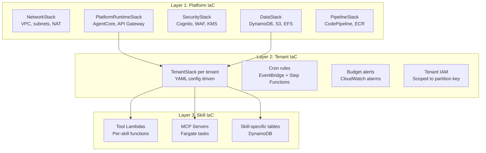
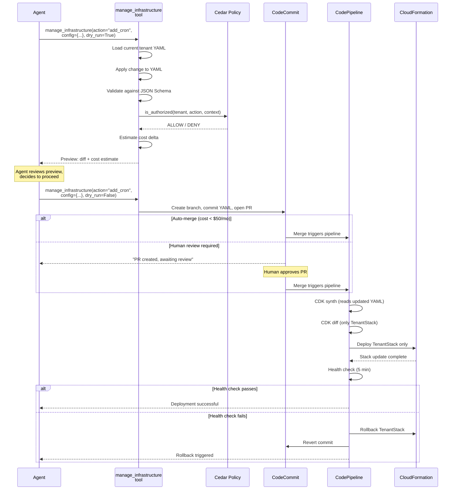

# Self-Modifying Infrastructure & Self-Expanding Agent Swarms

## 1. Executive Summary

AWS Chimera implements **self-modifying infrastructure** and **self-expanding agent swarms** — two capabilities that allow the platform to adapt dynamically to workload demands without human intervention. Traditional agent platforms require human operators to provision resources, configure infrastructure, and scale capacity. Chimera agents propose, validate, and deploy their own infrastructure changes through a GitOps workflow with policy-based safety rails.

This document provides the complete architecture for:
- **Three-layer IaC model** where agents can safely modify tenant-level resources
- **Self-expanding swarms** that spawn new agents based on workload patterns
- **Cedar policy constraints** that prevent dangerous infrastructure changes
- **Cost-aware orchestration** with automatic budget enforcement

### Why This Matters

| Traditional Platforms | AWS Chimera (Self-Modifying) |
|----------------------|------------------------------|
| Human provisions infrastructure | Agents propose infrastructure changes via YAML config |
| Fixed agent capacity | Dynamic agent spawning based on workload |
| Change frequency: weekly/monthly | Change frequency: per-tenant, potentially daily |
| Blast radius: entire platform | Blast radius: single tenant's resources |
| Manual cost management | Cedar policies + AWS Budgets + automatic limits |
| Static resource allocation | Elastic swarms that expand and contract |

**Key benefits:**
- **Reduced operational burden** — agents manage their own infrastructure needs
- **Faster iteration** — no human bottleneck for routine changes
- **Cost efficiency** — swarms scale down when idle, scale up under load
- **Tenant isolation** — infrastructure changes scoped to single tenant
- **Audit trail** — every change tracked in DynamoDB and Git

### Core Design Principles

1. **Agents never write raw CDK/CloudFormation.** They modify tenant YAML configuration files that the CDK app synthesizes. This constrains blast radius to a known schema.

2. **Two-phase commit for all changes.** Every proposal goes through `dry_run=True` (preview + cost estimate) before `dry_run=False` (create PR). No direct infrastructure mutation.

3. **Cedar is the gatekeeper.** Amazon Verified Permissions evaluates every proposed change against tenant-scoped policies. Policies enforce cost limits, rate limits, and resource constraints.

4. **Three infrastructure layers** with different ownership and change approval requirements:
   - **Platform layer** — human-only (VPC, core services)
   - **Tenant layer** — agent-modifiable within policy bounds (cron jobs, models, skills)
   - **Skill layer** — skill-author-managed (Lambda functions, DynamoDB tables for specific skills)

5. **Everything is auditable and reversible.** Pre-change snapshots in S3, audit events in DynamoDB, automatic rollback on health check failure.

6. **Cost-aware orchestration.** Every infrastructure change includes a cost estimate. Cedar policies enforce budget limits. Swarms automatically terminate idle agents.

## 2. Self-Modifying Infrastructure

### Three-Layer IaC Model

Chimera separates infrastructure into three layers with distinct ownership, change frequency, and approval gates. This separation is the foundation that makes self-modification safe.



**Layer 1: Platform IaC (Operator-Managed)**

| Aspect | Detail |
|--------|--------|
| **Owner** | Platform engineering team |
| **Change frequency** | Monthly/quarterly |
| **Approval** | Manual PR review + staging validation + canary |
| **Blast radius** | All tenants (critical) |
| **Self-modification** | **Never** — agents cannot propose platform changes |
| **Stacks** | NetworkStack, DataStack, SecurityStack, ObservabilityStack, PlatformRuntimeStack, PipelineStack |

Platform IaC defines the shared infrastructure envelope. Changes require full pipeline: CDK synth, cdk-nag security checks, integration tests, staging deployment, 30-minute canary bake, manual approval.

> **Immutable Boundary:** Cedar policies contain a hard `forbid` preventing any agent action with `resource.layer == "platform"`.

**Layer 2: Tenant IaC (Agent-Modifiable)**

| Aspect | Detail |
|--------|--------|
| **Owner** | Tenant admin (human) + agents via `manage_infrastructure` tool |
| **Change frequency** | Daily/weekly per active tenant |
| **Approval** | Cedar policy evaluation; auto-merge for low-risk, human review for high-risk |
| **Blast radius** | Single tenant |
| **Self-modification** | **Yes** — within Cedar policy bounds |
| **Source of truth** | `tenants/{tenant_id}.yaml` in Git repo |

Tenant IaC is driven by YAML configuration files that the CDK app reads at synthesis time. Each tenant gets a `TenantStack` with:
- Scoped IAM role (DynamoDB leading key condition on `TENANT#{id}`)
- S3 prefix isolation (`tenants/{id}/*`)
- EventBridge cron rules for scheduled jobs
- CloudWatch budget alarms
- Enterprise tier: dedicated AgentCore Runtime

**Key constraint:** Agents modify YAML, not CDK TypeScript. YAML schema is validated against JSON Schema before any change is accepted.

**Layer 3: Skill IaC (Skill Author-Managed)**

| Aspect | Detail |
|--------|--------|
| **Owner** | Skill authors (internal or marketplace publishers) |
| **Change frequency** | Per skill version update |
| **Approval** | Platform team reviews new skills |
| **Blast radius** | Tenants using that skill |
| **Self-modification** | Auto-generated skills go through sandbox + signing |
| **Source of truth** | `skills/{skill_name}/infra.yaml` |

### Configuration-Driven CDK

Agents never write raw CDK code. Instead, they modify tenant YAML configuration files:

```yaml
# tenants/acme.yaml -- agents can modify this
tenantId: acme
tier: pro
models:
  default: us.anthropic.claude-sonnet-4-6-v1:0
  complex: us.anthropic.claude-opus-4-6-v1:0
skills:
  - code-review
  - email-reader
cronJobs:
  - name: daily-digest
    schedule: "cron(0 8 ? * MON-FRI *)"
    promptKey: prompts/digest.md
    skills: [email-reader, summarizer]
    maxBudgetUsd: 2.0
memoryStrategies: [SUMMARY, SEMANTIC_MEMORY]
budgetLimitMonthlyUsd: 500
```

The CDK app reads these YAML files at synthesis time and generates CloudFormation:

```typescript
// infra/lib/tenant-stack.ts
import * as cdk from 'aws-cdk-lib';
import * as yaml from 'js-yaml';
import * as fs from 'fs';

export class TenantStack extends cdk.Stack {
  constructor(scope: cdk.App, id: string, tenantId: string) {
    super(scope, id);

    // Load tenant config
    const config = yaml.load(
      fs.readFileSync(`tenants/${tenantId}.yaml`, 'utf8')
    ) as TenantConfig;

    // Create resources based on config
    for (const cronJob of config.cronJobs || []) {
      new events.Rule(this, `Cron-${cronJob.name}`, {
        schedule: events.Schedule.expression(cronJob.schedule),
        targets: [new targets.LambdaFunction(agentInvoker, {
          event: events.RuleTargetInput.fromObject({
            tenantId: config.tenantId,
            promptKey: cronJob.promptKey,
            skills: cronJob.skills,
            maxBudgetUsd: cronJob.maxBudgetUsd,
          }),
        })],
      });
    }
  }
}
```

### Cedar Policy Constraints

Amazon Verified Permissions (Cedar) acts as the gatekeeper for all infrastructure changes. Policies are evaluated before any change is applied.

**Example Cedar policies:**

```cedar
// Permit low-cost cron job changes
permit(
  principal,
  action == ClawCore::Action::"propose_infra_change",
  resource
)
when {
  context.action in ["add_cron", "update_cron", "remove_cron"] &&
  context.estimated_cost_delta < 50 &&
  context.change_count_today < 3
};

// Forbid platform layer modifications
forbid(
  principal,
  action,
  resource
)
when {
  resource.layer == "platform"
};

// Require human approval for expensive changes
permit(
  principal,
  action == ClawCore::Action::"propose_infra_change",
  resource
)
when {
  context.estimated_cost_delta >= 50 &&
  context.estimated_cost_delta < 500 &&
  context.has_human_approval == true
};

// Hard budget cap
forbid(
  principal,
  action,
  resource
)
when {
  resource.monthly_cost + context.estimated_cost_delta > resource.budget_limit
};
```

### Self-Modification Workflow

The complete workflow from agent proposal to infrastructure deployment:



### AWS Services Integration

**CloudFormation:** All infrastructure defined as CDK, synthesized to CloudFormation. Tenant stacks are nested stacks for independent deployment.

**CodePipeline:** GitOps pipeline triggered by commits to `main` branch:
1. Source stage: CodeCommit
2. Build stage: `cdk synth` + `cdk-nag` security checks
3. Deploy stage: `cdk deploy` for affected stacks only
4. Post-deploy: Health checks + rollback on failure

**CodeCommit:** Git repository stores tenant YAML files. Agent-proposed changes create PRs.

**DynamoDB:** Audit trail table tracks every infrastructure change:
```
PK: TENANT#{tenant_id}
SK: CHANGE#{timestamp}
{
  action, config, cost_delta, status, pr_id, commit_sha, rollback_sha
}
```

**S3:** Pre-change snapshots stored for rollback:
```
s3://chimera-infra-snapshots/{tenant_id}/{timestamp}.yaml
```

**EventBridge:** Triggers post-deployment health checks and rollback if metrics fail.

## 3. Self-Expanding Agent Swarms

Self-expanding swarms allow agents to dynamically spawn new agent instances based on workload demands. Unlike traditional fixed-capacity systems, Chimera swarms can grow and shrink elastically while maintaining cost controls.

### Agent Spawning Patterns

**Pattern 1: Work Decomposition Spawning**

When an agent receives a complex task, it can decompose the work and spawn sub-agents to parallelize execution:

```python
from strands import Agent, tool

@tool
def spawn_subagents(
    parent_session_id: str,
    tasks: list[dict],
    max_parallel: int = 5
) -> dict:
    """Spawn sub-agents for parallel task execution."""
    import boto3
    ecs = boto3.client('ecs')

    spawned = []
    for task in tasks[:max_parallel]:
        # Launch Fargate task for each sub-agent
        response = ecs.run_task(
            cluster='chimera-agents',
            taskDefinition='agent-worker',
            launchType='FARGATE',
            networkConfiguration={
                'awsvpcConfiguration': {
                    'subnets': ['subnet-xxx'],
                    'securityGroups': ['sg-xxx'],
                }
            },
            overrides={
                'containerOverrides': [{
                    'name': 'agent',
                    'environment': [
                        {'name': 'PARENT_SESSION_ID', 'value': parent_session_id},
                        {'name': 'TASK_SPEC', 'value': json.dumps(task)},
                        {'name': 'MAX_BUDGET_USD', 'value': str(task['budget'])},
                    ]
                }]
            }
        )
        spawned.append({
            'task_arn': response['tasks'][0]['taskArn'],
            'task_id': task['id'],
        })

    return {
        'spawned_count': len(spawned),
        'task_arns': spawned,
        'message': f'Spawned {len(spawned)} sub-agents'
    }
```

**Pattern 2: Load-Based Spawning**

EventBridge monitors queue depth (SQS) and spawns agents when backlog exceeds threshold:

```typescript
// CDK: Auto-scaling based on queue depth
const queue = new sqs.Queue(this, 'TaskQueue');

const scaling = new autoscaling.ScalableTarget(this, 'AgentScaling', {
  serviceNamespace: autoscaling.ServiceNamespace.ECS,
  scalableDimension: 'ecs:service:DesiredCount',
  resourceId: `service/chimera-agents/${agentService.serviceName}`,
  minCapacity: 0,  // Scale to zero when idle
  maxCapacity: 20,
});

scaling.scaleOnMetric('QueueDepthScaling', {
  metric: queue.metricApproximateNumberOfMessagesVisible(),
  scalingSteps: [
    { upper: 0, change: -1 },      // Scale down if empty
    { lower: 10, change: +2 },     // Add 2 agents per 10 messages
    { lower: 50, change: +5 },     // Faster scaling for large backlog
  ],
});
```

**Pattern 3: Time-Based Spawning**

Cron jobs spawn temporary agents for scheduled work:

```typescript
new events.Rule(this, 'DailyDigest', {
  schedule: events.Schedule.cron({ hour: '8', minute: '0' }),
  targets: [new targets.EcsTask({
    cluster: agentCluster,
    taskDefinition: agentTask,
    taskCount: 1,
    subnetSelection: { subnetType: ec2.SubnetType.PRIVATE_WITH_EGRESS },
    containerOverrides: [{
      containerName: 'agent',
      environment: [
        { name: 'TASK_TYPE', value: 'daily_digest' },
        { name: 'AUTO_TERMINATE', value: 'true' },
        { name: 'MAX_BUDGET_USD', value: '2.0' },
      ],
    }],
  })],
});
```

### Swarm Orchestration

**Coordinator Pattern:**

A coordinator agent manages sub-agents without blocking:

```python
from strands import Agent, memory

class SwarmCoordinator:
    def __init__(self, tenant_id: str):
        self.tenant_id = tenant_id
        self.agent = Agent(
            model="us.anthropic.claude-sonnet-4-6-v1:0",
            memory=memory.Summary(),
        )

    async def orchestrate(self, work_items: list[dict]):
        # Spawn workers
        workers = spawn_subagents(
            parent_session_id=self.agent.session_id,
            tasks=work_items,
            max_parallel=5
        )

        # Monitor progress via EventBridge
        results = await self._wait_for_completion(
            workers['task_arns'],
            timeout_minutes=30
        )

        # Aggregate results
        return self._aggregate_results(results)

    async def _wait_for_completion(self, task_arns, timeout_minutes):
        """Poll DynamoDB for task completion events."""
        import boto3
        dynamodb = boto3.resource('dynamodb')
        table = dynamodb.Table('chimera-task-results')

        completed = {}
        deadline = time.time() + (timeout_minutes * 60)

        while len(completed) < len(task_arns) and time.time() < deadline:
            for arn in task_arns:
                if arn in completed:
                    continue

                response = table.get_item(
                    Key={'task_arn': arn}
                )
                if 'Item' in response:
                    completed[arn] = response['Item']

            if len(completed) < len(task_arns):
                await asyncio.sleep(5)

        return completed
```

**Work Distribution via SQS:**

```python
def distribute_work(tenant_id: str, work_items: list[dict]):
    """Push work to SQS queue; agents poll and claim work."""
    import boto3
    sqs = boto3.client('sqs')
    queue_url = f'https://sqs.us-east-1.amazonaws.com/123456789012/chimera-work-{tenant_id}'

    for item in work_items:
        sqs.send_message(
            QueueUrl=queue_url,
            MessageBody=json.dumps(item),
            MessageAttributes={
                'tenant_id': {'StringValue': tenant_id, 'DataType': 'String'},
                'priority': {'StringValue': item.get('priority', 'normal'), 'DataType': 'String'},
                'budget_usd': {'StringValue': str(item.get('budget', 1.0)), 'DataType': 'Number'},
            }
        )
```

### Resource Management

**Auto-Scaling with Cost Controls:**

```typescript
// CDK: ECS service with scaling limits
const agentService = new ecs.FargateService(this, 'AgentService', {
  cluster: agentCluster,
  taskDefinition: agentTask,
  desiredCount: 1,
  minHealthyPercent: 50,
  maxHealthyPercent: 200,
  circuitBreaker: { rollback: true },
});

// Scale based on CPU and custom metrics
const scaling = agentService.autoScaleTaskCount({
  minCapacity: 0,   // Scale to zero when no work
  maxCapacity: 20,  // Hard cap to control costs
});

scaling.scaleOnCpuUtilization('CpuScaling', {
  targetUtilizationPercent: 70,
  scaleInCooldown: Duration.minutes(5),
  scaleOutCooldown: Duration.minutes(1),
});

// Custom metric: active sessions
scaling.scaleOnMetric('SessionScaling', {
  metric: new cloudwatch.Metric({
    namespace: 'Chimera',
    metricName: 'ActiveSessions',
    dimensionsMap: { TenantId: tenantId },
  }),
  scalingSteps: [
    { upper: 0, change: -1 },
    { lower: 5, change: +1 },
    { lower: 15, change: +3 },
  ],
});

// Budget alarm to prevent runaway costs
new cloudwatch.Alarm(this, 'BudgetAlarm', {
  metric: new cloudwatch.Metric({
    namespace: 'Chimera/Cost',
    metricName: 'EstimatedDailyCost',
    dimensionsMap: { TenantId: tenantId },
    statistic: 'Sum',
    period: Duration.hours(1),
  }),
  threshold: 100,  // $100/day = $3000/month
  evaluationPeriods: 1,
  comparisonOperator: cloudwatch.ComparisonOperator.GREATER_THAN_THRESHOLD,
  actionsEnabled: true,
  alarmActions: [new sns_actions.SnsAction(alertTopic)],
});
```

**Lifecycle Management:**

Agents automatically terminate when idle or budget exhausted:

```python
class AgentLifecycleManager:
    def __init__(self, session_id: str, max_budget_usd: float):
        self.session_id = session_id
        self.max_budget_usd = max_budget_usd
        self.start_time = time.time()
        self.total_cost = 0.0

    def should_terminate(self) -> tuple[bool, str]:
        """Check if agent should terminate."""
        # Budget check
        if self.total_cost >= self.max_budget_usd:
            return True, f"Budget exhausted: ${self.total_cost:.2f} >= ${self.max_budget_usd}"

        # Idle timeout (30 minutes)
        if time.time() - self.last_activity > 1800:
            return True, "Idle timeout: 30 minutes"

        # Max runtime (4 hours)
        if time.time() - self.start_time > 14400:
            return True, "Max runtime exceeded: 4 hours"

        return False, ""

    def track_llm_call(self, model: str, input_tokens: int, output_tokens: int):
        """Track costs from LLM calls."""
        pricing = {
            'us.anthropic.claude-opus-4-6-v1:0': (0.015, 0.075),      # per 1K tokens
            'us.anthropic.claude-sonnet-4-6-v1:0': (0.003, 0.015),
            'us.anthropic.claude-haiku-4-5-v1:0': (0.0008, 0.004),
        }

        if model in pricing:
            input_price, output_price = pricing[model]
            cost = (input_tokens / 1000 * input_price) + (output_tokens / 1000 * output_price)
            self.total_cost += cost
            self.last_activity = time.time()
```

### Communication Protocols

**Agent-to-Agent Messaging via EventBridge:**

```python
def send_agent_message(
    from_session_id: str,
    to_session_id: str,
    message_type: str,
    payload: dict
):
    """Send message from one agent to another."""
    import boto3
    events = boto3.client('events')

    events.put_events(
        Entries=[{
            'Source': 'chimera.agent',
            'DetailType': f'agent.message.{message_type}',
            'Detail': json.dumps({
                'from_session_id': from_session_id,
                'to_session_id': to_session_id,
                'payload': payload,
                'timestamp': datetime.utcnow().isoformat(),
            }),
            'EventBusName': 'chimera-agents',
        }]
    )
```

**Result Aggregation Pattern:**

```python
@tool
def aggregate_subagent_results(parent_session_id: str) -> dict:
    """Collect and aggregate results from spawned sub-agents."""
    import boto3
    dynamodb = boto3.resource('dynamodb')
    table = dynamodb.Table('chimera-task-results')

    # Query all results for this parent session
    response = table.query(
        IndexName='parent-session-index',
        KeyConditionExpression='parent_session_id = :pid',
        ExpressionAttributeValues={':pid': parent_session_id}
    )

    results = []
    for item in response['Items']:
        results.append({
            'task_id': item['task_id'],
            'status': item['status'],
            'output': item.get('output'),
            'cost_usd': item.get('cost_usd', 0),
            'duration_seconds': item.get('duration_seconds', 0),
        })

    return {
        'total_tasks': len(results),
        'successful': sum(1 for r in results if r['status'] == 'success'),
        'failed': sum(1 for r in results if r['status'] == 'failed'),
        'total_cost_usd': sum(r['cost_usd'] for r in results),
        'results': results,
    }
```

## 4. Safety & Governance

### Blast Radius Containment

**Tenant Isolation:** Infrastructure changes scoped to single tenant via:
- Separate CloudFormation nested stacks per tenant
- IAM roles with partition key restrictions (`TENANT#{id}`)
- S3 bucket policies limiting access to tenant prefix
- VPC security groups isolating network traffic

**Change Validation:** Multi-layer validation before deployment:
1. **JSON Schema validation** — YAML must conform to tenant config schema
2. **Cedar policy evaluation** — Must pass authorization checks
3. **Cost estimation** — Must be within budget limits
4. **CDK synthesis** — Must produce valid CloudFormation
5. **cdk-nag security checks** — Must pass security rules
6. **Health checks** — Post-deployment monitoring for 5 minutes

**Progressive Rollout:** High-risk changes deployed with canary pattern:
```typescript
// CDK: Canary deployment for infrastructure changes
const deployment = new codedeploy.EcsDeploymentGroup(this, 'Deployment', {
  service: agentService,
  deploymentConfig: codedeploy.EcsDeploymentConfig.CANARY_10PERCENT_5MINUTES,
  alarms: [errorRateAlarm, latencyAlarm],
  autoRollback: {
    failedDeployment: true,
    deploymentInAlarm: true,
  },
});
```

### Cost Controls

**Budget Enforcement:**

```typescript
// CDK: Per-tenant budget with automatic actions
const budget = new budgets.CfnBudget(this, 'TenantBudget', {
  budget: {
    budgetName: `tenant-${tenantId}-monthly`,
    budgetType: 'COST',
    timeUnit: 'MONTHLY',
    budgetLimit: {
      amount: 500,  // $500/month
      unit: 'USD',
    },
  },
  notificationsWithSubscribers: [
    {
      notification: {
        notificationType: 'ACTUAL',
        comparisonOperator: 'GREATER_THAN',
        threshold: 80,  // Alert at 80%
      },
      subscribers: [{ subscriptionType: 'EMAIL', address: 'ops@example.com' }],
    },
    {
      notification: {
        notificationType: 'FORECASTED',
        comparisonOperator: 'GREATER_THAN',
        threshold: 100,  // Alert if forecast exceeds 100%
      },
      subscribers: [{ subscriptionType: 'SNS', address: alertTopic.topicArn }],
    },
  ],
});
```

**Automatic Shutdown:**

Lambda function triggered by budget alarms:

```python
def handle_budget_alarm(event, context):
    """Triggered when tenant exceeds budget. Throttle or pause agents."""
    import boto3

    tenant_id = event['detail']['tenantId']
    threshold_percent = event['detail']['thresholdPercent']

    dynamodb = boto3.resource('dynamodb')
    table = dynamodb.Table('chimera-tenants')

    if threshold_percent >= 100:
        # Hard stop: terminate all running agents
        ecs = boto3.client('ecs')
        tasks = ecs.list_tasks(
            cluster='chimera-agents',
            family=f'agent-{tenant_id}'
        )
        for task_arn in tasks['taskArns']:
            ecs.stop_task(cluster='chimera-agents', task=task_arn, reason='Budget exceeded')

        # Update tenant status
        table.update_item(
            Key={'tenant_id': tenant_id},
            UpdateExpression='SET #status = :status, paused_reason = :reason',
            ExpressionAttributeNames={'#status': 'status'},
            ExpressionAttributeValues={
                ':status': 'BUDGET_EXCEEDED',
                ':reason': f'Monthly budget limit reached at {threshold_percent}%'
            }
        )
    elif threshold_percent >= 90:
        # Soft limit: switch to cheaper models
        table.update_item(
            Key={'tenant_id': tenant_id},
            UpdateExpression='SET cost_saver_mode = :enabled',
            ExpressionAttributeValues={':enabled': True}
        )
```

### Audit Trail

All infrastructure changes logged to DynamoDB:

```python
def record_infrastructure_change(
    tenant_id: str,
    action: str,
    config: dict,
    cost_delta: float,
    status: str,
    pr_id: str = None,
    commit_sha: str = None,
    rollback_sha: str = None
):
    """Record infrastructure change in audit trail."""
    import boto3
    from datetime import datetime

    dynamodb = boto3.resource('dynamodb')
    table = dynamodb.Table('chimera-audit-trail')

    item = {
        'PK': f'TENANT#{tenant_id}',
        'SK': f'CHANGE#{datetime.utcnow().isoformat()}',
        'tenant_id': tenant_id,
        'action': action,
        'config': config,
        'cost_delta_usd': Decimal(str(cost_delta)),
        'status': status,  # proposed, approved, deployed, failed, rolled_back
        'pr_id': pr_id,
        'commit_sha': commit_sha,
        'rollback_sha': rollback_sha,
        'timestamp': datetime.utcnow().isoformat(),
    }

    table.put_item(Item=item)
```

**Audit Query Tool:**

```python
@tool
def query_infrastructure_changes(
    tenant_id: str,
    days_back: int = 30
) -> list[dict]:
    """Query infrastructure change history for a tenant."""
    import boto3
    from datetime import datetime, timedelta

    dynamodb = boto3.resource('dynamodb')
    table = dynamodb.Table('chimera-audit-trail')

    cutoff = (datetime.utcnow() - timedelta(days=days_back)).isoformat()

    response = table.query(
        KeyConditionExpression='PK = :pk AND SK > :cutoff',
        ExpressionAttributeValues={
            ':pk': f'TENANT#{tenant_id}',
            ':cutoff': f'CHANGE#{cutoff}',
        }
    )

    return response['Items']
```

### Rollback Mechanisms

**Automatic Rollback on Health Check Failure:**

```python
# CodePipeline post-deployment action
def health_check_and_rollback(tenant_id: str, commit_sha: str):
    """Check tenant health after deployment. Rollback if unhealthy."""
    import boto3
    import time

    cloudwatch = boto3.client('cloudwatch')
    codecommit = boto3.client('codecommit')

    # Monitor error rate for 5 minutes
    start_time = time.time()
    while time.time() - start_time < 300:  # 5 minutes
        response = cloudwatch.get_metric_statistics(
            Namespace='Chimera',
            MetricName='ErrorRate',
            Dimensions=[{'Name': 'TenantId', 'Value': tenant_id}],
            StartTime=datetime.utcnow() - timedelta(minutes=5),
            EndTime=datetime.utcnow(),
            Period=60,
            Statistics=['Average'],
        )

        if response['Datapoints']:
            error_rate = response['Datapoints'][0]['Average']
            if error_rate > 0.05:  # 5% error rate threshold
                # Trigger rollback
                rollback_commit = _get_previous_commit(codecommit, commit_sha)
                _deploy_commit(tenant_id, rollback_commit)

                record_infrastructure_change(
                    tenant_id=tenant_id,
                    action='rollback',
                    config={'reason': f'Error rate {error_rate:.2%} exceeded threshold'},
                    cost_delta=0,
                    status='rolled_back',
                    rollback_sha=rollback_commit
                )
                return {'status': 'rolled_back', 'reason': 'Health check failed'}

        time.sleep(30)

    return {'status': 'healthy', 'message': 'Health check passed'}
```

**Manual Rollback Tool:**

```python
@tool
def rollback_infrastructure_change(
    tenant_id: str,
    change_id: str
) -> dict:
    """Manually rollback a specific infrastructure change."""
    import boto3

    dynamodb = boto3.resource('dynamodb')
    table = dynamodb.Table('chimera-audit-trail')

    # Get change record
    change = table.get_item(
        Key={'PK': f'TENANT#{tenant_id}', 'SK': f'CHANGE#{change_id}'}
    )['Item']

    # Load pre-change snapshot from S3
    s3 = boto3.client('s3')
    snapshot = s3.get_object(
        Bucket='chimera-infra-snapshots',
        Key=f'{tenant_id}/{change["timestamp"]}.yaml'
    )
    previous_config = yaml.safe_load(snapshot['Body'].read())

    # Apply previous config via standard workflow
    return manage_infrastructure(
        tenant_id=tenant_id,
        action='restore_snapshot',
        config={'snapshot': previous_config},
        dry_run=False
    )
```

## 5. Implementation Patterns

### CDK Constructs

**TenantInfrastructureConstruct** — L3 construct for tenant-specific resources:

```typescript
import * as cdk from 'aws-cdk-lib';
import * as iam from 'aws-cdk-lib/aws-iam';
import * as events from 'aws-cdk-lib/aws-events';
import * as targets from 'aws-cdk-lib/aws-events-targets';

export interface TenantInfraProps {
  tenantId: string;
  config: TenantConfig;
  agentInvoker: lambda.Function;
}

export class TenantInfrastructureConstruct extends cdk.Construct {
  public readonly role: iam.Role;

  constructor(scope: cdk.Construct, id: string, props: TenantInfraProps) {
    super(scope, id);

    // Scoped IAM role
    this.role = new iam.Role(this, 'TenantRole', {
      assumedBy: new iam.ServicePrincipal('ecs-tasks.amazonaws.com'),
      description: `Scoped role for tenant ${props.tenantId}`,
      inlinePolicies: {
        'DynamoDBAccess': new iam.PolicyDocument({
          statements: [
            new iam.PolicyStatement({
              actions: ['dynamodb:*'],
              resources: ['*'],
              conditions: {
                'ForAllValues:StringLike': {
                  'dynamodb:LeadingKeys': [`TENANT#${props.tenantId}`]
                }
              }
            })
          ]
        }),
        'S3Access': new iam.PolicyDocument({
          statements: [
            new iam.PolicyStatement({
              actions: ['s3:*'],
              resources: [
                `arn:aws:s3:::chimera-data/tenants/${props.tenantId}/*`
              ]
            })
          ]
        })
      }
    });

    // Cron jobs
    for (const cronJob of props.config.cronJobs || []) {
      new events.Rule(this, `Cron-${cronJob.name}`, {
        schedule: events.Schedule.expression(cronJob.schedule),
        targets: [new targets.LambdaFunction(props.agentInvoker, {
          event: events.RuleTargetInput.fromObject({
            tenantId: props.tenantId,
            promptKey: cronJob.promptKey,
            skills: cronJob.skills,
            maxBudgetUsd: cronJob.maxBudgetUsd,
          })
        })]
      });
    }

    // Budget alarms
    if (props.config.budgetLimitMonthlyUsd) {
      new cloudwatch.Alarm(this, 'BudgetAlarm', {
        metric: new cloudwatch.Metric({
          namespace: 'Chimera/Cost',
          metricName: 'MonthlySpend',
          dimensionsMap: { TenantId: props.tenantId },
        }),
        threshold: props.config.budgetLimitMonthlyUsd * 0.9,
        evaluationPeriods: 1,
      });
    }
  }
}
```

### Step Functions Orchestration

**Infrastructure Change Workflow:**

```json
{
  "Comment": "Orchestrate infrastructure change with approval gates",
  "StartAt": "ValidateChange",
  "States": {
    "ValidateChange": {
      "Type": "Task",
      "Resource": "arn:aws:lambda:us-east-1:123456789012:function:validate-infra-change",
      "Next": "CheckCedarPolicy"
    },
    "CheckCedarPolicy": {
      "Type": "Task",
      "Resource": "arn:aws:states:::aws-sdk:verifiedpermissions:isAuthorized",
      "Parameters": {
        "PolicyStoreId": "clawcore-policies",
        "Principal.$": "$.principal",
        "Action.$": "$.action",
        "Resource.$": "$.resource",
        "Context.$": "$.context"
      },
      "Next": "IsPolicyAllow"
    },
    "IsPolicyAllow": {
      "Type": "Choice",
      "Choices": [
        {
          "Variable": "$.Decision",
          "StringEquals": "ALLOW",
          "Next": "EstimateCost"
        }
      ],
      "Default": "ChangeRejected"
    },
    "EstimateCost": {
      "Type": "Task",
      "Resource": "arn:aws:lambda:us-east-1:123456789012:function:estimate-cost-delta",
      "Next": "RequiresHumanApproval"
    },
    "RequiresHumanApproval": {
      "Type": "Choice",
      "Choices": [
        {
          "Variable": "$.costDelta",
          "NumericGreaterThan": 50,
          "Next": "WaitForApproval"
        }
      ],
      "Default": "CreatePR"
    },
    "WaitForApproval": {
      "Type": "Task",
      "Resource": "arn:aws:states:::sqs:sendMessage.waitForTaskToken",
      "Parameters": {
        "QueueUrl": "https://sqs.us-east-1.amazonaws.com/123456789012/approval-queue",
        "MessageBody": {
          "TaskToken.$": "$$.Task.Token",
          "Change.$": "$"
        }
      },
      "Next": "CreatePR"
    },
    "CreatePR": {
      "Type": "Task",
      "Resource": "arn:aws:lambda:us-east-1:123456789012:function:create-infra-pr",
      "Next": "ChangeCompleted"
    },
    "ChangeCompleted": {
      "Type": "Succeed"
    },
    "ChangeRejected": {
      "Type": "Fail",
      "Error": "PolicyDenied",
      "Cause": "Cedar policy denied this infrastructure change"
    }
  }
}
```

### EventBridge Coordination

**Event Patterns for Swarm Coordination:**

```typescript
// Rule: Agent completed work, notify parent
new events.Rule(this, 'AgentCompletedRule', {
  eventPattern: {
    source: ['chimera.agent'],
    detailType: ['agent.task.completed'],
  },
  targets: [
    new targets.LambdaFunction(aggregatorFunction),
    new targets.SqsQueue(resultQueue),
  ],
});

// Rule: Budget threshold crossed, throttle agents
new events.Rule(this, 'BudgetThresholdRule', {
  eventPattern: {
    source: ['aws.budgets'],
    detailType: ['Budget Threshold Exceeded'],
    detail: {
      budgetName: [{ prefix: 'tenant-' }],
    },
  },
  targets: [new targets.LambdaFunction(throttleFunction)],
});

// Rule: High queue depth, spawn more agents
new events.Rule(this, 'QueueDepthRule', {
  eventPattern: {
    source: ['chimera.metrics'],
    detailType: ['queue.depth.high'],
  },
  targets: [new targets.StepFunctionsStateMachine(spawnWorkflow)],
});
```

## 6. Use Cases

### Scenario 1: Tenant Requests New Capability

**User request:** "I need a daily summary email sent at 8 AM every weekday."

**Agent workflow:**
1. Agent identifies need for cron job
2. Proposes infrastructure change:
   ```python
   result = manage_infrastructure(
       tenant_id="acme",
       action="add_cron",
       config={
           "name": "daily-email-summary",
           "schedule": "cron(0 8 ? * MON-FRI *)",
           "promptKey": "prompts/daily-summary.md",
           "skills": ["email-sender", "summarizer"],
           "maxBudgetUsd": 2.0,
       },
       dry_run=True
   )
   ```
3. Agent reviews preview: `$1.50/month estimated cost`
4. Agent proceeds with `dry_run=False`
5. PR created and auto-merged (cost < $50)
6. Pipeline deploys new EventBridge rule
7. Cron job starts next day at 8 AM

### Scenario 2: Agent Detects Need for Scaling

**Trigger:** Queue depth exceeds threshold (20 pending tasks)

**Auto-scaling workflow:**
1. CloudWatch alarm triggers EventBridge rule
2. Step Functions workflow starts:
   - Check current ECS task count
   - Calculate required capacity (queue_depth / 2)
   - Verify tenant budget allows scaling
   - Update ECS service desired count
3. New agent tasks launched within 60 seconds
4. Agents poll queue and process work
5. When queue empties, agents auto-terminate
6. Cost logged: `$0.50 for 30 minutes of extra capacity`

### Scenario 3: Skill Installation Requires Infrastructure

**User action:** Installs `code-review` skill from marketplace

**Infrastructure provisioning:**
1. Skill package includes `infra.yaml`:
   ```yaml
   resources:
     - type: lambda
       name: code-review-analyzer
       runtime: python3.12
       memory: 512
       handler: analyzer.handler
     - type: dynamodb
       name: review-patterns
       partitionKey: pattern_id
   ```
2. Agent calls `install_skill` tool
3. CDK reads skill's `infra.yaml`
4. TenantStack updated to include skill resources
5. Lambda and DynamoDB table deployed
6. Skill activated, tool becomes available

## 7. Comparison with Existing Patterns

| Aspect | Traditional IaC | Terraform Cloud / Pulumi Automation | AWS Chimera Self-Modifying |
|--------|----------------|-------------------------------------|----------------------------|
| **Who modifies** | Human engineers | API calls from apps | Agents (with policy constraints) |
| **Change frequency** | Weekly/monthly | Daily | Per-tenant, potentially hourly |
| **Approval process** | PR review + manual merge | API key + RBAC | Cedar policy + cost threshold |
| **Blast radius** | Entire stack | Workspace-scoped | Single tenant |
| **Rollback** | CloudFormation automatic | State rollback | Health check + automatic revert |
| **Cost control** | Manual review | External tools | Built-in Cedar policies + AWS Budgets |
| **Audit trail** | Git history | API logs | DynamoDB + Git + CloudWatch |
| **Self-expanding compute** | Manual ASG config | External orchestrator | Built-in swarm patterns |

**Key differentiators:**
- **Policy-first:** Cedar policies are first-class constraints, not afterthoughts
- **Cost-aware by default:** Every change includes cost estimate and budget check
- **Agent-native:** Designed for agents, not adapted from human workflows
- **Elastic swarms:** Dynamic agent spawning with automatic lifecycle management

## 8. Future Directions

### Advanced Self-Modification Patterns

**1. Cross-Tenant Infrastructure Sharing**
- Shared Lambda layer pools for common dependencies
- Multi-tenant ECS clusters with per-tenant task definitions
- Shared VPC endpoints with usage-based cost allocation

**2. Infrastructure Evolution via Genetic Algorithms**
- Multiple infrastructure configurations compete on cost/performance
- Winning configurations propagate to similar tenants
- Automatic A/B testing of infrastructure patterns

**3. Predictive Scaling**
- ML models predict workload patterns
- Pre-warm resources before demand spikes
- Cost-optimized scheduling (run batch jobs during off-peak hours)

**4. Self-Healing Infrastructure**
- Agents detect degraded resources (slow Lambda, full DynamoDB table)
- Propose remediation (increase memory, enable auto-scaling)
- Apply fixes automatically within policy bounds

### Open Research Questions

1. **How to handle infrastructure dependencies across tenants?**
   - Shared resources vs. full isolation trade-offs
   - Cost allocation for shared infrastructure

2. **Optimal cost controls for self-expanding swarms?**
   - Balance between responsiveness and cost
   - Predictive vs. reactive scaling strategies

3. **Safe evolution of Cedar policies themselves?**
   - Can agents propose policy changes?
   - Meta-policies governing policy evolution

4. **Multi-region self-modification?**
   - Coordinating infrastructure changes across regions
   - Global vs. regional policy evaluation

5. **Integration with external IaC tools?**
   - Can agents modify Terraform/Pulumi configurations?
   - Cross-platform infrastructure management

---

**Related Documents:**
- [[04-Self-Modifying-IaC-Patterns]] (enhancement series) — foundational IaC patterns
- [[06-ML-Experiments-Auto-Evolution]] — ML-driven continuous improvement
- [[ClawCore-Self-Evolution-Engine]] (architecture reviews) — full evolution engine
