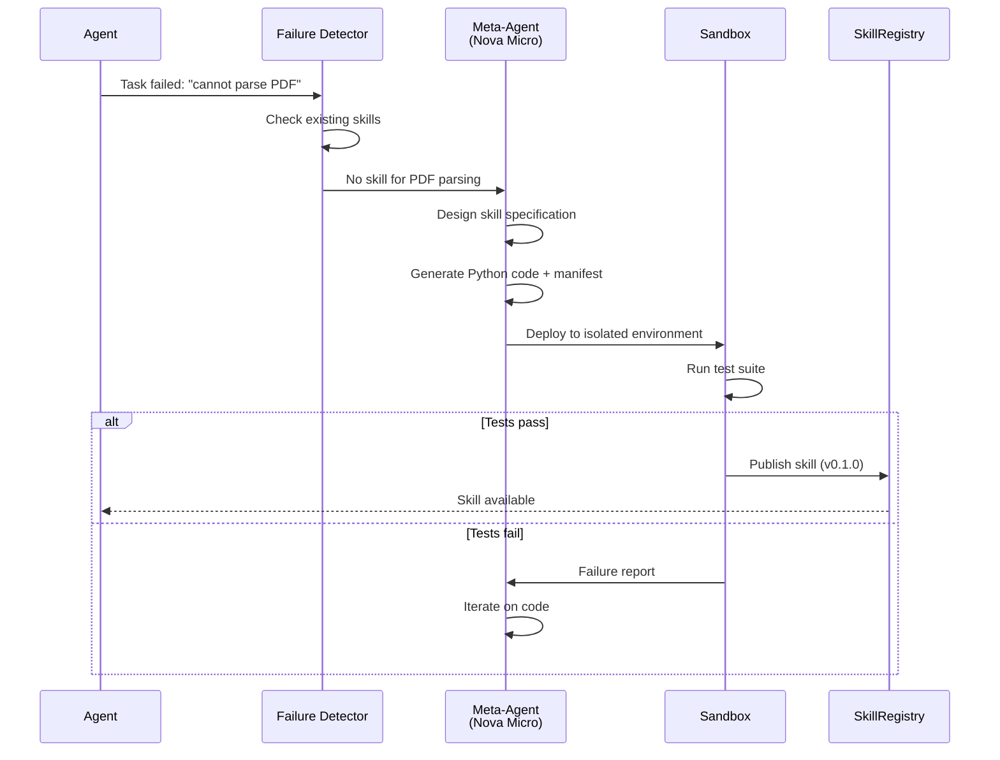
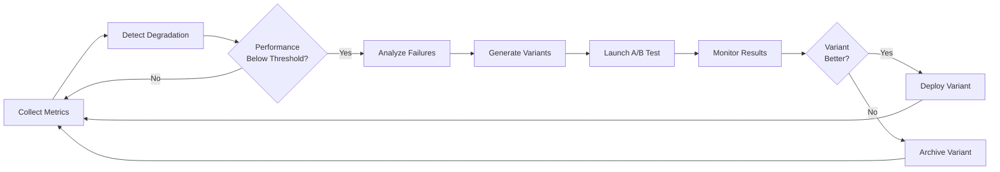

# ML Experiments & Autonomous Self-Improvement

## 1. Executive Summary

AWS Chimera implements **ML-driven autonomous evolution** — the capability for agents to continuously improve themselves through experimentation, learning, and adaptation. Unlike static agent platforms, Chimera agents analyze their own performance, identify improvement opportunities, generate new capabilities, and validate changes through automated testing.

This document covers:
- **Auto-skill generation** — agents create new skills based on capability gaps
- **Prompt optimization** — A/B testing and evolutionary improvement of system prompts
- **Model routing optimization** — Bayesian learning for cost-effective model selection
- **Bedrock fine-tuning integration** — custom models trained on agent interactions
- **Karpathy autoresearch pattern** — agents running their own ML experiments
- **SageMaker orchestration** — experiment tracking and hyperparameter tuning

### Why This Matters

| Static Agent Platforms | AWS Chimera (Self-Evolving) |
|------------------------|------------------------------|
| Fixed capabilities | Agents generate new skills from experience |
| Manual prompt engineering | Automated prompt optimization via A/B testing |
| Fixed model selection | Bayesian routing learns optimal model per task type |
| Human-driven improvements | Agents propose and validate their own improvements |
| No learning from failures | Failures become training data for evolution |
| Static cost/performance | Continuous optimization of cost vs. quality |

**Key benefits:**
- **Continuous improvement** — platform gets better over time without human intervention
- **Reduced operational burden** — agents manage their own capability development
- **Cost efficiency** — automatic optimization for cost/performance trade-offs
- **Rapid adaptation** — new capabilities emerge from usage patterns
- **Data-driven evolution** — decisions based on metrics, not assumptions

### Core Design Principles

1. **Safety-first evolution.** Every change goes through sandbox testing, validation, and optional human review before production deployment.

2. **Metric-driven decisions.** Evolution guided by concrete metrics: task success rate, latency, cost, user satisfaction.

3. **Incremental rollout.** New capabilities deployed via A/B testing with automatic rollback on regression.

4. **Audit everything.** Complete traceability from observation → proposal → validation → deployment.

5. **Budget-aware experimentation.** All experiments include cost caps and automatic termination.

6. **Human oversight for high-risk changes.** Policy-defined thresholds for when human approval is required.

7. **Reversible by default.** Every evolution creates snapshots for rollback.

## 2. Auto-Skill Generation

Chimera agents can identify capability gaps from failed tasks or user requests, then generate new skills to fill those gaps. The generated skills go through automated testing and validation before deployment.

### Skill Learning Pipeline

**Gap Detection Workflow:**



**Implementation:**

```python
from strands import Agent, tool
from strands.models import BedrockModel

@tool
def detect_capability_gap(
    session_id: str,
    failure_details: dict
) -> dict:
    """Analyze failure to identify missing capability."""
    import boto3

    dynamodb = boto3.resource('dynamodb')
    table = dynamodb.Table('chimera-sessions')

    # Get session history
    session = table.get_item(Key={'session_id': session_id})['Item']
    conversation = json.loads(session['conversation_log'])

    # Extract failure pattern
    failure_type = failure_details.get('error_type')
    attempted_action = failure_details.get('action')

    # Check if existing skill could have handled this
    skills_table = dynamodb.Table('chimera-skills')
    existing_skills = skills_table.scan(
        FilterExpression='capability = :cap',
        ExpressionAttributeValues={':cap': attempted_action}
    )

    if existing_skills['Items']:
        return {'status': 'existing_skill_available', 'skills': existing_skills['Items']}

    # Gap identified - propose new skill
    return {
        'status': 'gap_detected',
        'required_capability': attempted_action,
        'failure_context': failure_details,
        'recommendation': 'generate_new_skill'
    }


@tool
def generate_skill(
    capability_name: str,
    requirements: dict,
    test_cases: list[dict]
) -> dict:
    """Use meta-agent to generate a new skill."""

    meta_agent = Agent(
        model=BedrockModel(model_id="us.amazon.nova-micro-v1:0"),
        system_prompt="""You are a skill generation specialist. Given a capability
requirement, generate a complete Strands skill package including:
1. Python tool function with type hints and docstring
2. Test suite covering happy path and edge cases
3. skill.yaml manifest with metadata
4. README with usage examples

Follow these constraints:
- Tools must be idempotent and safe
- Handle errors gracefully, never raise unhandled exceptions
- Include cost estimates for any API calls
- Use async/await for I/O operations
- Maximum execution time: 60 seconds per tool call""",
        memory=None
    )

    prompt = f"""Generate a skill for: {capability_name}

Requirements:
{json.dumps(requirements, indent=2)}

Test cases:
{json.dumps(test_cases, indent=2)}

Output the complete skill package as structured JSON."""

    response = meta_agent.run(prompt)

    return {
        'skill_code': response.get('tool_function'),
        'test_suite': response.get('tests'),
        'manifest': response.get('manifest'),
        'readme': response.get('readme')
    }
```

### Code Generation & Validation

**Multi-Stage Validation:**

1. **Static Analysis** — check for security vulnerabilities
2. **Syntax Validation** — ensure code is valid Python
3. **Type Checking** — mypy validation with strict mode
4. **Security Scan** — bandit for common security issues
5. **Sandbox Execution** — run in isolated environment
6. **Test Suite Execution** — run generated tests
7. **Integration Test** — test with real agent

```python
def validate_generated_skill(skill_package: dict) -> dict:
    """Multi-stage validation of generated skill code."""
    import subprocess
    import tempfile
    import os

    validation_results = {
        'stages': {},
        'overall_status': 'unknown'
    }

    with tempfile.TemporaryDirectory() as tmpdir:
        # Write skill code to temp directory
        skill_path = os.path.join(tmpdir, 'skill.py')
        with open(skill_path, 'w') as f:
            f.write(skill_package['skill_code'])

        # Stage 1: Syntax check
        result = subprocess.run(
            ['python', '-m', 'py_compile', skill_path],
            capture_output=True
        )
        validation_results['stages']['syntax'] = {
            'passed': result.returncode == 0,
            'output': result.stderr.decode()
        }
        if result.returncode != 0:
            validation_results['overall_status'] = 'failed'
            return validation_results

        # Stage 2: Type checking
        result = subprocess.run(
            ['mypy', '--strict', skill_path],
            capture_output=True
        )
        validation_results['stages']['typecheck'] = {
            'passed': result.returncode == 0,
            'output': result.stdout.decode()
        }

        # Stage 3: Security scan
        result = subprocess.run(
            ['bandit', '-r', tmpdir],
            capture_output=True
        )
        validation_results['stages']['security'] = {
            'passed': result.returncode == 0,
            'issues': result.stdout.decode()
        }

        # Stage 4: Test execution in sandbox
        test_result = _run_tests_in_sandbox(skill_package, tmpdir)
        validation_results['stages']['tests'] = test_result

        if all(stage['passed'] for stage in validation_results['stages'].values()):
            validation_results['overall_status'] = 'passed'
        else:
            validation_results['overall_status'] = 'failed'

    return validation_results


def _run_tests_in_sandbox(skill_package: dict, tmpdir: str) -> dict:
    """Execute skill tests in Docker sandbox."""
    import docker

    client = docker.from_env()

    # Create sandbox container
    container = client.containers.run(
        'python:3.12-slim',
        command=['pytest', '/workspace/test_skill.py'],
        volumes={tmpdir: {'bind': '/workspace', 'mode': 'ro'}},
        network_disabled=True,  # No network access
        mem_limit='512m',
        cpu_quota=50000,  # 50% of one core
        detach=True,
        remove=True
    )

    # Wait for completion (timeout 60s)
    try:
        result = container.wait(timeout=60)
        logs = container.logs().decode()
        return {
            'passed': result['StatusCode'] == 0,
            'output': logs
        }
    except Exception as e:
        container.kill()
        return {
            'passed': False,
            'output': f'Sandbox execution failed: {str(e)}'
        }
```

### Skill Testing & Deployment

**Automated Testing Pipeline:**

```yaml
# .github/workflows/skill-validation.yml
name: Validate Generated Skill

on:
  push:
    paths:
      - 'skills/generated/**'

jobs:
  validate:
    runs-on: ubuntu-latest
    steps:
      - uses: actions/checkout@v3

      - name: Set up Python
        uses: actions/setup-python@v4
        with:
          python-version: '3.12'

      - name: Install dependencies
        run: |
          pip install strands boto3 pytest mypy bandit

      - name: Run validation suite
        run: |
          python scripts/validate_skill.py ${{ github.event.head_commit.modified }}

      - name: Sandbox test
        run: |
          docker build -t skill-sandbox -f Dockerfile.sandbox .
          docker run --rm skill-sandbox pytest

      - name: Deploy to staging
        if: success()
        run: |
          aws s3 cp skills/generated/$SKILL_NAME s3://chimera-skills-staging/

      - name: Integration test in staging
        run: |
          python scripts/integration_test.py --env staging --skill $SKILL_NAME

      - name: Promote to production
        if: success()
        run: |
          aws s3 cp s3://chimera-skills-staging/$SKILL_NAME \
                   s3://chimera-skills-prod/$SKILL_NAME
```

### Skill Marketplace Integration

Generated skills published to internal marketplace with versioning:

```python
@tool
def publish_skill(
    skill_package: dict,
    author: str = "auto-generated",
    visibility: str = "private"
) -> dict:
    """Publish validated skill to marketplace."""
    import boto3

    s3 = boto3.client('s3')
    dynamodb = boto3.resource('dynamodb')

    skill_name = skill_package['manifest']['name']
    version = skill_package['manifest']['version']

    # Upload skill package to S3
    package_key = f"skills/{skill_name}/{version}/package.tar.gz"
    s3.put_object(
        Bucket='chimera-skills',
        Key=package_key,
        Body=_create_tarball(skill_package),
        Metadata={
            'author': author,
            'generated': 'true',
            'validation_status': 'passed'
        }
    )

    # Register in marketplace
    table = dynamodb.Table('chimera-skill-marketplace')
    table.put_item(Item={
        'skill_name': skill_name,
        'version': version,
        'author': author,
        'package_url': f's3://chimera-skills/{package_key}',
        'visibility': visibility,
        'status': 'published',
        'published_at': datetime.utcnow().isoformat(),
        'downloads': 0,
        'rating': 0.0
    })

    return {
        'status': 'published',
        'skill_name': skill_name,
        'version': version,
        'package_url': package_key
    }
```

## 3. Prompt Engineering & A/B Testing

Chimera continuously optimizes system prompts through A/B testing, analyzing which prompt variants produce better outcomes across dimensions like task success rate, cost, latency, and user satisfaction.

### Prompt Evolution Strategies

**Strategy 1: Failure-Driven Refinement**

Analyze conversation logs for failure patterns, propose targeted prompt improvements:

```python
def analyze_prompt_failures(tenant_id: str, days_back: int = 7) -> dict:
    """Identify patterns in prompt-related failures."""
    import boto3

    dynamodb = boto3.resource('dynamodb')
    table = dynamodb.Table('chimera-sessions')

    # Query recent sessions
    cutoff = (datetime.utcnow() - timedelta(days=days_back)).isoformat()
    response = table.query(
        IndexName='tenant-timestamp-index',
        KeyConditionExpression='tenant_id = :tid AND created_at > :cutoff',
        ExpressionAttributeValues={':tid': tenant_id, ':cutoff': cutoff}
    )

    # Categorize failures
    failures = {
        'tool_call_errors': [],
        'user_corrections': [],
        'clarification_loops': [],
        'timeout_exceeded': []
    }

    for session in response['Items']:
        log = json.loads(session.get('conversation_log', '[]'))

        # Detect tool call failures
        tool_errors = [turn for turn in log
                       if turn.get('role') == 'tool' and turn.get('status') == 'error']
        failures['tool_call_errors'].extend(tool_errors)

        # Detect user corrections
        corrections = [turn for turn in log
                       if turn.get('role') == 'user' and
                       any(signal in turn.get('content', '').lower()
                           for signal in ['no,', "that's wrong", 'i meant'])]
        failures['user_corrections'].extend(corrections)

        # Detect clarification loops
        consecutive_questions = 0
        for turn in log:
            if turn.get('role') == 'assistant' and '?' in turn.get('content', ''):
                consecutive_questions += 1
            else:
                if consecutive_questions >= 3:
                    failures['clarification_loops'].append(turn)
                consecutive_questions = 0

    return {
        'tenant_id': tenant_id,
        'period_days': days_back,
        'failure_counts': {k: len(v) for k, v in failures.items()},
        'top_failures': {
            k: v[:5] for k, v in failures.items()  # Top 5 of each type
        }
    }


@tool
def propose_prompt_improvement(
    current_prompt: str,
    failure_analysis: dict
) -> dict:
    """Generate improved prompt based on failure analysis."""

    meta_agent = Agent(
        model=BedrockModel(model_id="us.anthropic.claude-sonnet-4-6-v1:0"),
        system_prompt="""You are a prompt engineering specialist. Given a system prompt
and failure analysis, propose an improved version that addresses the failures while
maintaining all existing capabilities. Focus on:
1. Clearer tool-use instructions if tool call errors are frequent
2. More direct response patterns if clarification loops are common
3. Better examples if user corrections suggest misunderstanding""",
    )

    prompt = f"""Current system prompt:
```
{current_prompt}
```

Failure analysis:
{json.dumps(failure_analysis, indent=2)}

Propose an improved version."""

    response = meta_agent.run(prompt)

    return {
        'proposed_prompt': response.get('improved_prompt'),
        'rationale': response.get('changes_explained'),
        'addressed_failures': response.get('failure_types_addressed')
    }
```

**Strategy 2: Multi-Armed Bandit Optimization**

Balance exploration (trying new prompts) vs. exploitation (using known good prompts):

```python
class PromptBandit:
    """Thompson Sampling for prompt variant selection."""

    def __init__(self, tenant_id: str):
        self.tenant_id = tenant_id
        self.variants = {}  # variant_id -> {alpha, beta, prompt_text}
        self._load_state()

    def select_variant(self) -> tuple[str, str]:
        """Select prompt variant using Thompson Sampling."""
        import numpy as np

        # Sample from Beta distribution for each variant
        samples = {
            variant_id: np.random.beta(stats['alpha'], stats['beta'])
            for variant_id, stats in self.variants.items()
        }

        # Select variant with highest sample
        selected_id = max(samples, key=samples.get)
        return selected_id, self.variants[selected_id]['prompt_text']

    def record_outcome(self, variant_id: str, success: bool):
        """Update belief about variant effectiveness."""
        if success:
            self.variants[variant_id]['alpha'] += 1
        else:
            self.variants[variant_id]['beta'] += 1

        self._save_state()

    def add_variant(self, variant_id: str, prompt_text: str):
        """Add new prompt variant to test."""
        self.variants[variant_id] = {
            'alpha': 1,  # Prior: uniform distribution
            'beta': 1,
            'prompt_text': prompt_text
        }
```

### A/B Testing Framework

**DynamoDB Schema for A/B Tests:**

```python
# chimera-ab-tests table
{
    'PK': 'TEST#{test_id}',
    'SK': 'METADATA',
    'tenant_id': 'acme',
    'test_type': 'prompt',
    'variants': {
        'control': {'prompt_key': 's3://prompts/v1.0.md', 'weight': 0.5},
        'variant_a': {'prompt_key': 's3://prompts/v1.1.md', 'weight': 0.5}
    },
    'metrics': ['success_rate', 'cost_per_task', 'latency_p95'],
    'status': 'running',
    'started_at': '2026-03-19T10:00:00Z',
    'min_samples': 100,
    'confidence_threshold': 0.95
}

# Result records
{
    'PK': 'TEST#{test_id}',
    'SK': 'RESULT#{session_id}',
    'variant': 'control',
    'success': True,
    'cost_usd': 0.05,
    'latency_ms': 1234,
    'user_rating': 5
}
```

**A/B Test Orchestration:**

```python
@tool
def run_ab_test(
    tenant_id: str,
    test_type: str,
    control_config: dict,
    variant_config: dict,
    duration_hours: int = 24,
    min_samples: int = 100
) -> dict:
    """Launch A/B test for prompt or model configuration."""
    import boto3

    dynamodb = boto3.resource('dynamodb')
    table = dynamodb.Table('chimera-ab-tests')

    test_id = f"{tenant_id}-{test_type}-{int(time.time())}"

    # Create test record
    table.put_item(Item={
        'PK': f'TEST#{test_id}',
        'SK': 'METADATA',
        'tenant_id': tenant_id,
        'test_type': test_type,
        'variants': {
            'control': control_config,
            'variant_a': variant_config
        },
        'status': 'running',
        'started_at': datetime.utcnow().isoformat(),
        'end_at': (datetime.utcnow() + timedelta(hours=duration_hours)).isoformat(),
        'min_samples': min_samples
    })

    # Schedule automatic evaluation
    events = boto3.client('events')
    events.put_rule(
        Name=f'evaluate-{test_id}',
        ScheduleExpression=f'rate({duration_hours} hours)',
        State='ENABLED'
    )
    events.put_targets(
        Rule=f'evaluate-{test_id}',
        Targets=[{
            'Id': '1',
            'Arn': 'arn:aws:lambda:us-east-1:123456789012:function:evaluate-ab-test',
            'Input': json.dumps({'test_id': test_id})
        }]
    )

    return {
        'test_id': test_id,
        'status': 'running',
        'variants': ['control', 'variant_a'],
        'evaluation_scheduled_at': (datetime.utcnow() + timedelta(hours=duration_hours)).isoformat()
    }


def evaluate_ab_test(test_id: str) -> dict:
    """Statistical evaluation of A/B test results."""
    from scipy import stats
    import boto3

    dynamodb = boto3.resource('dynamodb')
    table = dynamodb.Table('chimera-ab-tests')

    # Get all results
    results = table.query(
        KeyConditionExpression='PK = :pk AND begins_with(SK, :sk)',
        ExpressionAttributeValues={
            ':pk': f'TEST#{test_id}',
            ':sk': 'RESULT#'
        }
    )

    # Group by variant
    control_results = [r for r in results['Items'] if r['variant'] == 'control']
    variant_results = [r for r in results['Items'] if r['variant'] == 'variant_a']

    # Calculate metrics
    control_success_rate = sum(r['success'] for r in control_results) / len(control_results)
    variant_success_rate = sum(r['success'] for r in variant_results) / len(variant_results)

    control_cost = [r['cost_usd'] for r in control_results]
    variant_cost = [r['cost_usd'] for r in variant_results]

    # Statistical significance tests
    success_pvalue = stats.fisher_exact([
        [sum(r['success'] for r in control_results), len(control_results)],
        [sum(r['success'] for r in variant_results), len(variant_results)]
    ])[1]

    cost_pvalue = stats.mannwhitneyu(control_cost, variant_cost).pvalue

    # Determine winner
    if success_pvalue < 0.05 and variant_success_rate > control_success_rate:
        winner = 'variant_a'
        confidence = 1 - success_pvalue
    elif success_pvalue < 0.05 and control_success_rate > variant_success_rate:
        winner = 'control'
        confidence = 1 - success_pvalue
    else:
        winner = 'inconclusive'
        confidence = 0

    return {
        'test_id': test_id,
        'winner': winner,
        'confidence': confidence,
        'metrics': {
            'control': {
                'success_rate': control_success_rate,
                'avg_cost': sum(control_cost) / len(control_cost),
                'sample_size': len(control_results)
            },
            'variant_a': {
                'success_rate': variant_success_rate,
                'avg_cost': sum(variant_cost) / len(variant_cost),
                'sample_size': len(variant_results)
            }
        }
    }
```

### Performance Metrics

**Comprehensive Metric Collection:**

```python
def record_session_metrics(session_id: str, session_data: dict):
    """Record metrics for prompt evaluation."""
    import boto3

    cloudwatch = boto3.client('cloudwatch')

    metrics = [
        {
            'MetricName': 'TaskSuccess',
            'Value': 1 if session_data['status'] == 'success' else 0,
            'Unit': 'None'
        },
        {
            'MetricName': 'SessionCost',
            'Value': session_data['total_cost_usd'],
            'Unit': 'None'
        },
        {
            'MetricName': 'SessionLatency',
            'Value': session_data['duration_seconds'],
            'Unit': 'Seconds'
        },
        {
            'MetricName': 'ToolCallCount',
            'Value': session_data['tool_call_count'],
            'Unit': 'Count'
        },
        {
            'MetricName': 'TokensUsed',
            'Value': session_data['total_tokens'],
            'Unit': 'Count'
        }
    ]

    cloudwatch.put_metric_data(
        Namespace='Chimera/PromptPerformance',
        MetricData=[
            {
                **metric,
                'Dimensions': [
                    {'Name': 'TenantId', 'Value': session_data['tenant_id']},
                    {'Name': 'PromptVersion', 'Value': session_data['prompt_version']},
                    {'Name': 'ModelId', 'Value': session_data['model_id']}
                ],
                'Timestamp': datetime.utcnow()
            }
            for metric in metrics
        ]
    )
```

### Automatic Prompt Optimization

**Continuous Improvement Loop:**



**Step Functions Workflow:**

```json
{
  "Comment": "Automatic prompt optimization workflow",
  "StartAt": "CollectMetrics",
  "States": {
    "CollectMetrics": {
      "Type": "Task",
      "Resource": "arn:aws:lambda:...:function:collect-prompt-metrics",
      "Next": "CheckPerformance"
    },
    "CheckPerformance": {
      "Type": "Choice",
      "Choices": [
        {
          "Variable": "$.success_rate",
          "NumericLessThan": 0.9,
          "Next": "AnalyzeFailures"
        }
      ],
      "Default": "Success"
    },
    "AnalyzeFailures": {
      "Type": "Task",
      "Resource": "arn:aws:lambda:...:function:analyze-failures",
      "Next": "GenerateVariants"
    },
    "GenerateVariants": {
      "Type": "Task",
      "Resource": "arn:aws:lambda:...:function:generate-prompt-variants",
      "Next": "LaunchABTest"
    },
    "LaunchABTest": {
      "Type": "Task",
      "Resource": "arn:aws:lambda:...:function:launch-ab-test",
      "Next": "WaitForResults"
    },
    "WaitForResults": {
      "Type": "Wait",
      "Seconds": 86400,
      "Next": "EvaluateTest"
    },
    "EvaluateTest": {
      "Type": "Task",
      "Resource": "arn:aws:lambda:...:function:evaluate-ab-test",
      "Next": "DeployWinner"
    },
    "DeployWinner": {
      "Type": "Task",
      "Resource": "arn:aws:lambda:...:function:deploy-prompt",
      "Next": "Success"
    },
    "Success": {
      "Type": "Succeed"
    }
  }
}
```

## 4. Model Routing Optimization

Chimera learns which models work best for which task types, optimizing the cost/performance trade-off through Bayesian inference.

### Multi-Model Strategy

**Model Selection Matrix:**

| Task Type | Default Model | Rationale | Cost per 1M tokens |
|-----------|--------------|-----------|-------------------|
| Complex reasoning | Claude Opus 4.6 | Best accuracy for multi-step problems | $15 / $75 (in/out) |
| Code generation | Claude Sonnet 4.6 | Strong code quality at lower cost | $3 / $15 |
| Simple queries | Claude Haiku 4.5 | Fast, cost-effective | $0.80 / $4 |
| Long context | Claude Sonnet 4.6 | Good quality with 200K context | $3 / $15 |
| Structured data | Nova Micro | Cheap for JSON extraction | $0.035 / $0.14 |

```python
class ModelRouter:
    """Intelligent model selection based on task characteristics."""

    def select_model(self, task_description: str, context_length: int, budget_usd: float) -> str:
        """Select optimal model for task."""

        # Extract task features
        features = self._extract_features(task_description)

        # Estimate complexity
        complexity = self._estimate_complexity(features, context_length)

        # Check budget constraints
        max_cost_per_call = budget_usd * 0.1  # Use max 10% of budget per call

        # Select model based on complexity and budget
        if complexity > 0.8 and max_cost_per_call > 0.50:
            return "us.anthropic.claude-opus-4-6-v1:0"
        elif complexity > 0.5 or context_length > 50000:
            return "us.anthropic.claude-sonnet-4-6-v1:0"
        else:
            return "us.anthropic.claude-haiku-4-5-v1:0"

    def _extract_features(self, task_description: str) -> dict:
        """Extract features from task description."""
        return {
            'requires_code': 'code' in task_description.lower() or 'program' in task_description.lower(),
            'requires_reasoning': any(word in task_description.lower()
                                     for word in ['analyze', 'compare', 'evaluate']),
            'requires_creativity': any(word in task_description.lower()
                                       for word in ['create', 'design', 'write']),
            'is_structured_data': any(word in task_description.lower()
                                      for word in ['json', 'extract', 'parse']),
        }

    def _estimate_complexity(self, features: dict, context_length: int) -> float:
        """Estimate task complexity on 0-1 scale."""
        complexity = 0.0

        if features['requires_code']:
            complexity += 0.3
        if features['requires_reasoning']:
            complexity += 0.4
        if features['requires_creativity']:
            complexity += 0.2
        if context_length > 50000:
            complexity += 0.1

        return min(complexity, 1.0)
```

### Bayesian Routing

**Learning Model Performance:**

```python
class BayesianModelRouter:
    """Learn model performance through Bayesian inference."""

    def __init__(self, tenant_id: str):
        self.tenant_id = tenant_id
        self.beliefs = {}  # model_id -> {task_type -> Beta distribution}
        self._load_state()

    def select_model(self, task_type: str) -> str:
        """Select model using Thompson Sampling."""
        import numpy as np

        # Sample from Beta distribution for each model
        samples = {}
        for model_id, task_beliefs in self.beliefs.items():
            if task_type in task_beliefs:
                alpha, beta = task_beliefs[task_type]
                samples[model_id] = np.random.beta(alpha, beta)

        # Select model with highest sample
        return max(samples, key=samples.get) if samples else self._default_model(task_type)

    def record_outcome(self, model_id: str, task_type: str, success: bool, cost_usd: float):
        """Update beliefs based on outcome."""
        if model_id not in self.beliefs:
            self.beliefs[model_id] = {}

        if task_type not in self.beliefs[model_id]:
            # Initialize with uniform prior
            self.beliefs[model_id][task_type] = [1, 1]

        # Update based on success
        if success:
            self.beliefs[model_id][task_type][0] += 1
        else:
            self.beliefs[model_id][task_type][1] += 1

        # Also consider cost (penalize expensive failures more)
        if not success and cost_usd > 0.10:
            self.beliefs[model_id][task_type][1] += int(cost_usd * 10)

        self._save_state()

    def _default_model(self, task_type: str) -> str:
        """Fallback for unknown task types."""
        defaults = {
            'code': 'us.anthropic.claude-sonnet-4-6-v1:0',
            'reasoning': 'us.anthropic.claude-opus-4-6-v1:0',
            'simple': 'us.anthropic.claude-haiku-4-5-v1:0'
        }
        return defaults.get(task_type, 'us.anthropic.claude-sonnet-4-6-v1:0')
```

### Cost-Performance Tradeoffs

**Dynamic Cost Optimization:**

```python
@tool
def optimize_model_selection(
    tenant_id: str,
    target_success_rate: float = 0.95,
    max_cost_per_task: float = 0.50
) -> dict:
    """Find optimal model mix for cost/quality trade-off."""
    import boto3

    dynamodb = boto3.resource('dynamodb')
    table = dynamodb.Table('chimera-sessions')

    # Get recent session data
    response = table.query(
        IndexName='tenant-timestamp-index',
        KeyConditionExpression='tenant_id = :tid AND created_at > :cutoff',
        ExpressionAttributeValues={
            ':tid': tenant_id,
            ':cutoff': (datetime.utcnow() - timedelta(days=30)).isoformat()
        }
    )

    # Group by model
    by_model = {}
    for session in response['Items']:
        model_id = session['model_id']
        if model_id not in by_model:
            by_model[model_id] = {'successes': 0, 'failures': 0, 'total_cost': 0}

        if session['status'] == 'success':
            by_model[model_id]['successes'] += 1
        else:
            by_model[model_id]['failures'] += 1

        by_model[model_id]['total_cost'] += session.get('cost_usd', 0)

    # Calculate metrics
    recommendations = []
    for model_id, stats in by_model.items():
        total = stats['successes'] + stats['failures']
        success_rate = stats['successes'] / total if total > 0 else 0
        avg_cost = stats['total_cost'] / total if total > 0 else 0

        if success_rate >= target_success_rate and avg_cost <= max_cost_per_task:
            recommendations.append({
                'model_id': model_id,
                'success_rate': success_rate,
                'avg_cost_per_task': avg_cost,
                'recommendation': 'optimal'
            })
        elif success_rate >= target_success_rate:
            recommendations.append({
                'model_id': model_id,
                'success_rate': success_rate,
                'avg_cost_per_task': avg_cost,
                'recommendation': 'high_quality_but_expensive'
            })
        elif avg_cost <= max_cost_per_task:
            recommendations.append({
                'model_id': model_id,
                'success_rate': success_rate,
                'avg_cost_per_task': avg_cost,
                'recommendation': 'cheap_but_low_quality'
            })

    return {
        'tenant_id': tenant_id,
        'analysis_period_days': 30,
        'target_success_rate': target_success_rate,
        'max_cost_per_task': max_cost_per_task,
        'recommendations': sorted(recommendations, key=lambda x: x['success_rate'], reverse=True)
    }
```

### Fallback Chains

**Graceful Degradation:**

```python
class ModelFallbackChain:
    """Handle model unavailability with fallback chain."""

    def __init__(self):
        self.chains = {
            'high_quality': [
                'us.anthropic.claude-opus-4-6-v1:0',
                'us.anthropic.claude-sonnet-4-6-v1:0',
                'us.anthropic.claude-haiku-4-5-v1:0'
            ],
            'cost_optimized': [
                'us.anthropic.claude-sonnet-4-6-v1:0',
                'us.anthropic.claude-haiku-4-5-v1:0',
                'us.amazon.nova-lite-v1:0'
            ],
            'speed_optimized': [
                'us.anthropic.claude-haiku-4-5-v1:0',
                'us.amazon.nova-micro-v1:0'
            ]
        }

    async def invoke_with_fallback(self, chain_type: str, prompt: str, max_retries: int = 3) -> dict:
        """Try models in fallback chain until one succeeds."""
        import boto3
        from botocore.exceptions import ClientError

        bedrock = boto3.client('bedrock-runtime')
        chain = self.chains.get(chain_type, self.chains['high_quality'])

        for i, model_id in enumerate(chain):
            try:
                response = bedrock.invoke_model(
                    modelId=model_id,
                    body=json.dumps({
                        'anthropic_version': 'bedrock-2023-05-31',
                        'messages': [{'role': 'user', 'content': prompt}],
                        'max_tokens': 4096
                    })
                )

                return {
                    'status': 'success',
                    'model_used': model_id,
                    'fallback_level': i,
                    'response': json.loads(response['body'].read())
                }

            except ClientError as e:
                if e.response['Error']['Code'] in ['ThrottlingException', 'ServiceUnavailableException']:
                    # Try next model in chain
                    if i < len(chain) - 1:
                        await asyncio.sleep(2 ** i)  # Exponential backoff
                        continue
                    else:
                        return {
                            'status': 'all_models_failed',
                            'error': str(e)
                        }
                else:
                    raise
```

## 5. Karpathy Autoresearch Pattern

The Karpathy autoresearch pattern enables agents to design, execute, and analyze their own ML experiments — a form of meta-learning where the system improves its own learning process.

### Experiment Design

Agents propose experiments based on observed performance gaps:

```python
@tool
def design_experiment(
    hypothesis: str,
    current_performance: dict,
    target_improvement: float
) -> dict:
    """Agent designs an ML experiment to test a hypothesis."""

    meta_agent = Agent(
        model=BedrockModel(model_id="us.anthropic.claude-sonnet-4-6-v1:0"),
        system_prompt="""You are an ML experiment design specialist. Given a hypothesis
about how to improve agent performance, design a rigorous experiment including:
1. Control and treatment configurations
2. Success metrics and measurement methodology
3. Sample size calculation for statistical significance
4. Budget estimate (compute + model API costs)
5. Timeline and milestones""",
    )

    prompt = f"""Hypothesis: {hypothesis}

Current Performance:
{json.dumps(current_performance, indent=2)}

Target Improvement: {target_improvement * 100}%

Design a complete experiment to test this hypothesis."""

    response = meta_agent.run(prompt)

    return {
        'experiment_spec': response.get('experiment_design'),
        'estimated_cost_usd': response.get('cost_estimate'),
        'estimated_duration_hours': response.get('timeline'),
        'required_resources': response.get('resources')
    }
```

### Execution Infrastructure

**Step Functions for Experiment Orchestration:**

```json
{
  "Comment": "Karpathy autoresearch experiment execution",
  "StartAt": "SetupExperiment",
  "States": {
    "SetupExperiment": {
      "Type": "Task",
      "Resource": "arn:aws:lambda:...:function:setup-experiment",
      "Next": "CollectBaselineData"
    },
    "CollectBaselineData": {
      "Type": "Task",
      "Resource": "arn:aws:states:::sagemaker:createProcessingJob.sync",
      "Parameters": {
        "ProcessingJobName.$": "$.processingJobName",
        "ProcessingInputs": [{
          "InputName": "sessions",
          "S3Input": {
            "S3Uri.$": "$.baselineDataPath",
            "LocalPath": "/opt/ml/processing/input",
            "S3DataType": "S3Prefix"
          }
        }]
      },
      "Next": "LaunchTreatment"
    },
    "LaunchTreatment": {
      "Type": "Parallel",
      "Branches": [
        {
          "StartAt": "RunControl",
          "States": {
            "RunControl": {
              "Type": "Task",
              "Resource": "arn:aws:lambda:...:function:run-experiment-arm",
              "Parameters": {
                "arm": "control",
                "config.$": "$.controlConfig"
              },
              "End": true
            }
          }
        },
        {
          "StartAt": "RunTreatment",
          "States": {
            "RunTreatment": {
              "Type": "Task",
              "Resource": "arn:aws:lambda:...:function:run-experiment-arm",
              "Parameters": {
                "arm": "treatment",
                "config.$": "$.treatmentConfig"
              },
              "End": true
            }
          }
        }
      ],
      "Next": "AnalyzeResults"
    },
    "AnalyzeResults": {
      "Type": "Task",
      "Resource": "arn:aws:lambda:...:function:analyze-experiment-results",
      "Next": "PublishFindings"
    },
    "PublishFindings": {
      "Type": "Task",
      "Resource": "arn:aws:lambda:...:function:publish-experiment-findings",
      "End": true
    }
  }
}
```

### Result Analysis

**Automated Statistical Analysis:**

```python
def analyze_experiment_results(experiment_id: str) -> dict:
    """Perform rigorous statistical analysis of experiment results."""
    from scipy import stats
    import numpy as np

    # Load results from S3
    s3 = boto3.client('s3')
    control_data = _load_experiment_data(s3, experiment_id, 'control')
    treatment_data = _load_experiment_data(s3, experiment_id, 'treatment')

    # Compute metrics
    metrics = {}

    # Success rate comparison
    control_success = np.mean([d['success'] for d in control_data])
    treatment_success = np.mean([d['success'] for d in treatment_data])
    success_lift = (treatment_success - control_success) / control_success

    # Statistical significance
    contingency = [
        [sum(d['success'] for d in control_data), len(control_data)],
        [sum(d['success'] for d in treatment_data), len(treatment_data)]
    ]
    _, p_value = stats.fisher_exact(contingency)

    # Cost comparison
    control_cost = np.mean([d['cost_usd'] for d in control_data])
    treatment_cost = np.mean([d['cost_usd'] for d in treatment_data])
    cost_lift = (treatment_cost - control_cost) / control_cost

    # Confidence intervals
    control_ci = stats.t.interval(0.95, len(control_data)-1,
                                   loc=control_success,
                                   scale=stats.sem([d['success'] for d in control_data]))
    treatment_ci = stats.t.interval(0.95, len(treatment_data)-1,
                                     loc=treatment_success,
                                     scale=stats.sem([d['success'] for d in treatment_data]))

    return {
        'experiment_id': experiment_id,
        'sample_sizes': {
            'control': len(control_data),
            'treatment': len(treatment_data)
        },
        'success_rate': {
            'control': control_success,
            'treatment': treatment_success,
            'lift': success_lift,
            'p_value': p_value,
            'significant': p_value < 0.05
        },
        'cost': {
            'control': control_cost,
            'treatment': treatment_cost,
            'lift': cost_lift
        },
        'confidence_intervals': {
            'control': control_ci,
            'treatment': treatment_ci
        },
        'recommendation': _generate_recommendation(success_lift, cost_lift, p_value)
    }

def _generate_recommendation(success_lift: float, cost_lift: float, p_value: float) -> str:
    """Generate deployment recommendation."""
    if p_value >= 0.05:
        return "INCONCLUSIVE: No statistically significant difference detected"

    if success_lift > 0.05 and cost_lift < 0.2:
        return "DEPLOY: Significant improvement with acceptable cost increase"
    elif success_lift > 0.10 and cost_lift < 0.5:
        return "DEPLOY_WITH_REVIEW: Large improvement justifies higher cost"
    elif success_lift < 0:
        return "REJECT: Treatment performs worse than control"
    else:
        return "DEFER: Marginal improvement, monitor further"
```

### Knowledge Integration

**Learnings → System Updates:**

```python
@tool
def integrate_experiment_learnings(
    experiment_id: str,
    results: dict
) -> dict:
    """Integrate validated experiment learnings into production system."""
    import boto3

    if results['recommendation'].startswith('DEPLOY'):
        # Update production configuration
        s3 = boto3.client('s3')
        dynamodb = boto3.resource('dynamodb')

        # Get treatment configuration
        treatment_config = _get_experiment_config(experiment_id, 'treatment')

        # Store in configuration table
        table = dynamodb.Table('chimera-configurations')
        table.put_item(Item={
            'config_type': treatment_config['type'],
            'config_version': f'v{int(time.time())}',
            'source_experiment': experiment_id,
            'configuration': treatment_config,
            'performance_improvement': results['success_rate']['lift'],
            'deployed_at': datetime.utcnow().isoformat(),
            'status': 'active'
        })

        # Archive previous configuration
        # ... rollback mechanism ...

        # Record learning in knowledge base
        _record_learning(
            domain='ml_experiments',
            finding=f"Experiment {experiment_id}: {treatment_config['hypothesis']} validated",
            evidence=results,
            impact_score=results['success_rate']['lift']
        )

        return {
            'status': 'integrated',
            'config_version': f'v{int(time.time())}',
            'rollback_available': True
        }
    else:
        return {
            'status': 'not_deployed',
            'reason': results['recommendation']
        }
```

## 6. Bedrock Fine-Tuning Integration

Custom fine-tuned models for tenant-specific or domain-specific tasks where generic models underperform.

### When to Fine-Tune

**Fine-Tuning Decision Criteria:**

```python
def should_fine_tune(tenant_id: str, task_domain: str) -> dict:
    """Determine if fine-tuning is warranted."""
    import boto3

    dynamodb = boto3.resource('dynamodb')
    table = dynamodb.Table('chimera-sessions')

    # Query recent sessions for this domain
    response = table.query(
        IndexName='tenant-domain-index',
        KeyConditionExpression='tenant_id = :tid AND task_domain = :domain',
        ExpressionAttributeValues={':tid': tenant_id, ':domain': task_domain},
        Limit=100
    )

    sessions = response['Items']

    if len(sessions) < 50:
        return {'should_fine_tune': False, 'reason': 'Insufficient data (need 50+ examples)'}

    success_rate = sum(1 for s in sessions if s['status'] == 'success') / len(sessions)
    avg_cost = sum(s.get('cost_usd', 0) for s in sessions) / len(sessions)

    # Fine-tune if:
    # 1. Success rate < 85% (quality issue)
    # 2. Average cost > $0.50 per task (using expensive models)
    # 3. Task volume > 50/month (ROI justifies training cost)

    if success_rate < 0.85 and avg_cost > 0.50 and len(sessions) >= 50:
        return {
            'should_fine_tune': True,
            'reason': f'Low success rate ({success_rate:.1%}) with high cost (${avg_cost:.2f}/task)',
            'estimated_training_cost': 50.0,  # Bedrock fine-tuning cost
            'estimated_monthly_savings': (avg_cost - 0.10) * len(sessions)  # Assume fine-tuned cheaper
        }

    return {'should_fine_tune': False, 'reason': 'Current performance acceptable'}
```

### Data Collection & Preparation

**Curating Training Data from Sessions:**

```python
@tool
def prepare_finetuning_dataset(
    tenant_id: str,
    task_domain: str,
    min_quality_score: float = 0.8
) -> dict:
    """Extract high-quality examples for fine-tuning."""
    import boto3

    dynamodb = boto3.resource('dynamodb')
    s3 = boto3.client('s3')
    table = dynamodb.Table('chimera-sessions')

    # Get successful sessions
    response = table.query(
        IndexName='tenant-domain-index',
        KeyConditionExpression='tenant_id = :tid AND task_domain = :domain',
        FilterExpression='#status = :success AND quality_score > :quality',
        ExpressionAttributeNames={'#status': 'status'},
        ExpressionAttributeValues={
            ':tid': tenant_id,
            ':domain': task_domain,
            ':success': 'success',
            ':quality': Decimal(str(min_quality_score))
        }
    )

    # Format for Bedrock fine-tuning (JSONL)
    examples = []
    for session in response['Items']:
        conversation = json.loads(session['conversation_log'])

        # Extract user message and assistant response
        for i in range(len(conversation) - 1):
            if conversation[i]['role'] == 'user' and conversation[i+1]['role'] == 'assistant':
                examples.append({
                    'messages': [
                        {'role': 'user', 'content': conversation[i]['content']},
                        {'role': 'assistant', 'content': conversation[i+1]['content']}
                    ]
                })

    # Write to S3 as JSONL
    dataset_path = f's3://chimera-training-data/{tenant_id}/{task_domain}/dataset.jsonl'
    s3.put_object(
        Bucket='chimera-training-data',
        Key=f'{tenant_id}/{task_domain}/dataset.jsonl',
        Body='\n'.join(json.dumps(ex) for ex in examples)
    )

    return {
        'dataset_path': dataset_path,
        'example_count': len(examples),
        'ready_for_training': len(examples) >= 50
    }
```

### Training Pipeline

**Step Functions for Bedrock Fine-Tuning:**

```json
{
  "Comment": "Bedrock model fine-tuning workflow",
  "StartAt": "PrepareDataset",
  "States": {
    "PrepareDataset": {
      "Type": "Task",
      "Resource": "arn:aws:lambda:...:function:prepare-finetuning-dataset",
      "Next": "CreateFineTuningJob"
    },
    "CreateFineTuningJob": {
      "Type": "Task",
      "Resource": "arn:aws:states:::aws-sdk:bedrock:createModelCustomizationJob",
      "Parameters": {
        "JobName.$": "$.jobName",
        "BaseModelIdentifier": "anthropic.claude-3-sonnet-20240229-v1:0",
        "TrainingDataConfig": {
          "S3Uri.$": "$.datasetPath"
        },
        "OutputDataConfig": {
          "S3Uri.$": "$.outputPath"
        },
        "HyperParameters": {
          "epochCount": "3",
          "batchSize": "4",
          "learningRate": "0.00001"
        }
      },
      "Next": "WaitForTraining"
    },
    "WaitForTraining": {
      "Type": "Wait",
      "Seconds": 3600,
      "Next": "CheckJobStatus"
    },
    "CheckJobStatus": {
      "Type": "Task",
      "Resource": "arn:aws:states:::aws-sdk:bedrock:getModelCustomizationJob",
      "Next": "IsTrainingComplete"
    },
    "IsTrainingComplete": {
      "Type": "Choice",
      "Choices": [
        {
          "Variable": "$.Status",
          "StringEquals": "Completed",
          "Next": "EvaluateModel"
        },
        {
          "Variable": "$.Status",
          "StringEquals": "Failed",
          "Next": "TrainingFailed"
        }
      ],
      "Default": "WaitForTraining"
    },
    "EvaluateModel": {
      "Type": "Task",
      "Resource": "arn:aws:lambda:...:function:evaluate-finetuned-model",
      "Next": "DeployModel"
    },
    "DeployModel": {
      "Type": "Task",
      "Resource": "arn:aws:lambda:...:function:deploy-custom-model",
      "End": true
    },
    "TrainingFailed": {
      "Type": "Fail",
      "Error": "TrainingFailed",
      "Cause": "Bedrock fine-tuning job failed"
    }
  }
}
```

### Deployment & Evaluation

**A/B Test Custom Model vs. Base Model:**

```python
@tool
def evaluate_finetuned_model(
    custom_model_id: str,
    base_model_id: str,
    test_set_path: str
) -> dict:
    """Compare fine-tuned model against base model."""
    import boto3

    bedrock = boto3.client('bedrock-runtime')
    s3 = boto3.client('s3')

    # Load test set
    test_data = json.loads(s3.get_object(
        Bucket='chimera-training-data',
        Key=test_set_path
    )['Body'].read())

    results = {'custom': [], 'base': []}

    # Run both models on test set
    for example in test_data[:50]:  # Use first 50 for quick eval
        user_message = example['messages'][0]['content']

        # Custom model
        custom_response = bedrock.invoke_model(
            modelId=custom_model_id,
            body=json.dumps({
                'anthropic_version': 'bedrock-2023-05-31',
                'messages': [{'role': 'user', 'content': user_message}],
                'max_tokens': 2048
            })
        )
        results['custom'].append(json.loads(custom_response['body'].read()))

        # Base model
        base_response = bedrock.invoke_model(
            modelId=base_model_id,
            body=json.dumps({
                'anthropic_version': 'bedrock-2023-05-31',
                'messages': [{'role': 'user', 'content': user_message}],
                'max_tokens': 2048
            })
        )
        results['base'].append(json.loads(base_response['body'].read()))

    # Compute quality scores (would use more sophisticated eval in production)
    custom_quality = _compute_quality_score(results['custom'], test_data)
    base_quality = _compute_quality_score(results['base'], test_data)

    return {
        'custom_model_quality': custom_quality,
        'base_model_quality': base_quality,
        'improvement': custom_quality - base_quality,
        'recommendation': 'deploy' if custom_quality > base_quality * 1.05 else 'reject'
    }
```

## 7. SageMaker Experiments

### Experiment Tracking

**SageMaker Experiments for Comprehensive ML Tracking:**

```python
import sagemaker
from sagemaker.experiments import Run

def run_ml_experiment(
    experiment_name: str,
    hyperparameters: dict,
    training_data_path: str
) -> dict:
    """Track ML experiment with SageMaker Experiments."""

    with Run(
        experiment_name=experiment_name,
        run_name=f'run-{int(time.time())}',
        sagemaker_session=sagemaker.Session()
    ) as run:
        # Log hyperparameters
        run.log_parameters(hyperparameters)

        # Log training data location
        run.log_parameter('training_data', training_data_path)

        # Run training
        results = _train_model(hyperparameters, training_data_path)

        # Log metrics
        run.log_metric('accuracy', results['accuracy'])
        run.log_metric('f1_score', results['f1'])
        run.log_metric('training_time', results['duration'])
        run.log_metric('cost_usd', results['cost'])

        # Log artifacts
        run.log_file(results['model_path'], 'model.tar.gz')

        return {
            'experiment_name': experiment_name,
            'run_name': run.run_name,
            'metrics': results
        }
```

### Hyperparameter Tuning

**Automated Hyperparameter Optimization:**

```python
from sagemaker.tuner import HyperparameterTuner, IntegerParameter, ContinuousParameter

def optimize_hyperparameters(
    training_script: str,
    training_data: str
) -> dict:
    """Use SageMaker Hyperparameter Tuning for optimization."""
    import sagemaker

    estimator = sagemaker.estimator.Estimator(
        image_uri='chimera-training:latest',
        role='arn:aws:iam::123456789012:role/SageMakerRole',
        instance_count=1,
        instance_type='ml.p3.2xlarge',
        output_path='s3://chimera-models/tuning-output'
    )

    hyperparameter_ranges = {
        'learning_rate': ContinuousParameter(1e-5, 1e-3),
        'batch_size': IntegerParameter(2, 16),
        'num_epochs': IntegerParameter(1, 5)
    }

    tuner = HyperparameterTuner(
        estimator=estimator,
        objective_metric_name='validation:accuracy',
        hyperparameter_ranges=hyperparameter_ranges,
        max_jobs=20,
        max_parallel_jobs=4,
        strategy='Bayesian'
    )

    tuner.fit({'training': training_data})

    return {
        'best_hyperparameters': tuner.best_estimator().hyperparameters(),
        'best_score': tuner.best_training_job()['FinalMetricDataList'][0]['Value']
    }
```

### Model Registry

**Versioning and Governance:**

```python
from sagemaker.model import Model
from sagemaker.model_registry import ModelPackageGroup

def register_model(
    model_path: str,
    model_name: str,
    metrics: dict,
    approval_status: str = 'PendingManualApproval'
) -> dict:
    """Register model in SageMaker Model Registry."""
    import sagemaker

    # Create model package group (one-time)
    model_package_group = ModelPackageGroup(
        name=f'chimera-{model_name}',
        model_package_group_description=f'Model group for {model_name}'
    )

    # Register model version
    model = Model(
        image_uri='chimera-inference:latest',
        model_data=model_path,
        role='arn:aws:iam::123456789012:role/SageMakerRole',
        sagemaker_session=sagemaker.Session()
    )

    model_package = model.register(
        model_package_group_name=f'chimera-{model_name}',
        approval_status=approval_status,
        inference_instances=['ml.t3.medium'],
        transform_instances=['ml.m5.xlarge'],
        model_metrics={
            'Accuracy': metrics.get('accuracy'),
            'F1Score': metrics.get('f1_score'),
            'Cost': metrics.get('cost_usd')
        }
    )

    return {
        'model_package_arn': model_package.model_package_arn,
        'version': model_package.version,
        'approval_status': approval_status
    }
```

## 8. Implementation Architecture Summary

**Complete ML Evolution Stack:**

```
┌─────────────────────────────────────────────────┐
│         Chimera ML Evolution Platform          │
├─────────────────────────────────────────────────┤
│                                                 │
│  ┌──────────┐  ┌──────────┐  ┌──────────────┐ │
│  │ Auto-Skill│  │  Prompt  │  │Model Routing │ │
│  │Generation │  │A/B Testing│  │ Optimization │ │
│  └────┬─────┘  └────┬─────┘  └──────┬───────┘ │
│       │             │                │          │
│  ┌────▼─────────────▼────────────────▼───────┐ │
│  │   Step Functions Orchestration            │ │
│  └────┬──────────────────────────────────────┘ │
│       │                                          │
│  ┌────▼───────────────────────────────────────┐│
│  │  AWS Services Integration                  ││
│  │  • Bedrock Fine-Tuning                     ││
│  │  • SageMaker Experiments                   ││
│  │  • EventBridge Triggers                    ││
│  │  • DynamoDB State Store                    ││
│  │  • S3 Artifact Storage                     ││
│  └────────────────────────────────────────────┘│
└─────────────────────────────────────────────────┘
```

## 9. Use Cases

### Scenario 1: Agent Learns New Skill from Usage Patterns

**Trigger:** Agent fails 3 times to parse legal documents, no existing skill covers this.

**Workflow:**
1. Failure detector identifies gap: "legal document parsing"
2. Meta-agent designs skill specification
3. Code generation creates PDF parser + legal entity extractor
4. Sandbox tests with sample legal documents
5. Tests pass, skill published to marketplace
6. Original agent notified, installs skill
7. Retry succeeds, user satisfied

**Timeline:** 15 minutes from failure to new capability

### Scenario 2: Prompt Optimization Loop

**Trigger:** Tenant's success rate drops from 95% to 88% over 7 days.

**Workflow:**
1. Daily metrics job detects degradation
2. Failure analyzer identifies pattern: tool calls formatted incorrectly
3. Meta-agent proposes improved prompt with clearer tool-use examples
4. A/B test launched: 50% traffic to new prompt
5. After 24 hours: new prompt shows 94% success rate vs. 88% baseline
6. Statistical significance confirmed (p < 0.01)
7. New prompt deployed to 100% traffic
8. Success rate restored to 94%

**Timeline:** 36 hours from detection to resolution

### Scenario 3: Model Fine-Tuning for Specialized Task

**Trigger:** Medical diagnosis agent using Opus ($15/1M input tokens) but task volume = 500/day.

**Workflow:**
1. Cost optimizer detects: $225/month on Opus for medical queries
2. Fine-tuning analyzer: 200 high-quality medical diagnosis examples available
3. Bedrock fine-tuning job launched: Sonnet base model + medical examples
4. Training completes in 4 hours, $50 cost
5. A/B test: fine-tuned Sonnet vs. Opus
6. Results: Fine-tuned Sonnet matches Opus quality at $3/1M tokens
7. Deployed to production
8. **Monthly savings:** $180/month ($225 - $45 for fine-tuned Sonnet)

**ROI:** 3.6x return in first month

## 10. Safety & Ethics

### Preventing Harmful Evolution

**Multi-Layer Safety:**

1. **Sandbox Execution** — All generated code runs in isolated environment
2. **Static Analysis** — Bandit security scanning before deployment
3. **Human Review Gates** — High-risk changes require approval
4. **Automatic Rollback** — Performance regression triggers revert
5. **Budget Caps** — Experiments cannot exceed allocated budget

```python
def safety_check_evolution(change_proposal: dict) -> dict:
    """Multi-stage safety validation."""
    checks = {
        'code_safety': _check_for_security_vulnerabilities(change_proposal),
        'cost_impact': _estimate_cost_impact(change_proposal),
        'blast_radius': _estimate_affected_users(change_proposal),
        'reversibility': _check_rollback_available(change_proposal),
        'compliance': _check_policy_compliance(change_proposal)
    }

    risk_score = sum(1 for check in checks.values() if check['status'] == 'high_risk')

    if risk_score >= 2:
        return {
            'approved': False,
            'requires_human_review': True,
            'reason': 'Multiple high-risk factors detected'
        }
    elif risk_score == 1:
        return {
            'approved': True,
            'requires_notification': True,
            'monitoring_period_hours': 24
        }
    else:
        return {
            'approved': True,
            'auto_deploy': True
        }
```

### Human Oversight

**When Human Approval Required:**

| Change Type | Risk Level | Approval Required | Criteria |
|-------------|-----------|-------------------|----------|
| New skill generation | Medium | If skill uses external APIs | Network access |
| Prompt modification | Low | If performance < 90% | Quality gate |
| Model fine-tuning | High | Always for first fine-tune per tenant | Cost + risk |
| Infrastructure change | High | If cost delta > $100/month | Budget impact |
| Policy change | Critical | Always | Security/compliance |

### Rollback Mechanisms

**Automatic Rollback Triggers:**

```python
class EvolutionMonitor:
    """Monitor evolution deployments and trigger rollback if needed."""

    def __init__(self, deployment_id: str):
        self.deployment_id = deployment_id
        self.baseline_metrics = self._get_baseline_metrics()

    def should_rollback(self, current_metrics: dict) -> tuple[bool, str]:
        """Check if rollback is needed."""

        # Success rate degradation
        if current_metrics['success_rate'] < self.baseline_metrics['success_rate'] * 0.95:
            return True, f"Success rate dropped {((self.baseline_metrics['success_rate'] - current_metrics['success_rate']) * 100):.1f}%"

        # Cost increase beyond threshold
        if current_metrics['avg_cost'] > self.baseline_metrics['avg_cost'] * 1.5:
            return True, f"Cost increased {((current_metrics['avg_cost'] / self.baseline_metrics['avg_cost'] - 1) * 100):.1f}%"

        # Error rate spike
        if current_metrics['error_rate'] > 0.10:
            return True, f"Error rate {current_metrics['error_rate']:.1%} exceeds 10% threshold"

        # Latency regression
        if current_metrics['p95_latency'] > self.baseline_metrics['p95_latency'] * 2:
            return True, "P95 latency doubled"

        return False, ""
```

## 11. Future Directions

### Advanced Evolution Patterns

**1. Multi-Agent Collaborative Learning**
- Agents share learnings across tenants (privacy-preserving)
- Federated learning for common capabilities
- Knowledge distillation from high-performing tenants

**2. Meta-Learning for Rapid Adaptation**
- Learn how to learn new skills faster
- Few-shot skill generation from minimal examples
- Transfer learning across domains

**3. Evolutionary Algorithms for Optimization**
- Genetic algorithms for prompt evolution
- Population-based training for model configurations
- Co-evolution of prompts and skills

**4. Self-Supervised Learning from Interactions**
- Learn from unlabeled conversation data
- Contrastive learning for better representations
- Predictive models for user intent

### Open Research Questions

1. **How to balance exploration vs. exploitation in production?**
   - Too much exploration degrades user experience
   - Too little exploration prevents learning

2. **What is the optimal rate of evolution?**
   - Too fast: instability, user confusion
   - Too slow: missed opportunities

3. **How to ensure evolved capabilities generalize?**
   - Overfitting to specific usage patterns
   - Robustness to distribution shift

4. **Can agents safely evolve their own safety constraints?**
   - Meta-policies governing policy evolution
   - Formal verification of evolved constraints

5. **How to measure long-term impact of evolution?**
   - Short-term metrics may not capture long-term value
   - Survivorship bias in A/B tests

---

**Related Documents:**
- [[05-Self-Modifying-Infra-Swarm]] — infrastructure evolution patterns
- [[ClawCore-Self-Evolution-Engine]] (architecture reviews) — complete evolution engine design
- [[04-Self-Modifying-IaC-Patterns]] (enhancement series) — IaC evolution foundations
