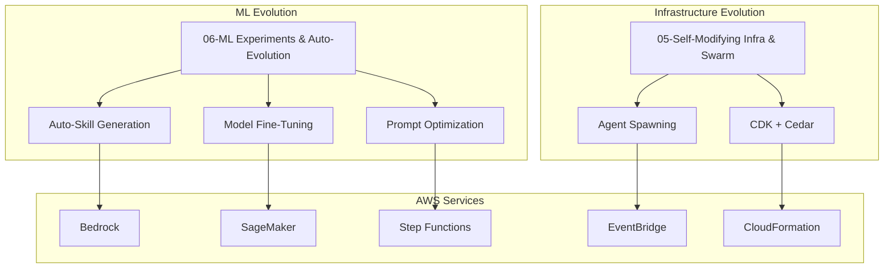

---
tags:
  - research-rabbithole
  - chimera
  - aws
  - evolution
  - self-modifying
  - ml-experiments
date: 2026-03-19
topic: AWS Chimera Evolution Research
status: in_progress
project: AWS Chimera
---

# AWS Chimera Evolution Research Index

> **Session purpose:** Research self-evolving agent capabilities for AWS Chimera.
> Explore self-modifying infrastructure, self-expanding agent swarms, ML-driven
> continuous improvement, auto-skill generation, and autonomous experimentation.

---

## What This Research Covers

This research session explores the self-evolution capabilities that distinguish AWS Chimera
from traditional agent platforms. Two core areas:

1. **Self-Modifying Infrastructure & Swarms** — agents that can safely modify their own
   infrastructure and spawn new agents based on workload needs
2. **ML-Driven Autonomous Evolution** — agents that improve themselves through experimentation,
   fine-tuning, prompt optimization, and skill generation

### Evolution Documents

| # | Document | Status | Description |
|---|----------|--------|-------------|
| 5 | [[05-Self-Modifying-Infra-Swarm]] | In Progress | Self-modifying IaC patterns, self-expanding swarms, Cedar safety rails |
| 6 | [[06-ML-Experiments-Auto-Evolution]] | In Progress | Auto-skill generation, prompt A/B testing, Bedrock fine-tuning, Karpathy autoresearch |

## Key Capabilities

### Self-Modifying Infrastructure

- **Three-Layer IaC Model:** Platform (human), Tenant (agent-configurable), Skill (auto-generated)
- **Configuration-Driven CDK:** Agents modify YAML config files, not raw CDK code
- **Cedar Policy Constraints:** Safety rails preventing dangerous infrastructure changes
- **Audit & Rollback:** Every change tracked and reversible

### Self-Expanding Agent Swarms

- **Dynamic Agent Spawning:** Agents create new agents based on workload needs
- **Resource Management:** Auto-scaling with cost controls
- **Swarm Orchestration:** Coordinator patterns for distributed work
- **Communication Protocols:** Agent-to-agent messaging and coordination

### ML-Driven Evolution

- **Auto-Skill Generation:** Agents identify capability gaps and generate new skills
- **Prompt Optimization:** A/B testing and continuous prompt improvement
- **Model Routing:** Bayesian optimization for cost-effective model selection
- **Autonomous Experiments:** Karpathy autoresearch pattern with SageMaker/Bedrock

### Safety & Governance

- **Blast Radius Containment:** Infrastructure changes scoped to single tenant
- **Cost Controls:** Budget limits and automatic shutdowns
- **Human Oversight:** Critical changes require human approval
- **Rollback Mechanisms:** Automatic reversion on failure

## Suggested Reading Order

1. **Start with infrastructure:** [[05-Self-Modifying-Infra-Swarm]] — understand safe self-modification
2. **Then ML evolution:** [[06-ML-Experiments-Auto-Evolution]] — continuous improvement patterns

## Document Relationship Graph



## AWS Services Utilized

| Service | Purpose | Used In |
|---------|---------|---------|
| **CloudFormation** | Self-modifying infrastructure deployment | Infrastructure Evolution |
| **CodePipeline** | GitOps workflow for infrastructure changes | Infrastructure Evolution |
| **Cedar (Verified Permissions)** | Policy-based safety constraints | Infrastructure Evolution |
| **EventBridge** | Agent coordination and workflow triggers | Both |
| **Step Functions** | ML experiment orchestration | ML Evolution |
| **Bedrock** | LLM fine-tuning and custom models | ML Evolution |
| **SageMaker** | ML experiment tracking and training | ML Evolution |
| **DynamoDB** | Audit trail, versioning, state management | Both |
| **S3** | Configuration snapshots, model artifacts | Both |

## Implementation Patterns

### Self-Modification Workflow

```
Agent identifies need → Proposes YAML config change → Cedar validates →
Creates PR → Pipeline deploys → Monitors health → Rollback if needed
```

### Skill Generation Workflow

```
Gap detected → Agent designs skill → Generates code → Tests in sandbox →
Human review (if flagged) → Deploy to skill library → Available to tenants
```

### Experiment Workflow

```
Agent proposes experiment → Step Functions orchestrates → Bedrock/SageMaker executes →
Results analyzed → Knowledge integrated → Deployed if successful
```

## Safety Considerations

| Risk | Mitigation |
|------|-----------|
| **Runaway infrastructure costs** | Cedar policies + AWS Budgets + hard limits |
| **Breaking changes** | Dry-run previews + cost estimates + health checks |
| **Harmful skill generation** | Sandboxed testing + code analysis + human review gates |
| **Model drift** | Continuous monitoring + automatic rollback thresholds |
| **Security vulnerabilities** | Static analysis + penetration testing + least-privilege IAM |

## Related Research

- [[04-Self-Modifying-IaC-Patterns]] (enhancement series) — foundational IaC patterns
- [[ClawCore-Self-Evolution-Engine]] (architecture reviews) — full evolution engine design
- [[05-Strands-Advanced-Memory-MultiAgent]] (agentcore-strands) — multi-agent coordination

## Next Steps

1. **Complete research documents** — flesh out sections with technical details
2. **Design experiment infrastructure** — Step Functions + SageMaker + Bedrock integration
3. **Build self-modification pipeline** — Cedar policies + CDK + CodePipeline
4. **Prototype auto-skill generation** — skill template + testing framework
5. **Create evaluation metrics** — measure evolution effectiveness

## Research Metadata

- **Date:** 2026-03-19
- **Agent:** evo-infra-swarm (builder)
- **Task:** chimera-0382
- **Parent:** lead-self-evolution
- **Status:** In Progress
- **Documents:** 2 research documents + 1 index
- **Project:** AWS Chimera (self-evolving multi-tenant agent platform)

---

*Evolution research session started 2026-03-19.*
*Goal: Enable AWS Chimera to continuously improve itself through safe self-modification and ML-driven evolution.*
