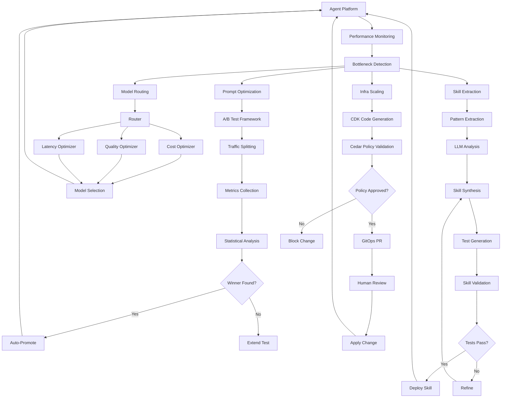
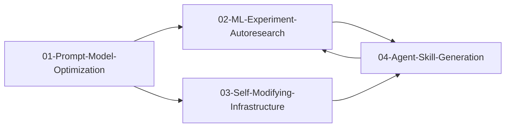

---
tags:
  - research-rabbithole
  - self-evolution
  - agent-platforms
  - aws
  - chimera
date: 2026-03-19
topic: Self-Evolving Agent Platform Research
status: complete
---

# Self-Evolution Research Index

## TL;DR

Research into self-improving agent capabilities for AWS Chimera:

- **Prompt A/B Testing** — Experimental frameworks for continuous prompt optimization with statistical significance tests, traffic splitting, auto-promotion
- **Model Routing** — Dynamic model selection based on cost/quality/latency tradeoffs, cascade patterns, ML-based routing
- **ML Autoresearch** — Karpathy-style autonomous experiment loops: hypothesis generation → experiment design → execution → analysis → learning application
- **Self-Modifying Infrastructure** — Agents editing CDK/Terraform with Cedar policy guardrails, GitOps safety patterns, drift detection
- **Agent Skill Generation** — Autonomous pattern extraction from sessions, LLM-based skill synthesis, test-driven validation, skill ecosystem management

## Key Highlights

> [!tip] Self-Optimization Flywheel
> Experiments → Learnings → Skills → Better Agents → More Complex Experiments. Each component feeds the next, creating compound improvements over time.

> [!info] Safety Rails Critical
> Unrestricted self-modification is dangerous. Use Cedar/OPA policies to constrain infrastructure changes, multi-armed bandits for prompt optimization, and approval gates for high-risk experiments.

> [!warning] Cost Controls Required
> Auto-experimentation can rack up AWS bills fast. Implement budgets, rate limits, kill switches, and cost anomaly detection before enabling autonomous optimization.

## Research Documents

| # | Document | Lines | Description |
|---|----------|------:|-------------|
| 1 | [[01-Prompt-Model-Optimization]] | 1,576 | A/B testing framework, model routing strategies, Step Functions orchestration, DynamoDB experiment state |
| 2 | [[02-ML-Experiment-Autoresearch]] | 2,373 | Karpathy autoresearch loop, SageMaker/Bedrock fine-tuning, evaluation loops, self-expanding agent swarms |
| 3 | [[03-Self-Modifying-Infrastructure]] | 1,159 | CDK self-edit patterns, Cedar policy guardrails, GitOps propose-review-merge, drift detection |
| 4 | [[04-Agent-Skill-Generation]] | 839 | Pattern extraction from sessions, LLM skill synthesis, test-driven validation, meta-learning |
| **Total** | | **5,947** | |

## Suggested Reading Order

1. **Start here:** [[01-Prompt-Model-Optimization]] — understand experimentation fundamentals
2. **ML experiments:** [[02-ML-Experiment-Autoresearch]] — deeper into autonomous research loops
3. **Infrastructure:** [[03-Self-Modifying-Infrastructure]] — how agents modify their own platform
4. **Skills:** [[04-Agent-Skill-Generation]] — how learnings become reusable capabilities

## Architecture Overview



## Key Patterns

### 1. Experiment-Driven Optimization

**Pattern:** Continuous A/B testing of prompts, models, and configurations.

**Implementation:**
- DynamoDB for experiment state
- CloudWatch for metrics
- Step Functions for orchestration
- Statistical tests (t-test, chi-square, Bayesian) for winner selection

**Safety:**
- Traffic allocation limits
- Kill switches on cost/latency/error rate
- Gradual rollout (50% → 90% → 100%)

### 2. Autoresearch Loop

**Pattern:** Agents autonomously design, execute, and learn from ML experiments.

**Implementation:**
- LLM generates hypotheses from performance data
- SageMaker/Bedrock for training
- Automated evaluation and promotion
- Knowledge base updated with learnings

**Safety:**
- Human approval gates for high-cost experiments
- Budget limits per experiment
- Sandbox environments for testing

### 3. Policy-Bounded Infrastructure Modification

**Pattern:** Agents propose infrastructure changes, policies validate, humans approve.

**Implementation:**
- Agent generates CDK code
- Cedar policies constrain allowed changes
- GitOps PR workflow for review
- Drift detection prevents unauthorized changes

**Safety:**
- Forbid deletions, database changes, production writes
- Cost budgets per change
- Rollback on health check failure

### 4. Skill Generation Flywheel

**Pattern:** Extract reusable patterns from successful agent sessions.

**Implementation:**
- Record all agent sessions
- Identify repeating action sequences (5+ occurrences)
- LLM analyzes pattern and generates skill
- Test-driven validation before deployment

**Safety:**
- Reusability score threshold (>7/10)
- Human review of generated skills
- Usage tracking and deprecation of low-usage skills

## AWS Services Used

| Service | Use Case | Cost Impact |
|---------|----------|-------------|
| **DynamoDB** | Experiment state, skill registry, session logs | Low ($10-50/month) |
| **CloudWatch** | Metrics, alarms, logs | Low ($20-100/month) |
| **Step Functions** | Experiment orchestration | Low ($5-20/month) |
| **SageMaker** | Training jobs, hyperparameter tuning | High ($100-1000+/month) |
| **Bedrock** | Fine-tuning, evaluations, inference | Medium ($50-500/month) |
| **Lambda** | Experiment analysis, skill synthesis | Low ($10-30/month) |
| **S3** | Training data, model artifacts, logs | Low ($20-50/month) |
| **Cedar** | Policy validation (open-source) | Free |
| **SNS** | Alerts, approvals | Low ($5-10/month) |

**Total Estimated:** $220-1760/month depending on experiment volume.

## Production Considerations

### Cost Controls

```typescript
const costLimits = {
  maxConcurrentExperiments: 5,
  maxExperimentsPerDay: 20,
  maxCostPerExperiment: 100, // USD
  maxDailyCost: 500, // USD
  requireApprovalAbove: 100 // USD
};
```

### Monitoring

```typescript
// Key metrics to track
const metrics = [
  "prompt_experiment_count",
  "prompt_experiment_cost",
  "model_routing_latency_p99",
  "skill_generation_rate",
  "skill_usage_count",
  "infra_change_count",
  "infra_drift_detected"
];
```

### Safety Gates

```typescript
// Conditions that pause self-modification
const killSwitches = {
  errorRateAbove: 0.05, // 5%
  costRateAbove: 1000, // $1000/hour
  driftDetected: true,
  humanOverride: false // SSM parameter
};
```

## Integration Example

### Full Self-Evolution Stack

```typescript
async function enableSelfEvolution() {
  // 1. Enable prompt optimization
  await startPromptOptimization({
    taskTypes: ["code_generation", "research", "reasoning"],
    testDuration: 86400, // 24 hours
    minSampleSize: 1000
  });

  // 2. Enable model routing
  await enableModelRouter({
    strategy: "cost-aware",
    fallbackModel: "anthropic.claude-sonnet-4-5-v2:0",
    costBudget: 0.50 // $0.50 per request max
  });

  // 3. Enable autoresearch
  await startAutoresearch({
    checkInterval: 3600, // 1 hour
    approvalRequired: true,
    maxCostPerExperiment: 100
  });

  // 4. Enable skill generation
  await startSkillGeneration({
    minPatternFrequency: 5,
    minReusabilityScore: 7,
    autoDeploySkills: false // require PR approval
  });

  // 5. Enable infrastructure self-modification
  await enableInfraSelfModify({
    policyStoreId: "policy-store-123",
    gitOpsMode: "propose-review-merge",
    allowedResources: ["ECS", "Lambda", "DynamoDB"]
  });
}
```

---

## Next Steps

1. **Phase 1: Experimentation** — Implement prompt A/B testing and model routing
2. **Phase 2: ML Autoresearch** — Add autonomous experiment loops
3. **Phase 3: Infrastructure** — Enable self-modifying infrastructure with Cedar
4. **Phase 4: Skill Generation** — Extract and deploy skills automatically
5. **Phase 5: Meta-Learning** — Agents improve their own learning process

---

## Key Links

| Resource | URL |
|----------|-----|
| AWS SageMaker | docs.aws.amazon.com/sagemaker/ |
| AWS Bedrock | docs.aws.amazon.com/bedrock/ |
| AWS Step Functions | docs.aws.amazon.com/step-functions/ |
| AWS Cedar | cedarpolicy.com |
| AWS CDK | docs.aws.amazon.com/cdk/ |
| Multi-Armed Bandits | en.wikipedia.org/wiki/Multi-armed_bandit |
| Bayesian A/B Testing | evanmiller.org/bayesian-ab-testing.html |

---

## Document Relationship Graph



---

## Research Metadata

- **Date:** 2026-03-19
- **Agent:** evo-experiments (builder)
- **Total Lines:** 5,947
- **Documents:** 4
- **Task:** chimera-0382 (Self-Evolution Research)
- **Status:** Complete
