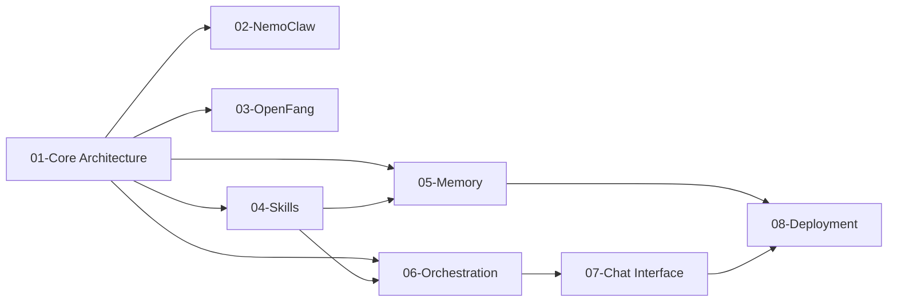

---
tags:
  - research-rabbithole
  - openclaw
  - nemoclaw
  - openfang
  - ai-agents
  - mcp
date: 2026-03-19
topic: OpenClaw, NemoClaw, and OpenFang
status: complete
---

# OpenClaw / NemoClaw / OpenFang Research Index

## TL;DR

Three related but architecturally distinct AI agent platforms:

- **OpenClaw** — The original open-source AI coding agent (325K+ stars). Hub-and-spoke architecture with Node.js Gateway, Pi minimal runtime (4 tools), and ClawHub skill marketplace (13,700+ skills). Created by Peter Steinberger, acqui-hired by OpenAI (Feb 2026).
- **NemoClaw** — NVIDIA's enterprise security wrapper (not a fork). An OpenClaw plugin for OpenShell that adds Landlock LSM + seccomp kernel isolation, deny-by-default policies, Gretel differential privacy, and Nemotron model routing (4B-253B). Announced GTC 2026.
- **OpenFang** — Clean-room Rust reimplementation. 14 crates, 137K LOC, single 32MB binary. "Agent OS" paradigm where agents are OS processes. 180ms cold start, 16 security layers, WASM sandbox. Created by Jaber (RightNow AI).

## Key Highlights

> [!tip] Architecture Insight
> The relationship triangle: OpenClaw = personal assistant platform, NemoClaw = enterprise security wrapper around OpenClaw, OpenFang = independent Agent OS inspired by OpenClaw's vision but built from scratch in Rust.

> [!warning] Security — ClawHavoc Incident
> Jan-Mar 2026: 1,184+ malicious skills uploaded to ClawHub. 3 CVEs issued. This incident directly motivated NemoClaw's OpenShell sandbox and OpenFang's WASM isolation. Critical lesson for any skill marketplace design.

> [!info] Performance Comparison
> OpenClaw: 6s cold start, 394MB RAM, 500MB binary
> OpenFang: 180ms cold start, 40MB RAM, 32MB binary, 16 security layers

## Research Documents

| # | Document | Lines | Description |
|---|----------|------:|-------------|
| 1 | [[01-OpenClaw-Core-Architecture]] | 1,014 | Core architecture, Pi runtime, agent loop, MCP integration, ClawHub, ecosystem |
| 2 | [[02-NemoClaw-NVIDIA-Fork]] | 988 | NVIDIA OpenShell, privacy router, Nemotron models, enterprise security |
| 3 | [[03-OpenFang-Community-Fork]] | 1,018 | Rust reimplementation, Agent OS paradigm, Hands system, WASM sandbox |
| 4 | [[04-Skill-System-Tool-Creation]] | 603 | ClawHub registry, SKILL.md format, MCP-as-skills, ClawHavoc incident |
| 5 | [[05-Memory-Persistence-Self-Improvement]] | 700 | Semantic memory search, MEMORY.md, self-improvement loops, 7+ backends |
| 6 | [[06-Multi-Agent-Orchestration]] | 572 | Lane Queue, subagent spawning, inter-agent communication, Lobster pipelines |
| 7 | [[07-Chat-Interface-Multi-Platform]] | 1,483 | Gateway daemon, 23+ channels, streaming modes, OpenResponses API |
| 8 | [[08-Deployment-Infrastructure-Self-Editing]] | 613 | Docker deployment, self-hosting, self-editing, managed platforms |
| **Total** | | **6,991** | |

## Suggested Reading Order

1. **Start here:** [[01-OpenClaw-Core-Architecture]] — understand the foundation
2. **Then:** [[02-NemoClaw-NVIDIA-Fork]] and [[03-OpenFang-Community-Fork]] — see how it evolved
3. **Deep dives:** [[04-Skill-System-Tool-Creation]] → [[05-Memory-Persistence-Self-Improvement]] → [[06-Multi-Agent-Orchestration]]
4. **Infrastructure:** [[07-Chat-Interface-Multi-Platform]] → [[08-Deployment-Infrastructure-Self-Editing]]

## Key Links

| Resource | URL |
|----------|-----|
| OpenClaw GitHub | github.com/anthropics/openclaw |
| NemoClaw GitHub | github.com/NVIDIA/NemoClaw |
| OpenFang GitHub | github.com/RightNowAI/OpenFang |
| ClawHub | clawhub.dev |
| OpenClaw Docs | docs.openclaw.dev |
| NVIDIA OpenShell | github.com/NVIDIA/OpenShell |

## Document Relationship Graph

## Research Metadata

- **Date:** 2026-03-19
- **Agents:** 8 research agents (first wave) + 4 replacement agents (second wave)
- **Total lines:** 6,991
- **Documents:** 8
- **Duration:** ~60 minutes
- **Team:** agent-platform-research
