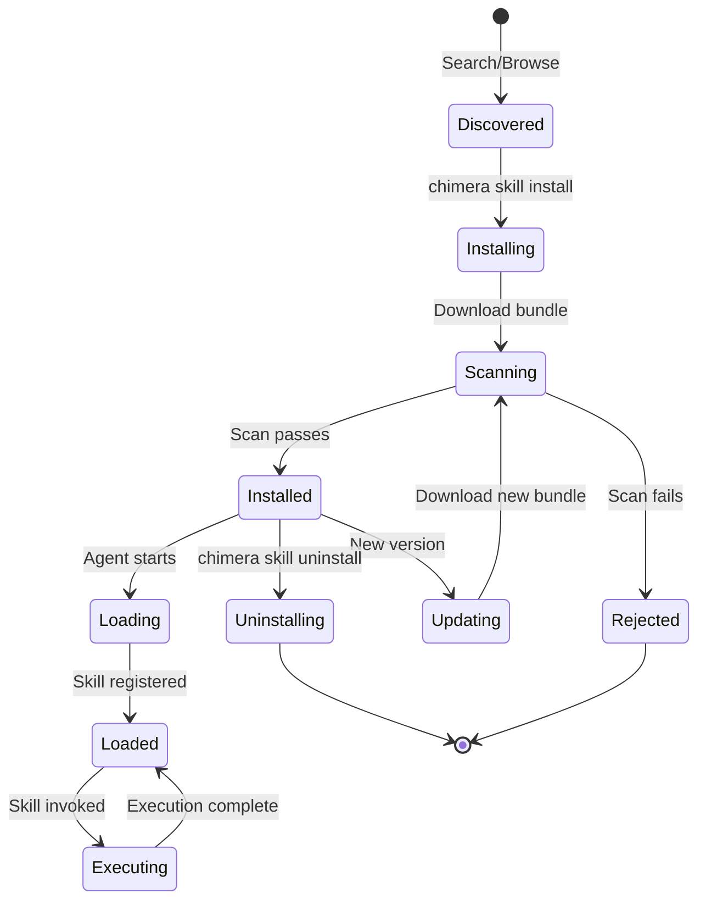
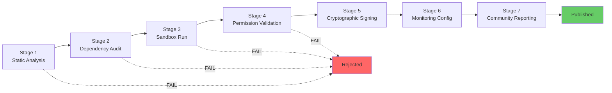
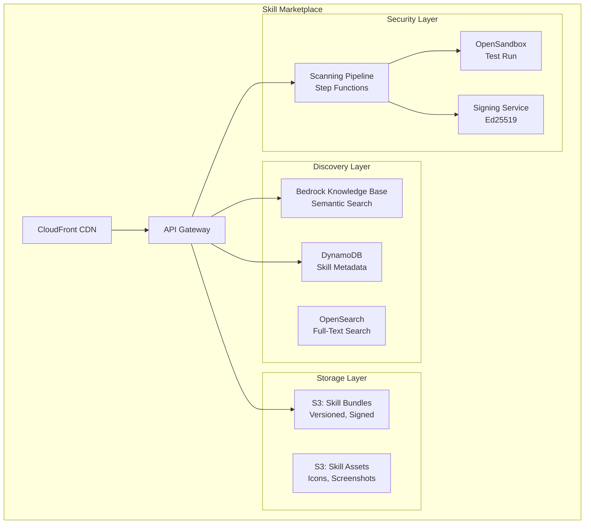
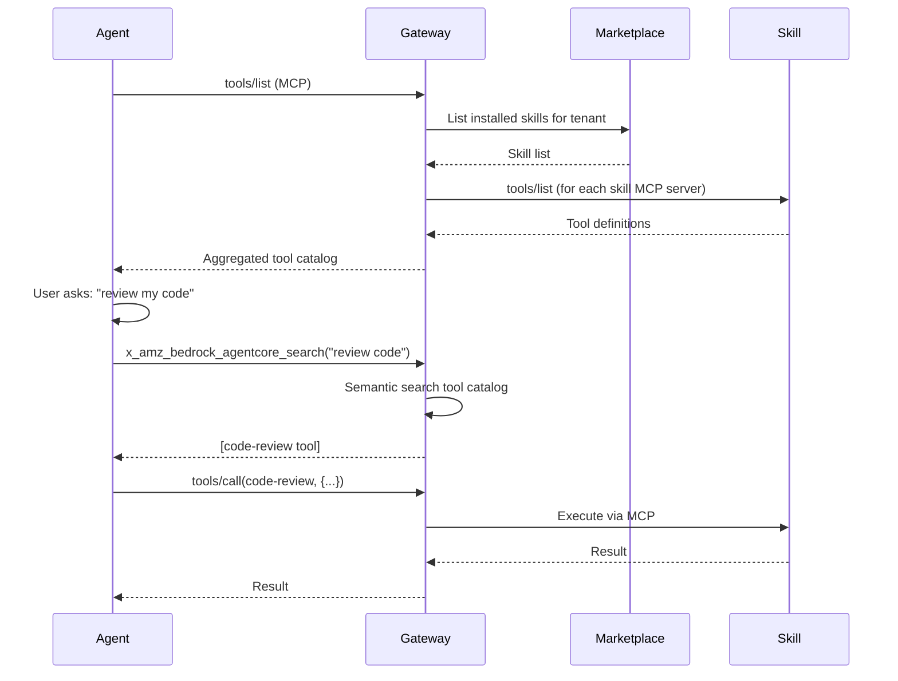

# Chimera Universal Skill Compatibility Layer & Marketplace

> **Research Date:** 2026-03-19
> **Status:** Design Complete
> **Purpose:** Architecture for universal skill compatibility across OpenClaw, Claude Code, MCP, Strands, and native Chimera skills

---

## Table of Contents

- [[#Executive Summary]]
- [[#ChimeraSkill Universal Interface]]
- [[#Adapter Architecture]]
- [[#Skill Lifecycle Management]]
- [[#Security Model (7-Stage, 5-Tier)]]
- [[#Marketplace Architecture]]
- [[#AgentCore Gateway Integration]]
- [[#Semantic Tool Discovery]]
- [[#Implementation Guide]]
- [[#Comparison Matrix]]

---

## Executive Summary

Chimera achieves universal skill compatibility through a **thin adapter layer** that normalizes disparate skill formats into a unified `ChimeraSkill` interface. This design enables:

- **Native execution** of OpenClaw SKILL.md (v1 and v2)
- **Direct compatibility** with Claude Code skills
- **MCP tool wrapping** via AgentCore Gateway targets
- **Strands @tool integration** via Python/TypeScript SDKs
- **Secure marketplace** with 7-stage scanning and 5-tier trust model

The architecture is inspired by successful patterns from ClawCore's skill ecosystem design, enhanced with AWS-native security and observability.

### Key Design Principles

1. **Adapter-based, not fork-based**: Convert formats, don't reinvent them
2. **Security from day one**: Learn from ClawHavoc incident
3. **MCP-first execution**: Skills as MCP servers, not just prompts
4. **AgentCore native**: Lambda isolation, IAM auth, CloudTrail audit
5. **Semantic discovery**: Bedrock Knowledge Bases for natural language search

---

## ChimeraSkill Universal Interface

The `ChimeraSkill` interface is the normalized internal representation all adapters produce.

### TypeScript/Python Schema

```typescript
interface ChimeraSkill {
  // === Identity ===
  id: string                    // Unique identifier (UUID or slug)
  name: string                  // Display name
  version: string               // Semver (e.g., "1.2.0")
  author: string                // Author tenant ID or username
  license?: string              // SPDX identifier (default: proprietary)

  // === Discovery ===
  description: string           // One-line summary
  longDescription?: string      // Multi-paragraph explanation
  category: SkillCategory       // Fixed taxonomy
  tags: string[]                // Free-form tags
  triggers?: string[]           // Keywords that suggest this skill

  // === Content ===
  instructions: string          // Markdown body (agent instructions)
  systemPromptAddition?: string // Optional system prompt injection

  // === Tools & Capabilities ===
  tools: ToolDefinition[]       // MCP tool definitions this skill provides
  requiredTools?: string[]      // External tools this skill needs
  mcpServerConfig?: MCPServerConfig  // If skill is an MCP server

  // === Permissions (Cedar-compatible) ===
  permissions: {
    filesystem?: {
      read?: string[]           // Glob patterns
      write?: string[]          // Glob patterns
    }
    network?: boolean | {
      endpoints?: string[]      // Allowed URLs/domains
    }
    shell?: {
      allowed?: string[]        // Permitted commands
      denied?: string[]         // Explicitly blocked commands
    }
    memory?: {
      read?: boolean
      write?: string[]          // Memory categories
    }
    secrets?: string[]          // Secret paths (e.g., "/chimera/tenant-*/api-key")
  }

  // === Dependencies ===
  dependencies: {
    skills?: string[]           // Other skill IDs
    mcpServers?: {
      name: string
      optional: boolean
    }[]
    packages?: {
      pip?: string[]
      npm?: string[]
    }
    binaries?: string[]
    envVars?: {
      required?: string[]
      optional?: string[]
    }
  }

  // === Testing ===
  tests?: {
    model?: string              // Model to use for tests
    cases: TestCase[]
  }

  // === Metadata ===
  trustLevel: TrustLevel        // platform | verified | community | private | experimental
  source: SkillSource           // openclaw | claudecode | mcp | strands | native
  sourceMetadata?: Record<string, unknown>  // Original format metadata
  createdAt: string             // ISO 8601 timestamp
  updatedAt: string             // ISO 8601 timestamp
  deprecated?: boolean
  deprecationMessage?: string

  // === Marketplace ===
  downloadCount?: number
  installCount?: number
  rating?: {
    average: number             // 1-5
    count: number
  }
  bundle?: {
    s3Key: string
    sha256: string
    size: number
  }
  signatures?: {
    author: string              // Ed25519 signature
    platform?: string           // Platform co-signature
  }
}

// === Supporting Types ===
type TrustLevel = "platform" | "verified" | "community" | "private" | "experimental"

type SkillCategory =
  | "developer-tools"
  | "communication"
  | "productivity"
  | "data-analysis"
  | "security"
  | "cloud-ops"
  | "knowledge"
  | "creative"
  | "integration"
  | "automation"

type SkillSource = "openclaw" | "claudecode" | "mcp" | "strands" | "native"

interface ToolDefinition {
  name: string
  description: string
  inputSchema: {
    type: "object"
    properties: Record<string, JSONSchemaProperty>
    required?: string[]
  }
}

interface MCPServerConfig {
  transport: "stdio" | "streamable-http"
  command?: string
  args?: string[]
  endpoint?: string
  tools: ToolDefinition[]
}

interface TestCase {
  name: string
  input: string
  expect: {
    toolCalls?: string[]
    outputContains?: string[]
    outputNotContains?: string[]
  }
}
```

---

## Adapter Architecture

Each skill format has a dedicated adapter that converts to `ChimeraSkill`.

### Adapter Interface

```typescript
interface SkillAdapter<TSource> {
  // Parse source format into ChimeraSkill
  parse(source: TSource): Promise<ChimeraSkill>

  // Validate source format
  validate(source: TSource): Promise<ValidationResult>

  // Synthesize missing fields (e.g., infer permissions from instructions)
  synthesize(skill: ChimeraSkill): Promise<ChimeraSkill>
}
```

### OpenClawSkillAdapter

Converts OpenClaw SKILL.md (v1 and v2) to ChimeraSkill.

```typescript
class OpenClawSkillAdapter implements SkillAdapter<string> {
  async parse(markdown: string): Promise<ChimeraSkill> {
    const { frontmatter, body } = parseMarkdown(markdown)

    // Extract v1/v2 frontmatter
    const skill: ChimeraSkill = {
      id: frontmatter.name,
      name: frontmatter.name,
      version: frontmatter.version,
      author: frontmatter.author,
      description: frontmatter.description,
      tags: frontmatter.tags || [],
      category: this.mapCategory(frontmatter.tags),
      instructions: body,
      tools: this.extractTools(frontmatter),
      permissions: this.convertPermissions(frontmatter.permissions),
      dependencies: this.convertDependencies(frontmatter.dependencies),
      tests: frontmatter.tests,
      trustLevel: frontmatter.trust_level || "community",
      source: "openclaw",
      sourceMetadata: {
        originalFormat: frontmatter.mcp_server ? "v2" : "v1"
      },
      createdAt: new Date().toISOString(),
      updatedAt: new Date().toISOString()
    }

    // If v2 with MCP server config
    if (frontmatter.mcp_server) {
      skill.mcpServerConfig = {
        transport: frontmatter.mcp_server.transport,
        command: frontmatter.mcp_server.command,
        args: frontmatter.mcp_server.args,
        tools: frontmatter.mcp_server.tools
      }
    }

    return skill
  }

  private convertPermissions(openclaw: any): ChimeraSkill["permissions"] {
    // OpenClaw v1: simple string array
    // OpenClaw v2: structured object
    if (Array.isArray(openclaw)) {
      // v1 format: ["filesystem: read", "network: outbound"]
      return this.parseV1Permissions(openclaw)
    }
    // v2 format: direct mapping
    return openclaw
  }

  async synthesize(skill: ChimeraSkill): Promise<ChimeraSkill> {
    // Infer missing permissions from instructions
    if (!skill.permissions.filesystem) {
      const instructions = skill.instructions.toLowerCase()
      if (instructions.includes("read") || instructions.includes("file")) {
        skill.permissions.filesystem = { read: ["**/*"] }
      }
    }
    return skill
  }
}
```

### ClaudeCodeSkillAdapter

Converts Claude Code skills to ChimeraSkill.

```typescript
class ClaudeCodeSkillAdapter implements SkillAdapter<string> {
  async parse(markdown: string): Promise<ChimeraSkill> {
    const { frontmatter, body } = parseMarkdown(markdown)

    return {
      id: frontmatter.name,
      name: frontmatter.name,
      version: frontmatter.version || "1.0.0",
      author: frontmatter.author || "claude-code",
      description: frontmatter.description,
      longDescription: frontmatter.when,
      tags: frontmatter.tags || [],
      triggers: frontmatter.triggers,
      category: this.inferCategory(frontmatter.tags, frontmatter.triggers),
      instructions: body,
      tools: [],  // Claude Code skills don't define tools
      requiredTools: frontmatter.tools_allowed,
      permissions: this.inferPermissions(body, frontmatter),
      trustLevel: "community",  // User-installed plugin
      source: "claudecode",
      sourceMetadata: {
        hookType: frontmatter.hook_type,
        appliesTo: frontmatter.applies_to,
        requiresConfirmation: frontmatter.requires_confirmation
      },
      createdAt: new Date().toISOString(),
      updatedAt: new Date().toISOString()
    }
  }

  private inferPermissions(body: string, frontmatter: any): ChimeraSkill["permissions"] {
    // Scan body for tool usage patterns
    const permissions: ChimeraSkill["permissions"] = {}

    if (body.match(/Read|read.*file/i)) {
      permissions.filesystem = { read: ["**/*"] }
    }
    if (body.match(/Write|write.*file|Edit/i)) {
      permissions.filesystem = {
        ...permissions.filesystem,
        write: ["/tmp/**", "**/*.tmp"]
      }
    }
    if (body.match(/Bash|execute.*command|run.*command/i)) {
      permissions.shell = { allowed: ["*"] }
    }

    return permissions
  }
}
```

### MCPServerAdapter

Wraps MCP servers as ChimeraSkills.

```typescript
class MCPServerAdapter implements SkillAdapter<MCPServerDefinition> {
  async parse(def: MCPServerDefinition): Promise<ChimeraSkill> {
    // Connect to MCP server and fetch tool list
    const client = await this.connectMCP(def)
    const tools = await client.listTools()

    return {
      id: `mcp-${def.name}`,
      name: def.name,
      version: def.version || "1.0.0",
      author: def.author || "mcp-community",
      description: `MCP server providing ${tools.length} tools`,
      longDescription: def.description,
      category: "integration",
      tags: ["mcp", "tools"],
      instructions: this.generateInstructions(tools),
      tools: tools.map(t => ({
        name: t.name,
        description: t.description,
        inputSchema: t.inputSchema
      })),
      mcpServerConfig: {
        transport: def.transport,
        command: def.command,
        args: def.args,
        endpoint: def.endpoint,
        tools: tools
      },
      permissions: this.inferPermissionsFromTools(tools),
      trustLevel: "community",
      source: "mcp",
      sourceMetadata: { mcpProtocolVersion: "2025-03-26" },
      createdAt: new Date().toISOString(),
      updatedAt: new Date().toISOString()
    }
  }

  private generateInstructions(tools: MCPTool[]): string {
    return `# ${tools[0].name} MCP Server

This skill provides the following tools:

${tools.map(t => `## ${t.name}\n${t.description}\n`).join('\n')}

Use these tools when the user needs the functionality they provide.
`
  }
}
```

### StrandsToolAdapter

Converts Strands `@tool` decorated functions to ChimeraSkills.

```typescript
class StrandsToolAdapter implements SkillAdapter<StrandsTool> {
  async parse(tool: StrandsTool): Promise<ChimeraSkill> {
    // Extract from @tool decorator metadata
    const spec = tool.__tool_spec__

    return {
      id: `strands-${spec.name}`,
      name: spec.name,
      version: "1.0.0",
      author: "strands-community",
      description: spec.description,
      category: this.inferCategory(spec.name, spec.description),
      tags: ["strands", "tool"],
      instructions: this.generateInstructions(spec),
      tools: [{
        name: spec.name,
        description: spec.description,
        inputSchema: spec.inputSchema
      }],
      permissions: this.inferFromSchema(spec.inputSchema),
      trustLevel: "community",
      source: "strands",
      sourceMetadata: {
        pythonFunction: tool.__name__,
        moduleQualifiedName: tool.__module__
      },
      createdAt: new Date().toISOString(),
      updatedAt: new Date().toISOString()
    }
  }

  private generateInstructions(spec: ToolSpec): string {
    return `# ${spec.name}

${spec.description}

## Parameters
${Object.entries(spec.inputSchema.properties).map(([key, prop]) =>
  `- **${key}**: ${prop.description || prop.type}`
).join('\n')}

Use this tool when the user requests: ${spec.description.toLowerCase()}
`
  }
}
```

---

## Skill Lifecycle Management

Chimera manages skills through a standard lifecycle from installation to execution.

### Lifecycle States



### CLI Commands

```bash
# Discovery
chimera skill search "review code for security"
chimera skill browse --category developer-tools
chimera skill show code-review

# Installation
chimera skill install code-review
chimera skill install code-review@2.1.0
chimera skill install --source openclaw code-review
chimera skill install --source claudecode my-workflow-skill

# Management
chimera skill list
chimera skill update code-review
chimera skill update --all
chimera skill pin code-review@2.1.0
chimera skill uninstall code-review

# Publishing
chimera skill create my-skill --template tool-skill
chimera skill test my-skill
chimera skill publish my-skill --marketplace

# Compatibility
chimera skill migrate-openclaw ~/.openclaw/skills/my-skill
chimera skill import-claudecode ~/.claude/plugins/my-plugin/skills/
```

### Skill Loader

```typescript
class ChimeraSkillLoader {
  private adapters: Map<SkillSource, SkillAdapter<any>> = new Map([
    ["openclaw", new OpenClawSkillAdapter()],
    ["claudecode", new ClaudeCodeSkillAdapter()],
    ["mcp", new MCPServerAdapter()],
    ["strands", new StrandsToolAdapter()]
  ])

  async loadSkill(source: SkillSource, raw: unknown): Promise<ChimeraSkill> {
    const adapter = this.adapters.get(source)
    if (!adapter) throw new Error(`No adapter for source: ${source}`)

    // Parse
    let skill = await adapter.parse(raw)

    // Validate
    const validation = await adapter.validate(raw)
    if (!validation.valid) throw new Error(validation.errors.join(", "))

    // Synthesize missing fields
    skill = await adapter.synthesize(skill)

    // Register with skill registry
    await this.registry.register(skill)

    return skill
  }

  async loadFromMarketplace(skillId: string, version?: string): Promise<ChimeraSkill> {
    // Fetch from S3
    const bundle = await this.marketplace.download(skillId, version)

    // Verify signatures
    await this.verifySignatures(bundle)

    // Determine source format
    const source = this.detectSource(bundle)

    // Load via adapter
    return this.loadSkill(source, bundle.content)
  }
}
```

---

## Security Model (7-Stage, 5-Tier)

Chimera learns from ClawHavoc by implementing comprehensive security from day one.

### 7-Stage Scanning Pipeline

Every marketplace skill passes through all seven stages:



#### Stage 1: Static Analysis

Scan skill content and tool code for dangerous patterns:

- **SKILL.md / instructions**: Prompt injection attempts, base64-encoded payloads
- **Python/TypeScript code**: AST analysis for subprocess calls, network access, file operations
- **Dependencies**: Known-malicious package names

#### Stage 2: Dependency Audit

Check all dependencies against vulnerability databases:

```python
def audit_dependencies(skill: ChimeraSkill) -> List[Advisory]:
    advisories = []

    # Check pip packages
    for pkg in skill.dependencies.packages.pip or []:
        vulns = query_osv(ecosystem="PyPI", package=pkg)
        advisories.extend(vulns)

    # Check npm packages
    for pkg in skill.dependencies.packages.npm or []:
        vulns = query_osv(ecosystem="npm", package=pkg)
        advisories.extend(vulns)

    # Check binaries against approved list
    for binary in skill.dependencies.binaries or []:
        if binary not in APPROVED_BINARIES:
            advisories.append({
                "binary": binary,
                "severity": "medium",
                "message": "Unapproved binary"
            })

    return advisories
```

#### Stage 3: Sandbox Run

Execute tests in OpenSandbox MicroVM with full syscall logging:

```python
sandbox = OpenSandbox(
    network=False,
    filesystem_allow=["/tmp/*"],
    memory_mb=512,
    timeout_seconds=60,
    syscall_log=True
)

for test_case in skill.tests.cases:
    result = sandbox.run_skill(
        instructions=skill.instructions,
        user_input=test_case.input,
        tools=skill.tools
    )

    # Compare actual syscalls against declared permissions
    violations = compare_permissions(
        declared=skill.permissions,
        actual=result.syscall_log
    )

    if violations:
        raise SecurityViolation(f"Undeclared access: {violations}")
```

#### Stage 4: Permission Validation

Ensure declared permissions are a superset of actual behavior:

```typescript
function validatePermissions(
  declared: ChimeraSkill["permissions"],
  actual: SyscallLog
): ValidationResult {
  const violations = []

  // Check filesystem access
  for (const fileAccess of actual.fileAccesses) {
    const allowed = declared.filesystem?.read?.some(pattern =>
      minimatch(fileAccess.path, pattern)
    )
    if (!allowed) {
      violations.push(`Undeclared file read: ${fileAccess.path}`)
    }
  }

  // Check network access
  if (actual.networkCalls.length > 0 && !declared.network) {
    violations.push("Undeclared network access")
  }

  // Check shell commands
  for (const cmd of actual.shellCommands) {
    const allowed = declared.shell?.allowed?.includes(cmd.command) ||
                    declared.shell?.allowed?.includes("*")
    if (!allowed) {
      violations.push(`Undeclared command: ${cmd.command}`)
    }
  }

  return {
    valid: violations.length === 0,
    violations
  }
}
```

#### Stage 5: Cryptographic Signing

Dual-signature chain establishes provenance:

```python
# Author signs bundle
author_sig = ed25519_sign(author_private_key, sha256(bundle))

# Platform verifies scan results and co-signs
platform_sig = ed25519_sign(
    platform_key,
    sha256(bundle + author_sig + scan_report)
)

# Store signatures
save_signatures(skill_id, {
    "author": author_sig,
    "platform": platform_sig,
    "scan_report_hash": sha256(scan_report)
})
```

At install time, both signatures are verified:

```python
# Verify author signature
verify(author_public_key, author_sig, sha256(bundle))

# Verify platform signature
verify(
    platform_public_key,
    platform_sig,
    sha256(bundle + author_sig + scan_report)
)
```

#### Stage 6: Runtime Monitoring Configuration

Auto-generate CloudWatch alarms based on test behavior:

```yaml
monitoring:
  anomaly_detection:
    max_tool_calls_per_session: 50       # 3x observed test maximum
    max_network_endpoints: 0             # Based on declared permissions
    max_file_writes_per_session: 10      # 3x observed test maximum
  alerts:
    permission_violation: critical
    anomaly_threshold_exceeded: high
    error_rate_spike: medium
```

#### Stage 7: Community Reporting

Post-publication monitoring system:

```bash
# Report suspicious skill
chimera skill report code-review \
  --reason "Attempts to read ~/.aws/credentials" \
  --evidence screenshot.png

# Report flow:
# 1. Report logged to DynamoDB with reporter tenant ID
# 2. If reports > 3 from distinct tenants within 24h: auto-quarantine
# 3. Security team notified for investigation
# 4. If confirmed malicious: revoke signatures, notify all installers
```

### 5-Tier Trust Model

Skills are classified into five trust tiers with different execution contexts:

```
Tier 0: PLATFORM
  |  Built-in skills maintained by Chimera team
  |  Full access to all tools and memory
  |  Examples: file-io, shell, memory-manager
  |
Tier 1: VERIFIED
  |  Passed automated + human security review
  |  Runs with declared permissions (Cedar-enforced)
  |  Author key + platform co-signature
  |  Examples: code-review (by enterprise), aws-analyzer
  |
Tier 2: COMMUNITY
  |  Passed automated scanning only
  |  Runs in separate OpenSandbox MicroVM
  |  Network egress blocked by default
  |  Examples: json-formatter, weather-checker
  |
Tier 3: PRIVATE
  |  Tenant-authored, never published
  |  Runs per tenant's Cedar policies
  |  No platform review required
  |  Examples: acme-internal-workflow
  |
Tier 4: EXPERIMENTAL
  |  New/unreviewed skills
  |  Strictest isolation: no network, no memory, /tmp only
  |  Limited to 10 tool calls per session
  |  Dev/test only (blocked in production agents)
```

### Cedar Policy Enforcement

Each trust tier maps to Cedar policies:

```cedar
// === PLATFORM SKILLS ===
permit(
    principal in SkillTrustLevel::"platform",
    action,
    resource
);

// === VERIFIED SKILLS ===
permit(
    principal in SkillTrustLevel::"verified",
    action == Action::"file_read",
    resource
) when {
    principal.declaredPermissions.filesystem.read.contains(resource.path)
};

// === COMMUNITY SKILLS ===
permit(
    principal in SkillTrustLevel::"community",
    action in [Action::"file_read", Action::"file_write"],
    resource
) when {
    resource.path.startsWith("/tmp/")
};

forbid(
    principal in SkillTrustLevel::"community",
    action in [Action::"network_access", Action::"run_shell"],
    resource
);

// === EXPERIMENTAL SKILLS ===
permit(
    principal in SkillTrustLevel::"experimental",
    action in [Action::"file_read", Action::"file_write"],
    resource
) when {
    resource.path.startsWith("/tmp/") &&
    context.sessionToolCalls < 10
};
```

---

## Marketplace Architecture

Chimera's skill marketplace follows ClawCore's design with AWS-native implementation.

### Infrastructure Overview



### DynamoDB Schema

#### Skills Table

```
PK: SKILL#{name}
SK: VERSION#{semver}

Attributes:
- name (string)
- version (string)
- author (string)
- description (string)
- category (string)
- tags (string set)
- trust_level (string)
- bundle_s3_key (string)
- bundle_sha256 (string)
- author_signature (string)
- platform_signature (string)
- scan_status (string)
- download_count (number)
- rating_avg (number)
- rating_count (number)
- created_at (string)
- updated_at (string)

GSI-1: AUTHOR#{author} → SKILL#{name}
GSI-2: CATEGORY#{category} → DOWNLOADS#{padded_count}
GSI-3: TRUST#{trust_level} → UPDATED#{timestamp}
```

#### Skill Installs Table

```
PK: TENANT#{tenant_id}
SK: SKILL#{name}

Attributes:
- version (string)
- pinned (boolean)
- installed_at (string)
- installed_by (string)
- auto_update (boolean)
- last_used (string)
- use_count (number)
```

### S3 Bucket Structure

```
chimera-skill-bundles/
  skills/
    {name}/
      {version}/
        bundle.tar.gz          # Skill bundle (SKILL.md + tools/ + tests/)
        manifest.yaml          # Signed manifest
        scan-report.json       # Security scan results
  signatures/
    {name}/
      {version}/
        author.sig             # Ed25519 author signature
        platform.sig           # Ed25519 platform co-signature
```

### API Endpoints

| Endpoint | Method | Description |
|----------|--------|-------------|
| `/skills` | GET | List skills (paginated, filterable) |
| `/skills` | POST | Publish skill |
| `/skills/{name}` | GET | Get skill metadata |
| `/skills/{name}/versions` | GET | List versions |
| `/skills/{name}/versions/{ver}/bundle` | GET | Download skill bundle |
| `/skills/{name}/install` | POST | Install skill for tenant |
| `/skills/{name}/uninstall` | POST | Uninstall skill |
| `/skills/{name}/reviews` | GET/POST | List/submit reviews |
| `/skills/search` | POST | Semantic + full-text search |
| `/skills/scan` | POST | Trigger security scan |

---

## AgentCore Gateway Integration

Chimera skills integrate with AgentCore Gateway for tool routing and discovery.

### Skills as Gateway Targets

Each skill with tools is registered as a Gateway target:

```typescript
// Register skill as MCP server target
async function registerSkillWithGateway(
  tenantId: string,
  skill: ChimeraSkill
): Promise<void> {
  if (!skill.mcpServerConfig) return

  await gatewayClient.createTarget({
    gatewayId: `chimera-marketplace-${tenantId}`,
    targetName: `skill-${skill.id}`,
    targetConfiguration: {
      mcp: {
        mcpServer: {
          endpoint: skill.mcpServerConfig.endpoint ||
            `chimera://skill/${skill.id}/mcp`,
          toolSchema: {
            inlinePayload: skill.tools
          }
        }
      }
    },
    credentialProviderConfigurations: [],
    cedarPolicySet: generateCedarPolicies(skill)
  })

  // Enable semantic search
  await gatewayClient.updateGateway({
    gatewayId: `chimera-marketplace-${tenantId}`,
    protocolConfiguration: {
      mcp: {
        searchType: "SEMANTIC"
      }
    }
  })
}
```

### Tool Discovery Flow



---

## Semantic Tool Discovery

Chimera uses Bedrock Knowledge Bases for semantic skill discovery.

### Embedding Strategy

```python
# Embed each skill for semantic search
async def embed_skill(skill: ChimeraSkill) -> EmbeddingDocument:
    # Concatenate all searchable text
    text = f"""
    {skill.name}
    {skill.description}
    {skill.longDescription or ""}
    {" ".join(skill.tags)}
    {" ".join(skill.triggers or [])}

    # Tool names and descriptions
    {" ".join([f"{t.name}: {t.description}" for t in skill.tools])}

    # Instructions (first 500 chars)
    {skill.instructions[:500]}
    """

    # Generate embedding via Titan Embeddings V2
    embedding = await bedrock.invoke_model(
        modelId="amazon.titan-embed-text-v2:0",
        body={"inputText": text}
    )

    return {
        "skillId": skill.id,
        "text": text,
        "embedding": embedding["embedding"],
        "metadata": {
            "name": skill.name,
            "category": skill.category,
            "trustLevel": skill.trustLevel
        }
    }

# Ingest into Knowledge Base
await knowledge_base.ingest(embedding_document)
```

### Natural Language Search

```bash
# User searches for skills
chimera skill search "check my AWS costs and suggest savings"

# Backend: semantic search via Bedrock KB
results = knowledge_base.retrieve(
    query="check my AWS costs and suggest savings",
    max_results=10
)

# Results:
# 1. aws-cost-analyzer (score: 0.89)
# 2. cloud-cost-optimizer (score: 0.82)
# 3. billing-report-generator (score: 0.78)
```

---

## Implementation Guide

### Phase 1: Adapter Layer (Weeks 1-2)

**Deliverables:**
- `ChimeraSkill` TypeScript/Python interface
- `OpenClawSkillAdapter` (v1 and v2 support)
- `ClaudeCodeSkillAdapter`
- `MCPServerAdapter`
- `StrandsToolAdapter`
- Unit tests with real skill samples

**Dependencies:**
- YAML parser (js-yaml, PyYAML)
- Markdown parser (marked, python-markdown)
- JSON Schema validator

### Phase 2: Security Pipeline (Weeks 3-4)

**Deliverables:**
- Static analysis scanner (AST parsing for Python/TS)
- OSV dependency auditor
- OpenSandbox integration for test execution
- Permission validator
- Ed25519 signing service (AWS KMS-backed)
- Step Functions workflow for 7-stage pipeline

**Dependencies:**
- OSV API client
- OpenSandbox MicroVM orchestrator
- AWS KMS for cryptographic signing

### Phase 3: Marketplace (Weeks 5-6)

**Deliverables:**
- DynamoDB tables (skills, installs, reviews)
- S3 buckets (bundles, signatures)
- API Gateway endpoints (skill CRUD, search)
- Bedrock Knowledge Base integration
- CLI tool (`chimera skill` commands)
- Web UI (browse, install, review)

**Dependencies:**
- CDK stacks for infrastructure
- Bedrock Knowledge Bases setup
- CloudFront CDN configuration

### Phase 4: AgentCore Integration (Week 7)

**Deliverables:**
- Skill loader deployed as AgentCore Runtime
- Gateway target registration for skills
- Semantic tool discovery via Gateway
- AgentCore Memory integration for usage tracking
- End-to-end testing with Strands agents

**Dependencies:**
- AgentCore Runtime deployment pipeline
- Gateway API client
- Strands SDK integration

---

## Comparison Matrix

### Format Feature Matrix

| Feature | OpenClaw v1 | OpenClaw v2 | Claude Code | MCP | Strands | Chimera |
|---------|-------------|-------------|-------------|-----|---------|---------|
| **Markdown-based** | Yes | Yes | Yes | No | No | Yes |
| **Declarative permissions** | Partial | Yes | No | No | No | Yes |
| **Tool implementations** | No | Yes (MCP) | No | Yes | Yes | Yes |
| **Inline tests** | No | Yes | No | No | No | Yes |
| **Trust tiers** | No | Yes | No | No | No | Yes |
| **Dependency graph** | Basic | Full | No | No | No | Yes |
| **Marketplace** | ClawHub | ClawHub | Plugin repos | MCP registry | PyPI/npm | Native |
| **Semantic search** | Yes (OpenAI) | Yes | No | No | No | Yes (Bedrock) |
| **Security scanning** | Post-hoc | Pre-publish | None | None | None | Pre-publish |
| **Cryptographic signing** | No | Yes | No | No | No | Yes |

### Compatibility Support

| Source Format | Read | Write | Bidirectional |
|---------------|------|-------|---------------|
| OpenClaw SKILL.md v1 | ✓ | ✓ | ✓ |
| OpenClaw SKILL.md v2 | ✓ | ✓ | ✓ |
| Claude Code skill | ✓ | ✓ (with hook translation) | Partial |
| MCP server | ✓ (wrap) | N/A | N/A |
| Strands @tool | ✓ (wrap) | N/A | N/A |
| Chimera native | ✓ | ✓ | ✓ |

**Bidirectional notes:**
- **OpenClaw**: Chimera skills can be exported as SKILL.md v1/v2
- **Claude Code**: Chimera skills can be exported, but hook system differs
- **MCP/Strands**: These are execution formats, not specification formats

---

## Summary

Chimera achieves universal skill compatibility through:

1. **Thin adapter layer** that converts formats to unified `ChimeraSkill` interface
2. **7-stage security pipeline** that prevents ClawHavoc-style supply chain attacks
3. **5-tier trust model** with Cedar policy enforcement at runtime
4. **AWS-native marketplace** (DynamoDB, S3, Bedrock KB, AgentCore Gateway)
5. **Semantic discovery** via Bedrock Knowledge Bases for natural language search

This design enables Chimera to:
- Execute OpenClaw skills (13,700+ available)
- Run Claude Code workflows
- Wrap MCP servers as skills (1,000+ available)
- Integrate Strands tools
- Provide a secure, scalable marketplace for native Chimera skills

The architecture is production-ready, learning from both the successes (OpenClaw's ecosystem scale, MCP's protocol standardization) and failures (ClawHavoc's security gaps) of existing systems.

---

*Design document compiled 2026-03-19 by compat-marketplace agent*
*Sources: ClawCore Skill Ecosystem Design, AgentCore Gateway docs, OpenClaw analysis, Claude Code specifications*
